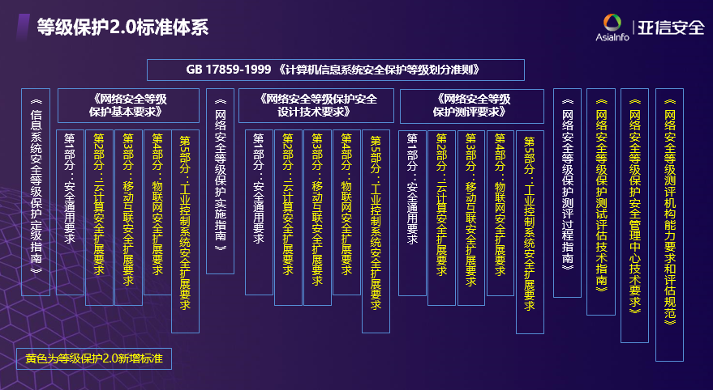

# 等级保护2.0

## 基本概念
发展历程：

相关标准：

基本框架：

## 工作流程

- 定级
  - 确定定级对象
  - 初步确定定级对象
  - 专家评审
  - 主管部门审核
  - 公安机关备案审查
- 备案
  - 持定级报告、备案表等材料到当地公安机关网安部门备案
- 建设整改
  - 参照信息系统当前等级要求和标准，对信息系统进行整改加固。
- 等级评测
  - 委托具备测评资质的测评机构对信息系统进行等级评测，形成正式的评测报告
- 监督检查
  - 向当地公安机关网监部门提交测评报告，配合完成检查。

## 定级

1.确定定级对象（组织的资产）

2.确定业务信息安全受到破坏时所侵害的客体。

3.综合评定对客体的侵害程度。依据业务信息安全保护等级矩阵确定。

<table id="tab" cellpadding="1" cellspacing="1" border="1">
<tr><th colspan="4">业务信息/系统服务的安全保护等级矩阵表</th></tr>   
<tr>   
	<th rowspan="2">受侵害的客体</th>
	<th colspan="3">对客体的侵害程度</th>
</tr>   
<tr>   
	<th>一般损害</th> 
	<th>严重损害</th>
    <th>特别严重损害</th>
</tr>   
<tr>   
    <td>公民、法人和其它组织的合法权益</td>   
    <td>第一级</td>
    <td>第二级</td>
    <td>第三级</td>
</tr> 
<tr>   
    <td>社会秩序、公共利益</td>   
    <td>第二级</td>
    <td>第三级</td> 
    <td>第四级</td>
   
</tr> 
<tr>   
    <td>国家安全</td>   
    <td>第三级</td>
    <td>第四级</td>
    <td>第五级</td>
</tr>    
</table> 

4.业务信息安全等级。

5.确定系统服务安全受到破坏时所侵害的客体。

6.综合评定对客体的侵害程度。

7.系统服务安全等级。

8.定级对象的初步安全保护顶级。

|等级|对象|侵害客体|侵害程度|监管程度|
|-|-|-|-|-|
|第一级|一般系统|合法权益|损害|自主保护级|
|第二级|一般系统|合法权益/社会秩序和公共利益|严重损害/损害|指导保护级|
|第三级|重要系统|社会秩序和公共利益/国家安全|严重损害/损害|监督保护级|   
|第四级|重要系统|社会秩序和公共利益/国家安全|特别严重损害/严重损害|强制保护级|
|第五级|极端重要系统|国家安全|特别严重损害|专控保护级|

## 备案

## 建设整改

## 等级评测
- 访谈
  - 通过引导信息系统相关进行有目的（针对性）交流以帮助测评人员理解、澄清或取得证据的过程
- 核查
  - 通过对测评队形（如制度文档、各类设备及相关安全配置等）进行观察、查验和分析，以帮助测评人员理解、澄清获取的证据的过程。
- 测试
  - 适用预订的方法/工具使评测对象（各类设备或安全配置）产生特定的结果，将运行结果与预期结果进行比对的过程。

等级评测结果：
- 符合，综合得分100份
  - 未发现安全问题，所有测评项得分均为5分。
- 基本符合，70~80分
  - 存在安全问题，但不会导致信息系统面临高等级安全风险。
- 不符合，60分以下
  - 信息系统中存在高风险，若有则一票否决。

## 等级保护2.0 安全通用要求技术部分要求及重点措施

一个中心、三个方面

2.0版安全通用要求技术部分要求项的主要变化

|分类|主要变化|
|-|-|
|安全管理中心|集中管控、集中监测、集中管理、集中事件分析|
|安全通信网络|通信传输：强化采用密码技术保证通信过程中数据的完整性和保密性；|
|安全区域边界|涉及边界防护、访问控制、入侵防范、恶意代码和垃圾邮件防范、安全审计多个方面|
|安全计算环境|涉及身份鉴别、强制访问控制、恶意代码防范、数据完整性和数据保密性、数据备份恢复等多方面；集中强调“剩余信息保护”和“个人信息保护”|

