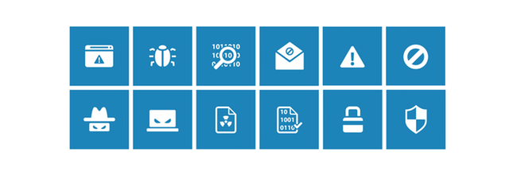

# Microsoft Malware Prediction

来源： https://www.kaggle.com/c/microsoft-malware-prediction/overview

更新：https://www.kaggle.com/c/malware-classification/overview



## 概述

恶意软件行业仍然是一个组织良好、资金充足的市场，致力于规避传统的安全措施。一旦电脑受到恶意软件的感染，犯罪分子会在很多方面伤害消费者和企业。微软拥有超过10亿的企业和消费者客户，非常重视这个问题，并投入了大量资金来提高安全性。作为其整体战略的一部分，微软正在挑战数据科学界开发技术，以预测一台机器是否会很快受到恶意软件的攻击。与之前的恶意软件挑战（Malware Challenge，2015）一样，微软正在向Kaggler提供一个前所未有的恶意软件数据集，以鼓励在预测恶意软件发生的有效技术方面取得开源进展。

Acknowledgements

This competition is hosted by Microsoft, Windows Defender ATP Research, Northeastern University College of Computer and Information Science, and Georgia Tech Institute for Information Security & Privacy.

## 数据描述

本次竞赛的目的是根据Windows机器的不同特性，预测该机器被各种恶意软件家族感染的概率。包含这些属性和机器感染的遥测数据是通过组合由Microsoft 终端防护解决方案Windows Defender收集的Heartbeat 和 威胁报告生成的。

数据集中的每一行对应一台主机，并通过属性MachineIdentifier进行唯一性标识。 HasDetections 是真实标记，标识了该主机是否被认定感染了恶意代码。

使用 train.csv文件中的标记，你一定能够预测在 test.csv 集中的主机是否已被感染。

本数据集使用的采样方法，结合了一定的业务约束，既考虑用户隐私也考虑了机器运行期间的时间周期。恶意代码检测本质上是一个时间序列问题，由于引入了新机器，在线和离线的机器，接收补丁的机器，接收新操作系统的机器，它变得很复杂。虽然此处提供的数据集已经过大致的时间划分，上述问题和抽样要求可能导致交叉验证分数在公开测试和私自测试中存在差异。此外，该数据集并不代表微软客户的机器；它已被抽样以包含更大比例的恶意软件机器。

### Columns

Unavailable or self-documenting column names are marked with an "NA".

- MachineIdentifier - Individual machine ID
  - 机器标识
- ProductName - Defender state information e.g. win8defender
  - 杀毒、防护软件信息
- EngineVersion - Defender state information e.g. 1.1.12603.0
  - 引擎版本
- AppVersion - Defender state information e.g. 4.9.10586.0
  - 防护软件版本
- AvSigVersion - Defender state information e.g. 1.217.1014.0
  - 防护软件签名版本
- IsBeta - Defender state information e.g. false
  - 是否为Beta 版
- RtpStateBitfield - NA
- IsSxsPassiveMode - NA
- DefaultBrowsersIdentifier - ID for the machine's default browser
  - 默认浏览器标识
- AVProductStatesIdentifier - ID for the specific configuration of a user's antivirus software
  - 防病毒软件状态标识，即用户防病毒软件
- AVProductsInstalled - NA
- AVProductsEnabled - NA
- HasTpm - True if machine has tpm
  - 加入机器上有TPM芯片或智能卡则返回true
- CountryIdentifier - ID for the country the machine is located in
  - 国家标识
- CityIdentifier - ID for the city the machine is located in
  - 城市标识
- OrganizationIdentifier - ID for the organization the machine belongs in, organization ID is mapped to both specific companies and broad industries
  - 组织机构标识
- GeoNameIdentifier - ID for the geographic region a machine is located in
  - 地理区域标识
- LocaleEnglishNameIdentifier - English name of Locale ID of the current user
  - 地区标识英文名
- Platform - Calculates platform name (of OS related properties and processor property)
  - 计算平台名称，处理器、OS等
- Processor - This is the process architecture of the installed operating system
  - 处理器信息
- OsVer - Version of the current operating system
  - 操作系统版本
- OsBuild - Build of the current operating system
  - 操作系统build号
- OsSuite - Product suite mask for the current operating system.
  - 产品套件mask
- OsPlatformSubRelease - Returns the OS Platform sub-release (Windows Vista, Windows 7, Windows 8, TH1, TH2)
  - 操作系统平台子版本
- OsBuildLab - Build lab that generated the current OS. Example: 9600.17630.amd64fre.winblue_r7.150109-2022
  - Build lab信息
- SkuEdition - The goal of this feature is to use the Product Type defined in the MSDN to map to a 'SKU-Edition' name that is useful in population reporting. The valid Product Type are defined in %sdxroot%\data\windowseditions.xml. This API has been used since Vista and Server 2008, so there are many Product Types that do not apply to Windows 10. The 'SKU-Edition' is a string value that is in one of three classes of results. The design must hand each class.
  - 产品类型（MSDN中定义）字符串
- IsProtected - This is a calculated field derived from the Spynet Report's AV Products field. Returns: a. TRUE if there is at least one active and up-to-date antivirus product running on this machine. b. FALSE if there is no active AV product on this machine, or if the AV is active, but is not receiving the latest updates. c. null if there are no Anti Virus Products in the report. Returns: Whether a machine is protected.
  - 用于统计是否有任何一种激活的杀毒软件保护系统
- AutoSampleOptIn - This is the SubmitSamplesConsent value passed in from the service, available on CAMP 9+
  - 自动样本提交值？
- PuaMode - Pua Enabled mode from the service
  - 潜在意外应用（potentially unwanted application）的已启动模式
- SMode - This field is set to true when the device is known to be in 'S Mode', as in, Windows 10 S mode, where only Microsoft Store apps can be installed
  - 反应是否设置为S mode，windows 10的S mode 指仅允许安装微软应用商店的软件。
- IeVerIdentifier - NA
  - Ie 版本标识
- SmartScreen - This is the SmartScreen enabled string value from registry. This is obtained by checking in order, HKLM\SOFTWARE\Policies\Microsoft\Windows\System\SmartScreenEnabled and HKLM\SOFTWARE\Microsoft\Windows\CurrentVersion\Explorer\SmartScreenEnabled. If the value exists but is blank, the value "ExistsNotSet" is sent in telemetry.
  - 智能屏幕，显示注册表中 Windows SmartScreen启动的字符串值
- Firewall - This attribute is true (1) for Windows 8.1 and above if windows firewall is enabled, as reported by the service.
  - 防火墙状态
- UacLuaenable - This attribute reports whether or not the "administrator in Admin Approval Mode" user type is disabled or enabled in UAC. The value reported is obtained by reading the regkey HKLM\SOFTWARE\Microsoft\Windows\CurrentVersion\Policies\System\EnableLUA.
  - 是否  "administrator in Admin Approval Mode" 用户类型被禁用或是在UAC中被启用
- Census_MDC2FormFactor - yinjA grouping based on a combination of Device Census level hardware characteristics. The logic used to define Form Factor is rooted in business and industry standards and aligns with how people think about their device. (Examples: Smartphone, Small Tablet, All in One, Convertible...)
  - 基于设备普查级硬件特性组合的分组。设备普查是微软遥测框架的一部分(Telemetry Framework )
- Census_DeviceFamily - AKA DeviceClass. Indicates the type of device that an edition of the OS is intended for. Example values: Windows.Desktop, Windows.Mobile, and iOS.Phone
  - 普查得到的设备族信息、设备分类信息
- Census_OEMNameIdentifier - NA
  - 普查得到的OEM名称识别符
- Census_OEMModelIdentifier - NA
- Census_ProcessorCoreCount - Number of logical cores in the processor
  - 处理器核心数
- Census_ProcessorManufacturerIdentifier - NA
- Census_ProcessorModelIdentifier - NA
- Census_ProcessorClass - A classification of processors into high/medium/low. Initially used for Pricing Level SKU. No longer maintained and updated
  - 处理器分类，高中低
- Census_PrimaryDiskTotalCapacity - Amount of disk space on primary disk of the machine in MB
  - 主磁盘容量
- Census_PrimaryDiskTypeName - Friendly name of Primary Disk Type - HDD or SSD
  - 主磁盘类型：HDD 或 SSD
- Census_SystemVolumeTotalCapacity - The size of the partition that the System volume is installed on in MB
  - 系统卷总容量
- Census_HasOpticalDiskDrive - True indicates that the machine has an optical disk drive (CD/DVD)
  - 是否有可选的磁盘驱动器
- Census_TotalPhysicalRAM - Retrieves the physical RAM in MB
  - 总物理内存
- Census_ChassisTypeName - Retrieves a numeric representation of what type of chassis the machine has. A value of 0 means xx
  - 机器底层架构类型
- Census_InternalPrimaryDiagonalDisplaySizeInInches - Retrieves the physical diagonal length in inches of the primary display
  - 主要显示器对角线大小英寸值
- Census_InternalPrimaryDisplayResolutionHorizontal - Retrieves the number of pixels in the horizontal direction of the internal display.
- Census_InternalPrimaryDisplayResolutionVertical - Retrieves the number of pixels in the vertical direction of the internal display
- Census_PowerPlatformRoleName - Indicates the OEM preferred power management profile. This value helps identify the basic form factor of the device
- Census_InternalBatteryType - NA
- Census_InternalBatteryNumberOfCharges - NA
- Census_OSVersion - Numeric OS version Example - 10.0.10130.0
- Census_OSArchitecture - Architecture on which the OS is based. Derived from OSVersionFull. Example - amd64
- Census_OSBranch - Branch of the OS extracted from the OsVersionFull. Example - OsBranch = fbl_partner_eeap where OsVersion = 6.4.9813.0.amd64fre.fbl_partner_eeap.140810-0005
- Census_OSBuildNumber - OS Build number extracted from the OsVersionFull. Example - OsBuildNumber = 10512 or 10240
- Census_OSBuildRevision - OS Build revision extracted from the OsVersionFull. Example - OsBuildRevision = 1000 or 16458
- Census_OSEdition - Edition of the current OS. Sourced from HKLM\Software\Microsoft\Windows NT\CurrentVersion@EditionID in registry. Example: Enterprise
- Census_OSSkuName - OS edition friendly name (currently Windows only)
- Census_OSInstallTypeName - Friendly description of what install was used on the machine i.e. clean
- Census_OSInstallLanguageIdentifier - NA
- Census_OSUILocaleIdentifier - NA
- Census_OSWUAutoUpdateOptionsName - Friendly name of the WindowsUpdate auto-update settings on the machine.
- Census_IsPortableOperatingSystem - Indicates whether OS is booted up and running via Windows-To-Go on a USB stick.
- Census_GenuineStateName - Friendly name of OSGenuineStateID. 0 = Genuine
- Census_ActivationChannel - Retail license key or Volume license key for a machine.
- Census_IsFlightingInternal - NA
- Census_IsFlightsDisabled - Indicates if the machine is participating in flighting.
- Census_FlightRing - The ring that the device user would like to receive flights for. This might be different from the ring of the OS which is currently installed if the user changes the ring after getting a flight from a different ring.
- Census_ThresholdOptIn - NA
- Census_FirmwareManufacturerIdentifier - NA
- Census_FirmwareVersionIdentifier - NA
- Census_IsSecureBootEnabled - Indicates if Secure Boot mode is enabled.
- Census_IsWIMBootEnabled - NA
- Census_IsVirtualDevice - Identifies a Virtual Machine (machine learning model)
- Census_IsTouchEnabled - Is this a touch device ?
- Census_IsPenCapable - Is the device capable of pen input ?
- Census_IsAlwaysOnAlwaysConnectedCapable - Retreives information about whether the battery enables the device to be AlwaysOnAlwaysConnected .
- Wdft_IsGamer - Indicates whether the device is a gamer device or not based on its hardware combination.
- Wdft_RegionIdentifier - NA

### How to access the dataset

There are 3 files in official data sources:
- sample_submission.csv 2 columns
- test.csv 82 columns
- train.csv 83 columns

Kaggle API command:
```kaggle competitions download -c microsoft-malware-prediction```

Help: https://github.com/Kaggle/kaggle-api

## 分析思路

### 数据加载

中小csv文件可以用pandas.read_csv()读取，若文件较大，可以使用chunksize参数，指定分块大小。

还可预先指定csv文件中每一列的数据类型，这样pandas就不会在读取csv文件时按默认数据类型来读取csv列数据。确定类型后会节省大量内存空间。

```python

import pandas as pd
import numpy as np
import matplotlib.pyplot as plt
# referred https://www.kaggle.com/theoviel/load-the-totality-of-the-data
dtypes = {
        'MachineIdentifier':                                    'category',
        'ProductName':                                          'category',
        'EngineVersion':                                        'category',
        'AppVersion':                                           'category',
        'AvSigVersion':                                         'category',
        'IsBeta':                                               'int8',
        'RtpStateBitfield':                                     'float16',
        'IsSxsPassiveMode':                                     'int8',
        'DefaultBrowsersIdentifier':                            'float32',
        'AVProductStatesIdentifier':                            'float32',
        'AVProductsInstalled':                                  'float16',
        'AVProductsEnabled':                                    'float16',
        'HasTpm':                                               'int8',
        'CountryIdentifier':                                    'int16',
        'CityIdentifier':                                       'float32',
        'OrganizationIdentifier':                               'float16',
        'GeoNameIdentifier':                                    'float16',
        'LocaleEnglishNameIdentifier':                          'int16',
        'Platform':                                             'category',
        'Processor':                                            'category',
        'OsVer':                                                'category',
        'OsBuild':                                              'int16',
        'OsSuite':                                              'int16',
        'OsPlatformSubRelease':                                 'category',
        'OsBuildLab':                                           'category',
        'SkuEdition':                                           'category',
        'IsProtected':                                          'float16',
        'AutoSampleOptIn':                                      'int8',
        'PuaMode':                                              'category',
        'SMode':                                                'float16',
        'IeVerIdentifier':                                      'float16',
        'SmartScreen':                                          'category',
        'Firewall':                                             'float16',
        'UacLuaenable':                                         'float32',
        'UacLuaenable':                                         'float64', # was 'float32'
        'Census_MDC2FormFactor':                                'category',
        'Census_DeviceFamily':                                  'category',
        'Census_OEMNameIdentifier':                             'float32', # was 'float16'
        'Census_OEMModelIdentifier':                            'float32',
        'Census_ProcessorCoreCount':                            'float16',
        'Census_ProcessorManufacturerIdentifier':               'float16',
        'Census_ProcessorModelIdentifier':                      'float32', # was 'float16'
        'Census_ProcessorClass':                                'category',
        'Census_PrimaryDiskTotalCapacity':                      'float64', # was 'float32'
        'Census_PrimaryDiskTypeName':                           'category',
        'Census_SystemVolumeTotalCapacity':                     'float64', # was 'float32'
        'Census_HasOpticalDiskDrive':                           'int8',
        'Census_TotalPhysicalRAM':                              'float32',
        'Census_ChassisTypeName':                               'category',
        'Census_InternalPrimaryDiagonalDisplaySizeInInches':    'float32', # was 'float16'
        'Census_InternalPrimaryDisplayResolutionHorizontal':    'float32', # was 'float16'
        'Census_InternalPrimaryDisplayResolutionVertical':      'float32', # was 'float16'
        'Census_PowerPlatformRoleName':                         'category',
        'Census_InternalBatteryType':                           'category',
        'Census_InternalBatteryNumberOfCharges':                'float64', # was 'float32'
        'Census_OSVersion':                                     'category',
        'Census_OSArchitecture':                                'category',
        'Census_OSBranch':                                      'category',
        'Census_OSBuildNumber':                                 'int16',
        'Census_OSBuildRevision':                               'int32',
        'Census_OSEdition':                                     'category',
        'Census_OSSkuName':                                     'category',
        'Census_OSInstallTypeName':                             'category',
        'Census_OSInstallLanguageIdentifier':                   'float16',
        'Census_OSUILocaleIdentifier':                          'int16',
        'Census_OSWUAutoUpdateOptionsName':                     'category',
        'Census_IsPortableOperatingSystem':                     'int8',
        'Census_GenuineStateName':                              'category',
        'Census_ActivationChannel':                             'category',
        'Census_IsFlightingInternal':                           'float16',
        'Census_IsFlightsDisabled':                             'float16',
        'Census_FlightRing':                                    'category',
        'Census_ThresholdOptIn':                                'float16',
        'Census_FirmwareManufacturerIdentifier':                'float16',
        'Census_FirmwareVersionIdentifier':                     'float32',
        'Census_IsSecureBootEnabled':                           'int8',
        'Census_IsWIMBootEnabled':                              'float16',
        'Census_IsVirtualDevice':                               'float16',
        'Census_IsTouchEnabled':                                'int8',
        'Census_IsPenCapable':                                  'int8',
        'Census_IsAlwaysOnAlwaysConnectedCapable':              'float16',
        'Wdft_IsGamer':                                         'float16',
        'Wdft_RegionIdentifier':                                'float16',
        'HasDetections':                                        'int8'
        }
train = pd.read_csv('../input/train.csv', dtype=dtypes)
train.shape
```

结果会显示(8921483, 83)。

### 特征降维

数据集中维数有近百个，应当在分析前首先降维。可以考虑的思路：
- 去掉那些 99% 都是空值/缺失值的列，称其为 mostly-missing feaures
- 去掉那些过于数据倾斜属性（ too-skewed features ），这些列 99% 的数据都一样
- 去掉高相关度属性。通过测试列之间的相关性，找出相关系数大于 0.99 的列，比较这些属性的分布以及标记，选择次要列去除。


根据上面的原则，一些[研究人员认为](https://www.kaggle.com/c/microsoft-malware-prediction/notebooks)，下面17列基本无用，可以放心去除：
- (M) PuaMode
- (M) Census_ProcessorClass
- (S) Census_IsWIMBootEnabled
- (S) IsBeta
- (S) Census_IsFlightsDisabled
- (S) Census_IsFlightingInternal
- (S) AutoSampleOptIn
- (S) Census_ThresholdOptIn
- (S) SMode
- (S) Census_IsPortableOperatingSystem
- (S) Census_DeviceFamily
- (S) UacLuaenable
- (S) Census_IsVirtualDevice
- (C) Platform
- (C) Census_OSSkuName
- (C) Census_OSInstallLanguageIdentifier
- (C) Processor

上面括号里的M，表示 mostly-missing features，S表示 too-skewed-features，C表示 hightly-correlated features.

#### 找出mostly-missing columns的方法：

```python
(train.isnull().sum()/train.shape[0]).sort_values(ascending=False)
```
结果如下：
```
PuaMode                                              0.999741
Census_ProcessorClass                                0.995894
DefaultBrowsersIdentifier                            0.951416
Census_IsFlightingInternal                           0.830440
...
...
Length: 83, dtype: float64
```
上面有两列的值为0.99，去掉它们
```
droppable_features.append('PuaMode')
droppable_features.append('Census_ProcessorClass')
```
#### Too skewed columns

```python
pd.options.display.float_format = '{:,.4f}'.format
sk_df = pd.DataFrame([{'column': c, 'uniq': train[c].nunique(), 'skewness': train[c].value_counts(normalize=True).values[0] * 100} for c in train.columns])
sk_df = sk_df.sort_values('skewness', ascending=False)
sk_df
```

结果中会看到12个无用的Too skewed属性
```
droppable_features.extend(sk_df[sk_df.skewness > 99].column.tolist())
droppable_features

# PuaMode is duplicated in the two categories.
droppable_features.remove('PuaMode')

# Drop these columns.
train.drop(droppable_features, axis=1, inplace=True)
```


#### 小结
```python

droppable_features = []
remove_cols = ['PuaMode', 'Census_ProcessorClass', 'Census_IsWIMBootEnabled', 'IsBeta', 'Census_IsFlightsDisabled', 'Census_IsFlightingInternal', 'AutoSampleOptIn', 'Census_ThresholdOptIn', 'SMode', 'Census_IsPortableOperatingSystem', 'Census_DeviceFamily', 'UacLuaenable', 'Census_IsVirtualDevice', 'Platform', 'Census_OSSkuName', 'Census_OSInstallLanguageIdentifier', 'Processor']

train.drop(remove_cols, axis=1, inplace=True)

test.drop(remove_cols, axis=1, inplace=True)
```


## kaggle kernels

### 使用 LightGBM 和稀疏矩阵进行预测
```python

import pandas as pd
import numpy as np
import lightgbm as lgb
#import xgboost as xgb
from scipy.sparse import vstack, csr_matrix, save_npz, load_npz
from sklearn.preprocessing import LabelEncoder, OneHotEncoder
from sklearn.model_selection import StratifiedKFold
#from sklearn.metrics import roc_auc_score
import gc
gc.enable()

#确定各列类型，有利于大幅缩减内存
dtypes = {
        'MachineIdentifier':                                    'category',
        'ProductName':                                          'category',
        'EngineVersion':                                        'category',
        'AppVersion':                                           'category',
        'AvSigVersion':                                         'category',
        'IsBeta':                                               'int8',
        'RtpStateBitfield':                                     'float16',
        'IsSxsPassiveMode':                                     'int8',
        'DefaultBrowsersIdentifier':                            'float16',
        'AVProductStatesIdentifier':                            'float32',
        'AVProductsInstalled':                                  'float16',
        'AVProductsEnabled':                                    'float16',
        'HasTpm':                                               'int8',
        'CountryIdentifier':                                    'int16',
        'CityIdentifier':                                       'float32',
        'OrganizationIdentifier':                               'float16',
        'GeoNameIdentifier':                                    'float16',
        'LocaleEnglishNameIdentifier':                          'int8',
        'Platform':                                             'category',
        'Processor':                                            'category',
        'OsVer':                                                'category',
        'OsBuild':                                              'int16',
        'OsSuite':                                              'int16',
        'OsPlatformSubRelease':                                 'category',
        'OsBuildLab':                                           'category',
        'SkuEdition':                                           'category',
        'IsProtected':                                          'float16',
        'AutoSampleOptIn':                                      'int8',
        'PuaMode':                                              'category',
        'SMode':                                                'float16',
        'IeVerIdentifier':                                      'float16',
        'SmartScreen':                                          'category',
        'Firewall':                                             'float16',
        'UacLuaenable':                                         'float32',
        'Census_MDC2FormFactor':                                'category',
        'Census_DeviceFamily':                                  'category',
        'Census_OEMNameIdentifier':                             'float16',
        'Census_OEMModelIdentifier':                            'float32',
        'Census_ProcessorCoreCount':                            'float16',
        'Census_ProcessorManufacturerIdentifier':               'float16',
        'Census_ProcessorModelIdentifier':                      'float16',
        'Census_ProcessorClass':                                'category',
        'Census_PrimaryDiskTotalCapacity':                      'float32',
        'Census_PrimaryDiskTypeName':                           'category',
        'Census_SystemVolumeTotalCapacity':                     'float32',
        'Census_HasOpticalDiskDrive':                           'int8',
        'Census_TotalPhysicalRAM':                              'float32',
        'Census_ChassisTypeName':                               'category',
        'Census_InternalPrimaryDiagonalDisplaySizeInInches':    'float16',
        'Census_InternalPrimaryDisplayResolutionHorizontal':    'float16',
        'Census_InternalPrimaryDisplayResolutionVertical':      'float16',
        'Census_PowerPlatformRoleName':                         'category',
        'Census_InternalBatteryType':                           'category',
        'Census_InternalBatteryNumberOfCharges':                'float32',
        'Census_OSVersion':                                     'category',
        'Census_OSArchitecture':                                'category',
        'Census_OSBranch':                                      'category',
        'Census_OSBuildNumber':                                 'int16',
        'Census_OSBuildRevision':                               'int32',
        'Census_OSEdition':                                     'category',
        'Census_OSSkuName':                                     'category',
        'Census_OSInstallTypeName':                             'category',
        'Census_OSInstallLanguageIdentifier':                   'float16',
        'Census_OSUILocaleIdentifier':                          'int16',
        'Census_OSWUAutoUpdateOptionsName':                     'category',
        'Census_IsPortableOperatingSystem':                     'int8',
        'Census_GenuineStateName':                              'category',
        'Census_ActivationChannel':                             'category',
        'Census_IsFlightingInternal':                           'float16',
        'Census_IsFlightsDisabled':                             'float16',
        'Census_FlightRing':                                    'category',
        'Census_ThresholdOptIn':                                'float16',
        'Census_FirmwareManufacturerIdentifier':                'float16',
        'Census_FirmwareVersionIdentifier':                     'float32',
        'Census_IsSecureBootEnabled':                           'int8',
        'Census_IsWIMBootEnabled':                              'float16',
        'Census_IsVirtualDevice':                               'float16',
        'Census_IsTouchEnabled':                                'int8',
        'Census_IsPenCapable':                                  'int8',
        'Census_IsAlwaysOnAlwaysConnectedCapable':              'float16',
        'Wdft_IsGamer':                                         'float16',
        'Wdft_RegionIdentifier':                                'float16',
        'HasDetections':                                        'int8'
        }

print('Download Train and Test Data.\n')
# 注意 dtype=dtypes, low_memory=True 是为读取大文件所设置的参数。
train = pd.read_csv('../input/train.csv', dtype=dtypes, low_memory=True)
# 指定索引列
train['MachineIdentifier'] = train.index.astype('uint32')
test  = pd.read_csv('../input/test.csv',  dtype=dtypes, low_memory=True)
test['MachineIdentifier']  = test.index.astype('uint32')
# 回收无用内存
gc.collect()

# 特征预处理，对每一列进行字符串化、编码、填补空值、去数据倾斜、
print('Transform all features to category.\n')
for usecol in train.columns.tolist()[1:-1]:

    train[usecol] = train[usecol].astype('str')
    test[usecol] = test[usecol].astype('str')
    
    #Fit LabelEncoder
    le = LabelEncoder().fit(
            np.unique(train[usecol].unique().tolist()+
                      test[usecol].unique().tolist()))

    #At the end 0 will be used for dropped values
    train[usecol] = le.transform(train[usecol])+1
    test[usecol]  = le.transform(test[usecol])+1

    agg_tr = (train
              .groupby([usecol])
              .aggregate({'MachineIdentifier':'count'})
              .reset_index()
              .rename({'MachineIdentifier':'Train'}, axis=1))
    agg_te = (test
              .groupby([usecol])
              .aggregate({'MachineIdentifier':'count'})
              .reset_index()
              .rename({'MachineIdentifier':'Test'}, axis=1))

    agg = pd.merge(agg_tr, agg_te, on=usecol, how='outer').replace(np.nan, 0)
    #Select values with more than 1000 observations
    agg = agg[(agg['Train'] > 1000)].reset_index(drop=True)
    agg['Total'] = agg['Train'] + agg['Test']
    #Drop unbalanced values
    agg = agg[(agg['Train'] / agg['Total'] > 0.2) & (agg['Train'] / agg['Total'] < 0.8)]
    agg[usecol+'Copy'] = agg[usecol]

    train[usecol] = (pd.merge(train[[usecol]], 
                              agg[[usecol, usecol+'Copy']], 
                              on=usecol, how='left')[usecol+'Copy']
                     .replace(np.nan, 0).astype('int').astype('category'))

    test[usecol]  = (pd.merge(test[[usecol]], 
                              agg[[usecol, usecol+'Copy']], 
                              on=usecol, how='left')[usecol+'Copy']
                     .replace(np.nan, 0).astype('int').astype('category'))

    del le, agg_tr, agg_te, agg, usecol
    gc.collect()
          
y_train = np.array(train['HasDetections'])
train_ids = train.index
test_ids  = test.index

del train['HasDetections'], train['MachineIdentifier'], test['MachineIdentifier']
gc.collect()

print("If you don't want use Sparse Matrix choose Kernel Version 2 to get simple solution.\n")

print('--------------------------------------------------------------------------------------------------------')
print('Transform Data to Sparse Matrix.')
print('Sparse Matrix can be used to fit a lot of models, eg. XGBoost, LightGBM, Random Forest, K-Means and etc.')
print('To concatenate Sparse Matrices by column use hstack()')
print('Read more about Sparse Matrix https://docs.scipy.org/doc/scipy/reference/sparse.html')
print('Good Luck!')
print('--------------------------------------------------------------------------------------------------------')

#Fit OneHotEncoder
ohe = OneHotEncoder(categories='auto', sparse=True, dtype='uint8').fit(train)

#Transform data using small groups to reduce memory usage
m = 100000
train = vstack([ohe.transform(train[i*m:(i+1)*m]) for i in range(train.shape[0] // m + 1)])
test  = vstack([ohe.transform(test[i*m:(i+1)*m])  for i in range(test.shape[0] // m +  1)])
save_npz('train.npz', train, compressed=True)
save_npz('test.npz',  test,  compressed=True)

del ohe, train, test
gc.collect()

skf = StratifiedKFold(n_splits=5, shuffle=True, random_state=42)
skf.get_n_splits(train_ids, y_train)

lgb_test_result  = np.zeros(test_ids.shape[0])
#lgb_train_result = np.zeros(train_ids.shape[0])
#xgb_test_result  = np.zeros(test_ids.shape[0])
#xgb_train_result = np.zeros(train_ids.shape[0])
counter = 0

print('\nLightGBM\n')

for train_index, test_index in skf.split(train_ids, y_train):
    
    print('Fold {}\n'.format(counter + 1))
    
    train = load_npz('train.npz')
    X_fit = vstack([train[train_index[i*m:(i+1)*m]] for i in range(train_index.shape[0] // m + 1)])
    X_val = vstack([train[test_index[i*m:(i+1)*m]]  for i in range(test_index.shape[0] //  m + 1)])
    X_fit, X_val = csr_matrix(X_fit, dtype='float32'), csr_matrix(X_val, dtype='float32')
    y_fit, y_val = y_train[train_index], y_train[test_index]
    
    del train
    gc.collect()

    lgb_model = lgb.LGBMClassifier(max_depth=-1,
                                   n_estimators=30000,
                                   learning_rate=0.05,
                                   num_leaves=2**12-1,
                                   colsample_bytree=0.28,
                                   objective='binary', 
                                   n_jobs=-1)
                                   
    #xgb_model = xgb.XGBClassifier(max_depth=6,
    #                              n_estimators=30000,
    #                              colsample_bytree=0.2,
    #                              learning_rate=0.1,
    #                              objective='binary:logistic', 
    #                              n_jobs=-1)
    
                               
    lgb_model.fit(X_fit, y_fit, eval_metric='auc', 
                  eval_set=[(X_val, y_val)], 
                  verbose=100, early_stopping_rounds=100)
                  
    #xgb_model.fit(X_fit, y_fit, eval_metric='auc', 
    #              eval_set=[(X_val, y_val)], 
    #              verbose=1000, early_stopping_rounds=300)

    #lgb_train_result[test_index] += lgb_model.predict_proba(X_val)[:,1]
    #xgb_train_result[test_index] += xgb_model.predict_proba(X_val)[:,1]
    
    del X_fit, X_val, y_fit, y_val, train_index, test_index
    gc.collect()
    
    test = load_npz('test.npz')
    test = csr_matrix(test, dtype='float32')
    lgb_test_result += lgb_model.predict_proba(test)[:,1]
    #xgb_test_result += xgb_model.predict_proba(test)[:,1]
    counter += 1
    
    del test
    gc.collect()
    
    #Stop fitting to prevent time limit error
    #if counter == 3 : break

#print('\nLigthGBM VAL AUC Score: {}'.format(roc_auc_score(y_train, lgb_train_result)))
#print('\nXGBoost VAL AUC Score: {}'.format(roc_auc_score(y_train, xgb_train_result)))

submission = pd.read_csv('../input/sample_submission.csv')
submission['HasDetections'] = lgb_test_result / counter
submission.to_csv('lgb_submission.csv', index=False)
#submission['HasDetections'] = xgb_test_result / counter
#submission.to_csv('xgb_submission.csv', index=False)
#submission['HasDetections'] = 0.5 * lgb_test_result / counter  + 0.5 * xgb_test_result / counter 
##submission.to_csv('lgb_xgb_submission.csv', index=False)

print('\nDone.')
```