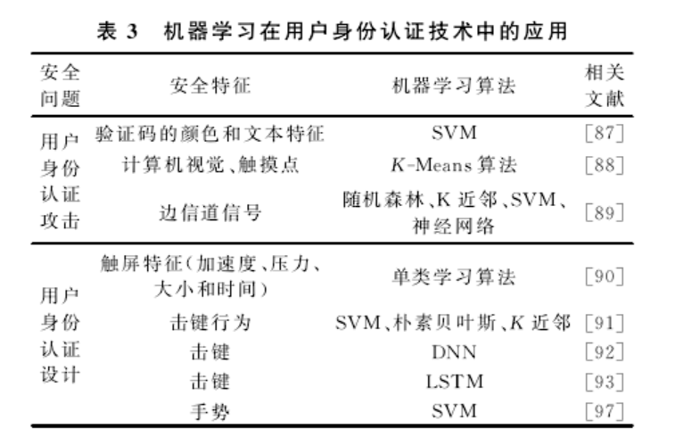

# 0x17机器学习与网络安全

## 背景
随着大数据与人工智能技术在众多领域落地生根，网络安全成为又一个具有潜力的AI应用领域。

很多研究者和企业已经将AI技术应用于：
- 恶意代码检测
- 网络流量检测
- 电子邮件检测

## 历史
在２０世纪８０年代，已有学者在网络入侵检测中应用机器学习技术，但受限于当时的存储空间及计算能力，机器学习未能引起学者们的重视．随着大数据、云计算技术的出现，对搜集、存储、管理及处理数据的能力大幅度提升，因此，将机器学习应用到网络空间安全中，已成为近年来安全领域的研究热点。

安全领域四大顶级会议（ＣＣＳ、Ｓ＆Ｐ、ＵＳＥＮＩＸ、ＮＤＳＳ）近年来收录了５０余篇机器学习在网络空间安全中的相关研究工作，ＣＣＳ会议甚至成立了专题ＡＩＳｅｃ研讨人工智能技术在安全和隐私方面的应用；此外，在汇聚世界各地信息安全从业人员的美国黑帽大会上，机器学习和安全领域结合的议题也成
为关注热点之一．

目前，已有学者对机器学习与网络空间安全中的部分安全问题进行了研究梳理和总结：
- Jiang等人从方法、算法和系统设计三个方面系统总结了2008年～2016年之间应用机器学习到部分安全问题的研究工作，主要包含网络安全、安全服务、软件和应用安全、系统安全、恶意软件、社会工程以及入侵检测系统这７个安全研究方向．
- Buczak等人、Sommer等人从模型的构建及部署问题介绍了入侵检测和机器学习结合的研究工作。
- Nishanl等人则是介绍了针对移动自组织网络入侵检测和机器学习结合的研究。
- Wang等人针对机器学习在流量预测、资源分配等网络应用领域进行了研究．
- 张蕾等人针对网络空间安全一级学科的五个研究方向进行调研，即网络空间安全基础、密码学及应用、系统安全、网络安全和应用安全。

虽然到目前为止，实验室中已经有了不少成果，但在线联机的AI安全检测效果仍不能满足人们的需要。原因在于：
- 现实场景下有标记数据相对较少，监督学习应用场景不多
- 样本稀疏、正负样本倾斜较大
- 攻防技术变化快，难以使用固定特征

## 典型案例

ABI Research 的分析师估测，在网络安全界，机器学习将推动大数据、人工智能(AI)及分析的投资，有望在2021年达到960亿美元，同时，世界科技巨头已经在采取措施更好地保护自己的客户。

谷歌用机器学习来分析安卓移动终端上的威胁——从被感染手机上识别并清除恶意软件。云基础设施巨头亚马逊收购了初创公司 harvest.AI，并发布了Macie——用机器学习来发现、梳理并分类S3云存储上数据的一项服务。

与此同时，企业安全供应商一直努力将机器学习集成进新旧产品线中，希望能改善恶意软检测率。大多数主流安全公司已从纯“基于特征码”的系统，转向了试图解释行为及事件，并从各种源学习判断安全与风险的机器学习系统。这仍是个新兴领域，但明显是未来发展方向。

AI和机器学习将极大改变安全运作方式，虽然目前正处在驱动网络防御的早期阶段，但已经在终端、网络、欺诈或SIEM中，起到了识别恶意活动模式的明显作用。未来，在防御服务中断、属性及用户行为修改等领域，我们将看到越来越多的用例。

### 应用案例1：用机器学习检测恶意活动并阻止攻击

机器学习算法可更快速检测恶意活动，并在攻击开始前就予以阻止。英国初创公司Darktrace( https://www.darktrace.com/en/ )于2013年成立，其基于机器学习的企业免疫解决方案( Enterprise Immune Solution )，在这方面已取得了很多成功。作为这家公司的技术总监大卫·帕尔玛见证了机器学习对恶意活动及攻击的影响。

帕尔玛称，利用机器学习算法，Darktrace最近帮助北美一家赌场检测出了数据泄露攻击。该攻击将联网鱼缸用作了进入赌场网络的切入点。该公司还宣称，去年夏天的WannaCry勒索软件大肆虐中，其算法也防止了类似的一起攻击。

针对感染了150个国家20多万受害者的WannaCry勒索软件，帕尔玛称：“在数秒内，我们的算法就检测出了一家国民医疗服务(NHS)机构网络中的攻击，在尚未对该机构造成任何破坏前，此威胁就被缓解掉了。事实上，我们的客户没有任何一家受到WannaCry攻击的伤害，包括那些没打补丁的。”

### 应用案例2：用机器学习分析移动终端

移动设备上，机器学习已成主流，谷歌采用机器学习来分析移动终端威胁，而企业则在防护自带及自选移动设备上看到了机会。

10月，MobileIron和 Zimperium 宣布合作，帮助企业将机器学习集成进移动杀软解决方案中。MobileIron将在自己的安全及合规引擎中，集成Zimperium基于机器学习的威胁检测，并作为联合解决方案售出，解决设备、网络及应用威胁检测，快速自动化动作防护公司数据之类的难题。

其他供应商也在计划改善自己的移动解决方案。LookOut、被赛门铁克收购的Skycure，还有Wandera，是移动威胁检测及防御市场中的佼佼者，每家都用自有机器学习算法检测潜在威胁。拿Wandera举个例子。这家公司最近刚公开发布了其威胁检测引擎 MI:RIAM，据称检测出了超过400种针对企业移动设备的SLocker勒索软件变种。

### 应用案例3：用机器学习增强人类分析

机器学习在安全领域的核心应用，有人认为是帮助人类分析师处理安全方面的各项工作，包括恶意攻击检测、网络分析、终端防护及漏洞评估。但在威胁情报方面，才是最令人兴奋的。

比如说，2016年，麻省理工学院计算机科学和人工智能实验室(CSAIL)，开发出了名AI2的系统。这是一个自适应机器学习安全平台，可帮助分析师从海量数据中找出真正有用的东西。该系统每天审查数百万登录，过滤数据，并将滤出内容传给人类分析师，可将警报数量大幅降低至每天100个左右。由CSAIL和初创公司PatternEx共同进行的实验表明，攻击检测率被提升到了85%，而误报率降低至原先的1/5。

AI square 可以检测85%的恶意行为。

### 应用案例4：用机器学习自动化重复性安全工作

机器学习的真正价值，在于可以自动化重复性劳动，让员工可以专注在更重要的工作上。帕尔玛称，机器学习最终应旨在“消除重复性低价值决策活动对人力的需求”上，比如归类威胁情报等活动。让机器处理重复性工作和阻止勒索软件之类战术性救火工作，这样人类就能解放双手去搞定战略性问题了，比如现代化 Windows XP 系统等等。

博思艾伦咨询公司也在走这个路线。据报道，该公司用AI工具更高效地分配人类安全资源，分类威胁，让员工可以专注最关键的攻击。

### 应用案例5：用机器学习堵上零日漏洞

有人认为，机器学习有助堵上漏洞，尤其是零日威胁和主要针对不安全IoT设备的那些威胁。该领域里已出现了先驱者：《福布斯》报道，亚利桑那州立大学的一支团队，采用机器学习监视暗网流量，以识别与零日漏洞利用相关的数据。有了此类洞见的加持，公司企业就可堵上漏洞，在漏洞造成数据泄露前就断掉漏洞利用的机会。

### 应用案例6：芯片安全检测

有学者尝试利用机器学习技术来解决芯片安全问题，主要基于边信号分析、指纹识别和图像识别的劣质芯片和硬件木马检测．针对芯片知识产权保护安全，已有研究提出物理不可克隆函数（PUF）攻击，主要是利用机器学习技术推测由PUF生成的芯片知识产权保护标识．

基于边信道差异参数检测研究中，Huang等人选取了原厂芯片的若干差异参数作为正样例数据，使用单类支持向量机（oc-svm）训练劣质芯片分类器，从而实现在待测芯片中检测劣质芯片，有效减少了检测芯片的成本和时间开销．Xiao等人利用时钟扫描技术生成芯片路径延迟指纹，分别使用简单异常点分析（Simple Outlier Analysis，SOA）和主成分分析法检测劣质芯片，PCA算法识别准确率优于SOA．该方案不需要使用额外的辅助电路，但不适合老化时间短且老化影响小的情况．

基于芯片外形的检测研究中，研究人员提出利用芯片图像特征识别劣质芯片．例如Asadizanjani等人以众包方式收集劣质芯片数据，基于其构建的开放劣质芯片图片数据库，再利用人工神经网络ANN算法提取待测芯片图片的特征，自动分类芯片．该方法的缺点是当芯片外表颜色、擦痕等变化不明显时，无法检测出劣质芯片．

芯片的硬件木马通常指在原始芯片植入具有恶意功能的冗余电路．硬件木马通常分为物理上的木马（例如增加或删除晶体管、开关选择器、连接线等）和激活态的木马（例如触发器和负载）．被植入木马的芯片，其热量、功耗和延时等边信道信号会有所改变，因此可以通过收集芯片边信道的参数指纹，在多维的空间对比，判断是否在可信芯片的参数指纹
范围内．目前机器学习在硬件木马检测方向研究有芯片原理图成像识别和边信道信号分析．

芯片原理图成像识别研究中，Bao等人提出在逆向工程单层成像后，将实验芯片与可信芯片的成像图差值作为特征参数，使用OC-SVM算法进行检测．在公开的基准测试中，该方法检测芯片硬件木马有着较高的准确率，但当芯片成像图网格参数较小以及木马由较小参数篡改构造时，较难检测出硬件木马．

芯片原理图成像技术需要昂贵的设备支持，并且减少芯片层级会对芯片造成毁灭性破坏．因此，较多的研究在分析边信道信号方向上．例如Liu等人利用可信芯片电路仿真、蒙特卡洛分析得到多维边信道信号数据，再利用ＰＣＡ算法对数据作降维处理，然后通过非线性回归模型得到边信道指纹，最后通过ＯＣ－SVM算法进行分类识别．此外，Ｌｉｕ等
人还利用ＫＭＭ核均值匹配的参数迁移学习算法对边信道信号进行校正，以及利用基于统计分析的参数建模方法对蒙特卡洛仿真电路进行校正．Ｉｗａｓｅ等人将可信芯片和植入硬件木马的芯片的能耗差值的时域图，通过离散傅里叶变换变换到频域，然后利用SVM算法学习能耗差值的频域特征，从而识别出带有硬件木马的芯片．

### 应用案例7：系统硬件及物理环境安全

机器学习在设备身份认证技术中的应用，主要有暂态信号、调制信号和频谱响应这三类指
纹特征．此外，在网络空间物理环境中，系统硬件与外部设备进行信息交换或通信时常常会遇到信息泄露、中间人攻击，例如常见的物理层边信道攻击、伪基站．机器学习在物理层边信道攻击和伪基站检测中的有不少研究．

Tekbas等人提出利用设备开关的暂态特征实现设备身份的指纹识别．具体过程为，测量设备暂态信号中含有幅度和相位信息的复包络，将暂态信号的方差变量作为暂态特征，并采用自组织映射网络（Self-Organizing Maps，SOM）降低暂态特征的数据维度，最后利用概率神经网络PNN对设备指纹进行识别．在不同的电源电压、环境温度以及信道噪声的条件下实验，发现环境变化让识别性能明显下降，但可通过在环境变量更大差异的条件下收集暂态信号，使性能得到补偿，从而提高识别准确率．

含有密码算法的设备在工作状态时，会在电源功耗消耗、密码算法执行时间、电磁辐射、故障情况的输出等方面产生与密钥相关的变化信息，这些信息即为物理层边信道信息．物理层边信道攻击则是利用物理层边信道信息找出设备的加密信息的一种攻击方式．在物理层边信道攻击研究中，与机器学习结合的攻击方法主要有模板攻击和能耗分析攻击．
在模板攻击研究中，Hospodar等人［７０］将最小二乘支持向量机Least Squares Support Vector Machine,LS-SVM）算法应用到模板攻击边信道中．在模板刻画阶段，首先使用多元高斯分布刻画边信道泄漏数据的分布特征，并利用皮尔逊相关系数和PCA算 法得到特征；在密钥恢复阶段，利用LS-SVM算法进行模式匹配实施攻击．作者实验发现LS-SVM算法对于攻击效果和汉明重量泄漏有显著的影响，但对能耗和时间的影响却不明显．然而，在模板攻击中，边信道攻击通常假设密码设备完全被控，为了对该假设进行松弛，Lerman等人提出利用半监督学习算法一般化模板攻击，同样能够推出汉明重量子密码．该方法虽然准确度小于普通的模板攻击，但不需要那么强的假设．

模板攻击不仅依赖参数假设、先验知识，而且受限于低维环境．为了解决这个问题,Lerman等人又提出了基于松弛假设和高维度特征向量的差分能耗分析DPA攻击，将能耗和密钥关系形式化成一个监督学习任务．特征选取对比实验了排序法、主成分分析法、自组织映射、最大相关最小冗余（ｍＲＭＲ）算法，分类器对比实验了ＳＯＡ、SVM、随机森林，然后采用弃一法交叉验证来评估模型的效果，并选择最佳分类器用于推测密钥．实验结果显示，能耗分析攻击的效果优于常规的模板攻击方法．

为了检测伪基站，2012年挪威的安全专家首次提出基于机器学习的ISMI捕捉器检测系统,主要包括在线检测和离线学习两部分．在线检测由若干单类 SVM、神经网络等构成的异常检测器组成，主要利用的环境属性特征包括２Ｇ 和３Ｇ 之间的模式转变、真正基站检测到的手机信号消失的时间、加密的禁用等；然后通过集成算法集成强检测器，再结合安全专家判断，最后将综合结果反馈给离线学习部分以更新检测器参数．

2017年Li等人利用将近１亿的众包数据和 SVM 算法，研制了大规模伪基站检测系统．整个系统由３个模块（即内容安全分析，内容分析和 SVM 聚类）和４个数据集（权威电话号码表、基站位置数据库、ＷｉＦｉ位置数据库和短信日志库）组成，完成伪基站定位和短信分类．

### 应用案例7：系统软件安全

在系统软件层面，目前机器学习在系统软件安全中的研究主要集中在漏洞分析与挖掘、恶意代码分析、用户身份认证以及虚拟化安全等方面．

#### 漏洞分析与挖掘

漏洞识别研究已有多年，例如利用漏洞的特征进行识别、随机测试技术（例如模糊测试）以及利用污点分析、符号执行等分析方法．然而，这些方法实际中很难被有效利用，并且只有少部分的安全缺陷能够自动地被识别，大部分的安全漏洞仍然依靠冗长的代码审计．

为了加快漏洞发现和人工审计的过程，Yamaguchi等人从基于函数形式的源码中提取出API符号，利用PCA自动地识别API用途的特征，从而发现了零日漏洞．在深度的二进制程序漏洞静态分析过程中，加州大学伯克利分校的研究人员提出利用深度学习中的循环神经网络RNN识别函数。Yamaguchi等人还提出代码漏洞漏检自动识别方法，即通过语法抽象图和词袋模型（代码的特征描述），利用机器学习方法进行分析．该方法能够准确地识别出是否是真正的漏检，并且还挖掘了若干零日漏洞．此外，还有部分研究集中在漏洞预测方面．例如2013年Pang等人提出基于SVM集成学习的软件组件早期漏洞的识别方法；Scandariato等人基于机器学习文本挖掘方法预测软件源码中含有的安全漏洞；2015年Pang等人又利用自然语言处理中的N-Gram模型和统计特征选择来预测漏洞；更进一步地，Long等人提出基于人工手写补丁的特征，利用概率模型自动生成补丁，以自动修复漏洞。

在漏洞分析与挖掘方面，近几年刚开始出现基于机器学习的漏洞识别、漏洞预测和漏洞修复，还没有形成一个较为成熟的应用体系．更为重要的是，根据莱斯定理（Rice's Theorem），利用一个程序自动地检测另一个程序中是否含有漏洞，在一般情况下是不可判定的。在这个限制下，现有的漏洞挖掘研究主要集中在发现特定类型的漏洞，因此利用机器学习推断未知漏洞在理论上是否可信仍是一个问题．总之，未来研究除了考虑进一步提升机器学习在漏洞挖掘的应用性能（例如识别率、查全率），也应考虑到机器学习应用在漏洞挖掘领域的理论支撑．

在恶意代码静态分析方面，Arp等人收集软件尽可能多的特征，并嵌入联合特征向量空间中，通过SVM检测其中的恶意代码．Nath等人使用N-Gram模型从原始恶意代码中提取训练集，然后对比了朴素贝叶斯、SVM、决策树等算法，并将这些弱分类器算法集成提升为强分类器算法，即 AdaBoost算法，取得了良好的检测效果．

在恶意代码动态分析方面，为了定期地更新可疑文件的特征及减少人工分析时间，Nissim等人提出了基于主动学习框架的捕获新型恶意软件的方法．Rootkit恶意软件能够在内核中隐藏自身及指定的文件、进程以及网络链接等信息，对操作系统安全威胁极大．为此
Wilhelm等人通过二进制文本和运行行为提取特征，利用朴素贝叶斯分类算法对特征进行分类，判断内核驱动是否含有Rootkit．近几年移动终端恶意软件问题凸显，大量研究借助机器学习动态分析移动终端恶意软件，例如Narudin等人选取了信息、内容、时间和连接四个网络行为特征，使用贝叶斯网络和随机森林方法取得了99.97%的准确率．Chen等人
基于动态行为、请求许可、请求时间序列、敏感程序接口四个特征，提出了基于机器学习的恶意软件检测流处理框架，并在分布式实时计算框架Storm之上实现了系统原型，同时提高了检测效率和准确率．

随着移动终端的广泛应用，移动端的恶意软件检测逐渐成为了研究热点．此外，随着恶意软件的不断升级，仅采用静态分析技术无法取得较好的检测效果，恶意代码的动态分析是该方向的发展趋势．

#### 用户身份认证

在基于机器学习的用户身份认证研究方面，主要有利用机器学习攻击传统用户身份认证方法和利用机器学习设计新的用户身份认证机制两个研究点．

在利用机器学习攻击传统用户身份认证方面，针对设备用户认证过程中的验证码，斯坦福大学的Golle最早提出了基于机器学习的验证码攻击，即程序自动识别验证码．该验证码的分类器是多个SVM分类器的结合，用以训练从验证码图片中提取的颜色和文本特征．Yue等人基于计算机视觉，首次提出了自动盲识别触屏设备的输入密码，在其攻击模型中，通过DPM模型来检测和追踪目标设备，并利用光学流算法自动识别触摸帧以及利用K-Means类算法来识别触摸点．Liu等人基于可穿戴设备传感器边信道信号，推断出了用户的键盘密码输入，其技术思路为：首先建立可穿戴设备运动模型，然后从可穿戴设备提取数据、预处理、特征提取，接着采用经典的机器学习算法（例如随机森林、Ｋ近邻、SVM、神经网络等），对比试验结果显示，Ｋ 近邻算法最佳．实验对带着智能手表的志愿者进行，在数字键盘输入时推断出了他们的银行ＰＩＮ 码，在字符键盘输入时推断出了他们的OS机密码的英文输入．

在基于机器学习和生物特征的用户身份认证设计方面，Zheng等人基于触屏特征———加速度、压力、大小和时间，提出了一个免打扰的用户认证机制，实验收集了80个用户的触屏数据，采用单类学习算法来验证是否是合法用户，结果显示该方法的等错率ERR为3.65%，Giuffrida等人基于传感器增强的击键行为特征，在安卓操作系统上实现了包含多种特征提取和识别算法（包括SVM、朴素贝叶斯、马氏距离算法、Ｋ近邻等）的用户认证系统；实验发现当识别算法为 Ｋ 近邻且Ｋ＝１时效果最佳，且比基于动作的认证机制高了一个数量级的等错率，比传统的击键方案准确率高了两个数量级的等错率．Ｄｅｎｇ等人基于斯坦福大学公开的智能手机击键认证数据集，利用DNN来提高击键认证技术．更进一步地，Kobojek等人将基于 ＤＮＮ 改进的 ＬＳＴＭ 和 ＧＲＵ 网络结构应用到击键认证设计中．此外，Ｌｉ等人为了抑制智能手机非授权使用，首次提出基于手势特征的再次认证身份系统，并采用SVM 来识别手机拥有者滑动手机屏幕的手势特征．

机器学习在用户身份认证中的相关研究如表３所示，一方面利用机器学习对传统用户身份认证方式进行攻击的手段层出不穷，另一方面利用机器学习技术构建用户身份认证机制，提供更强的安全性能，但同时也存在一些问题，例如认证准确率不高、训练数据涉及用户隐私等．因此，在今后的用户身份认证研究中，不仅需要重点关注如何应对基于机器
学习的用户身份认证攻击，还要加强基于机器学习的用户身份认证机制的隐私保护．

#### 虚拟化安全

目前虚拟化安全问题主要是虚拟机隔离安全，而边信道攻击又是虚拟机隔离安全中的一大威胁.

在基于机器学习的虚拟机攻击研究中，共享高速缓存架构例如一级高速缓存L1 Cache、最
后一级高速缓存LLC常被作为跨虚拟机攻击的通道．

2012年Zhang等人首次提出了通道驱动的跨虚拟机的边信道攻击．在对称多处理SMP环境下，将一级高速缓存作为攻击通道，通过素数探针实现同一物理机上的恶意虚拟机从受害虚拟机中提取细粒度信息，再利用SVM 算法分类 Ｃａｃｈｅ信息，并基于代码路径的隐马尔可夫模型来提高SVM 输出的准确性，从而最终获取了受害虚拟机用开源加密
库Libgcryp实现的EIGmanl加密的秘钥．2017年Gulmezoglu等人也利用 SVM 算法和高速缓存通道进行跨虚拟机攻击，对来自 Ｐｈｏｒｏｎｉｘ网站的４０个基准测试应用进行测试，实验结果表明，一级高速缓存器取得了９８％的分类准确率，最后一级高速缓存器取得了７８％的分类准确率；而在夹带噪声的AmazonEC2跨虚拟机环境下，２５个基准测试应用的准确率下降到了６０％．在虚拟机环境恶意行为检测研究中，Ｆｉｓｃｈｅｒ等人在云数据中心虚拟机恶意软件防护架构中，设计了一个基于机器学习算法的数据分析模型，以此作为云数据中心虚拟机入侵检测器，当检测到恶意行为时立即启动决策引擎响应，进行隔离或重启虚拟机、启动虚拟机网络管理重新配置、分配虚拟机资源等操作．
总体而言，利用机器学习技术研究虚拟化安全的工作目前还不是很多．现有的基于机器学习的跨虚拟机攻击虽然存在基于同一物理机的前提要求，但利用机器学习技术分析云计算环境信息、攻击虚拟机，例如 Ｚｈａｎｇ等人、Ｇｕｌｍｅｚｏｇｌｕ等人分别密钥推测、应用程序类型推测的角度进行攻击，这是云计算中面临的巨大威胁．因此需要特别关注如何应对基于机器学习的虚拟机攻击，并有针对性的部署防御措施．

### 应用案例10：机器学习在网络安全研究中的应用

主要介绍机器学习在网络基础设施的安全以及网络安全检测方面的相关研究成果，包括机器学习技术在下列问题的识别中的应用研究:
- BGP的异常检测
- 恶意域名检测
- 僵尸网络检测
- 网络入侵检测
- 恶意加密流量

#### 网络基础设施安全

路由安全和域名安全是关注重点。近年来采用机器学习进行BGP异常检测以及DNS的恶意攻击检测，均取得了一定的检测效果。

BGP缺少安全认证机制，无法对AS中的路由信息进行完整性和真实性的验证。这一缺陷导致路由器面临多种攻击：前缀劫持、异常BGP更新消息等。

早期的异常路由识别方法采用诸如统计分析方法、信号处理技术等技术分析流量行为模式，这些方法难以计量所有可能的异常路由的分布及维度．异常路由的检测是通过提取当前ＢＧＰ更新消息的特征或时序特征，将当前流量识别为正常路由或异常路由，该问题可以抽象为机器学习二分类问题．因此，研究者尝试采用ＳＶＭ、隐马尔可夫模型、决策树、朴素贝叶斯、ＬＳＴＭ 等算法进行异常路由检测及前缀劫持定位研究．

在异常路由检测研究中，许多研究人员采用了在公开数据集 ＲＩＰＥ　ＲＩＳ［２７
］和 Ｒｏｕｔｅ　Ｖｉｅｗｓ从中提取不同的特征，然后利用不同的机器学习技术
进行研究．例如，Ｌｉ等人对公开路由数据集中提供的ＢＧＰ更新消息提取了３７个特征，包含 ＢＧＰ通告的数量、平均 ＡＳ－ＰＡＴＨ 的长度、最长 ＡＳ－ＰＡＴＨ
的长度、ＩＧＰ包的数量、ＥＧＰ包的数量包等，然后采用决策树和柔性粗糙集技术对上述３７个特征分别进行特征选择，去除因数值化而产生的重复特征，由此分别生成特征个数不同的３个数据集．随后采用决策 树 和 ＥＬＭ （Extreme Learning Machine）算法两种算法分别对不同的数据集构建分类器识别BGP的异常路由，取得了平均 80.08%的准确率．该方法不需要修改协议，风险较小．AI-Rousan 等人利用ＳＶＭ 算法和隐马尔可夫模型对BGP更新消息进行特征选择，对异常BGP的检测取得了81.5%的准确率．然而，上述方法均是基于短时特征的检测方法，并且未考虑流量的时间序列特性以及流量的随机性，因此无法对具有噪音且动态变化的突发流量进行检测．为此，Cheng等人在对BGP流量的时间序列分析的基础上，针对网络流量的多维度的时间特性以及在一个滑动窗口中的流量的历史特征，选取了３３个具有时间序列特性的流量特征，提出了采用长短期记忆网络（Long Short Term，LSTM）模型对ＢＧＰ异常路由检测，比SVM、朴素贝叶斯及AdaBoost方法提高了10%的识别率.

### 误解

然而，机器学习并非万灵丹，至少对一个仍在对这些技术进行概念验证实验的行业来说不是。前路艰难，困难与隐患从来不少。机器学习系统有时候会有误报（无监督学习系统的算法会基于数据推测类型），而有分析师也坦率承认，用在安全领域的机器学习可能是“黑箱”解决方案——CISO不能完全确定其内部机制。他们只能将自己的信任与责任放到供应商及机器身上。

在某些安全解决方案可能压根儿没用机器学习，盲目的信任可不是什么好主意。

## 机器学习在网络空间安全中的应用流程

机器学习在网络空间安全研究中的一般应用流程，主要包括６个阶段:
- 安全问题抽象
- 数据采集
- 数据预处理及安全特征提取
- 模型构建
- 模型验证
- 模型效果评估

在整个应用流程中，各阶段不能独立存在，相互之间存在一定的关联关系．

### 安全问题抽象

安全问题抽象是将网络空间安全问题映射为机器学习能够解决的问题。这个过程十分重要。

例如：
- 对劣质芯片或硬件木马的检测、伪基站检测、虚拟化安全、信用卡欺诈等都可以抽象为分类问题；
- 设备身份认证、社交网络异常帐号检测、网络入侵检测等可以抽象为聚类问题；
- 用户身份认证、恶意／异常／入侵检测、取证分析、网络舆情等既可以抽象为分类问题也可以抽象为聚类问题．
- 如果是高维数据的处理，可以抽象为降维问题，例如在设备身份认证、恶意网页识别问题中，由于数据维度过高，可以利用机器学习主成分分析PCA算法、奇异值分解SVD算法等对数据进行降维操作。

通过对安全问题的合理抽象和定义，研究人员可以明确如何采集数据，并选择恰当的机器学习算法构建安全问题模型。

### 数据采集

应用机器学习算法必不可少的要有大量的有效数据，因此数据采集是机器学习应用于网络空间安全的前提条件．

数据采集阶段主要利用各种手段，如:
- Wireshark、Netflow获取网络流量数据
- 系统日志、应用日志
- 芯片信息
- 设备信息
- 实时运行的状态信息
- 邮件文本信息
- Web日志
- 社交网络文本信息
- 用户个人信息等
- URL

例如：
- 采集基站的位置信息、短信日志等数据用于伪基站检测研究
- 网络包数据用于检测僵尸网络、网络入侵等
- 在企业内部网络中采集真实TCP流数据用于进行协议分类及异常协议检测研究
- 邮件文本信息、Web日志、社交网络文本信息、用户个人信息等，主要用于应用软件安全检测、网络舆情分析等
- URL数据用于恶意网页识别

### 公开数据集

除自行采集数据外，目前安全领域有一些常用的公开数据集供研究者使用:

|序号|数据集名称|说明|
|-|-|-|
|1|DARPA Intrusion Detection DataSets|网络入侵检测数据集（包含1998-2000三个数据集）|
|2|KDD|网络入侵检测数据集|
|3|UCI's Spambase |垃圾电子邮件数据集|
|4|Honeynet Project Challenges|网络攻击行为数据集|
|5|Internet Traffice Archive|网络包数据集，包含路由信息|
|6|Alexa网站域名|Alexa.com收集的知名网站域名|
|7|DMOZ Open Directory Project|URL地址集|
|8|RIPE RIS 和 Route Views|域间路由数据集|
|9|PhishTank|钓鱼网站URL地址集|

### 数据预处理及特征提取
由于采集的原始数据存在数据缺失、非平衡、格式不规范、异常点等问题，需要在提取特征之前对原始数据进行清洗和处理，主要包含对数据规范化、离散化以及非平衡性的处理等。

数据预处理一般流程是先分析统计数据，然后对缺失值、异常值、重复值、噪音数据等进行清洗，清洗之后对数据进行归一化操作。还要考虑非平衡数据的处理、数据集的分割
。

在信用卡欺诈检测、网络入侵检测、移动终端恶意代码检测等安全问题中使用的数据集，
异常数据样本或恶意数据样本远远少于正常样本。对于这种非平衡的数据集，直接使用机器学习算法构建检测模型效果往往不佳．为了解决非平衡数据问题，通常使用过采样或欠采样方法构造平衡数据集。

欠采样是当数据量足够大时，通过减少多数类，即数据量占大多数的类别的样本量来平衡数据集，例如在信用卡欺诈检测中，减少正常账号的数据样本．过采样与欠采样相对，过采样适用于数据量不足的情况，通过复制、自举法等方法增加少数类的样本量来平衡数据集，例如增加伪造信用卡账号的数据样本．

### 模型构建
模型构建是机器学习在网络空间安全应用流程中的中心环节，根据数据预处理后的数据集及目标问题类型，在本阶段选择合适的学习算法，构建求解问题模型．

模型构建具体包含２个部分：
- 算法选择
- 参数调优

选择恰当的机器学习算法是应用机器学习技术解决网络空间安全问题的关键．在机器学习领域，按照数据集是否有标记分为监督学习、无监督学习．在监督学习模式中，每组数
据有一个明确的标签，例 如垃圾邮件检测中的每条数据标记为“垃圾邮件”或“非垃圾邮件”。

近年来出现的深度学习、迁移学习、深度增强学习算法以及生成对抗网络也为解决网络空间安全问题提供了新的选择．深度学习凭借强大的自动提取特征的能力，被用于解决异常协议检测、恶意软件检测、网络入侵检测、BGP异常路由检测以及差分隐私保护等安全问题．擅长于场景或领域迁移的迁移学习在网络空间安全也有其用武之处，例硬件木马检测中利用迁移学习对边信道信号检测进行校正。深度学习与增强学习相结合的深度增强学习算法（ＤＱＮ）应用于移动终端恶意软件检测．生成对抗网络作为一种生成式模型和深度学习算法相结合用于随机域名生成算法以及恶意代码检测。

将选定的算法和训练数据集用于模型训练时，往往需要面临参数调优的巨大挑战．参数调优往往与训练目标、选择的算法相关，但目前参数调优的过程缺乏足够的理论指导，需要在庞大的参数空间来寻找可接受的参数或者依据个人经验进行调整。

### 模型验证

模型验证主要评估训练的模型是否足够有效．在此阶段中，ｋ倍交叉验证法是最常见的验证模型稳定性的方法．

### 效果评估

机器学习的模型评估主要关注模型的学习效果以及泛化能力．泛化能力的评估通常是对测试集进行效果评估．同时，由于不同领域有不同指标的提法，因此，本文仅针对调研论文中所涉及到的有关分类问题和聚类问题的效果评估指标加以说明．在芯片检测、恶意软件检测、异常检测、网络入侵检测等分类问题中，效果评估常用到表２所列的评估指标。

## 参考文献与数字资源

- 张蕾，崔勇，刘静，江勇，吴建平，机器学习在网络空间安全研究中的应用[J] 计算机学报，2018年09期
- https://github.com/jivoi/awesome-ml-for-cybersecurity
