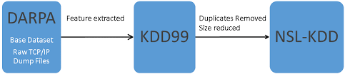
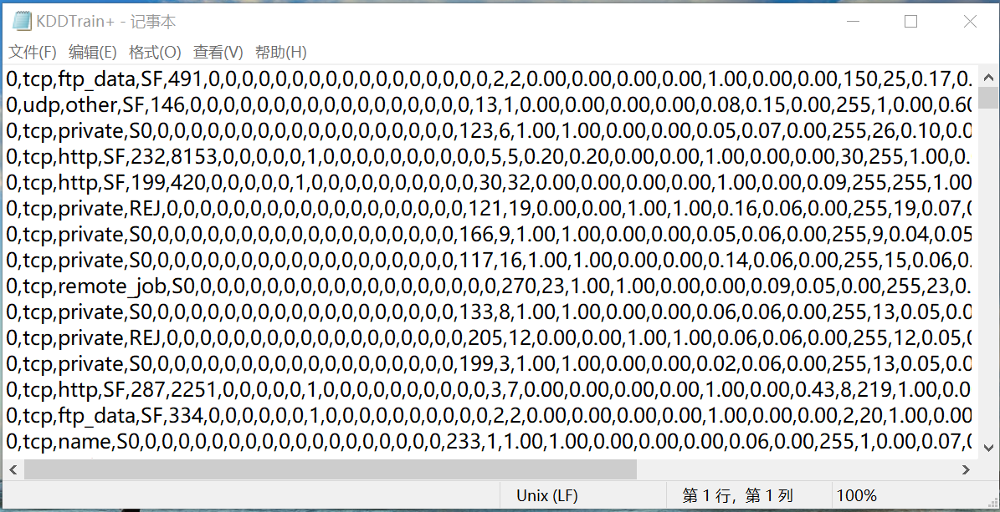
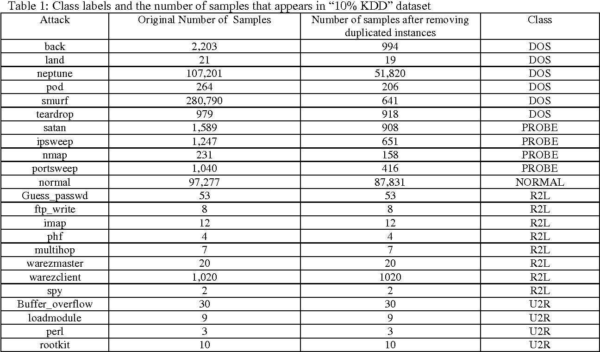
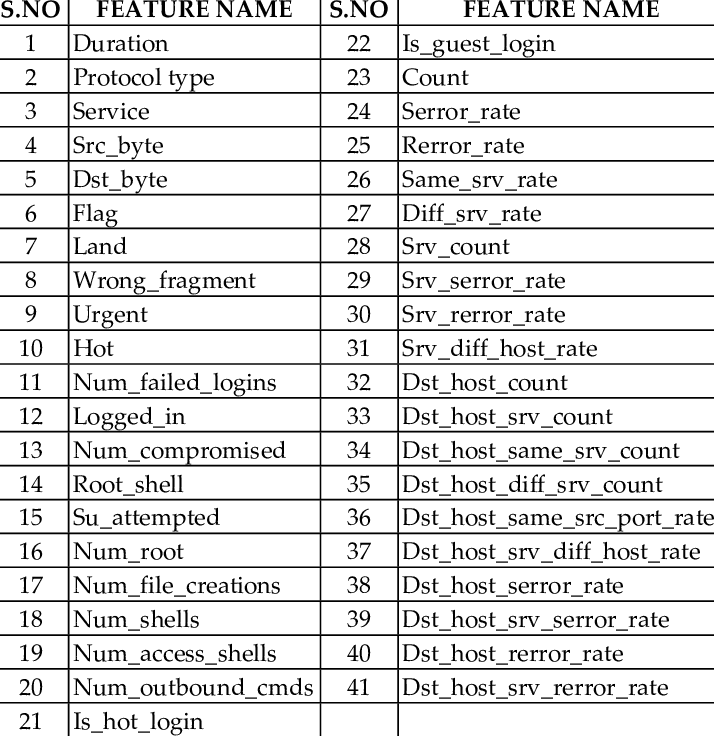

# 安全研究数据集介绍

主要内容：
- KDD 99 数据集

## KDD 99 入侵检测数据集

KDD是知识发现与数据挖掘（Knowledge Discovery and Data Mining）的简称。KDD CUP是ACM组织的年度竞赛。

1998年美DARPA在MIT林肯实验室进行了一个入侵检测项目。这个实验室建立了美国空军局域网的模拟环境，收集了9周的网络连接和系统审计数据，仿真各种用户类型、不同流量、不同攻击手段。DARPA将原始数据收集并脱敏后交给KDD组，KDD在1999年基于这部分数据发布了入侵检测竞赛项目

这个数据集将网络连接标记为正常和异常两大类，异常类型又细分为4类39种攻击形式，其中22种攻击类型出现在训练集中，另17种出现在测试集中。

数据集的格式为CSV文件，内容大致如下：

下图显示了标记分类信息和样本数据量统计信息：

描述每个网络连接（某段时间内的TCP数据包序列及其从源到宿的网络传输）属性共有41个：

41项属性分为4类：
- TCP连接基本特征
  - duration（连续时间）
  - protocol（协议类型）
  - service（服务类型）
  - flag（连接正常或错误的状态）
  - src_bytes(传送字节数)
  - ……
- TCP连接的内容特征
  - hot（访问系统敏感文件和目录的次数）
  - ……
- 基于时间的网络流量统计特征
- 基于主机的网络流量统计特征