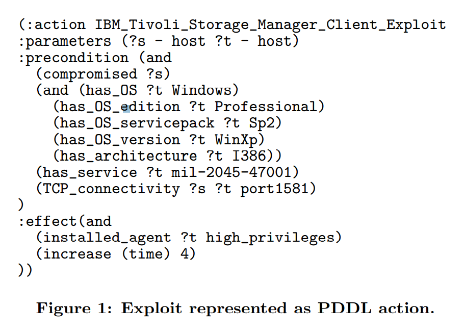

# AI 助力的网络安全

## 有利于网络安全的10项AI技术

> [Ten AI Stepping Stones for Cybersecurity](https://arxiv.org/pdf/1912.06817.pdf), Ricardo Morla, ricardo.morla@fe.up.pt

人工智能的深度学习方法在于更广泛的统计机器学习领域，你可以找到可以从数据中学习的统计模型。

网络安全中应用AI技术的一些例子：

- Malware 
  - 方法：Detect, find similarities; use system calls, etc.
- Phishing web sites 
  - 方法： Detect; use static and sandboxed dynamic content
- Spam 
  - 方法： Detect; use email content and headers
- Host intrusion 
  - 方法： Detect; use system call natural language modeling
- Network intrusion ：
  - 方法： Detect in hierarchy; use traffic and anomalies from sub-layers
- Hardware intrusion 
  - 方法： Detect; from JTAG instructions
- User behavior
  - 方法： Model; use authentication graph
- Exfiltration 
  - 方法：Detect; use DNS URL
- 0-day 
  - 方法：Detect; use attack graph of non-zero day intrusions
- DDoS 
  - 方法：Detect; use specific traffic features for IoT botnet
- Intelligence feed
  - 方法： Rank feeds; use feed IoC-defined dependency and graph
- IoC 
  - 方法：Find Indicator of Compromise similarities; use IoC content
- Incident response [48] Find similar incidents; use IoC for similarity
- TTPs [19] Extract; use unstructured text and map to kill chain

### 使用AI技术进行攻击

在我看来可以分为两类：
- 一类攻击是面向AI系统本身的攻击。
- 另一类是利用AI技术攻击其他系统或寻找漏洞的攻击。

实例：

####  Malware C2 Traffic. 

在AI技术的助力下，从被控制的主机中发出的命令和控制流已经进化，不仅全面变形而且进行加密，使检测更加困难。

在生成性对抗模型的帮助下，变形的C2流使Rigaki论文( Bringing a GAN to a Knife-Fight: Adapting Malware Communication to Avoid Detection)中谈到的检测变得非常困难。

> Rigaki, M., Garcia, S.: Bringing a GAN to a Knife-Fight: Adapting Malware Communication to Avoid Detection. In: 2018 IEEE Security and Privacy Workshops
(SPW). pp. 70–75 (May 2018). https://doi.org/10.1109/SPW.2018.00019

#### 流量隐私

加密技术广泛应用于web、smart home,mobile apps,voice...

使用隐私工具，例如TOR，更难找到server ip地址，以及推断行为。

还有些攻击没有使用tor，而是采用了其他技术，例如流量变形技术

> Monaco, J.V.: What Are You Searching For? A Remote Keylogging Attack on Search Engine Autocomplete. pp. 959–976 (2019), https://www.usenix.org/conference/usenixsecurity19/presentation/monaco

> 流量变形技术 Luo, X., Zhou, P., Chan, E.W., Lee, W., Chang, R.K., Perdisci, R.: HTTPOS: Sealing Information Leaks with Browser-side Obfuscation of Encrypted Flows. In:
NDSS. vol. 11. Citeseer (2011)

#### 恶意域名

域名生成算法 DGA  用于在恶意软件和c2服务器中生成伪随即域名。

研究人员应用非监督学习根据合法域名训练了一个域名生成器，尽管他们的目的使提升现有检测算法的能力，不是制作恶意软件。但他们的结果显示这个技术可以用于DGA。

#### 可执行文件检测

恶意软件的静态和动态分析打开了机器学习方法检测恶意软件可执行代码的大门。
> Kolosnjaji, B., Demontis, A., Biggio, B., Maiorca, D., Giacinto, G., Eckert, C., Roli, F.: Adversarial Malware Binaries: Evading Deep Learning
for Malware Detection in Executables. arXiv:1803.04173 [cs] (Mar 2018),
http://arxiv.org/abs/1803.04173, arXiv: 1803.04173
#### 浏览器DOM

恶意浏览器扩展程序，可用于内嵌于浏览器执行各种攻击。

## 使用 AI 算法发现优化的攻击路径

渗透测试框架工具比较有名的有：
- Core Impact
- Immunity Canvas
- Metasploit Framework
- CS

随着攻击向量、渗透技术、信息搜集技术的增加和汇集，渗透测试工具原来汇聚众多上述资源的优势成为新的问题，如何克服复杂性，使用户更容易的选定更优化的攻击路线，使得非专家级的用户也可借助工具或自动化的实现测试？

### 相关研究

上述问题显然是一个攻击规划问题（attack planning problem）。
- 这个问题由Boddy等引入AI规划社区，作为Cyber Security 域。 M. S. Boddy, J. Gohde, T. Haigh, and S. A. Harp. Course of action generation for cyber security using classical planning. In Proc. of ICAPS’05, 2005.
- Lucangeli等提出了使用PDDL语言基于行动和资产建模的方法，使用流行的规划器来生成攻击计划。J. Lucangeli, C. Sarraute, and G. Richarte. Attack Planning in the Real World. In Workshop on Intelligent Security (SecArt 2010), 2010.
- 基于部分可观测马尔可夫决策过程的模型，在良好形式化的情况下，提供精确的攻击者不确定性表示。

>PDDL Planning Domain Definition Language

### 攻击模型

攻击的概念模型基于资产、目标、代理、行动等概念。一次攻击总会包括代理集合、执行动作序列、获取的资产（信息或实体网络系统），并达到一些目标。

- asset，例如 OS of a host H, TCP connectivity with host H on port P
- agent, installed on a given host H.
- action, 是基本的攻击步骤，有要求和结果，例如某个漏洞触发的条件就是要求，结果是成功或失败（含细节）。

在决策案例中，行为和资产组成了特定的规划问题，可以被成功表达为PDDL语言描述。

- assert 在PDDL中被作为 predicates
- action 在PDDL中被作为 operators

在J. Lucangeli, C. Sarraute, and G. Richarte. Attack Planning in the Real World. In Workshop on Intelligent Security (SecArt 2010), 2010.的论文中，作者演示了PDDL表达的攻击，允许他们整合一个渗透测试工具和一个外部的规划器，生成了实用场景的攻击规划。规划器使用了 Metric-FF 和SGPlan。

下图显示了使用PDDL定义攻击行为的一个表示。

行动的执行有多维度的代价：
- 执行时间，平均运行时间
- 网络流量
- IDS检测
- 主机资源
- 攻击可追踪性
- 0day渗透（攻击者一般尽可能少使用0day）

### 概率化的行动

使攻击模型更具现实意义的方法是考虑行为的非确定性，这就要给每个行为添加一个概率属性。一次渗透成功或失败将以以概率形式表达。

成功的概率是一个条件概率，它取决于环境条件。

概率化行动会导致规划问题更加复杂，通用的概率规划器（入Probalistic-FF）不能胜任。