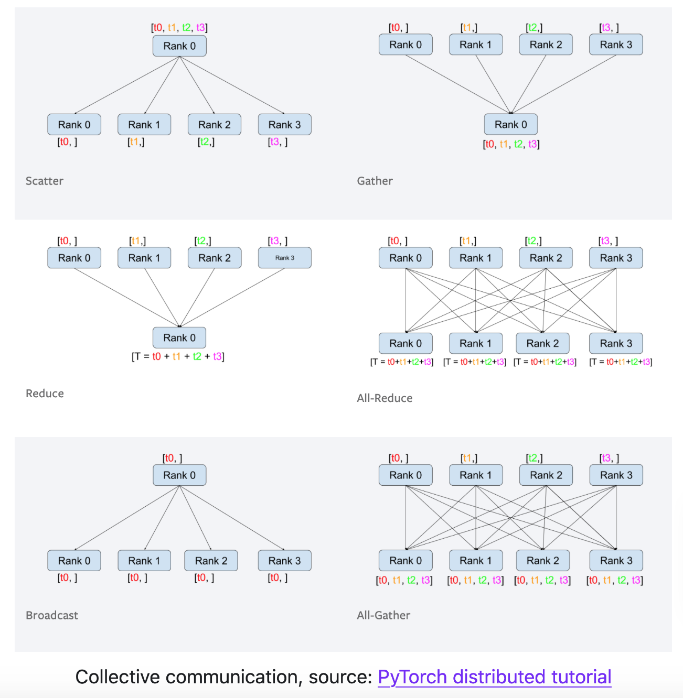
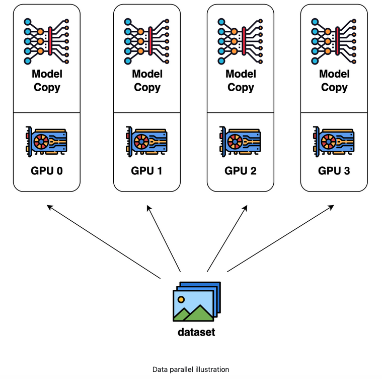
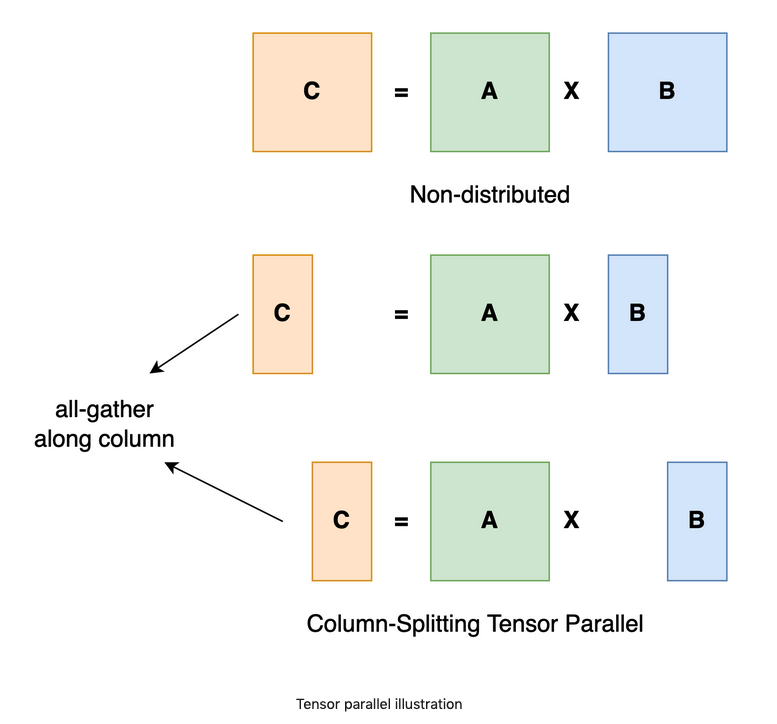
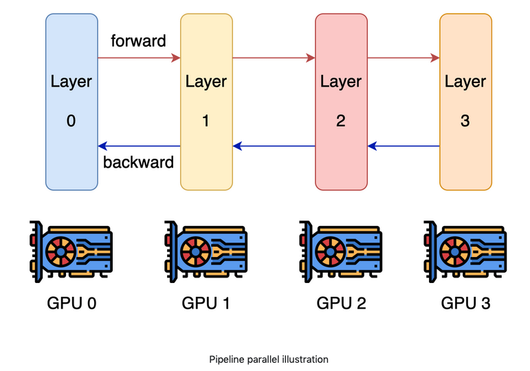

# 概念
https://colossalai.org/docs/concepts/paradigms_of_parallelism
## 分布式训练

分布式系统有多个软件组件构成，这些组件运行在多个机器上。例如，传统数据库运行在单一服务器上。随着数据量的急剧激增，单一车辆不能再给出业务可接受的性能，特别是对于“黑色星期五”这样网络流量会急剧增加。为了处理这类问题，现代高性能数据库被设计为多机器运行的，他们协同工作提供高的吞吐量和低的延迟。

分布式系统的一个重要的评估指标是可扩展性。例如，我们在4台机器上运行一个应用，自然地会希望该应用以4倍速运行。然而，由于通信负载和硬件的差异，线性增速是困难的。这样以来，如何在实现应用增速是很重要的。良好设计的算法和系统优化会帮助提升性能。有时，甚至可能实现线性或超线性的加速。

机器学习为什么需要分布式训练？

回到2012年，AlexNet 赢得了ImageNet竞赛冠军，它是在两块GTX580 3GB GPUs上被训练。今天，更多的模型出现在顶级AI会议上，使用了更多的GPU去计算。当研究人员和工程师在开发AI模型时，分布式训练无疑是一个常用实践。这个趋势的背后有多个原因：
- 模型大小快速增加。 2015年，ResNet50 有20M参数，2018年BERTLarge 有345M参数，2020年GPT-3有175Billion参数。很明显，模型大小以指数级的速度在增长。当前最大模型已经超过了1000B参数。超级大模型通常比较小的模型能给出了更多优秀的性能。
- 数据集大小快速增加。对于很多机器学习开发者，MNIST和CIFAR10数据集通常是他们训练模型的第一份小数据集。然而，这些数据集对于已知道的ImageNet数据集来说太小了。Google 甚至有自己的JFT-300M数据集，它有大约300M图片，相当于300倍的ImageNet-1k数据集。
- 算力更加增强。随着半导体工业的发展，显卡变得更加强力。由于它有大量计算核心，GPU是深度学习的最重要的通用计算平台。从2012年的 K10 GPU 到2020年的 A100 GPU，算例已经增长了几百倍。这允许我们更快的处理计算密集型任务和深度学习也显然是这样的一类任务。

如今，模型可能太大而不能被一个GPU所支持，数据集也太大，单卡可能要训练100天。只有通过使用不同的并行化技术在多个GPU上训练我们的模型，我们才能加快训练过程，并在合理的时间内获得结果。

分布式训练要求多台机器和GPUs。在训练过程中，这些机器中会有通信，为了更好理解分布式训练，有几个重要的词汇需要澄清。

- host/主机：host是通信网络中的主要设备。在初始化分布式环境时，通常需要将host作为参数。
- port/端口：这里的端口主要是指主机上用于通信的主端口。
- rank：网络中给设备的唯一ID。
- world size/世界规模：网络中设备的数量。
- process group/进程组：进程组是一个包括设备子集的通信网络。始终存在一个默认进程组，该组包含所有设备。子集设备可以形成进程组，使得它们仅在组内的设备之间进行通信。

为了说明这些概念，让我们假设我们有2台机器（也称为节点/node），每台机器有4个GPU。当我们在这两台机器上初始化分布式环境时，我们基本上启动了8个进程（每台机器上有4个进程），并且每个进程都绑定到一个GPU。

在初始化分布式环境之前，我们需要指定host/主机（主地址）和port/端口（主端口）。在本例中，我们可以将主机设为节点0，将端口设为29500等数字。然后，所有8个进程都将查找地址和端口并相互连接。然后将创建默认的流程组。默认流程组的world size/世界大小为8，详细信息如下：

假设有两个node：
- node0: 包括gpu0～3
- node1: 包括gpu0～3

所以：
- 处理器ID，可以从0～8；
- 相应地，rank从0～8；
- node index，前4个为0，后四个为1。

请注意，rank是相对于进程组的，一个进程在不同的进程组中可以有不同的rank。最大rank总是进程组的world size/世界大小-1。

在进程组中，进程可能以两种方式通信：
- P2P：一个进程发送数据到另一个进程；
- collective：一个进程组同时执行多种操作，例如scatter、gather、allreduce、broadcast等。

## 并行处理的范式 Paradigms of Parallelism

随着深度学习的发展，人们对并行训练的需求持续增长。这是因为model和datasets变得越来越大，而如果仅使用单一GPU训练训练时间会变得让人难以忍受。下面给出一些现有并行训练方法的概要。

### 数据并行 Data Parallel

数据并行是一种非常常见的并行方式，因为它比较容易。在数据并行训练中，数据集被分隔成多个shards，每个shard被分配给一个设备。这相当于沿着批次维度并行化训练过程。每个设备将保存模型副本的完整副本，并在分配的数据集碎片上进行训练。反向传播后，模型的梯度将全部减小，以便不同设备上的模型参数可以保持同步。

### 模型并行 Model Parallel

在数据并行训练中，一个显著的特征是每个GPU都保存整个模型权重的副本。这带来了冗余问题。并行的第二种范式是模型并行，其中模型被拆分并分布在一组设备上。并行度通常有两种类型：张量（tensor）并行度和流水线（pipeline）并行度。张量并行是指在矩阵矩阵乘法等运算中使计算并行化。流水线并行是将层之间的计算并行化。因此，从另一个角度来看，张量并行可以看作是层内并行，流水线并行可以看作层间并行。

### 张量并行 Tensor Parallel
张量并行训练是将一个张量沿特定维度拆分为N个块，每个设备只持有整个张量的1/N，而不影响计算图的正确性。这需要额外的沟通来确保结果是正确的。

以一般的矩阵乘法为例，假设我们有C=AB。我们可以沿着列维度将B拆分为[B0 B1 B2…Bn]，每个设备都有一列。然后，我们将A与每个设备上B中的每一列相乘，得到[AB0 AB1 AB2…ABn]。此时，每个设备仍然保持部分结果，例如，设备秩0保持AB0。为了确保结果是正确的，我们需要收集部分结果，并沿着列维度连接张量。通过这种方式，我们能够将张量分布在设备上，同时确保计算流程保持正确。

在 Colossal-AI中，提供了一个tensor 并行方法了列表，命名为 1D、2D、2.5D和3D张量并行。

### 流水线并行 Pipeline Parallel
流水线并行通常是容易理解的。如果回忆你的计算机架构课程，

