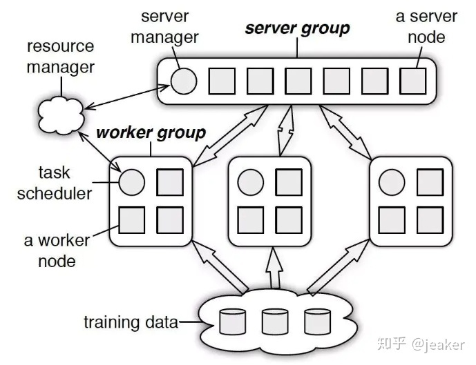

# Tensorflow 11 分布式训练
> 参考：
> https://tensorflow.google.cn/guide/distributed_training?hl=ch
> https://zhuanlan.zhihu.com/p/35083779

tf.distribute.Strategy是TensorFlow API，用于在多个GPU，多台机器或TPU之间分配培训。使用此API，您可以以最小的代码更改来分发现有模型和培训代码。

tf.distribute.Strategy 设计时考虑了以下主要目标：
- 易于使用并支持多个用户细分，包括研究人员，机器学习工程师等。
- 开箱即用地提供良好的性能。
- 轻松切换策略。

tf.distribute.Strategy可以与Keras之类的高级API一起使用，也可以用于分发自定义训练循环（以及通常使用TensorFlow进行的任何计算）。

在TensorFlow 2.x中，您可以Eager执行程序，也可以使用来在图形中执行程序tf.function。tf.distribute.Strategy打算同时支持这两种执行方式，但与`tf.function`配合使用效果最佳。仅建议将Eager模式用于调试目的，而不支持Eager模式TPUStrategy。尽管培训是本指南的重点，但该API也可以用于在不同平台上分发评估和预测。

您只需tf.distribute.Strategy很少改动即可使用代码，因为我们已将TensorFlow的基础组件更改为可感知策略。这包括变量，层，模型，优化器，指标，摘要和检查点。

`tf.distribute.Strategy` API 提供了多个处理单元的分布式训练抽象层。它的目标是允许用户使用现有的模型和训练代码，以最小改变来适应分布式训练。

`tf.distribute.Strategy` 可用于高级API 例如 Keras，也能用于分布的自定义循环。在TF2.0中，你可以使用eagerly执行`tf.distribute.Strategy`或使用`tf.function.tf.distribute.Strategy`的图执行`tf.distribute.Strategy`。

虽然分布式训练是本节重点，但也可以用于分布式评估和预测。

## `tf.distribute.Strategy` 策略类型


现支持的应用场景轴（axes）：
- 同步 vs 异步训练。这是通过数据并行进行分布式训练的两种常用方法。在同步训练中，所有工作进程都同步地对输入数据的不同片段进行训练，并且会在每一步中聚合梯度。在异步训练中，所有工作进程都独立训练输入数据并异步更新变量。通常情况下，同步训练通过 all-reduce 约实现，而异步训练通过参数服务器架构（parameter server architecture）实现。
- 硬件平台：将训练扩展到一台机器上的多个 GPU 或一个网络中的多台机器（每台机器拥有 0 个或多个 GPU），或扩展到 Cloud TPU 上。


tf2.2支持的六种可选策略：
- `tf.distribute.MirroredStrategy` **支持在一台机器的多个 GPU**上进行同步分布式训练。该策略会为每个 GPU 设备创建一个副本。模型中的每个变量都会在所有副本之间进行镜像。这些变量将共同形成一个名为 MirroredVariable 的单个概念变量。这些变量会通过应用相同的更新彼此保持同步。
-  `tf.distribute.experimental.TPUStrategy` 在**张量处理单元 (TPU) 上运行 TensorFlow 训练**。TPU 是 Google 的专用 ASIC，旨在显著加速机器学习工作负载。您可通过 Google Colab、TensorFlow Research Cloud 和 Cloud TPU 平台进行使用。
- `tf.distribute.experimental.MultiWorkerMirroredStrategy` 与 MirroredStrategy 非常相似。它实现了**多机器多GPU的同步分布式训练**，即多个工作进程的同步分布式训练，而每个工作进程可能有多个 GPU。与 MirroredStrategy 类似，它也会跨所有工作进程在每个设备的模型中创建所有变量的副本。
- `tf.distribute.experimental.CentralStorageStrategy` 也执行同步训练。变量不会被镜像，而是放在 CPU 上，且运算会复制到所有本地 GPU 。如果只有一个 GPU，则所有变量和运算都将被放在该 GPU 上。
- `tf.distribute.experimental.ParameterServerStrategy` 支持在**多机器异步训练**，即多台机器上进行参数服务器训练。在此设置中，有些机器会被指定为工作进程，有些会被指定为参数服务器。模型的每个变量都会被放在参数服务器上。计算会被复制到所有工作进程的所有 GPU 中。

除上述策略外，还有其他两种策略可能对使用 tf.distribute API 进行原型设计和调试有所帮助。
- 默认策略: 默认策略是一种分布式策略，当作用域内没有显式分布策略时就会出现。此策略会实现 tf.distribute.Strategy 接口，但只具有传递功能，不提供实际分布。例如，strategy.run(fn) 只会调用 fn。使用该策略编写的代码与未使用任何策略编写的代码完全一样。您可以将其视为“无运算”策略。
- tf.distribute.OneDeviceStrategy 是一种会将所有变量和计算放在单个指定设备上的策略。


下面将使用`tf.distribute.MirroredStrategy`，这是再一台机器上多GPU卡进行同时训练的图形内复制（in-graph replication）。它将会把所有模型的变量复制到每个处理器上，然后通过`all-reduce`整合所有处理器的梯度，并将整合的结果应用于所有副本中。


## 在 tf.keras.Model.fit 中使用 tf.distribute.Strategy
我们已将 tf.distribute.Strategy 集成到 tf.keras（TensorFlow 对 Keras API 规范的实现）。tf.keras 是用于构建和训练模型的高级 API。将该策略集成到 tf.keras 后端以后，您可以使用 model.fit 在 Keras 训练框架中无缝进行分布式训练。

您需要对代码进行以下更改：
- 创建一个合适的 tf.distribute.Strategy 实例。
- 将 Keras 模型、优化器和指标的创建转移到 strategy.scope 中。
  
我们支持所有类型的 Keras 模型：序贯模型、函数式模型和子类化模型。

下面是一段代码，执行该代码会创建一个非常简单的带有一个密集层的 Keras 模型：
```python
mirrored_strategy = tf.distribute.MirroredStrategy()

with mirrored_strategy.scope():
  model = tf.keras.Sequential([tf.keras.layers.Dense(1, input_shape=(1,))])

model.compile(loss='mse', optimizer='sgd')
```
在此示例中我们使用了 MirroredStrategy，因此我们可以在有多个 GPU 的机器上运行。strategy.scope() 会指示 Keras 使用哪个策略来进行分布式训练。我们可以通过在此作用域内创建模型/优化器/指标来创建分布式变量而非常规变量。设置完成后，您就可以像平常一样拟合模型。MirroredStrategy 负责将模型的训练复制到可用的 GPU 上，以及聚合梯度等。
```
dataset = tf.data.Dataset.from_tensors(([1.], [1.])).repeat(100).batch(10)
model.fit(dataset, epochs=2)
model.evaluate(dataset)
```
我们在这里使用了 tf.data.Dataset 来提供训练和评估输入。您还可以使用 Numpy 数组：
```
import numpy as np
inputs, targets = np.ones((100, 1)), np.ones((100, 1))
model.fit(inputs, targets, epochs=2, batch_size=10)
```

在上述两种情况（数据集或 Numpy）中，给定输入的每个批次都被平均分到了多个副本中。例如，如果对 2 个 GPU 使用 MirroredStrategy，大小为 10 的每个批次将被均分到 2 个 GPU 中，每个 GPU 每步会接收 5 个输入样本。如果添加更多 GPU，每个周期的训练速度就会更快。在添加更多加速器时通常需要增加批次大小，以便有效利用额外的计算能力。您还需要根据模型重新调整学习率。您可以使用 strategy.num_replicas_in_sync 获得副本数量。

```
# Compute global batch size using number of replicas.
BATCH_SIZE_PER_REPLICA = 5
global_batch_size = (BATCH_SIZE_PER_REPLICA *
                     mirrored_strategy.num_replicas_in_sync)
dataset = tf.data.Dataset.from_tensors(([1.], [1.])).repeat(100)
dataset = dataset.batch(global_batch_size)

LEARNING_RATES_BY_BATCH_SIZE = {5: 0.1, 10: 0.15}
learning_rate = LEARNING_RATES_BY_BATCH_SIZE[global_batch_size]
```

## 分布式策略下的自定义训练过程（Custom Training Loop）

### 应用MirroredStrategy
分为以下步骤：

- 定义分布式策略：`strategy = tf.distribute.MirroredStrategy(...)`
- 在strategy.scope中定义model，optimizer，metrics...

```
with strategy.scope():
    model = ...
    optimizer = ...
    metrics = ...
```

- 定义分布式数据集：`dataset = strategy.distribute_datasets_from_function(...)`

- 定义训练步

```python

@tf.function
def step_fn(iterator):
    def replica_fn(inputs):
        # 计算 loss，gradient
        # 应用 gradient
        # 更新 metrics
    return strategy.run(replica_fn,args=(next(iterator),))

```
- 定义训练轮数

```python
for epoch in range(train_epochs):
    iterator = iter(dataset)
    for step in range(steps_per_epoch):
        step_fn(next(iterator))
    print('metrics result:',metrics.result())
```

### 应用 ParameterServerStrategy
分为以下步骤：

- 定义分布式策略：`strategy = tf.distribute.ParameterServerStrategy(cluster_resolver)`


- 定义coordinator ： `coordinator = tf.distribute.experimental.coordinator.ClusterCoordinator(strategy)`


- 在strategy.scope中定义model，optimizer，metrics...

```python
with strategy.scope():
    model = ...
    optimizer = ...
    metrics = ...
```

- 定义分布式数据集：`dataset = strategy.distribute_datasets_from_function(...)`

- 定义训练步

```python

@tf.function
def step_fn(iterator):
    def replica_fn(inputs):
        # 计算 loss，gradient
        # 应用 gradient
        # 更新 metrics
    return strategy.run(replica_fn,args=(next(iterator),))

```
- 定义训练轮数

```python
for epoch in range(train_epochs):
    iterator = iter(dataset)
    for step in range(steps_per_epoch):
        coordinator.schedule(step_fn,args=(iterator,)) #分发到worker上，并取回参数
        step_fn(next(iterator))
    coordinator.join()
    print('metrics result:',metrics.result())
```
## 实现多机器分布训练的模式 Parameter Server

> source: https://tensorflow.google.cn/tutorials/distribute/parameter_server_training


Parameter Server 训练是一种通用的数据并行方法，使模型训练可以扩展到多个机器。一个parameter server 训练集群由 workers 和 parameters servers构成。待训练的变量们将在 parameter server 中生成，然后由 workers 在每一训练步中读取和更新。默认情况下，workers读取和更新变量时不进行彼此间的同步。这也是有时 parameter server 类型的训练被称为异步训练的原因。

TF2  parameter server 训练使用了一种基于架构的中心-协调器（central-coordinator），由`tf.distribute.experimental.coordinator.ClusterCoordinator` 类定义。

在这种实现中，worker 和 parameter server 任务运行 `tf.distribute.Server`s监听来自 coordinator 的任务。 Coordinator 生成 resouces，分派训练任务，存储 checkpoints，而且处理任务错误。

TF的开发人员认为这个架构和新的ClusterCoordinator将提供更灵活简单的编程模型。
### ClusterCoordinator

ClusterCoordinator 需要与 `tf.distribute.Strategy` 对象协同工作。`tf.distribute.Strategy`用于传递cluster的信息、定义训练步，正如我们在使用 MirroredStrategy的自定义训练。然后 ClusterCoordinator 对象分派这些训练步的执行任务到远程的workers。目前，tf2中的 ClusterCoordinator 仅能与`tf.distribute.experimental.ParameterServerStrategy`协同。

由 ClusterCoordinator 对象提供的最重要的API是 schedule 。这个 schedule api将 `tf.function`加入队列，然后返回一个 RemoteValue 。这个队列函数将在后台线程被分派到远程 workers ，而且它们的 RemoteValues 将被异步的填写。因为 schedule 不要求 worker 同意（assigment）， 被传递的 tf.function 可以在任何可用的worker上执行。如果worker在完成计算前变得不可用，这个function将重新在别的可用的worker上执行。这一点，再加上function执行不是原子的，导致一个function可能会执行多次。

除了分派远程functions，ClusterCoordinator 也帮着在所有workers上生成数据，以及当某个worker从失效中恢复后重建数据。


### 学习向导安装

`pip install -q portpicker`

```
import multiprocessing
import os
import random
import portpicker
import tensorflow as tf
import tensorflow.keras as keras
import tensorflow.keras.layers.experimental.preprocessing as kpl
```
### cluster setup
如上所诉，一个 parameter server 训练 cluster 要求一个 coordinator 任务，以运行你的训练过程，一个或多个workers，以及运行tf servers 的 parameter server 任务，例如：tf.distribute.Server, 还有可能的额外评估任务来运行side-car 评估。这要求安装：

- coordinator task 需要指导所有别的tf servers的ip addr 和 ports，除了评估器。
- workers 和 parameter servers 需要知道它们应当监听哪个端口。为简单起见，当我们完成这些任务而生成tf server时，我们通常传递完整的cluster 信息。
- 评估任务不必知道训练cluster的安装信息，即便知道，也不能尝试去连接训练cluster。
- workers 和 parameter servers 应当有诸如 “worker” 和 “ps” 的任务类型，coordinator 应当使用 chief 作为任务类型（历史原因）。

在本文中，我们将生成一个 in-process cluster ，以便整个的 parameter server 训练能够运行在colab中，后面再介绍 real clusters。

#### in-process cluster
下面我们启动一些tf servers ，并连接它们。


在coordinator的编程运行中，你将使用一个 ParameterServerStrategy 对象来定义一个学习步，并使用一个 `ClusterCoordinator` 来分派训练步到远程 workers。

下面使最简单的生成它们的方式：
```
strategy = tf.distribute.experimental.ParameterServerStrategy(
        tf.distribute.cluster_resolver.TFConfigClusterResolver(),
        variable_paritioner=variable_partitioner)
coordinator = tf.distribute.experimental.coordinator.ClusterCoordinator(strategy)
```

注意，如果使用`TFConfigClusterResolver`，你需要配置`TF_CONFIG`环境变量。这近似于`TF_CONFIG`在`MultiWorkerMirroredStrategy` 但有additional caveats。

在TF v1.x中，ParameterServerStrategy 仅在使用 estimator 的 `tf.compat.v1.distribute.experimental.ParameterServerStrategy` 时可用。


tf的开发者相信这个架构和新的 `ClusterCoordinator`类提供了一种更灵活和简单的编程模型。

### ClusterCoordinator

ClusterCoordinator 类需要与 `tf.distribute.Strategy` 对象链接工作。`tf.distribute.Strategy` 对象被用于传递cluster信息，且被用于定义一个训练步，这如 `MirroredStrategy` 中的情况相同。ClusterCoordinator 对象分派这些训练步骤执行到远程workers。当前 ClusterCoordinator 仅与 `tf.distribute.experimental.ParameterServerStrategy` 一起工作。

由ClusterCoordinator对象提供的最重要的API是`schedule`。这个 schedule API 使 tf.function 入队，并立即返回一个 `RemoteValue`。这个队列化的函数将被分派到远程workers 的背景线程，而它的`RemoteValue`s 将被异步地填充。由于 Schedule 不要求 worker 指派，所以 tf.function 传递进来可被执行在任意可获得worker。如果worker 在它完成前变得不可用，那么这个函数将重新尝试让别的worker计算。因为函数执行的事实不是原子的，一个函数可以执行多次。

除了分派远程函数，ClusterCoordinator也用于生成所有workers上的数据集，并当某个worker返回失败时重建这些数据集。

### Tutorial Setup
`pip install -q portpicker`

```python
import multiprocessing
import os
import random
import portpicker
import tensorflow as tf
import tensorflow.keras as keras
import tensorflow.keras.layers.experimental.preprocessing as kpl
```
### Cluster Setup
如上所述，parameter server 训练 cluster，要求一个运行你的训练程序的 coordinator 任务，一个或多个workers 和 运行tf servers 的 parameter servers  任务，例如：tf.distribute.Server。可能还需要一个评估任务（可以参考下面的 side-car 评估部分）。

- coordinator 任务需要直到所有别的tf servers的地址和端口，但不需要知道评估器的。
- workers 和 parameter servers 需要知道它们需要监听哪个端口。简单起见，我们在生成tf servers执行任务时，通常传递完整的cluster 信息。
- 评估任务不需要知道训练cluster的安装信息，他不应该尝试连接训练服务器。
- workers 和 parameter servers 应该有诸如 “worker” 和 “ps”的任务类型。coordinator 应当使用 “chief” 作为任务类型（历史原因）。

下面我们生成一个 in-process cluster，使得整个 parameter server训练可以在colab中运行起来。

#### in-process cluster
```python
import multiprocessing
import os
import random
import portpicker
import tensorflow as tf
import tensorflow.keras as keras
import tensorflow.keras.layers.experimental.preprocessing as kpl


def create_in_process_cluster(num_workers, num_ps):
    """Creates and starts local servers and returns the cluster_resolver."""
    worker_ports = [portpicker.pick_unused_port() for _ in range(num_workers)]
    ps_ports = [portpicker.pick_unused_port() for _ in range(num_ps)]

    cluster_dict = {}
    cluster_dict["worker"] = ["localhost:%s" % port for port in worker_ports]
    if num_ps > 0:
        cluster_dict["ps"] = ["localhost:%s" % port for port in ps_ports]

    cluster_spec = tf.train.ClusterSpec(cluster_dict)

    # Workers need some inter_ops threads to work properly.
    worker_config = tf.compat.v1.ConfigProto()
    if multiprocessing.cpu_count() < num_workers + 1:
        worker_config.inter_op_parallelism_threads = num_workers + 1

    for i in range(num_workers):
        tf.distribute.Server(cluster_spec, job_name="worker", task_index=i, config=worker_config,protocol="grpc")

    for i in range(num_ps):
        tf.distribute.Server(cluster_spec, job_name="ps", task_index=i, protocol="grpc")

    cluster_resolver = tf.distribute.cluster_resolver.SimpleClusterResolver(cluster_spec, rpc_layer="grpc")
    return cluster_resolver

# Set the environment variable to allow reporting worker and ps failure to the
# coordinator. This is a workaround and won't be necessary in the future.
os.environ["GRPC_FAIL_FAST"] = "use_caller"

NUM_WORKERS = 3
NUM_PS = 2
cluster_resolver = create_in_process_cluster(NUM_WORKERS, NUM_PS)

```


#### 使用自定义的迭代完成训练

使用`tf.distribute.Strategy`的自定义训练loop提供了更为灵活的定义训练迭代的方法。在当前tf2中的 parameter server 训练，仅支持自定义训练循环。

这里我们使用了 `ParameterServerStrategy`来定义一个训练步，然后使用ClusterCoordinator 分派训练步的执行到远程workers。

##### 生成 ParameterServerStrategy

要写一个自定义训练loop中的训练步，第一步是生成ParameterServerStrategy。一会儿再介绍variable_partitioner。

```python
#tf 2.4.1
variable_partitioner = (
    tf.distribute.experimental.partitioners.FixedShardsPartitioner(
        num_shards=NUM_PS))

strategy = tf.distribute.experimental.ParameterServerStrategy(
    cluster_resolver,
    variable_partitioner=variable_partitioner)

```
然后，你可以生成一个model，定义一个数据集和一个step函数，就像再其它分布式策略 [tutorial](https://tensorflow.google.cn/tutorials/distribute/custom_training) 中见到的一样。下面就来生成这些组件。

##### 设置data
首先我们写一个函数生成dataset，它包含使用keras预处理层的预处理逻辑。我们在 `dataset_fn` 外面生成这些 layers ，但在 `dataset_fn` 里面应用transformation，因为你要把dataset_fn包装进tf.function中，而tf.function中不允许变量在其中生成。

```python
#simple dataset
feature_vocab = ["avenger", "ironman", "batman", "hulk", "spiderman", "kingkong","wonder_woman"]
#simple label
label_vocab = ["yes", "no"]

with strategy.scope():
    feature_lookup_layer = kpl.StringLookup(vocabulary=feature_vocab)

    label_lookup_layer = kpl.StringLookup(vocabulary=label_vocab, num_oov_indices=0,mask_token=None)

    raw_feature_input = keras.layers.Input(shape=(3,), dtype=tf.string, name="feature")
    feature_id_input = feature_lookup_layer(raw_feature_input)
    feature_preprocess_stage = keras.Model({"features": raw_feature_input}, feature_id_input)

    raw_label_input = keras.layers.Input(shape=(1,), dtype=tf.string, name="label")
    label_id_input = label_lookup_layer(raw_label_input)
    label_preprocess_stage = keras.Model({"label": raw_label_input}, label_id_input)
```

然后，我们生成包装在dataset_fn中的训练数据集：

```python

def dataset_fn(_):
    raw_dataset = tf.data.Dataset.from_tensor_slices(examples)
    train_dataset = raw_dataset.map(
        lambda x: (
            {"features": feature_preprocess_stage(x["features"])},
            label_preprocess_stage(x["label"])
        )).shuffle(200).batch(32).repeat()
    return train_dataset
```

##### 构建model
第二步，生成模型和其它对象。确保在`strategy.scope`下生成所有变量。

```python
# These variables created under the `strategy.scope` will be placed on parameter
# servers in a round-robin fashion.
with strategy.scope():
    # Create the model. The input needs to be compatible with KPLs.
    model_input = keras.layers.Input( shape=(3,), dtype=tf.int64, name="model_input")

    emb_layer = keras.layers.Embedding(input_dim=len(feature_lookup_layer.get_vocabulary()), output_dim=20)
    emb_output = tf.reduce_mean(emb_layer(model_input), axis=1)
    dense_output = keras.layers.Dense(units=1, activation="sigmoid")(emb_output)
    model = keras.Model({"features": model_input}, dense_output)

    optimizer = keras.optimizers.RMSprop(learning_rate=0.1)
    accuracy = keras.metrics.Accuracy()
```
##### 定义训练步

第三步，生成训练步，并使用tf.function包装器。

```python
@tf.function
def step_fn(iterator):

    def replica_fn(batch_data, labels):
        with tf.GradientTape() as tape:
            pred = model(batch_data, training=True)
            per_example_loss = keras.losses.BinaryCrossentropy(
                  reduction=tf.keras.losses.Reduction.NONE)(labels, pred)
            loss = tf.nn.compute_average_loss(per_example_loss)
            gradients = tape.gradient(loss, model.trainable_variables)

        optimizer.apply_gradients(zip(gradients, model.trainable_variables))

        actual_pred = tf.cast(tf.greater(pred, 0.5), tf.int64)
        accuracy.update_state(labels, actual_pred)
        return loss

    batch_data, labels = next(iterator)
    losses = strategy.run(replica_fn, args=(batch_data, labels))
    return strategy.reduce(tf.distribute.ReduceOp.SUM, losses, axis=None)
```

在上面步骤的function中，在step_fn 中调用 strategy.run 和 strategy.reduce有利于支持GPUs或未来的复制worker，尽管它们现在还没有实现。

##### 分派训练步到远程workers

在ParameterServerStrategy定义了所有计算后，我们将使用 ClusterCoordinator 类生成 resources 并将训练步骤分发到远程workers。

先生成一个 ClusterCoordinator 对象并传递给 strategy 对象。

`coordinator = tf.distribute.experimental.coordinator.ClusterCoordinator(strategy)`

然后我们为每个worker生成一个dataset和iterator。在下面的 per_worker_dataset_fn 中，将 dataset_fn包装到 distribute_datasets_from_function 是可选的，但它将来会有效支持无缝预提取到GPUs，支持ParameterServerStrategy。

```py

@tf.function
def per_worker_dataset_fn():
    return strategy.distribute_datasets_from_function(dataset_fn)

per_worker_dataset = coordinator.create_per_worker_dataset(per_worker_dataset_fn)
per_worker_iterator = iter(per_worker_dataset)
```

最后的步骤是使用 schedule 分发计算到远程 workders 。schedule方法将一个 tf.function 入队并返回一个 future-like RemoteValue。队列里的函数们将在后台线程里分给远程workers，并且RemoteValue将异步被填写。join方法可用于等待，直到所有scheduled 函数被执行。

```python
num_epoches = 4
steps_per_epoch = 5
for i in range(num_epoches):
    accuracy.reset_states()
    for _ in range(steps_per_epoch):
        coordinator.schedule(step_fn, args=(per_worker_iterator,))
    # Wait at epoch boundaries.
    coordinator.join()
    print ("Finished epoch %d, accuracy is %f." % (i, accuracy.result().numpy()))
```

若想获取RemoteValue的结果，可以：
```python
loss = coordinator.schedule(step_fn, args=(per_worker_iterator,))
print ("Final loss is %f" % loss.fetch())

```
或者，你可以启动所有步骤并在等待完成时做些什么：
```python

for _ in range(total_steps):
    coordinator.schedule(step_fn, args=(per_worker_iterator,))
while not coordinator.done():
    time.sleep(10)
    # Do something like logging metrics or writing checkpoints.
```
为了完成训练并服务工作流（特别的例子）可以查看 [这个test](https://github.com/tensorflow/tensorflow/blob/master/tensorflow/python/keras/distribute/parameter_server_training_test.py)


##### 有关 dataset 生成的更多内容

上面代码生成的数据集使用了 create_per_worker_dataset API。它为每个worker生成了一个dataset，并返回了一个容器对象。你可对其调用 iter 方法来生成一个 per-worker 迭代器。这个 per-worker 迭代器包含了每个worker的一个iterator，而且在对特定worker执行函数之前，将在传递给schedule方法的函数的输入参数中替换相应的每个worker的切片。 

当前schedule函数假设每个worker都是一样的，所以分派数据时也是平均分配。除了包含一个dataset.shuffle操作的worker，数据可能被shuffled。因此，我们推荐数据集被复制定义并schedule一个确定的steps数，而不是依赖来自某个数据集的OutOfRangeError。

另一个重要的事情是tf.data 数据集不支持在任务边界穿越时隐式的序列化和反序列化。这在函数中传递给 create_per_worker_dataset 生成整个数据集时很重要。

##### variable sharding（分片）
Variable Sharding 指的是切分一个变量为多个小的变量。我们称这些小的变量为 Variable shards。这个操作有助于在访问这些shards时，分布化网络负载；也有助于在多ps间处理一个正常variable的分布计算和存储。

要实现变量分片，你可以在构建ParameterServerStrategy 对象时，传递一个 variable_partitioner 。当一个变量被生成并且它被期望返回一定数量的、根据某个变量维度的变量shards时，这个variable_partitioner 将每次被调用。一些开箱即用的 variable_partitioner 例如：tf.distribute.experimental.partitioners.FixedShardsPartitioner

上面的例子，我们把所有变量都划分为2个shards，每个shard将被分配到不同的ps上。

```
assert len(emb_layer.weights) == 2
assert emb_layer.weights[0].shape == (5, 20)
assert emb_layer.weights[1].shape == (4, 20)
assert emb_layer.weights[0].device == "/job:ps/replica:0/task:0/device:CPU:0"
assert emb_layer.weights[1].device == "/job:ps/replica:0/task:1/device:CPU:0"
```

当一个 variable_partitioner 传递进来，如果你直接在 strategy.scope()中生成一个变量，他将成为一个有variables属性的容器类型，这个属性可供访问shards列表。大多数情况下，这个容器通过连接所有shards，自动的转换为一个Tensor。最终，它可以用于普通variable。另一方面，一些tf方法，例如tf.nn.embedding_lookup 为这个容器类型提供了有效的实现，而且这些方法自动地连接聚合shards。

### Evaluation
在分布式训练中，有多种方法定义和运行评估过程。下面描述每种的细节。如果没有首选项，建议使用inline 的evaluation方法。

#### inline evaluation

在这种方法中，coordinator 在训练和评估之间交替进行，因此我们称之为inline评估。inline 评估有几个好处。例如，它可以支持单个任务无法容纳的大型评估模型和评估数据集。再比如，评估结果可以用来为下一个epoch的训练做决策。

有两种方法实现 inline 评估：
- 直接评估：对于小型模型和评估数据集，coordinator可以使用其上的评估数据，在分布式模型上执行直接地评估。

```python

eval_dataset = tf.data.Dataset.from_tensor_slices(
      feature_and_label_gen(num_examples=16)).map(
          lambda x: (
              {"features": feature_preprocess_stage(x["features"])},
              label_preprocess_stage(x["label"])
          )).batch(8)

eval_accuracy = keras.metrics.Accuracy()
for batch_data, labels in eval_dataset:
  pred = model(batch_data, training=False)
  actual_pred = tf.cast(tf.greater(pred, 0.5), tf.int64)
  eval_accuracy.update_state(labels, actual_pred)

print ("Evaluation accuracy: %f" % eval_accuracy.result())
```

- 分布式评估：对于大模型或大数据集，不适合直接运行在coordinator上的，coordinator任务可以使用worker执行分布式评估任务，即使用schedule/join

```python
with strategy.scope():
    #在ps上定义评估metric 
    eval_accuracy = keras.metrics.Accuracy()
@tf.function
def eval_step(iterator):
  def replica_fn(batch_data, labels):
    pred = model(batch_data, training=False)
    actual_pred = tf.cast(tf.greater(pred, 0.5), tf.int64)
    eval_accuracy.update_state(labels, actual_pred)
  batch_data, labels = next(iterator)
  strategy.run(replica_fn, args=(batch_data, labels))

def eval_dataset_fn():
  return tf.data.Dataset.from_tensor_slices(
      feature_and_label_gen(num_examples=16)).map(
          lambda x: (
              {"features": feature_preprocess_stage(x["features"])},
              label_preprocess_stage(x["label"])
          )).shuffle(16).repeat().batch(8)

per_worker_eval_dataset = coordinator.create_per_worker_dataset(eval_dataset_fn)
per_worker_eval_iterator = iter(per_worker_eval_dataset)

eval_steps_per_epoch = 2
for _ in range(eval_steps_per_epoch):
  coordinator.schedule(eval_step, args=(per_worker_eval_iterator,))
coordinator.join()
print ("Evaluation accuracy: %f" % eval_accuracy.result())
```

#### Side-car evaluation
另一种方法称为“边车评估”，它是创建一个专用的评估程序任务，该任务重复读取检查点并在最新的检查点上运行评估。如果您不需要根据评估结果更改培训循环，它可使您的培训计划尽早完成。但是，它需要附加的评估程序任务和定期检查点以触发评估。

tf2的设计人员并不推荐使用side-car evaluation。

### 现实世界的 clusters

现实中，你将运行所有的任务在不同机器不同的处理器上。最简单的方式式配置集群信息在每个任务上，来设置 TF_CONFIG 环境变量，并使用 TFConfigClusterResolver  来解析 TF_CONFIG。 具体请参考[分布式训练指引](https://tensorflow.google.cn/guide/distributed_training#setting_up_tf_config_environment_variable)

如果你使用Kubernetes或别的配置模板来启动训练，那么非常可能这些模板已经设置了 TF_CONFIG。

#### 设置 TF_CONFIG 环境变量

假设你有3个workers 和 2个ps，worker 1 的 TF_CONFIG 可能是：

```
os.environ["TF_CONFIG"] = json.dumps({
    "cluster": {
        "worker": ["host1:port", "host2:port", "host3:port"],
        "ps": ["host4:port", "host5:port"],
        "chief": ["host6:port"]
    },
   "task": {"type": "worker", "index": 1}
})
```

The “TF_CONFIG” of the evaluator can be:

```
os.environ["TF_CONFIG"] = json.dumps({
    "cluster": {
        "evaluator": ["host7:port"]
    },
   "task": {"type": "evaluator", "index": 0}
})
```
The “cluster” part in the above “TF_CONFIG” string for the evaluator is optional.

#### 如果你对所有任务使用同样的binary
If you prefer to run all these tasks using a single binary, you will need to let your program branch into different roles at the very beginning:

```
cluster_resolver = tf.distribute.cluster_resolver.TFConfigClusterResolver()
if cluster_resolver.task_type in ("worker", "ps"):
  # start a TensorFlow server and wait.
elif cluster_resolver.task_type == "evaluator":
  # run side-car evaluation
else:
  # run the coordinator.
The following code starts a TensorFlow server and waits:


# Set the environment variable to allow reporting worker and ps failure to the
# coordinator. This is a workaround and won't be necessary in the future.
os.environ["GRPC_FAIL_FAST"] = "use_caller"

cluster_resolver = tf.distribute.cluster_resolver.TF_ConfigClusterResolver()
server = tf.distribute.Server(
    cluster_resolver.cluster_spec(),
    job_name=cluster_resolver.task_type,
    task_index=cluster_resolver.task_id,
    protocol=cluster_resolver.rpc_layer or "grpc",
    start=True)
server.join()
```
#### 处理任务失败

TODO： 
https://tensorflow.google.cn/tutorials/distribute/parameter_server_training#clusters_in_real-world

## tensorflow2.0分布式训练实战：基于parameterServer架构

>https://zhuanlan.zhihu.com/p/166117109
>https://tensorflow.google.cn/api_docs/python/tf/distribute/experimental/ParameterServerStrategy

### parameterServer

Parameter server 异步更新策略是指每个 GPU 或者 CPU 计算完梯度后，无需等待其他 GPU 或 CPU 的梯度计算（有时可以设置需要等待的梯度个数），就可立即更新整体的权值，然后同步此权值，即可进行下一轮计算。Tensorflow2.0之后支持的parameterServer架构只能使用高级API estimator来搭建，而且注明了是部分支持，但目前并未遇到什么问题。

> 联系： keras和estimator都属于对模型的封装，都会封装模型的训练流程的代码。都有分布式的支持，还有dataset的支持;
> 区别：estimator在1.0中就有，主要的封装抽象在模型训练流程，需要自行定义模型结构。keras则对层次的模型训练流程都进行的抽象。当然，也可以使用keras对层次的封装来定义模型结构送到estimator中去使用。
> 实战中：如果是tf1.0, 建议使用estimator，2.0以上建议使用keras API

TensorFlow 一般将任务分为两类 job：
- 一类叫参数服务器，parameter server，简称为 ps，用于汇总梯度并更新参数列表；
- 一类就是普通任务，称为 worker，用于执行具体的计算。
- 这就要求作为PS的节点需要具有较强的通信能力，而作为worker的节点具有强大的计算能力。

在tensorflow2.0中，还需要定义一个chief节点，其功能主要是组内节点的调度并保存模型参数等。其架构如下图所示：



#### tensorflow2.0分布式代码实践

1 导入需要的库

```python
import tensorflow as tf
import tensorflow.keras as keras
import os
os.environ['CUDA_VISIBLE_DEVICES'] = '0,1' # 指定该代码文件的可见GPU为第一个和第二个
import numpy as np
print(tf.__version__)#查看tf版本
gpus=tf.config.list_physical_devices('GPU')
print(gpus)#查看有多少个可用的GPU
```

2 使用keras.dataset API导入fashion_mnist数据集

```python
fashion_mnist = tf.keras.datasets.fashion_mnist

(train_images, train_labels), (test_images, test_labels) = fashion_mnist.load_data()

# 向数组添加维度 -> 新的维度 == (28, 28, 1)
# 我们这样做是因为我们模型中的第一层是卷积层
# 而且它需要一个四维的输入 (批大小, 高, 宽, 通道).
# 批大小维度稍后将添加。
train_images = train_images[..., None]
test_images = test_images[..., None]

# 获取[0,1]范围内的图像。
train_images = train_images / np.float32(255)
test_images = test_images / np.float32(255)

```

3 estimator要求的数据切割


```python
dataset = tf.data.Dataset.from_tensor_slices((train_images,train_labels))
#查看切割后的数据：

iterator = dataset.make_one_shot_iterator()
one_element = iterator.get_next()
with tf.Session() as sess:
    for i in range(5):
        print(sess.run(one_element))
```

4 定义数据输入函数input_fn

```python
def input_fn(X,y,shuffle, batch_size):
    dataset = tf.data.Dataset.from_tensor_slices((X,y))
    if shuffle: 
        dataset = dataset.shuffle(buffer_size=100000)
    dataset = dataset.repeat()
    dataset = dataset.batch(batch_size)
    return dataset
```

Dataset的常用Transformation操作：

```
dataset = tf.data.Dataset.from_tensor_slices(np.array([1.0, 2.0, 3.0, 4.0, 5.0]))
dataset = dataset.map(lambda x: x * x) # 1.0, 4.0, 9.0, 16.0, 25.0
```