# tensorflow 5 网络优化

本讲目标：
- 学习神经网络优化过程，使用正则化减少过拟合，使用优化器更新网络参数


## 神经网络的复杂度
### 空间复杂度
- 层数 = 隐藏层的层数 + 1个输出层
  - 即只统计有运算能力的层，所以不算输入层。
- 总参数 = 总的w 和 总的b（若$y = w \times x + b$）


### 时间复杂度
- 乘加运算次数
  - 有几天权重线，就有几次乘加运算

例如：输入层3节点、隐藏层4阶段，输出层2节点的全连接网络，那么第一层有3*4=12，第二层有4*2=8，共20次。

## 学习率

学习率过大，网络输出不易收敛；学习率过小，收敛速度很慢。那么该如何设置学习率这个超参？

- 可以先用较大的学习率，快速得到较优解；
- 然后逐步缩小学习率，使模型在训练后期稳定。

指数衰减学习率是符合上述需求的，可动态变化的学习率。

$指数衰减学习率 = 初始学习率 * 学习率衰减率^{(当前轮数/多少轮衰减一次)}$

例如：
```python
epoch = 40
LR_BASE = 0.2
LR_DECAY = 0.99
LR_STEP = 1

for epoch in range(epoch):
    lr = LR_BASE * LR_DECAY ** (epoch / LR_STEP)
    with tf.GradientTape() as tape:
        loss = tf.square(w+1)
    grads = tape.gradient(loss ,w)
    w.assign_sub(lr*grads)
    print("After %s epoch, w is %f , loss is %f, lr is %f" % (epoch,w.numpy(),loss,lr))
```

## 激活函数

### Sigmoid 函数

sigmoid 激活函数：$f(x) = \frac{1}{1+e^{-x}}$

Sigmoid函数是神经网络早期常用的激活函数，但目前用的较少了，因为它有以下特点：
- 易造成梯度消失
  - sigmoid的导数值在（0，0.25），多层连续求导会出现多个这样的值连续相乘，结果会趋于0，使梯度消失。
- 输出非0均值，收敛慢
  - 我们希望输出数据是以0为均值，但过sigmoid的函数值都是整数，使收敛变慢。
- 幂运算复杂，训练时间长。

### Tanh函数 tf.math.tanh(x)

$f(x)=\frac{1-e^{-2x}}{1+e^{-2x}}$

特点：
- 输出是0 均值
- 易造成梯度消失
- 幂运算复杂

### Relu函数 tf.nn.relu(x)

$f(x) = max(x,0) , if x<0,then f(x) = 0; else f(x)=x$

优点：
- 解决了梯度消失问题（求导后值在正区间）
- 只需判断输入是否大于0，计算速度快；
- 收敛速度远快于 sigmoid和tanh

缺点：
- 输出非0均值，收敛满
- Dead Relu问题：某些神经元可能永远不会被激活，导致相应的参数永远不能被更新。
  - 通过将输入尽量改为非负数来避免这一问题。

### Leaky Relu 函数 tf.nn.leaky_relu(x)
为了避免Dead Relu 而构建的激活函数。

$f(x) = max(\alpha x,x)$ 使负区间不再恒为0.

理论上将，Leaky Relu有Relu的所有优点，此外不会有Dead Relu问题；但在实践中，并没有被证明完全优于Relu。

### 小结

对于初学者的建议：
- 首选 relu 激活函数；
- 学习率设置较小值；
- 输入特征标准化，即让输入特征满足以 0 为均值，1为标准差的正态分布；
- 初始参数中心化，即让随机生成的参数满足以0为均值，$\sqrt{\frac{2}{当前层输入特征个数}}$

## 损失函数

损失函数loss，是预测值y与已知答案$\hat y$的差。

神经网络（NN）的目标：找出loss最小。常见的loss有：
- MSE函数
- 自定义函数
- ce（cross entropy）函数

### 均方误差MSE tf.reduce_mean(tf.square(y,$\hat y$))

$MSE(Y,Y_) = \frac{\sum_{i=1}^n (y-\hat y)^2}{n}$

均方误差作为损失函数，意味着预测值超过真正与小于真值相同距离，产生的损失是一样的，但很多实际情况中，并不是这样。

例如，预测商品销量，预测多了会有过多销售成本；预测少了会损失利润。若利润不等于成本，则使用MSE作为loss函数无法实现利益最大化。
### 自定义损失函数

$loss(y,\hat y) = \sum_n f(y-\hat y)$


$$
f(y,\hat y) =\begin{cases}
PROFIT * (\hat y -y) , y<\hat y \\
COST * (y-\hat y), y>=\hat y
\end{cases}
$$

`loss_zdy = tf.reduce_sum(tf.where(tf.greater(y,y_),COST*(y-y_),PROFIT*(y-y_)))`

### 交叉熵损失函数CE tf.losses.categorical_crossentropy(y,y_)

CE值越小，预测值越准。

Cross Entropy 表征了两个概率分布之间的距离: $H(y,\hat y) = -\sum \hat y * ln y$

例如：二分类问题，已知答案$\hat y = (1,0)$，预测$y_1 = (0.6,0.4) y_2 = (0.8,0.2)$ 哪个更接近标准答案？

$H_1((1,0),(0.6,0.4)) = -(1*ln0.6 + 0*ln0.4) \approx 0.511$
$H_2((1,0),(0.8,0.2)) = -(1*ln0.8 + 0*ln0.2) \approx 0.223$

因为 $H_1 > H_2$ ，所以$y_2$更准确。

#### softmax 与交叉熵结合 tf.nn.softmax_cross_entropy_with_logits(y_,y)

- 我们先使用softmax函数，使预测值y符合概率分布；

- 然后再计算真实值y_与预测值y的交叉熵损失函数。


## 欠拟合与过拟合

### 欠拟合

解决方法：
- 增加输入特征项
- 增加网络参数
- 减少正则化参数

### 过拟合
解决方法：
- 数据清洗
- 增大训练集
- 采用正则化
- 增大正则化参数

### 正则化

正则化是在损失函数中引入模型复杂度指标，利用给w加权值，弱化了训练数据的噪声（一般不正则化b）

$loss = loss(y,\hat y) + REGULARIZER * loss(w)$

- $loss(y,\hat y)$ 是模型中受所有参数影响的损失函数，例如之前的MSE和交叉熵；
- 用超参数 $REGULARIZER$ 给出参数 w 在总loss中的比例，即正则化的权重
- $loss(w)$ ：需要正则化的参数

Loss(w)可以有两种方式：
- L1正则化：$loss_{L1}(w) = \sum_i|w_i|$
  - L1正则化，大概率会使很多参数变为零，因此该方法可通过系数参数，即减少参数的数量，降低复杂度。
  - `tf.nn.l1_loss(w)`
- L2正则化：$loss_{L2}(w) = \sum_i|w_i^2|$
  - L2正则化，会使参数很接近零，但不为零，因此该方法可通过减小参数值的大小，降低复杂度。
  - `tf.nn.l2_loss(w)`

#### 实例

```python
import tensorflow as tf
import numpy as np
from matplotlib import pyplot as plt
import pandas as pd

#读入数据和标签，生成x_train ， y_train
df = pd.read_csv("dot.csv")
x_data = np.array(df[['x1','x2']])
y_data = np.array(df['y_c'])

x_train = np.vstack(x_data).reshape(-1,2)
y_train = np.vstack(y_data).reshape(-1,1)

Y_c = [['red' if y else 'blue'] for y in y_train]

#转换x的数据类型为浮点型
x_train = tf.cast(x_train ,tf.float32)
y_train = tf.cast(y_train ,tf.float32)

#from_tensor_slices函数切分传入的张量的第一个维度，生成相应的数据集，是输入特征和标签值一一对应。
train_db = tf.data.Dataset.from_tensor_slices((x_train,y_train)).batch(32)

# 生成神经网络的参数，输入层为2个神经元，单个隐藏层为11个神经元（可以改为其它值），输出层为1个神经元
# 用tf.Variable()保证参数是可训练的
w1 = tf.Variable(tf.random.normal([2,11]),dtype=tf.float32) # 这里w1的11与下面w2的11要一致
b1 = tf.Variable(tf.constant(0.01,shape=[11]))

w2 = tf.Variable(tf.random.normal([11,1]),dtype=tf.float32)# 11是隐藏层神经元数，1是输出神经元个数
b2 = tf.Variable(tf.constant(0.01,shape=[1]))

#定义超参数
lr = 0.005#学习率
epoch = 800 #循环轮数

#训练部分
print("************** train *************")
for epoch in range(epoch):
    for step,(x_train,y_train) in enumerate(train_db):
        with tf.GradientTape() as tape:
            h1 = tf.matmul(x_train,w1)+b1
            h1 = tf.nn.relu(h1)#使用relu激活函数
            y = tf.matmul(h1,w2) + b2
            
            #采用均方误差损失函数MSE
            loss = tf.reduce_mean(tf.square(y_train - y))
        # 计算loss对各个参数的梯度
        variables = [w1,b1,w2,b2]
        grads = tape.gradient(loss,variables)
        
        #实现梯度更新
        w1.assign_sub(lr * grads[0])
        b1.assign_sub(lr * grads[1])
        w2.assign_sub(lr * grads[2])
        b2.assign_sub(lr * grads[3])
        
    #每20个epoch，打印一次loss信息
    if epoch %20 ==0:
        print('epoch:',epoch,"loss:",float(loss))

#预测部分
print("************** predict *************")
# xx在-3 到 3 之间以步长为0.01，yy在-3到3之间以步长0.01，生成间隔数值点。
xx,yy = np.mgrid[-3:3:.1,-3:3:.1]
# 将xx,yy拉直，并合并配对为二维张量，生成二维坐标点
grid = np.c_[xx.ravel(),yy.ravel()]
grid = tf.cast(grid,tf.float32)
# 将网格坐标点喂入神经网络，进行预测，probs为输出
probs =[]

for x_test in grid:
    #使用训练好的参数进行预测
    h1 = tf.matmul([x_test],w1)+b1
    h1 = tf.nn.relu(h1)
    y = tf.matmul(h1,w2)+b2
    probs.append(y)

print("************** visualization *************")
# 取第0 列给x1，取第1列给x2
x1 = x_data[:,0]
x2 = x_data[:,1]

# probs 的shape调整成xx的样子
probs = np.array(probs).reshape(xx.shape)
plt.scatter(x1,x2,color=np.squeeze(Y_c))#squeeze去掉维度是1的维度
#把坐标xx,yy和对应的值probs 放入contour函数，给probs值为0.5的所有点上色
plt.contour(xx,yy,probs,levels=[.5])
plt.show()
```
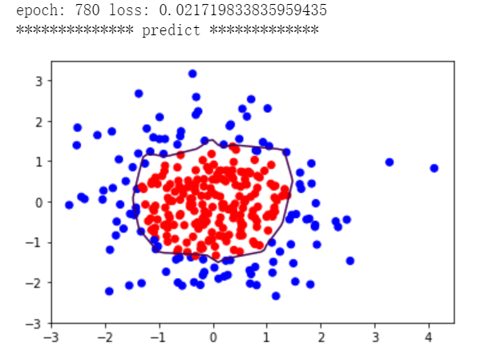


#### 实例过拟合的优化
上面的代码得到的模型曲线不够平滑，存在过拟合问题。


```python
import tensorflow as tf
import numpy as np
from matplotlib import pyplot as plt
import pandas as pd

#读入数据和标签，生成x_train ， y_train
df = pd.read_csv("dot.csv")
x_data = np.array(df[['x1','x2']])
y_data = np.array(df['y_c'])

x_train = np.vstack(x_data).reshape(-1,2)
y_train = np.vstack(y_data).reshape(-1,1)

Y_c = [['red' if y else 'blue'] for y in y_train]

#转换x的数据类型为浮点型
x_train = tf.cast(x_train ,tf.float32)
y_train = tf.cast(y_train ,tf.float32)

#from_tensor_slices函数切分传入的张量的第一个维度，生成相应的数据集，是输入特征和标签值一一对应。
train_db = tf.data.Dataset.from_tensor_slices((x_train,y_train)).batch(32)

# 生成神经网络的参数，输入层为2个神经元，单个隐藏层为11个神经元（可以改为其它值），输出层为1个神经元
# 用tf.Variable()保证参数是可训练的
w1 = tf.Variable(tf.random.normal([2,11]),dtype=tf.float32) # 这里w1的11与下面w2的11要一致
b1 = tf.Variable(tf.constant(0.01,shape=[11]))

w2 = tf.Variable(tf.random.normal([11,1]),dtype=tf.float32)# 11是隐藏层神经元数，1是输出神经元个数
b2 = tf.Variable(tf.constant(0.01,shape=[1]))

#定义超参数
lr = 0.005#学习率
epoch = 800 #循环轮数

#训练部分
print("************** train *************")
for epoch in range(epoch):
    for step,(x_train,y_train) in enumerate(train_db):
        with tf.GradientTape() as tape:
            h1 = tf.matmul(x_train,w1)+b1
            h1 = tf.nn.relu(h1)#使用relu激活函数
            y = tf.matmul(h1,w2) + b2
            
            #采用均方误差损失函数MSE
            loss_mse = tf.reduce_mean(tf.square(y_train - y))
            # 添加 L2 正则化
            loss_regularization = []
            loss_regularization.append(tf.nn.l2_loss(w1))
            loss_regularization.append(tf.nn.l2_loss(w2))
            loss_regularization = tf.reduce_sum(loss_regularization)
            loss = loss_mse + 0.03 * loss_regularization # REGULARIZER =0.03

        # 计算loss对各个参数的梯度
        variables = [w1,b1,w2,b2]
        grads = tape.gradient(loss,variables)
        
        #实现梯度更新
        w1.assign_sub(lr * grads[0])
        b1.assign_sub(lr * grads[1])
        w2.assign_sub(lr * grads[2])
        b2.assign_sub(lr * grads[3])
        
    #每20个epoch，打印一次loss信息
    if epoch %20 ==0:
        print('epoch:',epoch,"loss:",float(loss))

#预测部分
print("************** predict *************")
# xx在-3 到 3 之间以步长为0.01，yy在-3到3之间以步长0.01，生成间隔数值点。
xx,yy = np.mgrid[-3:3:.1,-3:3:.1]
# 将xx,yy拉直，并合并配对为二维张量，生成二维坐标点
grid = np.c_[xx.ravel(),yy.ravel()]
grid = tf.cast(grid,tf.float32)
# 将网格坐标点喂入神经网络，进行预测，probs为输出
probs =[]

for x_test in grid:
    #使用训练好的参数进行预测
    h1 = tf.matmul([x_test],w1)+b1
    h1 = tf.nn.relu(h1)
    y = tf.matmul(h1,w2)+b2
    probs.append(y)

print("************** visualization *************")
# 取第0 列给x1，取第1列给x2
x1 = x_data[:,0]
x2 = x_data[:,1]

# probs 的shape调整成xx的样子
probs = np.array(probs).reshape(xx.shape)
plt.scatter(x1,x2,color=np.squeeze(Y_c))#squeeze去掉维度是1的维度
#把坐标xx,yy和对应的值probs 放入contour函数，给probs值为0.5的所有点上色
plt.contour(xx,yy,probs,levels=[.5])
plt.show()
```
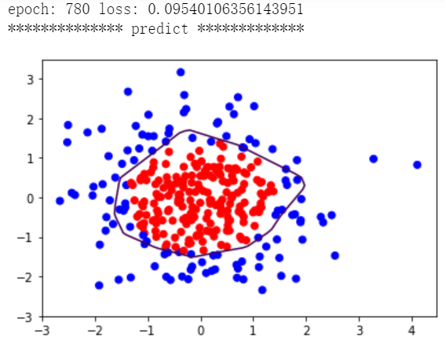

## 神经网络参数优化器

神经网络是基于连接的AI，当网络结构确定后，不同参数的选取对模型的表达有很大影响。

优化网络类似于教孩子，最终孩子的知识模型是类似的，但不同的引导方法会得到不同的效率和预测准确度，以及其它能力。


优化器是优化参数的工具。本节介绍5种优化器。

首先定义几个符号：
- 权重参数w
- 损失函数loss
- 学习率lr
- 每次迭代一个batch的大小（为了提高效率，按batch喂入，一般是$2^n$个数据）
- batch迭代的总次数t

优化器基本步骤：
1. 计算t时刻损失函数关于当前参数的梯度$g_t = \triangledown loss = \frac{\partial loss}{\partial (w_t)}$
2. 计算t时刻一阶动量 $m_t$ 和二阶动量 $V_t$
3. 计算t时刻下降梯度：$\eta_t = lr \cdot m_t / \sqrt{V_t}$
4. 计算 t+1 时刻参数：$w_{t+1} = w_t - \eta _t = w_t -lr \cdot m_t / \sqrt{V_t}$

注：一阶动量指与梯度相关的函数；二阶动量指与梯度平方相关的函数。不同的优化器有不同的一阶动量和二阶动量函数。

### 最常用的优化器SGD(无 momentum)
SGD即随机梯度下降。

- $m_t = g_t, V_t = 1$

- $\eta_t = lr \cdot m_t / \sqrt{V_t} = lr \cdot g_t$

- $w_{t+1} = w_t - \eta_t = w_t -  lr \cdot m_t / \sqrt{V_t} = w_t -  lr \cdot g_t$

- $w_{t+1} = w_t - lr * \frac{\partial loss}{\partial w_t}$

SGD实现代码：
```python

w1.assign_sub(lr*grads[0])
b1.assign_sub(lr*grads[1])
```

#### 实例

```python
# 利用鸢尾花数据集，实现前向传播、反向传播，可视化loss曲线

# 导入所需模块
import tensorflow as tf
from sklearn import datasets
from matplotlib import pyplot as plt
import numpy as np
import time  ##1##

# 导入数据，分别为输入特征和标签
x_data = datasets.load_iris().data
y_data = datasets.load_iris().target

# 随机打乱数据（因为原始数据是顺序的，顺序不打乱会影响准确率）
# seed: 随机数种子，是一个整数，当设置之后，每次生成的随机数都一样（为方便教学，以保每位同学结果一致）
np.random.seed(116)  # 使用相同的seed，保证输入特征和标签一一对应
np.random.shuffle(x_data)
np.random.seed(116)
np.random.shuffle(y_data)
tf.random.set_seed(116)

# 将打乱后的数据集分割为训练集和测试集，训练集为前120行，测试集为后30行
x_train = x_data[:-30]
y_train = y_data[:-30]
x_test = x_data[-30:]
y_test = y_data[-30:]

# 转换x的数据类型，否则后面矩阵相乘时会因数据类型不一致报错
x_train = tf.cast(x_train, tf.float32)
x_test = tf.cast(x_test, tf.float32)

# from_tensor_slices函数使输入特征和标签值一一对应。（把数据集分批次，每个批次batch组数据）
train_db = tf.data.Dataset.from_tensor_slices((x_train, y_train)).batch(32)
test_db = tf.data.Dataset.from_tensor_slices((x_test, y_test)).batch(32)

# 生成神经网络的参数，4个输入特征故，输入层为4个输入节点；因为3分类，故输出层为3个神经元
# 用tf.Variable()标记参数可训练
# 使用seed使每次生成的随机数相同（方便教学，使大家结果都一致，在现实使用时不写seed）
w1 = tf.Variable(tf.random.truncated_normal([4, 3], stddev=0.1, seed=1))
b1 = tf.Variable(tf.random.truncated_normal([3], stddev=0.1, seed=1))

lr = 0.1  # 学习率为0.1
train_loss_results = []  # 将每轮的loss记录在此列表中，为后续画loss曲线提供数据
test_acc = []  # 将每轮的acc记录在此列表中，为后续画acc曲线提供数据
epoch = 500  # 循环500轮
loss_all = 0  # 每轮分4个step，loss_all记录四个step生成的4个loss的和

# 训练部分
now_time = time.time()  ##2##
for epoch in range(epoch):  # 数据集级别的循环，每个epoch循环一次数据集
    for step, (x_train, y_train) in enumerate(train_db):  # batch级别的循环 ，每个step循环一个batch
        with tf.GradientTape() as tape:  # with结构记录梯度信息
            y = tf.matmul(x_train, w1) + b1  # 神经网络乘加运算
            y = tf.nn.softmax(y)  # 使输出y符合概率分布（此操作后与独热码同量级，可相减求loss）
            y_ = tf.one_hot(y_train, depth=3)  # 将标签值转换为独热码格式，方便计算loss和accuracy
            loss = tf.reduce_mean(tf.square(y_ - y))  # 采用均方误差损失函数mse = mean(sum(y-out)^2)
            loss_all += loss.numpy()  # 将每个step计算出的loss累加，为后续求loss平均值提供数据，这样计算的loss更准确
        # 计算loss对各个参数的梯度
        grads = tape.gradient(loss, [w1, b1])

        # 实现梯度更新 w1 = w1 - lr * w1_grad    b = b - lr * b_grad
        w1.assign_sub(lr * grads[0])  # 参数w1自更新
        b1.assign_sub(lr * grads[1])  # 参数b自更新

    # 每个epoch，打印loss信息
    print("Epoch {}, loss: {}".format(epoch, loss_all / 4))
    train_loss_results.append(loss_all / 4)  # 将4个step的loss求平均记录在此变量中
    loss_all = 0  # loss_all归零，为记录下一个epoch的loss做准备

    # 测试部分
    # total_correct为预测对的样本个数, total_number为测试的总样本数，将这两个变量都初始化为0
    total_correct, total_number = 0, 0
    for x_test, y_test in test_db:
        # 使用更新后的参数进行预测
        y = tf.matmul(x_test, w1) + b1
        y = tf.nn.softmax(y)
        pred = tf.argmax(y, axis=1)  # 返回y中最大值的索引，即预测的分类
        # 将pred转换为y_test的数据类型
        pred = tf.cast(pred, dtype=y_test.dtype)
        # 若分类正确，则correct=1，否则为0，将bool型的结果转换为int型
        correct = tf.cast(tf.equal(pred, y_test), dtype=tf.int32)
        # 将每个batch的correct数加起来
        correct = tf.reduce_sum(correct)
        # 将所有batch中的correct数加起来
        total_correct += int(correct)
        # total_number为测试的总样本数，也就是x_test的行数，shape[0]返回变量的行数
        total_number += x_test.shape[0]
    # 总的准确率等于total_correct/total_number
    acc = total_correct / total_number
    test_acc.append(acc)
    print("Test_acc:", acc)
    print("--------------------------")
total_time = time.time() - now_time  ##3##
print("total_time", total_time)  ##4##

# 绘制 loss 曲线
plt.title('Loss Function Curve')  # 图片标题
plt.xlabel('Epoch')  # x轴变量名称
plt.ylabel('Loss')  # y轴变量名称
plt.plot(train_loss_results, label="$Loss$")  # 逐点画出trian_loss_results值并连线，连线图标是Loss
plt.legend()  # 画出曲线图标
plt.show()  # 画出图像

# 绘制 Accuracy 曲线
plt.title('Acc Curve')  # 图片标题
plt.xlabel('Epoch')  # x轴变量名称
plt.ylabel('Acc')  # y轴变量名称
plt.plot(test_acc, label="$Accuracy$")  # 逐点画出test_acc值并连线，连线图标是Accuracy
plt.legend()
plt.show()

# 本文件较 class1\p45_iris.py 仅添加四处时间记录  用 ##n## 标识
# 请将loss曲线、ACC曲线、total_time记录到 class2\优化器对比.docx  对比各优化器收敛情况

```

运行结果如下：

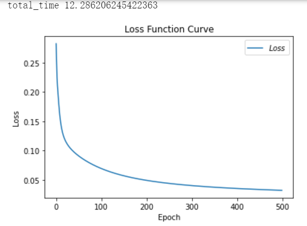

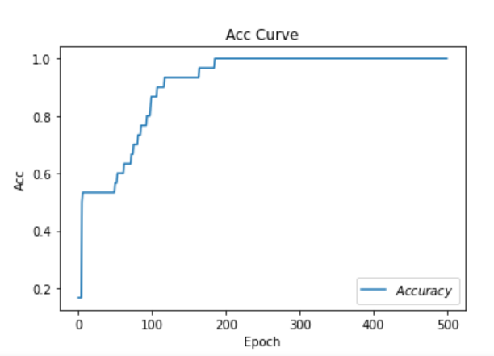

### SGDM 优化器（即含momentum的SGD）
在SGD基础上，增加了一阶动量。

下面的$m_t$公式，表示各时刻梯度方向的指数滑动平均值。$\beta$是个超参，经验值接近于1。

- $m_t = \beta \cdot m_{t-1} + (1-\beta) \cdot g_t, V_t = 1$


- $\eta_t = lr \cdot m_t / \sqrt{V_t} = lr \cdot m_t = lr \cdot (\beta \cdot m_{t-1} +(1-\beta) \cdot g_t)$

- $w_{t+1} = w_t - \eta_t = w_t -  lr \cdot  (\beta \cdot m_{t-1} +(1-\beta) \cdot g_t)$

#### 实现

实现时，最重要的是把一阶和二阶动量算出来。

```python

m_w,m_b = 0,0
beta = 0.9

m_w = beta * m_w +(1-beta)*grads[0]
b_w = beta * m_b + (1-beta)* grads[1]
w1.assign_sub(lr*m_w)
b1.assign_sub(lr * m_b)
```


```python

# 利用鸢尾花数据集，实现前向传播、反向传播，可视化loss曲线

# 导入所需模块
import tensorflow as tf
from sklearn import datasets
from matplotlib import pyplot as plt
import numpy as np
import time  ##1##

# 导入数据，分别为输入特征和标签
x_data = datasets.load_iris().data
y_data = datasets.load_iris().target

# 随机打乱数据（因为原始数据是顺序的，顺序不打乱会影响准确率）
# seed: 随机数种子，是一个整数，当设置之后，每次生成的随机数都一样（为方便教学，以保每位同学结果一致）
np.random.seed(116)  # 使用相同的seed，保证输入特征和标签一一对应
np.random.shuffle(x_data)
np.random.seed(116)
np.random.shuffle(y_data)
tf.random.set_seed(116)

# 将打乱后的数据集分割为训练集和测试集，训练集为前120行，测试集为后30行
x_train = x_data[:-30]
y_train = y_data[:-30]
x_test = x_data[-30:]
y_test = y_data[-30:]

# 转换x的数据类型，否则后面矩阵相乘时会因数据类型不一致报错
x_train = tf.cast(x_train, tf.float32)
x_test = tf.cast(x_test, tf.float32)

# from_tensor_slices函数使输入特征和标签值一一对应。（把数据集分批次，每个批次batch组数据）
train_db = tf.data.Dataset.from_tensor_slices((x_train, y_train)).batch(32)
test_db = tf.data.Dataset.from_tensor_slices((x_test, y_test)).batch(32)

# 生成神经网络的参数，4个输入特征故，输入层为4个输入节点；因为3分类，故输出层为3个神经元
# 用tf.Variable()标记参数可训练
# 使用seed使每次生成的随机数相同（方便教学，使大家结果都一致，在现实使用时不写seed）
w1 = tf.Variable(tf.random.truncated_normal([4, 3], stddev=0.1, seed=1))
b1 = tf.Variable(tf.random.truncated_normal([3], stddev=0.1, seed=1))

lr = 0.1  # 学习率为0.1
train_loss_results = []  # 将每轮的loss记录在此列表中，为后续画loss曲线提供数据
test_acc = []  # 将每轮的acc记录在此列表中，为后续画acc曲线提供数据
epoch = 500  # 循环500轮
loss_all = 0  # 每轮分4个step，loss_all记录四个step生成的4个loss的和

##########################################################################
m_w, m_b = 0, 0
beta = 0.9
##########################################################################

# 训练部分
now_time = time.time()  ##2##
for epoch in range(epoch):  # 数据集级别的循环，每个epoch循环一次数据集
    for step, (x_train, y_train) in enumerate(train_db):  # batch级别的循环 ，每个step循环一个batch
        with tf.GradientTape() as tape:  # with结构记录梯度信息
            y = tf.matmul(x_train, w1) + b1  # 神经网络乘加运算
            y = tf.nn.softmax(y)  # 使输出y符合概率分布（此操作后与独热码同量级，可相减求loss）
            y_ = tf.one_hot(y_train, depth=3)  # 将标签值转换为独热码格式，方便计算loss和accuracy
            loss = tf.reduce_mean(tf.square(y_ - y))  # 采用均方误差损失函数mse = mean(sum(y-out)^2)
            loss_all += loss.numpy()  # 将每个step计算出的loss累加，为后续求loss平均值提供数据，这样计算的loss更准确
        # 计算loss对各个参数的梯度
        grads = tape.gradient(loss, [w1, b1])

        ##########################################################################
        # sgd-momentun  
        m_w = beta * m_w + (1 - beta) * grads[0]
        m_b = beta * m_b + (1 - beta) * grads[1]
        w1.assign_sub(lr * m_w)
        b1.assign_sub(lr * m_b)
        ##########################################################################

    # 每个epoch，打印loss信息
    print("Epoch {}, loss: {}".format(epoch, loss_all / 4))
    train_loss_results.append(loss_all / 4)  # 将4个step的loss求平均记录在此变量中
    loss_all = 0  # loss_all归零，为记录下一个epoch的loss做准备

    # 测试部分
    # total_correct为预测对的样本个数, total_number为测试的总样本数，将这两个变量都初始化为0
    total_correct, total_number = 0, 0
    for x_test, y_test in test_db:
        # 使用更新后的参数进行预测
        y = tf.matmul(x_test, w1) + b1
        y = tf.nn.softmax(y)
        pred = tf.argmax(y, axis=1)  # 返回y中最大值的索引，即预测的分类
        # 将pred转换为y_test的数据类型
        pred = tf.cast(pred, dtype=y_test.dtype)
        # 若分类正确，则correct=1，否则为0，将bool型的结果转换为int型
        correct = tf.cast(tf.equal(pred, y_test), dtype=tf.int32)
        # 将每个batch的correct数加起来
        correct = tf.reduce_sum(correct)
        # 将所有batch中的correct数加起来
        total_correct += int(correct)
        # total_number为测试的总样本数，也就是x_test的行数，shape[0]返回变量的行数
        total_number += x_test.shape[0]
    # 总的准确率等于total_correct/total_number
    acc = total_correct / total_number
    test_acc.append(acc)
    print("Test_acc:", acc)
    print("--------------------------")
total_time = time.time() - now_time  ##3##
print("total_time", total_time)  ##4##

# 绘制 loss 曲线
plt.title('Loss Function Curve')  # 图片标题
plt.xlabel('Epoch')  # x轴变量名称
plt.ylabel('Loss')  # y轴变量名称
plt.plot(train_loss_results, label="$Loss$")  # 逐点画出trian_loss_results值并连线，连线图标是Loss
plt.legend()  # 画出曲线图标
plt.show()  # 画出图像

# 绘制 Accuracy 曲线
plt.title('Acc Curve')  # 图片标题
plt.xlabel('Epoch')  # x轴变量名称
plt.ylabel('Acc')  # y轴变量名称
plt.plot(test_acc, label="$Accuracy$")  # 逐点画出test_acc值并连线，连线图标是Accuracy
plt.legend()
plt.show()

# 请将loss曲线、ACC曲线、total_time记录到 class2\优化器对比.docx  对比各优化器收敛情况

```
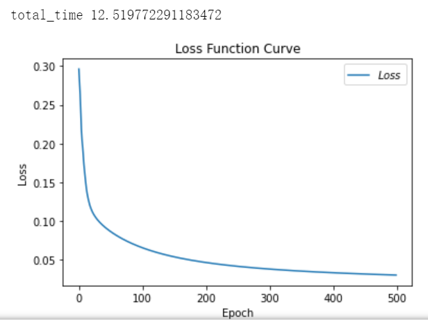
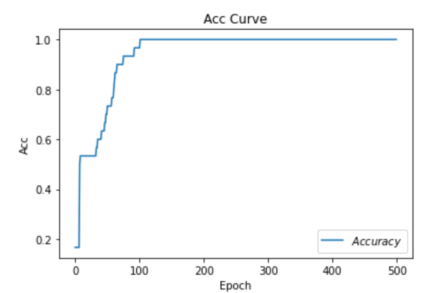


### Adagrad 优化器

在SGD基础上增加二阶动量，二阶动量是从开始到现在的梯度平方的累计和。

- $m_t = g_t, V_t = \sum_{\tau-1}^t g_{\tau}^2$


- $\eta_t = lr \cdot m_t / \sqrt{V_t} =  lr \cdot g_t/(\sqrt{\sum_{\tau-1}^t g_{\tau}^2})$

- $w_{t+1} = w_t - \eta_t = w_t -  lr \cdot g_t/(\sqrt{\sum_{\tau-1}^t g_{\tau}^2})$

代码实现：
```python
v_w ,v_b = 0,0
v_w += tf.square(grads[0])
v_b += tf.square(grads[1])
w1.assign_sub(lr * grads[0] /tf.sqrt(v_w))
b1.assign_sub(lr * grads[1] /tf.sqrt(v_b))
```


```python
# 利用鸢尾花数据集，实现前向传播、反向传播，可视化loss曲线

# 导入所需模块
import tensorflow as tf
from sklearn import datasets
from matplotlib import pyplot as plt
import numpy as np
import time  ##1##

# 导入数据，分别为输入特征和标签
x_data = datasets.load_iris().data
y_data = datasets.load_iris().target

# 随机打乱数据（因为原始数据是顺序的，顺序不打乱会影响准确率）
# seed: 随机数种子，是一个整数，当设置之后，每次生成的随机数都一样（为方便教学，以保每位同学结果一致）
np.random.seed(116)  # 使用相同的seed，保证输入特征和标签一一对应
np.random.shuffle(x_data)
np.random.seed(116)
np.random.shuffle(y_data)
tf.random.set_seed(116)

# 将打乱后的数据集分割为训练集和测试集，训练集为前120行，测试集为后30行
x_train = x_data[:-30]
y_train = y_data[:-30]
x_test = x_data[-30:]
y_test = y_data[-30:]

# 转换x的数据类型，否则后面矩阵相乘时会因数据类型不一致报错
x_train = tf.cast(x_train, tf.float32)
x_test = tf.cast(x_test, tf.float32)

# from_tensor_slices函数使输入特征和标签值一一对应。（把数据集分批次，每个批次batch组数据）
train_db = tf.data.Dataset.from_tensor_slices((x_train, y_train)).batch(32)
test_db = tf.data.Dataset.from_tensor_slices((x_test, y_test)).batch(32)

# 生成神经网络的参数，4个输入特征故，输入层为4个输入节点；因为3分类，故输出层为3个神经元
# 用tf.Variable()标记参数可训练
# 使用seed使每次生成的随机数相同（方便教学，使大家结果都一致，在现实使用时不写seed）
w1 = tf.Variable(tf.random.truncated_normal([4, 3], stddev=0.1, seed=1))
b1 = tf.Variable(tf.random.truncated_normal([3], stddev=0.1, seed=1))

lr = 0.1  # 学习率为0.1
train_loss_results = []  # 将每轮的loss记录在此列表中，为后续画loss曲线提供数据
test_acc = []  # 将每轮的acc记录在此列表中，为后续画acc曲线提供数据
epoch = 500  # 循环500轮
loss_all = 0  # 每轮分4个step，loss_all记录四个step生成的4个loss的和

##########################################################################
v_w, v_b = 0, 0
##########################################################################

# 训练部分
now_time = time.time()  ##2##
for epoch in range(epoch):  # 数据集级别的循环，每个epoch循环一次数据集
    for step, (x_train, y_train) in enumerate(train_db):  # batch级别的循环 ，每个step循环一个batch
        with tf.GradientTape() as tape:  # with结构记录梯度信息
            y = tf.matmul(x_train, w1) + b1  # 神经网络乘加运算
            y = tf.nn.softmax(y)  # 使输出y符合概率分布（此操作后与独热码同量级，可相减求loss）
            y_ = tf.one_hot(y_train, depth=3)  # 将标签值转换为独热码格式，方便计算loss和accuracy
            loss = tf.reduce_mean(tf.square(y_ - y))  # 采用均方误差损失函数mse = mean(sum(y-out)^2)
            loss_all += loss.numpy()  # 将每个step计算出的loss累加，为后续求loss平均值提供数据，这样计算的loss更准确
        # 计算loss对各个参数的梯度
        grads = tape.gradient(loss, [w1, b1])

        ##########################################################################
        # adagrad
        v_w += tf.square(grads[0])
        v_b += tf.square(grads[1])
        w1.assign_sub(lr * grads[0] / tf.sqrt(v_w))
        b1.assign_sub(lr * grads[1] / tf.sqrt(v_b))
    ##########################################################################

    # 每个epoch，打印loss信息
    print("Epoch {}, loss: {}".format(epoch, loss_all / 4))
    train_loss_results.append(loss_all / 4)  # 将4个step的loss求平均记录在此变量中
    loss_all = 0  # loss_all归零，为记录下一个epoch的loss做准备

    # 测试部分
    # total_correct为预测对的样本个数, total_number为测试的总样本数，将这两个变量都初始化为0
    total_correct, total_number = 0, 0
    for x_test, y_test in test_db:
        # 使用更新后的参数进行预测
        y = tf.matmul(x_test, w1) + b1
        y = tf.nn.softmax(y)
        pred = tf.argmax(y, axis=1)  # 返回y中最大值的索引，即预测的分类
        # 将pred转换为y_test的数据类型
        pred = tf.cast(pred, dtype=y_test.dtype)
        # 若分类正确，则correct=1，否则为0，将bool型的结果转换为int型
        correct = tf.cast(tf.equal(pred, y_test), dtype=tf.int32)
        # 将每个batch的correct数加起来
        correct = tf.reduce_sum(correct)
        # 将所有batch中的correct数加起来
        total_correct += int(correct)
        # total_number为测试的总样本数，也就是x_test的行数，shape[0]返回变量的行数
        total_number += x_test.shape[0]
    # 总的准确率等于total_correct/total_number
    acc = total_correct / total_number
    test_acc.append(acc)
    print("Test_acc:", acc)
    print("--------------------------")
total_time = time.time() - now_time  ##3##
print("total_time", total_time)  ##4##

# 绘制 loss 曲线
plt.title('Loss Function Curve')  # 图片标题
plt.xlabel('Epoch')  # x轴变量名称
plt.ylabel('Loss')  # y轴变量名称
plt.plot(train_loss_results, label="$Loss$")  # 逐点画出trian_loss_results值并连线，连线图标是Loss
plt.legend()  # 画出曲线图标
plt.show()  # 画出图像

# 绘制 Accuracy 曲线
plt.title('Acc Curve')  # 图片标题
plt.xlabel('Epoch')  # x轴变量名称
plt.ylabel('Acc')  # y轴变量名称
plt.plot(test_acc, label="$Accuracy$")  # 逐点画出test_acc值并连线，连线图标是Accuracy
plt.legend()
plt.show()

# 请将loss曲线、ACC曲线、total_time记录到 class2\优化器对比.docx  对比各优化器收敛情况

```

结果：
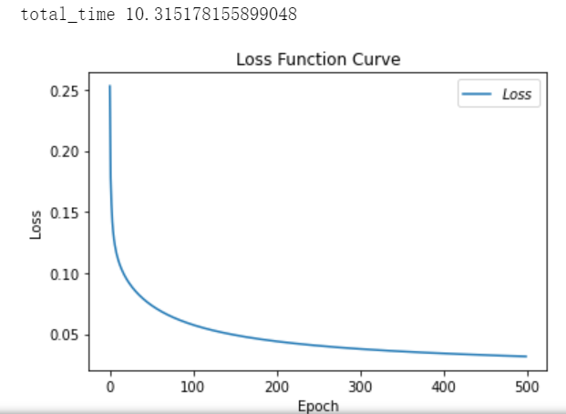

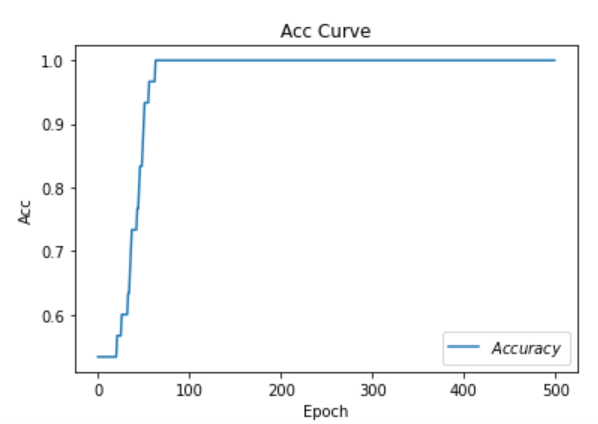

### RMSProp 优化器

是在SGD基础上增加了二阶动量。

- $m_t = g_t, V_t =\beta \cdot V_{t-1} + (1-\beta) \cdot g_t^2$


- $\eta_t = lr \cdot m_t / \sqrt{V_t} =  lr \cdot g_t/(\sqrt{\beta \cdot V_{t-1} + (1-\beta) \cdot g_t^2})$

- $w_{t+1} = w_t - \eta_t = w_t -   lr \cdot g_t/(\sqrt{\beta \cdot V_{t-1} + (1-\beta) \cdot g_t^2})$

代码：
```python
v_w ,v_b = 0,0
beta = 0.9

v_w = beta*v_w +(1-beta)* tf.square(grads[0])
v_b = beta * v_b + (1-beta)*tf.square(grads[1])
w1.assign_sub(lr * grads[0] /tf.sqrt(v_w))
b1.assgin_sub(lr * grads[1] /tf.sqrt(v_b))
```

结果：
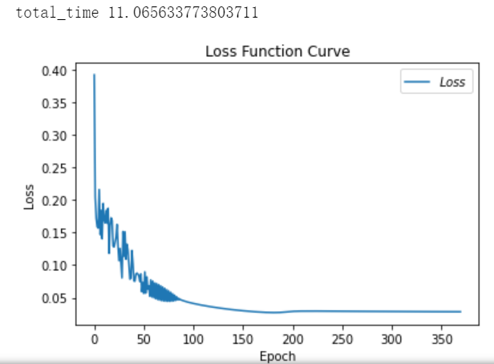

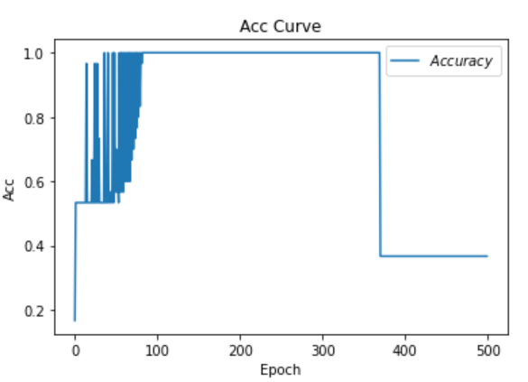

这次的loss和acc曲线与之前的不同，原因是学习率lr过大，调小后可以解决。

### Adam 优化器 

同时结合了SGDM一阶动量和RMSProp二阶动量

$m_t = \beta_1 \cdot m_{t-1} + (1-\beta_1)\cdot g_t$

修正一阶动量的偏差：$\hat m_t = \frac{m_t}{1-\beta_1^t}$

$V_t = \beta_2 \cdot V_{step -1} +(1-\beta_2)\cdot g_t^2$

修正二阶动量的偏差：$\hat V_t = \frac{V_t}{1-\beta_2^t}$

$\eta_t = lr \cdot \hat m_t/\sqrt{\hat V_t}= lr \cdot \hat m_t/\sqrt{\frac{V_t}{1-\beta_2^t}}$

$w_{t+1} = w_t -\eta_t = w_t - lr \cdot \frac{m_t}{1-\beta_1^t}/\sqrt{\frac{V_t}{1-\beta_2^t}} $

#### 实现

```python

# 利用鸢尾花数据集，实现前向传播、反向传播，可视化loss曲线

# 导入所需模块
import tensorflow as tf
from sklearn import datasets
from matplotlib import pyplot as plt
import numpy as np
import time  ##1##

# 导入数据，分别为输入特征和标签
x_data = datasets.load_iris().data
y_data = datasets.load_iris().target

# 随机打乱数据（因为原始数据是顺序的，顺序不打乱会影响准确率）
# seed: 随机数种子，是一个整数，当设置之后，每次生成的随机数都一样（为方便教学，以保每位同学结果一致）
np.random.seed(116)  # 使用相同的seed，保证输入特征和标签一一对应
np.random.shuffle(x_data)
np.random.seed(116)
np.random.shuffle(y_data)
tf.random.set_seed(116)

# 将打乱后的数据集分割为训练集和测试集，训练集为前120行，测试集为后30行
x_train = x_data[:-30]
y_train = y_data[:-30]
x_test = x_data[-30:]
y_test = y_data[-30:]

# 转换x的数据类型，否则后面矩阵相乘时会因数据类型不一致报错
x_train = tf.cast(x_train, tf.float32)
x_test = tf.cast(x_test, tf.float32)

# from_tensor_slices函数使输入特征和标签值一一对应。（把数据集分批次，每个批次batch组数据）
train_db = tf.data.Dataset.from_tensor_slices((x_train, y_train)).batch(32)
test_db = tf.data.Dataset.from_tensor_slices((x_test, y_test)).batch(32)

# 生成神经网络的参数，4个输入特征故，输入层为4个输入节点；因为3分类，故输出层为3个神经元
# 用tf.Variable()标记参数可训练
# 使用seed使每次生成的随机数相同（方便教学，使大家结果都一致，在现实使用时不写seed）
w1 = tf.Variable(tf.random.truncated_normal([4, 3], stddev=0.1, seed=1))
b1 = tf.Variable(tf.random.truncated_normal([3], stddev=0.1, seed=1))

lr = 0.1  # 学习率为0.1
train_loss_results = []  # 将每轮的loss记录在此列表中，为后续画loss曲线提供数据
test_acc = []  # 将每轮的acc记录在此列表中，为后续画acc曲线提供数据
epoch = 500  # 循环500轮
loss_all = 0  # 每轮分4个step，loss_all记录四个step生成的4个loss的和

##########################################################################
m_w, m_b = 0, 0
v_w, v_b = 0, 0
beta1, beta2 = 0.9, 0.999
delta_w, delta_b = 0, 0
global_step = 0
##########################################################################

# 训练部分
now_time = time.time()  ##2##
for epoch in range(epoch):  # 数据集级别的循环，每个epoch循环一次数据集
    for step, (x_train, y_train) in enumerate(train_db):  # batch级别的循环 ，每个step循环一个batch
 ##########################################################################       
        global_step += 1
 ##########################################################################       
        with tf.GradientTape() as tape:  # with结构记录梯度信息
            y = tf.matmul(x_train, w1) + b1  # 神经网络乘加运算
            y = tf.nn.softmax(y)  # 使输出y符合概率分布（此操作后与独热码同量级，可相减求loss）
            y_ = tf.one_hot(y_train, depth=3)  # 将标签值转换为独热码格式，方便计算loss和accuracy
            loss = tf.reduce_mean(tf.square(y_ - y))  # 采用均方误差损失函数mse = mean(sum(y-out)^2)
            loss_all += loss.numpy()  # 将每个step计算出的loss累加，为后续求loss平均值提供数据，这样计算的loss更准确
        # 计算loss对各个参数的梯度
        grads = tape.gradient(loss, [w1, b1])

##########################################################################
 # adam
        m_w = beta1 * m_w + (1 - beta1) * grads[0]
        m_b = beta1 * m_b + (1 - beta1) * grads[1]
        v_w = beta2 * v_w + (1 - beta2) * tf.square(grads[0])
        v_b = beta2 * v_b + (1 - beta2) * tf.square(grads[1])

        m_w_correction = m_w / (1 - tf.pow(beta1, int(global_step)))
        m_b_correction = m_b / (1 - tf.pow(beta1, int(global_step)))
        v_w_correction = v_w / (1 - tf.pow(beta2, int(global_step)))
        v_b_correction = v_b / (1 - tf.pow(beta2, int(global_step)))

        w1.assign_sub(lr * m_w_correction / tf.sqrt(v_w_correction))
        b1.assign_sub(lr * m_b_correction / tf.sqrt(v_b_correction))
##########################################################################

    # 每个epoch，打印loss信息
    print("Epoch {}, loss: {}".format(epoch, loss_all / 4))
    train_loss_results.append(loss_all / 4)  # 将4个step的loss求平均记录在此变量中
    loss_all = 0  # loss_all归零，为记录下一个epoch的loss做准备

    # 测试部分
    # total_correct为预测对的样本个数, total_number为测试的总样本数，将这两个变量都初始化为0
    total_correct, total_number = 0, 0
    for x_test, y_test in test_db:
        # 使用更新后的参数进行预测
        y = tf.matmul(x_test, w1) + b1
        y = tf.nn.softmax(y)
        pred = tf.argmax(y, axis=1)  # 返回y中最大值的索引，即预测的分类
        # 将pred转换为y_test的数据类型
        pred = tf.cast(pred, dtype=y_test.dtype)
        # 若分类正确，则correct=1，否则为0，将bool型的结果转换为int型
        correct = tf.cast(tf.equal(pred, y_test), dtype=tf.int32)
        # 将每个batch的correct数加起来
        correct = tf.reduce_sum(correct)
        # 将所有batch中的correct数加起来
        total_correct += int(correct)
        # total_number为测试的总样本数，也就是x_test的行数，shape[0]返回变量的行数
        total_number += x_test.shape[0]
    # 总的准确率等于total_correct/total_number
    acc = total_correct / total_number
    test_acc.append(acc)
    print("Test_acc:", acc)
    print("--------------------------")
total_time = time.time() - now_time  ##3##
print("total_time", total_time)  ##4##

# 绘制 loss 曲线
plt.title('Loss Function Curve')  # 图片标题
plt.xlabel('Epoch')  # x轴变量名称
plt.ylabel('Loss')  # y轴变量名称
plt.plot(train_loss_results, label="$Loss$")  # 逐点画出trian_loss_results值并连线，连线图标是Loss
plt.legend()  # 画出曲线图标
plt.show()  # 画出图像

# 绘制 Accuracy 曲线
plt.title('Acc Curve')  # 图片标题
plt.xlabel('Epoch')  # x轴变量名称
plt.ylabel('Acc')  # y轴变量名称
plt.plot(test_acc, label="$Accuracy$")  # 逐点画出test_acc值并连线，连线图标是Accuracy
plt.legend()
plt.show()

# 请将loss曲线、ACC曲线、total_time记录到 class2\优化器对比.docx  对比各优化器收敛情况

```

结果：

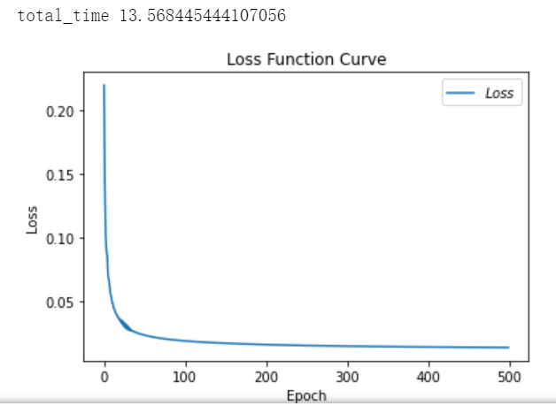

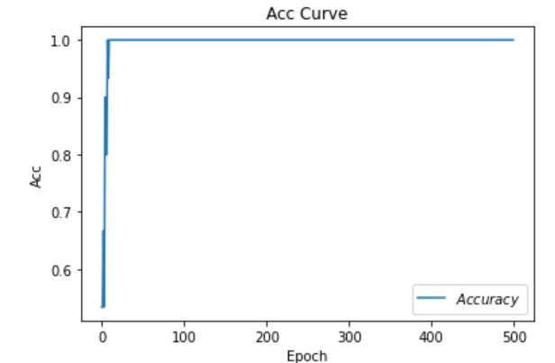