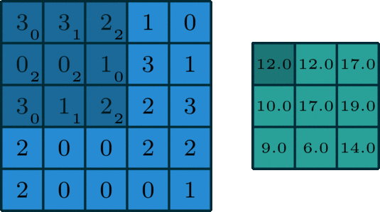

# tensorflow 8 卷积神经网络
> 声明：Tensorflow部分是学习北大曹老师Tensorflow2课程的笔记。
全连接NN：每个神经元与前后相邻层的每个神经元都有连接关系，输入是特征，输出为预测的结果。

全连接NN的参数个数：$N = \sum_{各层}前层神经元数 \times 后层神经元数（w） + 后层神经元数（b）$

例如之前例子中有784个像素点的灰度值作为输入，那么第一层参数有$784*128+128$，第二层参数有$128*10+10$，总共有101770个参数。

实际项目中，图片多是高分辨率彩色图，待优化的参数过多很容易导致模型过拟合。

为了防止过拟合，需要降低训练的参数数量：
- 首先对原始图片进行特征提取
- 把提取到的特征送给全连接网络

## 卷积
卷积计算可以认为是一种有效提取图像特征的方法。

一般会用一个正方形的卷积核，按指定步长，在输入特征图上滑动，遍历输入特征图中的每个像素点。每个步长，卷积核会与输入特征图出现重合区域，重合区域对应元素相乘、求和再加上偏置项，得到输出特征的一个像素点。

- 如果输入特征是单通道的灰度图，那么卷积核是深度为1的（3*3+1）单通道卷积核。
- 如果输入特征是三通道彩色图，那么使用3*3*3+1的卷积核，或者使用一个5*5*3+1的卷积核（每一个小单元都存放了一个带训练参数），总之要使卷积核的通道数与输入特征图的通道数一致。因为要想让卷积核与输入特征图对应点匹配上，必须令卷积核的深度与输入特征图的深度一致。即**输入特征图的深度（channel数）决定了当前层卷积核的深度。**

- 每个卷积核在卷积计算后，会得到一张输出特征图，所以当前层使用了几个卷积核就会有几张输出特征图，所以**当前层卷积核的个数，决定了当前层输出特征图的深度**。
- 如果觉得某层模型的特征提取能力不足，那么在这一层可以多用几个卷积核来提供本层的特征提取能力。

卷积核宽度w*卷积核高h*卷积核深度c+偏置项b：
- 对于3*3+1的卷积核，每个核中小单元存放一个带训练参数，即3*3+1个参数
- 对于3*3*3+1卷积核，每个核3*3*3+1=28个参数。
- 对于5*5*3+1卷积核，每个核5*5*3+1=76个参数。

在执行卷积计算时，卷积核里的这些参数是固定的，在每次反向传播时，核中小单元存储的带训练参数会被梯度下降法更新。卷积就是利用立体卷积核，实现了参数的空间共享。下面看看卷积的计算过程。


### 卷积的各种类型
卷积现在已衍生出了各种类型，包括标准卷积、反卷积、可分离卷积、分组卷积等等，下面逐一进行介绍。


#### 二维卷积（单通道卷积版本）（2D Convolution: the single channel version）
只有一个通道的卷积。
如下图是一个卷积核（kernel）为3×3、步长（stride）为1、填充（padding）为0的卷积：



#### 二维卷积（多通道版本）（2D Convolution: the multi-channel version）
拥有多个通道的卷积，例如处理彩色图像时，分别对R, G, B这3个层处理的3通道卷积，如下图


再将三个通道的卷积结果进行合并（一般采用元素相加），得到卷积后的结果，如下图：


#### 三维卷积（3D Convolution）
卷积有三个维度（高度、宽度、通道），沿着输入图像的3个方向进行滑动，最后输出三维的结果，如下图：


#### 1x1卷积（1 x 1 Convolution）
当卷积核尺寸为1x1时的卷积，也即卷积核变成只有一个数字。如下图：


从上图可以看出，1x1卷积的作用在于能有效地减少维度，降低计算的复杂度。1x1卷积在GoogLeNet网络结构中广泛使用。

#### 反卷积（转置卷积）（Deconvolution / Transposed Convolution）
卷积是对输入图像提取出特征（可能尺寸会变小），而所谓的“反卷积”便是进行相反的操作。但这里说是“反卷积”并不严谨，因为并不会完全还原到跟输入图像一样，一般是还原后的尺寸与输入图像一致，主要用于向上采样。从数学计算上看，“反卷积”相当于是将卷积核转换为稀疏矩阵后进行转置计算，因此，也被称为“转置卷积”
如下图，在2x2的输入图像上应用步长为1、边界全0填充的3x3卷积核，进行转置卷积（反卷积）计算，向上采样后输出的图像大小为4x4


#### 空洞卷积（膨胀卷积）（Dilated Convolution / Atrous Convolution）
为扩大感受野，在卷积核里面的元素之间插入空格来“膨胀”内核，形成“空洞卷积”（或称膨胀卷积），并用膨胀率参数L表示要扩大内核的范围，即在内核元素之间插入L-1个空格。当L=1时，则内核元素之间没有插入空格，变为标准卷积。

如下图为膨胀率L=2的空洞卷积：


#### 可分离卷积（Separable Convolutions）

##### 空间可分离卷积 （Spatially Separable Convolutions）
空间可分离卷积是将卷积核分解为两项独立的核分别进行操作。一个3x3的卷积核分解如下图：


分解后的卷积计算过程如下图，先用3x1的卷积核作横向扫描计算，再用1x3的卷积核作纵向扫描计算，最后得到结果。采用可分离卷积的计算量比标准卷积要少。


##### 深度可分离卷积（Depthwise Separable Convolutions）
深度可分离卷积由两步组成：深度卷积和1x1卷积。
首先，在输入层上应用深度卷积。如下图，使用3个卷积核分别对输入层的3个通道作卷积计算，再堆叠在一起。


再使用1x1的卷积（3个通道）进行计算，得到只有1个通道的结果


重复多次1x1的卷积操作（如下图为128次），则最后便会得到一个深度的卷积结果。


完整计算过程：


#### 扁平卷积（Flattened convolutions）
扁平卷积是将标准卷积核拆分为3个1x1的卷积核，然后再分别对输入层进行卷积计算。这种方式，跟前面的“空间可分离卷积”类似，如下图：


#### 分组卷积（Grouped Convolution）
2012年，AlexNet论文中最先提出来的概念，当时主要为了解决GPU显存不足问题，将卷积分组后放到两个GPU并行执行。

在分组卷积中，卷积核被分成不同的组，每组负责对相应的输入层进行卷积计算，最后再进行合并。如下图，卷积核被分成前后两个组，前半部分的卷积组负责处理前半部分的输入层，后半部分的卷积组负责处理后半部分的输入层，最后将结果合并组合。


#### 混洗分组卷积（Shuffled Grouped Convolution）
在分组卷积中，卷积核被分成多个组后，输入层卷积计算的结果仍按照原先的顺序进行合并组合，这就阻碍了模型在训练期间特征信息在通道组之间流动，同时还削弱了特征表示。而混洗分组卷积，便是将分组卷积后的计算结果混合交叉在一起输出。
如下图，在第一层分组卷积（GConv1）计算后，得到的特征图先进行拆组，再混合交叉，形成新的结果输入到第二层分组卷积（GConv2）中：


## 感受野（Receptive Field）

感受野：卷积神经网络各输出特征图中的每个像素点，在原始输入图片上映射区域的大小。


- 下图中，中间conv1是在原始raw 图中经过步长为2的3*3卷积核计算后得到的，所以其每个单元格映射到raw image是3*3的区域，所以它的感受野是3
- conv2图中的每一格，是使用2*2卷积核，经过步长为1的卷积计算后得到的，所以其每个单元格的对应raw image是5*5的区域，所以它的感受野是5.


感受野相同的卷积核，特征提取能力是相同的。

设输入特征图宽、高均为x，卷积计算步长为1.
- 若使用 3*3 卷积核计算两次，需要计算的参数有 9+9=18 个，计算量 $(x-3+1)^2*9+(x-3+1-3+1)^2*9=18x^2-108x+180$
- 若使用 5*5 卷积核计算一次，需要计算的参数有25个，计算量$(x-5+1)^2*25=25x^2-200x+400$

由上面的计算式可知：**x较大时(x>10),两层$3 \times 3$卷积计算比一层$5 \times 5$卷积计算的效率要高，且特征提取能力相同**。

### 全零填充（padding）
有时我们希望卷积计算保持输入特征图的尺寸不变，可以使用全零填充。即在输入特征图周围填充 0 。

例如 5*5*1 的输入特征图经过全零填充后，变为 7*7*1 的输入特征图，再使用 3*3*1 的卷积核进行卷积计算，得到的输出特征图仍为 5*5*1。

下面公式给出了全零填充的计算公式：

$$
padding =\begin{cases}
SAME(全 0 填充), \frac{输入特征图长度}{卷积计算步长} 向上取整 \\
VALID(不填充), \frac{输入特征图长度-卷积核长度+1}{卷积计算步长} 向上取整 
\end{cases}
$$

在Tensorflow中描述全零填充，使用参数 `padding='SAME'` 或 `padding='VALID'` 表示。

### tf 描述卷积层 tf.keras.layers.Conv2D
tf.keras.layers.Conv2D()的参数：
- kernel_size=卷积核个数,
- kernel_size = 卷积核尺寸,#正方形卷积核写为核长整数或者写为元组形式(核高h，核宽w)
- strides=滑动步长，#横纵向相同时，写步长整数，或写成元组形式(纵向步长h，横向步长w)；默认为1.
- padding="same" 或 "valid"
- activation="relu" 或 "sigmoid" 或 "tanh" 或 "softmax"等；如果有BN此处不屑
- input_shape=(高，宽，通道数) 输入特征图维度，可省略


下面的示例给出了一个3层网络，每层是一种形式的卷积定义。

```python

model = tf.keras.models.Sequential([
    Conv2D(6,5,padding='valid',activation='sigmoid'),
    Conv2D(6,(5,5),padding='valid',activation='sigmoid'),
    MaxPool2D(2,(2,2)),
    Conv2D(filters=6,kernal_size=(5,5),padding='valid',activation='sigmoid'),
    MaxPool2D(pool_size=(2,,2),strides=2),
    Flatten(),
    Dense(10,activation='softmax')
])
```

### 批标准化 （Batch Normalization ，BN）
神经网络一般对0附近的数据比较敏感，但随着网络层数的增加，特征数据会出现偏离0均值的情况。

标准化：使数据符合0均值，1为标准差的分布。

批标准化：对一小批（batch）进行标准化处理。

批标准化后，第k个卷积核的输出特征图（feature map）中的第i个像素点为：$H_i^{'k} = \frac{H_i^k - \mu_{batch}^k}{\delta_{batch}^k}$

其中：
- $H_i^k$，批标准化前，第k个卷积核，输出特征图中第i个像素点。
- $\mu_{batch}^k$，批标准化前，第k个卷积核，batch张输出特征图中所有像素点的平均值。$\mu_{batch}^k = \frac{1}{m}\sum_{i=1}^m H_i^k$
- $\delta_{batch}^k$，批标准化前，k个卷积核，batch张输出特征图中所有像素点的标准差。$\delta_{batch}^k = \sqrt{\delta + \frac{1}{m}\sum_{i=1}^m (H_i^k - \mu_{batch}^k)^2}$

批标准化的作用：使均值回到0附近。如下图所示：


这会使数据微小变化更容易被神经网络所学习，提升了激活函数对输入数据的区分力。

但是简单使用$H_i^{'k} = \frac{H_i^k - \mu_{batch}^k}{\delta_{batch}^k}$这个批标准化，会使特征数据变成符合标准特征分布的数据，集中在激活函数中心的线性区域。这会使激活函数丧失了非线性特性。

因此，在BN操作中，为每个卷积核引入两个可训练的参数：缩放因子$\gamma$ , 偏移因子$\beta$，用来调整批归一化的力度。即$X_i^k = \gamma _kH_i^{'k} + \beta_k$

反向传播时，缩放因子$\gamma$ , 偏移因子$\beta$ 会统其它训练参数一起被训练优化，使用它们可以优化特征数据分布的宽窄核偏移量，保证了网络的非线性表达力。

BN层位于卷积层之后，激活层之前。

tensorflow描述批标准化：`tf.keras.layers.BatchNormalization()`

```python
model = tf.keras.models.Sequential([
    Conv2D(filters=6,kernel_size=(5,5),padding='same'),
    BatchNormalization(),
    Activation('relu'),
    MaxPool2D(pool_size=(2,2),strides=2,padding='same'),
    Dropout(0.2),
])
```

### 池化

池化操作，用于减少卷积神经网络中特征数据量。

#### 池化分类

- 最大值池化可提取图片纹理；
- 均值池化可保留背景特征。
- 随机池化
-  中值池化
-  组合池化
-  Spatial Pyramid Pooling
-  Global Average/Max Pooling
-  NetVLAD池化
-  双线性池化
-  UnPooling

https://www.cnblogs.com/pprp/p/12456403.html

##### 最大/平均池化
最大池化就是选择图像区域中最大值作为该区域池化以后的值，反向传播的时候，梯度通过前向传播过程的最大值反向传播，其他位置梯度为0。

使用的时候，最大池化又分为重叠池化和非重叠池化，比如常见的stride=kernel size的情况属于非重叠池化，如果stride < kernel size 则属于重叠池化。重叠池化相比于非重叠池化不仅可以提升预测精度，同时在一定程度上可以缓解过拟合。

重叠池化一个应用的例子就是yolov3-tiny的backbone最后一层，使用了一个stride=1, kernel size=2的maxpool进行特征的提取。

最大池化是用池化核，覆盖住输入特征图后，选择其中最大的数值作为输出值。例如：


均值池化是用池化核，覆盖住输入特征图后，计算覆盖区域特征值的平均值作为输出值。例如上图中其它细节不变而是用均值池化，则得到的是：
```
[[3.25, 5.25]
 [2 ,    2 ]]
```

Tensorflow对池化的描述:
- `tf.keras.layers.MaxPool2d()`

- `tf.keras.layers.AveragePooling2D()`

`tf.keras.layers.MaxPool2d()`的参数：
- pool_size=池化核尺寸，正方形写核长整数，或者(核高h，核宽w)
- strides=池化步长
- padding='valid' 或 'same'

`tf.keras.layers.AveragePooling2D()`的参数与上面雷同。

```python
model = tf.keras.models.Sequential([
    Conv2D(filters=6,kernel_size=(5,5),padding='same'),
    BatchNormalization(),
    Activation('relu'),
    MaxPool2D(pool_size=(2,2),strides=2,padding='same'),
    Dropout(0.2),
])
```

### 舍弃

为了防止神经网络过拟合，在神经网络训练中，会将隐藏层一部分神经元按照一定概率从神经网络中暂时舍弃。而当神经网络使用时，被舍弃的神经元将恢复到连接中。

Tensorflow对舍弃的描述:`tf.keras.layers.Dropout(舍弃的概率)`


### CNN 小结

卷积神经网络，借助卷积核提取特征后，送入全连接网络。

卷积神经网络的最主要模块：
- 卷积 Convolutional
  - 含Padding
- 批标准化 BN
- 激活 Activation
- 池化 Pooling
- 舍弃 Dropout


**卷积就是特征提取器，就是CBAPD。**

## cifar10 数据集

提供5万张 32*32 像素点的十分类彩色(RGB 3 通道)图片核标签，用于训练。x_train.shape为(50000,32,32,3),y_train.shape为（10000，1）

提供1万张 32*32 像素点的十分类彩色(RGB 3 通道)图片核标签，用于测试。

导入：
```
cifar10 = tf.keras.datasets.cifar10
(x_train,y_train),(x_test,y_test) = cifar10.load_data()
```

查看图片：
```
plt.imshow(x_train[0])
plt.show()
```

查看输入特征图像素值：
```
print("x_train[0]:\n",x_train[0])
```

### cifar 10分类卷积神经网络搭建示例

网络结构：
- 5*5 的 Conv2D，卷积核 6个 ，即filters =6；2*2 的 池化层，步长为2.
  - Convolutional: filters= 6,kernel_size=(5,5), strides =1,padding='same'
  - BN : BatchNormalization(),
  - Activation('relu'),
  - P : MaxPool2D(pool_size=(2,2),strides=2,padding='same')
  - D : Dropout(0.2)
- 隐藏层（全连接层，128个神经元, activation='relu',Dropout(0.2))
- 输出层（全连接层，10个神经元,activation='softmax'）


实际代码：

```python

import tensorflow as tf
import os
import numpy as np
from matplotlib import pyplot as plt
from tensorflow.keras.layers import Conv2D, BatchNormalization, Activation, MaxPool2D, Dropout, Flatten, Dense
from tensorflow.keras import Model

np.set_printoptions(threshold=np.inf)

cifar10 = tf.keras.datasets.cifar10
(x_train, y_train), (x_test, y_test) = cifar10.load_data()
x_train, x_test = x_train / 255.0, x_test / 255.0


class Baseline(Model):
    def __init__(self):
        super(Baseline, self).__init__()
        self.c1 = Conv2D(filters=6, kernel_size=(5, 5), padding='same')  # 卷积层
        self.b1 = BatchNormalization()  # BN层
        self.a1 = Activation('relu')  # 激活层
        self.p1 = MaxPool2D(pool_size=(2, 2), strides=2, padding='same')  # 池化层
        self.d1 = Dropout(0.2)  # dropout层

        self.flatten = Flatten()
        self.f1 = Dense(128, activation='relu')
        self.d2 = Dropout(0.2)
        self.f2 = Dense(10, activation='softmax')

    def call(self, x):
        #前向传播过程
        x = self.c1(x)
        x = self.b1(x)
        x = self.a1(x)
        x = self.p1(x)
        x = self.d1(x)

        x = self.flatten(x)
        x = self.f1(x)
        x = self.d2(x)
        y = self.f2(x)
        return y


model = Baseline()

model.compile(optimizer='adam',
              loss=tf.keras.losses.SparseCategoricalCrossentropy(from_logits=False),
              metrics=['sparse_categorical_accuracy'])

checkpoint_save_path = "./checkpoint/Baseline.ckpt"
if os.path.exists(checkpoint_save_path + '.index'):
    print('-------------load the model-----------------')
    model.load_weights(checkpoint_save_path)

cp_callback = tf.keras.callbacks.ModelCheckpoint(filepath=checkpoint_save_path,
                                                 save_weights_only=True,
                                                 save_best_only=True)

history = model.fit(x_train, y_train, batch_size=32, epochs=5, 
                    validation_data=(x_test, y_test),  validation_freq=1,
                    callbacks=[cp_callback])
model.summary()

# print(model.trainable_variables)
file = open('./weights.txt', 'w')
for v in model.trainable_variables:
    file.write(str(v.name) + '\n')
    file.write(str(v.shape) + '\n')
    file.write(str(v.numpy()) + '\n')
file.close()

##########  show   #########

# 显示训练集和验证集的acc和loss曲线
acc = history.history['sparse_categorical_accuracy']
val_acc = history.history['val_sparse_categorical_accuracy']
loss = history.history['loss']
val_loss = history.history['val_loss']

plt.subplot(1, 2, 1)
plt.plot(acc, label='Training Accuracy')
plt.plot(val_acc, label='Validation Accuracy')
plt.title('Training and Validation Accuracy')
plt.legend()

plt.subplot(1, 2, 2)
plt.plot(loss, label='Training Loss')
plt.plot(val_loss, label='Validation Loss')
plt.title('Training and Validation Loss')
plt.legend()
plt.show()

```

## 经典神经网络模型

- LeNet（1998）
- AlexNet（2012）
- VGGNet（2014）
- InceptionNet（2014）
- ResNet（2015）

### LeNet

卷积网络的开篇之作，由Yann LeCun 于1998年提出。

通过共享卷积核，减少了特征参数。

在统计卷积神经网络的层数时，一般只统计了卷积层、全连接层，其余操作可以认为时卷积层的附属。


LeNet一共由5层网络：
- 卷积层 C1：6@28*28
  - C：核6*5*5，strides=1，padding='valid'
  - B: None
  - A: 'sigmoid'
  - P: max,核：2*2，strides=2，padding='valid'
  - D: None

- 卷积层 C3：16@10*10
  - C：核16*5*5，strides=1，padding='valid'
  - B: None
  - A: 'sigmoid'
  - P: max,核：2*2，strides=2，padding='valid'
  - D: None

- Dense C5：120,sigmoid
- Dense  F6：84,sigmoid
- Dense  Output：10,softmax

还有一种说法，LeNet一共由7层网络（不计输入层），较之上面的5层，多了两个池化层（下采样层）：
- S2：6@14*14
- S4：16@5*5


LeNet时代还没有：BN，dropout，sigmoid是主流的激活函数。


对应CBAPD对LeNet 网络类的代码实现：
```python
class LeNet5(Model):
    def __init__(self):
        super(LeNet5,self).__init__()
        self.c1 = Conv2D(filters=6,kernel_size=(5,5),activation='sigmoid')
        self.p1 = MaxPool2D(pool_size=(2,2),strides=2)
        self.c2 = Conv2D(filters=16,kernel_size=(5,5),activation='sigmoid')
        self.p2 = MaxPool2D(pool_size=(2,2),strides=2)

        self.flatten = Flatten()
        self.f1 = Dense(120,activation='sigmoid')
        self.f2 = Dense(84,activation='sigmoid')
        self.f3 = Dense(10,activation='sigmoid')
```
完整代码如下


```python
import tensorflow as tf
import os
import numpy as np
from matplotlib import pyplot as plt
from tensorflow.keras.layers import Conv2D, BatchNormalization, Activation, MaxPool2D, Dropout, Flatten, Dense
from tensorflow.keras import Model

np.set_printoptions(threshold=np.inf)

cifar10 = tf.keras.datasets.cifar10
(x_train, y_train), (x_test, y_test) = cifar10.load_data()
x_train, x_test = x_train / 255.0, x_test / 255.0


class LeNet5(Model):
    def __init__(self):
        super(LeNet5, self).__init__()
        self.c1 = Conv2D(filters=6, kernel_size=(5, 5),
                         activation='sigmoid')
        self.p1 = MaxPool2D(pool_size=(2, 2), strides=2)

        self.c2 = Conv2D(filters=16, kernel_size=(5, 5),
                         activation='sigmoid')
        self.p2 = MaxPool2D(pool_size=(2, 2), strides=2)

        self.flatten = Flatten()
        self.f1 = Dense(120, activation='sigmoid')
        self.f2 = Dense(84, activation='sigmoid')
        self.f3 = Dense(10, activation='softmax')

    def call(self, x):
        x = self.c1(x)
        x = self.p1(x)

        x = self.c2(x)
        x = self.p2(x)

        x = self.flatten(x)
        x = self.f1(x)
        x = self.f2(x)
        y = self.f3(x)
        return y


model = LeNet5()

model.compile(optimizer='adam',
              loss=tf.keras.losses.SparseCategoricalCrossentropy(from_logits=False),
              metrics=['sparse_categorical_accuracy'])

checkpoint_save_path = "./checkpoint/LeNet5.ckpt"
if os.path.exists(checkpoint_save_path + '.index'):
    print('-------------load the model-----------------')
    model.load_weights(checkpoint_save_path)

cp_callback = tf.keras.callbacks.ModelCheckpoint(filepath=checkpoint_save_path,
                                                 save_weights_only=True,
                                                 save_best_only=True)

history = model.fit(x_train, y_train, batch_size=32, epochs=5, validation_data=(x_test, y_test), validation_freq=1,
                    callbacks=[cp_callback])
model.summary()

# print(model.trainable_variables)
file = open('./weights.txt', 'w')
for v in model.trainable_variables:
    file.write(str(v.name) + '\n')
    file.write(str(v.shape) + '\n')
    file.write(str(v.numpy()) + '\n')
file.close()

###############################################    show   ###############################################

# 显示训练集和验证集的acc和loss曲线
acc = history.history['sparse_categorical_accuracy']
val_acc = history.history['val_sparse_categorical_accuracy']
loss = history.history['loss']
val_loss = history.history['val_loss']

plt.subplot(1, 2, 1)
plt.plot(acc, label='Training Accuracy')
plt.plot(val_acc, label='Validation Accuracy')
plt.title('Training and Validation Accuracy')
plt.legend()

plt.subplot(1, 2, 2)
plt.plot(loss, label='Training Loss')
plt.plot(val_loss, label='Validation Loss')
plt.title('Training and Validation Loss')
plt.legend()
plt.show()


```

### AlexNet 

诞生于2012年，是当年ImageNet竞赛的冠军，Top5错误率为16.4%。

使用relu激活函数，提升了训练速度；使用Dropout缓解了过拟合。


AlexNet有8层：
- 卷积层 1
  - C:核 96*3*3，步长 1，填充valid
  - B ：有，原论文使用LRN，但最近几年不常见了，且LRN与BatchNormalization()功能相同。
  - A: 'relu'
  - P：max,核3*3，步长 2
  - D：None
  - MaxPooling 层
- 卷积层 2
  - C:核 256*3*3，步长 1，填充valid
  - B ：有，原论文使用LRN，但最近几年不常见了，且LRN与BatchNormalization()功能相同。
  - A: 'relu'
  - P：max,核3*3，步长 2
  - D：None
- 卷积层 3
  - C:核 384*3*3，步长 1，填充 same
  - B ：无
  - A: 'relu'
  - P：无
  - D：None
- 卷积层 4
  - C:核 384*3*3，步长 1，填充 same
  - B ：无
  - A: 'relu'
  - P：无
  - D：None
- 卷积层 5
  - C:核 256*3*3，步长 1，填充 same
  - B ：无
  - A: 'relu'
  - P：max，核为3*3，步长2
  - D：None
- Flatten
- Dense：（神经元 2048，激活函数 relu，Dropout 0.5）
- Dense：（神经元 2048，激活函数 relu，Dropout 0.5）
- Dense：（神经元 10，激活函数 softmax）


AlexNet8类定义：

```python

class AlexNet8(Model):
    def __init__(self):
        super(AlexNet8,self).__init__()
        self.c1 = Conv2D(filters=96,kernel_size=(3,3))
        self.b1 = BatchNormalization()
        self.a1 = Activation('relu')
        self.p1 = MaxPool2D(pool_size=(3,3),strides=2)

        self.c1 = Conv2D(filters=256,kernel_size=(3,3))
        self.b1 = BatchNormalization()
        self.a1 = Activation('relu')
        self.p1 = MaxPool2D(pool_size=(3,3),strides=2)

        self.c3 = Conv2D(filters=384,kernel_size=(3,3),padding='same',activation='relu')

        self.c4 = Conv2D(filters=384,kernel_size=(3,3),padding='same',activation='relu')

        self.c5 = Conv2D(filters=256,kernel_size=(3,3),padding='same',activation='relu')

        self.p3 = MaxPool2D(pool_size=(3,3),strides=2)

        self.flatten = Flatten()
        self.f1 = Dense(2048,activation='relu')
        self.d1 = Dropout(0.5)
        self.f2 = Dense(2048,activation='relu')
        self.d2 = Dropout(0.5)
        self.f3 = Dense(10,activation='softmax')

```


完整python代码：
```python
import tensorflow as tf
import os
import numpy as np
from matplotlib import pyplot as plt
from tensorflow.keras.layers import Conv2D, BatchNormalization, Activation, MaxPool2D, Dropout, Flatten, Dense
from tensorflow.keras import Model

np.set_printoptions(threshold=np.inf)

cifar10 = tf.keras.datasets.cifar10
(x_train, y_train), (x_test, y_test) = cifar10.load_data()
x_train, x_test = x_train / 255.0, x_test / 255.0


class AlexNet8(Model):
    def __init__(self):
        super(AlexNet8, self).__init__()
        self.c1 = Conv2D(filters=96, kernel_size=(3, 3))
        self.b1 = BatchNormalization()
        self.a1 = Activation('relu')
        self.p1 = MaxPool2D(pool_size=(3, 3), strides=2)

        self.c2 = Conv2D(filters=256, kernel_size=(3, 3))
        self.b2 = BatchNormalization()
        self.a2 = Activation('relu')
        self.p2 = MaxPool2D(pool_size=(3, 3), strides=2)

        self.c3 = Conv2D(filters=384, kernel_size=(3, 3), padding='same',
                         activation='relu')
                         
        self.c4 = Conv2D(filters=384, kernel_size=(3, 3), padding='same',
                         activation='relu')
                         
        self.c5 = Conv2D(filters=256, kernel_size=(3, 3), padding='same',
                         activation='relu')
        self.p3 = MaxPool2D(pool_size=(3, 3), strides=2)

        self.flatten = Flatten()
        self.f1 = Dense(2048, activation='relu')
        self.d1 = Dropout(0.5)
        self.f2 = Dense(2048, activation='relu')
        self.d2 = Dropout(0.5)
        self.f3 = Dense(10, activation='softmax')

    def call(self, x):
        x = self.c1(x)
        x = self.b1(x)
        x = self.a1(x)
        x = self.p1(x)

        x = self.c2(x)
        x = self.b2(x)
        x = self.a2(x)
        x = self.p2(x)

        x = self.c3(x)

        x = self.c4(x)

        x = self.c5(x)
        x = self.p3(x)

        x = self.flatten(x)
        x = self.f1(x)
        x = self.d1(x)
        x = self.f2(x)
        x = self.d2(x)
        y = self.f3(x)
        return y


model = AlexNet8()

model.compile(optimizer='adam',
              loss=tf.keras.losses.SparseCategoricalCrossentropy(from_logits=False),
              metrics=['sparse_categorical_accuracy'])

checkpoint_save_path = "./checkpoint/AlexNet8.ckpt"
if os.path.exists(checkpoint_save_path + '.index'):
    print('-------------load the model-----------------')
    model.load_weights(checkpoint_save_path)

cp_callback = tf.keras.callbacks.ModelCheckpoint(filepath=checkpoint_save_path,
                                                 save_weights_only=True,
                                                 save_best_only=True)

history = model.fit(x_train, y_train, batch_size=32, epochs=5, validation_data=(x_test, y_test), validation_freq=1,
                    callbacks=[cp_callback])
model.summary()

# print(model.trainable_variables)
file = open('./weights.txt', 'w')
for v in model.trainable_variables:
    file.write(str(v.name) + '\n')
    file.write(str(v.shape) + '\n')
    file.write(str(v.numpy()) + '\n')
file.close()

###############################################    show   ###############################################

# 显示训练集和验证集的acc和loss曲线
acc = history.history['sparse_categorical_accuracy']
val_acc = history.history['val_sparse_categorical_accuracy']
loss = history.history['loss']
val_loss = history.history['val_loss']

plt.subplot(1, 2, 1)
plt.plot(acc, label='Training Accuracy')
plt.plot(val_acc, label='Validation Accuracy')
plt.title('Training and Validation Accuracy')
plt.legend()

plt.subplot(1, 2, 2)
plt.plot(loss, label='Training Loss')
plt.plot(val_loss, label='Validation Loss')
plt.title('Training and Validation Loss')
plt.legend()
plt.show()

```

### VGGNet
2014年ImageNet竞赛的亚军，top5错误率降低到7.3%

VGGNet使用小尺寸卷积核，在减少参数的同时，提高了识别准确率。VGGNet的网络规整，非常适合硬件加速。

VGGNet共16层：


实际代码：
```python
import tensorflow as tf
import os
import numpy as np
from matplotlib import pyplot as plt
from tensorflow.keras.layers import Conv2D, BatchNormalization, Activation, MaxPool2D, Dropout, Flatten, Dense
from tensorflow.keras import Model

np.set_printoptions(threshold=np.inf)

cifar10 = tf.keras.datasets.cifar10
(x_train, y_train), (x_test, y_test) = cifar10.load_data()
x_train, x_test = x_train / 255.0, x_test / 255.0


class VGG16(Model):
    def __init__(self):
        super(VGG16, self).__init__()
        self.c1 = Conv2D(filters=64, kernel_size=(3, 3), padding='same')  # 卷积层1
        self.b1 = BatchNormalization()  # BN层1
        self.a1 = Activation('relu')  # 激活层1

        self.c2 = Conv2D(filters=64, kernel_size=(3, 3), padding='same', )
        self.b2 = BatchNormalization()  # BN层1
        self.a2 = Activation('relu')  # 激活层1
        self.p1 = MaxPool2D(pool_size=(2, 2), strides=2, padding='same')
        self.d1 = Dropout(0.2)  # dropout层

        self.c3 = Conv2D(filters=128, kernel_size=(3, 3), padding='same')
        self.b3 = BatchNormalization()  # BN层1
        self.a3 = Activation('relu')  # 激活层1

        self.c4 = Conv2D(filters=128, kernel_size=(3, 3), padding='same')
        self.b4 = BatchNormalization()  # BN层1
        self.a4 = Activation('relu')  # 激活层1
        self.p2 = MaxPool2D(pool_size=(2, 2), strides=2, padding='same')
        self.d2 = Dropout(0.2)  # dropout层

        self.c5 = Conv2D(filters=256, kernel_size=(3, 3), padding='same')
        self.b5 = BatchNormalization()  # BN层1
        self.a5 = Activation('relu')  # 激活层1

        self.c6 = Conv2D(filters=256, kernel_size=(3, 3), padding='same')
        self.b6 = BatchNormalization()  # BN层1
        self.a6 = Activation('relu')  # 激活层1

        self.c7 = Conv2D(filters=256, kernel_size=(3, 3), padding='same')
        self.b7 = BatchNormalization()
        self.a7 = Activation('relu')
        self.p3 = MaxPool2D(pool_size=(2, 2), strides=2, padding='same')
        self.d3 = Dropout(0.2)

        self.c8 = Conv2D(filters=512, kernel_size=(3, 3), padding='same')
        self.b8 = BatchNormalization()  # BN层1
        self.a8 = Activation('relu')  # 激活层1
        
        self.c9 = Conv2D(filters=512, kernel_size=(3, 3), padding='same')
        self.b9 = BatchNormalization()  # BN层1
        self.a9 = Activation('relu')  # 激活层1
        
        self.c10 = Conv2D(filters=512, kernel_size=(3, 3), padding='same')
        self.b10 = BatchNormalization()
        self.a10 = Activation('relu')
        self.p4 = MaxPool2D(pool_size=(2, 2), strides=2, padding='same')
        self.d4 = Dropout(0.2)

        self.c11 = Conv2D(filters=512, kernel_size=(3, 3), padding='same')
        self.b11 = BatchNormalization()  # BN层1
        self.a11 = Activation('relu')  # 激活层1
        self.c12 = Conv2D(filters=512, kernel_size=(3, 3), padding='same')
        self.b12 = BatchNormalization()  # BN层1
        self.a12 = Activation('relu')  # 激活层1
        self.c13 = Conv2D(filters=512, kernel_size=(3, 3), padding='same')
        self.b13 = BatchNormalization()
        self.a13 = Activation('relu')
        self.p5 = MaxPool2D(pool_size=(2, 2), strides=2, padding='same')
        self.d5 = Dropout(0.2)

        self.flatten = Flatten()
        self.f1 = Dense(512, activation='relu')
        self.d6 = Dropout(0.2)
        self.f2 = Dense(512, activation='relu')
        self.d7 = Dropout(0.2)
        self.f3 = Dense(10, activation='softmax')

    def call(self, x):
        x = self.c1(x)
        x = self.b1(x)
        x = self.a1(x)
        x = self.c2(x)
        x = self.b2(x)
        x = self.a2(x)
        x = self.p1(x)
        x = self.d1(x)

        x = self.c3(x)
        x = self.b3(x)
        x = self.a3(x)
        x = self.c4(x)
        x = self.b4(x)
        x = self.a4(x)
        x = self.p2(x)
        x = self.d2(x)

        x = self.c5(x)
        x = self.b5(x)
        x = self.a5(x)
        x = self.c6(x)
        x = self.b6(x)
        x = self.a6(x)
        x = self.c7(x)
        x = self.b7(x)
        x = self.a7(x)
        x = self.p3(x)
        x = self.d3(x)

        x = self.c8(x)
        x = self.b8(x)
        x = self.a8(x)
        x = self.c9(x)
        x = self.b9(x)
        x = self.a9(x)
        x = self.c10(x)
        x = self.b10(x)
        x = self.a10(x)
        x = self.p4(x)
        x = self.d4(x)

        x = self.c11(x)
        x = self.b11(x)
        x = self.a11(x)
        x = self.c12(x)
        x = self.b12(x)
        x = self.a12(x)
        x = self.c13(x)
        x = self.b13(x)
        x = self.a13(x)
        x = self.p5(x)
        x = self.d5(x)

        x = self.flatten(x)
        x = self.f1(x)
        x = self.d6(x)
        x = self.f2(x)
        x = self.d7(x)
        y = self.f3(x)
        return y


model = VGG16()

model.compile(optimizer='adam',
              loss=tf.keras.losses.SparseCategoricalCrossentropy(from_logits=False),
              metrics=['sparse_categorical_accuracy'])

checkpoint_save_path = "./checkpoint/VGG16.ckpt"
if os.path.exists(checkpoint_save_path + '.index'):
    print('-------------load the model-----------------')
    model.load_weights(checkpoint_save_path)

cp_callback = tf.keras.callbacks.ModelCheckpoint(filepath=checkpoint_save_path,
                                                 save_weights_only=True,
                                                 save_best_only=True)

history = model.fit(x_train, y_train, batch_size=32, epochs=5, validation_data=(x_test, y_test), validation_freq=1,
                    callbacks=[cp_callback])
model.summary()

# print(model.trainable_variables)
file = open('./weights.txt', 'w')
for v in model.trainable_variables:
    file.write(str(v.name) + '\n')
    file.write(str(v.shape) + '\n')
    file.write(str(v.numpy()) + '\n')
file.close()

###############################################    show   ###############################################

# 显示训练集和验证集的acc和loss曲线
acc = history.history['sparse_categorical_accuracy']
val_acc = history.history['val_sparse_categorical_accuracy']
loss = history.history['loss']
val_loss = history.history['val_loss']

plt.subplot(1, 2, 1)
plt.plot(acc, label='Training Accuracy')
plt.plot(val_acc, label='Validation Accuracy')
plt.title('Training and Validation Accuracy')
plt.legend()

plt.subplot(1, 2, 2)
plt.plot(loss, label='Training Loss')
plt.plot(val_loss, label='Validation Loss')
plt.title('Training and Validation Loss')
plt.legend()
plt.show()

```

### InceptionNet

2014ImageNet冠军，top5错误率6.67%

引入了Inception结构块，在同一层网络内使用不同尺寸的卷积核，提升了模型感知力，使用了批标准化缓解了梯度消失。


InceptionNet的核心是Inception结构块。下图是GoogleNet即inceptionnet v1：


实际代码如下：

```python

import tensorflow as tf
import os
import numpy as np
from matplotlib import pyplot as plt
from tensorflow.keras.layers import Conv2D, BatchNormalization, Activation, MaxPool2D, Dropout, Flatten, Dense, GlobalAveragePooling2D
from tensorflow.keras import Model

np.set_printoptions(threshold=np.inf)

cifar10 = tf.keras.datasets.cifar10
(x_train, y_train), (x_test, y_test) = cifar10.load_data()
x_train, x_test = x_train / 255.0, x_test / 255.0


class ConvBNRelu(Model):
    def __init__(self, ch, kernelsz=3, strides=1, padding='same'):
        super(ConvBNRelu, self).__init__()
        self.model = tf.keras.models.Sequential([
            Conv2D(ch, kernelsz, strides=strides, padding=padding),
            BatchNormalization(),
            Activation('relu')
        ])

    def call(self, x):
        x = self.model(x, training=False) #在training=False时，BN通过整个训练集计算均值、方差去做批归一化，training=True时，通过当前batch的均值、方差去做批归一化。推理时 training=False效果好
        return x


class InceptionBlk(Model):
    def __init__(self, ch, strides=1):
        super(InceptionBlk, self).__init__()
        self.ch = ch
        self.strides = strides
        #Inception第一个分支
        self.c1 = ConvBNRelu(ch, kernelsz=1, strides=strides)
        #Inception第2个分支
        self.c2_1 = ConvBNRelu(ch, kernelsz=1, strides=strides)
        self.c2_2 = ConvBNRelu(ch, kernelsz=3, strides=1)
        #Inception第3个分支
        self.c3_1 = ConvBNRelu(ch, kernelsz=1, strides=strides)
        self.c3_2 = ConvBNRelu(ch, kernelsz=5, strides=1)
        #Inception第4个分支
        self.p4_1 = MaxPool2D(3, strides=1, padding='same')
        self.c4_2 = ConvBNRelu(ch, kernelsz=1, strides=strides)

    def call(self, x):
        x1 = self.c1(x)
        x2_1 = self.c2_1(x)
        x2_2 = self.c2_2(x2_1)
        x3_1 = self.c3_1(x)
        x3_2 = self.c3_2(x3_1)
        x4_1 = self.p4_1(x)
        x4_2 = self.c4_2(x4_1)
        # concat along axis=channel
        x = tf.concat([x1, x2_2, x3_2, x4_2], axis=3)
        return x


class Inception10(Model):
    def __init__(self, num_blocks, num_classes, init_ch=16, **kwargs):
        super(Inception10, self).__init__(**kwargs)
        self.in_channels = init_ch
        self.out_channels = init_ch
        self.num_blocks = num_blocks
        self.init_ch = init_ch
        self.c1 = ConvBNRelu(init_ch)
        self.blocks = tf.keras.models.Sequential()
        for block_id in range(num_blocks):
            for layer_id in range(2):
                if layer_id == 0:
                    block = InceptionBlk(self.out_channels, strides=2)
                else:
                    block = InceptionBlk(self.out_channels, strides=1)
                self.blocks.add(block)
            # enlarger out_channels per block
            self.out_channels *= 2
        self.p1 = GlobalAveragePooling2D()
        self.f1 = Dense(num_classes, activation='softmax')

    def call(self, x):
        x = self.c1(x)
        x = self.blocks(x)
        x = self.p1(x)
        y = self.f1(x)
        return y


model = Inception10(num_blocks=2, num_classes=10)

model.compile(optimizer='adam',
              loss=tf.keras.losses.SparseCategoricalCrossentropy(from_logits=False),
              metrics=['sparse_categorical_accuracy'])

checkpoint_save_path = "./checkpoint/Inception10.ckpt"
if os.path.exists(checkpoint_save_path + '.index'):
    print('-------------load the model-----------------')
    model.load_weights(checkpoint_save_path)

cp_callback = tf.keras.callbacks.ModelCheckpoint(filepath=checkpoint_save_path,
                                                 save_weights_only=True,
                                                 save_best_only=True)

history = model.fit(x_train, y_train, batch_size=32, epochs=5, validation_data=(x_test, y_test), validation_freq=1,
                    callbacks=[cp_callback])
model.summary()

# print(model.trainable_variables)
file = open('./weights.txt', 'w')
for v in model.trainable_variables:
    file.write(str(v.name) + '\n')
    file.write(str(v.shape) + '\n')
    file.write(str(v.numpy()) + '\n')
file.close()

###############################################    show   ###############################################

# 显示训练集和验证集的acc和loss曲线
acc = history.history['sparse_categorical_accuracy']
val_acc = history.history['val_sparse_categorical_accuracy']
loss = history.history['loss']
val_loss = history.history['val_loss']

plt.subplot(1, 2, 1)
plt.plot(acc, label='Training Accuracy')
plt.plot(val_acc, label='Validation Accuracy')
plt.title('Training and Validation Accuracy')
plt.legend()

plt.subplot(1, 2, 2)
plt.plot(loss, label='Training Loss')
plt.plot(val_loss, label='Validation Loss')
plt.title('Training and Validation Loss')
plt.legend()
plt.show()

```

### ResNet
2015年诞生，当年imagenet的冠军，top5错误率为3.57%

ResNet提出了层间残差跳连，引入了前方信息，缓解梯度消失，使神经网络层数增加成为可能。

网络层数的不断加深，提高了识别准确率：
- LeNet，5层
- AlexNet，8层
- VGGNet，16或19层
- InceptionNet v1 22层


单纯堆叠神经网络层数，会使神经网络模型退化。后面的特征丢失了前面特征的模样。所以ResNet中的ResNet块用了一个跳连线，将前面的特征直接接到了后边。

ResNet块:


上图中的x输入直接练到了后面，使输出H(x)包含了堆叠卷积的非线性输出F(x),以及x。这一操作缓解了模型退化。

注意：ResNet块中的的“+”，是两路特征图对应元素值相加（矩阵值相加）。而Inception块中的“+”，是沿深度方向叠加（多层蛋糕层数叠加）。


实际代码：
```python

import tensorflow as tf
import os
import numpy as np
from matplotlib import pyplot as plt
from tensorflow.keras.layers import Conv2D, BatchNormalization, Activation, MaxPool2D, Dropout, Flatten, Dense
from tensorflow.keras import Model

np.set_printoptions(threshold=np.inf)

cifar10 = tf.keras.datasets.cifar10
(x_train, y_train), (x_test, y_test) = cifar10.load_data()
x_train, x_test = x_train / 255.0, x_test / 255.0


class ResnetBlock(Model):

    def __init__(self, filters, strides=1, residual_path=False):
        super(ResnetBlock, self).__init__()
        self.filters = filters
        self.strides = strides
        self.residual_path = residual_path

        self.c1 = Conv2D(filters, (3, 3), strides=strides, padding='same', use_bias=False)
        self.b1 = BatchNormalization()
        self.a1 = Activation('relu')

        self.c2 = Conv2D(filters, (3, 3), strides=1, padding='same', use_bias=False)
        self.b2 = BatchNormalization()

        # residual_path为True时，对输入进行下采样，即用1x1的卷积核做卷积操作，保证x能和F(x)维度相同，顺利相加
        if residual_path:
            self.down_c1 = Conv2D(filters, (1, 1), strides=strides, padding='same', use_bias=False)
            self.down_b1 = BatchNormalization()
        
        self.a2 = Activation('relu')

    def call(self, inputs):
        residual = inputs  # residual等于输入值本身，即residual=x
        # 将输入通过卷积、BN层、激活层，计算F(x)
        x = self.c1(inputs)
        x = self.b1(x)
        x = self.a1(x)

        x = self.c2(x)
        y = self.b2(x)

        if self.residual_path:
            residual = self.down_c1(inputs)
            residual = self.down_b1(residual)

        out = self.a2(y + residual)  # 最后输出的是两部分的和，即F(x)+x或F(x)+Wx,再过激活函数
        return out


class ResNet18(Model):

    def __init__(self, block_list, initial_filters=64):  # block_list表示每个block有几个卷积层
        super(ResNet18, self).__init__()
        self.num_blocks = len(block_list)  # 共有几个block
        self.block_list = block_list
        self.out_filters = initial_filters
        self.c1 = Conv2D(self.out_filters, (3, 3), strides=1, padding='same', use_bias=False)
        self.b1 = BatchNormalization()
        self.a1 = Activation('relu')
        self.blocks = tf.keras.models.Sequential()
        # 构建ResNet网络结构
        for block_id in range(len(block_list)):  # 第几个resnet block
            for layer_id in range(block_list[block_id]):  # 第几个卷积层

                if block_id != 0 and layer_id == 0:  # 对除第一个block以外的每个block的输入进行下采样
                    block = ResnetBlock(self.out_filters, strides=2, residual_path=True)
                else:
                    block = ResnetBlock(self.out_filters, residual_path=False)
                self.blocks.add(block)  # 将构建好的block加入resnet
            self.out_filters *= 2  # 下一个block的卷积核数是上一个block的2倍
        self.p1 = tf.keras.layers.GlobalAveragePooling2D()
        self.f1 = tf.keras.layers.Dense(10, activation='softmax', kernel_regularizer=tf.keras.regularizers.l2())

    def call(self, inputs):
        x = self.c1(inputs)
        x = self.b1(x)
        x = self.a1(x)
        x = self.blocks(x)
        x = self.p1(x)
        y = self.f1(x)
        return y


model = ResNet18([2, 2, 2, 2])

model.compile(optimizer='adam',
              loss=tf.keras.losses.SparseCategoricalCrossentropy(from_logits=False),
              metrics=['sparse_categorical_accuracy'])

checkpoint_save_path = "./checkpoint/ResNet18.ckpt"
if os.path.exists(checkpoint_save_path + '.index'):
    print('-------------load the model-----------------')
    model.load_weights(checkpoint_save_path)

cp_callback = tf.keras.callbacks.ModelCheckpoint(filepath=checkpoint_save_path,
                                                 save_weights_only=True,
                                                 save_best_only=True)

history = model.fit(x_train, y_train, batch_size=32, epochs=5, validation_data=(x_test, y_test), validation_freq=1,
                    callbacks=[cp_callback])
model.summary()

# print(model.trainable_variables)
file = open('./weights.txt', 'w')
for v in model.trainable_variables:
    file.write(str(v.name) + '\n')
    file.write(str(v.shape) + '\n')
    file.write(str(v.numpy()) + '\n')
file.close()

###############################################    show   ###############################################

# 显示训练集和验证集的acc和loss曲线
acc = history.history['sparse_categorical_accuracy']
val_acc = history.history['val_sparse_categorical_accuracy']
loss = history.history['loss']
val_loss = history.history['val_loss']

plt.subplot(1, 2, 1)
plt.plot(acc, label='Training Accuracy')
plt.plot(val_acc, label='Validation Accuracy')
plt.title('Training and Validation Accuracy')
plt.legend()

plt.subplot(1, 2, 2)
plt.plot(loss, label='Training Loss')
plt.plot(val_loss, label='Validation Loss')
plt.title('Training and Validation Loss')
plt.legend()
plt.show()

```