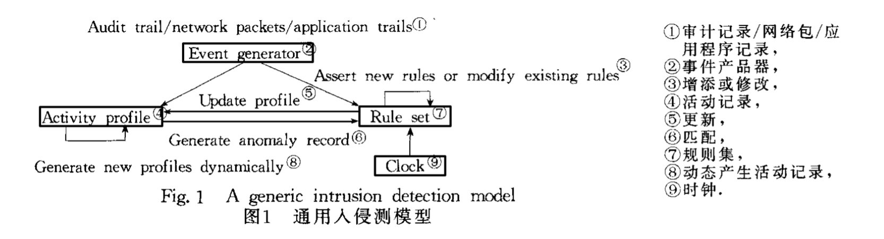

# 入侵检测

## 基本概念
入侵检测的作用在于：
- 识别入侵者
- 识别入侵行为
- 检测和监视已成功的渗透
- 为对抗入侵提供信息，阻止事件扩大

入侵检测主要有两类技术：
- 异常检测
- 误用检测

误用检测通过对已知的攻击行为进行分析，提取攻击特征，建立相应的攻击签名库，利用文件或者网络流量数据与攻击签名的匹配情况判断入侵行为; 而异常检测首先构建主机、用户或网络连接的正常行为描述，通过判断所检测到的行为是否偏离了正常行为模式，从而判断是否发生了入侵行为．

误用检测是发展最成熟、应用最广泛的技术。大部分商用的入侵检测系统主要采用基于误用的检测方法，并依靠不断提升规则库的完备性来提升检测的可靠性． 误用检测可以有效地检测已知的攻击行为，并且具有较高的准确率． 然而，由于误用检测的基础是已知的攻击签名和可获取的数据包载荷，因此，误用检测通常难以应对加密攻击
检测和零日攻击检测问题． 异常检测通过分析流量的行为模式来检测那些偏离正常行为的异常流量． 异常检测在已知攻击时的准确率不如误用检测，而且经常面临着高误报率的问题．

入侵检测技术最早由Dorothy Denning提出，大多ids都是基于此为开发的，模型示意如下图所示：

## 检测方法

### 特征选择

利用深度学习进行入侵检测时首先需要从原始网络数据中提取出流量的行为特征． 流量的行为特征通常指的是流级特征，即将网络数据按照源 IP、目的 IP、源端口、目的端口、协议聚合后提取的特征． 

这些特征通常可以分为：
- 统计特征
  - 例如：平均数据包大小，流量持续时间，每个流的字节数，每个流的数据包和均方根数据包大小等统计特征
- 时序特征
  - 包括数据包长度的序列、到达间隔时间序列和连续数据包的方向等，它在统计特征的基础上进一步体现了数据包之间时间上的关联性，时间序列特征对于原数据具有更准确的代表性，即使对于加密流量，前几个数据包( 最多 20 个数据包) 也已被证明足以达到一定的准确度，因此，时间序列特征被广泛应用于各种场景和数据集。
  - 网络入侵行为往往会持续一段时间，通过分析数据包在一段时间内的变化能更好地检测到入侵行为的发生，而循环神经网络恰好适合处理具有时间域特征的数据，可以通过训练好的神经网络模型提取出正常和异常网络流量具有区分度的时间依赖特征
- 协议特征
  - 如IP协议字段、TCP协议字段、应用层协议字段
- 有效载荷特征
  - 网络数据包基本的传输形式为二进制比特流，而灰度图的原始存储方式也为二进制比特流，在对网络流数据包协议的识别过程中，两者存在相似性，可将网络流数据包当作灰度图来进行处理． 利用成熟的卷积神经网络图像识别技术，避免了显式的特征提取，而隐式地从训练数据中进行深度学习，自动得到不同网络流量的特征模型，实现对异常流量的识别． 卷积神经网络可以通过局部感知和权值共享对原始流量有效载荷灰度图进行卷积，将异常流量信息的特征提取出来，再用池化操作对特征值进行降维，经多层提取，最终抽取出对应异常网络流量信息的多项抽象特征．
  - 对基于有效载荷特征的预处理流程大致分为流量切分、流量清理、统一长度和图片生成四个流程

### 模型选择

#### 多层感知机（MLP)

多层感知机( MLP) 是一种人工神经网络结构，可以用来解决分类和回归问题． MLP 由输入层、隐藏层、输出层三部分组成，在 MLP 中，层与层之间采用全连接的方式，即每层的神经元与上层的所有神经元都有联系且存在相应的连接权值．

MLP 可以通过对隐藏层数目和神经元个数的设计，实现对任意非线性函数的学习． 训练 MLP 的算法通常是 BP 算法( 反向传播算法) ，MLP 训练完成后，可以根据输入数据来判别它的所属类别．

MLP 原理简单，但在网络结构较大时往往性能较差，一方面是因为训练参数的增多，使得计算时间变长，同时容易陷入局部最小值导致得不到全局最优解; 另一方面是网络结构较大时会产生过拟合的情况，导致训练效果降低．
在网络入侵检测中，纯 MLP 难以得到良好的训练效果而很少使用． 但几层采用全连接方式的神经元( 可被视为 MLP) 可被用作其他模型的一小部分．

#### 卷积神经网络
卷积神经网络( CNN) 是人工神经网络的一种，主要包括卷积层和池化层两个模块． 

卷积层的作用是对输入层进行卷积，来提取更高层次的特征，池化层的作用是对卷积层得到的特征进行特征选择和过滤，减少数据处理量．

卷积神经网络具有良好的泛化能力，能够适用于多种分类任务，在模式识别、物体检测等方面具有良好的效果． 利用卷积神经网络建立模式分类器，能直接用于灰度图像的识别和分类． 在入侵检测和分类过程中，卷积神经网络的输入往往是流量数据图片化后的灰度图，通过将流量分类问题转变为图片分类来处理． 可以利用卷积神经网络提取流量的空间特征。

CNN 中获得的特征多是空间特征，可以与其他神经网络获得的特征结合起来，并用于异常流量检测． 如与 ＲNN 搭配使用，可以同时提取流量的时序特征和空间特征，更加准确地描述了流量的特点，对分类精度的提高有很大的
帮助．

例如，Lin 等［17］使用了一种基于 LeNet5 模型的 CNN 方法来进行网络入侵检测，实验结果表明，随着训练样本数目的增大，入侵检测的准确度会随之提高． 当样本数目超过 10 000 时，入侵检测的预测准确率达到 99。65% ，总体准确率为97.53% ． Naseer 等［18］使用不同的深度神经网络架构，包括 CNN、AE 和 ＲNN，来训练并构建入侵检测模型． 这些深度学习模型在 NSLKDD 训练数据集上进行训练，并在 NSLKDD 提供的两个测试数据集上进行评估． 发现 CNN 和 LSTM 模型在入侵检测中表现出卓越的性能，测试数据集的准确度分别为 85% 和 89% ． Blanco 等［19］ 利用遗传算法( GA) 优化 CNN 分类器，以找到更好的输入特征组合，不仅能实现正常流量和异常流量的分类，而且能对异常流量进一步细分，正常流量的检测准确度最高达到了 98. 14% ．

#### 循环神经网络
循环神经网络 RNN 是常规前馈神经网络的扩展，是一类用于处理序列数据的网络． 与常规的神经网络相比，循环神经网络通过在隐藏层的神经元中添加了自连接的权重值，使得每次的训练可以记录前面训练时输出值状态的信息，实现了保存前一个序列的信息的功能，成功地解决了序列数据预测问题．

RNN 主要提取的是流量的时序特征，可以通过 RNN 分别学习数据包和网络流两个层次上的特征，数据包层次，即 RNN 将一个数据包的字节序列作为输入，只针对每一个数据包进行特征学习，学习到每个数据包的特征信息，并输出每个数据包对应的特征向量． 网络流层次，即使用 RNN 在每个数据包特征向量的基础上进一步学习数据包之间的序列关系，最终得到一个流特征向量． 在入侵检测中，不仅可以使用两阶段的 ＲNN 先后提取数据包和网络流的时间特征，得到流特征向量，利用 Softmax 分类器进行分类． 也可以结合 CNN，通过 CNN 学习数据包内部的空间特征，再利用ＲNN 提取数据包间的时序特征，综合利用两种神经网络的特征，得到准确刻画网络行为的时空特征，并用于网络入侵检测． 此外，也可以将 ＲNN 和自动编码器结合，自动编码器用于网络流特征提取和维度压缩，ＲNN 处理网络流数据的序列信息，得到流数据的时间特征，两者结合起来，用于网络入侵检测．

#### 自动编码器
自动编码器( autoencoder) 是神经网络的一种，自动编码器( AE) 的作用是想尽可能的重构输入，使得隐藏层较低维度的神经元能够代替高维的输入层神经元，从而实现降维和特征提取的功能． 该网络可以看作由两部分组成: 一个由函数 h = f( x) 表示的编码器和一个重构解码器 r = g( h) ． 前一部分能将输入数据进行压缩，后一部分将压缩后的数据进行重构． 通过向自编码器强加一些约束，可以通过不同的约束条件构建不同的自动编
码器，通过训练不同的自编码器来获得数据不同类型的特征．