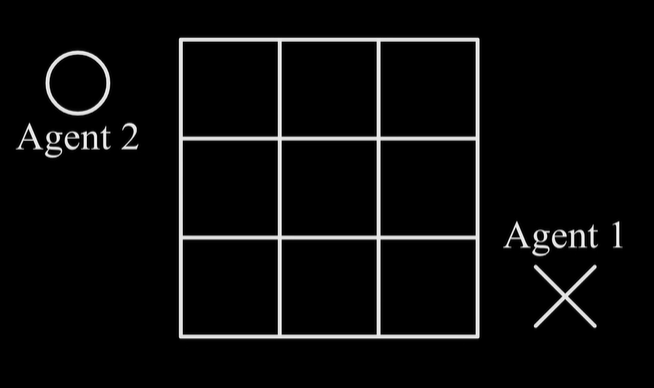
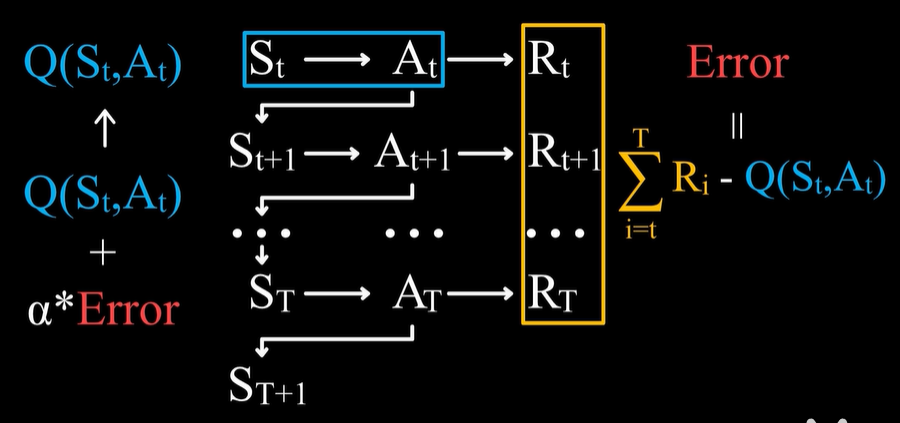
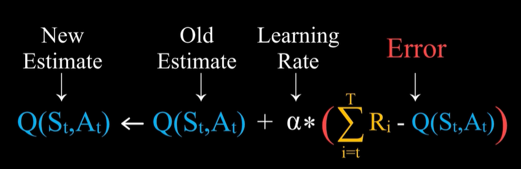

# 强化学习

强化学习-Reinforcement learning | RL

## 基本概念
### 什么是强化学习？

强化学习，是在与环境的互动当中为了达成一个目标而进行的学习过程。

强化学习算法的思路非常简单，以游戏为例，如果在游戏中采取某种策略可以取得较高的得分，那么就进一步“强化”这种策略，以期继续取得较好的结果。这种策略与日常生活中的各种“绩效奖励”非常类似。我们平时也常常用这样的策略来提高自己的游戏水平。

在 Flappy bird 这个游戏中，我们需要简单的点击操作来控制小鸟，躲过各种水管，飞的越远越好，因为飞的越远就能获得更高的积分奖励。

这就是一个典型的强化学习场景：

- 机器有一个明确的小鸟角色——代理
- 需要控制小鸟飞的更远——目标
- 整个游戏过程中需要躲避各种水管——环境
- 躲避水管的方法是让小鸟用力飞一下——行动
- 飞的越远，就会获得越多的积分——奖励

你会发现，强化学习和监督学习、无监督学习 最大的不同就是不需要大量的“数据喂养”。而是通过自己不停的尝试来学会某些技能。
### 强化学习的结构
#### 基本元素

- Agent：与环境进行互动的主体（玩家）
- Environment：环境
- Goal：希望达成的目标（长远结果）
  - Agent的Goal就是得到Award之和尽可能的大。

Agent在与Environment互动过程中，为达到一些Goal而进行的学习就是RL。
#### 主要元素

- 状态 State
  - Agent 和 Environment 会处于某种状态，状态含义很广泛，可以包含所有信息。

- 活动 Action
  - 某个 State 下，Agent 需要做成的行动就是action
- 奖励 Reward
  - Agent在特定state下，采取了某个action，得到的即使反馈（短期结果）。
  - 在强化学习中，reward通常是一个实数。奖励由最终的Goal决定。合理设置goal很重要。

State 和 Action 的往复就构成了强化学习的主体部分。

#### 核心元素
- Policy 策略
  - 在数学上就是一个函数，它的自变量或者说输入是一个state，输出是一个action。
  - 强化学习想要达成的，就是得到一个好的策略（函数）。
- Value 值
  - 也是一个函数，并且二策略函数就取决于价值函数。
  - 价值函数通常有两种：
    - 一state value 状态价值函数，它的输入是一个状态，而输出是一个实数；这个实数就是这个状态的价值。价值的概念很重要，它指的是预期将来会得到的所有奖励之和。也即处在当前state下，agent 将来能够得到的所有奖励的一个期望值。通过特定action，agent才能达成 reward之和尽可能大的goal。
    - 二 state-action value 状态行动价值函数，它指的不只是一个状态所对应的价值，而是在特定状态下，采取某种行动所具有的价值。同样价值指的是在将来能够得到的所有奖励的一个期望值。根据状态行动价值函数，agent应当选择价值最大的哪个行动。


强化学习所要学习的，就是得到一个好的价值函数，而好的价值函数决定了一个好的策略函数。

当然有一部分算法可以不依赖于价值，直接学习策略。

### 强化学习的特点

- Trial and Error 试错：强化学习是一种试错学习，即在不断的尝试中去学习。
- Delayed Reward 延迟奖励：Agent采取的action，得到的reward基本都是0，直到最后胜利（达到goal）reward才为正值（例如1），也即Action 没有对应即时的reward，但每一步棋都对最后的胜利有贡献。换句话说，一个action可能reward=0，但其value不为0。

在实际得到奖励之后，之前所采取的action都对这个奖励有贡献，那么如何计算过去的action的价值，这就涉及到 Credit Assignment 和 Backpropagation，简言之“复盘”。

### 核心问题：Exploration（探索） vs Exploitation（利用）

Exploitation（利用），利用的是强化学习所学习到的价值函数。要利用已经学习到的价值函数。

此外还要尝试不同的action，优化我们的价值函数，即Exploration（探索）。

Exploration（探索） vs Exploitation（利用）之间的权衡，是强化学习的核心问题。

## 算法

### Multi-armed bandit 算法

老虎机：拉动一个把手臂，就会运转得到一个结果，根据结果给一定的奖励。多臂老虎机意味着有多个把手臂，你可选择任意一个，或者说有多个老虎机供你任意选择。

总而言之，你Agent 可采取多种 Action，对应的 reward 可能有所不同。强化学习的Goal 就是经过学习得到一个好的策略，最大化奖励。

分析这个问题：
- Agent：玩家
- Environment：老虎机，假设有左右两个
- State：只有一个状态，中奖概率
- Delayed Reward 问题：不存在
- Action：
- Reward：即时得到。
- Value：使用state-action value 状态行动价值，这里的状态指的是行动所具有的价值是与所处的状态有关系的。由于老虎机这里只有1个状态，所以可简化为action value，这就是最简单的函数了，只有一个自变量，即行动，一个因变量，即价值。

奖励的机制，可以认为这个奖励是一个服从一定概率分布的随机变量。两台老虎机对应的概率分布可能是不同的，但这两个概率分布是固定的，不会改变，这就是所谓的一个状态。

目标是赢钱，也即选择特定概率分布下期望值最大的那个策略（行动方案）。但是不知道概率分布，所以要学习行动的价值。

在这个问题中，我们可以定义一个行动所具有的价值，为对应奖励的期望值。定义“选择左边老虎机”这个行动的价值为q(L),“选择右边老虎机”这个行动的价值为q(R)，假设左边老虎机服从$x_L \sim N(500,50^2)$,右边老虎机服从$x_R \sim N(550,100^2)$，显然选用右边最合适。但玩家事前不知道。

假设行动价值的估计值为Q，初始值为0。然后怎样学习？就是去尝试，用各次尝试获得奖励的平均值作为期望值的估计。因此我们有下面这个行动价值的表达式：

t时刻行动a价值的估计=选择行动a获得奖励之和，除以选择这个行动的次数，即平均值：
$Q_t(a) = \frac{\sum_{i=1}^{t-1}R_i^*1(A_i =a)}{\sum_{i=1}^{t-1}1(A_i=a)}, a=[L , R]$

上述方法称为sample-average样本平均。

上面有了价值函数，那么可以确定策略函数，即根据样本均值较大的那个确定策略：

$A_t = argmax_aQ_t(a)$

即选择价值函数最大的那个行动，即拉右边的臂。

如果有多个行动都可以得到价值最大，那么就随机选择一个。这个算法就称为Greedy贪婪。实际上就是一个Exploration。

为了避免只选一次，或各随机选一次不够公平的问题，所以要改进为$\epsilon $ greedy，即在大多数情况下做出贪婪选择，而在一定概率$\epsilon $  下做成随机选择。这样就能保证每个行动都能得到一定的探索，即使状态会发生变化也可以有一定随机性，使得某些行动不会产生先入为主的价值。

当然$\epsilon $ 的选择并不是唯一的，根据不同的问题它的最优值不同，且还可根据时间而变化。它还可以与其它方法结合。

例如：$\epsilon=0.1 Q_0(a)=998, a \in [L,R]$


老虎机实际过程
- 假设有左、右两台老虎机，玩一次老虎机花1355元，不妨设$Q_L = Q_R = 1355$
- 游戏开始
- 算法首先随机选择左、右，假设选到了右边，即$Action_1 = Right$,而执行得到奖励$Reward_1=232$，所以右边老虎机的价值更新为$Q_L = \frac{1355+232}{2} \simeq 794$。
- 此时，左边的价值$Q_L =1355 > Q_R  = 794$，那么算法会选择拨动左边，即$Action_2 = Left$，得到$Reward_2=1014$，所以更新$Q_L =\frac{1355+1014}{2}\simeq 1185$
- 继续选左边，$Action_3 = Left$，得到$Reward_3=744$，所以更新$Q_L =\frac{1355+1014+744}{3}\simeq 1038$
- 继续选左边，$Action_4 = Left$，得到$Reward_4=563$，所以更新$Q_L =\frac{1355+1014+744+563}{4}\simeq 919$
- 继续选左边，$Action_5 = Left$，得到$Reward_5=0$，所以更新$Q_L =\frac{1355+1014+744+563+0}{5}\simeq 735$
- $Q_L < Q_R$，选择右边老虎机，$Action_6 = Right$，得到$Reward_6=0$，所以更新$Q_R =\frac{1355+232+0}{3}\simeq 529$
- $Q_L > Q_R$，$Action_7 = Left$，得到$Reward_7=489$，所以更新$Q_L =\frac{1355+1014+744+563+0+489}{6}\simeq 694$
- $Q_L > Q_R$，$Action_8 = Left$，得到$Reward_8=647$，所以更新$Q_L =\frac{1355+1014+744+563+0+489+647}{7}\simeq 687$
- $Q_L > Q_R$，$Action_9 = Left$，得到$Reward_9=0$，所以更新$Q_L =\frac{1355+1014+744+563+0+489+647+0}{8}\simeq 601$
- $Q_L > Q_R$，$Action_10 = Left$，得到$Reward_10=856$，所以更新$Q_L =\frac{1355+1014+744+563+0+489+647+0+856}{9}\simeq 630$
- $Q_L > Q_R$，$Action_11 = Left$，得到$Reward_11=0$，所以更新$Q_L =\frac{1355+1014+744+563+0+489+647+0+856+0}{10}\simeq 566$
- $Q_L > Q_R$，$Action_12 = Left$，得到$Reward_12=0$，所以更新$Q_L =\frac{1355+1014+744+563+0+489+647+0+856+0+0}{11}\simeq 516$
- $Q_L < Q_R$，选择右边老虎机，$Action_13 = Right$，得到$Reward_13=201 $，所以更新$Q_R =\frac{1355+232+0+201}{4}\simeq 447$
- $Q_L > Q_R$，$Action_13 = Left$，得到$Reward_13=1$，所以更新$Q_L =\frac{1355+1014+744+563+0+489+647+0+856+0+0+1}{12}\simeq 486$
- $Q_L > Q_R$，$Action_14 = Left$，得到$Reward_14=201$，所以更新$Q_L =\frac{1355+1014+744+563+0+489+647+0+856+0+0+1+201}{12}\simeq 472$
- ...

#### 小结

解决 Multi-armed bandit 问题的简单方法 $\epsilon - Greedy$ 策略，虽然简单，但他解决了一个强化学习的核心问题：**Exploration vs Exploitation 问题** 

$\epsilon =0.1$作为学习率，保持了较小的 Exploration尝试和较大的利用已有经验。


### Error 误差

为了简单，我们暂考虑仅有一个状态，且没有延迟奖励情况。Sample Average样本平均进行估计价值的方法为： 

$Q_{n+1} = \frac{1}{n}\sum_{i=1}^nR_i$

$Q_1$ 表示某个行动价值的初始值。$Q_{n+1}$表示采取某个行动n次后，n次奖励的平均值。

$Q_{n+1} = \frac{1}{n}\sum_{i=1}^nR_i = \frac{R_1+ R_2 + ... + R_{n-1}}{n} + \frac{1}{n}R_{n} = \frac{n-1}{n} Q_n + \frac{1}{n}R_n = Q_n + \frac{1}{n}(R_n - Q_n)$

Q的含义是获得奖励的估计值，上式显示了old 和 new Estimate 的区别。$Q_n$是在采取第n次行动前，估计会得到$Q_n$的奖励，即$Q_n$是对于$R_n$的一个预测。采取第n次行动后，实际得到的奖励是$R_n$。所以$R_n - Q_n$ 是实际值和预测值的一个误差，即奖励预测误差（Reward Prediction Error）。

Error的存在说明预测不准确，所以需要一个新的预测值即$Q_{n+1} $, $\frac{1}{n}$ 称为步长或学习率。

强化学习的一个非常重要的原理——基于Error来学习。Sample Average样本平均学习法也可以认为是步长为1/n的误差学习法。

学习率$\frac{1}{n}$ ，随着n的增大，Error会越来越小，这与实际情况可能相悖，我们用$\alpha$替代$\frac{1}{n}$ ，得到下列公式：

$Q_{n+1} = Q_n + \alpha (R_n - Q_n) = (1-\alpha)Q_n + \alpha R_n = (1-\alpha)^nQ_1 +\sum_{i=1}^n \alpha(1-\alpha)^{n-i} R_i$

这个公式就是加权平均，它显示Q已经不是算术平均值，而是奖励的加权和，越早的奖励对Q的影响越小，更加看重最近的奖励。

在算术平均中，价值初始值$Q_1$对后续是没有影响的；而加权平均中，价值的初始值对后续是有影响的。

上一节老虎机游戏中使用的算术平均其实是加入了$Q_1$的折衷算法。

### 简单多状态且有延迟奖励的强化学习

我们使用 $\epsilon-Greedy$策略和基于误差的学习法来完成一个井字棋的小游戏(tie tac toe)。



#### 价值公式推导

这个游戏虽然简单，但存在多状态、有延迟奖励、行动会对将来的状态变化和得到的奖励产生影响，是一个完整的强化学习问题。

上一部分得到的公式： $Q_{n+1} = Q_n + \frac{1}{n}(R_n - Q_n)$ 是一个行动价值公式，适用于仅有1个状态，且没有延迟奖励的情况。


需要将上面的公式推广到状态价值或状态行动价值公式，

如下图所示：



$S_t \rightarrow A_t \rightarrow R_t$是初始的状态、行动和奖励；假设到$S_{T+1}$状态游戏结束（井字棋中就是三个同样的符号连成一条线）。

旧的价值函数为$Q(S_t,A_t)$，价值函数更新为:

$Q(S_t,A_t) \leftarrow Q(S_t,A_t)+\alpha* Error $


关键在于定义Error。由于价值为所有奖励的和，所以所有真实奖励之和$\sum_{i=t}^T R_i$与估计值$Q(S_t,A_t)$的差值就是Error，所以有了下面的状态行动价值的表示方法：



在此基础上，注意到从t时刻开始，直到游戏结束所获得的奖励之和$\sum_{i=t}^T R_i$，等于：

$\sum_{i=t}^T R_i = R_t +\sum_{i=t+1}^T R_i $ 

$\sum_{i=t+1}^T R_i $ 这一项可以用估计值
$Q(S_{t+1} , A_{t+1})$替换，得到：

$\sum_{i=t}^T R_i = R_t + \sum_{i=t+1}^T R_i \simeq R_t + Q(S_{t+1} , A_{t+1})$ 

这样，不需要等到游戏结束就可以计算$Q(S_t,A_t)$的新估计值。

- $Q(S_t,A_t) \leftarrow  Q(S_t,A_t)+ \alpha * (\sum_{i=t}^T R_i - Q(S_t,A_t))$ 
  - 事实上这个公式是是Monte carlo methods的雏形。

-  $Q(S_t,A_t) \leftarrow  Q(S_t,A_t)+ \alpha * (R_t + Q(S_{t+1} , A_{t+1})-Q(S_t,A_t))$  
   -  这个公式是Temporal-Difference learning 时序差分学习法的雏形。

等价地，还可以写出状态-价值的公式：

- $Q(S_t) \leftarrow Q(S_t)+ \alpha *(\sum_{i=t}^T R_i -Q(S_t))$

- $Q(S_t) \leftarrow Q(S_t)+ \alpha *(R_t + Q(S_{t+1}) - Q(S_t))$

我们可以简单的从基于误差来学习这一原理出发得到上面的2个状态-行动价值公式和2个状态-价值公式，再加上$\epsilon-greedy$策略，就可以实现井字棋。

#### 玩家状态的确定
下面我们可以去学习状态-价值函数，选择的行动就是能够使我们进入价值最高的状态的那个。这里有一个问题：即玩家进入什么状态，不仅仅由玩家自己的行动决定，还取决于对手的行动。如果依据价值来选择下一步行动，那么需要先对对手的行动有一个预测。这个问题较为复杂。

由于根据价值决策行动进入哪个更高价值的状态，也就是计算状态-行动价值，所以我们不妨直接学习状态-行动价值函数。这里又有一个问题：状态的数量相对来说较少，而(状态，行动)对的数量就很多，是否能够学习一种能够直接指导行动，数量又比较少的价值呢？

在棋牌类游戏中，常常是有的。

引入一个新的概念: **后果（Outcome 或 Afterstate）**，在玩家采取了一个行动之后，直接的效应是一个后果。例如：玩家落子之后棋盘上的分布情况。

我们并不把"玩家落子之后棋盘上的分布情况"称为状态，因为在强化学习中，状态和玩家做成行动是一体的。玩家要考虑在什么状态下做出什么行动。所以为了避免混淆，行动的直接后果被称之为 Afterstate 而不是 state。可以理解为玩家行动的后果，对于对手来说是一种状态，因为对手需要执行动作，反过来也类似。

后果概念对于这个游戏的意义在于，不同的(状态，行动)对导致的后果可能是一样的。如果后果一致，那么不同的(状态，行动)对的价值也应该一样。所以，只需要去学习后果的价值，而用到的学习公式和状态价值或者状态-行动价值是完全相同的。

注意：后果这一概念，并不对所有强化学习问题适用。状态价值、状态-行动价值才是强化学习的核心对象。后果价值，本质上还是状态-行动价值。一个后果与特定的状态-行动是对应的。

由于井字棋中(状态，行动)对存在一定的冗余，使用后果是为了简化提高学习效率。

#### 实际代码

```python
import numpy as np

class Agent():
    def __init__(self,OOXX_index,Epsilon=0.1,learningrate=0.1):
        self.value = np.zeros((3,3,3,3,3,3,3,3,3))# 初始化value
        self.currentState = np.zeros(9)
        self.previousState = np.zeros(9)
        self.index = OOXX_index
        self.epsilon = Epsilon
        self.alpha = learningrate
    
    def reset(self):
        ""
        self.currentState = np.zeros(9)
        self.previousState = np.zeros(9)
    
    def actionTake(self,State):
        state = State.copy()
        available = np.where(state==0)[0] #找到state中为0的第一个，将其确定为下一步可落子处。
        length = len(available)
        if length == 0:
            return state
        else:
            random = np.random.uniform(0,1)
            if random < self.epsilon:
                choose = np.random.randint(length)
                state(available[choose]) = self.index
            else:
                tempValue = np.zeros(length)
                for i in range(length):
                    tempValue = state.copy()
                    tempValue[available[i]] = self.index
                    tempValue[i] = self.value[tuple(tempState.astype(int))]
                choose = np.where(tempValue == np.max(tempValue))[0]
                chooseIndex = np.random.randint(len(choose))
                state[available[choose[chooseIndex]]] = self.index
        return state
    
    def valueUpdate(self,State):
        self.currentState = State.copy()
        self.value[tuple(self.previousState.astype(int))] += \
            self.alpha*(self.value[tuple(self.currentState.astype(int))]- \
                self.value[tuple(self.previousState.astype(int))])
        self.previousState = self.currentState.copy()

```


### Finite Markov Decision Process

### Dynamic Programming

### Monte Carlo Methods

### Temporal-Difference learning
