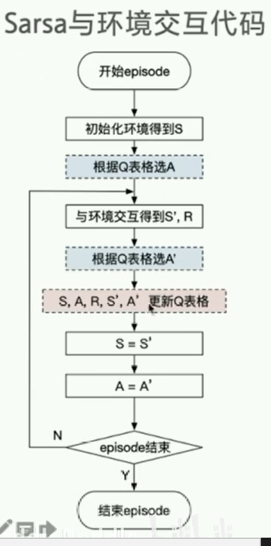

# 强化学习 2 算法库与实验环境

>参考：https://www.paddlepaddle.org.cn/documentation/docs/zh/guides/index_cn.html
>课程：https://www.bilibili.com/video/BV1yv411i7xd?from=search&seid=6867937450781058913

强化学习，是使机器像人一样学习。有的是在已知环境下，这需要规划；有的是在未知的已知环境，这需要探索与试错。


- 经典书籍：《Reinforcement Learning ： An Introduction》强化学习导论
- 视频： 2015 David Silver 经典强化学习公开课 UC Berkeley CS285，斯坦福US234
- 经典论文：
  - DQN: Playing atari with deep reinforcement learning
  - A3C: Asynchronous methods for deep reinforcement learning
  - DDPG: Gontinuous control with deep reinforcement learning 
  - PPO : Proximal policy optimization algorithms
- 前言方向：
  - Model-based RL
  - Herarchical RL
  - Multi Agent RL
  - Meta Learning

强化学习得3个过程：
- learning & planning
- Exploration & Exploitation
- Predict & control

按照学习目标两种Agent学习方案：
- 基于价值的方案 Value-based
  - 通常为确定性策略：算法有Sara，Q-Learning，DQN
- 基于策略的方案 policy-based，每一步都是一个概率
  - 通常为随机性策略：算法有 Policy gradient

按照学习方案可分为：
- on-Policy ：sarsa
  - 目标策略和行为策略是同一个策略
- off-Policy: Q-learning


强化学习的分类：
- 基于模型
  - 动态规划
- 无模型（Model-free）
  - 基于价值
    - on-Policy ：sara
    - off-Policy: Q-learning
  - 基于策略
    - policy gradient —— Actor-Critic —— DDPG 和 A3C 
    - TRPO —— PPO

## 算法库 与 编程环境


编程实践平台：[GYM](https://gym.openai.com) 是一个仿真平台，python 开源库、RL 测试平台。

离散控制场景，一般使用atari环境评估

连续控制场景：一般使用mujoco环境游戏来评估


### gym

gym的核心接口时environment。提供一下几个核心方法：
- reset()：重置环境状态，回到初始环境。
- step(action)：推进一个时间步长，返回4个值：
  - observation(object): 对环境的一次观测
  - reward (float): 奖励
  - done（boolean）：代表是否需要重置环境
  - info(dict): 用于调试的诊断信息。
- render()：重绘环境的一帧图像


### parl  
[parl](https://github.com/PaddlePaddle/PARL) 是一个高性能强化学习框架.


#### 安装
```BASH
python -m pip install paddlepaddle==2.0.0 -i https://mirror.baidu.com/pypi/simple
pip install parl==1.3.1
pip install gym
git clone --depth=1 https://github.com/PaddlePaddle/PARL.git
cd PARL/examples/QuickStart

#或
git clone https://github.com/PaddlePaddle/PARL
python train.py
```
### 小结


## MDP Q表格

### 强化学习MDP四元组 <s,a,p,r>
s: state
a: action
r: reward R函数 $r[s_t,a_t]$
p: 状态转移概率，符合morkov决概率 概率函数 $p[S_{t+1,r_t| s_t,a_t}]$

### Q表格
状态-动作价值的表格。类似生活手册。

## Sarsa

经典算法Sarsa：

### Sarsa(on-policy TD control) for estimating $Q \simeq q$

算法参数：step size $\alpha \in (0,1] ,small \ \epsilon >0$

初始化 $Q(s,a), for all s \in \mathit S^+ , a \in \mathit A(s), 除Q(terminal,\cdot)=0外的任意值$

```
Loop for each episode:
  初始化 S
  使用由Q值确定（例如 epsilon-greedy）的策略，从 S 选择 A
  Loop for each step of episode:
    执行 A，计算 R，下一个状态S'
    使用由Q值确定（例如 epsilon-greedy）的策略，从 S' 选择 A'
    #默认A'为最优策略选中的动作
    Q(S,A) = Q(S,A) + alpha*[R + gamma * max_a Q(S',A') - Q(S,A)] 
    S = S'; A = A';
  直到 S 为最终状态。
```


$Q(S_t,A_t) \leftarrow  Q(S_t,A_t)+ \alpha * (R_t + \gamma Q(S_{t+1} , A_{t+1})-Q(S_t,A_t))$  

初始化：
- 初始化 
  - S1：reset()
  - A1：根据Q表格选择动作（$\epsilon - greedy$）
- 下一step：
  - S2，R2：观察得到；
  - A2：根据Q表格选择动作（$\epsilon - greedy$）
    - 学习：$Q(S_2,A_2) \leftarrow  Q(S_1,A_1)+ \alpha * (R_1 + \gamma Q(S_{2} , A_{2})-Q(S_1,A_1))$  
- 下一步...


### 实现

```python
# 重置环境，重开一局 observation 即 state
obs = env.reset() 
# 根据算法（Q值）选择一个动作
action = agent.sample(obs)

while True:
  # 与环江进行一个交互
  next_obs,reward,done,_=env.step(action)
  # 根据算法选择一个动作
  next_action = agent.sample(next_obs)

  # 训练Sarsa 算法，即更新Q表格，参数为(St,At,Rt+1,St+1,At+1)
  agent.learn(obs,action,reward,next_obs,next_action,done) 
  action = next_action
  # 存储上一个状态
  obs = next_obs
```

注意，agent.learn中的输入要求先获得next_action，这与Q-Learning 不同。

上面代码中的一些函数定义如下：
Sarsa Agent 根据Q表格选动作:

```python
class SarsaAgent(object):
  def __init__(self,obs_n,act_n,learning_rate=0.01,gamma=0.9,e_greed=0.1):
    self.act_n = act_n #动作维度，有几个动作可选
    self.lr = learning_rate # 学习率
    self.gamma = gamma #reward的衰减率
    self.epsilon = e_greed #按一定概率随机选动作
    self.Q = np.zeros((obs_n,act_n))# state-action-value Q表格
  
  # 根据输入观察值，采样输出的动作值，带探索
  def sample(self,obs):
    if np.random.uniform(0,1) < (1.0 -self.epsilon):
      # exploit: 根据Q table 的Q值选动作
      action = self.predict(obs)
    else:
      # explore: 有一定概率随机探索选取一个动作
      action = np.random.choice(self,act_n) 
    return action
  
  # 根据输入观察值（状态），预测输出的动作值
  def predict(self,obs):
    Q_list = self.Q[obs,:]
    maxQ = np.max(Q_list)
    # maxQ可能对应多个action
    action_list = np.where(Q_list == maxQ)[0]
    action = np.random.choice(action_list)
    return action
  
  # 学习方法，即更新Q值得方法
  def learn(self,obs,action,reward,next_obs,next_action,done):
    """on-policy
       obs: 交互前的obs，即s_t
       action: 本次交互选择的action，a_t
       reward: 本次动作获得的奖励 r
       next_obs：本次交互后的obs，即s_t+1
       next_action: 根据当前Q表格，针对next_obs 会选择的动作 a_t+1
       done: episode 是否结束
    """
    predict_Q  =self.Q[obs,action]
    if done:
      target_Q = reward #结束了，没有更多状态
    else:
      target_Q = reward + self.gamma * self.Q[next_obs,next_action] #Sarsa Value更新
    self.Q[obs,action] += self.lr*(target_Q - predict_Q) #修正Q值
```

上面sample函数中，$\epsilon-Greedy$：

$$
\begin{cases}
argmax_a Q(a) , 概率(1-\epsilon) \\
随机选择一个行动, 概率 \epsilon
\end{cases}
$$

下面我们将使用 Sarsa 算法的 Agent 与环境交互，每个step都learn一下：



```python
def run_episode(env, agent, render=False):
  total_steps = 0 # 记录每个episode走了多少step
  total_reward = 0

  obs = env.reset() # 重置环境
  action = agent.sample(obs) #根据算法选择一个动作

  while True:
    next_obs,reward,done,_ = env.step(action)# 与环境进行一个交互
    next_action = agent.sample(next_obs)#根据算法选择一个动作
    agent.learn(obs,action,reward,next_obs,next_action,done)

    action = next_action
    obs = next_obs
    total_reward += reward
    total_steps += 1
    if render:
      env.render()#渲染一帧图形
    if done:
      break
  return total_reward,total_steps

```

### 完整代码

```python
"""Sarsa Agrithom"""
import gym
from gridworld import CliffWalkingWapper
from agent import SarsaAgent

class SarsaAgent(object):
  def __init__(self,obs_n,act_n,learning_rate=0.01,gamma=0.9,e_greed=0.1):
    self.act_n = act_n #动作维度，有几个动作可选
    self.lr = learning_rate # 学习率
    self.gamma = gamma #reward的衰减率
    self.epsilon = e_greed #按一定概率随机选动作
    self.Q = np.zeros((obs_n,act_n))# state-action-value Q表格
  
  # 根据输入观察值，采样输出的动作值，带探索
  def sample(self,obs):
    if np.random.uniform(0,1) < (1.0 -self.epsilon):
      # exploit: 根据Q table 的Q值选动作
      action = self.predict(obs)
    else:
      # explore: 有一定概率随机探索选取一个动作
      action = np.random.choice(self,act_n) 
    return action
  
  # 根据输入观察值（状态），预测输出的动作值
  def predict(self,obs):
    Q_list = self.Q[obs,:]
    maxQ = np.max(Q_list)
    # maxQ可能对应多个action
    action_list = np.where(Q_list == maxQ)[0]
    action = np.random.choice(action_list)
    return action
  
  # 学习方法，即更新Q值得方法
  def learn(self,obs,action,reward,next_obs,next_action,done):
    """on-policy
       obs: 交互前的obs，即s_t
       action: 本次交互选择的action，a_t
       reward: 本次动作获得的奖励 r
       next_obs：本次交互后的obs，即s_t+1
       next_action: 根据当前Q表格，针对next_obs 会选择的动作 a_t+1
       done: episode 是否结束
    """
    predict_Q  =self.Q[obs,action]
    if done:
      target_Q = reward #结束了，没有更多状态
    else:
      target_Q = reward + self.gamma * self.Q[next_obs,next_action] #Sarsa Value更新
    self.Q[obs,action] += self.lr*(target_Q - predict_Q) #修正Q值

def test_episode(env,agent):
  total_reward = 0
  obs = env.reset()
  while True:
    action = agent.predict(obs)
    next_obs,reward,done,_ = env.step(action)
    total_reward += reward
    obs = next_obs
    time.sleep(0.5)
    env.render()
    if done:
      print("test reward = %.1f" % (total_reward))
      break

def main():
  env = gym.make("CliffWalking-v0")#0 up, 1 down ,3 left,4 right
  env = CliffWalkingWapper(env)

  agent = SarsaAgent(obs_n = env.observation_space.n,
      act_n = env.action_space.n,
      learning_rate = 0.1,
      gamma=0.9,
      e_greed=0.1)
  
  is_render = False
  for episode in range(500):
    ep_reward,ep_steps = run_episode(env,agent,is_render)
    print("Episode %s : steps = %s, reward = %.1f" % (episode,ep_steps,ep_reward))

    # 每 20 个 episode 渲染一下效果
    if episode % 20 == 0:
      is_render = True
    else:
      is_render = False
  #训练结束，查看算法效果
  test_episode(env,agent)

```

## Q-learning

上面的Sarsa算法是一种on-policy算法，它通过学习，不断修正价值函数值，达到优化指导行动的策略；on-policy算法通常只有一个指导行动的策略，这个策略也是最终要实现的目标策略。

on-policy的策略通常只有一个，它既是选取action的behavior策略，也是最终要实现的target目标策略。
- 优化价值时，它使用下一步行动来修正价值

off-policy的策略有两个：target 策略 和 behavior 策略
- behavior策略可能执行任何可能的行动，用于探索环境，结果会送给target 策略去优化。
- target 策略是最终目标策略。

### Q-learning(off-policy TD control) for estimating $\pi \simeq \pi$ 算法描述

算法参数：step size $\alpha \in (0,1] ,small \ \epsilon >0$

初始化 $Q(s,a), for all s \in \mathit S^+ , a \in \mathit A(s), 除Q(terminal,\cdot)=0外的任意值$

```
Loop for each episode:
  初始化 S
  Loop for each step of episode:
    使用由Q值确定（例如 epsilon-greedy）的策略，从 S 选择 A
    执行 A，计算 R，下一个状态S'
    #默认A'为最优策略选中的动作
    Q(S,A) = Q(S,A) + alpha*[R + gamma * max_a Q(S',a) - Q(S,A)] 
    S = S'
  直到 S 为最终状态。
```

可以看到sarsa在更新Q值时，使用了下一步必将执行行动和下一个状态来计算，即$Q(S_t,A_t) \leftarrow Q(S_t,A_t) + \alpha [R + \gamma Q(S_{t+1},A_{t+1}) - Q(S,A)]$；

而在Q-learning算法在更新Q值时，使用了target policy确定的行动$A_{t+1}^*$和执行后会形成的状态$S_{t+1}$，作为下一步Q值的估计值.注意：off-policy 算法中$A_{t+1}^*$并不一定执行，因为真实行动$A_{t+1}$由另一函数（执行策略）确定，即$Q(S_t,A_t) \leftarrow Q(S_t,A_t) + \alpha [R + \gamma max_a Q(S_{t+1},A_{t+1}^*) - Q(S,A)]$

Q-learning 在尝试时会比较大胆。

### 完整代码

```python
"""Q-learning Agrithom"""
import gym
from gridworld import CliffWalkingWapper
from agent import SarsaAgent

class QLearningAgent(object):
  def __init__(self,obs_n,act_n,learning_rate=0.01,gamma=0.9,e_greed=0.1):
    self.act_n = act_n #动作维度，有几个动作可选
    self.lr = learning_rate # 学习率
    self.gamma = gamma #reward的衰减率
    self.epsilon = e_greed #按一定概率随机选动作
    self.Q = np.zeros((obs_n,act_n))# state-action-value Q表格
  
  # 根据输入观察值，采样输出的动作值，带探索
  def sample(self,obs):
    if np.random.uniform(0,1) < (1.0 -self.epsilon):
      # exploit: 根据Q table 的Q值选动作
      action = self.predict(obs)
    else:
      # explore: 有一定概率随机探索选取一个动作
      action = np.random.choice(self,act_n) 
    return action
  
  # 根据输入观察值（状态），预测输出的动作值
  def predict(self,obs):
    Q_list = self.Q[obs,:]
    maxQ = np.max(Q_list)
    # maxQ可能对应多个action
    action_list = np.where(Q_list == maxQ)[0]
    action = np.random.choice(action_list)
    return action
  
  # 学习方法，即更新Q值得方法
  def learn(self,obs,action,reward,next_obs,next_action,done):
    """on-policy
       obs: 交互前的obs，即s_t
       action: 本次交互选择的action，a_t
       reward: 本次动作获得的奖励 r
       next_obs：本次交互后的obs，即s_t+1
       next_action: 根据当前Q表格，针对next_obs 会选择的动作 a_t+1
       done: episode 是否结束
    """
    predict_Q  =self.Q[obs,action]
    if done:
      target_Q = reward #结束了，没有更多状态
    else:
      ###这里时 Sarsa 与 QLearning 的区别所在
      target_Q = reward + self.gamma * np.max(self.Q[next_obs,:]) #QLearning Value更新
    self.Q[obs,action] += self.lr*(target_Q - predict_Q) #修正Q值

def test_episode(env,agent):
  total_reward = 0
  obs = env.reset()
  while True:
    action = agent.predict(obs)
    next_obs,reward,done,_ = env.step(action)
    total_reward += reward
    obs = next_obs
    time.sleep(0.5)
    env.render()
    if done:
      print("test reward = %.1f" % (total_reward))
      break

def main():
  env = gym.make("CliffWalking-v0")#0 up, 1 down ,3 left,4 right
  env = CliffWalkingWapper(env)

  agent = QLearningAgent(obs_n = env.observation_space.n,
      act_n = env.action_space.n,
      learning_rate = 0.1,
      gamma=0.9,
      e_greed=0.1)
  
  is_render = False
  for episode in range(500):
    ep_reward,ep_steps = run_episode(env,agent,is_render)
    print("Episode %s : steps = %s, reward = %.1f" % (episode,ep_steps,ep_reward))

    # 每 20 个 episode 渲染一下效果
    if episode % 20 == 0:
      is_render = True
    else:
      is_render = False
  #训练结束，查看算法效果
  test_episode(env,agent)

```

测试时，我们会发现，同样500轮训练后，Q-Learning的效果较Sarsa好。


### Reward 的衰减因子 $\gamma$

$G_t = R_{t+1} + \gamma R_{t+2} + \gamma^2 R_{t+3} + \dots = \sum_{k=0} ^{\infin} \gamma^k R_{t+k+1}$

变化可得：$G_t = R_{t+1} + \gamma G_{t+1}$

假设达成最终Goal的总收益G=0，那么假设最少需要进行13步，那么走到各步时的当前总收益可递推:

令$\gamma = 0.6$

$G_{13}=0$
$G_{12}=R + \gamma G_{13} = -1 +0.6*0=-1$
$G_{11}=R + \gamma G_{12} = -1 +0.6*0=-1.6$
$G_{10}=R + \gamma G_{11} = -1 +0.6*0=-1.96$
...
...

####  $\gamma > 1$ 可以么?
Reward （回报）的定义是对无限个未知收益子项求和，0 < y < 1 可以使得这个回报仍然是有限的，如果 $\gamma > 1$，那么这个回报可能就无限大，训练无法收敛。 

### 小结

On-policy VS Off-policy：

On-policy ：
- 使用策略$\pi$学习，使用$\pi$与环境交互，产生经验。
- 由于兼顾探索，所以策略$\pi$ 并不稳定。
- 从某种角度上看，策略较为保守，"远离威胁，远离负面"

Off-policy：
- 目标策略：$\pi$，用于学习最优策略
- 行为策略：$\mu$，用于探索，与环境交互产生经验轨迹。
- 从某种角度上看，策略较为激进，"越是危险，越可能收益最大"

