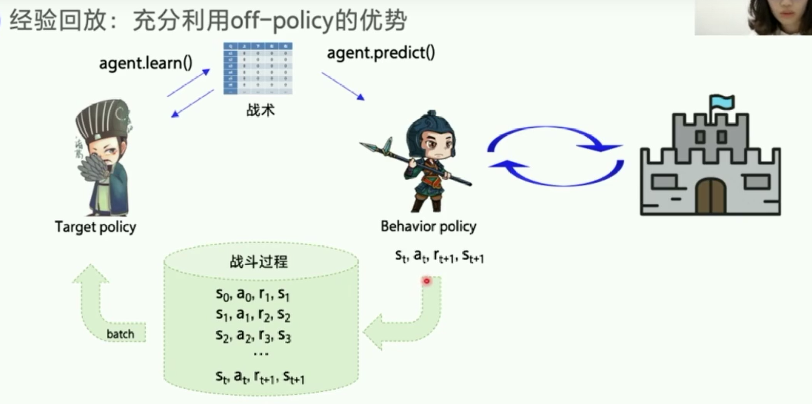
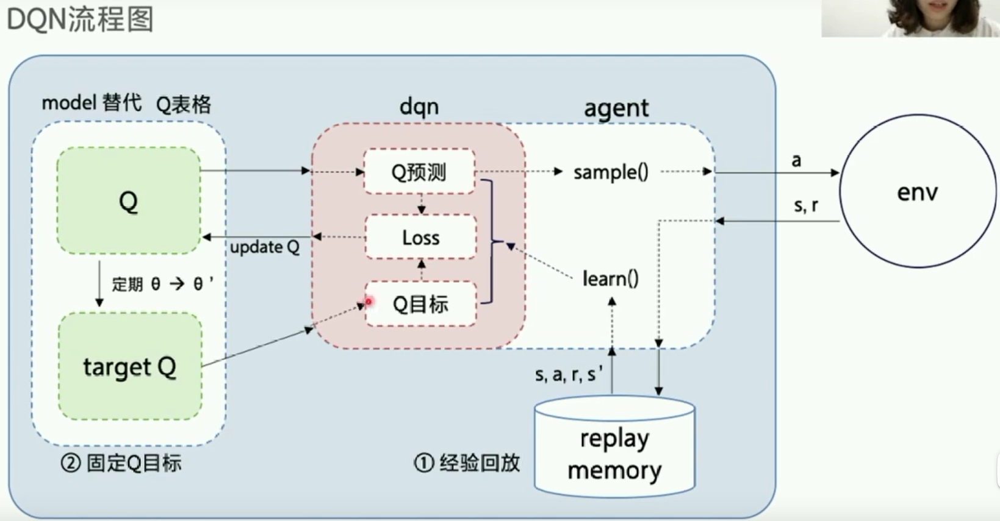
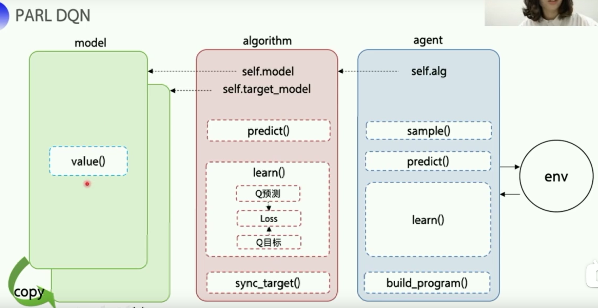

# 强化学习 3 使用神经网络求解RL问题

从RL到Deep RL：从少量状态到“无限”状态，从概念到实际。

上节的游戏，仅有 m*n states （m，n均不大）;但国际象棋由10的47次方个 states，围棋有 10的170次方...机器人手脚弯曲度数有无限个连续的states。

如何解决？

之前有限状态下，我们使用 Q table，在表中查询某个状态的Value；当状态数量很大时，我们可以采用近似状态查询 $q^\pi (s,a) \simeq \hat q(s,a,w)$

q值函数的近似表示可以使用下面方法：
- 多项式函数
- 神经网络
- ...

使用值函数近似求Q值的有点：
- 仅需存储有限的参数
- 状态泛化（利用神经网络），相似的状态得到的Q值一样。
- 不像Q表格会在状态多时占用极大内存，且效率低下。


使用神经网络求解强化学些的经典算法是DQN

## DQN

DEEPMIND 团队 2015年nature "Human-Level control through deep reinforcement learning".

在49个游戏中，DQN算法有30个超越了人类水平。为了解决高维输入（像素级别的图像），DQN使用了神经网络代替Q table，本质上，DQN是Q-Learning算法的延申。

### 两大创新点
- 经验回放（Experience replay）：破解样本间关联性
- 固定Q目标（Fixed Q target）：破解非平稳性问题

#### 经验回放（Experience replay）：破解样本间关联性

强化学习问题，例如游戏中agent的行动，往往是前后关联的序列。这样的数据输入神经网络训练，得到的结果通常是泛化性较差的，且不一定收敛。

为此需要打乱输入序列的顺序，DQN算法基于Q-Learning，先获取一批经验数据，即（状态，行动）对的序列，然后把它们打乱，按小的批次送给神经网络，然后经过多轮训练，得到输出为多个q值（Q table中某个state-action的近似值）

如下图所示，DQN算法在Q-Learning基础上，增加了一个经验（例如：$s_t,a_t,r_{t+1},s_{t+1}$）缓冲区。

DQN会打乱经验缓冲区中样本的关联性，提供样本利用率。



经验池的基本实现如下：
```python

import collections

class ReplayMemory(object):
    """经验池类"""
    def __init__(self,max_size):
        self.buffer = collections.deque(maxlen = max_size)#定义经验池

    # 增加一条经验(obs,action,reward,next_obs,done)
    def append(self,exp):
        self.buffer.append(exp)
    # 从经验池中随机抽取一批
    def sample(self,batch_size):
        mini_batch = random.sample(self.buffer,batch_size)
        obs_batch,action_batch,reward_batch,next_obs_batch,done_batch = [],[],[],[],[]

        for experience in mini_batch:
            s,a,r,s_p,done = experience
            obs_batch.append(s)
            action_batch.append(a)
            reward_batch.append(r)
            next_obs_batch.append(s_p)
            done_batch.append(done)
        return np.array(obs_batch).astype('float32'), \
            np.array(action_batch).astype('float32'), \
            np.array(reward_batch).astype('float32'), \
            np.array(next_obs_batch).astype('float32'), \
            np.array(done_batch).astype('float32')
    
    def __len__(self):
        return len(self.buffer)
```

#### 固定Q目标（Fixed Q target）：破解算法更新不平稳性问题

监督学习中的 $y \rightarrow y'$, 真实值$y'$绝大多数是固定不变的。而DQN产生Q的预测值，需要去逼近真实值$Q_{target} = R + \gamma max Q(s',a',\theta)$，这个真实值也是在不断变化的。就像射箭的目标是个动态的目标，所以存在着不稳定问题。

解决这一问题的基本思想是在一定时间内，令真实值$Q_{target} = R + \gamma max Q(s',a',\theta)$不变，训练一段时间后再变更。


### DQN 算法流程




### 使用 parl 框架实现DQN
PARL 框架将DQN分为三个模块：



- model定义神经网络部分，可以是求价值函数的网络，也可以是求策略函数的网络，修改网络结构时，只需要修改这部分；
- algorithm 定义了具体算法来更新Q，predict()用来输出下一步动作，learn()用来更新Q值，sync_target()用来将self.model同步到self.target_model 中。
- agent，定义了玩家，与环境交互，还包括数据预处理。

model.py 文件内容

```python
import parl
from parl import layers #封装了 paddle.fluid.layers的神经网络API

class Model(parl.Model):
    def __init__(self,act_dim):
        hid1_size = 128
        hid2_size = 128
        #3 层全连接网络
        self.fc1 = layers.fc(size=hid1_size,act='relu')
        self.fc2 = layers.fc(size=hid1_size,act='relu')
        self.fc3 = layers.fc(size=hid1_size,act='relu')
    def value(self,obs):
        h1 = self.fc1(obs)
        h2 = self.fc2(h1)
        Q = self.fc3(h2)
        return Q

```

### 使用 tensorflow 2.0 实现 DQN

> 代码来源：https://github.com/marload/DeepRL-TensorFlow2

```PYTHON
import wandb # 深度学习可视化库
import tensorflow as tf
from tensorflow.keras.layers import Input, Dense
from tensorflow.keras.optimizers import Adam

import gym
import argparse
import numpy as np
from collections import deque
import random

tf.keras.backend.set_floatx('float64')
wandb.init(name='DQN', project="deep-rl-tf2")

parser = argparse.ArgumentParser()
parser.add_argument('--gamma', type=float, default=0.95)
parser.add_argument('--lr', type=float, default=0.005)
parser.add_argument('--batch_size', type=int, default=32)
parser.add_argument('--eps', type=float, default=1.0)
parser.add_argument('--eps_decay', type=float, default=0.995)
parser.add_argument('--eps_min', type=float, default=0.01)

args = parser.parse_args()

class ReplayBuffer:
    def __init__(self,capacity=10000):
        self.buffer = deque(maxlen=capacity)
    def put(self,state,action,reward,next_state,done):
        self.buffer.append([state,action,reward,next_state,done])
    def sample(self):
        sample = random.sample(self.buffer, args.batch_size)
        states, actions, rewards, next_states, done = map(np.asarray, zip(*sample))
        states = np.array(states).reshape(args.batch_size, -1)
        next_states = np.array(next_states).reshape(args.batch_size, -1)
        return states, actions, rewards, next_states, done
    
    def size(self):
        return len(self.buffer)

class ActionStateModel:
    def __init__(self, state_dim, aciton_dim):
        self.state_dim  = state_dim
        self.action_dim = aciton_dim
        self.epsilon = args.eps
        
        self.model = self.create_model()
    
    def create_model(self):
        model = tf.keras.Sequential([
            Input((self.state_dim,)),
            Dense(32, activation='relu'),
            Dense(16, activation='relu'),
            Dense(self.action_dim)
        ])
        model.compile(loss='mse', optimizer=Adam(args.lr))
        return model
    
    def predict(self, state):
        return self.model.predict(state)
    
    def get_action(self, state):
        state = np.reshape(state, [1, self.state_dim])
        self.epsilon *= args.eps_decay
        self.epsilon = max(self.epsilon, args.eps_min)
        q_value = self.predict(state)[0]
        if np.random.random() < self.epsilon:
            return random.randint(0, self.action_dim-1)
        return np.argmax(q_value)

    def train(self, states, targets):
        self.model.fit(states, targets, epochs=1, verbose=0)
    

class Agent:
    def __init__(self, env):
        self.env = env
        self.state_dim = self.env.observation_space.shape[0]
        self.action_dim = self.env.action_space.n

        self.model = ActionStateModel(self.state_dim, self.action_dim)
        self.target_model = ActionStateModel(self.state_dim, self.action_dim)
        self.target_update()

        self.buffer = ReplayBuffer()

    def target_update(self):
        weights = self.model.model.get_weights()
        self.target_model.model.set_weights(weights)
    
    def replay(self):
        for _ in range(10):
            states, actions, rewards, next_states, done = self.buffer.sample()
            targets = self.target_model.predict(states)
            next_q_values = self.target_model.predict(next_states).max(axis=1)
            targets[range(args.batch_size), actions] = rewards + (1-done) * next_q_values * args.gamma
            self.model.train(states, targets)
    
    def train(self, max_episodes=1000):
        for ep in range(max_episodes):
            done, total_reward = False, 0
            state = self.env.reset()
            while not done:
                action = self.model.get_action(state)
                next_state, reward, done, _ = self.env.step(action)
                self.buffer.put(state, action, reward*0.01, next_state, done)
                total_reward += reward
                state = next_state
            if self.buffer.size() >= args.batch_size:
                self.replay()
            self.target_update()
            print('EP{} EpisodeReward={}'.format(ep, total_reward))
            wandb.log({'Reward': total_reward})


def main():
    env = gym.make('CartPole-v1')
    agent = Agent(env)
    agent.train(max_episodes=1000)

if __name__ == "__main__":
    main()
```

### 应用DQN解决CartPole问题

CartPole被视为一个经典的强化学习算法能力测试游戏。
- Reward：
  - 每多坚持一个step，Reward为1，初始时刻 $Reward_0 = 200$
- State: 有4种
  - 0：$cart position \in [-2.4,2.4]$
  - 1：$cart velocity \in (-\infin,\infin)$
  - 2：$pole angle \in [-41.8^\circ,41.8^\circ]$
  - 3：$pole velocity at tip \in (-\infin,\infin)$

- episode终止条件：
  - 杆子的角度大于$\pm 12^\circ$
  - 小车的位移大于$\pm 2.4$，即小车车身中心点超出界面
  - Episode 超过 200 steps
- Actions:
  - 0: push cart to the left
  - 1: push cart to the right


```python
import gym
env = gym.make("CartPole-v0")
action_dim = env.action_space.n
obs_shape = env.observation_space.shape
rpm = ReplayMemory(MEMORY_SIZE)#dqn的经验回放池

#根据parl 架构构建 agent
model = Model(act_dim = action_dim)
algorithm = DQN(model,act_dim=action_dim,gamma=GAMMA,lr=LEARNING_RATE)
agent = Agent(algorithm,obs_dim=obs_shape[0],act_dim=action_dim,e_greed=0.1,e_greed_decrement=1e-6)#随着训练逐步收敛，探索的程度逐渐减慢

#xian向经验池中存一些经验，避免最开始训练时样本丰富度不够
while len(rpm) < MEMORY_WARMUP_SIZE:
    run_episode(env,agent,rpm)
max_episode = 2000

#start train
episode = 0
while episode < max_episode:# 训练max_episode个回合，test部分不计入episode
    for i in range(0,50):
        total_reward = run_episode(env,agent,rpm)
        episode += 1
    #test part
    eval_reward = evaluate(env,agent,render=True)
    logger.info('episode:{} e_greed:{} test_reward:{}".format(episode,agent.e_greed,eval_reward))


```

## PARL 常用 API

搭建好强化学习训练框架，快速复现，便于修改调试

常用api：
- agent.store() 保存模型
- agent.restore() 加载模型
- model.sync_weights_to() 把当前模型的参数同步到另一个模型上
- model.parameters() 返回一个list，包含模型所有参数的名称
- model.get_weights() 返回一个list， 包含模型的所有参数
- model.set_weights() 设置模型参数