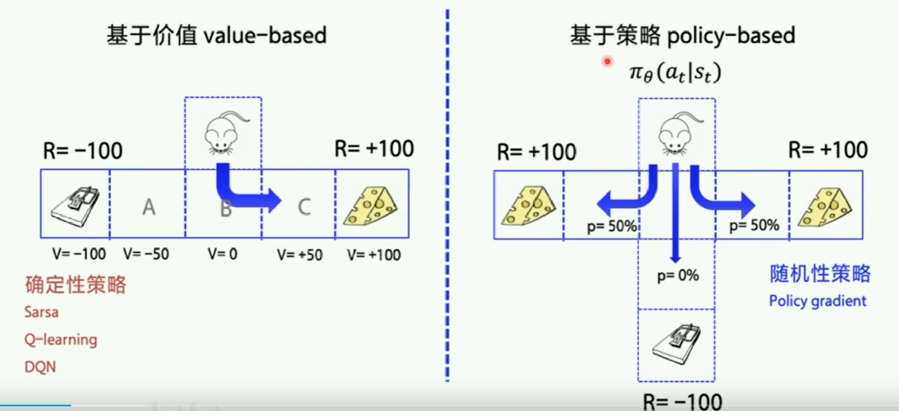
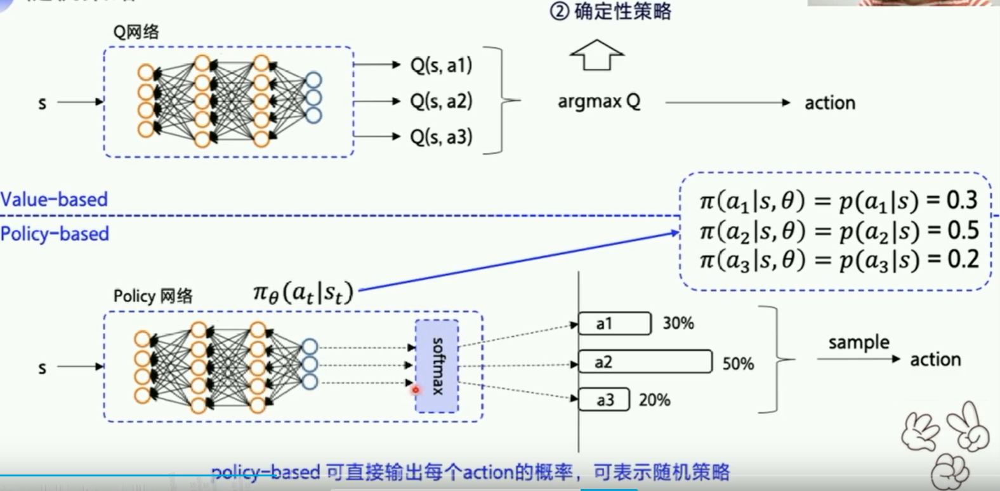
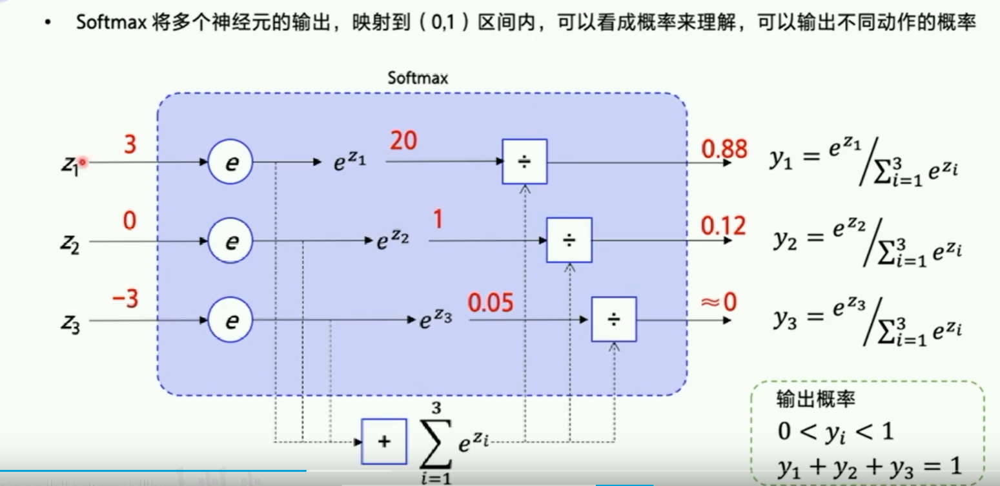
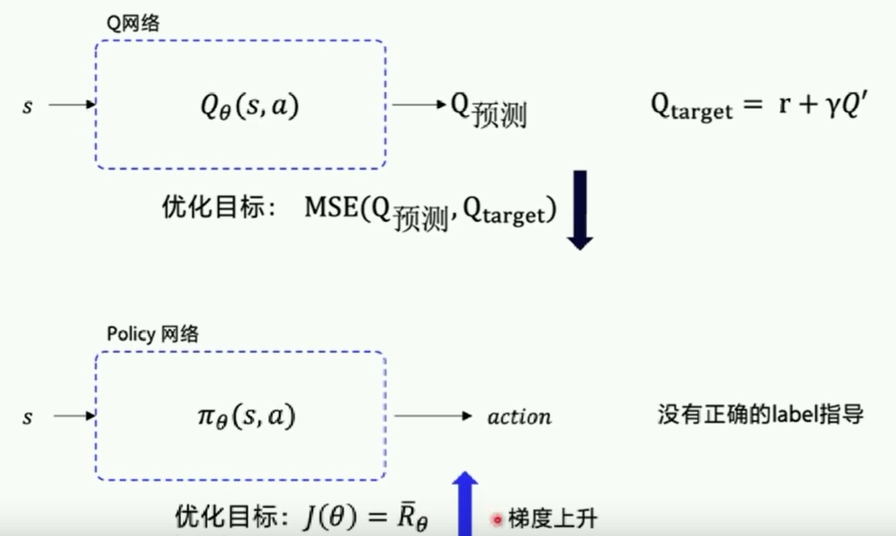
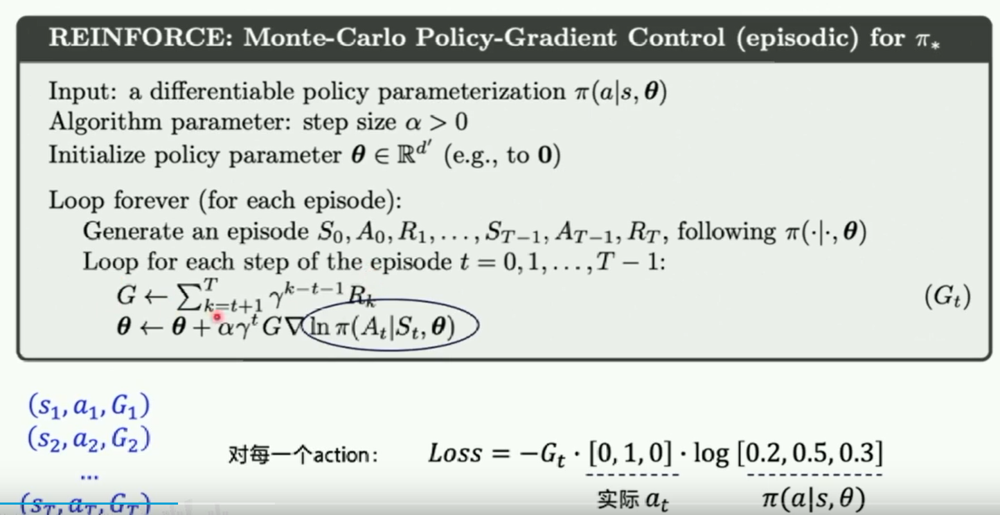

# 基于策略梯度求解RL

## 基于价值 vs 基于策略的学习方案

Value-based：
- 先学习状态-动作价值函数
- 目标是使Q值最优
- 然后根据状态-动作的价值选择动作
- 由于选择时的依据在学习后已基本确定，所以属于确定性策略
- 常用算法：Sarsa，Q-learning，DQN


Policy-based：
- 学习$\pi_\theta (a_t|s_t)$ 这个概率函数，$\theta $是神经网络参数，a是行动，s是环境的状态
- 动作选择依据状态-行动概率



下图可见，Value-based 学习和优化的是Q值表，等Q值表或网基本确定了，行动就可以确定了；而Policy-based认为学习Q值是中间过程，直接拟合Policy指导行动更有效率，而且这个Policy是概率，执行动作也就不是确定性的，对于随机性大的问题有更好的解决。



softmax使输出符合概率分布：



## Policy Gradient
策略函数定义为$\pi(s,a)$

策略参数化$\pi(a|s,\theta)$


### 轨迹 Trajectory

一个episode（一轮游戏）的轨迹 Trajectory是某一连串的状态-动作序列： $\tau = \{s_0,a_0,s_1,a_1, \dots , s_t,a_t\}$

- 从一个状态出发，根据$\pi_\theta(a_1 | s_1)$这一概率确定执行哪个行动；
- 执行某个行动后，状态会改变为“状态转移概率”$p(s_2|s_1,a_1)$较大的状态
- 一条轨迹最终的总回报为: $R(\tau) = \sum_{t=1}^T r_t$

轨迹可能有限，也可能无限，所有episode（轨迹）的平均回报,或称为$\pi_\theta(a_1 | s_1)$策略的期望回报： $\overline{R}_\theta = \sum_\tau R(\tau)p_\theta(\tau)$

期望回报可以评估算法好坏，但不易计算，但可以利用下列公式进行近似：

$\overline{R}_\theta = \sum_\tau R(\tau)p_\theta(\tau) \simeq \frac{1}{N}\sum_{n=1}^N R(\tau)$

上述过程，也称为采样，即采用N个episode，计算出期望回报。这样在没有状态转移概率的情况下可以完成计算。

那么Poclicy-Based 算法的优化目标就是$J(\theta) = \overline{R}_\theta$



为了计算$J(\theta) = \overline{R}_\theta$ 中的$\theta $，可以尝试多条轨迹，得到R，然后求$\theta$。

使用神经网络求梯度上升，即:

$\triangledown \overline{R}_\theta \approx \frac{1}{N} \sum_{n=1}^N\sum_{t=1}^{T_n} R(\tau^n)\triangledown log \pi _\theta (a_t^n|s_t^n) $

这个公式就是策略梯度的表示。

将Loss函数$Loss = -R(\tau)log \pi _\theta (a_t|s_t)$放入现代的深度学习框架，就可利用梯度下降方法求出最优参数。

更新关系：
$\theta \leftarrow \theta + \alpha \triangledown \overline{R}_\theta$

## 计算 Policy Gradient 

在计算 Policy Gradient 时，可用蒙特卡洛方法或TD时序差分方法。

### 蒙特卡洛（MC） reinforce

MC方法是在完成一个episode之后(一个回合结束)，拿已经确定的一条轨迹去计算未来总收益 ：$G_t^n$。因为路径已经确定，所以是可以计算的（不必考虑状态转移概率等未知量）。

例如：$G_1$ 表示从$s_1$开始直到最终状态的总收益；$G_2$ 表示从$s_2$开始直到最终状态的总收益...

一个episode更新一次。

$\triangledown \overline{R}_\theta \approx \frac{1}{N} \sum_{n=1}^N\sum_{t=1}^{T_n} G_t^n \triangledown log \pi _\theta (a_t^n|s_t^n) $

#### 代码实现
假设某个epicode中包含一连串的状态-动作序列，且每个动作后有一个当前步骤的收益r： $\tau = \{s_0,a_0,r_1,s_1,a_1,r_2, \dots , s_{T-1},a_{T-1},r_T,s_T\}$

> 有些文献里，使用$s,a,r,s',a'$表示。

先拿到一个episode中每step的收益$[r_1,r_2,\dots ,r_T]$，由此计算每步的未来总收益$[G_1,G_2,...,G_T]$ ,$G_t = \sum_{t=k+1}^T \gamma^{k-t-1} r_t = r_{t+1}+\gamma G_{t+1}$



下面是计算Gt的过程：
```python
def calc_reward_to_go(reward_list, gamma=1.0):
    for i in range(len(reward_list) - 2 ,-1,-1): #通过r_t,计算G_t
        reward_list[i] += gamma * reward_list[i+1] #G_t
    return np.array(reward_list)

```

在parl中，实现reinforce需要有下列模块：
- model，实现policy model
- algorithm：实现参数更新 $\theta \leftarrow \theta + \alpha \triangledown \overline{R}_\theta$
- agent：定义玩家的perdict，sample，learn


### TD 时序差分（Actor-Critic）
episode中每个step更新一次。

使用Q值来近似未来总收益。


$\triangledown \overline{R}_\theta \approx \frac{1}{N} \sum_{n=1}^N\sum_{t=1}^{T_n} Q^n(s_t^n,a_t^n) \triangledown log \pi _\theta (a_t^n|s_t^n) $
