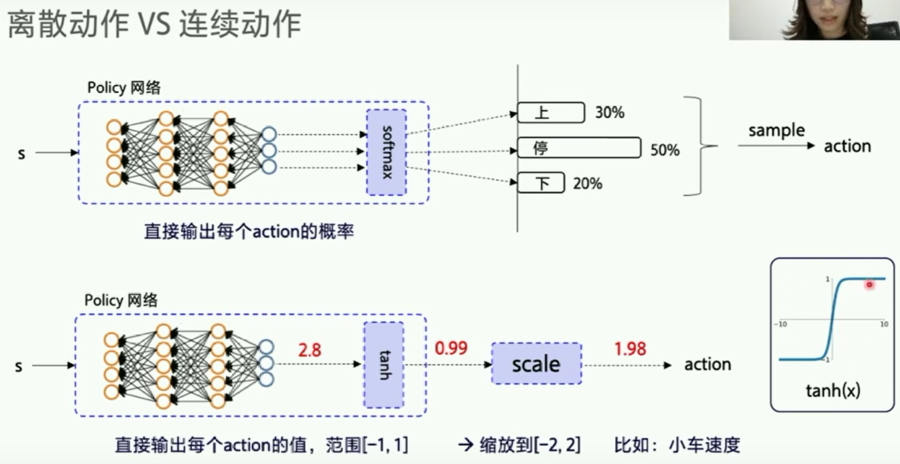
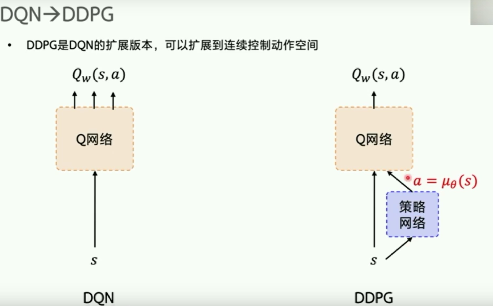
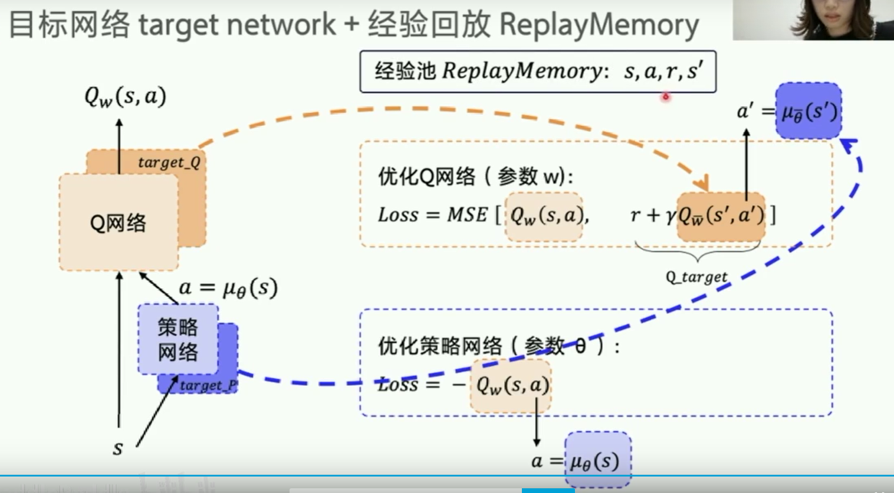
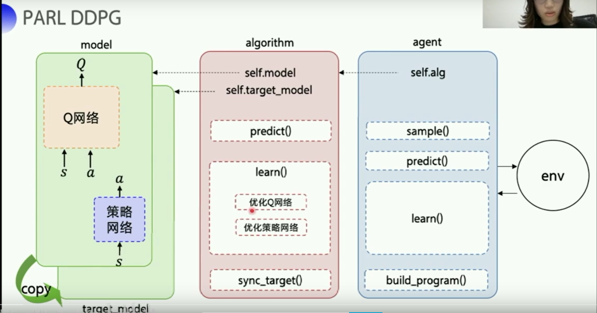

# 强化学习 5 连续空间问题求解

## 离散动作 vs 连续动作

强化学习中，agent最后执行离散动作，往往是有限的，可以使用基于价值、基于策略的方法来找到一个确定动作或策略概率最大的动作。

而agent执行连续动作时，可选动作往往是无限的，即一个实数，所以在输出前要把概率或Q值转化为浮点数，再经符合实际意义的缩放，得到动作值。

## DDPG 
连续控制领域，经典算法是Deep Deterministic Policy Gradient算法。

- policy gradient 表示它使用了策略网络，但与离散动作REINFORCE不同
- deterministic 表示输出的是确定值（动作$a = \mu(s$），而不是概率值$\pi(a|s)$
- deep 表示借用了神经网络，它借鉴了 DQN的特点（目标网络和经验回放）。

DDPG最初是在DQN上扩展，既用神经网络训练Q网络$Q_w(s,a)$（参数表示为w），也训练策略网络$a=\mu_\theta (s)$（参数表示为$\theta$）。

这种既有价值网络又有策略网络的结构，称为 Actor-Critic ,Q网络是评论家，用来收集环境反馈（未来总收益）；P网络是演员，根据评论打分进行优化训练。

- DQN的最佳策略：$argmax_aQ_w^*(s,a)$
  - Loss函数：$mse(Q_{estimator}，Q_{target})$

- DDPG的最佳策略：$argmax_{a=\mu_\theta(s)}Q_w^*(s,\mu_\theta(s))$
  - LOSS函数：$-Q(s,a)= -Q(s,\mu_\theta(s))$,（最小化loss也即最大化Q）

说明：a表示动作，s表示状态，w是Q网络待优化参数，Q表示价值，argmax表示求最大值，$\theta$表示P网络待优化参数，$\mu$表示策略函数。

有了两个网络的Loss函数，将其置入优化器。由于优化过程中$Q_w$不稳定，所以DDPG为Q网络和P网络都搭建了target_Q网络 和 target_P网络。所以有的文献里会说DDPG中有4个网络。

### PARL 实现 DDPG

最核心的几个函数：
- model中的value 和 policy
- algorithm中的learn，包括actor和critic的learn。

## RLSchool
[RLSchool](github.com/PaddlePaddle/RLSchool)
是一个强化学习模拟环境合集

