# 循环神经网络 RNN

## 基本概念
### WHY rnn?

卷積神經網路 – CNN 已經很強大的，為什麼還需要RNN？

CNN 和普通的演算法大部分都是輸入和輸出的一一對應，也就是一個輸入得到一個輸出。不同的輸入之間是沒有聯繫的。

但是在某些場景中，一個輸入就不夠了！例如做阅读理解题，我們不但需要知道前面所有的詞，還需要知道詞之間的順序。这种需要处理序列数据——一串相互依赖的数据流的场景就需要使用RNN来解决。

典型的集中序列數據：
- 文章里的文字內容
- 語音里的音頻內容
- 股票市場中的價格走勢
- 攻击活动
- 恶意代码行为

RNN 之所以能夠有效的處理序列數據，主要是基於他的比較特殊的運行原理。下面給大家介紹一下 RNN 的基本運行原理。

### RNN 的基本原理
傳統神經網路的結構比較簡單：輸入層 – 隱藏層 – 輸出層。如下图所示：

RNN 跟傳統神經網路最大的區別在於每次都會將前一次的輸出結果，帶到下一次的隱藏層中，一起訓練。如下圖所示：

下面用一個具體的案例來看看 RNN 是如何工作的：

假如需要判斷用戶的說話意圖（問天氣、問時間、設置鬧鐘…），用戶說了一句「what time is it？」我們需要先對這句話進行分詞：

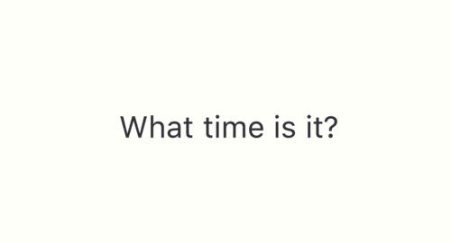

然後按照順序輸入 RNN ，我們先將 「what」作為 RNN 的輸入，得到輸出「01」

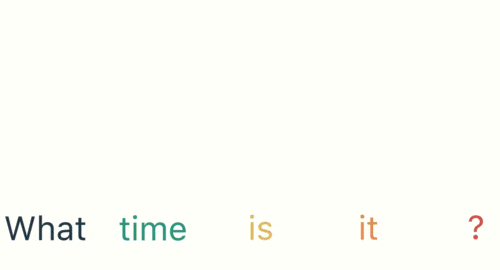

然後，我們按照順序，將「time」輸入到 RNN 網路，得到輸出「02」。這個過程我們可以看到，輸入 「time」 的時候，前面 「what」 的輸出也產生了影響（隱藏層中有一半是黑色的）。

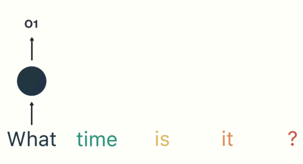

以此類推，前面所有的輸入都對未來的輸出產生了影響，大家可以看到圓形隱藏層中包含了前面所有的顏色。如下圖所示：

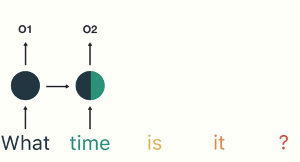

當我們判斷意圖的時候，只需要最後一層的輸出「05」，如下圖所示：

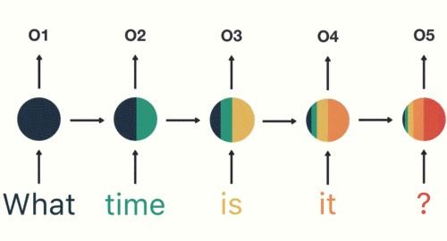

RNN 的缺點也比較明顯

通過上面的例子，我們已經發現，短期的記憶影響較大（如橙色區域），但是長期的記憶影響就很小（如黑色和綠色區域），這就是 RNN 存在的短期記憶問題。
- RNN 有短期記憶問題，無法處理很長的輸入序列
- 訓練 RNN 需要投入極大的成本

由於 RNN 的短期記憶問題，後來又出現了基於 RNN 的優化演算法，下面給大家簡單介紹一下。

### RNN 的優化演算法

#### RNN 到 LSTM – 長短期記憶網路

RNN 是一種死板的邏輯，越晚的輸入影響越大，越早的輸入影響越小，且無法改變這個邏輯。

LSTM 做的最大的改變就是打破了這個死板的邏輯，而改用了一套靈活了邏輯——只保留重要的信息。

簡單說就是：抓重點！

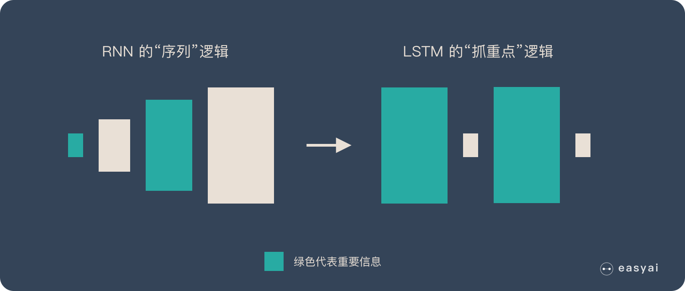

舉個例子，我們先快速的閱讀下面這段話：

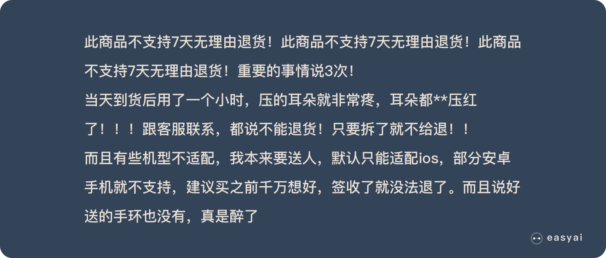

當我們快速閱讀完之後，可能只會記住下面幾個重點：
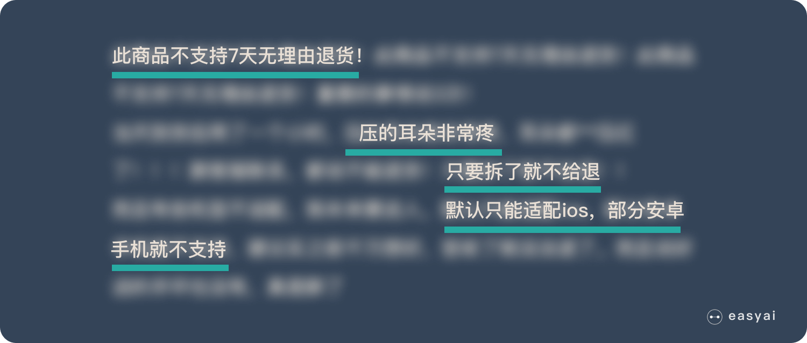

LSTM 類似上面的劃重點，他可以保留較長序列數據中的「重要信息」，忽略不重要的信息。這樣就解決了 RNN 短期記憶的問題。

#### 從 LSTM 到 GRU
Gated Recurrent Unit – GRU 是 LSTM 的一個變體。他保留了 LSTM 劃重點，遺忘不重要信息的特點，在long-term 傳播的時候也不會被丟失。

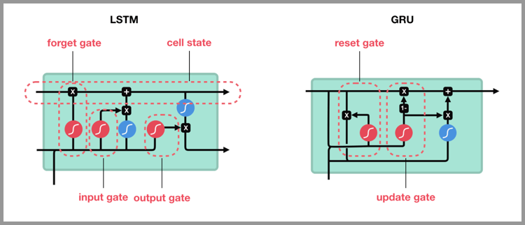

GRU 主要是在 LSTM 的模型上做了一些簡化和調整，在訓練數據集比較大的情況下可以節省很多時間。

### RNN 的應用和使用場景
只要涉及到序列數據的處理問題，都可以使用到，NLP 就是一個典型的應用場景。

文本生成：類似上面的填空題，給出前後文，然後預測空格中的詞是什麼。

機器翻譯：翻譯工作也是典型的序列問題，詞的順序直接影響了翻譯的結果。

語音識別：根據輸入音頻判斷對應的文字是什麼。

生成圖像描述：類似看圖說話，給一張圖，能夠描述出圖片中的內容。這個往往是 RNN 和 CNN 的結合。

## 长短期记忆网络( Long short-term memory , LSTM)

长短期记忆网络——通常被称为 LSTM，是一种特殊的 RNN，能够学习长期依赖性。由 Hochreiter 和 Schmidhuber（1997）提出的，并且在接下来的工作中被许多人改进和推广。LSTM 在各种各样的问题上表现非常出色，现在被广泛使用。

LSTM 被明确设计用来避免长期依赖性问题。长时间记住信息实际上是 LSTM 的默认行为，而不是需要努力学习的东西！

所有递归神经网络都具有神经网络的链式重复模块。在标准的 RNN 中，这个重复模块具有非常简单的结构，例如只有单个 tanh 层。

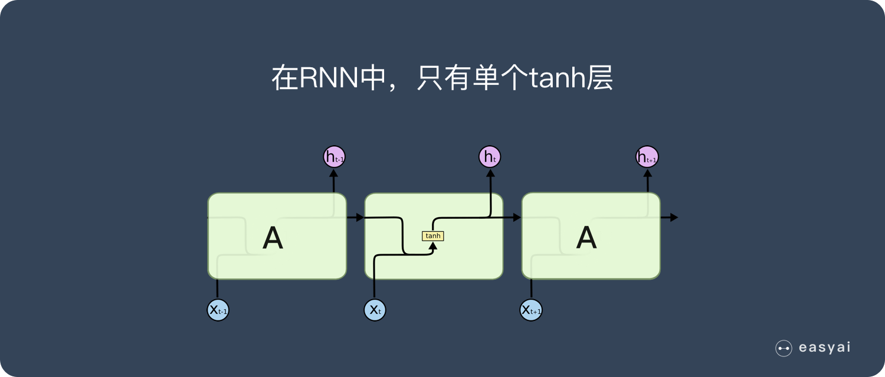

LSTM 也具有这种类似的链式结构，但重复模块具有不同的结构。不是一个单独的神经网络层，而是四个，并且以非常特殊的方式进行交互。

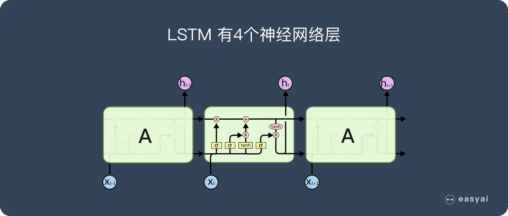

不要担心细节。稍后我们将逐步浏览 LSTM 的图解。现在，让我们试着去熟悉我们将使用的符号。

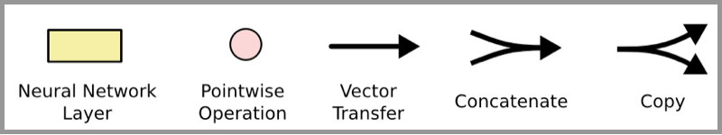

在上面的图中：

- 每行包含一个完整的向量，从一个节点的输出到其他节点的输入。
- 粉色圆圈表示逐点运算，如向量加法；
- 而黄色框表示学习的神经网络层。
- 行合并表示串联。
- 分支表示其内容正在被复制，并且副本将转到不同的位置。

### LSTM的核心思路

LSTM 的关键是细胞状态，即图中上方的水平线。

细胞状态有点像传送带。它贯穿整个链条，只有一些次要的线性交互作用。信息很容易以不变的方式流过。

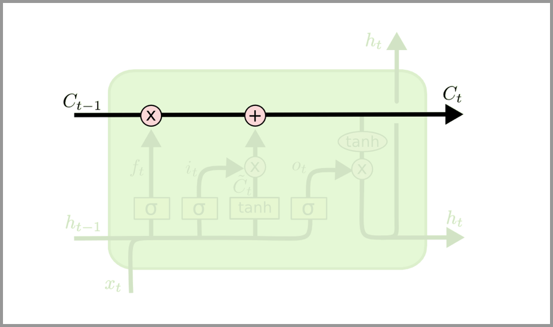

LSTM 可以通过所谓“门”的精细结构向细胞状态添加或移除信息。

门可以选择性地以让信息通过。它们由 S 形神经网络层和逐点乘法运算组成。

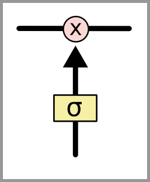

S 形网络的输出值介于 0 和 1 之间，表示有多大比例的信息通过。0 值表示“没有信息通过”，1 值表示“所有信息通过”。

一个 LSTM 有三种这样的门用来保持和控制细胞状态。

## 参考
- https://easyai.tech/ai-definition/rnn/
- https://easyai.tech/ai-definition/lstm/
- https://towardsdatascience.com/illustrated-guide-to-lstms-and-gru-s-a-step-by-step-explanation-44e9eb85bf21