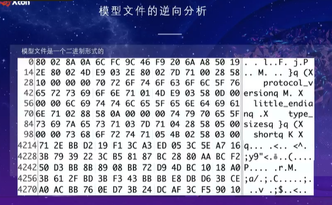
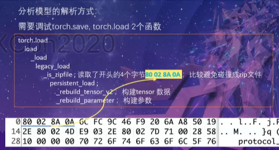
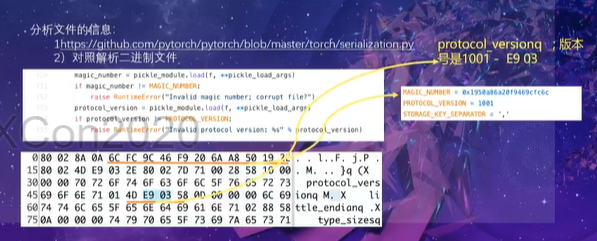
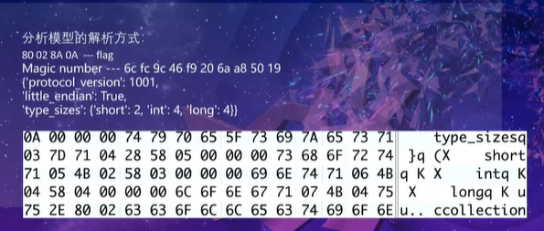
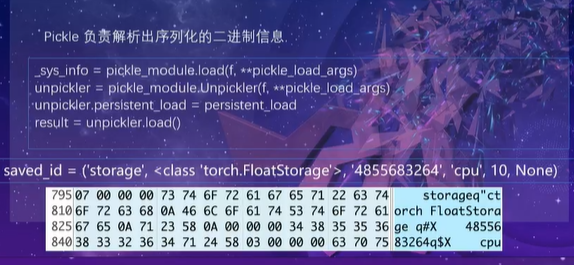
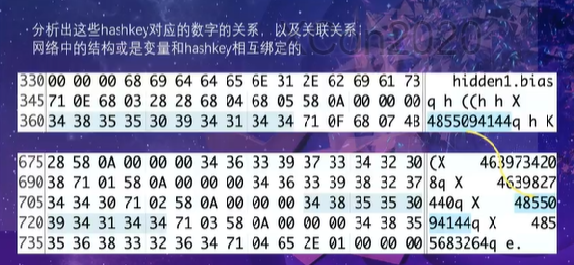
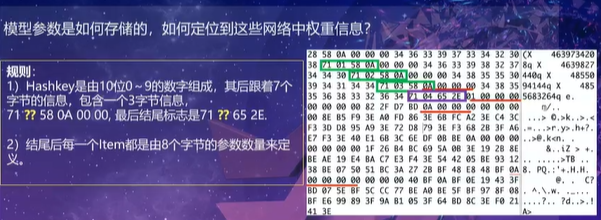
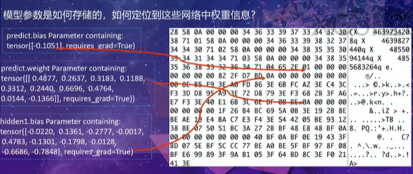
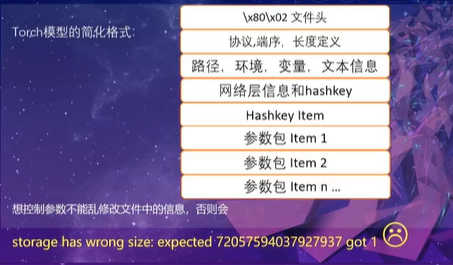
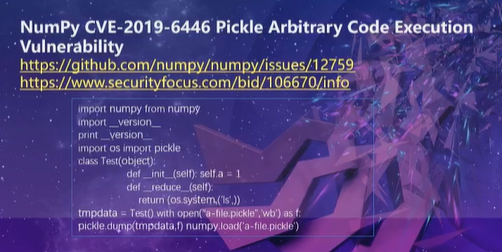

# 神经网络安全


## 通过逆向模型文件来重构神经网络模型后门

>腾讯朱雀实验室 nEINEI 朱季风 xcon 2020 演讲

### 神经网络模型文件的逆向分析

likang教授的研究引起了我们的注意，开始考虑神经网络模型文件的安全问题。

- checking defects in deep learning ai models  kangli zhangyan，poc2019.
- ai model security reverse engineering machine learning models ， kangli，hitb2018.

算法模型编码、学习后生成的模型文件（tensorflow、pytorch、kafa）是一种二进制文件。

攻击者拿到这个模型文件后，有两种方式影响（攻击）模型，产生错误结果。

- 从开源社区的代码上影响，可能模型中（二级制文件中）包含恶意代码；也可能训练出一个有毒的教师模型，影响后边的学习
- 模型本身正常，受到攻击后开始产生错误。

假设攻击者能接触到模型文件。以pytorch为例，训练后的结果模型有两种保存方式：一是保存整个模型，二是保存所有参数。

保存参数：
```torch.save(model.state_dict(),"my_model.pth")```

保存模型：
```torch.save("model,"model.pth")```



首先要分析模型文件的结构，一些信息是可以直接看出来。可以从最基本的情况入手，写一个简单模型观察模型文件，然后再增加复杂度理解二进制文件。网络信息、版本信息、权重信息、bias等信息能直接能看出来。


可以看到一些字符串信息，例如protect_version_title_...

调试load和save两个函数，可以看到模型的调用情况。



查看python serialization.py 文件调试




下面的数字串表示某个网络层








可以利用numpy漏洞捆绑含恶意代码的神经网络下发。



### 基于模型感染的攻击方式

有很多学术研究

- 隐藏trigger后门攻击
- TBT：TARGETED Neural Network attack with  BIT TROJAN

### 重构神经网络模型的攻击
CNN 鲁棒性方面研究。网络的可解释性、稳定性可能有以下原因：
- Synapse knockouts 


### 基于模型隐藏的后门攻击


