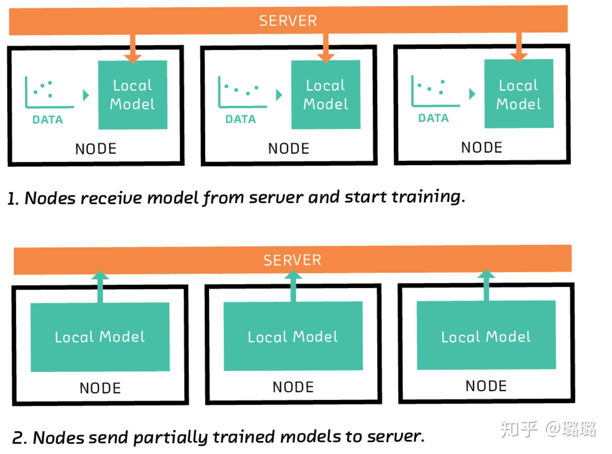

# 联邦学习

## 什么是联邦学习？

数据是AI的天花板，更多的数据意味着更好的学习泛化性和预测结果。但目前的学习过程中，**训练数据不能远离其来源**。这是由于：
- 约束的原因可能包括隐私问题，例如我不想分享宝贝的照片；
- 监管障碍（HIPAA，GDPR等）；
- 实际工程限制,例如网络连接昂贵，速度慢或不可靠，或数据量太大了。

举例来说，假设有两个不同的企业 A 和 B，它们拥有不同的数据，比如企业 A 有用户特征数据，企业 B 有产品特征数据和标注数据。这两个企业按照 "通用数据保护准则GDPR" 是不能粗暴地把双方数据加以合并的，因为他们各自的用户并没有机会同意这样做。假设双方各自建立一个任务模型，每个任务可以是分类或预测，这些任务也已经在获得数据时取得了各自用户的认可。那么，现在的问题是如何在 A 和 B 各端建立高质量的模型。但是，又由于数据不完整（例如企业 A 缺少标签数据，企业 B 缺少特征数据），或者数据不充分（数据量不足以建立好的模型），各端有可能无法建立模型或效果不理想。

### 联邦学习特点

- 工作节点自主决定何时加入联邦学习进行建模
- 设备不稳定，例如手机、iPad、智能家居等设备
- 设备之间算力各不相同，差异较大
- 通信代价远大于计算代价
- 节点之间数据不平衡，建模困难

### 分布式机器学习

- 中心节点占据主导地位
- 设备稳定，所有设备都在机房
- 计算性能几乎一样
- 节点间的数据平衡

### 联邦学习分类

#### 横向联邦学习（HFT)

本质是样本的联合。（扩行）

这种情况常见于，参与者业务相同、特征相同、用户不同

#### 纵向联邦学习（VFT）

本质是特征的联合。（扩列）

参与者业务不同、特征不同、用户不同。

## 联合平均

联合学习是指一系列的算法，试图再上述背景现状中解决机器学习问题。它们的重要细节不同，但基本思想共通：**服务协调节点网络，每个节点都有训练数据。每个节点都训练一个本地模型，它是与服务器共享的模型。**

### 横向联邦学习

基本目标：
- 不交换样本，实现全体样本训练，训练效果与聚集全部样本后训练一致。
- 训练过程交换的中间数据也不能暴漏样本信息。

对目标1，学术界已经有解决方案。容易达到，早在96年FJ Provost等人就提出了Distributed Rule Learning（http://citeseerx.ist.psu.edu/viewdoc/download?doi=10.1.1.57.2129&rep=rep1&type=pdf），说明使用多台计算机并行处理不同的样本可以大大加速模型训练。到了2014年，李沐等人依据在百度的大规模机器学习实践提出了ParameterServer模式（http://papers.nips.cc/paper/5597-communication-efficient-distributed-machine-learning-with-the-parameter-server.pdf）又大大提升了分布式机器学习在集群架构和算法实现的泛用化程度。所以实现目标1并不是HFL的最大挑战，至少这一目标已经被工业界和学术界基本攻克。

难度在于目标2，漏洞就在于分布式机器学习引入的梯度传输，可能会导致反推回原始数据。最近比较火的一个报道是MIT的Han Song组在 NeurIPS 2019 发表的 Deep Leakage from Gradients（https://hanlab.mit.edu/projects/dlg/），其中报道了一个用20行基于PyTorch核心代码的样例，运用GAN的思想，让分布式训练中的一个攻击方可以从整个模型更新梯度的过程中，不断生成与其他参与各方相同的数据，从而实现『偷取』数据。 而国内自媒体也喜欢『见得风就是雨』，发表了一些诸如『联邦学习因为梯度泄露问题受影响』的观点（https://zhuanlan.zhihu.com/p/96945857）。

有这样的观点的同志，大概是不了解横向联邦学习要解决的基本问题本身就包含梯度泄露。早在2017年，谷歌的Bonawitz等发表了『Practical Secure Aggregation for Privacy-Preserving Machine Learning』这篇文章，详细阐述了针对梯度泄露攻击设计的Secure Aggregation协议。

Secure Aggregation协议有几个有意思的特点：
- 通过选择部分用户的加密梯度更新，类似于异步参数更新策略，来防御clients中的攻击者。这个可以基本可以解决DLG的问题，而DLG基本上依赖于同步参数更新策略的强假设：需要获得被攻击方样本集合上梯度值的精确值，随机选择会大大降低DLG的性能。
- 基于Secret Sharing的思想，让Server只知道Aggregated Gradients，防止Server想做坏事。

#### 基本过程
##### Client端任务

- 将Server端发来的模型变量加载到模型上
- 用自己的所有数据更新当前模型
- 将更新后的模型变量发回给Server

##### Server端任务
- 更新Clients：将一组模型变量给某个Client进行更新，把更新后的变量值拿回来
- 管理全局模型：每一轮更新，收集多个Clients更新后的模型进行归总，成为新一轮的模型

##### 完整过程

###### Step1 节点从服务器接收模型并开始训练
服务器首先向每个节点发送指令以训练特定类型的模型，例如线性模型，支持向量机，或者在深度学习的情况下，一些特定的网络架构。

###### 节点将其部分训练的模型发送到服务器
在接收到该指令时，每个节点在其训练数据的子集上训练模型。通常，训练模型需要算法的多次迭代（例如梯度下降），但是在联合学习中，节点仅几次迭代训练他们的模型。从这个意义上说，遵循服务器的指令，每个节点的模型都经过部分训练。然后，节点将其部分训练的模型（但不是训练数据）发送回服务器。

###### 服务器获取这些模型并将它们组合在一起以形成联合模型
服务器组合部分训练的模型以形成联合模型。组合模型的一种方法是取每个参数的平均值，加权相应节点上可用的训练数据量。

###### 服务器将联合模型将发送回节点

将组合的联合模型传输回节点，替换它们的本地模型并用作另一轮训练的起点。经过几轮迭代后，联合模型汇聚到一个良好的全局模型。通过一轮又一轮的训练，节点可以获取新的训练数据。有些节点甚至可能会中途退出，其他节点也可能会加入。

###### 随着不断重复迭代，模型可以在本地进一步训练。

至关重要的是，服务器永远不能直接访问训练数据。通过交换模型而不是训练数据，联合学习有助于确保隐私并最大限度地降低通信成本。

上述过程如下图所示：

#### 个性化
在“常规”联合学习中，服务器的目标是使用每个节点上的数据来训练单个全局模型，但是在节点计划应用模型的情况下（不仅仅是对其自己创建的模型有贡献），它通常会更多关注的是，本地模型捕获其数据中的模式比任何其他节点的数据更加准确。例如，如果我是一个正在训练模型的网络中的节点，该模型将帮助编写更有可能收到回复的电子邮件，我更关心该模型对我的作用而不是对其他人有效。

如果全局模型具有适当灵活的体系结构并且在许多良好的训练数据上进行训练，那么它可能比在单个节点上训练的任何本地模型更好，因为它能够捕获许多特性并推广到新模式。但有时在实践中，用户的目标（本地性能）可能与服务器的（全局性能）冲突。

研究个性化的目标就是解决这种倾向情况。在联合多任务学习中，Virginia Smith和合作者将个性化框架转化为一个多任务问题，其中每个用户的模型都是一个任务，但是存在一个与任务相关的结构。

### 纵向联邦学习
对应于两个不同机构，机构A和机构B它们的特征不一样。那么，我们希望在一个虚拟的第三方能够把这些特征，在加密的状态下加以聚合，以增强各自模型的能力。这种联邦学习，因为加密算法的原因，只能对某些类的模型使用，比如逻辑回归模型。 当时对很多其他模型，我们还不知道行不行。最近经过研究发现，联邦学习对于树型结构模型也是可以用的。例如，在这有一个企业、有一个数据集，那边也有一个企业和一个数据集，通过这种加密技术可以使两边的树都得到成长。有了树模型以后就很自然可以发展到森林模型。“微众银行”的AI团队就设计了一个这样的新框架，提出了一个叫做SecureBoost的算法框架，并使用在多方协同建模的问题上。其效果是建立了中心的虚拟模型以后，可以分发到两边的参与者，效果和把数据聚合在一处建模相比并没有损失，而且过程都不泄露用户隐私。

## 隐私
通过将训练数据保留在其源头，联合学习将分散机器学习中最明显和最大的安全漏洞。但要明确它并不是最佳解决方案。

隐私、安全和满足监管的要求为AI带来了一个前所未有的挑战，这个挑战导致大部分企业只拥有小数据。我可以先给一个结论：我们AI界现在并没有很好地应对这些挑战，并没有用大量的时间和精力去设计保护隐私安全和满足法律法规的机器学习框架来应对这些挑战。可以看一下当下的媒体，他们的宣传机器大部分时间都在传播这样一类新闻，就是某某机构、某某大牛又创造出一种新算法，又可以把某个指标，比如准确率做到更好。指标的提高固然很重要，但是，这不是人工智能当下最重要的需求，因为这并没有解决社会和企业的痛点。我认为当下更应该关心的是，在隐私、安全和监管要求下，如何让AI系统，更加高效、准确地共同使用各自的数据，能够在小数据（很少的样本和特征）和弱监督（有很少的标注）的条件下做更好的模型。

目前在联邦学习中经常使用的是安全多方计算（SMC）、同态加密、差分隐私（DP）。

### 安全多方计算

多方安全计算(MPC)，就会提到姚氏百万富翁问题：有两个很有钱的富翁，他们想知道谁更有钱，他们又都不想让除己以外的任何人知道自己实际有多少钱（即不信任任何第三方）。这是一个典型的两方安全计算案例，需要在不分享原始数值的情况下，得出想要的结论。

其中相关的技术包括：
- 秘密分享
- 模糊传输
- 同态加密
- 混淆电路。

MPC技术的优点：
- 单次随机加密，加密数据无法重复使用；
- 加密数据基础上直接进行运算，原始数据不出库/不能被还原；
- 每次计算要所有方共同协调：在计算前就要确定参与方。

### 可信执行环境

可信执行环境(TEE)也是一种解决方案：将计算运行在一个独立的环境中，而且与操作系统并行运行。在CPU 上确保 TEE 中代码和数据的机密性和完整性都得到保护，通过同时使用硬件和软件来保护数据和代码，故而TEE比操作系统更加安全。

市面上常见的解决方案有:
- Intel 的 SGX，适用于服务器或者 PC；
- ARM 的 TrustZone，适用于手机 CPU，如手机里面的指纹识别，人脸识别过程的数据安全保护。

可信执行环境依赖芯片隔离机制，在隔离区内，数据被解密成明文直接计算，整体效率会比较高。但是由于计算还是在明文层面进行，仍然会带来对应的安全困扰，比如会受硬件漏洞影响；而且更新需要硬件升级，无法快速迭代。

### 差分隐私 DP

#### 形式定义
对于一个有限域Z，$z \in Z$ 为Z中元素，从Z中抽样所得z的集合组成数据集D，其样本量为n，属性维度为d。

对数据集D的各种映射函数，被定义为查询Query，用 $F={f_1,f_2,...,f_n}$ 表示一组查询，算法M对查询F的结果进行处理，使之满足隐私保护条件，此过程称之为隐私保护机制。

设数据集D与D'，具有相同的属性结构，两者的对称差记作 $D\triangle D'$，$| D\triangle D'|$ 表示 $D\triangle D'$中记录的数量。若$| D\triangle D'| = 1$ ，则成D和D'为邻近数据集。

设有随机算法M，PM为M所有可能的输出构成的集合。对于任意两个邻近数据集D和D'，以及PM的任何子集SM，若算法M满足（差分隐私公式）：
$P(M(D) \in S) \leq e^{\varepsilon} P(M(D')\in S)+\delta$

则称算法M提供了$\varepsilon-$差分隐私保护，$\varepsilon$称为隐私保护预算。

上式中，P为概率。算法M通过对输出结果的随机化来提供隐私保护，同时通过参数$\varepsilon$来保证数据集中删除任一记录时，算法输出统一结果的概率不发生显著变化。

##### 隐私保护预算$\varepsilon$
从差分隐私保护的定义可知，隐私保护预算ε用于控制算法M在邻近数据集上获得相同输出的概率比值，反映了算法M所的隐私保护水平.

ε越小，隐私保护水平越高。在极端情况下，当ε取值为0时，即表示算法M针对D与D’的输出的概率分布完全相同，由于D与D’为邻近数据集，根据数学归纳法可以很显然地得出结论，即当ε=0时，算法M的输出结果不能反映任何关于数据集的有用的信息。因此，从另一方面，ε的取值同时也反映了数据的可用性，在相同情况下，ε越小，数据可用性越低。

##### 敏感度
差分隐私保护可以通过在查询函数的返回值中加入噪声来实现，但是噪声的大小同样会影响数据的安全性和可用性。通常使用敏感性作为噪声量大小的参数，表示删除数据集中某一记录对查询结果造成的影响。在此，我们不再介绍敏感度的详细定义，感兴趣的读者可以参考相关文献。

#### 实现机制
在实践中，通常使用两种实现机制来实现差分隐私保护:
- 拉普拉斯机制（Laplace Machanism），用于数值型结果的保护。
- 指数机制（Exponential Mechanism），用于离散型结果的保护。

##### 拉普拉斯机制
拉普拉斯机制通过向确切的查询结果中加入服从拉普拉斯分布的随机噪声来实现ε-差分隐私保护。记位置参数为0、尺度参数为b的拉普拉斯分布为Lap(b)，那么其概率密度函数为:$p(x)=\frac{e^{\frac{-|x|}{b}}}{2b}$。

对于拉普拉斯机制，我们进行以下定义：给定数据集D，设有函数$f：D->Rd$，其敏感度为Δf，那么随机算法M(D)=f(D)+Y提供ε-差分隐私保护，其中Y~Lap(Δf/ε)为随机噪声，服从尺度参数为Δf/ε的拉普拉斯分布。

##### 指数机制
由于拉普拉斯机制仅适用于数值型结果，在一些特定场景中，往往需要返回离散型结果，例如某一方案或某一实体等。对此，McSherry等人提出了指数机制。

设查询函数的输出域为Range，域中的每个值r∈Range为一实体对象。在指数机制下，函数q(D,r)->R成为输出值r的可用性函数，用来评估输出值r的优劣程度。

对于指数机制，我们进行以下定义：设随机算法M输入为数据集D，输出为一实体对象r∈Range，q(D,r)->R为可用性函数，Δq为函数q(D,r)->R的敏感度。若算法M以正比于exp(εq(D,r)/2Δq)的概率从Range中选择并输出r，那么算法M提供ε-差分隐私保护。

#### 本地差分隐私 LDP

通过让每个客户机与服务器共享数据之前对其数据应用差分隐私，可以再不需要新人服务器的情况下实现差分隐私。

LDP 不考虑第三方参与，而且数据在发送前就已经实现了隐私保护。但是，LDP实现隐私保护的同时，数据的可用性会降低。

局限性——数据可用性不强。原因是因为引入的噪声必须与数据中信号的大小相当，这可能需要在客户端之间合并报告。因此，获得更高的实用性需要更大的用户基数和更大的ε参数。

#### 分布式差分隐私 DDP

Client 首先计算并编码一个最小的报告，然后将编码的报告发送到一个安全的计算函数，其输出对于 Server 来说是可用的且满足隐私要求的。

- 编码是为了在Client端维持隐私；
- 安全计算函数有多种形式，可能是多方计算协议MPC，也可能是可信计算环境TEE，或者是两者结合。
- 分布式差分隐私有两种实现方式：
  - 基于安全聚合
  - 基于安全洗牌

##### 基于安全聚合的分布式差分隐私
安全聚合可以确保中心服务器获取聚合结果，同时能够保证参与者的参数不会泄露给服务器。为了进一步保证聚合后的结果不会显示额外的信息，我们可以使用LDP。（例如，设备在安全聚合之前对本地模型参数进行扰动来实现本地差分隐私。）

局限性：
- 假设一个半诚实的服务器
- 允许服务器查看每轮的聚合（可能会泄露信息）
- 对稀疏向量无效
- 缺乏强制客户端良好输入的能力
##### 基于安全洗牌的分布式差分隐私
这种模式中，每个客户端在本地数据进行LDP，然后将输出的结果传给安全洗牌器。shuffler随机排列报告，然后发送给服务器进行分析。

局限性：
- 需要可信中间媒介
- shuffle模型的差分隐私保证与参与计算的敌对用户数量成比例降低

#### 混合差分隐私 Hybird DP

混合模型根据用户的信任模型偏好划分用户的多个信任模型。有两种方法：
- 一种使用最少信任，提供了最低实用性但可以在所有用户上应用。
- 第二种是使用最信任的模型，提供了很高的实用性，但只能应用在值得信任的用户上。

通过允许多个模型共存，混合模型机制可以从给定用户群中获得更高的效用。（例如，在一个系统中，大多数用户在本地隐私模型中贡献他们的数据，一小部分用户贡献他们的数据在可信第三方。）

局限性:
- 差异隐私的混合模型可以根据用户的信任偏好对其进行划分，从而减少所需用户基数的大小，但它不提供用户本地添加噪声的隐私放大。
- 还不清楚哪些应用领域和算法能够最好地利用混合信任模型数据。
- 目前关于混合模型的工作通常假设，不管用户的信任偏好如何，他们的数据来自同一个分布。放宽这一假设对于FL尤其重要，因为信任偏好和实际用户数据之间的关系可能是非常重要的。
## 数据合规要求：
- 欧盟法案《通用数据保护条例》（General Data Protection Regulation，GDPR）
  - 有一条款说：对使用自动化模型决策全面禁止。

差分隐私理论（Differential Privacy），就是希望通过在数据里加噪音，直到第三方不能区分任何个体为止。也就是说，有很高的概率，数据不能还原到一个个体，以此来保护用户隐私。这种在过去被认为是保护隐私的技术可能在GDPR下就不使用了。

安全是指数据在本地不能移出，而模型的参数被第三方处理时不仅要加密，而且要保证不能被反推原始用户的任何特征；效果高是指所谓的Lossless，就是效果要符合无损失原则，在A、B 和C的模型效果要和把数据真正聚合在一起一样。这两个要求对AI的从业者是一个挑战。

另外一种联邦学习是假设我们有原始数据和一个建立好的模型，那么在应用这个模型到原始数据时会不会泄露隐私？这里有个算法叫做CryptoDL,是应用同态加密算法于多项式形态的激活函数。这样的好处是可以把原始数据加密，然后用这个模型做决策，得到的结果也是一个加密的结果。我们把加密的结果传到终端，终端可以解密实施。在整个过程中，通过这个加密机制，模型并不知道自己在做什么决策。所以说，这是在应用Inference时使用的。

## 参考

- https://zhuanlan.zhihu.com/p/130731441
- 基于树的联邦学习：PaperWeekly www.paperweekly.site

​
- [Tensorflow Federated](https://github.com/tensorflow/federated)
- [FederatedAI ](https://github.com/FederatedAI/FATE)