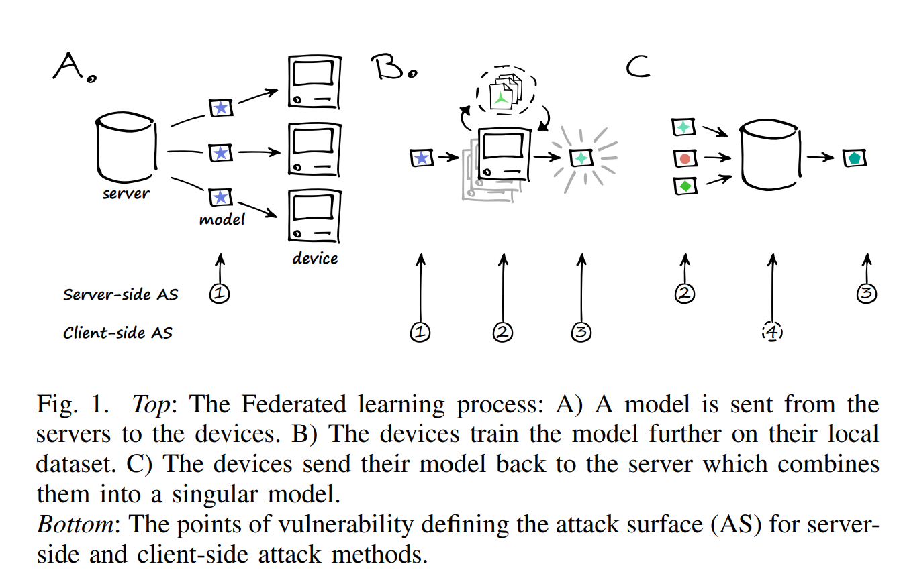
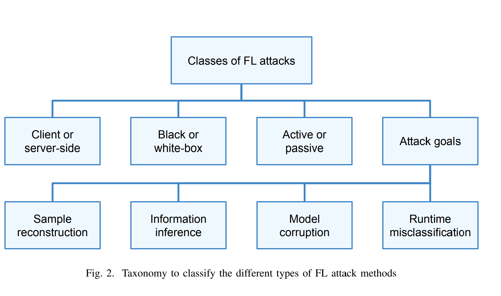
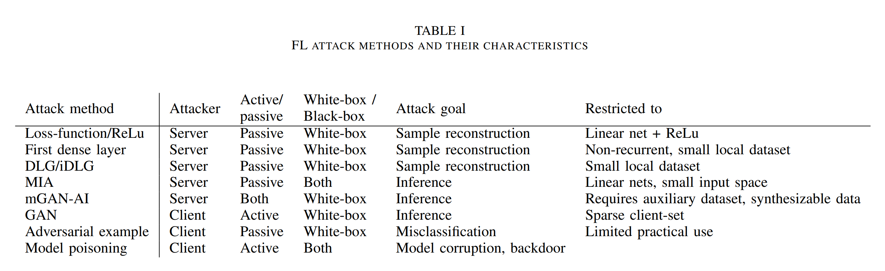

# 联邦学习面临的威胁

## An Overview of Federated Deep Learning Privacy Attacks and Defensive Strategies. 
> David Enthoven Zaid Al-Ars 2020-04-01 Citation: 0 [Download here](https://arxiv.org/pdf/2004.04676.pdf)
联邦学习仍有可能泄露隐私信息，需要更为结构化的风险评估。

### 联邦学习威胁模型

#### 攻击面
敌方攻击FL模型有两个目的：
- 从客户端提取隐私数据；
- 驱使模型做出有利于敌方的预测。

攻击形式可能有：
- 引入后门
- 造成错误分类
- 使模型不可用

敌方可能以下列形式存在：
- 某个联合学习的参与者；
- 联合学习中心服务器；
- 如果参与者与中心服务器间的通信未实现安全加密，那么敌方还有可能是未知的中间人。

如上图所示，恶意server可能的攻击面：
- 恶意修改模型，并发送给联合学习参与者（client）；
- 肆意制定联合学习参与规则；
- 在聚合模型前，有意区分来自客户端的模型更新；
- 掌控聚合后模型。

如上图所示，恶意clients可能的攻击面：
- 可以访问聚合模型
- 操纵客户端数据训练模型
- 操纵训练过程
- 操纵梯度更新
- 在聚合过程中产生影响

如下图所示，FL攻击有以下分类：
- 客户或服务器端攻击
- 黑盒或白盒攻击
- 主动或被动攻击
- 攻击目的
  - 样本重塑
  - 信息推断
  - 模型破坏
  - 实时错误分类

FL攻击方法和特点：

## Advances and Open Problems in Federated Learning
>https://arxiv.org/pdf/1912.04977.pdf
>Peter Kairouz 2019