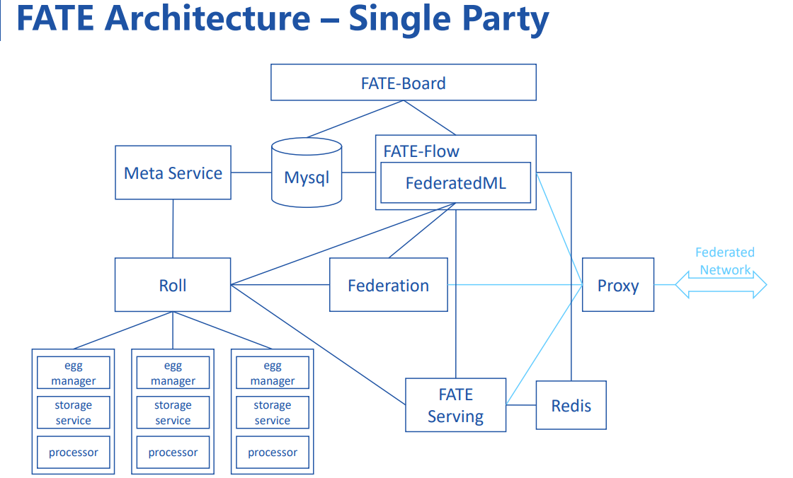
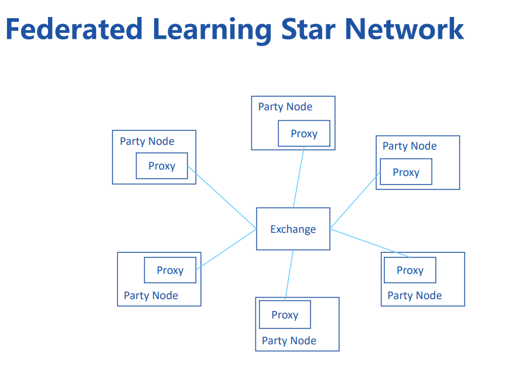
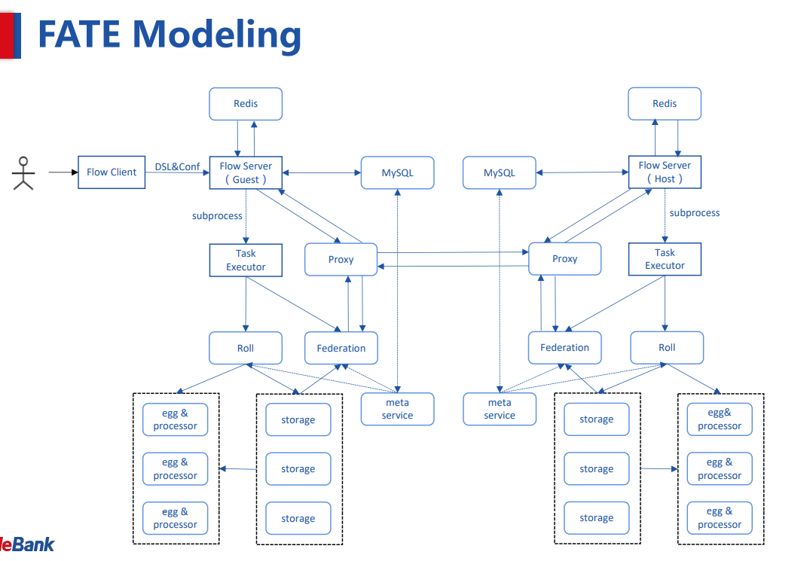
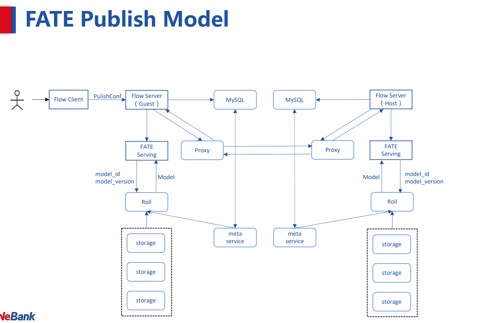
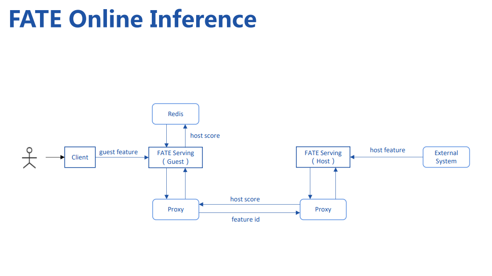

# 联邦学习项目 [FATE](https://github.com/FederatedAI/FATE/tree/master)

## FATE 中的概念

- FATE Client：是用于与FATE交互的工具。
- Pipeline：一个high-level的API，允许用户以序列化方式设计、启动、查询 FATE 作业。
- FATE Flow Command Line Interface（CLI）命令行接口，可以设计、启动、查询FATE jobs。
- Guest：代表联邦学习的发起方（例如，想通过联合学习来提升模型性能的一方）。
- Host：代表联合学习的参与方（例如，可能拥有比较多的数据）。
- 横向联邦学习（HFT)：本质是样本的联合，即扩展数据表的行。常见于，参与者业务相同、特征相同、用户不同。
- 纵向联邦学习（VFT）：本质是特征的联合，即扩列。常见于参与者业务不同、特征不同、用户不同。


## FATE 架构










## 主要目录

### fate_flow
联邦学习模块运行和管理的主要模块，用于提交任务、解析参数、生成作业、执行作业、保存和查询日志等功能

### federatedml
联邦机器学习的主要实现模块，包括各类特征预处理、横向/纵向场景的机器学习等，这个模块是我们后面需要详细了解的

### arch
由于我们的框架可以进行分布式计算，所以fate对后台的计算框架进行了api层面的封装，如基础的数据表计算和存储操作、变量数据传输的封装

### eggroll
微众开发的一个分布式计算框架，fate同时支持eggroll和fate作为后端的计算框架

### dsl文件

dsl.json 描述了联邦学习过程中的各个模块（例如数据准备、特征预处理、建模、评估等）的输入输出信息。

例如：homo_logistic_regression/test_homolr_train_job_dsl.jsonz中总共定义了三个模块，分别是dataio、 homo_lr、 evaluation ，这三个模块执行的任务为载入数据、横向逻辑回归建模、评估。具体内容如下：

```json
{
    "components" : {
        "dataio_0": {
            "module": "DataIO",
            "input": {
                "data": {
                    "data": [
                        "args.train_data"
                    ]
                }
            },
            "output": {
                "data": ["train"],
                "model": ["dataio"]
            }
         },
        "homo_lr_0": {
            "module": "HomoLR",
            "input": {
                "data": {
                    "train_data": [
                        "dataio_0.train"
                    ]
                }
            },
            "output": {
                "data": ["train"],
                "model": ["homolr"]
            }
        },
        "evaluation_0": {
            "module": "Evaluation",
            "input": {
                "data": {
                    "data": [
                        "homo_lr_0.train"
                    ]
                }
            },
            "output": {
                "data": ["evaluate"]
            }
        }
    }
}
```
### runtime文件

这个模块主要描述了各个模块的具体运行时的配置参数，包括任务的发起者、训练数据表名、训练参数、加密方式等.

例如：
```json
{
  "initiator": {
    "role": "guest",
    "party_id": 10000
  },
  "job_parameters": {
    "work_mode": 0
  },
  "role": {
    "guest": [
      10000
    ],
    "host": [
      10000
    ],
    "arbiter": [
      10000
    ]
  },
  "role_parameters": {
    "guest": {
      "args": {
        "data": {
          "train_data": [
            {
              "name": "default_credit_homo_guest",
              "namespace": "default_credit_homo_guest_guest"
            }
          ]
        }
      }
    },
    "host": {
      "args": {
        "data": {
          "train_data": [
            {
              "name": "default_credit_homo_host",
              "namespace": "default_credit_homo_host_host"
            }
          ]
        }
      },
      "evaluation_0": {
        "need_run": [
          false
        ]
      }
    }
  },
  "algorithm_parameters": {
    "dataio_0": {
      "with_label": true,
      "label_name": "y",
      "label_type": "int",
      "output_format": "dense"
    },
    "homo_lr_0": {
      "penalty": "L2",
      "optimizer": "sgd",
      "eps": 1e-05,
      "alpha": 0.01,
      "max_iter": 10,
      "converge_func": "diff",
      "batch_size": 500,
      "learning_rate": 0.15,
      "decay": 1,
      "decay_sqrt": true,
      "init_param": {
        "init_method": "zeros"
      },
      "encrypt_param": {
        "method": "Paillier"
      },
      "cv_param": {
        "n_splits": 4,
        "shuffle": true,
        "random_seed": 33,
        "need_cv": false
      }
    }
  }
}
```
## Install FATE in Host（单机版安装）

### 检查本地端口 8080,9360,9380 是否可用：

```
netstat -apln|grep 8080
netstat -apln|grep 9360
netstat -apln|grep 9380
```

### 下载stand-alone version 压缩包并解压。

```
wget https://webank-ai-1251170195.cos.ap-guangzhou.myqcloud.com/standalone-fate-master-1.5.0.tar.gz

tar -xzvf  standalone-fate-master-1.5.0.tar.gz
```
### 解压后进入目录，然后执行 init.sh.
```
cd standalone-fate-master-1.5.0
sh init.sh init
```
### Test

#### Unit Test
```
cd standalone-fate-master-1.5.0
source bin/init_env.sh
bash ./python/federatedml/test/run_test.sh
```

如果成功，屏幕应显示如下字符：
>there are 0 failed test

#### Toy_example Test
Toy_example 是一个面向开发者的示例。可用于了解如何开发应用FATE框架的学习算法。

```
cd standalone-fate-master-1.5.0
source bin/init_env.sh
python ./examples/toy_example/run_toy_example.py 10000 10000 0
```
如果成功，屏幕应显示如下字符：
> success to calculate secure_sum, it is 2000.0

这里我个人运行时，出现了错误：
> "failed to exec task, status:{}, stderr is {} stdout:{}".format(status, stderr, stdout))
ValueError: failed to exec task, status:100, stderr is None stdout:{'retcode': 100, 'retmsg': 'Connection refused, Please check if the fate flow service is started'}

此时，需要先执行下列命令：
```
cd standalone-fate-master-1.5.0

sudo chmod 755  python/fate_flow/service.sh 

python/fate_flow/service.sh  start
```

运行结果如下：

```
[leo@localhost standalone-fate-master-1.5.0]$  python/fate_flow/service.sh start
PROJECT_BASE: /home/leo/Downloads/standalone-fate-master-1.5.0
PYTHONPATH: /home/leo/Downloads/standalone-fate-master-1.5.0/python
EGGROLL_HOME: 
SPARK_HOME: 
found service conf: /home/leo/Downloads/standalone-fate-master-1.5.0/conf/service_conf.yaml
fate flow http port: 9380, grpc port: 9360

service start sucessfully. pid: 3290
status:leo        3290  109  7.2 842524 72452 pts/0    Sl+  18:39   0:02 python /home/leo/Downloads/standalone-fate-master-1.5.0/python/fate_flow/fate_flow_server.py
python  3290  leo   14u  IPv4  56973      0t0  TCP localhost:boxp (LISTEN)
python  3290  leo   11u  IPv6  56972      0t0  TCP localhost:9360 (LISTEN)
[leo@localhost standalone-fate-master-1.5.0]$ python ./examples/toy_example/run_toy_example.py 10000 10000 0
stdout:{
    "data": {
        "board_url": "http://127.0.0.1:8080/index.html#/dashboard?job_id=202101061839496568931&role=guest&party_id=10000",
        "job_dsl_path": "/home/leo/Downloads/standalone-fate-master-1.5.0/jobs/202101061839496568931/job_dsl.json",
        "job_id": "202101061839496568931",
        "job_runtime_conf_on_party_path": "/home/leo/Downloads/standalone-fate-master-1.5.0/jobs/202101061839496568931/guest/job_runtime_on_party_conf.json",
        "job_runtime_conf_path": "/home/leo/Downloads/standalone-fate-master-1.5.0/jobs/202101061839496568931/job_runtime_conf.json",
        "logs_directory": "/home/leo/Downloads/standalone-fate-master-1.5.0/logs/202101061839496568931",
        "model_info": {
            "model_id": "guest-10000#host-10000#model",
            "model_version": "202101061839496568931"
        },
        "pipeline_dsl_path": "/home/leo/Downloads/standalone-fate-master-1.5.0/jobs/202101061839496568931/pipeline_dsl.json",
        "train_runtime_conf_path": "/home/leo/Downloads/standalone-fate-master-1.5.0/jobs/202101061839496568931/train_runtime_conf.json"
    },
    "jobId": "202101061839496568931",
    "retcode": 0,
    "retmsg": "success"
}


job status is running
job status is running
job status is running
[INFO] [2021-01-06 18:39:53,281] [3531:140216353404736] - secure_add_guest.py[line:99]: begin to init parameters of secure add example guest
[INFO] [2021-01-06 18:39:53,282] [3531:140216353404736] - secure_add_guest.py[line:102]: begin to make guest data
[INFO] [2021-01-06 18:39:53,432] [3531:140216353404736] - secure_add_guest.py[line:105]: split data into two random parts
[INFO] [2021-01-06 18:39:54,898] [3531:140216353404736] - secure_add_guest.py[line:108]: share one random part data to host
[INFO] [2021-01-06 18:39:55,143] [3531:140216353404736] - secure_add_guest.py[line:111]: get share of one random part data from host
[INFO] [2021-01-06 18:39:55,572] [3531:140216353404736] - secure_add_guest.py[line:114]: begin to get sum of guest and host
[INFO] [2021-01-06 18:39:56,115] [3531:140216353404736] - secure_add_guest.py[line:117]: receive host sum from guest
[INFO] [2021-01-06 18:39:56,140] [3531:140216353404736] - secure_add_guest.py[line:124]: success to calculate secure_sum, it is 1999.9999999999998

```

**TODO: 这里令我感兴趣的是MPC相关操作：“split data into two random parts...share one random part data to host...get share of one random part data from host..."**


要深入理解FATE或将自己的想法加入FATE，需要通过Debug完成跟踪FATE进程。

## FATE 深入理解

### FATE fLOW
Fate-Flow 是一个作业调度系统，实现了完整的联邦学习作业生命周期管理，包括：数据输入、训练作业调度、指标跟踪、模型中心和别的功能。

目前FATE-Flow支持：
- DAG（directed-acyclic-graph） 定义 Pipeline ,概念可参考 [ML Pipelines](http://spark.apache.org/docs/latest/ml-pipeline.html)。
- j使用FATE-DSL(son格式)描述 DAG 。
- 高级调度框架，基于全局状态和优化的锁调度，一方 DAG 调度、多方协作调度、以及支持多个调度器。
- 灵活的调度策略，支持 start 、stop、rerun等
- 精细化资源调度能力，基于不同计算引擎的核心、内存、巩固走节点策略支持。
- 实时跟踪，实时追踪运行中的数据、参数、模型和指标。
- 联邦学习模型注册、模型管理、联合一致性、导入导出、集群间迁移
- 提供CLI，HTTP API,python SDK

#### fate flow 架构


#### 基本流程
- 使用DispatcherMiddleware初始化app， 包含多个组件，例如：
  - data 访问
  - 模型管理
  - 作业管理
  - 表管理
  - tracking 管理
  - pipeline 管理
  - 权限管理
  - 版本管理
  - party（参与方）管理
  - 初始化管理
  - tracker 管理
  - proxy 管理

- 初始化 flow db
- 初始化 arch db
- 加载命令行参数
- 初始化运行环境
- 设置进程角色  `RuntimeConfig.set_process_role(ProcessRole.DRIVER)`
- 初始化授权
- 服务工具注册
- 检测器启动
- DAG调度器启动
- grpc.server 服务器初始化
- 增加数据转换服务为服务器者到服务器
- 增加不安全的端口
- 服务器启动
- run_simple()
- 启动日志
- 休眠一天，直到键盘强制退出。

## Fate 中的安全协议

> https://fate.readthedocs.io/en/latest/_build_temp/python/federatedml/README.html#secure-protocol

- 加密
  - Paillier encryption
  - Affine Homomorphic Encryption
  - IterativeAffine Homomorphic Encryption
  - RSA encryption
  - Fake encryption
- 编码
- Diffne Hellman Key 交换
- SecretShare MPC 协议(SPDZ)
- Oblivious Transfer
### 加密

#### Paillier

一种加法同态加密算法，属于概率的非对称算法。

##### 密钥生成

需要两个大的素数。生成器随机选两个大素数p 和 q，比特长度可以设定。然后 p和q可用作私钥来生成公钥。

##### 加密过程
- 编码：Paillier 算法仅适用于整数。所以输入的数字必须被编码为整数。
- 加密：加密规则可以参考[这里](https://en.wikipedia.org/wiki/Paillier_cryptosystem)或[论文](http://www.cs.tau.ac.il/~fiat/crypt07/papers/Pai99pai.pdf)。
- 应用混淆器：应用一种混淆器，使每个加密的数字均不同，即便其明文相同。

##### 解密过程

- 解密：使用上述加密规则相同的规则。
- 解码：将已编码数据进行解码。

##### 加法和标量乘法（Scalar Mulitiplication）
参考的加密详情。

#### Affine 同态加密

Affine 也是一种加法同态加密算法。

##### 密钥生成
首先生成一个大的正数，然后生成另外3个大的整数：$a,a^{-1},b,(a,n)=1,a*a^{-1}\equiv 1(mod n)$

##### 加密

$E(x) = (a*x+b)(mod \space n)$

记录为$(E(x),1)$， E(x)是密文，1 意味着 bias b为1.
##### 加法和标量乘法（Scalar Mulitiplication）
$E(x + y) = (E(x), 1) + (E(y), 1) = ((a * x + b) + (a * y + b), 1 + 1) = ((a * (x + y) + 2 * b), 2) = (E(x + y), 2)$

$scalar * E(x) = Scalar * (E(x), 1) = (E(scalar * x), scalar * 1)$

##### 解密

Decrypt((E(x), k))

$(E(x), k) = a * x + k * b, Dec((E(x), k) = a^{-1} * (E(x) - k * b) \pmod{n} = a^{-1} * (a * x) \pmod{n} = x \pmod{n}$

### 编码

编码指的是“md5”, “sha1”, “sha224”, “sha256”, “sha384”, “sha512” 这些方法。

### Diffne Hellman 密钥交换

用于在公开信道种交换密钥。

#### 协议
- keygen：生成大素数 p 和 g，where g is a primitive root modulo p。
- Alice 生成随机数 r1；
- Bob 生成随机数 r2；
- Alice 计算$g^{r1} (mod \space p)$然后发送给 Bob；
- Bob计算 $g^{r2} (mod \space p)$ 然后发送给Alice；
- Alice计算$(g^{r2})^{r1} (mod \space p) = g^{r1*r2}(mod \space p)$;
- Bob计算$(g^{r1})^{r2} (mod \space p) = g^{r1*r2}(mod \space p)$; 
- 这里 $g^{r1*r2}( mod \space p)$是共享密钥。

#### 如何使用?

```python
from federatedml.secureprotol.diffie_hellman import DiffieHellman
p, g = DiffieHellman.key_pair()
import random
r1 = random.randint(1, 10000000)
r2 = random.randint(1, 10000000)
key1 = DiffieHellman.decrypt(DiffieHellman.encrypt(g, r1, p), r2, p)
key2 = DiffieHellman.decrypt(DiffieHellman.encrypt(g, r2, p), r1, p)
assert key1 == key2

```

### 秘密共享 MPC 协议 （SPDZ）

SPDZ ([Ivan Damg](https://eprint.iacr.org/2011/535.pdf) ,[ mARCEL kELLER](https://eprint.iacr.org/2017/1230.pdf))是一种多方计算模式，基于某种同态加密（SHE）.

#### 如何使用

```python
from arch.api import session
from arch.api import federation
s = session.init("session_name", 0)
federation.init("session_name", {
    "local": {
        "role": "guest",
        "party_id": 1000
    },
    "role": {
        "host": [999],
        "guest": [1000]
    }
 })
partys = federation.all_parties()

# [Party(role=guest, party_id=1000), Party(role=host, party_id=999)]
```
#### spdz 环境
tensor should be created and processed in spdz env:
```
from federatedml.secureprotol.spdz import SPDZ
with SPDZ() as spdz:
    ...
```
#### 生成 tensor
当前FATE使用了两种固定点的tensor实现：

##### 一种是基于 numpy array的供非分布式使用的

```python
from federatedml.secureprotol.spdz.tensor.fixedpoint_numpy import FixedPointTensor

# on guest side(assuming local Party is partys[0]):
import numpy as np
data = np.array([[1,2,3], [4,5,6]])
with SPDZ() as spdz:
    x = FixedPointTensor.from_source("x", data)
    y = FixedPointTensor.from_source("y", partys[1])

# on host side(assuming PartyId is partys[1]):
import numpy as np
data = np.array([[3,2,1], [6,5,4]])
with SPDZ() as spdz:
    y = FixedPointTensor.from_source("y", data)
    x = FixedPointTensor.from_source("x", partys[1])
```
##### 另一种基于表，供分布的使用

```
from federatedml.secureprotol.spdz.tensor.fixedpoint_table import FixedPointTensor

# on guest side(assuming PartyId is partys[0]):
data = session.parallelize(np.array([1,2,3]), np.array([4,5,6]))
with SPDZ() as spdz:
x = FixedPointTensor.from_source("x", data)
y = FixedPointTensor.from_source("y", party_1)

# on host side(assuming PartyId is partys[1]):
data = session.parallelize(np.array([3,2,1]), np.array([6,5,4]))
    with SPDZ() as spdz:
        y = FixedPointTensor.from_source("y", data)
        x = FixedPointTensor.from_source("x", party_0)
```
tensor 由某个给定数据生成后，数据被划分为n份，每个参与方会得到一份。

#### 数据重构

可以通过传感器重构数值

```python
x.get() # array([[1, 2, 3],[4, 5, 6]])
y.get() # array([[3, 2, 1],[6, 5, 4]])
```

#### 加、减
```
z = x + y
t = x - y
```
#### 点乘
```
x.dot(y)
```

#### einsum(仅支持numpy 版本)
When using numpy’s tensor, powerful einsum arithmetic is available:

```x.einsum(y, "ij,kj->ik")  # dot```

### Oblivious Transfer
FATE implements Oblivious Transfer(OT) protocol based on work by Eduard Hauck and Julian Loss. For more information, please refer [here](https://eprint.iacr.org/2017/1011).


## 加密相关类
### EncryptParam
定义用在联合学习中的加密方法
```class EncryptParam(method='Paillier', key_length=1024)```

### EncryptedModeCalculatorParam
定义加密模式计算器的参数

```class EncryptedModeCalculatorParam(mode='strict', re_encrypted_rate=1```

mode取值：
- strict,默认
- fast
- balance
- confusion_opt
- only

