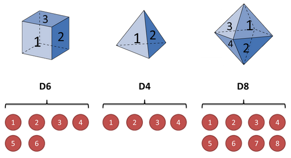
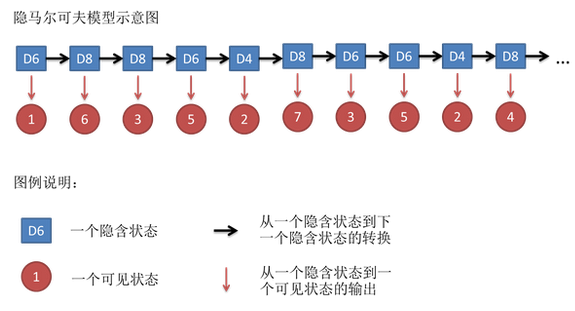
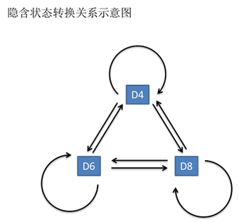

# 隐式马尔科夫模型 HMM

## 熵 Entropy

熵是表示物质系统状态的一种度量，用它老表征系统的无序程度。
- 熵越大，系统越无序，意味着系统结构和运动的不确定和无规则；
- 熵越小，系统越有序，意味着具有确定和有规则的运动状态。
- 熵的中文意思是热量被温度除的商。负熵是物质系统有序化，组织化，复杂化状态的一种度量。

从微观看，熵就表现了这个系统所处状态的不确定性程度。香农描述一个信息系统的时候就借用了熵的概念。信息熵表示的是这个信息系统的平均信息量(平均不确定程度)。

### 最大熵模型
我们在投资时常常讲不要把所有的鸡蛋放在一个篮子里，这样可以降低风险。在信息处理中，这个原理同样适用。在数学上，这个原理称为最大熵原理(the maximum entropy principle)。

“最大熵”这个名词听起来很深奥，但是它的原理很简单，我们每天都在用。说白了，就是要保留全部的不确定性，将风险降到最小。当我们遇到不确定问题，有多个答案时，应该选择哪个答案是很难说清楚的。这时我们想能不能把所有可能性保留下来，建立一个模型，之后在一步步分析得到结果。问题是有没有可能建立这个模型？

匈牙利著名数学家、信息论最高奖香农奖得主希萨（Csiszar）证明，对任何一组不自相矛盾的信息，这个最大熵模型不仅存在，而且是唯一的。而且它们都有同一个非常简单的形式——指数函数。

假设我们由两个特征w1,w2，要预测w3，那么w3的概率函数形式如下：
$P(w3|w1,w2,subject) = \frac{e^{\lambda_1(w1,w2,w3) + \lambda_2(subject,w3)}}{Z(w1,w2,subject)}$

上面的参数$\lambda_1,\lambda_2,Z$，他们需要通过观测数据训练出来。最大熵模型在形式上是最漂亮的统计模型，而在实现上是最复杂的模型之一。

我们上次谈到用最大熵模型可以将各种信息综合在一起。我们留下一个问题没有回答，就是如何构造最大熵模型。我们已经所有的最大熵模型都是指数函数的形式，现在只需要确定指数函数的参数就可以了，这个过程称为模型的训练。

最原始的最大熵模型的训练方法是一种称为通用迭代算法 GIS(generalized iterative scaling) 的迭代 算法。GIS 的原理并不复杂，大致可以概括为以下几个步骤：
- 假定第零次迭代的初始模型为等概率的均匀分布。
- 用第 N 次迭代的模型来估算每种信息特征在训练数据中的分布，如果超过了实际的，就把相应的模型参数变小；否则，将它们便大。
- 重复步骤 2 直到收敛。

GIS 最早是由 Darroch 和 Ratcliff 在七十年代提出的。但是，这两人没有能对这种算法的物理含义进行很好地解释。后来是由数学家希萨（Csiszar)解释清楚的，因此，人们在谈到这个算法时，总是同时引用 Darroch 和Ratcliff 以及希萨的两篇论文。GIS 算法每次迭代的时间都很长，需要迭代很多次才能收敛，而且不太稳定，即使在 64 位计算机上都会出现溢出。因此，在实际应用中很少有人真正使用 GIS。大家只是通过它来了解最大熵模型的算法。

由于最大熵模型在数学上十分完美，对科学家们有很大的诱惑力，因此不少研究者试图把自己的问题用一个类似最大熵的近似模型去套。谁知这一近似，最大熵模型就变得不完美了，结果可想而知，比打补丁的凑合的方法也好不了多少。于是，不少热心人又放弃了这种方法。第一个在实际信息处理应用中验证了最大熵模型的优势的，是宾夕法尼亚大学马库斯的另一个高徒原 IBM 现微软的研究员拉纳帕提(Adwait Ratnaparkhi)。拉纳帕提的聪明之处在于他没有对最大熵模型进行近似，而是找到了几个最适合用最大熵模型、而计算量相对不太大的自然语言处理问题，比如词性标注和句法分析。拉纳帕提成功地将上下文信息、词性（名词、动词和形容词等）、句子成分（主谓宾）通过最大熵模型结合起来，做出了当时世界上最好的词性标识系统和句法分析器。拉纳帕提的论文发表后让人们耳目一新。拉纳帕提的词性标注系统，至今仍然是使用单一方法最好的系统。科学家们从拉纳帕提的成就中，又看到了用最大熵模型解决复杂的文字信息处理的希望。

最大熵模型，可以说是集简与繁于一体，形式简单，实现复杂。值得一提的是，在Google的很多产品中，比如机器翻译，都直接或间接地用到了最大熵模型。

## 隐马尔可夫模型（HMM）

隐马尔可夫模型（Hidden Markov Model，HMM）是统计模型，它用来描述一个含有隐含未知参数的马尔可夫过程。其难点是从可观察的参数中确定该过程的隐含参数。然后利用这些参数来作进一步的分析，例如模式识别，是在被建模的系统被认为是一个马尔可夫过程与未观测到的（隐藏的）的状态的统计马尔可夫模型。

下面用一个简单的例子来阐述：

假设我手里有三个不同的骰子。第一个骰子是我们平常见的骰子（称这个骰子为D6），6个面，每个面（1，2，3，4，5，6）出现的概率是1/6。第二个骰子是个四面体（称这个骰子为D4），每个面（1，2，3，4）出现的概率是1/4。第三个骰子有八个面（称这个骰子为D8），每个面（1，2，3，4，5，6，7，8）出现的概率是1/8。

假设我们开始掷骰子，我们先从三个骰子里挑一个，挑到每一个骰子的概率都是1/3。然后我们掷骰子，得到一个数字，1，2，3，4，5，6，7，8中的一个。不停的重复上述过程，我们会得到一串数字，每个数字都是1，2，3，4，5，6，7，8中的一个。例如我们可能得到这么一串数字（掷骰子10次）：1 6 3 5 2 7 3 5 2 4。

这串数字叫做可见状态链。但是在隐马尔可夫模型中，我们不仅仅有这么一串可见状态链，还有一串**隐含状态链**。在这个例子里，这串隐含状态链就是你用的骰子的序列。比如，隐含状态链有可能是：D6 D8 D8 D6 D4 D8 D6 D6 D4 D8。

一般来说，HMM中说到的马尔可夫链其实是指隐含状态链，因为隐含状态（骰子）之间存在**转换概率（transition probability）**。在我们这个例子里，D6的下一个状态是D4，D6，D8的概率都是1/3。D4，D8的下一个状态是D4，D6，D8的转换概率也都一样是1/3。这样设定是为了最开始容易说清楚，但是我们其实是可以随意设定转换概率的。比如，我们可以这样定义，D6后面不能接D4，D6后面是D6的概率是0.9，是D8的概率是0.1。这样就是一个新的HMM。

同样的，尽管可见状态之间没有转换概率，但是隐含状态和可见状态之间有一个概率叫做**输出概率（emission probability）**。就我们的例子来说，六面骰（D6）产生1的输出概率是1/6。产生2，3，4，5，6的概率也都是1/6。我们同样可以对输出概率进行其他定义。比如，我有一个被赌场动过手脚的六面骰子，掷出来是1的概率更大，是1/2，掷出来是2，3，4，5，6的概率是1/10。

其实对于HMM来说，如果提前知道所有隐含状态之间的转换概率和所有隐含状态到所有可见状态之间的输出概率，做模拟是相当容易的。但是应用HMM模型时候呢，往往是缺失了一部分信息的，有时候你知道骰子有几种，每种骰子是什么，但是不知道掷出来的骰子序列；有时候你只是看到了很多次掷骰子的结果，剩下的什么都不知道。如果应用算法去估计这些缺失的信息，就成了一个很重要的问题。这些算法我会在下面详细讲。

和HMM模型相关的算法主要分为三类，分别解决三种问题：
- 知道骰子有几种（隐含状态数量），每种骰子是什么（转换概率），根据掷骰子掷出的结果（可见状态链），推算每次掷出来的都是哪种骰子（隐含状态链）？
  - 这个问题在语音识别领域称为解码问题。
  - 问题求解有两种解法：第一种称为求最大似然状态路径（观测结果中概率最大的序列）；第二种解法是求每个显性状态的隐含状态的概率
- 知道骰子有几种（隐含状态数量），每种骰子是什么（转换概率），根据掷骰子掷出的结果（可见状态链），推算掷出这个结果的概率？
- 知道骰子有几种（隐含状态数量），不知道每种骰子是什么（转换概率），观测到很多次掷骰子的结果（可见状态链），想反推出每种骰子是什么（转换概率）？
  - 最常见的情况。很多时候我们只有可见结果，不知道HMM模型里的参数，我们需要从可见结果估计出这些参数

（未完）

## 参考
- https://www.cnblogs.com/skyme/p/4651331.html