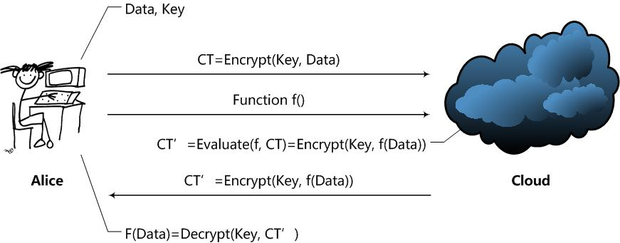

# 同态加密

本文主要参考刘巍然知乎问答 https://www.zhihu.com/question/27645858/answer/37598506

## 什么是同态加密？

提出第一个构造出全同态加密（Fully Homomorphic Encryption）[Gen09]的Craig Gentry给出的直观定义最好：

> A way to delegate processing of your data, without giving away access to it.一种委托处理数据的方法，但不放弃其访问权。

这是什么意思呢？一般的加密方案关注的都是数据存储安全。即，我要给其他人发个加密的东西，或者要在计算机或者其他服务器上存一个东西，我要对数据进行加密后在发送或者存储。

没有密钥的用户，不可能从加密结果中得到有关原始数据的任何信息。只有拥有密钥的用户才能够正确解密，得到原始的内容。

我们注意到，这个过程中用户是不能对加密结果做任何操作的，只能进行存储、传输。对加密结果做任何操作，都将会导致错误的解密，甚至解密失败。

同态加密方案最有趣的地方在于，其关注的是数据处理安全。同态加密提供了一种对加密数据进行处理的功能。也就是说，其他人可以对加密数据进行处理，但是处理过程不会泄露任何原始内容。同时，拥有密钥的用户对处理过的数据进行解密后，得到的正好是处理后的结果。

这里要用到同态的特性，即在无法取得数据的条件下直接对加密结果进行处理，且不影响解密后得到处理结果。这么好的特性肯定会带来一些缺点。同态加密现在最需要解决的问题在于：效率。效率一词包含两个方面，一个是加密数据的处理速度，一个是这个加密方案的数据存储量。

###  现有同态加密方案

第一个构造出全同态加密方案的人是Gentry，这是他在Stanford攻读博士学位的研究成果。Gentry毕业后去哪里了呢？IBM。大家知道IBM可是一个云服务提供商啊！在IBM，Gentry和另一个密码学大牛Halevi继续进行同态加密及其相关的研究，并实现了一些同态加密方案。如果IBM真的做出了可以在实际使用的同态加密方案，那么其他云服务提供商就可以拜拜了啊！这游戏不用玩了啊，人家能在不知道数据内容得前提下处理数据啊，毕竟谁都不想把数据泄露给其他公司啊！

## 同态加密的定义、安全性和简单实例

### 定义
在云计算环境下

Alice通过Cloud，以Homomorphic加密（简称HE）处理数据的整个过程如下：
- Alice对数据进行加密，并把加密后的数据发送给cloud；
- Alice向Cloud提交数据的处理方法，用函数f表示；
- Cloud在函数f下对数据进行处理，并将处理后结果发给Alice；
- Alice对数据进行解密，得到结果。

由上可知，在一个HE方案中应该拥有以下函数：
- KeyGen函数：密钥生成函数。这个函数应该由Alice运行，用于产生加密数据Data所用的密钥Key。当然了，应该还有一些公开常数PP（Public Parameter）；
- Encrypt函数：加密函数。这个函数也应该由Alice运行，用Key对用户数据Data进行加密，得到密文CT（Ciphertext）；
- Evaluate函数：评估函数。这个函数由Cloud运行，在用户给定的数据处理方法f下，对密文进行操作，使得结果相当于用户用密钥Key对f(Data)进行加密。
- Decrypt函数：解密函数。这个函数由Alice运行，用于得到Cloud处理的结果f(Data)。

那么，f应该是什么样子的呢？HE方案是支持任意的数据处理方法f？还是说只支持满足一定条件的f呢？根据f的限制条件不同，HE方案实际上分为了两类：
- Fully Homomorphic Encryption (FHE)：这意味着HE方案支持任意给定的f函数，只要这个f函数可以通过算法描述，用计算机实现。显然，FHE方案是一个非常棒的方案，但是计算开销极大，暂时还无法在实际中使用。
- Somewhat Homomorphic Encryption (SWHE)：这意味着HE方案只支持一些特定的f函数。SWHE方案稍弱，但也意味着开销会变得较小，容易实现，现在已经可以在实际中使用。

未完，
