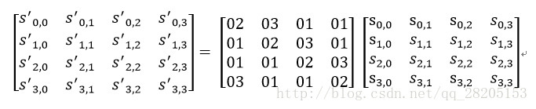

# 对称密码
## AES
内容来源：https://blog.csdn.net/qq_28205153/article/details/55798628

### 基本介绍
高级加密标准(AES,Advanced Encryption Standard)为最常见的对称加密算法(微信小程序加密传输就是用这个加密算法的)。


下面简单介绍下各个部分的作用与意义：

- 明文P: 没有经过加密的数据。

- 密钥K: 用来加密明文的密码，在对称加密算法中，加密与解密的密钥是相同的。密钥为接收方与发送方协商产生，但不可以直接在网络上传输，否则会导致密钥泄漏，通常是通过非对称加密算法加密密钥，然后再通过网络传输给对方，或者直接面对面商量密钥。密钥是绝对不可以泄漏的，否则会被攻击者还原密文，窃取机密数据。
- AES加密函数: 设AES加密函数为E，则 C = E(K, P),其中P为明文，K为密钥，C为密文。也就是说，把明文P和密钥K作为加密函数的参数输入，则加密函数E会输出密文C。
- 密文C: 经加密函数处理后的数据
- AES解密函数: 设AES解密函数为D，则 P = D(K, C),其中C为密文，K为密钥，P为明文。也就是说，把密文C和密钥K作为解密函数的参数输入，则解密函数会输出明文P。

### AES的基本结构
AES为分组密码，分组密码也就是把明文分成一组一组的，每组长度相等，每次加密一组数据，直到加密完整个明文。在AES标准规范中，分组长度只能是128位，也就是说，每个分组为16个字节（每个字节8位）。密钥的长度可以使用128位、192位或256位。密钥的长度不同，推荐加密轮数也不同，如下表所示：

|AES|	密钥长度（32位比特字)	|分组长度(32位比特字)|	加密轮数|
|-|-|-|-|
|AES-128|	4|	4|	10|
|AES-192|	6|	4|	12|
|AES-256|	8|	4|	14|

轮数在下面介绍，这里实现的是AES-128，也就是密钥的长度为128位，加密轮数为10轮。 
上面说到，AES的加密公式为C = E(K,P)，在加密函数E中，会执行一个轮函数，并且执行10次这个轮函数，这个轮函数的前9次执行的操作是一样的，只有第10次有所不同。也就是说，一个明文分组会被加密10轮。AES的核心就是实现一轮中的所有操作。

AES的处理单位是字节，128位的输入明文分组P和输入密钥K都被分成16个字节，分别记为P = P0 P1 … P15 和 K = K0 K1 … K15。如，明文分组为P = abcdefghijklmnop,其中的字符a对应P0，p对应P15。一般地，明文分组用字节为单位的正方形矩阵描述，称为状态矩阵。在算法的每一轮中，状态矩阵的内容不断发生变化，最后的结果作为密文输出。该矩阵中字节的排列顺序为从上到下、从左至右依次排列，如下图所示：


现在假设明文分组P为”abcdefghijklmnop”，则对应上面生成的状态矩阵图如下： 


上图中，0x61为字符a的十六进制表示。可以看到，明文经过AES加密后，已经面目全非。

类似地，128位密钥也是用字节为单位的矩阵表示，矩阵的每一列被称为1个32位比特字。通过**密钥编排函数**该密钥矩阵被扩展成一个44个字组成的序列W[0],W[1], … ,W[43],该序列的前4个元素W[0],W[1],W[2],W[3]是原始密钥，用于加密运算中的初始密钥加（下面介绍）;后面40个字分为10组，每组4个字（128比特）分别用于10轮加密运算中的轮密钥加，如下图所示：


上图中，设K = “abcdefghijklmnop”，则K0 = a, K15 = p, W[0] = K0 K1 K2 K3 = “abcd”。

AES的整体结构如下图所示，其中的W[0,3]是指W[0]、W[1]、W[2]和W[3]串联组成的128位密钥。加密的第1轮到第9轮的轮函数一样，包括4个操作：字节代换、行位移、列混合和轮密钥加。最后一轮迭代不执行列混合。另外，在第一轮迭代之前，先将明文和原始密钥进行一次异或加密操作。


上图也展示了AES解密过程，解密过程仍为10轮，每一轮的操作是加密操作的逆操作。由于AES的4个轮操作都是可逆的，因此，解密操作的一轮就是顺序执行逆行移位、逆字节代换、轮密钥加和逆列混合。同加密操作类似，最后一轮不执行逆列混合，在第1轮解密之前，要执行1次密钥加操作。

下面分别介绍AES中一轮的4个操作阶段，这4分操作阶段使输入位得到充分的混淆。

### 字节代换
#### 字节代换操作

AES的字节代换其实就是一个简单的查表操作。AES定义了一个S盒和一个逆S盒。 
AES的S盒：


状态矩阵中的元素按照下面的方式映射为一个新的字节：
- 把该字节的高4位作为行值，低4位作为列值，取出S盒或者逆S盒中对应的行的元素作为输出。
- 例如，加密时，输出的字节S1为0x12,则查S盒的第0x01行和0x02列，得到值0xc9,然后替换S1原有的0x12为0xc9。状态矩阵经字节代换后的图如下： 


#### 字节代换逆操作
逆字节代换也就是查逆S盒来变换，逆S盒如下：


### 行移位
#### 行移位操作

行移位是一个简单的左循环移位操作。当密钥长度为128比特时，状态矩阵的第0行左移0字节，第1行左移1字节，第2行左移2字节，第3行左移3字节，如下图所示：


行移位是一个4x4的矩阵内部字节之间的置换，用于提供算法的扩散性。

#### 行移位的逆变换
行移位的逆变换是将状态矩阵中的每一行执行相反的移位操作，例如AES-128中，状态矩阵的第0行右移0字节，第1行右移1字节，第2行右移2字节，第3行右移3字节。

### 列混合
#### 列混合操作
列混合变换是通过矩阵相乘来实现的，经行移位后的状态矩阵与固定的矩阵相乘，得到混淆后的状态矩阵，如下图的公式所示：



状态矩阵中的第j列(0 ≤j≤3)的列混合可以表示为下图所示： 


其中，矩阵元素的乘法和加法都是定义在基于GF(2^8)上的二元运算,并不是通常意义上的乘法和加法。这里涉及到一些信息安全上的数学知识，不过不懂这些知识也行。其实这种二元运算的加法等价于两个字节的异或，乘法则复杂一点。对于一个8位的二进制数来说，使用域上的乘法乘以(00000010)等价于左移1位(低位补0)后，再根据情况同(00011011)进行异或运算，设S1 = (a7 a6 a5 a4 a3 a2 a1 a0)，刚0x02 * S1如下图所示： 


也就是说，如果a7为1，则进行异或运算，否则不进行。 
类似地，乘以(00000100)可以拆分成两次乘以(00000010)的运算： 


乘以(0000 0011)可以拆分成先分别乘以(0000 0001)和(0000 0010)，再将两个乘积异或： 


因此，我们只需要实现乘以2的函数，其他数值的乘法都可以通过组合来实现。 
下面举个具体的例子,输入的状态矩阵如下：
```
C9	E5	FD	2B
7A	F2	78	6E
63	9C	26	67
B0	A7	82	E5
```
下面，进行列混合运算： 
以第一列的运算为例： 


其它列的计算就不列举了，列混合后生成的新状态矩阵如下：
```
D4	E7	CD	66
28	02	E5	BB
BE	C6	D6	BF
22	0F	DF	A5
```

#### 列混合逆运算
逆向列混合变换可由下图的矩阵乘法定义： 


可以验证，逆变换矩阵同正变换矩阵的乘积恰好为单位矩阵。

### 轮密钥加

轮密钥加是将128位轮密钥Ki同状态矩阵中的数据进行逐位异或操作，如下图所示。其中，密钥Ki中每个字W[4i],W[4i+1],W[4i+2],W[4i+3]为32位比特字，包含4个字节，他们的生成算法下面在下面介绍。轮密钥加过程可以看成是字逐位异或的结果，也可以看成字节级别或者位级别的操作。也就是说，可以看成S0 S1 S2 S3 组成的32位字与W[4i]的异或运算。


轮密钥加的逆运算同正向的轮密钥加运算完全一致，这是因为异或的逆操作是其自身。轮密钥加非常简单，但却能够影响S数组中的每一位。

### 密钥扩展
AES首先将初始密钥输入到一个4*4的状态矩阵中，如下图所示。 


这个4*4矩阵的每一列的4个字节组成一个字，矩阵4列的4个字依次命名为W[0]、W[1]、W[2]和W[3]，它们构成一个以字为单位的数组W。例如，设密钥K为”abcdefghijklmnop”,则K0 = ‘a’,K1 = ‘b’, K2 = ‘c’,K3 = ‘d’,W[0] = “abcd”。

接着，对W数组扩充40个新列，构成总共44列的扩展密钥数组。新列以如下的递归方式产生： 
- 1.如果i不是4的倍数，那么第i列由如下等式确定： $W[i]=W[i-4]⨁W[i-1]$ 
- 2.如果i是4的倍数，那么第i列由如下等式确定：$ W[i]=W[i-4]⨁T(W[i-1]) $
  
其中，T是一个有点复杂的函数。 函数T由3部分组成：
- 字循环
- 字节代换
- 轮常量异或

这3部分的作用分别如下。 
- 字循环：将1个字中的4个字节循环左移1个字节。即将输入字[b0, b1, b2, b3]变换成[b1,b2,b3,b0]。 
- 字节代换：对字循环的结果使用S盒进行字节代换。 
- 轮常量异或：将前两步的结果同轮常量Rcon[j]进行异或，其中j表示轮数。 

轮常量Rcon[j]是一个字，其值见下表。


下面举个例子： 
设初始的128位密钥为： 
3C A1 0B 21 57 F0 19 16 90 2E 13 80 AC C1 07 BD 

那么4个初始值为： 
```
W[0] = 3C A1 0B 21 
W[1] = 57 F0 19 16 
W[2] = 90 2E 13 80 
W[3] = AC C1 07 BD 
```

下面求扩展的第1轮的子密钥(W[4],W[5],W[6],W[7])。 
由于4是4的倍数，所以： $W[4] = W[0] ⨁ T(W[3])$

T(W[3])的计算步骤如下： 
- 1.循环地将W[3]的元素移位：AC C1 07 BD变成C1 07 BD AC; 
- 2.将 C1 07 BD AC 作为S盒的输入，输出为78 C5 7A 91; 
- 3.将78 C5 7A 91与第一轮轮常量Rcon[1]进行异或运算，将得到79 C5 7A 91，因此，T(W[3])=79 C5 7A 91，故 $W[4] = 3C A1 0B 21 ⨁ 79 C5 7A 91 = 45 64 71 B0 $

其余的3个子密钥段的计算如下：
``` 
W[5] = W[1] ⨁ W[4] = 57 F0 19 16 ⨁ 45 64 71 B0 = 12 94 68 A6 
W[6] = W[2] ⨁ W[5] =90 2E 13 80 ⨁ 12 94 68 A6 = 82 BA 7B 26 
W[7] = W[3] ⨁ W[6] = AC C1 07 BD ⨁ 82 BA 7B 26 = 2E 7B 7C 9B 
```
所以，第一轮的密钥为: 45 64 71 B0 12 94 68 A6 82 BA 7B 26 2E 7B 7C 9B。

### AES解密
在文章开始的图中，有AES解密的流程图，可以对应那个流程图来进行解密。下面介绍的是另一种等价的解密模式，流程图如下图所示。这种等价的解密模式使得解密过程各个变换的使用顺序同加密过程的顺序一致，只是用逆变换取代原来的变换。 


AES原理到这里就结束了。实际开发中都是直接使用第三方已经封装好的库，这时候就需要根据使用的编程语言直接加载第三方库来实现。