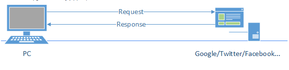
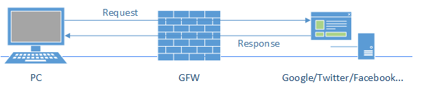
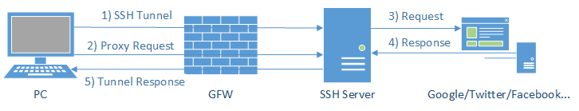
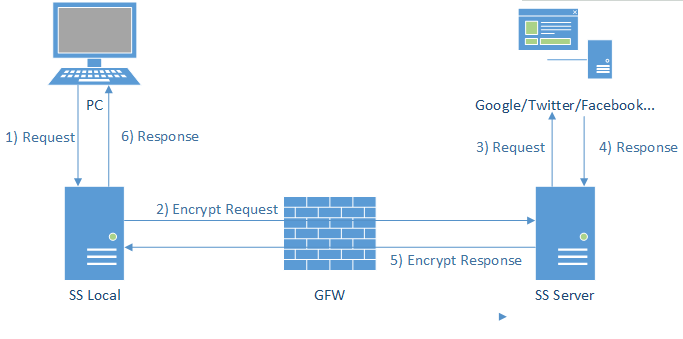
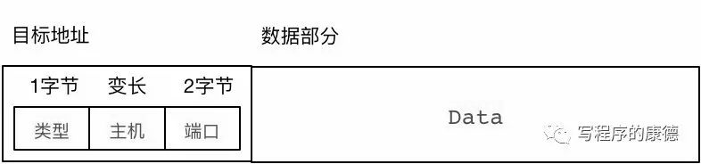

# SHADOWSOCK

## 原理

原始的网络连接可称为“直连”，即端与端之间只存在通信链路。

当网络连接的某一端（通常为server）为了加强自身安全性，而增加防火墙时，被限制的网络连接将无法访问server。

防火墙的过滤（限制）规则往往存在漏洞：
- 未限制某些可被利用的IP地址段
- 未限制某些网络协议/服务：HTTPS、socks...

SSH tunnel是一种协议，这种协议在端与端之间建立了加密传输，所以防火墙往往不能识别其数据包内容，从而无法过滤或转发。SSH tunnel的建立需要网络连接的两端同时安装相应软件，并以代理方式使用ssh隧道进行网络通信。

SSH 使用了RSA非对称加密，数据包内容被加密，防火墙无法有效识别。但SSH是常用软件，其网络特征也很明显，所以防火墙软件仍然可以根据SSH连接特征识别并过滤SSH连接。

为了借助SSH通过防火墙限制，shadowsocks将原SSH创建的socks5协议拆分为：server端和client端。基本原理如下：
- client发出基于socks5的请求，送给SS local。SS LOCAL一般是本机或局域网内安装了client代理的机器。
- SS Local 和 SS Server 之间通过多种可选加密协议进行通信，通信数据包种没有明显特征，防火墙将视其为普通二进制数据包而放行。
- SS Server将收到的加密数据进行解密，还原请求后发给服务器以获得服务器响应。
- 响应回传的过程类似请求的过程。

Shadowsocks协议格式如下：

目标地址有三部分组成:
- 类型是一个字节的枚举类型
  - 0x01表示主机部分是 IPv4地址
  - 0x03表示主机部分是变长字符串，第一个字节表示长度后面是数据。最多承载255个字节的数据
  - 0x04表示主机部分是IPv6地址端口是两个字节的无符号整数类型。
- 主机，可为IPv4或IPv6地址
- 端口

数据部分就是用户原始的请求（TCP或UDP数据包部分）

SS中本地代理和服务器通讯数据包都是经过加密的，DPI（深度数据包检测）只能检测到IP头部和TCP/UDP头部，无法对内容进行检测，而VPN之类的就特别容易被检测到了。想检测SS只能通过“流量特征”（数据包的结构）推测，但是使用SS一般选择带IV模式的AES加密算法作为加密方法（不了解AES的朋友请参考公众号的《深入浅出AES加密》），利用IV对数据做随机化，使每次请求的数据包都不一样，一般很难形成“流量特征”。如果SS无法使用那么一定是由于服务器端IP地址被限制了，被限制的原因也绝对不是由于SS被识别到了（除非谁有通天的能耐破解AES）。

SS协议简单，但效率较差，不适于频发短连接，例如HTTP之类的短连接。一个Web页面中可能包含40-50个请求那么相当于SS中转40-50次，所以并发压力很大。但是它实现起来特别简单，而且行之有效，所以成为跨越防火墙的低端免费实现方法。