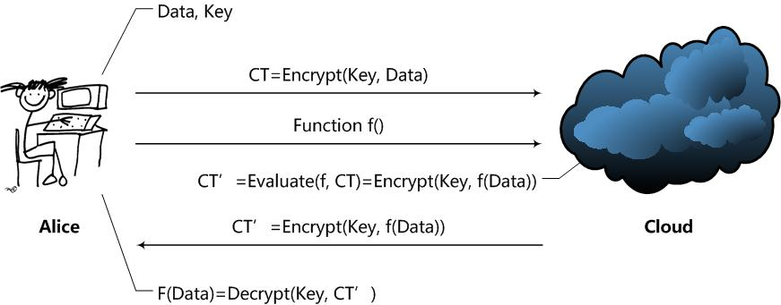

# 同态加密

本文主要参考刘巍然知乎问答 https://www.zhihu.com/question/27645858/answer/37598506

## 什么是同态加密？

提出第一个构造出全同态加密（Fully Homomorphic Encryption）[Gen09]的Craig Gentry给出的直观定义最好：

> A way to delegate processing of your data, without giving away access to it.一种委托处理数据的方法，但不放弃其访问权。

这是什么意思呢？一般的加密方案关注的都是数据存储安全。即，我要给其他人发个加密的东西，或者要在计算机或者其他服务器上存一个东西，我要对数据进行加密后在发送或者存储。

没有密钥的用户，不可能从加密结果中得到有关原始数据的任何信息。只有拥有密钥的用户才能够正确解密，得到原始的内容。

我们注意到，这个过程中用户是不能对加密结果做任何操作的，只能进行存储、传输。对加密结果做任何操作，都将会导致错误的解密，甚至解密失败。

同态加密方案最有趣的地方在于，其关注的是数据处理安全。同态加密提供了一种对加密数据进行处理的功能。也就是说，其他人可以对加密数据进行处理，但是处理过程不会泄露任何原始内容。同时，拥有密钥的用户对处理过的数据进行解密后，得到的正好是处理后的结果。

这里要用到同态的特性，即在无法取得数据的条件下直接对加密结果进行处理，且不影响解密后得到处理结果。这么好的特性肯定会带来一些缺点。同态加密现在最需要解决的问题在于：效率。效率一词包含两个方面，一个是加密数据的处理速度，一个是这个加密方案的数据存储量。

###  现有同态加密方案

第一个构造出全同态加密方案的人是Gentry，这是他在Stanford攻读博士学位的研究成果。Gentry毕业后去哪里了呢？IBM。大家知道IBM可是一个云服务提供商啊！在IBM，Gentry和另一个密码学大牛Halevi继续进行同态加密及其相关的研究，并实现了一些同态加密方案。如果IBM真的做出了可以在实际使用的同态加密方案，那么其他云服务提供商就可以拜拜了啊！这游戏不用玩了啊，人家能在不知道数据内容得前提下处理数据啊，毕竟谁都不想把数据泄露给其他公司啊！

## 同态加密的定义、安全性和简单实例

### 定义
在云计算环境下

Alice通过Cloud，以Homomorphic加密（简称HE）处理数据的整个过程如下：
- Alice对数据进行加密，并把加密后的数据发送给cloud；
- Alice向Cloud提交数据的处理方法，用函数f表示；
- Cloud在函数f下对数据进行处理，并将处理后结果发给Alice；
- Alice对数据进行解密，得到结果。

由上可知，在一个HE方案中应该拥有以下函数：
- KeyGen函数：密钥生成函数。这个函数应该由Alice运行，用于产生加密数据Data所用的密钥Key。当然了，应该还有一些公开常数PP（Public Parameter）；
- Encrypt函数：加密函数。这个函数也应该由Alice运行，用Key对用户数据Data进行加密，得到密文CT（Ciphertext）；
- Evaluate函数：评估函数。这个函数由Cloud运行，在用户给定的数据处理方法f下，对密文进行操作，使得结果相当于用户用密钥Key对f(Data)进行加密。
- Decrypt函数：解密函数。这个函数由Alice运行，用于得到Cloud处理的结果f(Data)。

> 这里可以看出，同态加密与普通加密至少有以下不同：
> - 多了一个评估函数，用于对密文进行操作。

那么，f应该是什么样子的呢？HE方案是支持任意的数据处理方法f？还是说只支持满足一定条件的f呢？根据f的限制条件不同，HE方案实际上分为了两类：
- Fully Homomorphic Encryption (FHE)：这意味着HE方案支持任意给定的f函数，只要这个f函数可以通过算法描述，用计算机实现。显然，FHE方案是一个非常棒的方案，但是计算开销极大，暂时还无法在实际中使用。
- Somewhat Homomorphic Encryption (SWHE)：这意味着HE方案只支持一些特定的f函数。SWHE方案稍弱，但也意味着开销会变得较小，容易实现，现在已经可以在实际中使用。

未完，

## 概念
> 参考电子科技大学《现代密码学》课程

### 群（group theory）
> [B站近世代数的课程资料-群](https://www.bilibili.com/video/BV1qf4y1m7K1?from=search&seid=1075218924262237744)

在数学中有很多熟悉的对象，如各种数（整数、实数）、多项式、矩阵、函数等等，在数学对象之间有一些运算，例如：加法、乘法。当然这些对象的加法所具有的含义各有不同，但很多性质是相同的，例如加法的交换律、结合律等等。

代数的研究希望把具体的对象抽象化，将对象一般化，例如给定某个非空集合，在这个集合上引入某些运算，然后看该集合在这个运算下有何种性质。

**定义1 代数运算**：对于非空集合A，引入一个法则，使A中任意两个元素与A中另一个元素对应。

代数运算是非常宽泛的。例如A取实数集，法则取加法，那么实数集里的任意元素x，y，那么x+y仍然属于实数。类似的乘法也可以是一个法则、所有的二元函数$z=f(x,y) \in R$也是一个法则，他们都是代数运算。

也有一些不是代数运算，例如:
- 向量的数乘，$\alpha \in V, \beta in P, k\alpha \in V$。这就不是代数运算，因为涉及了两个集合。代数运算仅在一个集合内形成对应关系。
- 向量的内积，$\alpha , \beta \in V, (\alpha,\beta)->R or C，V \times V -> R or C$，这也不是代数运算。

**定义2 群**：G是一个非空集合，引入一个代数运算 $\cdot$ ，若$(G,\cdot)$这个代数结构，具有下列性质时就把$(G,\cdot)$称为一个群：
- 满足结合律，即有 $\forall a,b,c \in G, a \cdot (b \cdot c) = (a \cdot b ) \cdot c$
- 存在单位元，即在G中有个特殊元素e，满足 $\exists e, \forall a \in G, e \cdot a = a$
- 存在逆元，即满足 $\exists b,  \forall a \in G, b \cdot a = e$

说明：事实上，绝大多数情况下$e \cdot a = a \cdot a = e, b \cdot a = a \cdot b = e$都是成立的，但定义可以比之更宽泛，只要满足一半就是群。

**定义3 交换群**：如果一个群$(G,\cdot)$，满足交换律，即$\forall a,b \in G,a \cdot b = b \cdot a$，则这个群被称为交换群。

**定义4 半群**：G是一个非空集合，引入一个代数运算 $\cdot$ ，若$(G,\cdot)$这个代数结构，具有下列性质时就把$(G,\cdot)$称为一个半群：
- 满足结合律，即有 $\forall a,b,c \in G, a \cdot (b \cdot c) = (a \cdot b ) \cdot c$

例如：$G={2,4,6,8...,}$，则引入加法运算+后，$(G,+)$是一个半群。

**定义5 幺半群**：G是一个非空集合，引入一个代数运算 $\cdot$ ，若$(G,\cdot)$这个代数结构，具有下列性质时就把$(G,\cdot)$称为一个幺半群：
- 满足结合律，即有 $\forall a,b,c \in G, a \cdot (b \cdot c) = (a \cdot b ) \cdot c$
- 存在单位元，即在G中有个特殊元素e，满足 $\exists e, \forall a \in G, e \cdot a = a$

可见，幺半群没有逆元，但有单位元，例如：$G={0，2,4,6,8...,}$，则引入加法运算+后，$(G,+)$是一个幺半群。

#### 群的例子

- （整数集Z，加法+）是一个群，因为满足结合律，有单位元 0，每个元素的相反数就是逆元；
- （有理数Q，加法+）是一个群
- （实数集R，加法+）是一个群
- （复数集C，加法+）是一个群
- （不含0的实数集R，乘法*）是一个群，满足交换律，有单位元1，每个元素的倒数就是它的逆元；
- （元素均大于0的实数集，乘法*）是一个群
- （实数集R，乘法*）不是一个群，因为元素0没有逆元。
- （全体n次单位根的集合，乘法*）是一个群。因为全体n次单位根可以表示成 $U_n = {e^{\frac{2\pi i}{n}k},k=0,1,...,n-1}$ ，它的乘法运算满足结合律、有单位元1、每个元素都有对应的逆元。
- （全体多项式构成的集合，加法+）是一个群，因为满足结合律、有单位元0，每个多项式取负号就是原多项式的逆元。
- （全体多项式构成的集合，乘法*）不是一个群，因为有的多项式没有逆元
- （同阶矩阵，加法+）是一个群
- （同阶矩阵，乘法*）不是一个群
- （同阶方阵，乘法*）是个幺半群，因为有的矩阵没有逆阵。
- （同阶可逆矩阵，乘法*）是个群，但是非交换群。
- （区间ab中的全体数据集c\[a,b]，加法+）是个幺半群。
- 假设F是$R->R的线性映射的全体$，即$F={T:T(x)=ax+b,a,b\in R,a \neq 0}$，那么（F,线性复合运算*）构成一个群
- 假定p是一个自然数即$p \in N$，$Z_p = {0,1,2,...,p-1},\forall x,y \in Z_p, x \oplus y = x +y \ mod \ p$,那么$(Z_p,\oplus)$是一个群
-  

### 同态

> https://www.bilibili.com/video/BV1Gx411f7Yo?p=56
> 
同态来源于近世代数。

定义：设$<G,*>$ 和 $<H,\cdot >$是两个群，f是群G到群H的映射，如果对于任意$a,b \in G$，都有$f(a*b) = f(a) \cdot f(b) $，则称f是群G到群H的一个同态映射。

