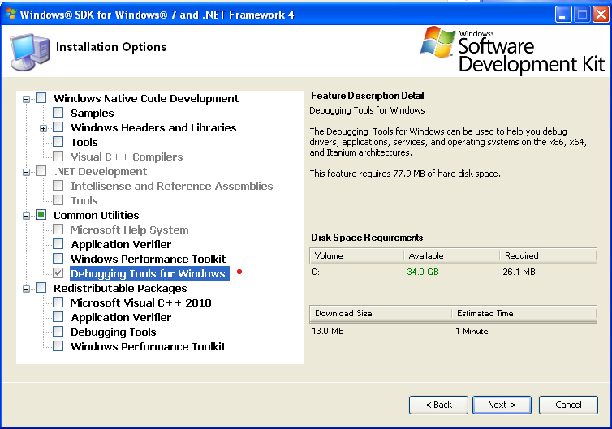
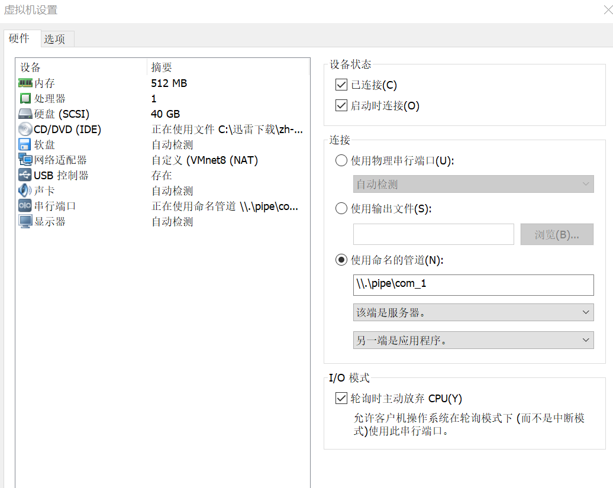

# 使用WinDbg调试内核前的安装步骤

WinDbg(常被读作“Windbag”)是微软提供的一个免费调试器。

虽然在恶意代码分析中 WinDbg 不如 OllyDbg 调试器那么流行，但是它有很多独特的优点，比如它支持内核调试。

## 内核调试方法概述

内核调试比起用户模式调试来说更加复杂，因为进行内核调试时，操作系统将被冻结，这种情况下不可能运行调试器。因此，调试内核的常用方法是使用VMware。

与用户态调试不同，内核调试需要一些初始化设置。
- 首先需要设置虚拟操作系统并开启内核调试；
- 然后配置VMware使虚拟机与宿主系统之间有一条虚拟化的串口；
- 同时还应该配置宿主操作系统的 WinDbg。

## 虚拟机（被调试者）的设置

### 虚拟机内安装WinDbg

虚拟机内部用的WinDbg，可以用于调试用户态的程序，功能与OllyDbg相同。

在虚拟机中，打开微软SDK下载网址：https://www.microsoft.com/en-us/download/details.aspx?id=8279 ，下载Windows SDK 7.

Windows SDK 7 适用于 Windows xp 和 windows 7 等产品。

下载完毕后点击安装，在安装过程中选中 debugger，其他的安装选项可以不选。



其他按默认完成。

### 设置虚拟机（以windowxp为例）

在进行以下配置前请重新安装 vmware tools，安装完毕，重启系统后再进行如下操作。

虚拟操作系统的设置是编辑 C:\boot.ini (Windows XP)下请确保文件夹选项设置为显示隐藏文件)，该文件在系统中通常是隐藏的。建议在编辑boot.ini文件之前，为你的虚拟操作系统做一个快照，如果配置文件错误或者损坏了boot.ini，你可以使用快照还原系统。

下列代码清单，是设置内核调试功能之后，boot.ini文件的内容：
```
[boot loader]
timeout=30
default=multi(0)disk(0)rdisk(0)partition(1)\WINDOWS
[operating systems]
multi(0)disk(0)rdisk(0)partition(1)\WINDOWS="Microsoft Windows XP Professional" 
/noexecute=optin /fastdetect
multi(0)disk(0)rdisk(0)partition(1)\WINDOWS="WinXP Pro with Kernel Debugging" 
/noexecute=optin /fastdetect /debug /debugport=com1 /baudrate=115200

```
> 说明：上述两条 multi(0) 开头的语句必须在一行中，不可换行。

当再次开机运行你的虚拟操作系统时，系统会提供一个开启内核调试的选项让你选择。

另外，系统会给你30秒的时间，决定是否以调试模式启动系统。如果想要连接内核调试器 (即WinDbg)，你需要在每次开机时选择调试版本启动项。

>注意:操作系统以调试模式启动，并不意味着需要连接调试器，在没有连接调试器的情况下，系统也会正常运行。

### 为虚拟机增加串口设备

下一步，需要设置VMware,在虚拟操作系统和宿主操作系统之间创建一个虚拟连接。为此，我们在VMware上添加一个新的设备来使用宿主系统中的一个命名管道上的串口。

下面是关闭虚拟机后，添加设备的步骤:
- 1.单击VMWare Settings，然后会弹出VMware设置对话框。
- 2.在VMware设置对话框中，单击右下角的Add按钮，在弹出的设备类型选择窗口中选择Serial Port,然后单击下一步。
- 3.在请求串口类型的对话框中，选择Output to Named Pipe，然后单击下一步。
- 4.在接下来的窗口中，输入```\\.\pipe\com_1```对管道进行命名，然后选择：
  - This end is the server 该端是服务器
  - The other end is an application 另一端是应用程序
- 5.选择轮询时主动放弃CPU。

当完成串口的添加后，虚拟机的设置对话框应该与下图中所示的串口设备的配置类似。



完成虚拟机的配置后启动虚拟机。

## 宿主机（调试器）端安装、设置

### 宿主机Windbg安装

Windows 10中可用的Windbg可以从两方面获取：
- Microsoft Store 中搜索 WinDbg Preview，然后点击安装。
- 从 https://developer.microsoft.com/zh-cn/windows/downloads/sdk-archive 寻找合适的SDK安装。

推荐第一种方法，较为简单。Windbg preview是新版本的工具，界面设计更人性化。

### 宿主机Windbg设置

在宿主操作系统中，使用下列步骤使WinDbg连接虚拟机并开始调试内核。

#### 若安装了 WinDbg preview
- 1.启动WinDbg 
- 2.打开File——Settings——Debugging settings，键入如下内容：

``` srv*c:\localsymbols*http://msdl.microsoft.com/download/symbols```

- 3.选择File —— Attach Kernel ，之后单击COM标签，然后输入文件名和先前在oot.ini文件中设置的波特率，本例中我们设置为115200；选中Pipe复选框后确定。

#### 若安装了 WinDbg
- 1.启动WinDbg 
- 2.打开菜单File——Symbol Search Path，键入如下内容：

``` srv*c:\localsymbols*http://msdl.microsoft.com/download/symbols```

- 3.选择File--Kernel Debug，之后单击COM标签，然后输入文件名和先前在boot.ini文件中设置的波特率，本例中我们设置为115200；选中Pipe复选框后确定。

设置窗口如下图所示：


如果虚拟操作系统处于运行状态，调试器会在数秒内连接到虚拟机操作系统。如果虚拟操作系统没有运行，调试器将处于等待，直到虚拟操作系统启动，启动过程中调试器将连接到被调试系统。

调试器连接后，为了更加个面地获取到调试过程发生的事件，建议在调试过程中启用详细信息输出功能。启用详细信息输出功能后，每当驱动程序被加载和卸载时，你将会得到通知。这些信息在某些情况下可以帮助你识别恶意驱动的加载。


