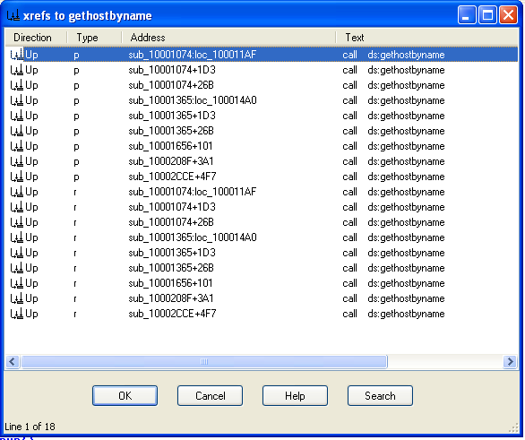
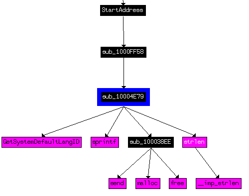
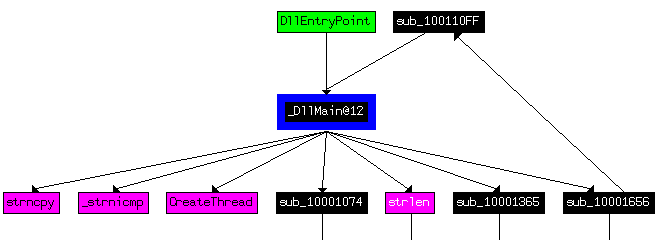

# 实验 5 程序高级静态分析技术

## 1 实验目的

掌握程序静态分析技术，能够使用反汇编工具分析恶意代码。

## 2 实验前提

请安装虚拟机 winXPenSP3 调试环境。

本节课所用到的文件均存放在windXPenSP3 调试环境虚拟机 C:\workspace\PracticalMalwareAnalysis-Labs\Practical Malware Analysis Labs\BinaryCollection 目录的Chapter_1L中。

注意：请在分析样本前，在C:\workspace\ 下建立一个tmp临时文件夹，存放要分析的文件。因为某些分析过程可能会破坏原文件。

## 3 实验内容

用IDA PRO分析文件lab05-01.dll中的恶意代码。

## 4 实验步骤

用IDA PRO分析文件lab05-01.dll中的恶意代码，回答以下问题。

1.寻找DllMain的地址是什么？

> 提示：(1)打开IDA PRO，新建后按PE DLL加载lab05-01.dll。（2）从图形方式查看到注释为“__stdcall DllMain”的函数就是DLLmain函数。（3）查看它的地址先在菜单options-general中，勾选line prefixes。（4）然后用空格键在graph view和 text view之间切换，text view下就能看到地址为.text:1000D02E。如下图所示。
> DLLmain是我们开始分析的地方，所有从DllEntryPoint 到 DllMain 之间执行的代码一般是编译器生成的，不要去分析它们。

>示例图：
>
>

2.使用Imports窗口并找到 gethostbyname ，导入函数定位到什么地址？
   
>提示，gethostbyname属于WS2_32.dll，ordinal为52，找到后双击它可知地址为.idata:100163cc。
>示例图：
>

3.有多少函数调用了 gethostbyname?

> 提示：要查看调用了gethostbyname的函数个数，将光标保持在gethostbyname处，按下Ctrl+X键，可以检查它的交叉引用情况。这会打开如图下图所示的窗口。窗口最底下的“Line 1 of 18”这行文字，告诉我们存在对gethostbyname的9处交叉引用。因为当前版本的IDA Pro会计算两次交叉引用:类型P是被调用的引用；类型r是被“读取”的引用(因为是对一个导入项call dword ptr […]，所以CPU必须先读取这个导入项，再调用它)。仔细检查交叉引用列表，会发现实际上在5个不同的函数中调用了gethostbyname。

> 示例图：
> 

> 提示：此外还可以使用图示方式，即将光标保持在gethostbyname处，点右键选择“chart of xrefs to"，可见共5个函数调用了 gethostbyname。依次打开，可以知道调用了9次。如下图所示：
> 
> 

有关交叉引用类型可以参考：https://www.hex-rays.com/products/ida/support/idadoc/1305.shtml

4.将精力集中在位于0x10001757处的对gethostbyname的调用，你能找出哪个DNS请求将被触发吗?

> 提示：在上图交叉引用中可以快速找到 ：```Up p sub_10001656+101 call ds:gethostbyname```；或在IDA VIEW-A上按G键定位到：10001757.
> 提示：gethostbyname方法用了一个参数，应该是一个包含了域名的字符串。因为，我们需要往回看一点，确定gethostbyname被调用时，EAX中的值是多少。从前面可以看到，off_10019040这个内存地址中的数据被赋给了EAX。双击这个偏移，在这里我们能看到注释中的字符串”This is RDO]pics.practicalmalwareanalysis.com"，要找的域名pics.practicalmalwareanalysis.com。

> 示例图：

> 示例图：


5.IDA Pro识别了在 0x10001656 处的子过程中的多少个局部变量?

> 提示：从IDA VIEW-A中点G，定位0x10001656。识别为局部变量的一般标记为负偏移值，前缀常为var；识别为参数的一般被标记为正偏移值，通常前缀为arg。可以看出IDAPRO识别了 23 个局部变量。
> 示例图：


6.IDA Pro识别了在0x10001656处的子过程中的多少个参数?

>提示：分析同上，识别了 1 个局部变量，名为arg_0

7.使用Strings窗口，来在反汇编中定位字符串“\\\\cmd.exe /c”。它位于哪个地址?

>提示：我们通过菜单View--Open Subviews，选Strings，来查看这个DLL的字符串。在这个列表中，找到并双击\cmd.exe /c，即可在反汇编窗口中看到它。请注意，该字符串位于该PE文件的xdoors_d节中的Ox10095B34处。检查对这个字符串的交叉引用，只看到一处位于.text:0x100101DO，在那里，该字符串被压到栈上。

> 示例图：


点击到这个位置，按ctrl+x有：```Up o sub_1000FF58+278 push    offset aCmd_exeC; "\\cmd.exe /c "```，即只有一个调用这个的函数，操作是压入堆栈。

8.在引用\cmd.exe /c的代码所在的区域发生了什么?

> 提示：自然是打开了一个cmd窗口。可能是开启了一个远程shell会话。查看交叉引用（ctrl-x），然后在图形方式下顺藤摸瓜往上看，可以看到一系列的memcmp函数被用于比较如cd, exit, install,inject和uptime等的字符串。找到 0x1001009D位置有一个字符串被押入堆栈，内容如图所示：
> 示例图：
> 


9.在同样的区域，在0x100101C8处，看起来好像dword_ 1008E5C4是一个全局变量，它帮助决定走哪条路径。恶意代码是如何设置dword_1008E5C4的呢?(提示:使用dword_1008E5C4的交叉引用）

>提示：dword_ 1008E5C4 是一个全局变量，我们可局部变量和参数可以在0x100101C8处双击它，来到内存中的0x1008E5C4处，这位于DLL文件的.data节。按下Ctrl+X键来检查其交叉引用，可以看到它被引用了三次，但只有一处修改了dword 1008E5C4。下即MOV dword_1008E5C4, eax。
> 示意图：
> 
> 看交叉引用，发现只有一处修改其值：
> 
> 点击看详情：
> 
> 发现在执行 mov dword_1008E5C4, eax 这条指令前调用了一个sub_10003695，而这个过程中有GetVersionEx的调用，获取 VersionInfomation等信息，那么这个全局变量dword_ 1008E5C4必然是存放了操作系统版本信息。获得系统版本后，再决定打开cmd.exe 还是 command.exe。上面程序中将dwPlatformId与数字2进行比较，来确定如何设置AL寄存器。如果PlatformId为VER_ PLATFORMes WIN32_ NT, AL会被置位。这里只是简单地判断当前操作系统是否Windows 2000或更高版本，假设是这样，该全局变量通常会被置为1。    

Windows版本可参考：https://docs.microsoft.com/zh-cn/windows/win32/sysinfo/operating-system-version?redirectedfrom=MSDN

10.在位于 0x1000FF58 处的子过程中的几百行指令中，一系列使用memcmp来比较字符串的比较。如果对robotwork的字符串比较是成功的(当memcmp返回0)，会发生什么?

> 提示：如前所述，位于Ox1000FF58处的远程shell函数从Ox1000FF58开始包含了一系列的memcmp函数。在 0x10010452，可以看到robotwork的memcmp，如下所示:
> 找到robotwork字符串被引用的代码：
> 
> 如果该字符串为robotwork，则在 jnz short loc_10010468处不会跳转；
> 而call sub_100052A2会被调用。查看这个sub_100052A2，发现它会查询“SOFTWARE\\Microsoft\\Windows\\CurrentVersi..."信息、“worktime”信息等，并通过shell发送到远程控制方。


### 4.1 以下为选作内容

11.PSLIST导出函数做了什么?

> 提示：通过菜单View——Open Subviews——Exports，查看该DLL的导出表。在其中可以看到PSLIST，双击它，光标来到0x10007025处，也就是导出项代码的起始处。这个函数选择两条路径之一执行，这个选择取决于sub_ 100036C3的结果。sub_ 100036C3函数检查操作系统的版本是Windows Vista/7(主版本号为6，大于5),或是Windows XP/2003/2000（主版本号为5），platformid为2时表示WINNT。这两条代码路径都使用LOC_1000704E中调用了sub_1000664c，其中调用了CreateToolhelp325napshot函数，从相关字符串和API调用来看，CreateToolhelp32Snapshot可以通过获取进程信息为指定的进程、进程使用的堆、模块、线程建立一个快照。之后获得一个进程列表。这两条代码路径都通过send将进程列表通过socket发送；所以PSLIST导出项可以通过网络发送进程列表，或者寻找该列表中某个指定的进程名并获取其信息。
> 
 

> Windows系统版本信息参考：https://docs.microsoft.com/zh-cn/windows/win32/sysinfo/operating-system-version?redirectedfrom=MSDN

12.使用图模式来绘制出对sub_10004E79的交又引用图。当进入这个函数时，哪个API函数可能被调用?仅仅基于这些API函数，你会如何重命名这个函数?

> 提示：当光标在函数名上时，通过菜单的View---Graphs——User Xrefs Chart.我们可以得到函数的交叉引用图。
> 

13.DllMain直接调用了多少个Windows API？ 多少个在深度为2时被调用?

> 提示：要确定DllMain会直接调用多少Windows API函数，我们可以逐一查看该函数的代码并在其中寻找API调用，也可以选择菜单的View——Graphs——User xrefs chart来打开可视化图。其中，开始和结束地址应该都填DllMain的起始地址，也就是0x1000D02E。因为我们只关心从DllMain出发的交叉引用。我们选取Recursion depth(递归深度)为1，以显示其直接调用的函数。如果要看到递归深度为2的所有被调用函数，用同样的步骤，但是将递归深度设为2。其结果将会是一个非常大的图，甚至会有一个回到DllMain的递归调用。
> 示例图：
> 

14.在 0x10001358 处，有一个对Sleep(一个使用一个包含要睡眠的毫秒数的参数的API函数)的调用。顺着代码向后看，如果这段代码执行，这个程序会睡眠多久?

> 提示：往前看，EAX被乘了0x3E8(十进制是1000)，也就是说，对atoi调用的结果被乘以1000，得到要休眠的毫秒数。继续往前看，还能看到off_10019020被赋给EAX。双击它，就能看到它是什么。它指向了一个字符串[his is CTI]30。接下来，我们看到0xD被加到EAX上作为偏移，因此EAX指向了30来调用atoi，这样就把字符串30转成了数字30。将30乘上1000，得到30 000毫秒(30秒)，这也就是程序将休眠的时间。

15.在 0x10001701 处是一个对socket的调用。它的3个参数是什么?

> 提示：定位到这个地址，双击socket，可见SOCKET __stdcall socket(int af, int type, int protocol)。返回调用处，可知参数分别为：6，2，1。

16.使用MSDN页面的socket和IDA Pro中的命名符号常量，你能使参数更加有意义吗?在你应用了修改以后，参数是什么?

> 提示:根据问题15，在0x10001701处对socket的调用列在了表5一比的左侧。我们看到6, 1和2分别被压到了栈上。这些数与MSDN页面上对socket描述中的符号常量相关。右键单击每个数，选择Use Symbolic Constant，会弹出一个对话框，会列举出IDA Pro为这个特定值找到所有的对应常量。在这个题中，值2指的是AF_INET，用于设置一个IPv4 socket；值1指的是SOCK_ STREAM；值6指的是IPPROTO TCP。因此，这个socket会被配置为基于IPv4的TCP连接(常被用于HTTP)。
> 上述符号常量的确定，实际上是通过对Windows WS2_32.dll中socket查询https://docs.microsoft.com/en-us/windows/win32/api/winsock2/nf-winsock2-socket 得到的。


17.搜索in指令(opcode OxED)的使用。这个指令和一个魔术字符串VMXh用来进行VMware检测。这在这个恶意代码中被使用了吗?使用对执行in指令函数的交叉引用，能发现进一步检测VMware的证据吗?

> 提示：搜索in指令，这可以通过选择菜单的Search- Text，然后输入in来做到(还可以选择Search--Sequence of Bytes，然后搜索in指令的opcode，也就是ED)。如果我们在搜索对话框中选择了Find All Occurrences，会有一个新的窗口列出所有的匹配。从结果看，只在0x100061DB一处有in指令。
> 双击in指令，跳到代码段处。在上方100061c7处，有564D5868h这个16进制数，按R将其变为字符，即“VMXh”。在0x100061C7处的mov指令将0x564D5868赋给EAX。这也就确认了这段代码是恶意代码采用的反虚拟机技巧。检查到执行了这一代码的这个函数的交叉引用，可以看到在一个比较以后，有Found Virtual Machine字符串，这让我们更加确认前面的结论。

> 注：其实IN指令表示从外部设备输入数据给累加器，当I/O端口地址不超过8位时，则直接放在指令中，若超过8位，则用DX间址。这里DX中存着I/O地址，为5658h。


18.将你的光标跳转到 0x1001D988 处，你发现了什么?

> 提示：我们使用G键将光标跳到Ox1001D988处,点右键可见到字符串形式'-1::u<&u!=<&u746>1::yu&!<;2u106:101u3:u'，基本不可读，需要解码。

19.如果你安装了IDA Python插件(包括IDA Pro的商业版本的插件)，运行Lab05-O l.py，一个本书中随恶意代码提供的IDA Pro Python脚本，(确定光标是在Ox 1001D988处)在你运行这个脚本后发生了什么?


