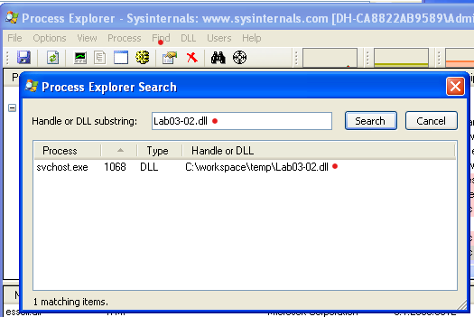

# 实验6程序动态分析技术

## 1 实验目的

掌握程序动态分析技术，能够使用工具初步分析恶意代码。

## 2 实验前提

请安装虚拟机 winXPenSP3 调试环境。

## 3 实验内容

- 1.使用动态分析基础技术分析Lab03-0l.exe文件。
- 2.使用动态分析基础技术分析Lab03-02.d11文件。
- 3.使用动态分析基础技术分析Lab03-03.exe文件。
- 4.使用动态分析基础技术分析Lab03-04.exe文件。


## 4 实验步骤

### 4.1 一.使用动态分析基础技术分析Lab03-0l.exe文件。

1.找出这个恶意代码的导入函数与字符串列表?

> 提示：使用DW、PEview、PEid等静态检查工具检查这个文件，发现这个文件仅导入了kernel32.dll，以及ntdll.dll，而且发现这个程序被加壳，加壳程序可能是PEncrypt 3.1 Final -> junkcode。
> 仅有一个导入函数ExitProcess，很难判断这个恶意代码要做什么。
> 使用strings工具或IDA pro查看其中字符串，发现一些可读且有趣的字符串：WinVMX32、VideoDriver、vmx32to64.exe等。


2.这个恶意代码在主机上的感染迹象特征是什么?


> 提示：在我们运行恶意代码之前，我们先运行procmon工具，并清除所有事件；启动Process Explorer，同时配置出一个虚拟网络，包括Fakenet 1.0c，或ApateDNS,  Netcat监听端口80和443，以及用于网络数据包捕获wireshark。
>当我们运行恶意代码后，我们开始在Process Explorer中检查进程，单击
Lab03-01.exe进程项，选择View-Lower Pane View--Handles。在这个视图中，我们可以看到，恶意代码己经新建了一个名为WinVMX32的互斥量。我们还可以选择View--Lower Pane View--DLL看到恶意代码动态装载的DLL文件，如ws2_32.dll和wshtcpip.dll，这意味着它具有联网功能。
>使用procmon工具寻找额外的信息。我们通过选择Filter--Filter，来调出过滤器对话框，然后设置三个过滤器:一个是对进程名称的过滤(显示Lab03-01.exe对系统所做的)，和两个操作上的过滤。这样会包含RegSetValue和lWriteFile，来查看恶意代码对文件系统和注册表的修改操作。设置完过滤器之后（如下图中绿色的三个条目），我们单击Apply按钳，便可看到过滤后的结果。显示的条目从数千减少到10条了。注意只有一个WriteFile操作的条目，还有9个关于RegSetValue操作的条目。

>示例图
>

>示例图
>

>上述图中记录有一定数量的噪声，比如第0条记录，以及第3 - 9条记录在HKLM\SOFTWARE\Microsoft\Cryptography\RNG\Seed键值上的RegSetValue操作是典型的噪声，因为随机数发生器的种子会有软件在注册表中不停地更新。
>但第1，2条目值得关注，第1条处是WriteFile操作。双击该
条记录会告诉我们恶意代码往C:\WINDOWS\system32\vmx32to64.exe中写了7168字节。
这恰好是Lab03-01.exe文件的大小。打开windows资源管理器浏览到C:\WINDOWS\system32\vmx32to64.exe这个位置，可以看到这个新创建的文件有与Lab03-Ol.exe相同的MD5哈希位，这告诉我们恶意代码已经复制本身到这个文件系统位置。这是一个非常有用的感染主机迹象特征，因为它使用了一个硬编码的文件名（在字符串检查时可见）。
>之后，我们继续查看第2条，发现这个程序在注册表中创建了HKLM\SOFTWARE\Microsoft\Windows\CurrentVersion\Run\VideoDriver，其值为C:\WINDOWS\system32\vmx32to64.exe。说明要再开机启动过程中加载vmx32to64.exe，启动名为VideoDriver，有一定隐蔽性。

3.这个恶意代码是否存在一些有用的网络特征码?如果存在，它们是什么?

>提示：在执行Lab03-01.exe之前启动Fakenet。


>来查看恶意代码是否执行了DNS请求。通过检查输出，我们看到了个对 www.practicalmalwareanalysis.com 域名的请求，这匹配到了字符串列表中的显示。(为了确定恶意代码是否进行了额外的DNS青求，我们可以执行多次分析过程，来查看是否有一些DNS请求的变化。)

### 4.2 二.使用动态分析基础技术分析Lab03-02.dll文件。

1.你怎样才能让这个恶意代码自行安装?

>提示：我们使用静态分析从析技术，来查看这个样本的PE文件结构与字符串列表，可知这个DLL有五个导出函数。从异出函数ServiceMain表明，这个恶意代码需要安装成一个服务，使其能够正常运行。
>先查看lab03-02.dll的导出表可知有个InstallA函数可用。
>查看这个dll的导入表，可看到包括了一些服务操作函数，比如 CreateService，以及一些注册表操作函数，如函数RegSetValueEx。导入的网络操作函数，如HttpSendRequest等，恶意代码使用了HTTP。


> 提示：查看字符串表，可见一些注册表位置、域名、独特字符串等，如IPRIP和serve.html，以及一些编码字符串。

> 提示：为了能找到运行方法，我们使用Regshot工具，对注册表进行基线快照，然后使用Process Explorer监控运行进程，然后再在命令行下运行```rundll32.exe Lab03-02.dll，installA```，这将运行恶意代码导出的installA函数，便可将恶意代码安装为一个服务。


2.在安装之后，你如何让这个恶意代码运行起来?

> 在安装完恶意代码之后，我们使用Process  Explorer，来确定rundll32. exe已经终止，不在进程列表中。然后，我们用Regshot工具做第二个快照，来看看恶意代码是否已经在注册表中安装自身了。
> 
> 在Keys added一节中，在1处显示了恶意代码将自身安装为IPRIP服务，由于这个恶意代码是个DLL文件，它依赖于一个可执行文件来执行它。其余的信息，比如3处的DisplayName和4处的Description。可以作为识别这个恶意服务的独特指纹特征。  
> 如果我们仔细地检查字符串列表，我们可以看SOFTWARE\Microsoft\Windows NT\CurrentVersion\SvcHost和一个消息You specify service name not in Svchost//netsvcs,must be one of following。如果我们跟着直觉来检查Svchost// \Svchost\netsvcs注册表项，我们可以看到其他可能被使用的服务名称，比如6to4 AppMgmt。运行Lab03-02.d11,installA6to4将安装恶意代码为6to4服务，而不再是前面所列出的IPRIP服务。
>在将恶意代码安装为服务之后，我们就可以启动运行它了。但在此之前，我们首先需要配置我们的动态分析基础技术工具。我们运行procmon工具(并清除所有事件)，启动Process Explorer,启动Fakenet配置一个虚拟网络监听端口80。
>由于这个恶意代码安装为IPRIP服务，我们可以使用Windows中的net命令来启动它，具体命令```net start IPRIP```
>
其中的INA+是一个注册表中相同的信息。


3.你怎么能找到这个恶意代码是在哪个进程下运行的?

>在regshot截图中，在2处看到ImagePath被设置为svchost.exe，这意味着，这个恶意代码将会在一个svchost.exe进程中启动。
>打开Process Explorer中，尝试寻找出恶意代码运行进程，可以选择Find--Find Handle or DLL，来打开一个对话框，然后输入Lab03-02.dll，单击Search按钮。
>
>
>这证实了这个恶意代码使用svchost在运行。


4.你可以在procmon工具中设置什么样的过滤器，才能收集这个恶意代码的信息?

>提示：在procmon工具中，可以使用在Process Explorer中发现的PID进行过滤，例如上面的1068。
>

其中的INA+是一个可共查找的信息。


5.这个恶意代码在主机上的感染迹象特征是什么?

>提示：根据上面的分析，恶意代码将安装为IPRIP服务，显示的服务名称为Intranet Network Awareness(INA+).描述为“Depends INA+, Collects and stores network configuration and location information, and notifies applications when this information changes"。它将自身持久地安装在注册表中HKLM\SYSTEM\CurrentControlSet\Services\IPRIP\Parameters\ServiceDll:%CurrentDirectory%\Lab03-02.dll。如果你将Lab03-02.dll重命名为其他文件名，如malware.dll，然后这个恶意代码就会把malware.dll写入注册表项中，而不是使用名称Lab03-02.dll。

6.这个恶意代码是否存在有用的网络特征码?
>在网络分析工具上，可以发现此恶意代码发出了DNS请求。输出结果显示 www.practicalmalwareanalvsis.com 的DNS清求，这也匹配到了静态分析得到的字符串列表。
>
>从这个数据，我们可以创建出一组网络特征码。因为恶意代码始终发出一个对serve. html的GE下请求，我们可以使用这个GET请求作为网络特征。恶意代码也使用User-Agent为MalwareAnalysis2Windows XP 6.11。MalwareAnalysis2是我们的恶意代码分析虚拟机的名称(所以这部分User-Agent在你的机器上会有所不同)。第二部分的User-Agent(Windows  XP  6.11)是一致的，可以用来作为网络特征。

### 4.3 三.使用动态分析基础技术分析Lab03-03.exe文件。

1.当你使用Process Explorer工具进行监视时，你注意到了什么?

2.你可以找出任何的内存修改行为吗?

3.这个恶意代码在主机上的感染迹象特征是什么?

4.这个恶意代码的目的是什么?


>以上问题的提示：先进行静态分析，检查字符串、PE文件结构、导入表和导出表。虽然看起来这个程序没有加壳，但字符串没有明显可读的特征字串。
>开启fakenet、process monitor、process explorer、regshot等动态工具。当其他工具都启动后，点击regshot中的1st shot，收集当前注册表信息。然后运行Lab03-03.exe。运行后，点击regshot的2st shot，并点compare，比较执行恶意代码前后的情况。

>

>可以看到，里面增加了2处键值，还修改了几种键值。

>提示：使用process monitor，增加filter过滤结果。


>

>从上图可见，这个Lab03-03.exe使用pid=124进行了createfile，名字是svchost.exe，然后生成进程，然后关闭文件。
>在process explorer中可见，有一个没有父进程的svchost（孤儿进程）。这个是由lab03-03.exe生成的，之后lab03-03.exe退出了。通常的svchost是含有子进程service的，但这个没有。

>

>在process explorer中，点击这个孤儿svchost的属性，比较image和memory中的字符串，发现有很大的不同。

>

>可见在内存中字符串有practicalmalwareanalysis.log，shift、enter等。表明这个程序可能是个键盘记录器。
>为了测试我们的假设，我们打开记事木程序，然后键入一段简短信息，来看看恶意代码是否在进行击键记录。我们使用“孤儿”进程svchost.exe的PID  (在Process Explorer中发现的)在procmon 工具中创建一个过滤器，只显示从PID is 944进程的事件。

>

>我们到相关路径可见记录文件。

>


### 4.4 四.使用动态分析基础技术分析Lab03-04.exe文件

1.当你运行这个文件时，会发生什么呢?
2.是什么原因造成动态分析无法有效实施?
3.是否有其他方式来运行这个程序?


>提示：按照先静态分析后动态分析的思路进行分析。
>可以使用IDA pro分析导入表、导出表、字符串等信息，发现这个程序中有访问文件、注册表操作、网络访问等函数和'http://www.practicalmalwareanalysis.com'等字符串。

>

>提示：启动process monitor、process explorer、fakenet，最后启动regshot，点击1st shot，记录当前注册表；然后点击lab03-04.exe运行.
>我们会发现这个程序迅速消失了,自己删除了自己。
>再次使用regshot 2st shot，记录执行后结果。

>

>上面似乎没有什么值得关注的信息，此外在process monitor中也没有看到Lab03-04.exe执行的writefile、regsetvalue等事件。但我们可以过滤查看有无processCreate事件。

>

>

>点击lab0304.exe，打开properties对话框，可以看到“C:\WINDOWS\system32\cmd.exe" /c del C:\WORKSP~1\temp\Lab03-04.exe >> NUL”这个字符串，说明该程序将自己删除了。
>到此为止，是我们目前所能做的一切。这个程序比较复杂，需要后续学习才能分析。