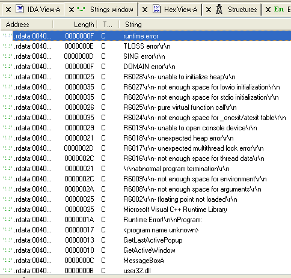
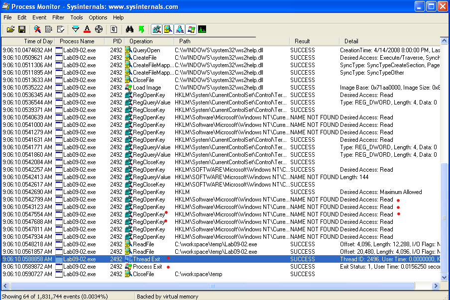
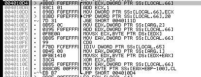

# 实验7 程序动态分析技术进阶

## 1 实验目的

掌握程序动态调试技术，能够使用工具初步分析恶意代码。

## 2 实验前提

- 请安装虚拟机 winXPenSP3 调试环境。
- 使用Ollydbg进行动态调试分析。


## 3 实验内容

1.用OllyDbg和IDA Pro分析恶意代码文件Lab09-01.exe，回答问题。

2.用OllyDbg分析恶意代码文件Lab09-02.exe，回答下列问题。

3.使用OllyDbg和IDA Pro分析恶意代码文件Lab09-03.exe，回答问题。

## 4 实验步骤

### 4.1 一.用OllyDbg和IDA Pro分析恶意代码文件Lab09-01 .exe，回答问题。

1.如何让这个恶意代码安装自身?

>提示：使用IDA PRO打开Lab09-01.exe这个文件，可以知道main函数入口地址为0x00402AF0，然后查看调用main的交叉引用，可以知道是入口地址为 0x00403896 的程序调用了main。

>使用ollydbg中打开这个程序，可以发现程序开始执行的地址正是0x00403896，按F8（step over）顺序执行程序，直到地址0x00403945处，即调用main函数处，然后按 F7 (STEP INTO)进入main函数后，继续按F8单步执行。

>恶意代码在地址0x402AFD查看命令行参数的数量是否等于l，在我们没有指定任何运行参数的情况下，检查成功（零标志位ZF=1），并且在地址0x401000处恢复运行，按F7进入调用的函数。接下来，它试图打开注册表项HKLM\SOFTWARE\Microsoft\XPS，然而由于注册表项不存在，函数返回0（XOR EAX,EAX 然后跳转到short 00401066）, 继续F8,直到调用0x402410处的函数。

>0x402410处的函数，可以看出是执行kernel32.dll中的GetModuleFileNameA函数，以及GetShortPathNameA函数。
>使用GetModuleFilenameA获取当前可执行文件的路径，并构造出一个ASCII字符串:“/c del path-to-executable>>NUL”。
>注意，EDX寄存器值是Ox12E248，但是OIIyDbg正确地解释它为ASCII字符串指针。
>恶意代码通过在ShellExecuteA调用中结合构造的字符串和cmd.exe来尝试着从硬盘上删除自己.幸运的是，我们在OllyDbg打开了文件，所以Windows系统不允许删除这个文件。这种行为与我们采用基础动态分析技术分析实验中的样本是一致的。

>结论：看来我们需要给出一定的命令行参数才能使程序顺利安装。

2.这个恶意代码的命令行选项是什么?它要求的密码是什么?

>提示：我们的下一个任务是迫使恶意代码能够恰当运行。我们至少有两种选择:提供给恶意代码足够参数，从满足地址0x402AFD处的检查，或者修改检查注册表项的代码路径。修改代码路径可能会产生不可预料的影响。后续指令可能依赖于这个注册表项下存储的信息，并且如果这些信息修改，恶意代码可能运行失败。

>首先，让我们尝试着提供更多的命令行参数。从字符串列表中找一个带“-”的字符，例如“-in”，并且使用它作为ollydbg命令行参数，来测试恶意代码是否做了一些有意义的事情为了做到这一点，选择File - New Arguments,然后在参数对话框中添加参数“-in”。再次调试发现使用这个参数还是要删除自己，说明这个参数没有什么效果。但是有了参数以后，代码运行过程发生了变化。

>变化：我们看到在命令参数接受检查之后，程序在0x402B01地址处（指令为JNE SHORT 00402B1D）执行了跳转。argc变量的值（也就是传给程序字符串参数的个数)在栈帧高8字处（在堆栈地址0x12FF88处可见值为2），因为它是main函数的第一个参数（arg1=2）。

>在地址0x402B2E处（CALL 00402510），最后一个命令行参数(即“-in”)被传入到以地址0x402510开始的函数。
>我们知道它是最后一个参数.因为标准C程序的main函数只带有两个参数:argc是参数的个数，而argv是指向命令行参数的个数组指针。地址00402B1D处EAX包含argc(EAX=2)，00402B20处ECX包含argv(即命令名称"C:\workspace\temp\Lab09-01.exe"的入口地址)，地址00402B23处的指令执行指针算法，来选择命令行参数数组中的最后一个元素（即“-in”）。这个指针最后在EAX中（402B2A处指令执行后的结果），并且在函数调用前被压入到栈顶（PUSH EAX）。

>OllyDbg提供的基本反汇编视图给出以地址0x402510开始函数的一个粗略概述，即在0x402510处，显示了字符串“; Lab09-01.00402510(guessed Arg1)”。

>从0x402510地址处开始，之后一段指令中没有函数调用。但是通过扫描指令，我们看到它使用算数操作加ADD,减SUB，乘MUL以及异或XOR字节大小操作数。

>例如从地址0x402532~0x402539。这个例程(函数)看上去像使用一个令人费解、硬编码的算法进行输入的完整性检查。输入最有可能是某个口令（如果对0x402510函数进行全面分析，可以知道密码是“abcd”，这个过程较为复杂）。


3.如何利用OllyDbg永久修补这个恶意代码，使其不需要指定的命令行密码?

>提示：除了逆向密码验证算法外，我们还可以选择修补（patch）二进制文件，使得0x402510处的密码检查函数总是返回与成功检查相应的值。我们注意一个内联(inline)函数从地址0x40251B~0x402521调用了strlen函数（指令repne scasb 表示：若ZF=0，则循环比较 AL 与 ES:EDI 处的字节，若相同则设置ZF=1;否则ZF=0。由于EDI处存放了最后一个参数字符串的入口地址，而EAX经XOR EAX,EAX指令后EAX值为0，所以这条指令意味着直到参数字符串结束位置才能停止，此时ECX将逐一计数，结果是CX记录了有多少个字符，即执行了strlen函数）。
>如果参数检查失败，EAX将被归零，并且在地址0x4025A0处cleanup函数（执行POP EDI等操作）继续执行。
>进一步逆向发现，只有正确的参数才能保证返回值1（即一直执行到40259B处的mov eax ，1。这个EAX内容即函数sub_402510的返回值）,但是我们可以修补它，使得不管参数如何，它在任何情况下都返回1。
>为了做到这一点，我们插入如下代码
>```MOV EAX, 0x1```
>```RET```
>具体操作是，使用ollydbg中的assemble选项，对这些指令进行汇编，并得到指令序列：
>```
>B8 01 00 00 00 
>C3
>```
>上面指令可以用在密码检查函数的开头处，即地址0x402510处，也可以写在0X402B2E处。
>要编辑指令，右键单击这个地址处，选择EDIT-Binary-edit。
> 因为我们想在原先只占1字节空间的指令中写入6个字节的指令，所以我们需要取消Keep size复选框的勾选。然后我们在HEX+06域中输入十进制的汇编值，然后点击OK按钮。
> OllyDbg会自动汇编，并且在相应的位置下显示出新的指令。
> 接下来，通过右键单击反汇编窗口，选择EDIT-Copy to executable-All modifications来保存修改。接受所有对话框之后，我们将新版本保存为Lab09-O1-patched.exe。
> 为了测试密码检查函数是否被成功禁用，我们尝试着使用命令参数-in重新调试它这次，恶意
代码在地址0x402510处成功通过了检查，并跳转到地址Ox402B3F。6条指令以后，指向第一个命令行参数的指针被压入栈中，紧邻着指向另外ASCII字符串(-in)的一个指针。

4.这个恶意代码基于系统的特征是什么?
>提示：恶意代码创建了注册表项:HKLM\Software\Microsoft \XPS\Configuration(注意Microsoft后的空格)。恶意代码也创建了名为XYZ的管理服务。其中XYZ是安装时提供的一个参数，或者是恶意代码可执行文件的名字。最后，当恶意代码将自己复制到Windows系统目录时，它可能更改文件名为相匹配的服务。

5.这个恶意代码通过网络命令执行了哪些不同操作?

>提示：通过网络恶意代码可以被指示来运行下面5个命令之一:SLEEP. UPLOAD, DOWNLOAD, CMD或NOTHING。
>SLEEP指示恶意代码在给定的时间内不执行任何动作。
>UPLOAD命令则是让恶意代码从网络上读取一个文件，并且将这个文件写入到本地系统的指定路径下。
>DOWNLOAD命令指示恶意代码通过网络发送一个本地文件的内容到远程主机。
>CMD命令让恶意代码在本地系统中运行一个shell命令。
>NOTHING命令是一个空操作命令，它让恶意代码什么也不做。


6.这个恶意代码是否有网络特征?
>提示：默认情况下，恶意代码向http://www.practicalmalwareanalysis.com 发出标识信号，然而这是可配置的，标识信号是对格式为xxxx/xxxx.xxx的资源的HTTP/1.0 GET请求，其中x是个随机的ASCII字符。恶意代码在它的请求中并不提供任何HTTP头部。

### 4.2 二.用OllyDbg分析恶意代码文件Lab09-02.exe，回答下列问题。

1.在二进制文件中，你看到的静态字符串是什么?

>提示：使用IDA pro 按shift+f12 ，查看strings视图中的字符串，可以看到：
>
>从上述信息看到许多报错信息，多于分配内存空间有关，可以猜测该代码意图看开辟内存空间，存储、运行某个程序（可能从网络下载后加载运行）。
>顺便看一下imports 中的内容，发现大量内存操作、进程操作、文件操作、网络连接的函数。


2.当你运行这个二进制文件时，会发生什么?

>提示：使用process monitor工具设置过滤条件，查看ProcessName is Lab09-02.exe的进程，发现该程序尝试打开一系列的注册表键，可能由于某些键不存在，该程序在执行一段时间后退出了。
>


3.怎样让恶意代码的攻击负载(payload )获得运行?

>提示：从IDA pro观察其main函数，可以发现此程序调用了模块文件名，然后进行了一些字符串比较工作（地址 00401236 处的call _strcmp）。静态分析无法直到字符串内容，尝试动态单步调试分析。
>启动ollydbg分析lab09-02.exe，按ctrl+G，输入地址 00401236，即指令```call _strcmp```，设置为断点。然后按运行F9。然后观察右侧寄存器视图，发现待比较的两个字符串已经存放在EAX和ECX中，分别为"Lab09-02.exe"，“ocl.exe”。ocl.exe这个名字硬编码存放在地址0040118E处开始的内存中。若比较后两字符串不同，则此代码会自动结束，看来想让该代码执行需要改名为“ocl.exe”。
>尝试改名，果然可以运行了。

4.在地址 0x00401133 处发生了什么?

>提示：无论看IDA 或 Ollydbg都可以看到，此地址处的MOV指令将0X31（ASCII字符‘1’)存放在堆栈中。之后，又将‘q’、‘a’等多个字符存到堆栈中。合起来是字符串“1qaz2wsx3edc”。
>另一角度分析：这段代码通过一次将一个字符移入到堆栈，随后跟一个NULL终止符的方法来创建两个ASCII字符串。这是混淆宇符串的一种流行方法。混淆的字符变量被第一字符变量引用，它给了我们一个以NULL结束完整的ASCII字符串。为了查找在栈上创建的这些字符串的痕迹，我们在右下角的面板上单步执行这些MOVES指令。在0X4011C6处停止运行，右键单击EBP，选择FOLLOW IN DUMP。通过滚动到第一个字符串【EBP-1B0】，我们可以看到字符串1qaz2wsx3edc被创建。第二个字符串在【EBP-1A0】被创建并且被命名为ocl.exe。

5.传递给子例程(函数) 0x00401089 的参数是什么?

>提示：结合IDA pro和ollydbg分析该子例程，从IDApro可以看到有两个参数，一个是字符串，一个是整数；再按ctrl+x可见它在main中被调用。为了能够确切的知晓参数内容，必须运行这个程序，我们将Lab09-02.exe改名为olc.exe，然后在ollydbg中调试olc.exe，在ollydbg中地址0x00401089处设置断点（F2），然后运行程序。当程序执行到该位置时，查看ollydbg右下侧视图中的Arg1和Arg2,分别为：Arg1 = ASCII "1qaz2wsx3edc"，Arg2=12FD90。

6.恶意代码使用的域名是什么?

>提示：如果恶意代码要通过域名完成网络通信，那么通常使用gethostbyname这个kernel32.dll中的函数，而我们在strings中看到了这个字符串，所以利用idapro定位这个函数在哪里被交叉引用，获得地址为 004012CC 。利用004012CC这个地址，在调试olc.exe的ollydbg中定位这个地址并设置断点。在ollydbg运行，当执行到这个位置时，我们可以看到ollydbg右下侧堆栈视图中有Arg1 = ASCII "www.practicalmalwareanalysis.com"，这就是恶意代码使用的域名。


7.恶意代码使用什么编码函数来混淆域名？

>提示：从上题可知，调用gethostbyname之前该恶意代码生成了 "www.practicalmalwareanalysis.com"。由此推测，在此前它使用某种运算解码出了该域名。所以我们用idp pro可以从 004012CC 向上查找到 004012BD处调用了sub_401089，找到这个函数应该就是解码函数。
>在将Arg1 = ASCII "1qaz2wsx3edc"，存放到内存12fdd0处。
>下列代码从4010ec处开始：
>
>其中有个XOR ECX,EDX指令，进行异或运算。多运行几次就可以发现这段程序将逐一取出12FD90处开始的字符与存放在12FDD0处的密钥字符串"1qaz2wsx3edc"进行按位异或得到32个字符的域名"www.practicalmalwareanalysis.com"。

8.恶意代码在 0x0040106E 处调用 CreateProcessA 函数的意义是什么?
>提示：在IDA pro中查看这个地址附近的代码，可以看到调用CreateProcessA函数后，它会运行cmd.exe。在执行这个函数前，设置StartupInfo结果时，它设置了StartupInfo.wShowWindow为0，意思是隐藏窗口方式（不显示窗口）运行程序。另外细致分析，可以看到StartupInfo被改造为一个套接字，它绑定了套接字和cmd.exe标准流，所以启动cmd后，所有经过套接字的数据都将发送到cmd.exe，同时这个cmd产生的输出也将传送到套接字输出。这是典型的网络反向shell.


### 4.3 三.使川OllyDbg和IDA Pro分析恶意代码文件Lab09-03.exe。

这个恶意代码加载3个自带的DLL(DLLl.dll, DLL2.dll, DGL3.dll)，它们在编译时请求相同的内存加载位置。因此，在OIIyDbg中对照IDA Pro浏览这些DLL可以发现，相同代码可能会出现在不同的内存位置。这个实验的目的是让你在使用OllyDbg看代码时，可以轻松地在IDA Pro里找到它对应的位置。

1.Lab09-03.exe导入了哪些DLL?

>提示：使用IDA pro查看imports列表，可以看到它引用了DLL1，DLL2，KERNEL32，NETAPI32等DLL。
>提示：如果我们通过IDA pro浏览以下主函数main，会发现在地址00401041处调用了LoadLibraryA，在此之前将一个字符串“DLL3.dll"设为参数，这是动态加载的库，所以导入表里没有体现。

2.DLLl.dll, DLL2.dll, DLL3.dll要求的基地址是多少?

>提示：使用PE Exploer等工具检查Image Base，发现3个dll要求的ImageBase是0x10000000。使用IDA pro查看也可以了解到这一点。
>提示：也可以使用PEview，点击IMAGE_OPTIONAL_HEADER,查找Image Base项。

3.当使用OllDbg调试Lab09-03.exe时，为DLLl.dll, DLL2.dll, DLL3.dll分配的基地址是什么?

>提示：按快捷键ctrl+G，输入地址401041，然后确定。在这个地址处设置断点。执行该断点（F8），发现EAX值为003E0000，这就是DLL3的内存基地址。
>提示：DLL1,DLL2是直接引用导入的，DLL1应该会直接被定位到它的预设基址10000000，在ollydby中定位到该地址可以发现正是如此。
>提示：DLL2的导入位置不可能按预设的10000000分配，根据DLL3的003E0000推测，应该在300000-3E0000中间，例如320000或380000处，使用ctrl+g分别定位到这两处，发现380000处应该是DLL2的导入位置。

4.当Lab09-03.exe调用DLLl.dll的一个导入函数时，这个导入函数都做了些什么?

>提示：从IDA pro中可知这个函数是DLL1的DLL1Print函数，在ollydbg中的地址00401006处设置断点，执行此断点，发现在cmd窗口处显示了“DLL 1 mystery data 1656”，执行DLL2Print会显示“DLL 2 mystery data 44”。
>提示：如果使用IDA pro静态分析也可以得到大致的结论。静态分析DLL1，分析它的DLL1Print，会发现一个dword_10008030的变量，查这个变量的交叉引用，会发现使用它存放了进程ID。同理可以分析DLL2.dll中的DLL2Print，发现在输出内容前设置了全局变量dword_1000B078，查它的交叉引用发现在DLLmain中设置其值为eax的值。这个eax值应该是生成文件后的返回值，即文件temp.txt的句柄值。这个文件将在执行这些代码时被创建。这个dword_1000B078的值在DLL2ReturnJ函数执行后返回。

5.当Lab09-03.exe调用WriteFile函数时，它写入的文件名是什么?
>提示：现在IDA pro中找到何处调用了WriteFile，地址是0040102C，转到ollydbg工具，设置此地址的断点，然后运行到此处。因为这条调用之前的若干语句是设置参数的push指令，要写文件必须要有一个目标文件名，这个目标文件名是在PUSH OFFSET 00406060指令后，从DLL3中取出的名字，内容为“malwareananlysisbook.exe”


6.当Lab09-03.exe使用 NetScheduleJobAdd 创建一个job时，从哪里获取第二个参数的数据?

>提示：在IDA pro反汇编lab09-03.exe时，可以在00401085处发现调用了NetScheduleJobAdd函数。这个函数第一个参数是Servername，第二个是Buffer，第三个是JobId。
Lab09-03.exe从DLL3GetStructure中获取NetScheduleJobAdd调用的缓冲区，它动态地解析获得第二个参数的数据。
7.在运行或调试Lab09-03.exe时，你会看到Lab09-03.exe打印出三块神秘数据。DLL1的神秘数据，DLL 2的神秘数据，DLL 3的神秘数据分别是什么?

>提示：神秘数据1是当l前进程的ID；神秘数据2是打开temp. txt文件的句柄；神秘数据3是字符串ping www.malwareanalysisbook.com在内存中的位置。

8.如何将DLL2.dll加载到IDA Pro中使得它与OllyDbg使用的加载地址匹配?
>提示：当使用IDA Pro加载DLL时选择手动加载，当提示时，输入新的映像基准地址。本例中，基准地址是0x380000.