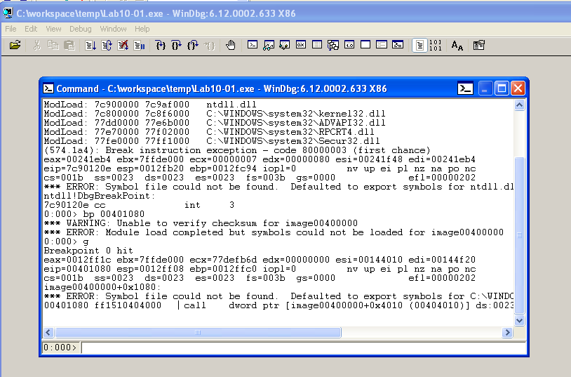
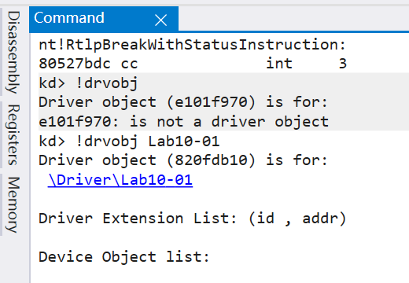
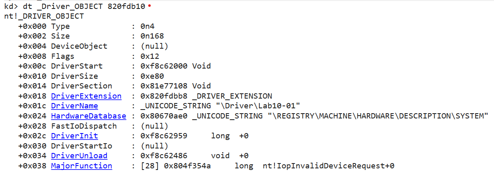
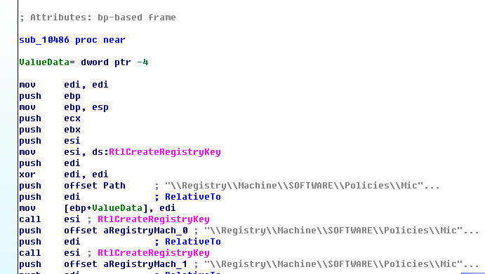

# 实验8 使用WinDbg调试内核级恶意代码

##  1 实验目的

掌握内核级程序动态调试技术，能够使用工具初步分析恶意代码。

##  2 实验前提

- 请安装虚拟机 winXPenSP3 调试环境。
- 安装WinDbg
  - windows 7/8/10 下，安装winsdk时，单独选择debugger
  - 或可以试用 microsoft store中的windows debugger preview

本实验包括一个驱动程序和一个可执行文件。
- 可执行文件是Lab10-l.exe
- 驱动程序是Lab10-0l.sys。
- 为了使程序能够正常运行，必须将驱动程序放到C:\Windows\System32目录下，这个目录在受害者计一算机中己经存在。

##  3 实验内容

使用WinDbg等工具分析：
- Lab10-01.exe和Lab10-01.sys
- Lab10-02.exe
- Lab10-03.exe

##  4 实验步骤

###  4.1 分析Lab10-01.exe和Lab10-01.sys

1.这个程序是否直接修改了注册表(使用procmon来检查)?

>提示：使用procmon监视这个程序，你会看到唯一写注册表的地方是键值HKLM\SOFTWARE\
Microsoft\Cryptography\RNG\Seed的RegSetValue调用。对注册表的一些间接修改通过调用CreateServiceA来完成。事实上，如果我们使用regshot，会发现这个程序还是修改了注册表的一些键值，这些修改是从内核直接修改的，不能被procmon记录。

2.用户态的程序调用了ControlService函数，你是否能够使用WinDbg设置一个断点，以此来观察由于ControlService的调用导致内核执行了怎样的操作?

> 提示：要设一个断点来查看内核发生了什么，你必须使用一个运行在虚拟机中的WinDbg实例打开可执行文件10-01.exe。宿主机中的windbg用于调试内核（观察10-01.sys）。当Lab10-Ol.exe在虚拟机中被新停后，使用!drvobj命令获得驱动设备的句柄，它包含一个卸载函数的指针。接下来，在驱动的卸载函数上设置一个断点。重启lab 10-0l .exe之后，断点将会被触发。

>在试图使用WinDbg分析这个驱动之前，我们可以用IDA Pro打开这个驱动，来检查它的DriverEntry函数。    这个函数是驱动的入口点，但是它不是DriverEntry函数。编译器在DriverEntry的周围插入封装代码。真正的DriverEntry函数位于sub_10906处。
```
; Attributes: bp-based frame

; NTSTATUS __stdcall DriverEntry(PDRIVER_OBJECT DriverObject, PUNICODE_STRING RegistryPath)
public DriverEntry
DriverEntry proc near

DriverObject= dword ptr  8
RegistryPath= dword ptr  0Ch

mov     edi, edi
push    ebp
mov     ebp, esp
call    sub_10920
pop     ebp
jmp     sub_10906
DriverEntry endp
```
> DriverEntry函数的主体部分似乎将一个偏移量移入到一个内存位置。除此之外，它没有进行任何函数调用，也没有与系统进行交互。
> 为了在Lab10-01.sys载入内存后，使用WinDbg分析它，在虚拟机中，我们将可执行程序载入到Windbg中。使用下列命令，我们在驱动加载和卸载之间设置一个断点（在ControlService调用上，因为这个函数调用时它的第二个参数是1，查微软文档可知这是要SERVICE_CONTROL_STOP，之后sys就会被卸载，所以在此断点。):```bp 00401080```。然后，我们启动程序直到断点命中。
>

>一旦程序在断点处暂停，我们就跳出虚拟机，以便连接内核凋试器，并且获取关于Lab10-01.sys的信息。我们打开宿主机中的WinDbg，选择File-Kernel Debug,设置管道为```\\.\pipe\com_1```，波特率( baud rate )为115200，将宿主机上运行的WinDbg实例与虚拟机中的内核连接上。我们知道要分析的服务叫做Lab10-01,所以运行：```!drvobj```，来获取对象。

>命令```!drvobj```输出给我们提供驱动对象的地址。因为在设备对象列表中没有设备列出，所以我们明白这个驱动没有提供用户空间中应用程序访问的设备。
>

>注意:为了解决任何难以定位的服务名，你可以使用```!object \Driver```命令获取当前内核中的驱动对象列表。一旦获得了驱动对象地址，你就可以使用dt命令查看它。

>

>执行命令```dt _Driver_OBJECT 820fdb10```

>

>我们尝试确定驱动对象卸载时调用的函数：偏移量0x034的信息DriverUnload。然后，我们使用如下命令设置一个断点：```bp 0xf8c62486```。

>设置断点后，恢复内核运行。回到虚拟机内，看运行可执行程序的windbg，恢复它的运行。命中断点后，虚拟机卡死。此时回到宿主机中的windbg。单步调试代码，发现程序3次调用了RtlCreateRegistryKey函数，创建了一些注册表键，然后调用了2次RtlWriteRegistryValue函数，在这两个地方设置了EnableFirewall值为0.

> 如果 0xf8d4e486 处的卸载函数很长或者很复杂，那么使用WinDbg很难分析它。多数情况下，我们确定了函数的位置，使川IDA Pro比较容易分析，因为IDA Pro在分析函数功能力做的很好。然后，WinDbg中的函数位置与IDA Pro中的函数位置不同，所以为了在IDA pro中查看，必须进行手动计算。我们必须使用lm命令，计算函数从windbg加载文件开始处的偏移量。

>例如：文件被加载windbg中的 0xf8d4e000。若卸载函数数位于。我们从0xf8d4e486减去0xf8d4e000得到偏移量 0x486 。然后在IDA Pro中跳到卸载函数。例如，若IDA Pro加载基地址是0x00100000，那么我们在IDA Pro中地址0x00100486处找到卸载函数。>接下来我们使用静态分析和IDA Pro来验证我们在WinDbg中发现的东西。

>另外一种方法，在IDA Pro中，我们可以通过选择Edit——Segments——Rebase Program来改变基地址，从0x00100000改为0xf7c47000。

>


3.这个程序做了些什么?

> 提示：这个程序创建一个服务来加载驱动。然后，驱动代码会创建注册表键\Registry\Machine\
SOFTWARE\Policies\Microsoft\WindowsFirewall\StandardProfile和\Registry\Machine\
SOFTWARE\Policies\Microsoft\WindowsFirewall\DomainProfile。在Windows XP系统中，设置这些键值将禁用防火墙。


###  4.2 分析Lab10-02.exe

1.这个程序创建文件了吗?它创建了什么文件?
2.这个程序有内核组件吗?
3.这个程序做了些什么?

###  4.3 分析Lab10-03.exe

本实验包括一个驱动程序和一个可执行文件。你可以从任意位置运行可执行文件，但为了程序能够正常运行，必须将驱动程序放到。C:\Windows\System32目录下，这个目录在受害者计算机中已经存在。

可执行文件是Lab10-3.exe,驱动程序是Lab10-03.sys。

1.这个程序做了些什么?

2.一旦程序运行，你怎样停止它?

3.它的内核组件做了什么操作?
