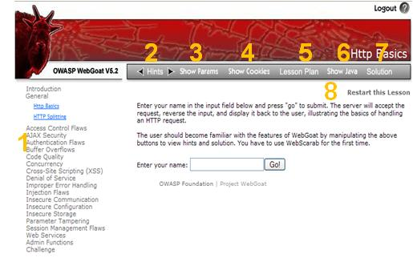

# 网络攻防技术实验手册

## 1 实验环境（演练靶机介绍）

### 1.1 攻击端 kali 2019 

为了演练网络攻击防御技术，推荐使用Kali Linux 2019作为攻击端，模拟渗透测试人员对目标进行安全评估和渗透测试。

安装使用方法可以参考：https://www.kali.org/kali-linux-documentation/


#### 1.1.1 其它选择

除了kali 2019 ，还有许多可用的集成型渗透测试工具，例如：

##### owasp 推出的hack-lab 

OWASP黑客实验室提供免费的远程安全（网络）挑战和谜语（OWASP TOP 10，OWASP WebGoat，OWASP Hackademics）。它与其他该死的易受攻击的应用程序和站点不同，它具有独特的教师应用程序。每个挑战都是要求漏洞，利用和缓解。发送您的解决方案和其他OWASP志愿者将对您的提交进行评分。一个可以与人类互动的系统。

而这个hack-lab同时提供了一个工具集，它基于kali，其光盘下载地址：https://livecd.hacking-lab.com/largefiles/livecd/daily/hl-livecd.ova


### 1.2 Web 靶机 

为了演练Web应用攻击与防护技术，可以使用 OWASP Broken Web Applications Project 2016年推出的虚拟机镜像。

 OWASP Broken Web Applications Project中收集了一些用于演练web攻防技术的web应用。可用于：

- 了解Web应用程序安全性
- 测试手册评估技术
- 测试自动化工具
- 测试源代码分析工具
- 观察网络攻击
- 测试WAF和类似的代码技术

项目是免费使用的。任何自定义代码/修改都是GPLv2，开源的。

虚拟机下载地址：https://sourceforge.net/projects/owaspbwa/files/

选择最新版本1.2。

源代码位置：https://github.com/chuckfw/owaspbwa/

使用VMware workstation按copy方式打开这个虚拟机。登录用户名为root ，密码为owaspbwa。


#### 1.2.1 WebGoat 5.4

在本教程中使用了 Webgoat 5.4版本。目前最新版本是8.0.
WebGoat使用Apache Tomcat服务器。它被配置为在localhost上运行.



上面的这个界面中的1,2,3...表示以下内容：
- 1.课程分类信息；
- 2.显示了一些解题的技术提示；
- 3.中包含了HTTP请求参数
- 4.中包含了Http请求cookies
- 5.中包含了课程的目标和对象
- 6.中包含了相关的java源代码
- 7.中包含了选定课程的完整解答
- 8.是一个重新学习本课程的按钮，按了会重启该课程。


#### 1.2.2 其它推荐 

OWASP Juice Shop Tool Project（https://www.owasp.org/index.php/OWASP_Juice_Shop_Project）

OWASP Juice Shop可能是最现代，最复杂的不安全Web应用程序！它可用于安全培训，意识演示，CTF以及作为安全工具的试验品！Juice Shop包含整个OWASP十大漏洞，以及在实际应用中发现的许多其他安全漏洞！


OWASP Web Application Security Testing Checklist 提供了一个用于渗透测试的对照表。https://github.com/0xRadi/OWASP-Web-Checklist

## 2 OWASP TOP 10 验证实验系列

实验列表：
- 实验 1 注入攻击一
- 实验 2 注入攻击二
- 实验 3 暴力破解http basic 认证
- 
### 2.1 实验 1 注入攻击一

#### 2.1.1 实验目的

通过实验，使学习者：
- 理解注入攻击的基本原理
- 掌握使用工具实施注入攻击的方法
- 理解Web系统防御注入攻击的对策

#### 2.1.2 实验内容

1.尝试对owasp bwa v1.2中的webgoat 5.4中的Injection Flaws —— Numeric SQL Injection进行SQL注入攻击。
2.尝试对owasp bwa v1.2中的webgoat 5.4中的Injection Flaws —— Log spoofing进行注入攻击。
3.尝试对owasp bwa v1.2中的webgoat 5.4中的Injection Flaws —— xpath injection进行注入攻击。
4.尝试对owasp bwa v1.2中的webgoat 5.4中的Injection Flaws —— String SQL Injection进行注入攻击。
5.尝试对owasp bwa v1.2中的webgoat 5.4中的Injection Flaws —— LAB:SQL Injection。

#### 2.1.3 实验过程

一、Numeric SQL Injection实验

1.启动 owasp bwa v1.2 虚拟机（启动后自动加载WebGoat 5.4 网站应用），查看其主机ip（下面以10.10.10.135为例）

2.启动 kali 2019虚拟机

3.在Kali 2019 虚拟机中打开设置了burpsuite proxy的浏览器firefox和Burp suite。

4.通过fireforx浏览器访问 webgoat 5.4 应用，链接为：http://10.10.10.135/WebGoat/attack，认证用户名webgoat，密码为webgoat；然后点击左侧导航Injection Flaws——Numeric SQL Injection。


上图中可见，选择下拉选择框的地区，例如“Columbia”，然后点“Go！”，可见出现下方的天气信息。

5.设置BurpSuite中的proxy-Interrupt is on ，准备拦截访问请求；然后再次点击上一步中的“Go！”，在拦截到的请求参数中插入sql语句：
```
 or 1=1  
```


6.点击burp suite proxy中的“Forward”，然后在浏览器中会发现下图结果：


注入成功。

二、Log Spoofing实验

1.启动 owasp bwa v1.2 虚拟机（启动后自动加载WebGoat 5.4 网站应用），查看其主机ip（下面以10.10.10.135为例）

2.通过任意浏览器访问 webgoat 5.4 应用，链接为：http://10.10.10.135/WebGoat/attack，认证用户名webgoat，密码为webgoat；然后点击左侧导航Injection Flaws——Log Spoofing。


说明：图中灰色部分代表了服务器日志中的记录。日志是网站安全维护时要审查的重点，写入虚假日志会扰乱、迷惑维护人员开展工作。本题的目标是在输入框中键入含特殊字符的字符串，使日志文件（灰色部分）出现“Login Succeeded for username: admin”的记录。

3.在“user name：” 输入框后键入如下内容：
```
whor%0d%0aLogin Succeeded for username: admin
```


注入成功。
> 这个例子仅是对日志欺骗的一个简单示例，实际的日志欺骗会复杂得多。

三、XPATH注入攻击

1.启动 owasp bwa v1.2 虚拟机（启动后自动加载WebGoat 5.4 网站应用），查看其主机ip（下面以10.10.10.135为例）

2.通过任意浏览器访问 webgoat 5.4 应用，链接为：http://10.10.10.135/WebGoat/attack，认证用户名webgoat，密码为webgoat；然后点击左侧导航Injection Flaws——XPATH Injection。

阅读页面提示可知，网站提供了一个工资查询表单，键入用户名和口令会输出工资。如下图所示：


如何查看其他人或所有人的信息呢？可以尝试注入攻击。一般情况下工资和员工信息存在数据库中，但这个例子中的信息存放在xml中。

3.在user name后的输入框中键入下面内容：
```
Mike' or '1'='1' or 'a'='a
```
4.在password输入框输入任意字符，例如“123”，之后提交，有下列结果：


注入成功。

说明：
开发人员构造的xpath查询语句大致为：
```
//user[name/text()='Mike' and password/text()='test123']
```
注入后查询语句改为：
```
//user[name/text()='Mike' or '1'='1' or 'a'='a' and password/text()='123']
```

四、String SQL Injection

1.启动 owasp bwa v1.2 虚拟机（启动后自动加载WebGoat 5.4 网站应用），查看其主机ip（下面以10.10.10.135为例）

2.通过任意浏览器访问 webgoat 5.4 应用，链接为：http://10.10.10.135/WebGoat/attack，认证用户名webgoat，密码为webgoat；然后点击左侧导航Injection Flaws——String SQL Injection。


3.尝试进行下列sql注入，然后点击“Go！”
```
Your Name' or 1=1 or '1'='1
```


五、综合SQL 注入

1.启动 owasp bwa v1.2 虚拟机（启动后自动加载WebGoat 5.4 网站应用），查看其主机ip（下面以10.10.10.135为例）

2.通过任意浏览器访问 webgoat 5.4 应用，链接为：http://10.10.10.135/WebGoat/attack，认证用户名webgoat，密码为webgoat；然后点击左侧导航Injection Flaws——LAB:SQL Injection。

3.尝试完成Stage 1。利用sql注入实现旁路认证。先试用表单，以Neville和任意密码login。可见“login failed”。


4.启动Kali 2019 虚拟机中打开设置了burpsuite proxy的浏览器firefox和Burp suite。通过fireforx浏览器访问相关链接，并用burp suite拦截请求，在password参数值处进行sql注入。

注入内容可以如下：
```
123' or 1=1 or '1'='1
```


5.注入完成后，点击浏览器页面上的“login”，可以看到第一阶段成功。


6.第二阶段，使用参数化查询方式修改源代码，使其能够防御一般的sql注入攻击。

过程略

7.第三阶段，首先要在密码输入处进行注入，以Larry用户身份登录。

注入内容为：
```
123' or '1'='1
```


8.然后在选择点击 View Profile，并使用burp进行拦截。


9.在 employee_id 参数处注入下面内容：
```
101 or 1=1 order by employee_id desc
```


注入成功。


#### 2.1.4 实验结论

### 2.2 实验 2 注入攻击二

#### 2.2.1 实验目的

- 掌握SQL注入修改数据、增加记录、删除记录的方法

#### 2.2.2 实验内容

完成Webgoat 5.4中Injection Flaws的下列攻击实验：
- Modify Data with SQL Injection
- Add Data with SQL Injection
- Database Backdoors
- Blind Numeric SQL Injection
- Blind String SQL Injection


#### 2.2.3 实验步骤

一、Modify Data with SQL Injection

1.打开webgoat5.4 Injection Flaws——Modify Data with SQL Injection 网页。这个页面可以通过键入用户id，例如jsmith，点击“Go！”后，会显示其工资水平。


```
jsmith' ; update users salary='30000' where userid = 'jsmith 
```


#### 2.2.4 实验结论

### 2.3 实验 3 暴力破解http basic 认证

#### 2.3.1 实验目的

通过实验，使学习者：
- 理解弱口令的危害；
- 掌握使用Burp suite intruder的基本方法；
- 掌握http basic auth的基本原理。

#### 2.3.2 实验内容

- 打开或构建webgoat应用
- 使用burpsuite 攻击webgoat的http基本认证

#### 2.3.3 实验步骤

##### 启动 owasp bwa 靶机

步骤：
1. 启动 owasp bwa 虚拟机。
2. 以 root用户名登录，密码owaspbwa。
3. 在 owasp bwa 虚拟机中运行ifconfig，确认其的IP地址。下面以10.10.10.135为例。
4. 在 kali linux 虚拟机 或 windows中的浏览器上访问 http://10.10.10.135/
5. 进入打开Web页面的Training applications中的OWASP WebGoat

##### 启动 kali 中的 Burpsuite
步骤：
1. 启动Burpsuite pro 2.1 ，查看器代理设置选项。


2. 打开 kali中浏览器，以firefox为例，设置其Preferences，找到 network proxy设置，点击 Settings，按burpsuite中选项情况设置连接。


3. 在burpsuite中Proxy启动中断，即“Intercept is on”，然后从kali访问 http://10.10.10.10.135/webgoat/attack


4. 点击 Forward，直到出现类似下图中的http请求。


5. 点右键，将这个请求发送到 Send to Intruder（或者点快捷键 Ctrl+I）


6. 在burp 的intruder的positions中设置注入位置参数。设置位置在Authorization：Basic 后的字段。


7. 设置burp intruder的payloads,首先选择payload type为"custom iterator"；然后设置“payload options”的Position 1，添加可能的用户名，并在下方Separator for position 1中设置为“:”


8. 设置“payload options”的Position 2，添加可能的密码。


9. 设置 payload processing，点击add，选择 Encode ，然后选择 Base64-encode。


10. 设置 payload Encoding。去除url编码中的= 、/ 、+。这些都是Base64中可能出现的字符。


11. 运行 start attack，启动 http basic auth 暴力破解攻击。
结果如下：


##### 实验结论

上面的第8行，payload是d2ViZ29hdDp3ZWJnb2F0，获得响应码为200，说明这个载荷可用，经过Base64解码可知是webgoat:webgoat。