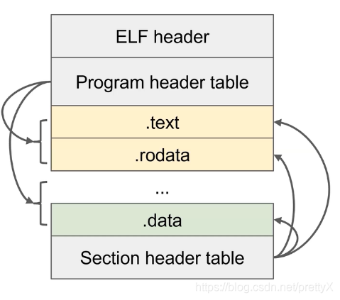
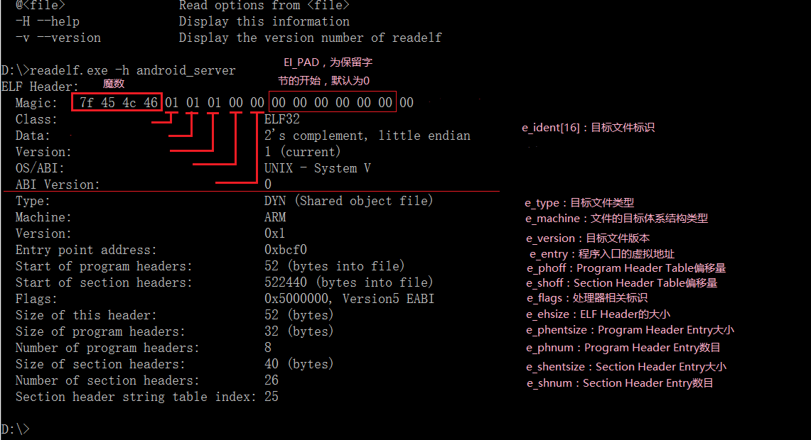
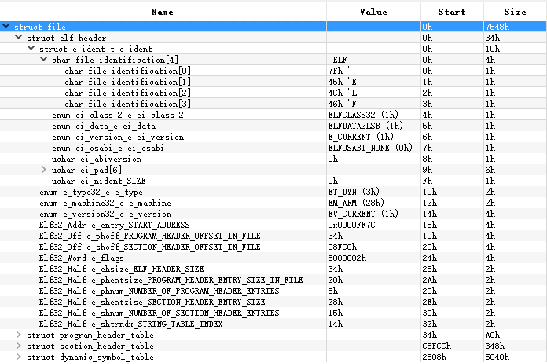
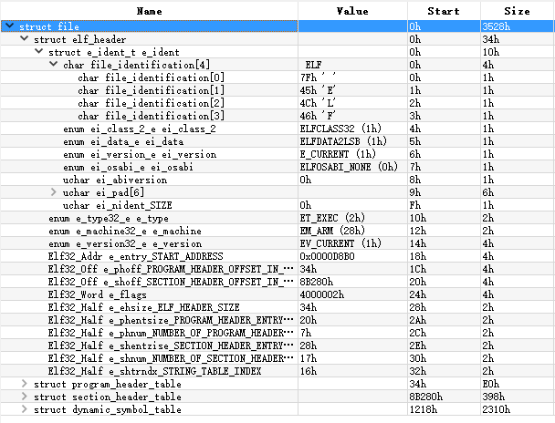
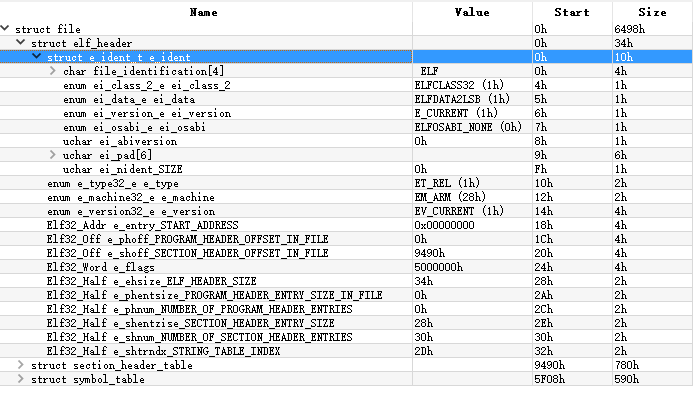
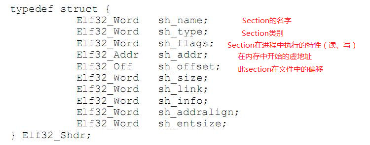
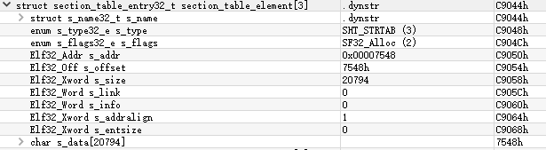
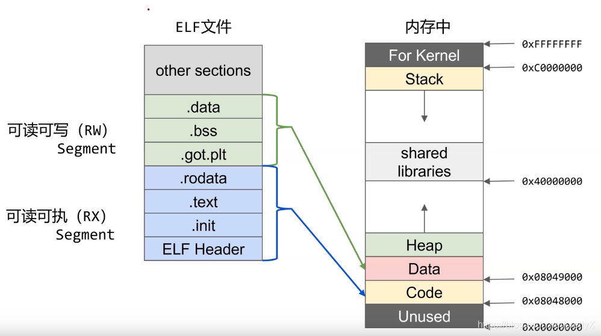

# ELF 文件分析

## 概念

ELF（Executable and Linkable Format），是一种Linux下常用的可执行文件、对象、共享库的标准文件格式。还有许多其他可执行文件格式：PE、Mach-O、COFF、COM...

内核中处理ELF相关代码参考：fs/binfmt_elf.c

### Segment 与 Section
ELF中的数据按照Segment、Section两个概念进行划分。

Segment：
- 用于告诉内核，在执行ELF文件时应该如何映射内存；
- 每个Segment主要包含：加载地址、文件中的范围、内存权限、对齐方式等信息，是运行时必须提供的信息。

Section：
- 用于告诉链接器，ELF中每个部分是什么，哪里是代码，哪里是只读数据，哪里是重定位信息；
- 每个Section主要包含Section类型、文件中的位置、大小等信息。链接器依赖Section信息将不同的对象文件的代码、数据信息合并，并修复互相引用。

Segment与Section的关系：
- 相同权限的Section会放入同一个Segment，例如.text和.rodata section；
- 一个Segment包含许多Section，一个Section可以属于多个Segment。

### ELF 文件类型

主要有3类：
- 可重定位的对象文件（Relocatable File），一般是*.o，必须包含section
- 可执行的对象文件（Executable File），必须包含segment
- 可被共享的对象文件（Shared File），也称动态库文件，一般为*.so。可与其他文件链接，必须同时包含segment和section。

#### 可重定位的对象文件(Relocatable file)

这是由汇编器汇编生成的 .o 文件。后面的链接器(link editor)拿一个或一些 Relocatable object files 作为输入，经链接处理后，生成一个可执行的对象文件 (Executable file) 或者一个可被共享的对象文件(Shared object file)。我们可以使用 ar 工具将众多的 .o Relocatable object files 归档(archive)成 .a 静态库文件。内核可加载模块 .ko 文件也是 Relocatable object file。

#### 可执行的对象文件(Executable file)

文本编辑器vi、调式用的工具gdb、播放mp3歌曲的软件mplayer等等都是Executable object file。Linux 系统里存在两种可执行的东西。除了这里说的 Executable object file，另外一种就是可执行的脚本(如shell脚本)。这些脚本不是 Executable object file，它们只是文本文件，但是执行这些脚本所用的解释器就是 Executable object file，比如 bash shell 程序。

#### 可被共享的对象文件(Shared object file)
即所谓的动态库文件，也即 .so 文件。将静态库换成动态库，可以节约磁盘和内存空间，有利于模块复用。动态库在发挥作用的过程中，必须经过两个步骤：
- 链接编辑器(link editor)将.so文件和其他Relocatable object file以及其他shared object file作为输入，经链接处理后，生存另外的 shared object file 或者 executable file。
- 在运行时，动态链接器(dynamic linker)将.so 文件和一个Executable file以及另外一些 Shared object file 来一起处理，在Linux系统里面创建一个进程映像。

### ELF 文件格式



#### ELF header
描述整个文件的组织，包含以下信息：
- 架构、ABI版本等信息
- Program Header Table 的位置和数量
- Section Header Table 的位置和数量

ELF Header 结构体定义如下：
```c
#define EI_NIDENT 16
typedef struct {
       unsigned char e_ident[EI_NIDENT];
       ELF32_Half e_type;
       ELF32_Half e_machine;
       ELF32_Word e_version;
       ELF32__Addr e_entry;
       ELF32_Off e_phoff;
       ELF32_Off e_shoff;
       ELF32_Word e_flags;
       ELF32_Half e_ehsize;
       ELF32_Half e_phentsize;
       ELF32_Half e_phnum;
       ELF32_Half e_shentsize;
       ELF32_Half e_shnum;
       ELF32_Half e_shstrndx;
}Elf32_Ehdr;
```


#### Program Header Table
描述文件中的各种segments，用来告诉系统如何创建进程映像的。

- 每个表项定义了一个 Segment
- 每个Segment可能包含多个Section
#### Section Header Table
- 包含了文件各个segction的属性信息；
- 每个表项定义一个Section

#### 查看 elf 文件头

可以使用命令```readelf -h 文件名```

查看ELF的 Program Header Table 中每个 Program Header Entity 信息：
```readelf -l Entity名称```

查看elf有哪些Section：
```readelf -S elf文件名```

查看elf的执行试图
```readelf -l或--segments 文件名```

Segment 是 Section的集合，Sections按一定规则映射到某个segment。为什么要区分两者？

因为当ELF文件被加载到内存中后，系统会将多个具有相同权限（flg值）section合并一个segment。操作系统往往以页为基本单位来管理内存分配，一般页的大小为4096B，即4KB的大小。同时，内存的权限管理的粒度也是以页为单位，页内的内存是具有同样的权限等属性，并且操作系统对内存的管理往往追求高效和高利用率这样的目标。ELF文件在被映射时，是以系统的页长度为单位的，那么每个section在映射时的长度都是系统页长度的整数倍，如果section的长度不是其整数倍，则导致多余部分也将占用一个页。而我们从上面的例子中知道，一个ELF文件具有很多的section，那么会导致内存浪费严重。这样可以减少页面内部的碎片，节省了空间，显著提高内存利用率。


#### 三种ELF文件的文件头区别
使用010Editor的ELF模板也可以看到ELF Header结构。对比以下三类ELF文件，我们得到了以下结论：
- e_type标识了文件类型
- Relocatable File（.o文件）不需要执行，因此e_entry字段为0，且没有Program Header Table等执行视图
- 不同类型的ELF文件的Section也有较大区别，比如只有Relocatable File有.strtab节。

下图为动态库（so文件，共享对象文件）的头部：


下图为可执行文件的头部：


下图为可重定位文件（.o）头：


#### 需要关注的几个字段

##### e_entry 程序入口处

所谓程序进入点是指当程序真正执行起来的时候，其第一条要运行的指令的运行时地址。

- Relocatable objects file只是供再链接而已，所以它不存在进入点。即.o文件的进入点是0x0(e_entry)，这表面Relocatable objects不会有程序进入点。
- 可执行文件test和动态库.so都存在所谓的进入点
- 可执行文件的e_entry指向C库中的_start；
- 动态库.so中的进入点指向 call_gmon_start。

##### e_ehsize 

ELF Header结构大小

##### e_phoff、e_phentsize、e_phnum

e_phoff、e_phentsize、e_phnum：描述Program Header Table的偏移、大小、结构。

##### e_shoff、e_shentsize、e_shnum
描述Section Header Table的偏移、大小、结构。

##### e_shstrndx

这一项描述的是字符串表在Section Header Table中的索引，值25表示的是Section Header Table中第25项是字符串表（String Table）。


#### SEction头
一个ELF文件中到底有哪些具体的 sections，由包含在这个ELF文件中的 section head table(SHT)决定。在SHT中，针对每一个section，都设置有一个条目（entry），用来描述对应的这个section，其内容主要包括该 section 的名称、类型、大小以及在整个ELF文件中的字节偏移位置等等。我们也可以在TISCv1.2规范中找到SHT表中条目的C结构定义：



打开条目，我们可以看到每个entry的具体字段，与上图的Elf32_Shdr结构一致。

需要注意的是，sh_name值实际上是.shstrtab中的索引，该string table中存储着所有section的名字。下图中蓝色部分是.shstrtab的数据，我们可以看到，sh_name实际上是从索引1开始的”.shstrtab”字符串，因此这里的sh_name值为1h。

#### 重要的 Section
下面我们分析一些so文件中重要的Section，包括符号表、重定位表、GOT表等。

##### 符号表(.dynsym)

符号表包含用来定位、重定位程序中符号定义和引用的信息，简单的理解就是符号表记录了该文件中的所有符号，所谓的符号就是经过修饰了的函数名或者变量名，不同的编译器有不同的修饰规则。例如符号_ZL15global_static_a，就是由global_static_a变量名经过修饰而来。

符号表项的格式如下：
```c
typedef struct {  
     Elf32_Word st_name;      //符号表项名称。如果该值非0，则表示符号名的字
                                             //符串表索引(offset)，否则符号表项没有名称。
     Elf32_Addr st_value;       //符号的取值。依赖于具体的上下文，可能是一个绝对值、一个地址等等。
     Elf32_Word st_size;         //符号的尺寸大小。例如一个数据对象的大小是对象中包含的字节数。
     unsigned char st_info;    //符号的类型和绑定属性。
     unsigned char st_other;  //未定义。
     Elf32_Half st_shndx;        //每个符号表项都以和其他节区的关系的方式给出定义。
　　　　　　　　　　　　　//此成员给出相关的节区头部表索引。
} Elf32_sym; 
```

##### 字符串表（.dynstr）

上面我们提到，符号表的st_name是符号名的字符串表中的索引，那么字符串表中肯定存放着所有符号的名称字符串。下面，我们先来看一看字符串表的section header表项：



再看一下下图中字符串表的具体内容，我们可以看出，.dynstr和.shstrtab结构完全相同，不过一个存储的是符号名称的字符串，而另一个是Section名称的字符串。

##### 重定位表

重定位表在ELF文件中扮演很重要的角色，首先我们得理解重定位的概念，程序从代码到可执行文件这个过程中，要经历编译器，汇编器和链接器对代码的处理。然而编译器和汇编器通常为每个文件创建程序地址从0开始的目标代码，但是几乎没有计算机会允许从地址0加载你的程序。如果一个程序是由多个子程序组成的，那么所有的子程序必需要加载到互不重叠的地址上。重定位就是为程序不同部分分配加载地址，调整程序中的数据和代码以反映所分配地址的过程。简单的言之，则是将程序中的各个部分映射到合理的地址上来。

换句话来说，重定位是将符号引用与符号定义进行连接的过程。例如，当程序调用了一个函数时，相关的调用指令必须把控制传输到适当的目标执行地址。具体来说，就是把符号的value进行重新定位。

可重定位文件必须包含如何修改其节区内容的信息，从而允许可执行文件和共享目标文件保存进程的程序映象的正确信息。这就是重定位表项做的工作。重定位表项的格式如下：

```c
typedef struct {  
    Elf32_Addr r_offset;     //重定位动作所适用的位置（受影响的存储单位的第一个字节的偏移或者虚拟地址）
    Elf32_Word r_info;       //要进行重定位的符号表索引，以及将实施的重定位类型（哪些位需要修改，以及如何计算它们的取值）
                                         //其中 .rel.dyn 重定位类型一般为R_386_GLOB_DAT和R_386_COPY；.rel.plt为R_386_JUMP_SLOT
} Elf32_Rel; 

typedef struct {  
    Elf32_Addr r_offset;  
    Elf32_Word r_info;  
    Elf32_Word r_addend;
 } Elf32_Rela; 
```

#### 常见的重定位表类型：

.rel.text：重定位的地方在.text段内，以offset指定具体要定位位置。在链接时候由链接器完成。.rel.text属于普通重定位辅助段 ,他由编译器编译产生，存在于obj文件内。连接器连接时，他用于最终可执行文件或者动态库的重定位。通过它修改原obj文件的.text段后，合并到最终可执行文件或者动态文件的.text段。其类型一般为R_386_32和R_386_PC32。

.rel.dyn：重定位的地方在.got段内。主要是针对外部数据变量符号。例如全局数据。重定位在程序运行时定位，一般是在.init段内。定位过程：获得符号对应value后，根据rel.dyn表中对应的offset，修改.got表对应位置的value。另外，.rel.dyn 含义是指和dyn有关，一般是指在程序运行时候，动态加载。区别于rel.plt，rel.plt是指和plt相关，具体是指在某个函数被调用时候加载。我个人理解这个Section的作用是，在重定位过程中，动态链接器根据r_offset找到.got对应表项，来完成对.got表项值的修改。

.rel.dyn和.rel.plt是动态定位辅助段。由连接器产生，存在于可执行文件或者动态库文件内。借助这两个辅助段可以动态修改对应.got和.got.plt段，从而实现运行时重定位。

.rel.plt：重定位的地方在.got.plt段内（注意也是.got内,具体区分而已）。 主要是针对外部函数符号。一般是函数首次被调用时候重定位。首次调用时会重定位函数地址，把最终函数地址放到.got内，以后读取该.got就直接得到最终函数地址。我个人理解这个Section的作用是，在重定位过程中，动态链接器根据r_offset找到.got对应表项，来完成对.got表项值的修改。

.plt段（过程链接表）：所有外部函数调用都是经过一个对应桩函数，这些桩函数都在.plt段内。具体调用外部函数过程是：
调用对应桩函数—>桩函数取出.got表表内地址—>然后跳转到这个地址.如果是第一次,这个跳转地址默认是桩函数本身跳转处地址的下一个指令地址(目的是通过桩函数统一集中取地址和加载地址),后续接着把对应函数的真实地址加载进来放到.got表对应处,同时跳转执行该地址指令.以后桩函数从.got取得地址都是真实函数地址了。


.got（全局偏移表）


### 内存映射



通过 /proc/[pid]/maps 查看内存映射情况:

先查出pid：
```ps -ef | grep 进程名```

根据pid看map
```cat /proc/[pid]/maps```


## 常用分析示例

### 二进制文件基本分析：
- 使用 `file <二进制文件名>` 分析文件类型；
- 使用 `strings <二进制文件名>` 分析文件内的字符串；
- 使用 `xxd <二进制文件名> | less` 查看二进制文件的 16进制内容。
  - xxd 命令常用于给出指定文件的十六进制形式。，类似于 uuencdoe，也可以将二进制数据转化为 mail-safe ASCII 形式，而且可用于打patch。
  - `xxd -s 0x30 test.txt` 跳过 0x30 个字节后显示内容
  - `xxd -l 0x30 test.txt` 仅显示长度为 0x30个字节内容。
  - `xxd -c 5 test.txt`  设置列数为 5
  - `xxd -b test.txt` 以二进制形式显示
  - `xxd -i test.txt` 以C代码形式输出（将文件的16进制以数组形式组织为c语言）。
  - `xxd test.txt | xxd -r > somefile`将test.txt的16进制形式再转换为二进制放入somefile文件。
- 使用 objdump 查看文件的信息、文件汇编代码
  - 例如：`objdump -Mintel -D ./hello | grep "main>:" -A 8`
- 使用 readelf 查看文件信息、入口点等
  - 例如 `readelf -h ./hello | grep Entry`


### 内存和寄存器

64位系统中，有 $2^{64}$ 个字节课寻址的内存。即从0x0000000000000000 ～ 0xffffffffffffffff。

每个进程dou ben