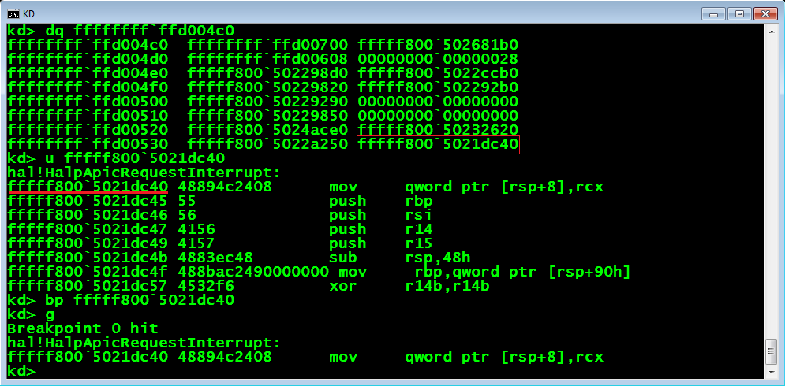
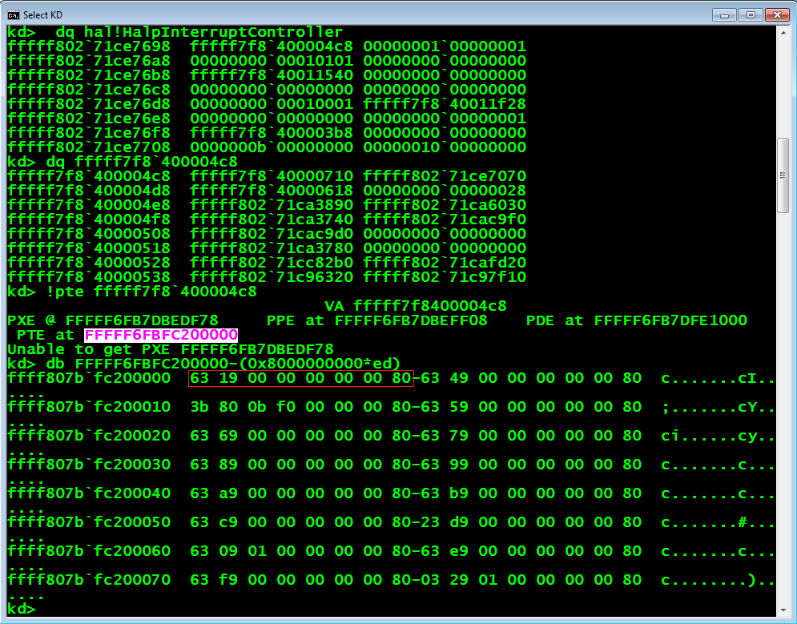
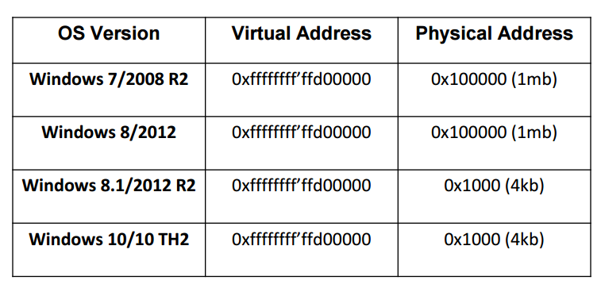

# HAL's Heap Exploitation

## Windows 10 HAL’s Heap – Extinction of the "HalpInterruptController" Table Exploitation Technique

内容来自：https://labs.bluefrostsecurity.de/blog/2017/05/11/windows-10-hals-heap-extinction-of-the-halpinterruptcontroller-table-exploitation-technique/

### 介绍

多年以来 windows中的 HAL's heap已经被定位在相同的静态内核地址。在32位版本windows中，它被定位在地址 0xffd00000 ，在64位windows中定位在 0xffffffff'ffd00000.

自从 windows8 ，一个被 HalpInterruptController （exported by HAL.DLL ） 调用的函数指针表被放在HAL's HEAP的第一个或第二个内存页（0xffd00000 or 0xffd01000 取决于内核调试是否enabled），所有的已存储函数指针可以指向各种包含在HAL.dll中的函数。

值得注意的是，这个表除了在某些特例下之外，通常已经放在同一内核地址。这使得这个表是一个理想的目标，可用于local或远程内核利用。

利用 HalpInterruptController 表的技术最先由 "Bypassing kernel ASLR - Target: Windows 10 (remote bypass)” by Stéfan Le Berre 提出。之后，Enrique Nissim and Nicolas Economou 发现了通过 winwos paging system 来利用 HAL's heap的方法，可参考"Getting Physical - Extreme abuse of Intel based Paging Systems"，2017年，Alex lonescu 利用这个项技术通过 USB Type-c 实现了他的 DMA 攻击，可参考 RECon presentation "Getting Physical With USB Type-C"。

### 利用 HalpInterruptController 表

既然已知 HalpInterruptController table在已知内存地址，且它由函数指针组成，那么他就是一个理想的内核利用目标，它可以带给你任意的写权限。假设我们的目标是64位系统，那么我们知道指针的大小是 8 Bytes。因为要以可控方式获取任一函数指针，我们需要完整可控的4或8字节写权限。

然而，任意4字节写权限就已经足够了，因为我们可以使用它覆盖64比特指针的低位部分，重定向程序流到另一个内核模块中，例如ntoskrnl.exe，win32k.sys，或者 hal.dll。当然这假设了我们知道他们在内存的地址。

另一个选项将是使用用户模式地址，覆盖完整的64位指针，以直接跳转到你的shellcode位置。然而，但如今，这种没有启用SMEP(Supervisor Mode Exceution Prevention)机制的机器非常难找。所以这一选项意义不大。

### 技术实现

实现 HalpInterruptController 表利用在已经实现了Medium Integrity Level渗透的基础上会比较简单。这是因为这种渗透应当已通过调用 NtQuerySystemInformation 函数，获取了内核的 base 地址。有了 kernel base 地址，我们可以简单的构建一个 ROP chain，通过关闭CR4注册表的第20位来绕过 SMEP，并最终跳转到用户空间里我们的shellcode处。

在 Low Integrity Level的情况下，此项技术仅当你能够通过结合其他的信息泄露漏洞，发现某些内核指针地址是才能使用HalpInterruptController 表。这同样适用于远程内核漏洞，它可以远程的泄露内核内存地址。

HalpInterruptController 表存储了一些可被覆盖（Corrupted）的函数指针，但依据我们的经验，理想的可用来覆盖的函数指针是 HAL!HalpApicRequestInterrupt pointer，它位于index 0xf（offset 0x78）。在Windows 10 种，这个函数指针通常（不总是）在地址 0xffffffff'ffd00538 处可被找到（加入内核调试enabled）。

这个指针相当频繁的被操作系统调用，所以我们必须小心的覆盖它，因为如果覆盖函数指针指向了一个错误的context，例如指向地址在另一个不同的进程中，那么他会导致一个 BSoD。

为了确定在我们重写该函数指针后，没有发生context切换，一旦重写指针就立即占用所有的CPU时间，避免在该指针使用时系统 Idle process 的执行。这确保了我们的进程 context 在实现exploitiation过程中保持 active。

一旦函数指针被重写，我们等到它被内核调用，内核会重定向内核控制流到我们的理想地址。

### Windows 10 Creators 更新

在2017年4月，微软发布了Win 10 "Creator Update", 版本号1703。这一新版本下，HAL’heap地址被随机化。后果是 HalpInterruptController table 在内存中的地址是随机的。 HalpInterruptController table 仍然位于 HAL's heap的内存第一页，offset也是确定的，和原来仅有8字节不同。

自此以后，HalpInterruptController table 不那么容易被利用了，除非泄露了内核地址。此外HalpInterruptController table对应的物理地址在近期没有改变（2018）。

如果我们查看下面的截图，我们可以看到这个表位于虚地址  0xfffff7f8'400004c8， 当我们在kd下运行`!pte`命令来获取物理地址时，我们看到PTE（Page Table Entry）位于地址0xffff807b'fc200000. 寻找真实的PTE位置（自从windows 10 年度更新后已随机化），我们能够找到它在 0xffff807b'fc200000 minus (512GB x 0xed)。所以，我们可以看到被PTE使用的物理地址，仍然映射了HAL's堆的第一页（0x1000（PFN 0x1））。

看下面的表，我们能发现地址在windows8.1时就被使用了（使用VMWare workstation）

### 结论

尽管在权限扩展方面，HalpInterruptController table不再非常有效，还存在许多的可用于修改某个PTE的任意写，直接映射这个表或别的通过开启Page Size（PS bit）隐身一个大页（2MB）来生成一个PDE(Page Directory Entry)，以包含这个表。这时，表的内容被读取，用于构建一个在HAL.DLL中的ROP chain，接下来就覆盖一个函数指针，在用户空间可以执行 ring-0代码。

Windows 10 的Creators update版本同时也杀掉了其他几个有用的内核渗透技术。

### 参考
References
- https://drive.google.com/file/d/0B3P18M-shbwrNWZTa181ZWRCclk/edit?pli=1
- https://www.coresecurity.com/system/files/publications/2016/05/CSW2016%20-%20Getting%20Physical%20-%20Extended%20Version.pdf
- http://alex-ionescu.com/publications/Recon/recon2017-bru.pdf