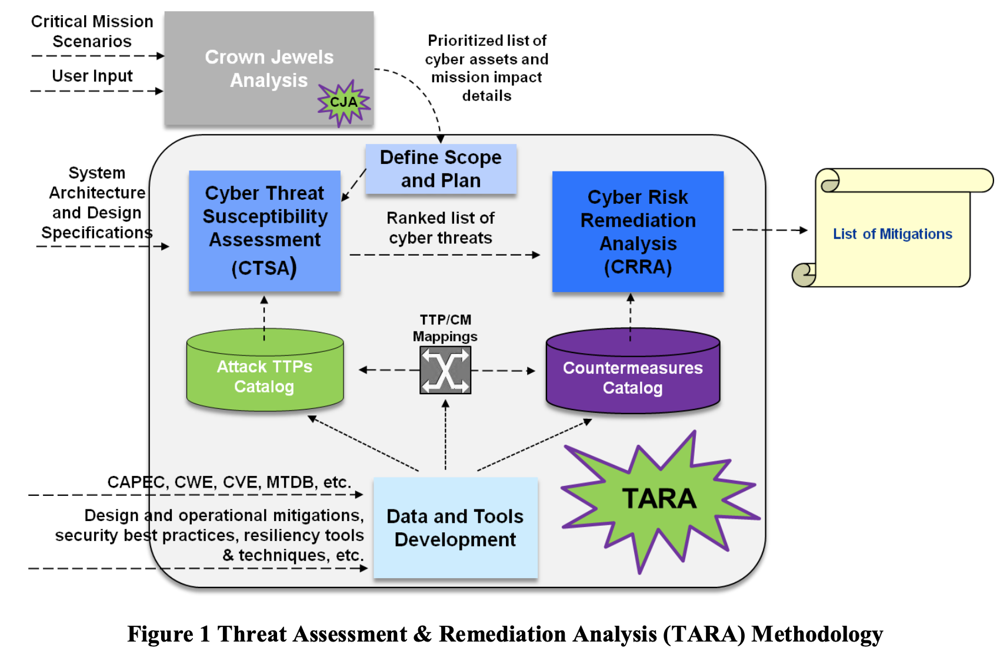

# TARA 方法描述
> 来源：MITRE 组织 Threat Assessment & Remediation Analysis (TARA) Methodology Description Version 1.0

Threat Analysis and Remediation Analysis， TARA

## 术语

MAE：Mission Assurance Engineering 任务确认工程，是企业系统工程（ESE）的子学科，旨在对高级持续威胁（APT）提供任务保障。保障任务系统中存在APT的情况下，仍然能够保障任务执行成功。

APT：Advanced Persistent Threat，高级持续威胁。特点是（1）在很长一段时间内反复追求其目标；（2）能够应对/适应防护能力；（3）决心维护执行其目标所需的交互水平。NIST SP 800-39 将APT定义为“拥有尖端技术水平和重要资源的敌手，使其能够通过使用多种攻击载体（如网络、物理和欺骗）创造机会来实现目标。”

APT使用不断发展的战术、技术、程序（TTPs）在企业的信息基础设施中建立和维护立足点，并利用该立足点过滤大量敏感信息，破坏关键任务信息和（或）拒绝或降低任务能力。

TARA，是一种识别和评估网络威胁并选择有效缓解这些威胁的对策的方法。通过与CJA共同识别关键资产、评估安全和增强安全，是任务保障的基础。

CJA，Crown Jewels Analysis 用于关键资产识别。

Resilience 弹性：是指提供和维持一种可接受等级服务的能力，以面对故障和正常运行时的挑战。它还被描述为一种应急的属性，它允许复杂系统承受外部压力，识别、预测和抵御不断演变的风险，或自适应地作出响应以避免潜在损失。

Coutermeasures（CMs）：应对措施

Cyber Threat Susceptibility Analysis（CTSA）：网络安全威胁易感染性分析

Cyber Risk Remediation Analysisi CRRA：网络风险缓解分析

CTSA和CRRA的组合方法，统称为TARA，它是MITRE 任务保障工程（MAE）组合中的一种系统级工程实践。

Scientific Advisory Board （SAB）：科学咨询委员会

## TARA 基本描述

TARA 是一种工程方法，通过应用降低风险的对策来识别、优先排序和应对易受攻击的网络威胁。

TARA 方法论包括3个活动：网络威胁易受