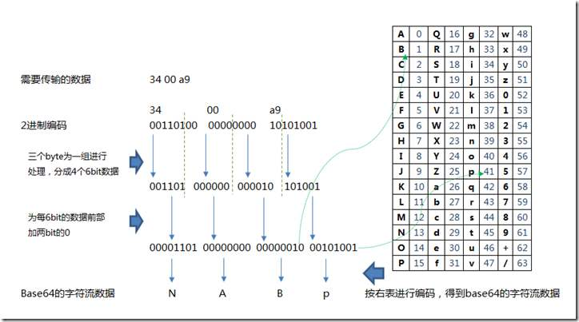

# Web应用程序技术

web系统的技术框架，大致如下图所示：


## HTTP

HTTP指超文本传输协议，是访问WWW使用的核心通信协议。


## URL

## HTML

## HTTPS

## Web通信过程中的编码

Web应用中常见的字符编码有：

- URL编码
- Unicode编码
- HTML 编码
- Base64 编码
- 16进制编码

### URL编码

URL只允许使用US-ASCII字符集中的可打印字符，即ASCII码中的0x20~0x7e内的字符，而且其中一些字符在HTTP协议或URL标准中有特殊含义，所以0x20~0x7e内的也不是全部可用于URL。

URL编码遵循下列规则： 

- 每对name/value由&；符分开；
- 每对来自表单的name/value由=符分开。
- 如果用户没有输入值给这个name，那么这个name还是出现，只是无值。
- 任何特殊的字符（非七位ASCII，如汉字）将以百分符%用十六进制编码，包括象 =  & ；，和 % 这些特殊的字符。

url编码就是一个字符ascii码的十六进制，然后在前面加上“%”。比如“\”，它的ascii码是92，92的十六进制是5c，所以“\”的url编码就是%5c。那么汉字的url编码呢？很简单，看例子：“胡”的ascii码是-17670，十六进制是BAFA，url编码是“%BA%FA”。

#### URL编码方案

功能：对扩展ASCII码中的任何有问题字符进行编码，使其可以通过HTTP安全传输。

- 任何URL编码的字符都以 % 为前缀；
- 其后是这个字符的两位16进制ASCII代码。

例如：
- %3d 表示 =
- %25 表示 %
- %20 表示 空格
- %0a 表示 新行
- %00 表示 空字节
- 加号+ 表示URL编码的空格

**注意：如果在渗透过程中，需要将下列字符当作数据插入HTTP请求，就必须将它们进行URL编码：**
> 空格 % ？ & = ; + # 


### Unicode编码

Unicode编码是一种为支持全球使用的各种文字编码而设计的一种字符编码标准。

Unicode是国际组织制定的可以容纳世界上所有文字和符号的字符编码方案。目前的Unicode字符分为17组编排，0x0000 至 0x10FFFF，每组称为平面（Plane），而每平面拥有65536个码位，共1114112个。然而目前只用了少数平面。UTF-8、UTF-16、UTF-32都是将数字转换到程序数据的编码方案。

16位的Unicode编码原理于URL编码类似，为了通过HTTP进行传输，16位Unicode编码的字符以 %u 为前缀，其后是这个字符的16进制Unicode码点。

例如：
- %u2215 表示 /
- 中文范围 4E00-9FA5
  
#### UTF-8

UTF-8是一种长度可变的编码标准，它使用1个或几个字节表示每个字符。UTF-8的特点是对不同范围的字符使用不同长度的编码。对于0x00-0x7F之间的字符，UTF-8编码与ASCII编码完全相同。UTF-8编码的最大长度是4个字节。

|Unicode编码(十六进制)　|UTF-8 字节流(二进制)|
|-|-|
|000000-00007F|0xxxxxxx|
|000080-0007FF|110xxxxx 10xxxxxx|
|000800-00FFFF|1110xxxx 10xxxxxx 10xxxxxx|
|010000-10FFFF|	11110xxx10xxxxxx10xxxxxx10xxxxxx|

为通过http传输，UTF-8编码的多字节字符以%为前缀，其后用16进制表示每个字节。

**攻击Web应用程序时，之所以要用到Unicode编码，主要在于有时可以用它来破坏输入确认机制（输入检查）。如果输入过滤阻止了某些恶意表达式，但随后处理输入的组件识别Unicode编码，就可以使用各种标准于畸形Unicod编码避开过滤。**

### HTML 编码

HTML编码是一种用于表示问题字符，使其能安全并入HTML文档的方案。

有许多字符有特殊含义（HTML元字符），用于定义文档结构，而非文本。为了让这些字符能与文本内容共存，就需要将他们编码。

例如：
```
&quot; 表示 "
&apos; 表示 '
&amp; 表示 &
&lt; 表示 <
&gt; 表示 >
```
此外，任何字符都可以使用它的十进制ASCII码进行HTML编码，例如：
```
&#34; 表示 "
&#39; 表示 '
```
或者使用16进制的ASCII码（以x为前缀），例如：
```
&#x22; 表示 "
&#x27; 表示 '
```
**当攻击Web应用时，HTML编码主要在探查跨站脚本（XXS)时发挥作用。如果应用程序在响应中返回未被修改的用户输入，那么它可能容易被攻击；通常对一些危险（特殊含义）字符进行HTML编码会加强安全性。**

### Base64 编码

Base64编码将任何二进制数据转换为ASCII字符。它常用于：
- 对电子邮件进行编码，使其通过SMTP安全传输。
- 在HTTP Basic Auth中对用户/密码进行编码。
- 其它仅允许ASCII码通过的检查机制。

Base64编码将输入数据转换成3个字节块。每个块被划分为4段，每段6个数据位。这6位二进制有64种排列组合可能，所以可用一组64个不同的ASCII字符进行替换表示。



Base64字符集中包含的字符有： A-Z a-z 0-9 + /

如果，最后的输入数据块不够3个字节，就用一个或两个=号来补足。

**许多Web应用利用Base64编码在cookie、其它参数中传送二进制数据，甚至用于打乱敏感数据以防止修改。**

请注意任何发送到客户端的Base64数据。


### 十六进制编码

许多Web应用在传送二进制数据时，直接使用16进制编码，用ASCII字符表示16进制数据块。

例如，在cookie中的用户名daf进行16进制编码：646166

和Base64编码类似，16进制编码的数据也容易辨认。

### 远程和序列化框架

近些年出现了各种用于创建用户界面的框架，这些框架中的客户端可以远程访问服务器的API.

这里框架包括：
- Flex和AMF
- Silverlight和WCF
- Java序列化对象


## 解析Web应用程序

### 发现（枚举）内容与功能

手动浏览Web应用就可以发现很多信息。从初始页面开始，查看每一个链接和多阶段功能（注册、密码重置、查询...）。如果有sitemap，那么可以借助它实现枚举。

#### 使用Web 爬虫实现自动化Web抓取

为了使发现过程更加自动化，可以使用网络爬虫工具，例如：
- Burp suite
- WebScarab

使用爬虫虽然提升了效率，降低人工强度，但也有问题：
- 无法处理由JavaScript触发的URL或网页内容
- 无法抓取隐藏在客户端对象中的链接（Flash、java applet)
- 无法自动通过严格的输入检查，例如登录、查询表单等
- 无法遍历表单选项全部内容
- 无法应对某些应用中的无用url链接，可能会陷入无限爬取
- 不能较好地应对身份验证机制
- 可能受Web应用限制访问
- 不能按人工操作顺序访问，可能触发防护机制。


#### 用户特定Web页面或资源的定向抓取

通用web爬取解决不了的问题很多，用户需要手动去分析。

介绍一个基本的渗透步骤：
1. 配置浏览器，使Burp suite等工具成为本地代理服务器。
2. 以人工方式浏览目标Web应用，每一个访问过的链接将被记录到Burp suite等工具中。
3. 提交每一个表单并执行全部多阶段功能。
4. 尝试在JavaScript激活与禁用、Cookie激活与禁用的情况下进行浏览。
5. 检查由代理服务器/爬虫工具生成的网站地图，确定手动浏览时没有发现的所有应用程序内容或功能。确定爬虫如何枚举每一项内容。
6. 以已经枚举的所有内容为基础，主动抓取站点内容，首先确定任何危险的或可能会中断应用程序会话的URL，运行爬虫并检查它发现的结果以查找其它所有内容。

访问所获取的信息可作为后续攻击的基础。

#### 发现隐藏内容

即便是完成了之前的访问呢，仍然会由许多内容是无法发现的，例如：
- 备份文件。如果使用动态页面（jsp、php等），它们的文件扩展名已经变为不可执行文件扩展名，可通过审查源代码，查找这些页面的漏洞。
- 包含Web根目录或之外完成文件快照的备份档案，可以使用它迅速确定应用程序的所有内容与功能。
- 部署在服务器上，用于测试目的且仍未与主程序建立链接的新功能。
- 对用户不可见，但服务器端可见的定制应用程序中的默认应用程序功能。
- 尚未删除的旧版文件。
- 配置和包含敏感数据（证书，数据库访问）的文件
- 编译现有应用程序功能的源文件
- 源代码中的敏感信息。
- 包含有效用户名、令牌、被访问URL以及执行操作等敏感信息的日志文件

常见的渗透测试步骤有：
1. 手动提交一些请求，查看服务器如何响应；
2. 使用已有的sitemap作为自动查找阴曹内容的基础；
3. 自动访问每个目录中常用文件名或路径。使用burp suite intruder 等工具，结合常用文件名和目录词汇表，自动生成大量请求。
4. 对于不能处理的请求，进行过滤
5. 收集响应，手动分析有意义的资源
6. 反复执行上述过程。

#### 应用程序页面与功能路径

尝试着根据功能路径解析应用程序，能够更加清楚的了解web应用的功能。了解了应用程序的核心功能，有利于：
- 建立更有针对性的攻击方案；
- 了解开发人员执行功能的期待和假设；
- 找到违背假设、逻辑的方法。

渗透测试步骤：
- 确定所有通过参数提交来指定的程序功能；
  - 例如/admin.jsp?action=editUser。
- 修改上述用于查找相关功能而用到的url，找到访问机制，尽量自动化；
- 绘制一幅功能调用图，说明之间的关系。


#### 发现隐藏的参数

在web请求中，可能会有许多隐藏参数。服务器根据这些参数进行功能细节控制。

渗透测试步骤：
- 使用常用调用参数名称和常用值列表，向一个已知应用的页面发出大量请求。
- 重复这一过程，直到遍历所有键值组合
- 可以使用多组有效载荷和cluster bomb攻击类型，使用burpsuite等工具完成测试
- 监控所有响应，确定任何表明增加参数后造成的影响
- 根据可用时间，在许多不同的页面中查找隐藏的参数。选择开发人员最有可能在其中执行调试逻辑的功能，如：登录、搜索、文件上传、下载等。

### 分析应用程序

- 确定用户输入入口点
- 确定服务器端技术
- 确定服务器端功能
- 解析受攻击面
- 解析WebGoat 或 水果店 或 DVWA应用程序（例子？）

#### 确定用户输入入口点

通常枚举程序功能的http请求时，会发现用户输入的入口，为了尽可能完整的获得可用的入口，需要注意以下几个方面：
- 每个URL字符串，包括查询部分的字符串标记
- URL查询字符串中提交的每个参数
- POST请求主体中提交的每个参数
- 每个cookie
- 极少情况下可能包括由应用程序处理的其他所有HTTP消息头，特别是USER-AGENT、Referer、Accept、Accept-Language和Host等。

