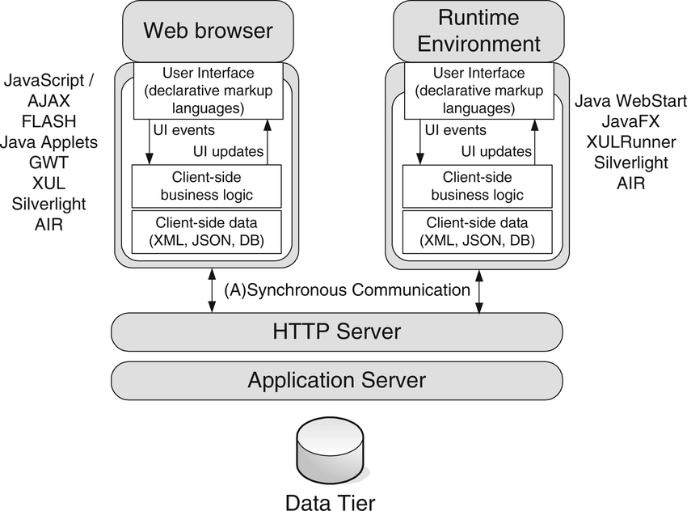

# Web应用程序技术

web系统的技术框架，大致如下图所示：


##  1 HTTP

我们通过实验来了解HTTP的基本概念和通信过程。

###  1.1 实验：Webgoat 网站 general 页面访问与分析

####  1.1.1 实验目的

了解HTTP的基本概念和通信过程。

####  1.1.2 实验内容

使用Burpsuite 访问 webgoat5.4-General-Http Basic，记录并分析访问过程。

####  1.1.3 实验步骤


1.打开webgoat网站，点击左侧导航 “General -http basics"。在页面输入框中输入任意字符串。但不点“go”。

> 说明：在下面的输入框中输入您的姓名，然后按“Go！”提交。服务器将接受请求，反转输入，并将其显示回用户，说明处理HTTP请求的基础知识。用户应该通过操作上面的按钮来查看提示、显示HTTP请求参数、HTTP请求cookie和Java源代码，从而熟悉WebGoat的特性。


2.启动 Burpsuite ，设置其“proxy - intercept is on“，使其处在监听状态。具体方法参考《Burpsuite 安装使用》。
3.再次操作浏览器，点击“go！”。此时，访问过程将被burp拦截，在burp suite的proxy中可以看到如下信息。


4.可以看到信息中包含了我们提交的字符串，以及请求原文。点击Proxy中的Params、Headers、Hex等页面，分析其中信息，然后点击“Forward”查看变化。

5.所有历史请求和响应，可以通过burp suite proxy中的“http history”查看。

6.点击webgoat中general第二部分http splitting（http 分片）。在输入框中输入China，启动burpsuite - proxy - interrupt is on 之后再点击"Search"。

> 说明：这一课有两个阶段。阶段1，告诉你如何做HTTP拆分攻击；阶段2 基于你所学，使用HTTP拆分执行Cache投毒。在上面的搜索框中键入一个搜索字符，然后点“search！”。你会注意到这个应用重定向了你的请求道另一个服务资源上。你需要使用CR（%0d）和LF（%0a）字符来实现这个攻击。你的攻击目标是强制使服务器发出“200 OK”这一http response。如果屏幕因你的攻击而改变了输出结果，那么就会回到主页。在第二阶段渗透成功后，你会在左侧菜单中发现绿色的check。你可以查看PHP字符编码，使用Encode和Decode URI Component按钮来翻译CR和LF.


可以看到在历史记录中，有302 Moved Temporarily，表示服务器告诉浏览器，URL临时改变了，应该采用Location返回的重定向地址，重新发送一次请求。这里有Location:http://10.10.10.135/WebGoat/attack?Screen=231&menu=100&fromRedirect=yes&language=china

重定向地址里面的Language参数，恰好就是通过浏览器里提交的参数“china”，这就存在着HTTP分拆漏洞的可能性。

7.在输入框中输入如下内容，实现http splitting攻击（%0d%0a即回车换行）。
```
china%0aContent-Length:%200%0a%0aHTTP/1.1%20200%20OK%0aContent-Type:%20text/html%0aContent-Length:%2047%0a<html>stage 1 success</html>
```
如果对url编码不熟悉，可以使用在线转换工具：http://tool.oschina.net/encode?type=4
上述注入代码内容即一个http请求头：
```
language:china
Content-Length: 0 
HTTP/1.1 200 OK 
Content-Type: text/html 
Content-Length: 47 
<HTML>stage 1 success</html>
```
提交后，会显示页面“stage 1 success”,然后回到webgoat-general会有以下界面。


上面的载荷还可以更为复杂一些，例如：
```
china%0aContent-Length:%200%0a%0aHTTP/1.1%20200%20OK%0aContent-Type:%20text/html%0aContent-Length:%2047%0a<html>%0ausername<input type="text" name="name"></html>
```

8.接下来，尝试stage 2——Cache Poisoning。

主要是设置Last-Modified参数为未来时间，比如2020年1月1日。意思是服务器告诉浏览器，这个网页最后一次修改是在2020年1月1日。

如果浏览器不清除缓存，下一次请求这个页面会加上if-modify-since字段，值是2020年1月1日，也就是说浏览器会问服务器，这个网页在2020年1月1日之后修改过嘛？

服务器可能会对这条信息莫名其妙，怎么会传过来一个未来的时间值？但是因为很多web程序都不进行审核，一般http服务器会对比最后一次修改时间和传过来的时间，发现传过来的时间较新，就会回送304即Not Modified，表示这个网页没有被修改过。浏览器接受到了这个响应会从本地缓存读取网页，当然是之前注入的错误网页。如果浏览器不清除缓存，再也别想读取到正确的网页信息了（所以为了加强终端的web安全，要设定较短的缓存清理周期）。这就是HTTP的Cache Poisoning(缓存毒化)。
我们准备的Stage2 攻击字串为：
```
China%0aContent-Length:%200%0a%0aHTTP/1.1%20200%20OK%0aContent-Type:%20text/html%0aContent-Length:%2047%0aLast-Modified:%20Mon, 27 Oct 2020 14:50:18 GMT%0a<html>stage 2 success</html>
```


####  1.1.4 实验结论

实验第一部分，演示了注入非法字符，获得意外结果的情况。这个情况可用于欺骗用户输入敏感信息。


这个实验的第二部分演示了使用Last-Modified这一http请求头参数欺骗服务器。Http cache毒化的常见于中间人攻击，即某个代理劫持了服务器内容，并修改其中信息，然后传递给用户。用户不知情的情况下，可能会泄露个人信息或提交受控的资源。

##  2 URL

##  3 HTML

##  4 HTTPS

##  5 Web通信过程中的编码

Web应用中常见的字符编码有：

- URL编码
- Unicode编码
- HTML 编码
- Base64 编码
- 16进制编码

###  5.1 URL编码

URL只允许使用US-ASCII字符集中的可打印字符，即ASCII码中的0x20~0x7e内的字符，而且其中一些字符在HTTP协议或URL标准中有特殊含义，所以0x20~0x7e内的也不是全部可用于URL。

URL编码遵循下列规则： 

- 每对name/value由&；符分开；
- 每对来自表单的name/value由=符分开。
- 如果用户没有输入值给这个name，那么这个name还是出现，只是无值。
- 任何特殊的字符（非七位ASCII，如汉字）将以百分符%用十六进制编码，包括象 =  & ；，和 % 这些特殊的字符。

url编码就是一个字符ascii码的十六进制，然后在前面加上“%”。比如“\”，它的ascii码是92，92的十六进制是5c，所以“\”的url编码就是%5c。那么汉字的url编码呢？很简单，看例子：“胡”的ascii码是-17670，十六进制是BAFA，url编码是“%BA%FA”。

####  5.1.1 URL编码方案

功能：对扩展ASCII码中的任何有问题字符进行编码，使其可以通过HTTP安全传输。

- 任何URL编码的字符都以 % 为前缀；
- 其后是这个字符的两位16进制ASCII代码。

例如：
- %3d 表示 =
- %25 表示 %
- %20 表示 空格
- %0a 表示 新行
- %00 表示 空字节
- 加号+ 表示URL编码的空格

**注意：如果在渗透过程中，需要将下列字符当作数据插入HTTP请求，就必须将它们进行URL编码：**
> 空格 % ？ & = ; + # 


###  5.2 Unicode编码

Unicode编码是一种为支持全球使用的各种文字编码而设计的一种字符编码标准。

Unicode是国际组织制定的可以容纳世界上所有文字和符号的字符编码方案。目前的Unicode字符分为17组编排，0x0000 至 0x10FFFF，每组称为平面（Plane），而每平面拥有65536个码位，共1114112个。然而目前只用了少数平面。UTF-8、UTF-16、UTF-32都是将数字转换到程序数据的编码方案。

16位的Unicode编码原理于URL编码类似，为了通过HTTP进行传输，16位Unicode编码的字符以 %u 为前缀，其后是这个字符的16进制Unicode码点。

例如：
- %u2215 表示 /
- 中文范围 4E00-9FA5
  
####  5.2.1 UTF-8

UTF-8是一种长度可变的编码标准，它使用1个或几个字节表示每个字符。UTF-8的特点是对不同范围的字符使用不同长度的编码。对于0x00-0x7F之间的字符，UTF-8编码与ASCII编码完全相同。UTF-8编码的最大长度是4个字节。

|Unicode编码(十六进制)　|UTF-8 字节流(二进制)|
|-|-|
|000000-00007F|0xxxxxxx|
|000080-0007FF|110xxxxx 10xxxxxx|
|000800-00FFFF|1110xxxx 10xxxxxx 10xxxxxx|
|010000-10FFFF|	11110xxx10xxxxxx10xxxxxx10xxxxxx|

为通过http传输，UTF-8编码的多字节字符以%为前缀，其后用16进制表示每个字节。

**攻击Web应用程序时，之所以要用到Unicode编码，主要在于有时可以用它来破坏输入确认机制（输入检查）。如果输入过滤阻止了某些恶意表达式，但随后处理输入的组件识别Unicode编码，就可以使用各种标准于畸形Unicod编码避开过滤。**

###  5.3 HTML 编码

HTML编码是一种用于表示问题字符，使其能安全并入HTML文档的方案。

有许多字符有特殊含义（HTML元字符），用于定义文档结构，而非文本。为了让这些字符能与文本内容共存，就需要将他们编码。

例如：
```
&quot; 表示 "
&apos; 表示 '
&amp; 表示 &
&lt; 表示 <
&gt; 表示 >
```
此外，任何字符都可以使用它的十进制ASCII码进行HTML编码，例如：
```
&#34; 表示 "
&#39; 表示 '
```
或者使用16进制的ASCII码（以x为前缀），例如：
```
&#x22; 表示 "
&#x27; 表示 '
```
**当攻击Web应用时，HTML编码主要在探查跨站脚本（XXS)时发挥作用。如果应用程序在响应中返回未被修改的用户输入，那么它可能容易被攻击；通常对一些危险（特殊含义）字符进行HTML编码会加强安全性。**

###  5.4 Base64 编码

Base64编码将任何二进制数据转换为ASCII字符。它常用于：
- 对电子邮件进行编码，使其通过SMTP安全传输。
- 在HTTP Basic Auth中对用户/密码进行编码。
- 其它仅允许ASCII码通过的检查机制。

Base64编码将输入数据转换成3个字节块。每个块被划分为4段，每段6个数据位。这6位二进制有64种排列组合可能，所以可用一组64个不同的ASCII字符进行替换表示。


Base64字符集中包含的字符有： A-Z a-z 0-9 + /

如果，最后的输入数据块不够3个字节，就用一个或两个=号来补足。

**许多Web应用利用Base64编码在cookie、其它参数中传送二进制数据，甚至用于打乱敏感数据以防止修改。**

请注意任何发送到客户端的Base64数据。


###  5.5 十六进制编码

许多Web应用在传送二进制数据时，直接使用16进制编码，用ASCII字符表示16进制数据块。

例如，在cookie中的用户名daf进行16进制编码：646166

和Base64编码类似，16进制编码的数据也容易辨认。

###  5.6 远程和序列化框架

近些年出现了各种用于创建用户界面的框架，这些框架中的客户端可以远程访问服务器的API.

这里框架包括：
- Flex和AMF
- Silverlight和WCF
- Java序列化对象


##  6 解析Web应用程序

###  6.1 发现（枚举）内容与功能

手动浏览Web应用就可以发现很多信息。从初始页面开始，查看每一个链接和多阶段功能（注册、密码重置、查询...）。如果有sitemap，那么可以借助它实现枚举。

####  6.1.1 使用Web 爬虫实现自动化Web抓取

为了使发现过程更加自动化，可以使用网络爬虫工具，例如：
- Burp suite
- WebScarab

使用爬虫虽然提升了效率，降低人工强度，但也有问题：
- 无法处理由JavaScript触发的URL或网页内容
- 无法抓取隐藏在客户端对象中的链接（Flash、java applet)
- 无法自动通过严格的输入检查，例如登录、查询表单等
- 无法遍历表单选项全部内容
- 无法应对某些应用中的无用url链接，可能会陷入无限爬取
- 不能较好地应对身份验证机制
- 可能受Web应用限制访问
- 不能按人工操作顺序访问，可能触发防护机制。


####  6.1.2 用户特定Web页面或资源的定向抓取

通用web爬取解决不了的问题很多，用户需要手动去分析。

介绍一个基本的渗透步骤：
1. 配置浏览器，使Burp suite等工具成为本地代理服务器。
2. 以人工方式浏览目标Web应用，每一个访问过的链接将被记录到Burp suite等工具中。
3. 提交每一个表单并执行全部多阶段功能。
4. 尝试在JavaScript激活与禁用、Cookie激活与禁用的情况下进行浏览。
5. 检查由代理服务器/爬虫工具生成的网站地图，确定手动浏览时没有发现的所有应用程序内容或功能。确定爬虫如何枚举每一项内容。
6. 以已经枚举的所有内容为基础，主动抓取站点内容，首先确定任何危险的或可能会中断应用程序会话的URL，运行爬虫并检查它发现的结果以查找其它所有内容。

访问所获取的信息可作为后续攻击的基础。

####  6.1.3 发现隐藏内容

即便是完成了之前的访问呢，仍然会由许多内容是无法发现的，例如：
- 备份文件。如果使用动态页面（jsp、php等），它们的文件扩展名已经变为不可执行文件扩展名，可通过审查源代码，查找这些页面的漏洞。
- 包含Web根目录或之外完成文件快照的备份档案，可以使用它迅速确定应用程序的所有内容与功能。
- 部署在服务器上，用于测试目的且仍未与主程序建立链接的新功能。
- 对用户不可见，但服务器端可见的定制应用程序中的默认应用程序功能。
- 尚未删除的旧版文件。
- 配置和包含敏感数据（证书，数据库访问）的文件
- 编译现有应用程序功能的源文件
- 源代码中的敏感信息。
- 包含有效用户名、令牌、被访问URL以及执行操作等敏感信息的日志文件

常见的渗透测试步骤有：
1. 手动提交一些请求，查看服务器如何响应；
2. 使用已有的sitemap作为自动查找阴曹内容的基础；
3. 自动访问每个目录中常用文件名或路径。使用burp suite intruder 等工具，结合常用文件名和目录词汇表，自动生成大量请求。
4. 对于不能处理的请求，进行过滤
5. 收集响应，手动分析有意义的资源
6. 反复执行上述过程。

####  6.1.4 应用程序页面与功能路径
####  6.1.5 发现隐藏的参数


###  6.2 分析应用程序

- 确定用户输入入口点
- 确定服务器端技术
- 确定服务器端功能
- 解析受攻击面
- 解析WebGoat 或 水果店 或 DVWA应用程序（例子？）

