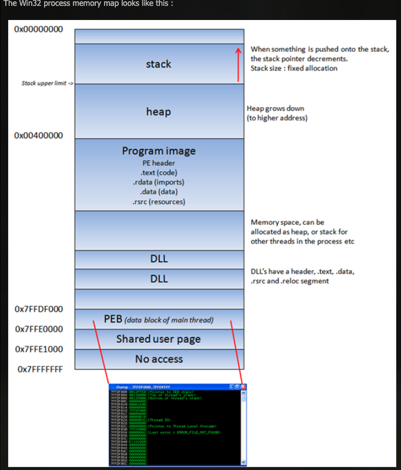
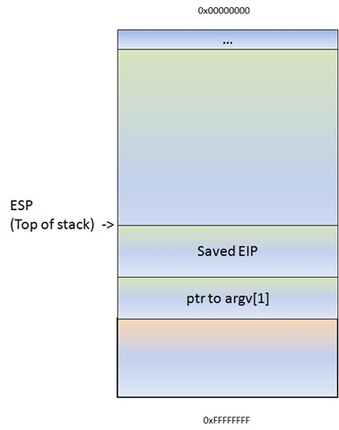
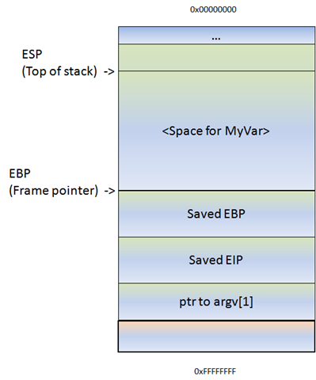
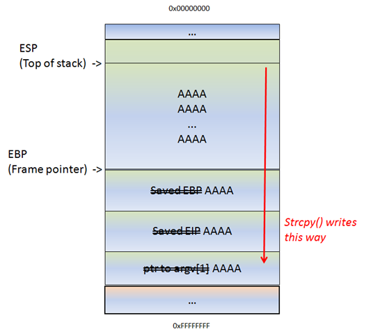

# EXP 编写教程


> 内容来源：https://www.corelan.be/index.php/2009/07/19/exploit-writing-tutorial-part-1-stack-based-overflows/
>Published July 19, 2009 | By Peter Van Eeckhoutte (corelanc0d3r)

## Tutorial 1 栈溢出

如果不能反汇编，轻松读懂shellcode，不建议下载一个exploit并运行它。因为这可能为某个攻击者打开一扇门。

下面以一个例子来介绍构建可工作exploit的基本过程。

有这样一个应用 Easy RM to MP3 Converter version 2.7.3.700 （windows xp sp2 ） ，加载错误的/恶意的 .m3u 文件时会出现程序报错和崩溃。

```py
from pwn import *

write('crash.m3u','A'*2000)
```

当然，并非每次程序崩溃都意味着有可利用的漏洞。很多情况下，不是这样的。所谓“exploit 利用”，指的是利用这个漏洞执行自定义的代码，包括恶意代码。这一点需要控制CPU 的程序计数器（PC），PC 指向了下一条待执行的机器指令。

在继续讨论前，需要明确几个概念：
- 每个windows 应用使用部分内存，进程的内存包括3个主要部分：
  - code segment，由EIP跟踪
  - data segment，存放变量、动态buffers
  - stack segment，用于传送数据/参数给函数，也用于变量存储数据。堆栈开始于栈底，止于栈顶。使用ESP可以访问堆栈，它指向了堆栈顶部。

- push 命令将数据压入堆栈，新 esp = 原 esp-4
- pop 命令将数据弹出堆栈， 新 esp  = 原 esp +4
- 函数或子程序开始执行时，一个堆栈栈帧生成，通常是先push一些寄存器参数，然后 ebp = esp，esp = esp-0x20等等的指令。栈帧保存了父程序传给函数的参数。堆栈的当前位置可以通过esp访问，堆栈底部由ebp访问。
- cpu的通用寄存器

### 进程内存

一个windows 应用程序在win32环境中启动时，会产生一个进程并被分配一段虚拟内存。在32位进程中，地址范围从 0x00000000 ～ 0xFFFFFFFF，其中 0x00000000 ～ 0x7FFFFFFF 分配给 user区，而 0x80000000 ～ 0xFFFFFFFF 分配给 kernel区。windows使用了 flat memory model， 意味着 CPU 可以直接的、顺序的、线性的寻址所有可用内存位置，不必要使用段或页机制。

Kernel 区的内存仅能由OS访问。

当一个进程产生时，会构建一个 PEB（进程执行块） 和若干 TEB（线程环境块）。

PEB：包含了当前进程相关的所有用户区参数。
- 主程序的内存地址
- 加载数据的指针（可用于列出可能被该进程加载的所有 dll / modules）
- 有关堆信息的指针

```cpp
typedef struct _PEB {
  BYTE                          Reserved1[2];
  BYTE                          BeingDebugged;
  BYTE                          Reserved2[1];
  PVOID                         Reserved3[2];
  PPEB_LDR_DATA                 Ldr;
  PRTL_USER_PROCESS_PARAMETERS  ProcessParameters;
  PVOID                         Reserved4[3];
  PVOID                         AtlThunkSListPtr;
  PVOID                         Reserved5;
  ULONG                         Reserved6;
  PVOID                         Reserved7;
  ULONG                         Reserved8;
  ULONG                         AtlThunkSListPtr32;
  PVOID                         Reserved9[45];
  BYTE                          Reserved10[96];
  PPS_POST_PROCESS_INIT_ROUTINE PostProcessInitRoutine;
  BYTE                          Reserved11[128];
  PVOID                         Reserved12[1];
  ULONG                         SessionId;
} PEB, *PPEB;
```

TEB：描述了线程状态，包括：
- PEB 的内存地址
- 该线程所属堆栈的地址
- 在SEH链中第一个entry的指针

每个在该进程中的线程都有一个TEB。
```cpp
typedef struct _TEB {
  PVOID Reserved1[12];
  PPEB  ProcessEnvironmentBlock;
  PVOID Reserved2[399];
  BYTE  Reserved3[1952];
  PVOID TlsSlots[64];
  BYTE  Reserved4[8];
  PVOID Reserved5[26];
  PVOID ReservedForOle;
  PVOID Reserved6[4];
  PVOID TlsExpansionSlots;
} TEB, *PTEB;
```



图中：
- 一个程序镜像的 text segment 是只读的，仅包含应用程序代码。这是防止有人修改。这个内存段是固定大小的。
- data segment 用于存放全局和静态程序变量。数据段用于初始化的全局变量、字符串、别的常量存放。这个段是可写的，有固定大小。
- heap segment 用于存放程序的其他变量，可以增大和缩小。在heap中的所有内存被 allocator/deallocator所管理。一个内存区域被这些algo‘s保留。堆的增长时，地址会增大（与stack不同）。
- 在 dll中，code, imports(导入表)，exports（导出表）都是作为 .text segment 的一部分。


### 堆栈

堆栈作为进程内存中的一个逻辑结构，遵循LIFO存取规则。堆栈由OS进行分配，每个线程都会在生成时被分配一个栈帧。当线程结束时，堆栈也被清理（即esp=ebp,ebp = ebp+0xFFh）。

堆栈的大小在生成堆栈时确定，不能动态调整大小。结合LIFO，堆栈适用于不复杂的快速存取，但限于大小。

堆栈生成时，堆栈指针（esp/rsp/sp）指向堆栈栈顶（top），是一段堆栈区域（栈帧）的最高地址，随着push操作，堆栈指针逐次减小（esp=esp-4，rsp=rsp-8，sp=sp-2）。

堆栈包含了局部变量、函数调用、其他临时信息。随着数据被加入堆栈，堆栈指针不断减小并指向低地址。

每当一个函数被调用，函数的参数会被push到堆栈，同时还要保存寄存器的值（ebp，eip）。当函数返回时，已保存在堆栈中的ebp和eip会被弹出堆栈，到ebp和eip中。这样，原来（主程序）的执行流被恢复。

下面这个简单例子用于说明这一点。
```c
//stacktest.exe

#include <stdio.h>
#include <string.h>

void do_something(char *Buffer)
{
     char MyVar[128];
     strcpy(MyVar,Buffer);
}

int main (int argc, char **argv)
{
     do_something(argv[1]);
}

```

这个应用有一个参数 argv[1] 并传递参数给 do_something（）。在此函数中，参数拷贝到局部变量，大小为128字节。所以，如果参数大于127字节（尾部为空字节，表示字符串结束），那么会发生溢出。

当函数 do_something（param1），被main调用，接下来发生的事：新的栈帧将生成，新的栈帧的位置在父栈帧的上面（地址更低的位置）。堆栈指针ESP指向新堆栈的栈顶。

- 在 do_something() 被调用前，指向参数的指针会被push到堆栈，指令为`mov dword ptr ss:[esp] ,eax` 即将eax内容放到 ss：sp所指向的地址去，大小为双字 。这个指针就是 argv[1]。这时esp=esp-4
- 接下来，do_something() 被调用，指令为`CALL stacketes.00401290`，这条指令首先将CALL后面指令的地址入栈，以便后续返回当前执行流；然后令eip=do_something的地址。这是esp=esp-4.




- 接下来，do_something的函数prolog执行（建立栈帧）。首先会EBP保存到当前堆栈（PUSH EBP），这样程序返回时可以恢复。 此时esp = esp-4
- 接着，当前ESP 放入 EBP （mov ebp，esp），新栈帧的栈底有了（ebp）。栈顶由esp指向。
- 接着，为了在新栈帧内保存数据，通常会令esp再向上移动一段（减少一个数值）。这个减小的数值通常会大于do-something 所需的128字节（0x80）。这通常是由编译器决定的。例如 Dev-C++ 为 0x98字节，这样你可以看到汇编代码为 `sub esp,0x98`,而GCC 可能为0x90字节。



Dev-C++ 汇编结果(教程给出)如下：

```s
00401290  /$ 55             PUSH EBP
00401291  |. 89E5           MOV EBP,ESP
00401293  |. 81EC 98000000  SUB ESP,98
00401299  |. 8B45 08        MOV EAX,DWORD PTR SS:[EBP+8]             ; |
0040129C  |. 894424 04      MOV DWORD PTR SS:[ESP+4],EAX             ; |
004012A0  |. 8D85 78FFFFFF  LEA EAX,DWORD PTR SS:[EBP-88]            ; |
004012A6  |. 890424         MOV DWORD PTR SS:[ESP],EAX               ; |
004012A9  |. E8 72050000    CALL                 ; \strcpy
004012AE  |. C9             LEAVE
004012AF  \. C3             RETN
```

GCC(`gcc -Wall -o stacktest stacktest.c`) 汇编结果（实验结果）入下：

```s
                                       
0x559f21820139      55             push rbp                         
0x559f2182013a      4889e5         mov rbp, rsp                     
0x559f2182013d      4881ec900000.  sub rsp, 0x90                    
0x559f21820144      4889bd78ffff.  mov qword [var_88h], rdi    ; ar
0x559f2182014b      488b9578ffff.  mov rdx, qword [var_88h]         
0x559f21820152      488d4580       lea rax, [var_80h]               
0x559f21820156      4889d6         mov rsi, rdx                     
0x559f21820159      4889c7         mov rdi, rax                     
0x559f2182015c      e8cffeffff     call sym.imp.strcpy     ;[1] ; c
0x559f21820161      90             nop                              
0x559f21820162      c9             leave                            
0x559f21820163      c3             ret                              
; DATA XREF from entry0 @ 0x559f2182006d                             
```


小结一下： do_something 函数执行的prolog：有3项内容放入堆栈，分别是：
- 传递给函数的实参
- 返回地址
- ebp（原栈帧栈底）

如果后面没有 strcpy 函数，do_something 函数会按一般函数的 epilog 结束：
- leave ，离开栈帧指令，相当于`mov rsp/esp/sp, rbp/ebp/bp` 和 `pop rbp/ebp/bp`。
- ret，返回指令，相当于  `POP RIP/EIP/IP` 


strcpy会读取指针（dev-c++ 编译后的使用了esp，gcc编译后的使用了esi）所指向的位置的内容，写到目的地址去。这个过程会持续进行，直到指向源字符串的指针指向了一个空字符为止。这意味着，如果传递给strcpy的源字符串很大，超过了do_something中预设的目的空间128字节，那么会超额占据堆栈空间，即可能覆盖之前放入堆栈的内容。



一旦如上图所示的情况发生，等函数strcpy结束后，有趣的事情将会发生：
- ret指令会将当前 esp 所指向的内容返回给 eip；
- 之后 CPU 将执行 EIP 指向的内容。

这意味着，我们可以通过堆栈溢出覆盖原返回地址，控制EIP或CPU。

区别两个词：
- stack based overflow / stack buffer overflow : 堆栈上的缓冲区溢出
- stack overflow： 越过堆栈底部的溢出/填充

### 调试器

为了看到堆栈状态，需要使用调试器。有许多种调试器可选择：
- windbg ：适用于windows
- immunity debugger
- gdb
- radare2
- x64dbg
- ollydbg

