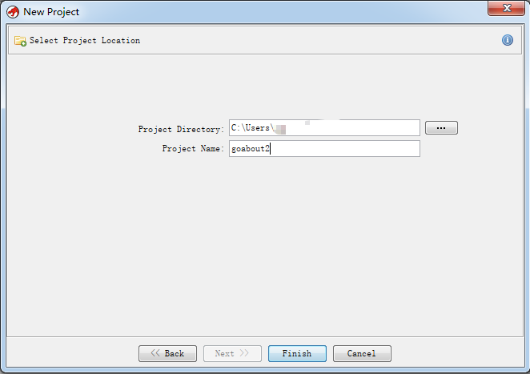
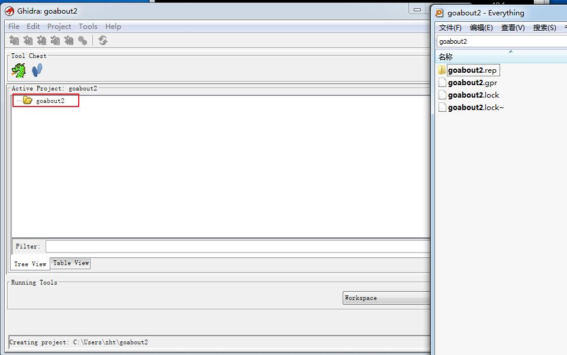
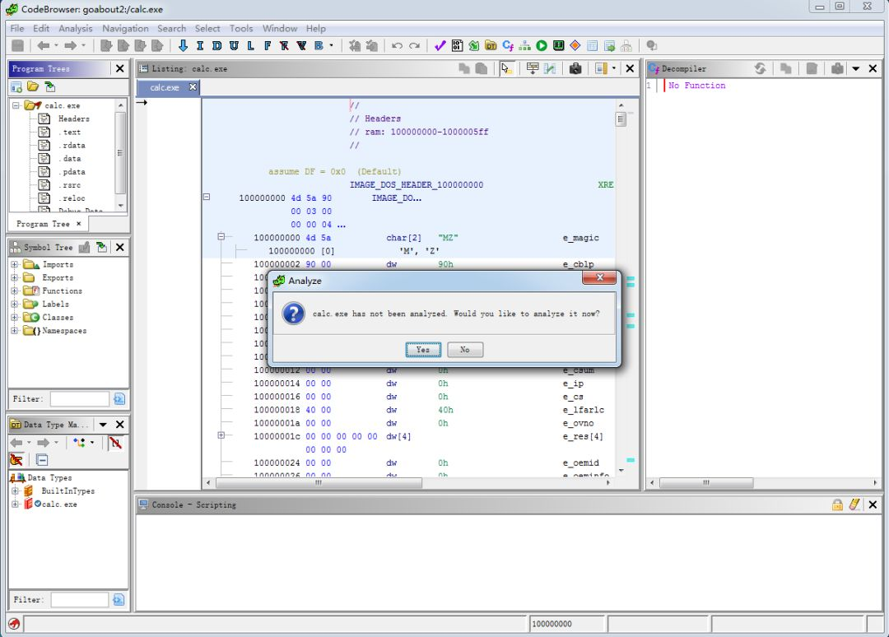

# Ghidra 教程

NSA发布了一款功能强大、免费的开源逆向分析工具：Ghidra。该反汇编工具类似于我们常用的IDA，不过其基于JAVA开发，是一款适用于Windows、Mac和Linux的跨平台反汇编工具，用户还可以使用Java或Python开发自己的Ghidra插件或者脚本。

可以通过[Ghidra的项目主页](https://Ghidra-sre.org)或者[GitHub进行下载](https://github.com/NationalSecurityAgency/Ghidra)： 

## 初次运行
在命令行中运行`ghidra`，可以启动Ghidra的可视化界面。

此外，有别于传统的GUI模式，使用者可以通过命令行模式进行批量化的反编译工作。

启动Ghidra后，可以点击“File”-“New Project”，建立一个新项目；或者点击“File”-Open Project”打开一个已有的项目。

新建项目需要输入项目路径和名称。

项目创建完毕之后生成一个具体的目录。

创建好项目之后就可以导入需要反编译的文件了.

如下所示我们反编译测试了calc.exe计算器程序：

确认后，开始反编译。

完成之后，项目文件下会创建对应的项目，双击进入。

进入之后会提示是否进行分析：

点击确认后，可以控制相应的分析选项：

开始分析之后，右下角会有相关的进度条展示：

 

 
目前来看Ghidra是无法自动下载符号的，需要对PDB相关配置进行设置：

完成分析之后的整体界面如下所示，很有一股浓浓的JAVA风范：

由于是基于项目的，因此Ghidra中可以同时打开多个反编译的项目，只需要直接往项目中导入文件即可。

## 程序界面

上面详细介绍了创建项目，将二进制文件加载到项目中，并启动自动分析的具体过程。那么 Ghidra 完成初始分析后，该干嘛呢？实际上无论做什么，都有必要先来了解一下Ghidra的各种显示窗口。

### CodeBrowser
当我们在项目中打开一个文件时，将会打开 CodeBrowser 窗口，也就是进行逆向分析工作的主阵地。在前面的文章中，我们曾经使用CodeBrowser来自动分析二进制文件；而在本文中，我们将深入了解CodeBrowser的菜单、窗口和基本选项，以深入了解Ghidra的相关功能，从而创建一个更加符合个人习惯的逆向分析环境。

在CodeBrowser窗口的顶部是主菜单，下面有一个工具栏。工具栏提供了一些最常用的菜单选项的一键式快捷方式。由于我们目前还没有加载文件，所以，我们将先重点介绍与加载文件无关的菜单选项；其他的菜单操作将在后文中加以介绍。

### File菜单

它提供了大多数文件操作菜单的基本功能，包括Open/Close（打开/关闭）、Import/Export（导入/导出）、Save（保存）与Print（打印）等选项。此外，其中一些选项是Ghidra所特有的，例如Tool（工具）选项，可用于保存和操作CodeBrowser工具；而Parse C Source（解析C语言源代码）选项，则可以通过从C头文件中提取数据类型信息来协助反编译。

### Edit菜单
它提供了一个适用于各个子窗口之外命令，即Edit菜单下面的Tool Options命令。该命令可以用来打开一个新的窗口，从而控制与CodeBrowser窗口中的许多工具相关的参数和选项。其中，与控制台相关的选项如图2所示。如果需要恢复到默认设置的话，只需点击右下角Restore Defaults按钮即可。

### Analysis菜单
该菜单可用于重新分析二进制文件，或有选择地执行单个分析任务。

### Navigation菜单
用于在文件中进行导航。该菜单提供了许多应用程序都支持的键盘导航功能，并为二进制文件添加了特殊的导航选项。除了使用该菜单提供的导航功能之外，读者也可以使用工具栏选项或快捷方式（位于在每个菜单选项的右侧）进行导航。

### Search菜单
该菜单提供了内存、程序文本、字符串、地址表、直接引用、指令模式等方面的搜索功能。当然，更多的专业搜索概念将在后面的示例中结合上下文进行介绍。

### Select菜单
该菜单用于选中文件的一部分，以针对其执行相应的处理。选择的对象可以是子程序、函数、控制流，最简单的情况下，则可以是需要突出显示的、文件中的某些部分。

### Tools菜单
该菜单提供了一些有趣的功能，用于为桌面引入额外的逆向分析资源。其中，最有用的是Processor Manual（处理器手册）选项，它可以调出与当前文件相关联的处理器手册。如果您试图打开一个缺失的处理器手册，软件将提供导入该手册的方法。

### Window菜单
可以用来根据工作流程配置Ghidra工作环境。在接下来的几篇文章中，我们将重点考察默认的Ghidra窗口，以及各种常用的窗口。

### Help菜单
提供了丰富的、条理清晰的、非常详细的选项。Help窗口支持搜索、视图、收藏夹、放大/缩小，以及打印和页面设置选项。
 
### CodeBrowser子窗口
在下图的中间部分，展示的是展开后的Window菜单。在默认情况下，当启动CodeBrowser窗口时，会有六个可用的窗口被打开，其中包括：
- Program Trees（程序树）窗口
- Symbol Tree（符号树）窗口
- Data Type Manager（数据类型管理器）
- Listing（清单）窗口
- Console（控制台）
- Decompiler（反编译器）窗口

每个窗口的名称都会显示在该窗口的左上方。对于这六个窗口来说，每个都会作为一个选项出现在Window菜单上；另外，部分窗口还在菜单正下方的工具栏上有对应的图标。例如，我们在图4中用箭头突出显示了打开和访问反编译器窗口的工具栏选项和菜单选项。

### 热键、按钮与工具栏
实际上，在Ghidra中几乎所有常用的操作都有对应的菜单项、热键和工具栏按钮。即使没有的话，我们也可以自己创建它们，因为Ghidra的工具栏是高度可配置的，就像热键与菜单操作的映射一样，具体请参见CodeBrowser Edit菜单下面的Tool Options菜单项中的Key Bindings选项，或者直接将鼠标悬停在一个命令上并按F4键。

如果这些还不能满足您的需求，Ghidra还提供了很好的、上下文敏感的菜单动作，以响应鼠标右键点击。虽然这些上下文敏感的菜单并没有提供一个给定位置的允许操作的详尽列表，但对于最常见的操作来说，都能提供良好的提示信息。这种灵活性使您可以使用最舒适的方式来执行操作，同时，当您熟悉Ghidra后，还能对环境进行定制。

接下来，让我们开始考察CodeBrowser窗口自动打开的六个默认窗口。首先，我们来了解一下所谓的内部窗口和外部窗口。

#### 内部窗口与外部窗口
当您开始探索各种Ghidra窗口时，您将注意到一个现象：默认情况下，某些窗口在CodeBrowser桌面中打开的，而其他窗口则是在CodeBrowser桌面之外作为新的浮动窗口打开的。让我们花一点时间，在Ghidra的背景下，简要介绍一下这些内部窗口和外部窗口。

通常来说，这些“外部”窗口浮动在CodeBrowser环境之外，可能是互相联系的，也可能是相互独立的。通过这些窗口，我们可以与CodeBrowser窗口并排浏览它们的内容。外部窗口包括Function Graph、Comments和Memory Map窗口。

接下来，我们要介绍三种截然不同的“内部”窗口：

- 在CodeBrowser中默认打开的窗口（例如，Symbol Tree和Listing窗口）
- 与默认CodeBrowser窗口堆叠的窗口（例如，Bytes窗口）
- 使用CodeBrowser窗口创建的窗口或与其他CodeBrowser窗口共享空间的窗口（例如，Equates和External Programs窗口）

当您打开与另一个已打开的窗口共享空间的窗口时，它会出现在现有窗口的前面。共享相同空间的所有窗口都是选项卡式的，以允许在窗口之间快速导航。如果要同时查看共享一个空间的两个窗口，可以单击窗口的标题栏，然后将其拖动到CodeBrowser窗口之外。

需要注意的是：虽然从CodeBrowser窗口移出一个窗口很轻松，但是重新回到CodeBrowser窗口中就没有这么简单了。

#### 查找指定的窗口

由于Ghidra提供的窗口数量较多，如果您打开了众多的窗口，后面打开的窗口可能会盖住之前的窗口，这时寻找我们所需的窗口就需要一定的技巧了。不过，Ghidra提供了专门的功能来帮助我们找到那些“丢失”的窗口。实际上，最简单的方法就是点击相关的工具栏图标或菜单项，这时选定的窗口就会移动到前面；如果继续点击该窗口的工具栏图标，这些窗口就会通过震动、改变字体大小或颜色、缩放、旋转以及其他动作来吸引你的注意力，从而顺利找到它们。

#### Listing窗口
该窗口也被称为反汇编窗口，主要用于查看、操作和分析Ghidra生成的反汇编代码。该窗口不仅显示了目标程序的反汇编代码清单，还提供了查看二进制数据区域的主要方法。

图1  加载了calc.exe后的默认CodeBrowser窗口

上图显示的是calc.exe的CodeBrowser窗口的默认配置。Listing窗口左边的空白处提供了文件的重要信息以及我们当前在文件中的位置。Listing窗口的右侧（紧靠垂直滚动条的右侧）有一个额外的标记区域，也提供了重要的信息和导航功能。滚动条用于表示您在文件中的位置，可用于导航。在滚动条的右侧是一些相关信息，包括书签，以便提供更多的信息。

#### 常用工具栏
在文件经过自动分析后，我们就可以借助于相关的工具栏来进行导航和进一步分析了。在默认情况下，只会显示Navigation栏。我们可以使用Listing窗口右上方的Toggle Overview Margin工具按钮，添加（或隐藏）Overview栏和Entropy栏（见图2）。无论显示哪种工具栏，它们左边都会有一个导航标记，指出我们当前在文件中的位置。左键单击任何工具栏中的任何位置，都会将您移动到文件中相应的位置，并更新Listing窗口的内容。

图2  Listing窗口的工具按钮

 

现在您知道了如何控制各栏的显示（和隐藏），让我们研究一下各栏显示的内容，以及如何在逆向分析过程中使用它。

Navigation Marker（导航标记）区域：它不仅可以用于在文件中进行移动，同时，它还提供了另一个非常重要的功能：如果你右击导航标记区域，就可以看到可以与当前文件相关联的标记和书签的类别。通过选择和取消标记类型，就可以控制导航栏中显示的内容了。这非常便于在特定类型的标记（如高亮）中进行导航。

 
Overview（概览）栏：为您提供有关文件内容的重要视觉信息。概览栏中的水平带代表程序的颜色编码区域。虽然Ghidra提供了与函数、外部引用、数据和指令等常见类别相关的默认颜色，但您可以通过Edit菜单中的Tool Options选项来控制颜色方案。在默认情况下，如果您将鼠标悬停在一个区域上，就可以查看该区域的详细信息，包括区域类型和相关地址。

Entropy（熵）栏：它提供了一个独特的Ghidra功能：它根据周围的文件内容来“刻画”文件内容。如果一个区域内的变化非常小，则赋予它一个低熵值。如果随机性很高，相应的熵值就会很高。将鼠标悬停在Entropy栏中的水平带上，它将给出具体的熵值（介于0.0和8.0之间）、类型（例如.text）以及文件中的相关地址。

上面，我们介绍了Listing窗口特有的工具按钮。在图3中，展示的是展开并放大了Listing窗口。我们可以看到，反汇编代码是以线性方式呈现的，在默认情况下，最左边一列将用于显示虚拟地址。

图3  Listing窗口

在Listing窗口中，最左边的灰色带是页边标记。它用来指示我们在文件中的当前位置，包括点标记和区域标记，这些概念的详细介绍请参考Ghidra的帮助菜单。就本例来说，当前文件位置（14000104c）在页边标记中用黑色小箭头表示。

紧靠页边标记右边的区域以箭头形式来描述函数内的非线性控制流。当控制流指令的源地址或目标地址在Listing窗口中可见时，会显示相关的控制流箭头。实线箭头代表无条件跳转，而虚线箭头代表有条件跳转。将鼠标悬停在控制流线条上会打开一个工具提示，显示控制流的开始和结束地址以及控制流的类型。当一个跳转（有条件的或无条件的）将控制权转移到程序中之前的地址时，它通常表示为一个循环。通过双击相关的控制流箭头，可以很容易地导航到任何跳转的源地址或目标地址。

 
图4顶部显示了Ghidra关于函数的栈帧布局的最佳估计。Ghidra通过对堆栈指针和函数中使用的任何堆栈框架指针的行为进行详细分析，推断出函数的栈帧（局部变量）。堆栈数据的显示方法将在后续文章中加以介绍。

图4 函数栈帧布局

此外，代码清单中通常会有许多数据和代码交叉引用，用XREF表示，见图4右侧。实际上，只要反汇编中的一个位置指向反汇编中的另一个位置，就会产生交叉引用。例如，如果地址A处的指令跳转到地址B处的指令，将导致一个从A到B的交叉引用。在引用地址上悬停会弹出一个引用窗口。引用的弹出式窗口的布局与Listing窗口相同，但背景为黄色（类似于工具提示的弹出式窗口）。弹出窗口虽然可以查看内容，却无法跟踪引用。

#### 创建额外的反汇编窗口
如果你发现自己想同时查看两个函数的代码清单，你只需要使用Listing窗口工具栏中的快照图标（见图2）打开另一个反汇编窗口即可。打开的第一个反汇编窗口在文件名前的前缀为Listing:。所有后续的反汇编窗口的标题都是`[Listing: <filename>]`，以表示它们与主显示窗口并没有关联在一起。也就是说，快照是独立的，所以，我们可以在其中自由浏览，而不影响其他窗口。

 
cc7e4d56-ce43-e812-9b90-b1b9fd340408
#### 配置Listing窗口
反汇编代码清单实际上可以分成多个组件字段，诸如助记字段、地址字段和注释字段等等。到目前为止，我们看到的清单是由一组提供文件的重要信息的默认字段组成的。但是，有时默认视图并不会提供您希望看到的信息。这时，我们可以求助于Browser Field Formatter（浏览字段格式化器）。

通过Browser Field Formatter，我们可以自定义30多个字段，以确保您能够控制Listing窗口的最终外观。您可以通过单击Listing工具栏中的相关按钮来激活Browser Field Formatter（参见图2）。这时，将在Listing窗口顶部打开一个功能强大的子菜单和布局编辑器，具体如图5所示。通过Browser Field Formatter，我们可以控制地址中断、注释、函数、变量、指令、数据、结构体和数组的外观，以创建完美的清单格式。

图5 激活Browser Field Formatter后的Listing窗口