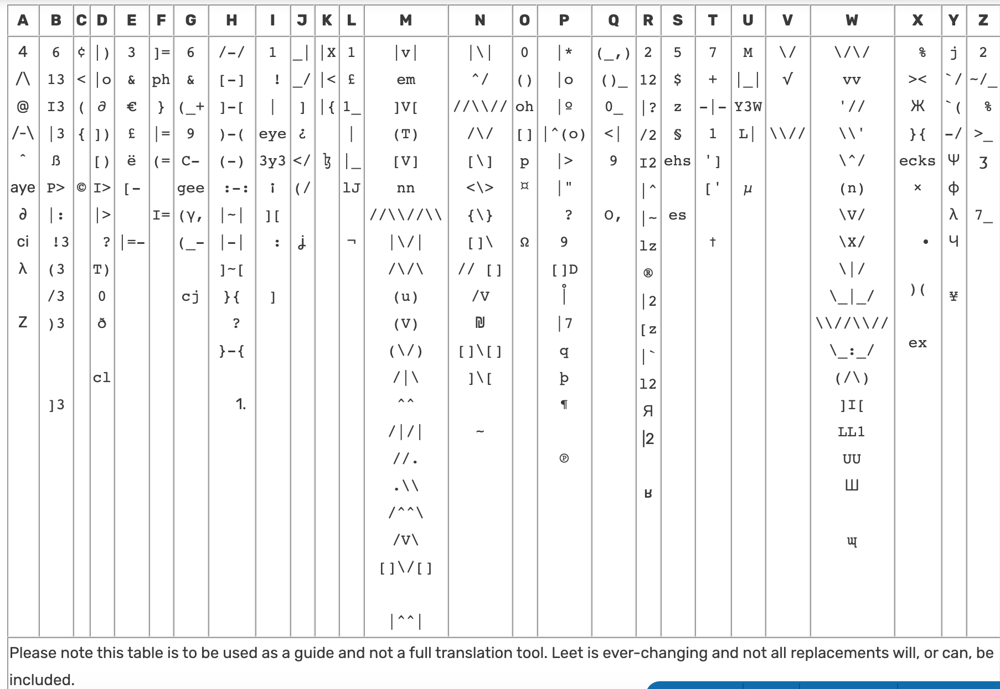

# l33t speak

L33T Speak
EDIT
Leet or eleet (Leet: 1337, 3l337 or l33t, 3l33t ), also known as "leetspeak", is an alphabet used primarily on the Internet for the English language. It uses various combinations of ASCII characters to replace Latin alphabet|Latinate letters. The term is derived from the word "elite", and the usage it describes is a specialized form of symbolic writing. Leet may also be considered a substitution cipher, though many dialects or Variety (linguistics)|linguistic varieties exist in different online communities.

The term leet is also used as an adjective to describe formidable prowess or accomplishment, especially in the fields of online game|online gaming or in its original usage, Hacker (computing).

History
Leet originated within bulletin board systems in the 1980s,[1][2] where having "elite" status on a Bulletin board system|BBS allowed a user access to file folders, games, and special chat rooms. One theory is that it was developed to defeat text filters created by BBS or Internet Relay Chat system operators for message boards to discourage the discussion of forbidden topics, like cracking and Hacker (computer security)|hacking.[1] However, creative misspellings and ASCII-art-derived words were also a way to attempt to indicate one was knowledgeable about the culture of computer users. Once the reserve of Hacker (computer security)|hackers, crackers, and script kiddies, leet has since entered the mainstream.[1] It is now also used to mock newbies, or newcomers, on web sites, or in gaming communities.[3] Some consider emoticons and ASCII art, like smiley faces, to be leet, while others maintain that leet consists of only symbolic word encryption. More obscure forms of leet, involving the use of symbol combinations and almost no letters or numbers, continue to be used for its original purpose of encrypted communication. It is also sometimes used as a script language.

Orthography
One of the hallmarks of leet is its unique approach to orthography, using substitutions of other characters, letters or otherwise, to represent a letter or letters in a word.[4][5] For more casual use of leet, the primary strategy is to use homoglyphs, symbols that closely resemble (to varying degrees) the letters for which they stand. The symbol chosen is flexible—anything that the reader can make sense of is valid. However, this practice is not extensively used in regular Leet; more often it is seen in situations where the argot (i.e., "secret language") characteristics of the system are required, either to exclude newbies or outsiders in general. Another use for Leet orthographic substitutions is the creation of paraphrased passwords.[1] By using this method, one can create a relatively secure password which would still be easily remembered. Limitations imposed by websites on password length (usually no more than 36) and the characters permitted (usually alphanumeric and underscore) requires less extensive forms of Leet when used in this application.

Some examples of leet include: B1FF and n00b, a term for the stereotypical newbie; the l33t programming language; and the webcomic Megatokyo, which contains characters who speak Leet.

Morphology
Text rendered in leet is often characterized by distinctive, recurring forms.

The -xor suffix
The meaning of this suffix is parallel with the English -er and -r suffixes (seen in hacker and lesser),[2] in that it derives agent nouns from a verb stem (linguistics)|stem. It is realized in two different forms: -xor and -zor, pronounced -sɔr and /-zɔr/, respectively. For example, the first may be seen in the word hax(x)or (/ˈhæksɔr/) and the second in pwnzor (/ˈoʊnzɔr/). Additionally, this nominalization may also be inflection|inflected with all of the suffixes of regular English verbs.

The -age suffix
Derivation of a noun from a verb stem is possible by attaching -age to the base form of any verb. Attested derivations are pwnage and speakage. However, Leet provides exceptions; the word leetage is acceptable, referring to actively being leet.[6] These nouns are often used with a form of "to be" rather than "to have," e.g., "he is pwnage" rather than "he has pwnage". Either is a more emphatic way of expressing the simpler "he pwns," but the former implies that the person is embodying the trait rather than merely possessing it.

The -ness suffix
Derivation of a noun from an adjective stem is done by attaching -ness to any adjective. This is entirely the same as the English form, except it is used much more often in Leet. Nouns such as lulzness and leetness are derivations using this suffix.

Words ending in -ed
When forming a past participle ending in -ed, the Leet user may replace the -e with an apostrophe, as was common in poetry of previous centuries, (e.g. "pwned" becomes "pwn'd"). Note that the conventions of Leet allow for some misplaced punctuation, since it is assumed that the user is typing very quickly; therefore the apostrophe may shift its position without changing the word's meaning. The word ending may also be substituted by -t (e.g. pwned becomes pwnt).[7]

Use of the -& suffix
Words ending in -and, -anned, -ant, or a similar sound can sometimes be spelled with an ampersand (&) to express the ending sound (e.g. "This is the Sandbox (software development)|s&box," "I'm sorry, you've been b&", "&hill/&farm"). This is most commonly used with the word banned. An alternate form of "B&" is "B7", as the ampersand is typed with the "7" key in the standard US keyboard layout. It is often seen in the phrase "IBB7" (in before banned).

Use of the "-zorz" suffix
Verbs that are generated on the internet (such as pwn) can be inflected by putting "zorz" on the end (generating the word pwnzorz in this example). The -zorz suffix can also be used to strengthen the meaning of the word (pwn means to defeat or to make a fool of; pwnzorz means to really beat or to make a fool of in a large way)

Grammar
Leet can be pronounced as a single syllable, /ˈliːt/, rhyming with eat, by way of aphesis of the initial vowel of "elite". It may also be pronounced as two syllables, /ɛˈliːt/. Like other Jargon File|hacker slang, Leet enjoys a looser grammar than standard English language|English.[3] The loose grammar, just like loose spelling, encodes some level of emphasis, ironic or otherwise. A reader must rely more on intuitive parsing of Leet to determine the meaning of a sentence rather than the actual sentence structure. In particular, speakers of Leet are fond of verbing nouns, turning verbs into nouns (and back again) as forms of emphasis, e.g. "Austin rocks" is weaker than "Austin roxxorz" (note spelling), which is weaker than "Au5t1N is t3h r0xx0rz" (note grammar), which is weaker than something like "0MFG D00D /\Ü571N 15 T3H l_l83Я 1337 Я0XX0ЯZ". In essence, all of these mean "Austin rocks," not necessarily the other options. Added words and misspellings add to the speaker's enjoyment. Leet, like other hacker slang, employs analogy in construction of new words. For example, if haxored is the past tense of the verb "to hack" (hack → haxor → haxored), then winzored would be easily understood to be the past tense conjugation of "to win," even if the reader had not seen that particular word before.

Leet has its own colloquialisms, many of which originated as jokes based on common typing errors, habits of new computer users, or knowledge of Internet culture and history.[8] Leet is not solely based upon one language or character set. Greek language|Greek, Russian language|Russian, Chinese language|Chinese, and other languages have Leet forms, and Leet in one language may use characters from another where they are available. As such, while it may be referred to as a "cipher", a "dialect", or a "language", Leet does not fit squarely into any of these categories. The term leet itself is often written 31337, or 1337, and many other variations. After the meaning of these became widely familiar, 10100111001 came to be used in its place, because it is the Binary numeral system|binary form of 1337, making it more of a puzzle to interpret.[9] An increasingly common characteristic of Leet is changing its grammatical usage to be deliberately incorrect. The widespread popularity of deliberate misspelling is similar to the cult following of the "All your base are belong to us" phrase. Indeed, the online and computer communities have been international from their inception, so spellings and phrases typical of non-native speakers are quite common.

Vocabulary
Many words originally derived from Leet slang have now become part of the modern Internet slang, such as "pwned".[1] The original driving force of new vocabulary in Leet were common misspellings and typing errors such as "teh" (generally considered lolspeak), and intentional misspellings,[10] especially the "z" at the end of words ("skillz").[1] Another prominent example of a surviving Leet expression is wiktionary:W00t|w00t, an exclamation of joy.[2]

New words (or corruptions thereof) may arise from a need to make one's username unique. As any given Internet service reaches more people, the number of names available to a given user is drastically reduced. While many users may wish to have the username "CatLover," for example, in many cases it is only possible for one user to have the moniker. As such, degradations of the name may evolve, such as "C@7L0vr." As the Leet cipher is highly dynamic, there is a wider possibility for multiple users to share the "same" name, through combinations of spelling and transliterations.

Additionally, leet—the word itself—can be found in the screennames and gamertags of many Internet and video games. Use of the term in such a manner announces a high level of skill, though such an announcement may be seen as baseless hubris.[11]

Terminology and common misspellings
Warez (nominally pronounced ˈwɛərz) is a plural shortening of "software", typically referring to pirated software.[11] Phreaking refers to the hacking of telephone systems and other non-Internet equipment.[1] Teh originated as a typographical error of "the", and is sometimes spelled t3h.[1][12] j00 takes the place of "you",[2] originating from the affricate sound that occurs in place of the palatal approximant, /j/, when you follows a word ending in an alveolar plosive consonant, such as /d/ or /z/. Also, from German language|German, is wiktionary:Über|über, which represents a quality of superiority; it usually appears as a prefix attached to adjectives, and is frequently written without the Umlaut (diacritic)|umlaut over the u.[13]

Haxor and suxxor, or suxorz
Haxor, and derivations thereof, is Leet for "hacker",[14] and it is one of the most commonplace examples of the use of the -xor suffix. Suxxor (pronounced suck-zor) is a derogatory term which originated in warez culture and is currently used in multi-user environments such as multiplayer video games and instant messaging; it, like haxor, is one of the early Leet words to use the -xor suffix. Suxxor is a modified version of "sucks" (the phrase “to suck”), and the meaning is the same as the English language|English slang. Its negative definition essentially makes it the opposite of roxxor, and both can be used as a verb or a noun.

Kekeke
Koreans express the sound of derisive laughter by "keke". Other forms of laughter include "heehee", "hoho", "huhu", "haha", etc. In the written Korean language, hangul, it is written 캐캐, and in Internet discussions or chatting simply ㅋ repeated several times is often used. Since early versions of WarCraft did not support hangul, Korean players would use a romanization|romanized spelling—hence, kekeke was born. It is often used in-game as an expression of exaltation or as a form of mockery. Commonly, it is associated with the Starcraft tactic of a Rush (computer and video games)|Zerg rush, named after the unit for whom the tactic was created.[11] The phrase "Zerg Rush Kekeke!" is sometimes used outside of the game to indicate any form of overwhelming or swarming force. Kekeke is also used as an evil laugh and is used by players using devious tactics and/or playing evil characters. Kekeke is commonly associated with laughs of devious characters in manga, anime, and video games, and has made its way through various translations.

The phrase also occurs on the MMORPG World of Warcraft. There are two major factions in the game which 'speak' different languages. All chat text entered by a member of one faction will appear jumbled to a member of the other, and vice versa. As a result, members of the Alliance faction would see "kek" when a member of the Horde faction had typed "lol", while conversely a member of the Horde faction would see "bur" when a member of the Alliance faction had typed "lol". The cipher works a little differently for longer words though, and "hahaha" becomes "kekeke". Such terms have become widely understood amongst World of Warcraft players.[11] This is also a good example of what is known as an Easter egg (media)|easter egg in the game World of Warcraft. The game writers at Blizzard used hundreds of famous phrases and names in populating the game world, and KEK (Orcish for LOL)[11] was intentional.

N00b
Within Leet, the term n00b, and derivations thereof, is used extensively. The word means and derives from newbie (as in new and inexperienced or uninformed),[10][13][15] and is used as a means of segregating the "elite" members of a group from outsiders and tag them as generally unskilled.

Owned and pwned
Owned and pwn3d both refer to the domination of a player in a video game or argument (rather than just a win), or the successful hacking of a website or computer.[1][13][16]

As in a common characteristic of Leet, the terms have also been adapted into noun and adjective forms,[13] ownage and pwnage, which can refer to the situation of pwning or to the superiority of its subject (e.g., "He is a very good player. He is pwnage.").

Pr0n
Pr0n is slang for pornography.[1] This is a deliberately inaccurate spelling/pronunciation for porn,[15] where a zero is often used to replace the letter O. It is sometimes used in legitimate communications (such as email discussion groups, Usenet, chat rooms, and internet web pages) to circumvent language and content filters, which may reject messages as offensive or spam (electronic)|spam. The word also helps prevent search engines from associating commercial sites with pornography—which might result in unwelcome traffic. Pr0n is also sometimes spelled backwards (n0rp) to further obscure the meaning to potentially uninformed readers.[17] It can also refer to ASCII art depicting pornographic images, or to photos of the internals of consumer and industrial hardware. Prawn, a spoof of the misspelling, has started to come into use, as well; in Grand Theft Auto: Vice City, a pornographer films his movies on 'Prawn Island'. Conversely, in the Role-playing game|RPG Kingdom of Loathing, prawn, referring to a kind of crustacean, is spelled pr0n, leading to the creation of food items such as “pr0n chow mein”.