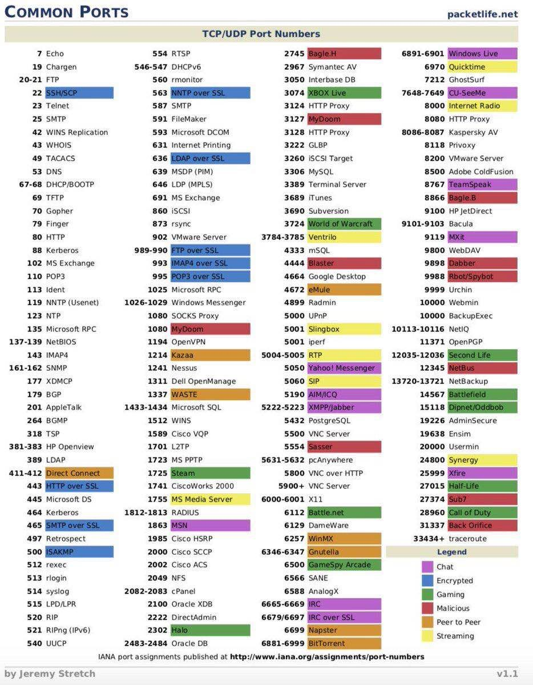

# 国内信息收集

国内不能使用google等强大搜索引擎，所以收集信息的方式也应有所变化。

## 优先收集的内容
- whois信息（微步）
- 网站架构
- dns信息（通过查询dns我们可以检测是否存在dns域传送漏洞）
- 子域名搜集
- 敏感目录及敏感信息、源码泄露（搜索引擎+工具）
- 脆弱系统（网络空间）
- 旁站查询
- C端查询
- 指纹信息
- 端口服务
- 备案信息
- 真实ip
- 探测waf
- 社工（朋友圈、微博、qq空间、求职、交易等社交平台）
- 企业信息（天眼查、企业信用信息公示系统、工业和信息化部ICP/IP地址/域名信息备案管理系统）

## 基本流程
- 首先，查域名信息
  - whois、子域名、备案信息；
- 其次，查服务器信息
  - dns信息、端口服务、真实ip；
- 然后，查网站程序（web层）信息
  - 如：网站架构、敏感目录及敏感信息、源码泄露（搜索引擎+工具）、脆弱系统（网络空间）、旁站查询、C端查询、指纹信息、探测waf；
- 最后，查企业信息
  - 天眼查、企业信用信息公示系统

## 查域名信息
### whois信息和whois反查

- [站长之家查询whois信息](http://whois.chinaz.com/)
  - 搜集到了注册商、联系人、联系邮箱,还可以通过联系人和联系邮箱反查。
- [微步](https://x.threatbook.cn/query) 
  - 需要登录
- https://who.is
  - 中文乱码，不能whois反查
- Linux whois
- 其他

需要注意的是国际域名可以设置隐私保护，但像国内.cn等域名是不可以设置隐私保护的。

### 子域名搜集
子域名收集可以发现更多目标，以增加渗透测试成功的可能性，探测到更多隐藏或遗忘的应用服务，这些应用往往可导致一些严重漏洞。当一个主站坚不可摧时，我们可以尝试从分站入手。

查询方式：
- layer子域名挖掘机
- https://phpinfo.me/domain/
- subDomainsBrute
  - github下载地址：https://github.com/lijiejie/subDomainsBrute
- 搜索引擎语法(site:xxx.com)

### 备案信息
国内备案信息分为两种：
- [IPC备案信息查询](http://www.miitbeian.gov.cn/icp/publish/query/icpMemoInfo_showPage.action#)：
- [公安部备案信息查询](http://www.beian.gov.cn/portal/recordQuery)。

如果是国外的服务器是不需要备案的，因此可以忽略此步骤，国内的服务器是需要备案的，因此可以尝试获取信息。

## 服务器信息查询
### DNS信息搜集
通过查询DNS信息，我们可能可以发现网站的真实ip地址，也可以尝试测试是否存在DNS域传送漏洞。

查询方式:
- Kali（host、big命令）
- windows（nslookup命令）
- 在线工具:
  - http://tool.chinaz.com/dns/
  - https://tool.lu/dns/

### 服务探查
查询方式:
- nmap

### 获取网站真实ip
现在大多数的网站都开启了CDN加速，导致我们获取到的IP地址不一定是真实的IP地址。

思路：
- 二级域名法 一般网站不会所有的二级域名放CDN，因此我们可以利用这点来获取网站的真实ip 
- 多地ping法 由CDN的原理，不同的地方去Ping服务器，如果IP不一样，则目标网站肯定使用了CDN
- nslookup法 找国外的比较偏僻的DNS解析服务器进行DNS查询，因为大部分CDN提供商只针对国内市场，而对国外市场几乎是不做CDN，所以有很大的几率会直接解析到真实IP 
- 查看邮件法 通过查看邮件原文来确定ip地址，CDN总不会发送邮件吧
- RSS订阅法 RSS原理于邮件法差不多
- 查看历史解析记录法 查找域名历史解析记录，域名在上CDN之前用的IP，很有可能就是CDN的真实源IP地址
- 利用网站漏洞（XSS、命令执行、SSRF、php探针、phpinfo页面等） 可以通过一些页面和漏洞获取到服务器ip地址也是可能的。

## 查网站程序
### 网站架构
#### OS信息
- nmap
- wappalyzer插件（一款火狐插件）
- [云悉](https://www.yunsee.cn/)
  - cms检测web指纹识别
#### 中间件
- wappalyzer插件（一款火狐插件）
- [云悉](https://www.yunsee.cn/)
  - cms检测web指纹识别
#### 数据库
- wappalyzer插件（一款火狐插件）
- [云悉](https://www.yunsee.cn/)
  - cms检测web指纹识别
#### 编程语言
- wappalyzer插件（一款火狐插件）
- [云悉](https://www.yunsee.cn/)
  - cms检测web指纹识别
#### 敏感信息
- 御剑 
- 搜索引擎 
- BBscan 
  - 一款信息泄漏批量扫描脚本。https://github.com/lijiejie/BBScan
- GSIL 
  - 从github上寻找敏感文件的安全工具。项目地址：https://github.com/FeeiCN/GSIL
- 社交平台（）
  - 道客巴巴
  - QQ群
  - 文库
  - 求职网
  - 微信、公众号
- **robots.txt、crossdomin.xml、sitemap.xml、源码泄漏文件、/WEB-INF/**

### 脆弱系统
网络空间搜索引擎的作用就是将互联网上公开的网络资产收集和整理，以此方便人们进行查阅和利用。我在网络空间可发现了不少企业的脆弱系统，未授权访问、SQL注入、弱口令等等都是存在的。

网络空间搜索引擎：
- Shodan 
- FOFA 
- [Zoomeye](https://www.zoomeye.org/)

### 旁站查询

旁站指和目标网站在同一台服务器上的其它的网站。

查询方法：
- http://www.webscan.cc/ 
- http://www.5kik.com/
- k8旁站（K8Cscan大型内网渗透自定义插件化扫描神器）
  - https://github.com/k8gege/K8CScan
  - https://github.com/k8gege/Ladon
- 御剑1.5 

### C端

C端是和目标服务器ip处在同一个C段的其它服务器。

查询方式
- 北极熊扫描器
- Nmap
  - `nmap -p80,8080, --open ipaddr/24`

### 指纹信息
通过识别目标网站所使用的CMS信息，可以帮助我们进一步了解渗透测试环境，可以利用已知的一些CMS漏洞来进行攻击。

指纹的类型：
- 指定路径下指定名称的js文件或代码。
- 指定路径下指定名称的css文件或代码。
- `<title>`中的内容，有些程序标题中会带有程序标识
- meta标记中带程序标识`<meta name="description"/><meta name="keywords"/><meta name="generator"/><meta name="author"/><meta name="copyright"/>`中带程序标识。
- `display:none`中的版权信息。
- 页面底部版权信息，关键字© Powered by等。
- readme.txt、License.txt、help.txt等文件。
- 指定路径下指定图片文件，如一些小的图标文件，后台登录页面中的图标文件等，一般管理员不会修改它们。
- 注释掉的html代码中`<!--`
- http头的X-Powered-By中的值，有的应用程序框架会在此值输出。
- cookie中的关键字
- robots.txt文件中的关键字
- 404页面
- 302返回时的旗标

识别方式：
- 云悉
- wappalyzer插件
- whatweb工具

### 探测waf
WAF也称Web应用防护系统，Web应用防火墙是通过执行一系列针对HTTP/HTTPS的安全策略来专门为Web应用提供保护的一款产品。

原理：WAF识别大多基于Headers头信息。通过发送恶意的内容，对比响应，寻找数据包被拦截、拒绝或者检测到的标识。

探测方式
- 手工（提交恶意数据） 
- WAFW00F
  - `wafw00f -a 域名或ip`
- Nmap
  - 一种是http-waf-detect `nmap -p80,443 --script=http-waf-detect ip地址`
  - 一种是http-waf-fingerprint。`nmap -p80,443 --script=http-waf-fingerprint。 ip地址`

我们可以通过工具判断，如果工具检测到WAF的存在，手工验证一下是否存在误报；如果工具检测不到WAF的存在，我们也可以通过手工来判断WAF到底存不存在。 

### 天眼查

https://www.tianyancha.com/

### 企业信用信息公示系统

http://www.gsxt.gov.cn/index.html