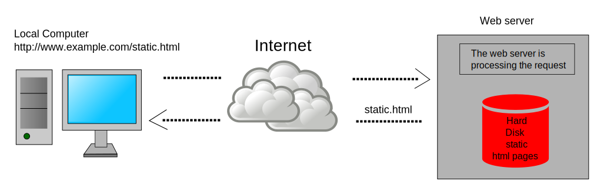
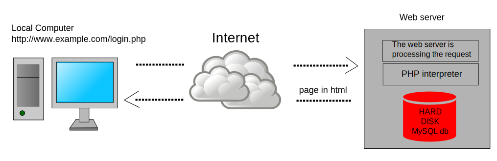
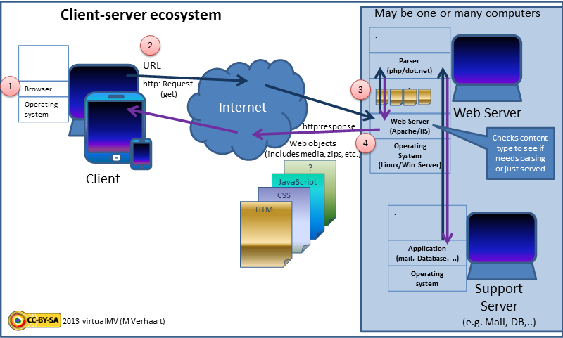
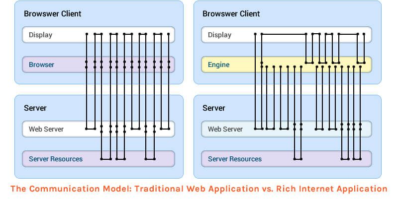
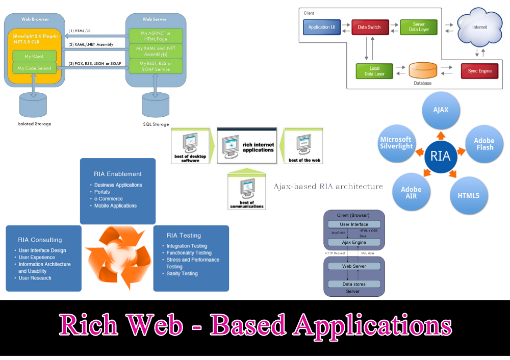
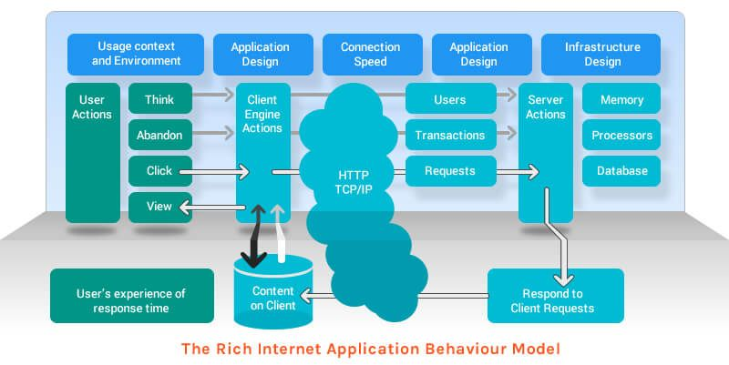
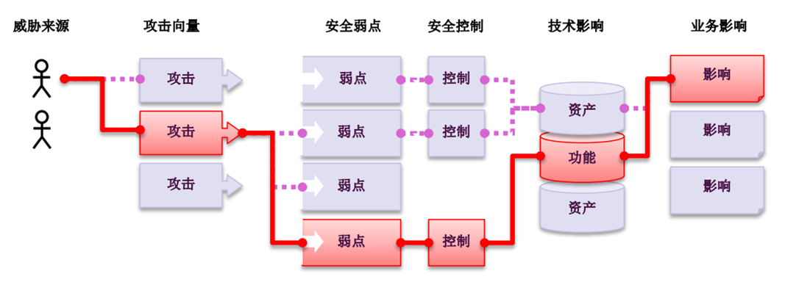

# Web 攻防技术1 —— Web发展历史与安全风险

## Web应用程序的发展历程

可分为三个阶段：

### 静态Web系统

早期，以静态Web站点构成，内容主要为静态Web文档，即html文档。



#### 技术构成：

- URL 统一资源定位符
- HTTP 协议
- HTML 文档
- Browser 浏览器
- Web Server 服务器

### 动态Web系统

Html表单、服务器脚本与数据库有机结合，形成了按需加载内容的动态Web系统。



#### 技术构成：

不仅包括：
- URL 统一资源定位符
- HTTP 协议
- HTML 文档
- Browser/Client 浏览器/客户端
- Web Server 服务器

更多的：
- 服务器脚本（jsp、php、asp）
- 页面脚本（JavaScript）
- 层次样式表 （CSS）
- 数据库 （Mysql、Oracle、Ms SQL Server、DB2...）

下图，显示了典型动态web的技术架构。



### 富互联网应用（RIA Web ，Rich Web application）

随着技术的进步，如今的Web页面拥有很多之前不曾有的丰富功能，与普通的桌面应用相差无几，这类Web系统被称为富互联网应用或 RIA Web。

RIA Web与传统Web的区别：



RIA 的基本框架：



#### 技术构成：

不仅包括：
- URL 统一资源定位符
- HTTP 协议
- HTML 文档
- Browser/Client 浏览器/客户端
- Web Server 服务器
- 服务器脚本（jsp、php、asp）
- 页面脚本（JavaScript）
- 层次样式表 （CSS）
- 数据库 （Mysql、Oracle、Ms SQL Server、DB2...）

还包括：
- Web 2.0 特性
- HTML5特性
- Flash、Java小程序、JavaFX、Silverlight等图形化工具
- 支持AJAX的各种框架：
  - AngularJS
  - jQuery
  - Mootools
  - Dojo
  - ExtJS
  - Google Web Toolkit
  - JavascriptMVC
  - .NET Framework
  - Unity
  - Prototype 
  - Apache Wicket 
  - ASP.NET AJAX 
  - DWR（Direct Web Remoting） 
  - Spry Framework 
  - ...


RIA的技术架构：



## Web应用程序的安全问题

没有绝对安全的系统，Web系统同样存在着大量安全问题。



OWASP（国际知名的安全组织）提供了一个Web应用安全的适合和全面的框架和过程。OWASP提高电子商务安全的主要功能如下：
- 十大Web应用安全漏洞
- 开发指南
- 代码审计指南
- 测试指南
- OWASP移动安全

### OWASP TOP 10 总体介绍

OWASP 每年都会总结10大最关键的Web应用安全风险。

2017年的十大Web安全风险是：

- A1-注入
- A2-失效的身份认证
- A3-敏感数据泄露
- A4-XML外部实体（XXE）
- A5-失效的访问控制
- A6-安全配置错误
- A7-跨站脚本（XSS）
- A8-不安全的反序列化
- A9-使用含有已知漏洞的组件
- A10-不足的日志记录和监控


### A1-注入

注入往往是应用程序缺少对输入进行安全性检查所引起的，攻击者把一些包含指令的数据发送给解释器，解释器会把收到的数据转换成指令执行。

常见的注入包括：SQL注入，OS Shell，LDAP，XPath，Hibernate等等，其中SQL注入尤为常见。


#### 你的Web应用脆弱么？

当您的应用在如下时点时，是脆弱的并易受到攻击：

- 用户提供的数据没有经过应用程序的验证、过滤或净化。
- 动态查询语句或非参数化的调用，在没有上下文感知转义的情况下，被用于解释器。
- 在ORM搜索参数中使用了恶意数据，这样搜索就获得包含敏感或未授权的数据。
- 恶意数据直接被使用或连接，诸如SQL语句或命令在动态查询语句、命令或存储过程中包含结构和恶意数据。
  
一些常见的注入，包括：SQL、OS命令、ORM、LDAP和表达式语言（EL）或OGNL注入。所有解释器的概念都是相同的。代码评审是最有效的检测应用程序的注入风险的办法之一，紧随其后的是对所有参数、字段、头、cookie、JSON和XML数据输入的彻底的DAST扫描。组织可以将SAST和DAST工具添加到CI/CD过程中，以便于在生产部署之前对现有或新检查的代码进行注入问题的预警。


#### 如何防止？

防止注入漏洞需要将数据与命令语句、查询语句分隔开来。

- 最佳选择是使用安全的API，完全避免使用解释器，或提供参数化界面的接口，或迁移到ORM或实体框架。
  - 注意：当参数化时，存储过程仍然可以引入SQL注入，如果PL/SQL或T-SQL将查询和数据连接在一起，或者执行带有立即执行或exec()的恶意数据。

- 使用正确的或“白名单”的具有恰当规范化的输入验证方法同样会有助于防止注入攻击，但这不是一个完整的防御，因为许多应用程序在输入中需要特殊字符，例如文本区域或移动应用程序的API。

- 对于任何剩余的动态查询，可以使用该解释器的特定转义语法转义特殊字符。OWASP的Java Encoder和类似的库提供了这样的转义例程。
  - 注意：SQL结构，比如：表名、列名等无法转义，因此用户提供的结构名是非常危险的。这是编写软件中的一个常见问题。
- 在查询中使用LIMIT和其他SQL控件，以防止在SQL注入时大量地泄露记录。

#### 攻击案例场景


```
# 无安全意识的程序员设计的SQL

String query =＂SELECT account_balance FROM user_data WHERE user_name =＂+ request.getParameter(＂customerName＂);

# 黑客注入后的SQL
String query =“SELECT account_balance FROM user_data WHERE user_name =”+ request.getParameter(“customerName”) or ‘1’ =‘1


```

### 实验

### A2-失效的身份认证


通过错误使用应用程序的身份认证和会话管理功能，攻击者能够破译密码、密钥或会话令牌，或者利用其它开发缺陷来暂时性或永久性冒充其他用户的身份。

应用会话超时设置不正确。用户使用公共计算机访问应用程序。用户直接关闭浏览器选项卡就离开，而不是选择“注销”。攻击者一小时后使用同一个浏览器浏览网页，而当前用户状态仍然是经过身份验证的。

通过错误使用应用程序的身份认证和会话管理功能，攻击者能够破译密码、密钥或会话令牌，或者利用其它开发缺陷来暂时性或永久性冒充其他用户的身份。

#### 应用程序脆弱吗？

确认用户的身份、身份验证和会话管理非常重要，这些措施可用于将恶意的未经身份验证的攻击者与授权用户进行分离。

如果您的应用程序存在如下问题，那么可能存在身份验证的脆弱性：
- 允许凭证填充（撞库），这使得攻击者获得有效用户名和密码的列表。
- 允许暴力破解或其他自动攻击。
- 允许默认的、弱的或众所周知的密码，例如“Password1”或“admin/admin”。
- 使用弱的或失效的验证凭证，忘记密码程序，例如“基于知识的答案”，这是不安全的。
- 使用明文、加密或弱散列密码（参见：A3:2017-敏感数据泄露）。
- 缺少或失效的多因素身份验证。
- 暴露URL中的会话ID（例如URL重写）。
- 在成功登录后不会更新会话ID。
- 不正确地使会话ID失效。当用户不活跃的时候，用户会话或认证令牌（特别是单点登录（SSO）令牌）没有正确注销或失效。

#### 如何防止？
- 在可能的情况下，实现多因素身份验证，以防止自动、凭证填充、暴力破解和被盗凭据再利用攻击。
- 不要使用发送或部署默认的凭证，特别是管理员用户。
- 执行弱密码检查，例如测试新或变更的密码，以纠正“排名前10000个弱密码” 列表。
- 将密码长度、复杂性和循环策略与NIST-800-63 B的指导方针的5.1.1章节-记住秘密，或其他现代的基于证据的密码策略相一致。
- 确认注册、凭据恢复和API路径，通过对所有输出结果使用相同的消息，用以抵御账户枚举攻击。
- 限制或逐渐延迟失败的登录尝试。记录所有失败信息并在凭据填充、暴力破解或其他攻击被检测时提醒管理员。
- 使用服务器端安全的内置会话管理器，在登录后生成高度复杂的新随机会话ID。会话ID不能在URL中，可以安全地存储和当登出、闲置、绝对超时后使其失效。

#### 攻击案例场景

场景#1：

凭证填充，使用已知密码的列表，是常见的攻击。如果应用程序不限制身份验证尝试，则可以将应用程序用作密码oracle，
以确定凭证是否有效。

场景#2：

大多数身份验证攻击都是由于使用密码作为唯一的因素。依据最佳实践，最新的密码轮换和复杂性要求鼓励用户使用、重用以及重用弱密码。建议组织在NIST-800-63中停止这些实践，并使用多因素身份验证。

场景#3：

应用会话超时设置不正确。用户使用公共计算机访问应用程序。用户直接关闭浏览器选项卡就离开，而不是选择“注销”。攻击者一小时后使用同一个浏览器浏览网页，而当前用户状态仍然是经过身份验证的。

### A3-敏感信息泄露

许多Web应用程序和API都无法正确保护敏感数据，例如：财务数据、医疗数据和PII数据。
我们需要对敏感数据加密，这些数据包括：传输过程中的数据、存储的数据以及浏览器的交互数据。

一个网站上对所有网页没有使用或强制使用TLS，或者使用弱加密。攻击者通过监测网络流量（如：不安全的无线网络），将网络连接从HTTPS降级到HTTP，就可以截取请求并窃取用户会话cookie。

### A4-XML外部处理器漏洞（XXE）

许多较早的或配置错误的XML处理器评估了XML文件中的外部实体引用。
攻击者可以利用外部实体窃取使用URI文件处理器的内部文件和共享文件、监听内部扫描端口、执行远程代码和实施拒绝服务攻击。

```
# 攻击者尝试从服务端提取数据： 
<?xml version="1.0" encoding="ISO-8859-1"?>
<!DOCTYPE foo [
<!ELEMENT foo ANY >
<!ENTITY xxe SYSTEM "file:///etc/passwd" >]>
<foo>&xxe;</foo>

```

### A5-失效的访问控制

未对通过身份验证的用户实施恰当的访问控制。
攻击者可以利用这些缺陷访问未经授权的功能或数据，例如：访问其他用户的帐户、查看敏感文件、修改其他用户的数据、更改访问权限等。

```
应用程序在访问帐户信息的 SQL调用中使用了未经验证的数据：
pstmt.setString(1，request.getParameter("acct")); ResultSet results =  pstmt.executeQuery( ); 
攻击者只需修改浏览器中的“acct”参数即可发送他们想要的任何帐号信息。如果没有正确验证，攻击者可以访问任何用户的帐户。
http://example.com/app/accountInfo?acct=notmyacct 

```

### A6-安全配置错误

安全配置错误是最常见的安全问题，这通常是由于不安全的默认配置、不完整的临时配置、开源云存储、错误的 HTTP 标头配置以及包含敏感信息的详细错误信息所造成的。

目录列表在服务器端未被禁用。攻击者发现他们很容易 就能列出目录列表。攻击者找到并下载所有已编译的Java类，他们通过反编译来查看代码。然后，攻击者在应用程序中找到一个 严重的访问控制漏洞。


### A7-跨站脚本（XSS）

XSS 是指恶意攻击者往Web页面里插入恶意html代码，当用户浏览该页之时，嵌入其中Web里面的html代码会被执行，从而达到恶意用户的特殊目的。XSS 的分类：存储式跨站脚本攻击、反射跨站脚本攻击、基于DOM的XSS.

将未净化的用户输入存储下来了， 并在后期在其他用户或者管理员的页面展示出来。 

### A8-不安全的反序列化

不安全的反序列化会导致远程代码执行。即使反序列化缺陷不会导致远程代码执行，攻击者也可以利用它们来执行攻击，包括：重播攻击、注入攻击和特权升级攻击。

```
一个PHP论坛使用PHP对象序列化来保存一个“超 级”cookie。该cookie包含了用户的用户ID、角色、密码哈希和其他状态： 
a:4:{i:0;i:132;i:1;s:7:"Mallory";i:2;s:4:"user";i:3;s:32:"b6a8b3bea87fe0e05022f8f3c88bc960";}
攻击者更改序列化对象以授予自己为admin权限： 
a:4:{i:0;i:1;i:1;s:5:"Alice";i:2;s:5:"admin"; i:3;s:32:"b6a8b3bea87fe0e05022f8f3c88bc960";}

```
### A9-使用含有已知漏洞的组件

组件（例如：库、框架和其他软件模块）拥有和应用程序相同的权限。如果应用程序中含有已知漏洞的组件被攻击者利用，可能会造成严重的数据丢失或服务器接管。
同时，使用含有已知漏洞的组件的应用程序和API可能会破坏应用程序防御、造成各种攻击并产生严重影响。


一个PHP论坛使用PHP对象序列化来保存一个“超级”cookie。该cookie包含了用户的用户ID、角色、密码哈希和其他状态：

```
a:4:{i:0;i:132;i:1;s:7:"Mallory";i:2;s:4:"user";i:3;s:32:"b6a8b3bea87fe0e05022f8f3c88bc960";}
攻击者更改序列化对象以授予自己为admin权限： 
a:4:{i:0;i:1;i:1;s:5:"Alice";i:2;s:5:"admin"; i:3;s:32:"b6a8b3bea87fe0e05022f8f3c88bc960";}

```

### A10-不足的日志记录和监控

不足的日志记录和监控，以及事件响应缺失或无效的集成，使攻击者能够进一步攻击系统、保持持续性或转向更多系统，以及篡改、提取或销毁数据。

攻击者使用通用密码进行用户扫描并能获取所有使用此密码的账户。对于其他账户而言，将仅有一次失败的登陆尝试记录。一段时间以后，攻击者可以用另一个密码再次进行此活动。


## Web 防护机制

Web应用程序的防护机制主要有：

- 用户访问
- 处理用户输入
- 处理攻击行为
- 管理里应用程序

### 用户访问

对用户访问的认证、授权、审计几乎是所有系统所必须处理的工作。

大多数Web应用程序使用三层相互关联的安全机制处理用户访问：
- 身份验证
- 会话管理
- 访问控制（权限、审计）

这3个方面都是容易受到攻击的攻击面，而且是非常重要的安全要素。

由于这些机制相互依赖，所以不容易提供强大的总体安全保护，任意一个缺陷都可能使系统受到威胁。

#### 身份验证

大多数Web应用采用传统身份验证模型。即要求提交用户名和密码。

安全性要求高的应用，通常使用：
- 证书
- 多阶段登录

在安全要求更高的应用中，还会使用：
- 多因子验证
- 智能卡
- 质询-响应令牌（chanllenge-response token）
  
注意身份验证模块还包括：
- 注册
- 找回密码、恢复
- 密码修改等

这些模块的安全性也应同等重视。

这方面的攻击常见于：
- 猜测用户名
- 猜测密码
- 避开登录过程进入系统
- 利用密码找回等辅助功能获取合法身份

#### 会话管理（ Session ）

会话管理是对已验证身份的用户进行管理。

用户登录后，访问应用页面、使用功能都以“浏览器-服务器”会话形式体现。

为了维护用户请求、响应，实施过程的有效访问控制，几乎所有Web应用都会为每个用户建立一个会话，并给用户一个会话令牌（session token）。

- Session， 本质上是服务器上的一个数据结构，用于追踪用户与应用程序的交互状态。
- Session Token，是一个唯一的字符串，用于将用户操作（请求）与用户联系起来，或授权。
  
令牌的传输方式常见的有：
- 使用隐藏表单内容
- URL查询字符串
- HTTP cookie（标准方法）

会话攻击的主要形式有：
- 破解令牌，获得合法用户身份
- 获取其他用户令牌，提升权限

#### 访问控制

不同的用户角色有不同的权限，都要受到访问控制的管理。

典型的网络访问控制非常复杂，所以通常会有许多漏洞，使得攻击者能够未授权访问应用程序的数据与功能。

### 处理用户输入

所有的用户输入都不可信。

多数web攻击都与提交特殊输入有关。

输入确认（Input validation）是防御这些攻击的必要手段。

#### 输入多样性

Web网站通常会要求用户输入各种类型的数据。这时需要对输入的字符和数据类型做严格的检查。

#### 输入的处理

有多种方法处理用户输入：
- 拒绝已知的不良输入
  - 这种方法通常采用黑名单，包含已知攻击行为。
  - 这是比较低效的方法，黑客可以使用新方法绕过。
- 接受已知的正常输入
  - 使用白名单，仅包含合法字符串、模式等
  - 是最为有效的方法
- 净化
  - 用来处理不能保证安全的数据。
  - 去除所有不安全字符，转换为合法字符。
- 安全数据处理
  - 不检查确认输入内容，而是确保处理过程安全。
  - 例如，使用参数化查询，避免SQL注入。
  - 但这个方法并不适用于所有功能。
- 语法检查
  
#### 边界检查


#### 多步骤确认
#### 规范

### 处理攻击行为
#### 处理错误与报错信息
#### 维护审计日志
#### 告警设置
#### 应对攻击


### 管理里应用程序

