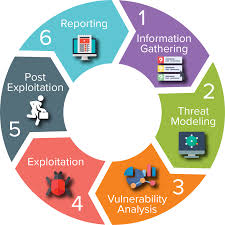
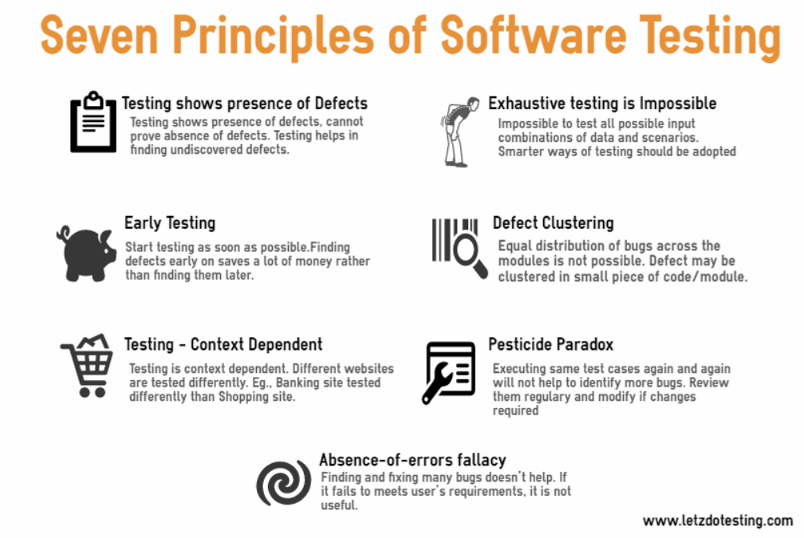
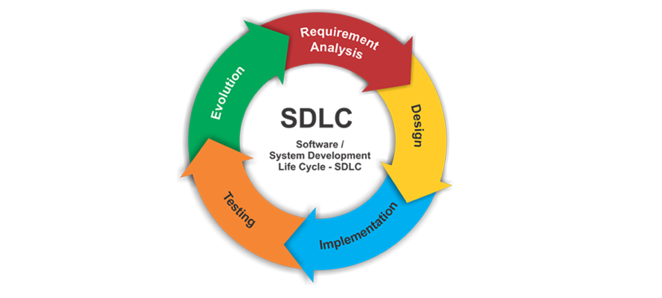

# 第11讲 Web安全技术进阶

本讲介绍Web应用程序渗透测试方法论。

主要内容包括：
- 测试原则
- 测试技术
- 渗透测试内容
- 注意事项
- 案例

## 测试原则(OWASP)

渗透测试的基本原则有：

- 没有银弹
  - 好的测试是能发现更多问题的测试，而测试的再充分也会有很多未发现的问题。
- 从战略层面思考，而不是从战术层面思考
- 软件生命周期（SDLC)是王道
- 及早测试、经常测试
- 理解安全域，例如：信息处于密码、机密、绝密中的哪一级？每一级应当如何测试和保护。
- 以正确的心态进行测试，敢于跳出常规。
- 理解目标
- 使用正确的工具
  - 虽然没有银弹，但还是要尽量使用合适的工具
- 问题存在于细节之中
- 如果可能，要使用源代码
- 建立指标（Develop Metrics）
  - 如果有特殊的安全机制不被开发人员所理解，应当安排更多必要的培训和教育；
  - 每月出现的安全问题不断降低
- 测试结果文档化
  - 参考： https://github.com/juliocesarfort/public-pentesting-reports

## 测试方法

一个测试过程，主要的测试技术包括以下方面：
- 手工检查和复查（Manual Inspections & Reviews）
- 威胁建模（Threat Modeling）
- 代码复查（Code Review）
- 渗透测试（Penetration Testing）

---

渗透测试已经成为多年来测试网络安全性的常用技术。它通常也被称为黑匣子测试或道德黑客。渗透测试本质上是在不知道应用程序本身内部工作的情况下，远程测试正在运行的应用程序以查找安全漏洞的“艺术”。

通常，渗透测试团队可以像访问用户一样访问应用程序。测试人员的行为类似于攻击者，并尝试查找和利用漏洞。

## 渗透测试内容

### 收集应用程序信息
- 分析应用程序
- 测试客户端控件
- 测试验证机制
- 测试会话管理机制
- 测试访问控件
- 测试基于输入的漏洞
- 测试特殊功能的输入漏洞
- 测试逻辑错误
- 测试共享主机漏洞
- 测试web服务器漏洞
- 其他检查
- 检查信息泄露

### 收集应用程序信息

主要包括以下内容：

#### 使用BurpSuite、WebScarab等代理、抓取工具，搜索所有可见的内容

- 通过常规浏览或自动爬取，尝试获取所有的URL、页面。
- 提交每一个表单，执行多阶段功能。
- 尝试在Javascript激活与禁用下浏览页面
- 尝试在Cookie激活或关闭下浏览页面
- 监控HTTP、HTTPS请求和响应。
- 形成站点地图，尝试找到访问不到的内容和功能。

以上内容通过自动工具与手动结合完成，工具可以尝试：
- Burpsuite spider
- WebScarab
- Cabalt Strike等

#### 浏览公共资源
 
- 使用Internet搜索引擎和历史档案（Wayback Machine）高级搜索获取更多内容。
- 使用Google Hack技术提高搜索效率
- 使用Google、Bing、百度等搜索引擎交叉查找，防止遗漏。
- 搜索的关键字包括：
  - html页面内容
  - html源代码中的注释
  - 任何姓名或电子邮件
- 检查已经发布任何WSDL(Web服务描述协议)文件,尝试推测该Web系统使用的功能名称、参数列表。

#### 发现隐藏内容

- 手动执行一些请求，尽可能发现自动扫描无法发现的内容。
- 可以访问一些有效或无效的资源，比较响应结果，推测资源是否存在。
- 获取常见文件与目录名，以及常见的文件扩展名列表。
- 从已知的可见内容中手动分析隐藏内容
  - 猜测程序的命名方案
  - 审查源代码
- 查找默认的内容
- 枚举标识符指定的功能
- 调试参数

### 分析应用程序

主要包括：
- 确定程序功能
- 确定数据入口点
- 确定所用的技术
- 分析可能存在的攻击面

### 测试客户端控件

主要包括：
- 通过客户端传送数据
- 客户端输入控件检查
- 测试浏览器扩展组件

### 测试验证机制

主要包括：
- 了解验证机制
- 测试密码强度
- 测试可用用户名列表
- 测试密码猜测的适应性
- 测试账户恢复功能
- 测试“记住我"等功能
- 测试伪装功能
- 测试用户名唯一性
- 测试证书的可预测性
- 检测不安全的证书传输
- 检测不安全的证书分配
- 测试不安全的存储
- 测试逻辑缺陷
- 利用利用漏洞获取未授权的访问

### 测试会话管理机制

主要包括：
- 了解会话管理机制
- 测试令牌的含义
- 测试令牌的可预测性
- 检查不安全的令牌传输
- 检查在日志中泄露的令牌
- 测试令牌-会话映射
- 测试会话终止
- 测试会话固定
- 检查CSRF
- 检查cookie范围
  
### 测试访问控件

主要包括：
- 了解访问控制要求
- 使用多个账户测试
- 使用有限的权限测试
- 测试不安全的访问控制方法

### 测试基于输入的漏洞
主要包括：
- 模糊测试所有请求参数
- 测试SQL注入
- 测试XSS和其他响应注入
- 测试OS命令注入
- 测试路径遍历
- 测试脚本注入
- 测试文件包含

### 测试特殊功能的输入漏洞
主要包括：
- 测试SMTP注入
- 测试本地代码漏洞
- 测试SOAP注入
- 测试LDAP注入
- 测试XPATH注入
- 测试后端请求注入
- 测试XXE注入

### 测试逻辑错误
主要包括：
- 确定关键的受攻击面
- 测试多阶段过程
- 测试不完整的输入
- 测试信任边界
- 测试交易逻辑
  
### 测试共享主机漏洞
主要包括：
- 测试共享基础架构之间的隔离
- 测试使用ASP主机的应用程序之间的隔离

### 测试web服务器漏洞
主要包括：
- 测试默认证书
- 测试默认内容
- 测试危险的HTTP方法
- 测试代理功能
- 测试虚拟主机配置不当
- 测试Web服务器软件漏洞
- 测试Web应用程序防火墙

### 其他检查
主要包括：
- 测试基于DOM的攻击
- 测试本地隐私漏洞
- 测试脆弱性的SSL加密算法
- 检测同源策略配置

### 检查信息泄露
主要包括：
- 在测试整个过程中，观察记录服务报错信息
- 查找不常见的报错信息，使用搜索引擎搜索这些内容，发现可能的信息泄露问题。
- 使用google代码搜索查找生成特定错误信息的、开源的代码。
- 获得相关第三方组件的名称或栈追踪错误信息。

## 注意事项

- 在测试前，需要告知客户可能造成的影响，要求客户备份数据。
- 一些字符在http请求的不同部分有特殊含义。当修改请求中的数据时，要对字符进行URL编码，要了解URL中的特殊符号，例如：&、=、？、空格、+、;、#、%、空字节。
- 在表单中输入URL编码的数据会导致浏览器执行另一层编码。所以最好使用burpsuite等代理拦截请求，获取真实请求表示。
- 许多查找常见Web应用程序的测试，需要专用输入字符串，并监控应用程序的响应，从中搜索表示漏洞存在的反常现象。
- 应用程序通常会从请求中收集一些状态，这会影响后续请求的响应。测试中要理解这些影响，并构造有效的请求，获得期望响应。这些信息主要在cookies、表单中。
- 很多大型应用采用了负载平衡，我们发出的请求可能被不同服务响应，不同服务的响应差异会影响后续结果。一些成功的攻击将改变处理请求的烛台信息，尝试最佳效果。

## 案例

- https://zhuanlan.zhihu.com/p/65956844
- 