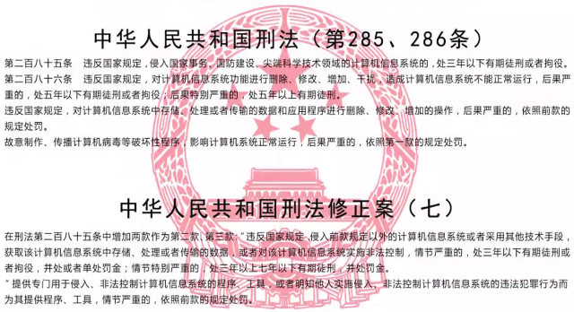
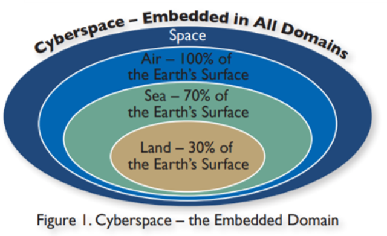
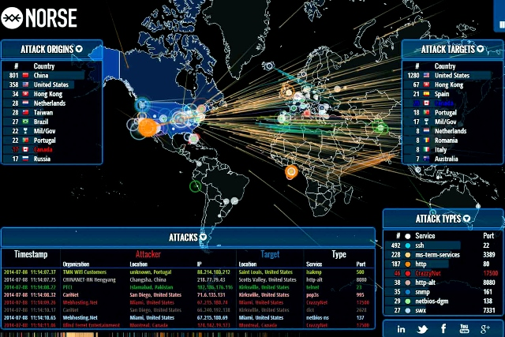
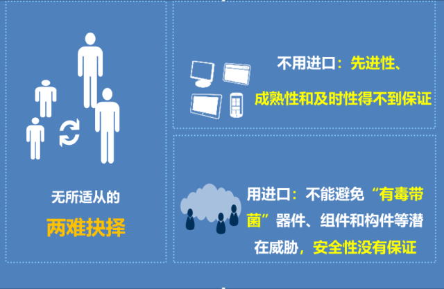
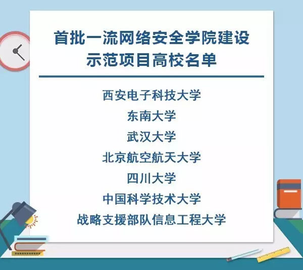
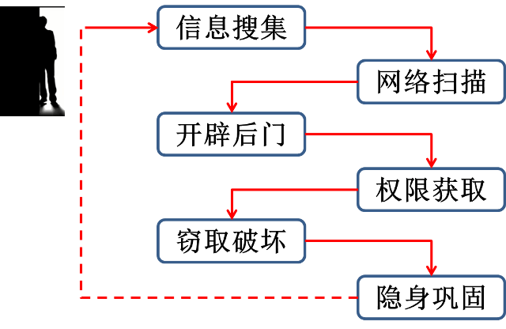
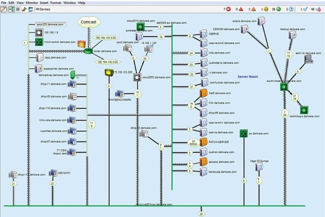

# 第 1 讲 网络空间安全现状与网络攻防基本流程

**严正声明：本课程所学技术仅用于网络安全教学实验，请勿用于其它用途！！！**

## 1 网络空间安全现状

### 1.1 网络空间安全的由来

以互联网为代表的计算机网络，是人类最伟大的发明之一，影响深远、意义重大。随着移动互联网、云计算、物联网的推广普及，互联网引发了新一轮产业革命，这场革命不仅将所有国家地区、所有行业领域、所有的人们紧紧联系起来.

它开启了“网络空间”这个潘多拉魔盒……

### 1.2 网络空间安全的意义

**网络空间安全，已成为全世界关注的热点，成为国家安全的一部分，体现国家整体实力，关乎国家利益和主权。网络和电磁空间成为国家间较量的新战场和新疆域。**

### 1.3 我国面临的窘境

#### 1.3.1 超级病毒

美开发的“震网、毒区、火焰”等病毒和木马都是针对工业控制系统或武器平台的高端网络间谍和攻击工具，传统安全防护手段无法防护这种基于嵌入系统漏洞和后门的非传统安全威胁。

某研究院进口的数控机床稍微调整安装位置，只是几米的距离，设备就不干活了，当摆放回原有位置才能恢复运转……

有充分的理由质疑巨资打造的战略武器系统或先进作战装备究竟在关键时候能否起到战略威慑作用和可靠的实战效果……

#### 1.3.2 新战略威慑

今年，美对我5名技术军官正式提出起诉并发布“全球通缉令”，看似一场抹黑中国的国际闹剧，其实质是在对我军“展示肌肉”搞“技术和心理震慑”，不惜冒“泄露情报手段和来源”的风险，向国际社会出示了多达上千页包含文字和影像材料的不可抵赖证据链”，警示世人：“美国才是网络空间的如来佛，其他的都是毛猴子……”

### 1.4 中国网络安全的发展

早期，民间自发发展...

2014年1月24日，国家安全委员会成立。习近平任主席，李克强、张德江任副主席。目的是推进组建负责情报、军队、外交、公安等的国家安全。与美国总统直属咨询机构——国家安全委员会（NSC）类似。

2014年2月27日，中央网络安全和信息化领导小组成立。习近平任组长，李克强、刘云山任副组长。将着眼国家安全和长远发展，统筹协调各个领域的网络安全和信息化重大问题，研究制定网络安全和信息化发展战略、宏观规划和重大政策，推动国家网络安全和信息化法治建设，不断增强安全保障能力。

之后每隔2年，网信办组织一次大会。

**习主席重要讲话：**
- “网络安全是事关国家安全和国家发展、事关广大人民群众工作生活的重大战略问题。”
- “没有网络安全，就没有国家安全”
- “要从国际国内大势出发，总体布局、统筹安排、创新发展、努力把我国建设成为网络强国。”
- “网络安全和信息化是一体之两翼、驱动之双轮，必须统一谋划、统一部署、统一推进、统一实施。”
- “建设网络强国，要把人才资源汇聚起来。”
- “要有高素质的网络安全和信息化人才队伍。”
- “网信领域可以先行先试，抓紧调研，制定吸引人才、培养人才、留住人才的办法。”
- “培养网信人才，要下大功夫、下大本钱，请优秀的老师，编优秀的教材，招优秀的学生，建一流的网络空间安全学院。”

### 1.5 中国网络安全教育与人才建设

2014年后，中央网信办、教育部会同有关部门，为推动网络空间安全领域的人才培养多次联合发文并组织指导科研机构、企业、社会组织积极支持和参与建设网络空间安全一级学科、一流网络安全学院。各类网络安全培训也因此而涌现…

2015年6月11日，国务院学位委员会 教育部关于增设网络空间安全一级学科。为实施国家安全战略，加快网络空间安全高层次人才培养，决定在“工学”门类下增设“网络空间安全”一级学科，学科代码为“0839”，授予“工学”学位。

2016年，教育部授予29所院校网络空间安全一级学科博士授予点，包括：清华大学、武汉大学、北京交通大学、华中科技大学、北京航空航天大学、中山大学、北京理工大学、华南理工大学、北京邮电大学、四川大学、哈尔滨工业大学、电子科技大学、上海交通大学、西安交通大学…

2017年8月8日，中央网信办、教育部联合印发《一流网络安全学院建设示范项目管理办法》。

## 2 网络安全法规体系

网络安全法律体系是网络法律体系的重要组成部分。网络安全法律体系是由保障网络安全的法律、行政法规和部门规章等多层次规范相互配合的法律体系。网络安全法律体系重点涵盖网络主权、网络关键基础设施保护、网络运行安全、网络监测预警与应急处置、网络安全审查、网络信息安全以及网络空间各行为主体权益保护等制度。网络安全法律在国家治理体系和治理能力现代化以及全球互联网治理体系变革中处于关键地位，既要规制危害网络安全的行为，又要通过促进网络技术的发展以掌控网络的新技术，从而保障我国的网络空间安全，最终目标是维护国家网络空间主权、安全和发展利益。

- 自1994年我国全功能接入国际互联网以来，我们对互联网治理和网络立法的认识有一个循序渐进的过程。
  - 《计算机信息系统安全保护条例》
  - 《计算机信息网络国际联网管理暂行规定》 
  - 这些规定均只是将互联网作为新兴的信息技术对待。
- 2000年以后，人们逐渐认识到互联网强大的媒体属性、商业机会和社会价值。
  - 《电信条例》
  - 《互联网信息服务管理办法》
  - 《电子签名法》（推动了电子商务发展）
  - 《全国人民代表大会常务委员会关于维护互联网安全的决定》（强调网络安全）
- 2014年2月27日，中央网络安全和信息化领导小组成立，我国开始朝着统筹协调、顶层设计、全面依法治网的方向发展。
- 伴随着互联网治理的需要，特别是党的十八大以来，我国网络立法工作取得了较大进展。
  
- 截至2017年5月
  - 与网络信息相关的法律及有关问题的决定51件
  - 国务院行政法规55件
  - 司法解释61件
  - 专门性的有关网络信息的部委规章132件
  - 专门性的有关网络信息的地方法规和地方性规章152件。

我国已经初步形成了覆盖网络运行安全、网络数据安全、网络内容管理、个人信息保护、网络资源管理、网络行业管理、电信服务管理、电子商务、网络侵权、网络犯罪等领域的网络法律法规体系。

此外，中国互联网协会等行业组织还制定了20余个自律性规范。在国际方面，我国也在积极参加和推动与网络安全相关的国际条约，维护我国网络主权和国家利益。

- 2016年颁布的《网络安全法》,
- 正在征求意见的《电子商务法》、《密码法》

我国网络立法工作正处于提速阶段，但就网络安全法律体系而言仍存在一些明显不足，主要体现在以下几个方面：
- 现有法律法规层级低，欠缺上位法和体系化架构设计；
- 政出多门，立法过于分散，部门立法、地方立法缺乏统筹，难以适应网络法治特点和规律；
- 执法能力相对滞后；
- 立法重管理轻治理，重义务轻权利，缺乏对我国参与互联网国际事务的有效支持；
- 网络立法人才极度欠缺，学科支撑基础薄弱。
- 相较欧美一些发达国家近年来加速网络安全立法保护本国利益的做法，我国网络安全立法进度仍显滞后，法律体系还有待进一步完善。

正在出台的配套行政法规主要包括：
- 《网络安全等级保护条例》
- 《关键信息基础设施安全保护条例》
- 《未成年人网络保护条例》
- 《云计算和大数据服务条例》
- 《工业控制系统安全保护条例》
- 《网络信息服务管理法》
- 《个人信息保护法》
- 《电子商务法》
- 《信息通信网络法》
- 《电子政务法》
- 《网络社会管理法》
- 《信息网络传播权保护条例》
- 《儿童个人信息网络保护规定》
- 等等。

## 3 网络攻防基本流程

### 3.1 Step 1  信息搜集（俗称踩点）

目标：尽量多地收集攻击目标信息

有价值的信息：

| 分类   | 相关内容                            |
| ------ | ----------------------------------- |
| 网络类 | 域名、网络IP地址、子网              |
| 主机类 | 运行的TCP/UDP服务，或使用的特殊协议 |
| 防护类 | 访问控制方式、有无IDS/防火墙        |
| 用户类 | 用户姓名、生日、路由表、电话        |

可以从公开渠道获得的一些信息：

- Google、baidu、iana、电话公司等提供的信息服务
- 攻击目标的网页
- 相关组织
- 地理位置细节
- 电话号码、联系人名单、电子邮件、个人详情
- 近期重大事件
- 有表现的信息安全措施、技术
- 心怀不满的员工
- 招聘网站上的个人简历
- 单位附近的楼堂会馆…

### 3.2 Step 2 网络扫描（服务和漏洞）

目标：深入挖掘有用细节信息

扫描内容：
- 网络拓扑结构
- 开放的服务端口
- 可利用的漏洞

网络扫描分类：
- 主机扫描
  - 拓扑扫描
  - 服务扫描
- 漏洞扫描
  - 操作系统漏洞
  - 网络应用漏洞
  - 固件驱动漏洞

主机和端口扫描工具
- Nmap(扫描器之王)
- Superscan
- Xcapy
- 很多……

漏洞扫描工具：
- Openvas
- nessus
- Osmedeus
- Raccoon
- vulscan
- RED_HAWK

#### 3.2.1 漏洞信息获取

漏洞哪里找？

国际安全组织建立的漏洞库：
- BugTraq漏洞库
- ICAT漏洞库
- CERT/CC漏洞库
- SANS漏洞库
- ISS的X-Force漏洞库
- Security focus漏洞库
- CVE(Common Vulnerability and Exposures) 漏洞库等

国内的漏洞库：
- 国家信息安全漏洞共享平台 [cnvd](http://www.cnnvd.org.cn/)
- 国家信息安全漏洞库 [CNNVD](http://www.cnnvd.org.cn)

### 3.3 Step 3 开辟后门（利用漏洞）

目标：利用各种漏洞，“隐蔽”访问目标信息

常用方法：
- 网络欺骗、钓鱼
- 口令破解
- 攻击操作系统
- Web类攻击

### 3.4 Step 4 获得权限

目标：成为合法用户（甚至系统管理员），完成执行特殊程序、创建新用户、留下后门等工作。

例如：
- 增加系统用户
- 改写系统进程，绑定某个需要提权执行的程序

### 3.5 Step 5 窃取破坏

目标：完成各类信息的获取和软硬件的控制与破坏

例如：
- 窃取、删除文档
- 篡改数据
- 毁坏硬件设备

#### 3.5.1 攻击案例：“震网”病毒入侵伊朗

超级工厂病毒攻击核电站的方法是：摧毁核电站的浓缩铀离心机。

为了摧毁离心机，病毒使用了三种方法：
- 在控制浓缩铀离心机的可编程逻辑控制器(PLC)上植入恶意代码，使离心机和汽轮机超速运行，直至高温烧毁；
- 屏蔽监控系统的报警信号，使操作人员不能发现上述异常；
- 平时处于潜伏状态，只有当离心机变频器频率在600-1200Hz间时才激活，以增加隐蔽性。

### 3.6 Step 6 隐身巩固

目标：擦除痕迹，销毁入侵证据，同时安装变异木马，使其不被杀软发现。

常用方法:
- 擦除OS日志、应用服务器日志、防火墙日志、登录日志等
- 对物理磁盘的清除
- 对木马加壳或加密，打乱整个程序的顺序
- 终止安全软件进程
- 修改安全软件的配置文件

## 4 本节实验操作

下载建立虚拟网络安全实验室的所有安全软件和资料。

需要按照的虚拟机系统有：

- vmware workstation
- vmware 虚拟网络管理器配置
- kali 201902
- LAB_win2k3 metasploitable
- LAB_owasp bwa v1.2
- ubuntu server 1604
  

## 5 本讲小结

- 网络空间安全的现状
- 网络安全法规
- 网络攻击的基本过程
  
**信息搜集、网络扫描、开辟后门、获取权限、窃取破坏、隐身巩固**
